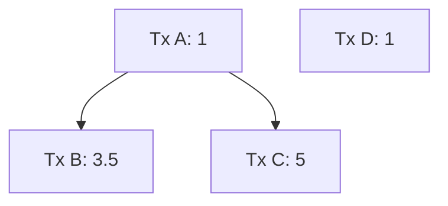
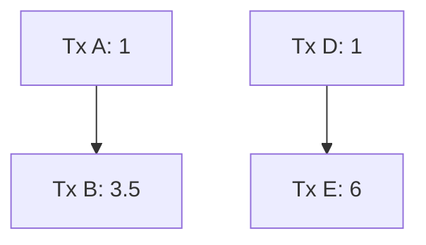
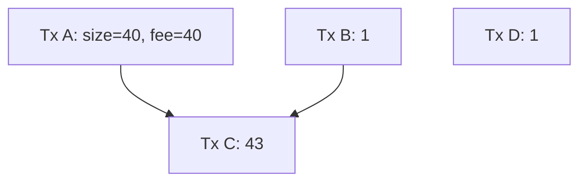

# Cluster Mempool RBF Thoughts

sdaftuar | 2023-11-08 15:38:42 UTC | #1

 

# Background

What should the RBF rules be in a cluster-mempool implementation?  I originally proposed a heuristic involving a new transaction and its conflicts that I thought would be incentive compatible.  Another option is to define a measure on the mempool that we try to optimize.

# Potential ways of evaluating an RBF

## Heuristic proposal

My first proposal of a heuristic for an RBF is to (a) require that the new transaction have a higher mining score than that
of any transaction which would be evicted, and (b) require that the new transaction have a higher total fee than that of
all transactions being evicted.

To implement this, we have to calculate all conflicts (including descendants of direct conflicts), and then construct the
cluster for a candidate replacement, linearize that cluster, and from there we get the new transaction's score. We can compare
that score to that of the conflicting transactions (which are cached in the mempool) to test whether the heuristic is met.

## Mempool metric

An alternative approach would be to ensure that the the mempool that would result from a replacement is
*strictly better* than the current mempool.  

To define *strictly better*, we consider the mempool fee vs. size diagram that we construct by looking at the accumulated size and accumulated fee of each in-mempool chunk, when we sort the mempool's chunks by chunk feerate.  We can compare two diagrams A and B by checking, for each diagram, whether each (size, fee) data point is contained within (or along) the convex hull of the points in the other diagram (that is, connect each pair of successive points in diagram A with a straight line, and test
whether the chunk (size, fee) points of diagram B are inside, outside, or along the lines of diagram A; then repeat in the opposite direction).  In this way, two diagrams can be equivalent (if all points of each are along the lines of the other), or
they can be incomparable (if each has points that lie outside the other), or one can be strictly better (if exactly one diagram contains points that are outside the other diagram).

Example fee vs. size diagram from a live mempool (truncated to first 25 chunks):

With this in mind, we can define an RBF validation strategy by requiring that the new mempool that would result must be strictly better than the current mempool.  To do this, we'd first determine the clusters affected by the replacement (ie the
clusters containing all the conflicts and the cluster(s) that the new transaction would join); we'd calculate the fee vs size diagram for the chunks in those clusters; we'd simulate removing the conflicts and adding the new transaction, and re-cluster/re-linearize those clusters; we'd compute a new fee vs size diagram for the resulting clusters; and finally we'd compare them to see if the new diagram is strictly better.

# Discussion

Ultimately the intuition behind the heuristic is to implement something simple that would capture the improvement described
in the mempool metric. However, it turns out that even with an optimal cluster sort, the heuristic doesn't guarantee that
the resulting mempool will be strictly better than what it replaced.

## Example of heuristic-based rbf not strictly improving the mempool

All transactions are the same size (say, 100 bytes), and the numbers indicate feerate in sat/byte:

In this graph, the optimal sort is [A, B, C],[D] (brackets indicate chunks).  The first chunk has total (size in bytes, fee in sats) = (300, 950), while the second chunk is (100, 100).  (See below for the fee vs size diagram.)

Now consider an RBF that replaces tx C with tx E, as follows:

The optimal sort of this new mempool would be: [D, E], [A, B]. The score of E is 700/200 = 3.5sat/byte, which
is higher than the mining score of C before the replacement (3.17 sat/byte). Also, E pays more total fee than C (600 > 500).

So this replacement would pass the heuristic. However, the fee vs. size diagram for the new mempool (after replacement) has points (200, 700) and (400, 1150).  Let us now compare the old and new mempool diagrams:

Note that the (300, 950) point from the first diagram lies outside the diagram for the new mempool, and so the replacement under these rules did not make the mempool strictly better.

## Mempool metric 

A few questions arise after seeing this example:
1. Is there a simple way to understand why the mempool might not be strictly better off based on the heuristic, and can we add a simple rule that would eliminate the possibility?
2. If not, should we instead just use the fee-size diagram test as our RBF validation metric?  Engineering this correctly will be annoying to do, particularly if we want to avoid linearizing the same clusters multiple times, but fundamentally this shouldn't be an operation that is too slow.
3. Does the fee-size diagram actually capture the right idea?  For instance, would using this as our test allow for more pinning vectors than we have today?  How can we reason about what is happening?

-------------------------

instagibbs | 2023-11-01 13:43:52 UTC | #2

Why test when you can ship?

-------------------------

ajtowns | 2023-11-01 14:10:39 UTC | #3

Shipping is just testing at scale anyway

-------------------------

instagibbs | 2023-11-01 18:21:09 UTC | #4

look at this excellent mermaid diagram rendering

-------------------------

ajtowns | 2023-11-04 11:22:13 UTC | #5

Since this is all suhas's text, I've used admin privileges and modified the owner to be suhas.

-------------------------

sipa | 2023-11-29 18:39:46 UTC | #6

Discussion continued in https://delvingbitcoin.org/t/defunct-cluster-mempool-package-rbf-sketch/171, but then replaced by https://delvingbitcoin.org/t/post-clustermempool-package-rbf-per-chunk-processing/190.

-------------------------

