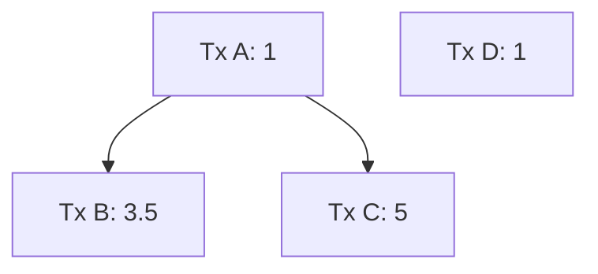
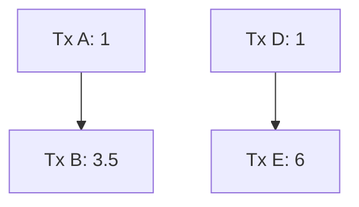
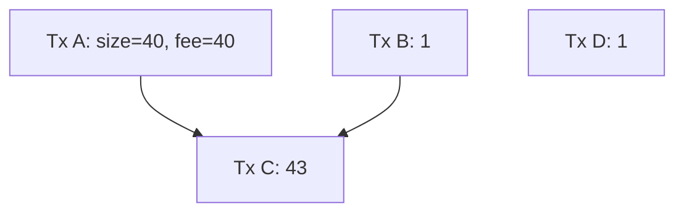
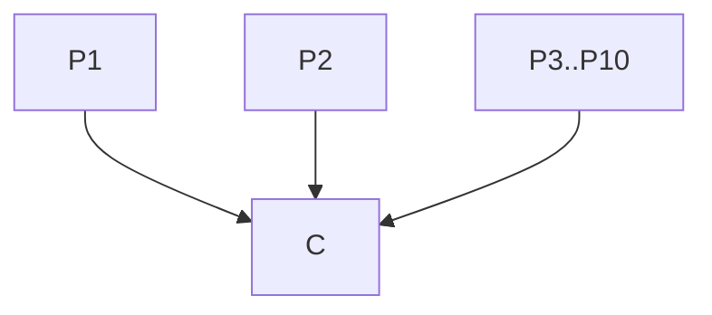
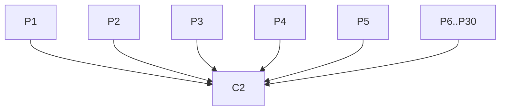
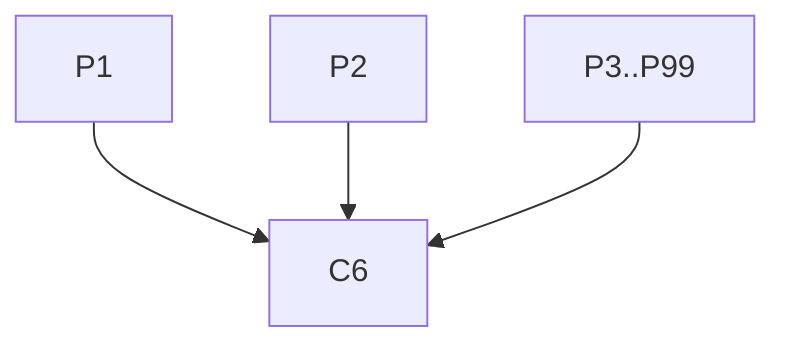
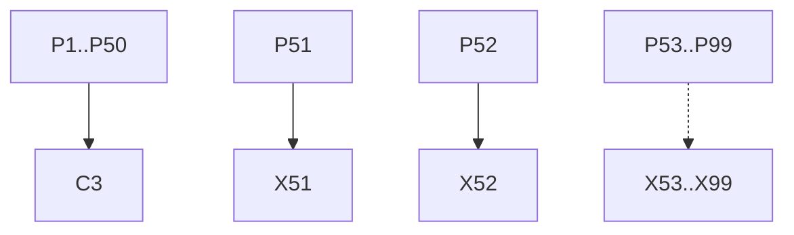
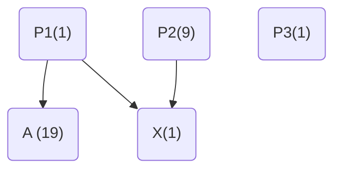
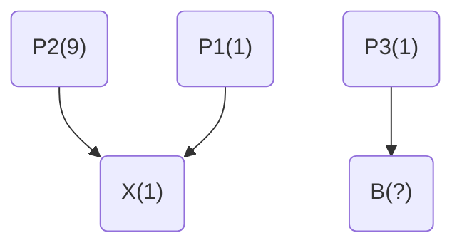

# Cluster Mempool RBF Thoughts

sdaftuar | 2023-11-08 15:38:42 UTC | #1

 

# Background

What should the RBF rules be in a cluster-mempool implementation?  I originally proposed a heuristic involving a new transaction and its conflicts that I thought would be incentive compatible.  Another option is to define a measure on the mempool that we try to optimize.

# Potential ways of evaluating an RBF

## Heuristic proposal

My first proposal of a heuristic for an RBF is to (a) require that the new transaction have a higher mining score than that
of any transaction which would be evicted, and (b) require that the new transaction have a higher total fee than that of
all transactions being evicted.

To implement this, we have to calculate all conflicts (including descendants of direct conflicts), and then construct the
cluster for a candidate replacement, linearize that cluster, and from there we get the new transaction's score. We can compare
that score to that of the conflicting transactions (which are cached in the mempool) to test whether the heuristic is met.

## Mempool metric

An alternative approach would be to ensure that the the mempool that would result from a replacement is
*strictly better* than the current mempool.  

To define *strictly better*, we consider the mempool fee vs. size diagram that we construct by looking at the accumulated size and accumulated fee of each in-mempool chunk, when we sort the mempool's chunks by chunk feerate.  We can compare two diagrams A and B by checking, for each diagram, whether each (size, fee) data point is contained within (or along) the convex hull of the points in the other diagram (that is, connect each pair of successive points in diagram A with a straight line, and test
whether the chunk (size, fee) points of diagram B are inside, outside, or along the lines of diagram A; then repeat in the opposite direction).  In this way, two diagrams can be equivalent (if all points of each are along the lines of the other), or
they can be incomparable (if each has points that lie outside the other), or one can be strictly better (if exactly one diagram contains points that are outside the other diagram).

Example fee vs. size diagram from a live mempool (truncated to first 25 chunks):

With this in mind, we can define an RBF validation strategy by requiring that the new mempool that would result must be strictly better than the current mempool.  To do this, we'd first determine the clusters affected by the replacement (ie the
clusters containing all the conflicts and the cluster(s) that the new transaction would join); we'd calculate the fee vs size diagram for the chunks in those clusters; we'd simulate removing the conflicts and adding the new transaction, and re-cluster/re-linearize those clusters; we'd compute a new fee vs size diagram for the resulting clusters; and finally we'd compare them to see if the new diagram is strictly better.

# Discussion

Ultimately the intuition behind the heuristic is to implement something simple that would capture the improvement described
in the mempool metric. However, it turns out that even with an optimal cluster sort, the heuristic doesn't guarantee that
the resulting mempool will be strictly better than what it replaced.

## Example of heuristic-based rbf not strictly improving the mempool

All transactions are the same size (say, 100 bytes), and the numbers indicate feerate in sat/byte:

In this graph, the optimal sort is [A, B, C],[D] (brackets indicate chunks).  The first chunk has total (size in bytes, fee in sats) = (300, 950), while the second chunk is (100, 100).  (See below for the fee vs size diagram.)

Now consider an RBF that replaces tx C with tx E, as follows:

The optimal sort of this new mempool would be: [D, E], [A, B]. The score of E is 700/200 = 3.5sat/byte, which
is higher than the mining score of C before the replacement (3.17 sat/byte). Also, E pays more total fee than C (600 > 500).

So this replacement would pass the heuristic. However, the fee vs. size diagram for the new mempool (after replacement) has points (200, 700) and (400, 1150).  Let us now compare the old and new mempool diagrams:

Note that the (300, 950) point from the first diagram lies outside the diagram for the new mempool, and so the replacement under these rules did not make the mempool strictly better.

## Mempool metric 

A few questions arise after seeing this example:
1. Is there a simple way to understand why the mempool might not be strictly better off based on the heuristic, and can we add a simple rule that would eliminate the possibility?
2. If not, should we instead just use the fee-size diagram test as our RBF validation metric?  Engineering this correctly will be annoying to do, particularly if we want to avoid linearizing the same clusters multiple times, but fundamentally this shouldn't be an operation that is too slow.
3. Does the fee-size diagram actually capture the right idea?  For instance, would using this as our test allow for more pinning vectors than we have today?  How can we reason about what is happening?

-------------------------

instagibbs | 2023-11-01 13:43:52 UTC | #2

Why test when you can ship?

-------------------------

ajtowns | 2023-11-01 14:10:39 UTC | #3

Shipping is just testing at scale anyway

-------------------------

instagibbs | 2023-11-01 18:21:09 UTC | #4

look at this excellent mermaid diagram rendering

-------------------------

ajtowns | 2023-11-04 11:22:13 UTC | #5

Since this is all suhas's text, I've used admin privileges and modified the owner to be suhas.

-------------------------

sipa | 2023-11-29 18:39:46 UTC | #6

Discussion continued in https://delvingbitcoin.org/t/defunct-cluster-mempool-package-rbf-sketch/171, but then replaced by https://delvingbitcoin.org/t/post-clustermempool-package-rbf-per-chunk-processing/190.

-------------------------

sdaftuar | 2023-12-05 14:05:54 UTC | #7

I'm working on a feerate diagram comparison implementation for (single transaction) RBF and thinking through the constant factors:

The number of different clusters that a single transaction can conflict with will govern how many chunks we have to consider in the feerate diagram comparison.

In theory, the number of such chunks is bounded by # of clusters * # of transactions in each cluster, and the feerate diagram comparison test is linear in the number of chunks that form the two diagrams.

So if we permit a transaction to conflict with 100 in-mempool transactions, and if we permit each cluster to have up to 100 transactions, then we're looking at 10000 potential chunks to iterate.  That seems like it could be slow.

We've also previously discussed getting rid of this limit on number of conflicts, and replacing it with the number of clusters that would need to be relinearized.  I'm no longer sure we'll be able to do that, given this new proposed validation logic.

Are there any tricks we can perform to bring these numbers down?

-------------------------

instagibbs | 2023-12-05 14:34:58 UTC | #8

[quote="sdaftuar, post:7, topic:156"]
We’ve also previously discussed getting rid of this limit on number of conflicts, and replacing it with the number of clusters that would need to be relinearized. I’m no longer sure we’ll be able to do that, given this new proposed validation logic.
[/quote]

Do you mean to say we can do that but 100 clusters would result in up to 10k elements in a diagram check? Or do you mean there's some other issue?

-------------------------

sdaftuar | 2023-12-05 15:42:46 UTC | #9

[quote="instagibbs, post:8, topic:156"]
Do you mean to say we can do that but 100 clusters would result in up to 10k elements in a diagram check? Or do you mean there’s some other issue?
[/quote]

Yeah my only point is that if we get rid of the bound on the number of conflicted transactions altogether, then we are effectively removing the bound on the number of elements in a diagram check (or limiting it to whatever the max number of inputs you could fit into a standard transaction multiplied by the cluster count limit).  

So in this case, we might have to bring down the maximum number of transactions in a cluster as our only lever to cap the amount of work we might have to do...?

-------------------------

ajtowns | 2023-12-05 15:56:26 UTC | #10

[quote="sdaftuar, post:7, topic:156"]
So if we permit a transaction to conflict with 100 in-mempool transactions, and if we permit each cluster to have up to 100 transactions, then we’re looking at 10000 potential chunks to iterate. That seems like it could be slow.
[/quote]

An $O(n)$ operation on two sets of 10k pairs of `int64_t` seems pretty fine? (Maybe add a log(n) factor to combine the clusters) You might need to be clever about generating the set of new clusters efficiently, based on the original set and the conflicted/new transactions, rather than doing it from scratch though?

-------------------------

instagibbs | 2023-12-05 16:01:36 UTC | #11

Assuming these sizes are problematic, the two levers I see are cluster size, and number of allowed clusters to touch.

I think it's less disruptive to just lower the latter to N << 100?

A transaction could still conflict with up to 100 transactions per cluster, up to N clusters.

-------------------------

ajtowns | 2023-12-05 16:06:40 UTC | #12

The $O(n^2)$ step to re-optimise the new chunks has to be performed per cluster (ie, it's $O(bc^2)$ where $b$ is number of clusters, and $c$ is chunks per cluster), so limiting the number of clusters that can be conflicted with would make sense. Affecting many clusters without actually combining those clusters as a result of the RBF seems like it would be unusual behaviour, too?

-------------------------

sdaftuar | 2023-12-05 16:18:06 UTC | #13

[quote="ajtowns, post:12, topic:156"]
Affecting many clusters without actually combining those clusters as a result of the RBF seems like it would be unusual behaviour, too?
[/quote]

Well I have no idea whether this would be unusual or not, but if you generated a bunch of small transaction chains, and then did a single RBF to batch them into one transaction, then you might exactly get this behavior where you are eliminating a bunch of existing clusters in favor of a single new one.

In practice, I think the fees grow so large when conflicting with lots of transactions that this is probably not something that comes up very often, but people have brought up esoteric rbf pinning vectors in the past, so I just want to not preclude something from happening unless we have a specific CPU concern we're dealing with.

-------------------------

ajtowns | 2023-12-05 17:44:23 UTC | #14

[quote="instagibbs, post:11, topic:156"]
Assuming these sizes are problematic, the two levers I see are cluster size, and number of allowed clusters to touch.
[/quote]

If you limit the number of allowed clusters to touch but dropped the ancestor count limit (leaving it implied by the chunk limit), you could get a weird scenario:

Suppose you have a CPFP arrangement to pay for a bunch of txs:

But then you realise there's another 20 txs you want to CPFP, so you RBF C as:

You repeat this until you hat max chunk size:   

And that all works fine: you're merging 21 clusters with C2, another 21 clusters with C3, C4 and C5 and a final 10 clusters with C6.

But what if you didn't see C2, C3, C4 or C5, but had seen P11..P99? C6 alone would look like it was merging 90 clusters, which would presumably be more than the allowed cluster limit. So the rbf from C1 to C6 becomes path dependent: doing it directly fails, but doing it indirectly works.

-------------------------

instagibbs | 2023-12-05 19:00:58 UTC | #15

[quote="ajtowns, post:14, topic:156"]
But what if you didn’t see C2, C3, C4 or C5, but had seen P11…P99? C6 alone would look like it was merging 90 clusters, which would presumably be more than the allowed cluster limit. So the rbf from C1 to C6 becomes path dependent: doing it directly fails, but doing it indirectly works.
[/quote]

Yeah that's kind of annoying in how order-dependent it is, without any external actions by griefing parties.

Another metric could be number of total txs in effected clusters.

f.e. We continue to evaluate an RBF if the ~~number of effected clusters is <= 100 AND~~ number of total effected transactions in effected clusters is <= 2,500.

Would allow "simple" CPFP patterns like @ajtowns writes above up to cluster limits, and still bound the diagram checks? In adversarial case, someone could still package RBF/CPFP ~25 separate clusters, assuming each thing being bumped was part of a max size cluster.

-------------------------

ajtowns | 2023-12-05 18:47:28 UTC | #16

Maintaining the ancestor limit and having it equal the affected clusters limit would let you do simple CPFPs without worrying about RBFs -- anything after C2 paying for P1..P24 would just be non-standard due to the ancestor limit that way, no matter the order.

-------------------------

sdaftuar | 2023-12-05 19:11:17 UTC | #17

[quote="ajtowns, post:14, topic:156"]
But what if you didn’t see C2, C3, C4 or C5, but had seen P11…P99? C6 alone would look like it was merging 90 clusters, which would presumably be more than the allowed cluster limit. So the rbf from C1 to C6 becomes path dependent: doing it directly fails, but doing it indirectly works.
[/quote]

I don't think this scenario poses a problem (but maybe there's another that does).  Originally there were two different limits that I had been thinking about:

1) A limit on the size of the cluster that a new transaction would be part of (eg 100 transactions).  For both RBF and non-RBF situations where a transactions is added to the mempool, we test that the size of the resulting cluster is not too big.  I think that in this example C6 is fine no matter what path of transactions is followed to get there.

2) Some kind of limit on the number of clusters that a new transaction could conflict with. This could be a few different things: (a) just a cap on the number of direct conflicts; (b) a cap on the number of transactions that would have to be evicted (ie both direct conflicts and their descendants); (c) a cap on the number of linearizations we'd have to perform in order to accept a transaction (ie counting the number of clusters that need to be linearized after all conflicts are removed and the replacement transaction is added).

In this example, I don't see how any of these proposed limits (2a, 2b, or 2c) would pose a path-dependence where seeing more RBFs makes C6 easier to get in.

Edit: Forgot to add -- in practice I think we can treat 2c as being limited by 2a, in that if we have at most N direct conflicts, then we have at most N+1 linearizations to perform when adding the replacement.  This is because descendants of direct conflicts are always in the same cluster as the direct conflict, so we clearly have at most N clusters containing transactions that would be evicted.  Also, even if an eviction causes a cluster to split, I think it's fair to say that the polynomial/exponential run-time of the linearization algorithm means that the cost of linearizing a cluster split into k parts is less than k times the cost of linearizing the unsplit cluster, so we can ignore that effect.

-------------------------

ajtowns | 2023-12-05 22:34:37 UTC | #18

You get the same thing if Pn had previously been CPFPed for by different transactions Xn (C2 conflicts with each Xn due to spending the same output of Pn):

replaced by

then have C2 and X31..X50 replaced by C3:

where C2 conflicts with C1, X11..X30; C3 conflicts with C1, C2, X11..X50. Then you hit 2a and 2b if they're below 40 when you go C1 to C3, but not if you got C1 then C2 then C3 (assuming you have C1, P1..99, X1..99 in your mempool initially).

I think as far as linearisation goes, the issue is you need to:

 1. create a diagram for the relevant clusters from original mempool: easy, $O(n\cdot \log(c))$ where $c$ is number of clusters, $n$ is number of txs in the clusters
 2. create a diagram for the post RBF mempool:
     * keep all the old clusters; removing any conflicts. don't worry if they'll end up splitting
     * create a new cluster for the new tx(s); move all related txs from all clusters
     * linearise this new cluster
     * combine what's left from the old clusters and the new cluster into a single diagram
     * compare it

So I'd only count that as "1" linearisation, though you'd probably want to re-linearise all the old clusters you touched after you've decided to accept the RBF before you update the mempool?

-------------------------

sdaftuar | 2023-12-05 22:51:05 UTC | #19

[quote="ajtowns, post:18, topic:156"]
So I’d only count that as “1” linearisation, though you’d probably want to re-linearise all the old clusters you touched after you’ve decided to accept the RBF before you update the mempool?
[/quote]

The algorithm you describe is exactly what I'm trying to do (so that's good!). But when calculating the feerate diagram for the post-RBF mempool, you omitted the re-linearization of all the old clusters that are affected by evictions -- I don't think we can do that?

-------------------------

ajtowns | 2023-12-05 23:02:55 UTC | #20

I was thinking in three steps:

 * just remove the conflicts and related txs and rechunk what's left of the old clusters, without relinearising $O(n)$
 * combine those chunkings to produce a new diagram and compare it with the current diagram $O(n\log(c))$. if the diagram's not better, throw it away, reject the RBF, all done
 * if it is better; split and re-linearise the old clusters, and update the mempool $O(\frac{n^2}{c})$

Relinearising before comparing the diagrams would make RBFing slightly cheaper/easier in complicated cases, but I don't think we need to do that, and deferring the $O(n^2)$ steps until we know we're doing something to improve the mempool seems worthwhile?

-------------------------

sdaftuar | 2023-12-06 15:15:05 UTC | #21

I think that if we don't re-linearize what is left of the old clusters, that we might open the door to some RBF pinning scenarios that otherwise wouldn't exist.

Imagine you are doing an RBF where you are replacing one low fee parent with another (perhaps one lightning commitment tx + child vs another?).  Old tx graph (feerates in parens, all txs same size):

This 2-cluster tx graph would have mempool chunks with feerates [10, 9, 1, 1].

And then you want to consider replacing A with B:

Assuming B's feerate is going up, then if we didn't relinearize the cluster containing A, the mempool chunks we'd get from this graph would have feerates: [(R(B)+1)/2, 5, 1]. If you were to relinearize, you'd instead get [(R(B)+1)/2, 9, 1, 1].

Using the feerate diagram test as our RBF metric, if we don't relinearize, then I think you could just increase the size of P2 (and leave it at the same feerate) in order to increase the feerate required for B to be accepted.  Not sure exactly what the mathematical relationship is, but this strikes me as a bad outcome?

Update:

I did a quick check to see how high I could get the required feerate of B based on the (a) size of P2 (holding feerate constant), and (b) the feerate of P2 (in the range of 1-9), assuming we do/do not relinearize the old cluster when processing an RBF.

Changing P2's size, fixing P2 at feerate 9:

| P2's size| Min fee bump with relinearization | Min fee bump without relinearization|
|--|--|--
| 1| 1 | 4 |
| 2| 1 | 6 |
| 3| 1 | 6 |
| 4| 1 | 7 |
| 8| 1 | 8 |
|9 & higher| 1 | 8|

Changing P2's feerate, fixing P2 at size 1:
| P2's feerate| Min fee bump with relinearization | Min fee bump without relinearization|
|--|--|--
| 1| 1 | 1 |
| 4| 1 | 2 |
| 6| 1 | 3 |
| 8| 1 | 4 |

-------------------------

