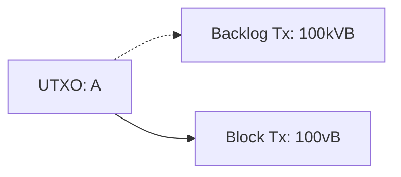

# Opt-in transaction policies for anti-pinning

instagibbs | 2024-02-22 03:32:11 UTC | #1

(copied from a gist)

"Free Relay"
=
In transaction relay we are trying to avoid "free relay" which is roughly defined as:

```
(total_sats_in_mempool + total_sats_mined) / total_bytes_relayed < minrelay
```

Did the sum total of bytes we've been accepting to our mempool and propagating across
the network pay for the "bandwidth" to do so, dubbed `minrelay` which is a static value
at 1 sat/vbyte?

Therefore, if we for example remove bip125 rule#3 in a naive fashion, this can
be violated simply by filling the bottom of the mempool with 1 sat/vbyte junk,
then double-spending all of with minimum sized transactions at slightly higher
rates, e.g., 2 sat/vbyte.

This can be problematic in adversarial and time-sensitive scenarios such as Lightning
Network tranasctions, both "commitment" and "HTLC" transactions which each have timelines
to be mined safely. The counter-party can intentionally slow down mining of these
transactions, and not pay for the privelage to do so, by putting these rule#3 pins
at the bottom of the mempool that can become evicted.

Opt-in policies
===

Instead of working around rule#3 directly, we can instead allow wallets to add
"prior restraint" to features of the transaction that may mitigate these issues.

"V3"
===

The "V3" transaction type is proposed specifically as this kind of policy. If nVersion==3,
this means the topology for this transaction in the mempool is highly restricted.
The tx may have up to one ancestor and one descendant total, which implies
a strict upper-bound parent-child relationship of size two. The child transaction
is additionally restricted to 1 kvB. This is deemed large enough that a child
can bring reasonable amounts of funds to do package RBF, but two orders of magnitude
smaller than the upper-bound possible (101kvB) in packages. This reduces the pin
effect by roughly 250-500 times, making pins hopefully impractical.

Very importantly, the parent transaction size is unrestricted.

This transaction type works well specifically for things such as commitment
transactions, in which utxos are locked into smart contracts between only
the authorized spending parties, and no ANYONECANPAY like behavior is allowed.
This precludes its usage in today's LN HTLC transactions, without a significant
rewrite of how they work to include (Ephemeral?) anchors, and the resulting 
additional vbytes in the commone non-pinning case.

Ephemeral anchors additionally allow:
1) 0-value anchors
2) "sibling eviction", which allows other outputs of transactions to not require "1 CSV"
      hacks that are common in things such as LN BOLTs to avoid package limit pinning.
      This saves bytes, and allows these outputs to be directly spent immdaitely as fees.
But relies on "V3" for its topological restrictions to ensure (2).

See more discussion on Ephemeral anchors and its relation to SIGHASH_GROUP fore more background:
https://lists.linuxfoundation.org/pipermail/bitcoin-dev/2023-January/021334.html

Cluster Mempool
===

With the cluster mempool, we have the ability to efficiently order the entire
mempool, both in eviction and the mining. This can be efficiently updated incrementally
for each transaction added and removed from the mempool. Since the mempool
is completely ordered for mining at each step, we can efficiently simulate mining
N blocks, and give the necessary "mining scores" required for each chunk to
be included in that range of the mempool.

Transaction Priority Opt-in
===

Once you have a mapping from chunk mining score to "top N blocks", the system is
fairly straight forward.

Users commit to the "N" in their transaction input(?). The proposed transaction
is relayed, a node simulates adding the transaction to the cluster, runs linearization
algorithm, has the resulting mining score, checks that the "N" computed is higher
than any committed to in the transaction. If so, it's let into the mempool. If not,
it's simply rejected.

Subsequent descendants to that tranasaction must also conform to the most restrictive
ancestor's "top N block" chunk restriction, or they will be rejected.
Therefore both "ancestor junk" and "descendant junk" are prevented.

The downside to this method is if the pinner somehow gets lucky when the mempool is empty,
adds their top-of-mempool tx that is "too large", the mempool fills, then the initial
transaction is now a pin. f the attacker can predict when a mempool will naturally
fill, they could perhaps time this, but they risk getting mined, which defeats the purpose
of the attack. I think in practice this is not a realistic concern, but
requires further consideration.

Prior restraint via "V3" like means don't have the same issue, but the "V3" topological
restrictions are also more weakly motivated from a wallet usage perspective, so it's
something that has to be weighed.

Don't forget that lack of topological restrictions means batch CPFP is back on the
table.

Takeaway
===

"V3" by itself may be subsumed by priority transactions, but in conjunction with Ephemeral
Anchors still can make a lot of sense for:
1) sibling eviction usage when the base transaction cannot be directly conflicted
2) and when signers are committing to multiple "state" outputs
and don't want to "sap" value from the smart contract itself (mixing funds and fees).

Bonus? SIGHASH_GROUP
===
This method seems to naturally slot into SIGHASH_GROUP anti-pinning. A transaction input commits
to the "top N blocks" policy, and the rest of the constructed transaction is otherwise
unrestricted.

Alternatively, restricting based on "max size of cluster" means you're putting
prior restraint on yourself with respect to BYOF, batched bumps, etc. Similar
to V3 constraints.

Thought experiment: Are "V3" and Epehemeral anchors use-cases entirely subsumed by SIGHASH_GROUP + priority?

-------------------------

ajtowns | 2023-11-08 02:11:55 UTC | #2

[quote="instagibbs, post:1, topic:159"]
# Opt-in policies

Instead of working around rule#3 directly, we can instead allow wallets to add “prior restraint” to features of the transaction that may mitigate these issues.
[/quote]

I guess the concern I have with this is some rules we have that create pinning vectors align with "miner incentives", and if miners are incentivised to enforce those rules, then they'll just work around any rules we create to reintroduce those pinning vectors?

How about imagining an alternative relay network structured like this:

 1. nodes maintain a mempool consisting of up to 1MvB of txs that's the predicted next block
 2. new txs/package are accepted when they improve the mempool's total fee
 3. txs/packages are relayed on if they're accepted

Such an approach would be obnoxious in some ways: when a new block comes in, your entire mempool becomes invalid, and you need to validate a new block's worth of transactions ASAP in order to be able to produce new block templates, eg. Handwave that problem away for now.

Would such a relay network work? I think so:

 * node operators: the risk of free relay here becomes minimal, because blocks will contain every tx in the mempool, and blocks are found probabilistically, so your bandwidth is unlikely to be used for spam
 * miners: this directly optimises for the next block fee
 * users: pinning vectors are minimised; though there's no provision for adding your tx to the backlog and getting it mined eventually

This approach would perhaps be incompatible with non-consensus "prior restraint" features though: miners and users could easily just remove those features and maintain a network like this.

Because such a network would be optimal for miners/users, I think that implies that it will be implemented (eventually), so node operators will (eventually) need to design around the problems/limitations such a network would create.

Could you add some sort of a backlog back into this approach?

The most significant problem with doing so is that any given block could invalidate up to about 1GvB of txs from the backlog, by replacing many maximum size txs (100kvB) in the backlog by minimum size txs in the block (100vB):



This is already possible, though it requires actually mining a block. With a relay network of the type described here it would become easier in two ways: you don't need to manually find a cooperating miner, and when there is a long delay between blocks you could cycle multiple GvB of replacement transactions through the backlog, while only having to actually pay once a block is found.

One approach to allowing a backlog while reducing the impact of free relay might be to make backlog relay unreliable. For example: for a tx that's in the top x% of the backlog, relay it with (100-x)% probability. If an unrelayed tx moves up from position x to position y, perhaps relay it with probability (1-y/x)%. In that case, when replacing 1GB of mempool you've likely only actually relayed 50% of those txs. Choosing a different relay distribution (ie, biassing towards relaying at the top of the backlog, and against relaying at the bottom of the backlog) could reduce that amount further.

Presuming nodes aggressively rebroadcast txs once they move from the backlog into the next-block-mempool, that likely provides good protection against pinning: it makes it easy to find a node that doesn't have a conflicting tx already in its backlog (since the conflicting tx has low fee, and is thus less likely to be relayed); once the tx is accepted into some node's backlog, it'll remain there; and once the tx becomes acceptable for the next block, it will be aggressively relayed and removed the attempted pin from other nodes' backlogs.

Perhaps a way of thinking about this would be:

 * nodes will aggressively try to sync the top MvB to maximise fee revenue
 * txs that don't pay a high enough fee get considered for the backlog; in that case they must be "polite" -- smoothly incresing the fees of the total backlog, etc
 * but the backlog is deliberately non-uniform, so that it's easy to send a double-spend to some peer, provided the tx it's double-spending is relatively low in the backlog
 * conflicts amongst different peers' backlogs are resolved when one of the double-spends makes it to the top of the backlog, and a block gets mined

Max tx size, ancestor count/size, min incremental fee, etc are still enforced both for next-block txs as well as backlog txs. 

Would something along those lines be crazy? I really feel like "pinning" is a fundamental design bug...

-------------------------

instagibbs | 2023-11-08 15:17:46 UTC | #3

[quote="ajtowns, post:2, topic:159"]
I guess the concern I have with this is some rules we have that create pinning vectors align with “miner incentives”, and if miners are incentivised to enforce those rules, then they’ll just work around any rules we create to reintroduce those pinning vectors?
[/quote]

Part of my thinking on this priority based system is that it seems to be closer to compatible than V3 style, in that if it profits the next N blocks(let's say very small numbers only), I think it basically approximates the type of selective relay you suggest, just in an opt-in manner? Bonus is a user can't complain their tx isn't showing up on their block explorer, they opted into not being relayed if miners don't want to bother!

[quote="ajtowns, post:2, topic:159"]
This approach would perhaps be incompatible with non-consensus “prior restraint” features though: miners and users could easily just remove those features and maintain a network like this.
[/quote]

I don't see what's incompatible? Miners would include a tx if it's in the top, and not include if not. 1MvB is the strictest possible setting, and better for the user that doesn't want to be pinned as long as they're aggressively bumping fees on whatever schedule they need. The problem would be if miners decide to relax this restriction, allowing a potentially junkier backlog build. I don't know why miners would want to do that.

[quote="ajtowns, post:2, topic:159"]
One approach to allowing a backlog while reducing the impact of free relay might be to make backlog relay unreliable.
[/quote]

I'd have to think way harder on this, but I don't think this is a crazy direction, no. I am not sure I'd even call it free relay, if we're relaying less. We might need a more concrete definition, but pushing down how much we relay to prevent free relay seems right!

[quote="ajtowns, post:2, topic:159"]
I really feel like “pinning” is a fundamental design bug…
[/quote]

*handwave cluster mempool into existence*

An alternative and unbaked selective relay take could be to not only weigh the "depth" it is in the mempool/backlog, but also "how many vbytes away from top block" it is with respect to its preceding chunks in the cluster.

If a newly proposed chunk in a cluster linearizes to "just after" top block chunks, and the new chunk itself is below Y kvB, where the size is not >> "smallest reasonable package attempts", we accept and relay it. Taking V3 magic values for this example, we could allow 1 kvB "extra" in clusters. An adversary pays top block to stuff a cluster, or pays minfee to fill up the last 1 kvB which can be efficiently RBF'd, at least as well as V3 child txns can.

In this scenario, we could just make "large" lower fee chunks relay unreliably. Casual users making smaller txns would not be effected unless they do consolidations or longer chains, depending on the Y you pick which directly influences the amount of pinning possible.

-------------------------

