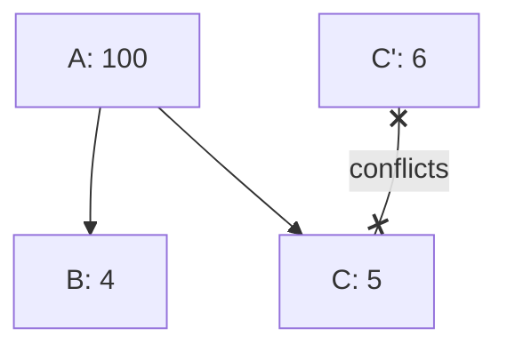
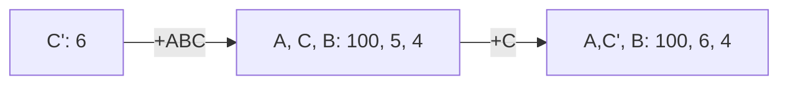
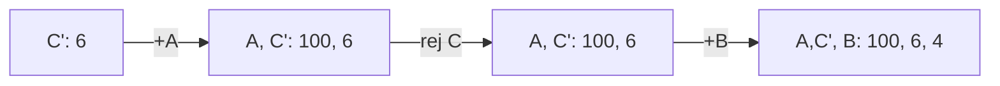

# [DEFUNCT] Post-clustermempool Package RBF

sipa | 2024-02-22 03:32:11 UTC | #1

Follow-up to https://delvingbitcoin.org/t/cluster-mempool-package-rbf-sketch/171.
Superseded by https://delvingbitcoin.org/t/post-clustermempool-package-rbf-per-chunk-processing/190.

# Design for post-clustermempool Package RBF rules. 

A new package comes in (consisting of a set of transactions `PKG`). Ignore for now how the P2P side happens.

* 0. **Deduplication**: remove from `PKG` any transaction that's already in the receiver's mempool.
* 1. **Pre-linearization**: linearize (what remains of) `PKG` (so *without* in-mempool dependencies).
* 2. **Pre-eviction**: remove from `PKG` any chunk whose feerate is below `mempoolminfee` or below `incremental_relay_feerate`. [DoS protection]
* 3. Gather `CON`, the set of in-mempool conflicts with (what remains of) `PKG`. If `CON` is non-empty:
  * 4. Gather `OLD`: the union of all in-mempool clusters that contain `CON` or contain ancestors of `PKG`.
  * 5. Compute `NEW = OLD - CON + PKG`.
  * 6. **Relay check**: `fee(NEW) >= fee(OLD) + incremental_relay_feerate * size(PKG)`. [DoS protection]
  * 7. **Linearization**: linearize all clusters in `NEW` (note that there can be multiple).
  * 8. **Diagram check**: verify that the fee-size diagram of `NEW` is nowhere worse than that of `OLD`, and at least better in one place. [incentive compatibility]
  * 9. **Tail check**: (only if `tail_feerate >= incremental_relay_feerate`): verify that `fee(NEW) >= tail_feerate * (size(NEW) - size(OLD)) + fee(OLD)`. [incentive compatibility]

* 10. **Verification**: verify all transactions in `PKG` using policy/standardness rules, against UTXOs gathered from chain, mempool, and `PKG` itself.

(At this point the package is valid)

* 11. **Eviction** Drop all of `CON` from mempool.
* 12. **Addition** One by one, add the transactions of `PKG` to mempool performing consensus validation.

In the above, wherever a linearization occurs, fail the package if it involves a cluster that exceeds cluster count limit. Also fail the package whenever a cluster would be created that exceeds the cluster size limit.

# Open questions

* Q1. Do we need to run the sequence of operations inside (3) separately for each connected component inside `PKG` rather than all of (the remainder of) `PKG`  at once? Doing so would prevent some situations where there are two subpackages, one making a cluster a lot better, and one making another cluster somewhat worse, in such a way that the overall package is an improvement. On the other hand, this cannot possibly discover all cases where a combination of old and new transactions are better than both just old or just new.

* Q2. More generally, is this "good enough"? One example is this: assume a new package is received consisting of transactions A(feerate 100), B(depends on A, feerate 4), C(depends on A, feerate 5). In the mempool we already have C'(feerate 6). Assuming a sufficiently low `mempoolminfee`, the package (A,B,C) will replace C' according to the rules above. Yet, if C' gets relayed again, it would evict C, and you'd end up with (A,B,C'). This isn't free relay: both replacements are paid for, can only happens once (each), and both strictly improve the mempool. Some degree of subpackage validation could catch this (and/or result in the final version being reached immediately), as could chunk merging of `OLD` with `NEW`, but there almost certainly exist more complicated examples where the optimal mix of old and new cannot be found naively.

-------------------------

instagibbs | 2023-11-08 22:44:10 UTC | #2

How does `minrelay` fit into this paradigm?

[quote="sipa, post:1, topic:173"]
**Pre-eviction**: remove from `PKG` any chunk whose feerate is below `mempoolminfee` or below `incremental_relay_feerate`. [DoS protection]
[/quote]

I think this links back to our conversation yesterday. If you have two same-unit-size txs, A and B, where A is 0-fee, B is 1 fee, and `mempoolminfee` is 1, then B would be accepted when submitted by itself, but rejected as a package `A+B`. In this scenario of course, we're only considering "chunks" since we're not connecting the package to the mempool clusters. 

Once this check is run, we know everything in these chunks "pays for itself", and can continue on safely, even if `A+B` ends up with a chunk score less than `minrelay`.

[quote="sipa, post:1, topic:173"]
**Verification**: verify all transactions in `PKG` using policy/standardness rules, against UTXOs gathered from chain, mempool, and `PKG` itself.
[/quote]

I assume this is where scripts are being run as well?

[quote="sipa, post:1, topic:173"]
**Addition** One by one, add the transactions of `PKG` to mempool performing consensus validation.
[/quote]

What kind of failures are possible here if any?

I assume `TimeToSize` is another step we want, after 12.

edit: misunderstood the Q2 scenario, deleted

-------------------------

ajtowns | 2023-11-09 00:30:37 UTC | #3

[quote="sipa, post:1, topic:173"]
**Pre-eviction**: remove from `PKG` any chunk whose feerate is below `mempoolminfee` or below `incremental_relay_feerate`. [DoS protection]
[/quote]

Anything done before script-validation isn't really DoS protection, it's just an optimisation?

[quote="sipa, post:1, topic:173"]
**Verification**: verify all transactions in `PKG` using policy/standardness rules, against UTXOs gathered from chain, mempool, and `PKG` itself.
[/quote]

[quote="sipa, post:1, topic:173"]
(At this point the package is valid)
[/quote]

"At this point the package is *desirable*" perhaps? We've established it's got a nice feerate, etc, but not done the consensus checks from 12, so it may actually be garbage. Could call it the "qualification" stage or something.

[quote="sipa, post:1, topic:173"]
Q1. Do we need to run the sequence of operations inside (3) separately for each connected component inside `PKG`
[/quote]

I think we should do something along these lines for packages received over p2p, as otherwise it seems like something you could use for targeted tx eviction? But that could be as simple as restricting p2p package relay to packages made up of a single tx and its ancestors?

[quote="sipa, post:1, topic:173"]
Q2. More generally, is this “good enough”? One example is this:  [...]
[/quote]

Pictures:

Treating `A+B+C` as a unit has your mempool do this:

Doing ancestor-first package acceptance would work for this case: your mempool would be:

Maybe you can do ancestor-first package acceptance via chunking? Once you linearise `NEW` go through the chunks with new txs in order, and add just those txs to the mempool; updating `OLD`, `NEW` and `CON` as you go? If you get a chunk that's not worth adding to the mempool (or that fails validation), abort completely.

-------------------------

sipa | 2023-11-09 01:33:55 UTC | #4

[quote="instagibbs, post:2, topic:173"]
I think this links back to our conversation yesterday. If you have two same-unit-size txs, A and B, where A is 0-fee, B is 1 fee, and `mempoolminfee` is 1, then B would be accepted when submitted by itself, but rejected as a package `A+B`. In this scenario of course, we’re only considering “chunks” since we’re not connecting the package to the mempool clusters.
[/quote]

I'm not sure I understand the example. Do A and B depend on each other? Is one in the mempool already? 

[quote="instagibbs, post:2, topic:173"]
I assume this is where scripts are being run as well?
[/quote]

Indeed.

[quote="instagibbs, post:2, topic:173"]
What kind of failures are possible here if any?
[/quote]

None, if all goes well. The consensus checks are there for (a) priming the script/validation cache and (b) being absolutely sure that no cases exist where standardness checks permit something that consensus does not.

[quote="instagibbs, post:2, topic:173"]
I assume `TimeToSize` is another step we want, after 12.
[/quote]

Indeed.

[quote="ajtowns, post:3, topic:173"]
Anything done before script-validation isn’t really DoS protection, it’s just an optimisation?
[/quote]

Do you mean doing this pre-eviction *here* (as opposed to later) is an optimization? If so, I may agree. But not removing (and not otherwise outlawing) sub-`mempoolminfee` stuff in packages would constitute a DoS risk, I believe (free relay by continuously replacing the bottom tx in the mempool at $\epsilon$ feerate increments). This gets stopped by increasing `mempoolminfee` *above* the evicted transactions' feerate when eviction happens, so that anything new accepted into it is (for the time being) strictly higher feerate.

[quote="ajtowns, post:3, topic:173"]
“At this point the package is *desirable*” perhaps? We’ve established it’s got a nice feerate, etc, but not done the consensus checks from 12, so it may actually be garbage.
[/quote]

Unless our code is broken, standardness checks (done in (10)) are strictly more restrictive than the consensus checks in (12). These last ones are just for priming the validation cache and a last-ditch protection against bugs in standardness validation that could make it less restrictive than consensus.

[quote="ajtowns, post:3, topic:173"]
Maybe you can do ancestor-first package acceptance via chunking? Once you linearise `NEW` go through the chunks with new txs in order, and add just those txs to the mempool; updating `OLD`, `NEW` and `CON` as you go? If you get a chunk that’s not worth adding to the mempool (or that fails validation), abort completely.
[/quote]

There are many things that *can* be done to find a better combination of `OLD` and `NEW` things than exactly the package as relayed indicates. They include:
* Running an $O(n^2)$ chunk merging algorithm on the old and new linearization.
* Running an actual conflict-aware $O(2^n)$ linearization algorithm that finds the best (or approximation thereof) feerate subset in the combination.
* Requiring the peer to give us their full cluster linearization, which we could just accept if it looks good.
* ...

But all of these are either incomplete, high-bandwidth, or computationally infeasible for all but the smallest cases. We could do relatively cheap improvements, but they will still permit "undesirable" more complex situations like this. Or we can restrict cluster/replacement sizes so much that we can always find the optimal combination.

However, I'd rather not get into a discussion of what approaches to consider without knowing what *good enough* is. Are there attacks possible without any improvements over the package relayed as-is? Note that if the peer is malicious, it's ok to do something suboptimal as long as it doesn't prevent us from accepting the "right" solution later from an honest peer. And if it's good enough, maybe we don't need to bother with patching up simple and obvious suboptimalities. And if it's not good enough, then patching only the simple cases likely still leaves other cases that are still not enough.

-------------------------

instagibbs | 2023-11-09 02:12:09 UTC | #5

[quote="sipa, post:4, topic:173"]
I’m not sure I understand the example. Do A and B depend on each other? Is one in the mempool already?
[/quote]

Yes a simple cluster of size two. My point was whether or not `A` is in the mempool already changes the result of an attempt to submit `A+B`. If `A` is already there, `A` is deduplicated and `B` is accepted, if not, both `A` and `B` are rejected.

-------------------------

instagibbs | 2023-11-09 14:48:49 UTC | #6

[quote="sipa, post:4, topic:173"]
None, if all goes well. The consensus checks are there for (a) priming the script/validation cache and (b) being absolutely sure that no cases exist where standardness checks permit something that consensus does not.
[/quote]

For readers are home, this is also how it's done today. I'd forgotten.

-------------------------

ajtowns | 2023-11-09 20:20:31 UTC | #7

[quote="sipa, post:4, topic:173"]
I’d rather not get into a discussion of what approaches to consider without knowing what *good enough* is.
[/quote]

"There are levels of [good enough] that we are prepared to accept"

Something that works moderately better than what we have today, that only changes the edge cases would be "good enough" in one sense -- it doesn't even have to support package RBF at all to achieve that, eg?

I'd would **like** to end up with something that can offer some level of an anti-pinning guarantee; like:

 * If you have a package of txs, with total size $s$ paying feerate $f$; and
 * The package is "small" and "simple" according to some set of rules; and
 * There does not currently exist more than $X$ vB of valid txs that pay more than $X(f-d)$ in fees in total for some $X$, $d$; and
 * You are a required co-signer of all the txouts spent by a package; and
 * You will refuse to sign various potential double-spends of those txouts per some set of rules that still allows for some RBF, and without necessarily be a co-signer of all the outputs you're creating;
 * Then you can be sure your package of txs will propagate widely, and either it or one of the double-spends will have been mined already, or be included in block templates once the block min fee drops below $f$

[quote="sipa, post:4, topic:173"]
Note that if the peer is malicious, it’s ok to do something suboptimal as long as it doesn’t prevent us from accepting the “right” solution later from an honest peer.
[/quote]

That requires that an honest peer actually knows enough to even try relaying the right solution. Are we assuming we're reconciling the top of the mempool, or rebroadcasting txs when we notice conflicts or something? I don't really think relying on a good samaritan running custom software is really good enough there...

[quote="sipa, post:4, topic:173"]
And if it’s not good enough, then patching only the simple cases likely still leaves other cases that are still not enough.
[/quote]

Depends -- if it's possible to define what the simple cases are, and design your wallet/protocol so you only hit the simple cases, then I think that could be "good enough".

-------------------------

ajtowns | 2023-11-14 16:54:13 UTC | #8

[quote="ajtowns, post:7, topic:173"]
That requires that an honest peer actually knows enough to even try relaying the right solution.
[/quote]

FWIW, I lightly convinced myself that trying to find the best subset of a proposed package is probably too hard (ie, depends on the state of all affected clusters in the mempool, and if replacement is involved, there's no nice greedy way of working out which part to try first).

So in that case, I think maybe something like this could work?

 * Get a proposed package from a peer. Resolve any missing parents. Try adding it to your mempool atomically via the method described at the top of this thread -- if it evicts something it shouldn't, that's fine -- two steps forward, one step back still adds up to one step forward.
 * Update your clusters, relinearise, do cheap optimisations.
 * Relay the newly added transactions (individually) to your peers.
 * If any of your peers ask for you to give them an "ancestor" package for a tx `T`, find the chunk that `T` is in, and give them a package containing all the txs in that chunk as well as all those txs' in-mempool ancestors. (Then they do the same thing, and repeat)

I think that approach would minimise the spread of unnecessary-evictions, while also being fairly simple. Changing "ancestor" packages to "chunk" packages is a bit hand-wavy, but I don't think requires different messages compared to the current bip 331 draft?

Push-relay of chunk packages might allow you to propagate hard-to-find optimal chunks across the network though. One way to get "infinite computation" might be to use the p2p network as a distributed system -- each node picks a random cluster that's near the top of the mempool to optimise every now and then, and if they find something good, they spread it out to everyone.

-------------------------

instagibbs | 2023-11-14 17:34:57 UTC | #9

[quote="ajtowns, post:8, topic:173"]
One way to get “infinite computation” might be to use the p2p network as a distributed system – each node picks a random cluster that’s near the top of the mempool to optimise every now and then, and if they find something good, they spread it out to everyone.
[/quote]

some nodes could also simply choose to run optimal sort up to max cluster size and gossip these

-------------------------

sipa | 2023-11-14 20:10:10 UTC | #10

~~Forum organization question: @sdaftuar and I have a new proposal to replace this one (pretty much the "do it per chunk" like AJ suggested before) with some justification and also a new example that shows its limitations. Should I just replace the description, or is it better to start a new topic?~~

EDIT: see new topic https://delvingbitcoin.org/t/post-clustermempool-package-rbf-per-chunk-processing/190

-------------------------

ajtowns | 2023-11-15 01:38:45 UTC | #11

New topic seems like the right choice; it's also possible to turn a post into a "wiki" but I haven't tried that out

-------------------------

