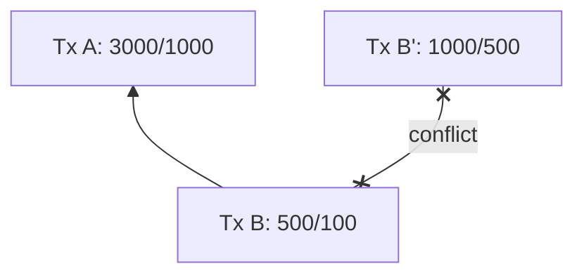
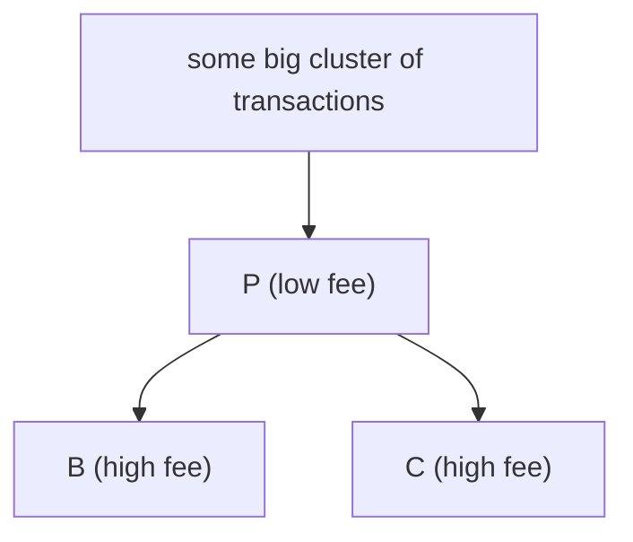
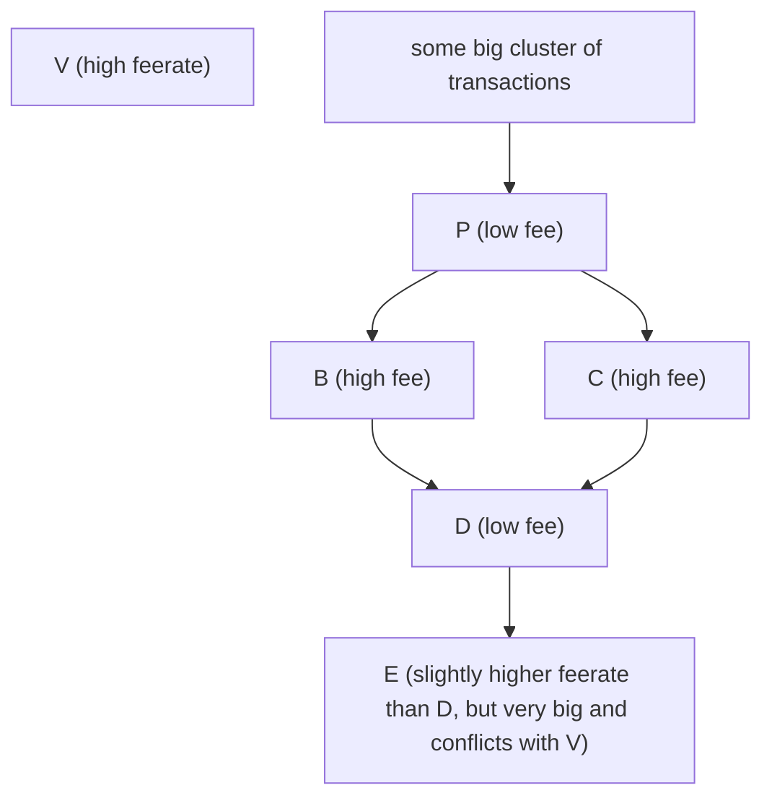

# Post-clustermempool package RBF: per-chunk processing

sipa | 2024-04-25 20:27:27 UTC | #1

Successor to https://delvingbitcoin.org/t/post-clustermempool-package-rbf/173. I felt starting over in a new topic is a bit cleaner.

### Starting from a minimal design

As a thought experiment, start with a minimal design: the relayed package must be a single chunk (when not considering in-mempool ancestors) after linearization, and it is only ever considered in its entirety, or not at all. This avoids the complexity of trying to optimize finding the best subset to take subject to DoS constraints, is sufficient for the one-parent-one-child case, and computationally speaking, only involves a single feerate diagram comparison (the most potentially expensive step). I feel this would be a perfectly reasonable candidate design to consider for a first implementation.

A straightforward generalization of this is possible: if the relayed package (excluding in-mempool ancestors) after linearization consists of multiple chunks, process them completely separately (exactly as if they were submitted one by one). This makes it not gratuitously reject packages due to the receiver unexpectedly splitting the linearization up as a result of having some subpackage already, but beyond that doesn't provide any "quality" that package-must-be-one-chunk wouldn't have. It's also not computationally worse - if multiple diagram checks are too expensive, processing can be interrupted (like GETDATA etc.) between chunks to limit P2P message processing latency. And since it's exactly equivalent to an attacker just giving multiple packages, there is no additional DoS concern either.

Maybe that generalization is actually what we want already.

### Resulting proposal

To be explicit, here is what that would amount to for a received package (set of transactions) `PKG`:

* 1. **Deduplication**: remove from `PKG` any transaction that's already in the receiver's mempool.
* 2. **Pre-linearization**: linearize (what remains of) `PKG` (so *without* in-mempool dependencies).
* 3. **Splitting**: For each chunk `CNK` in that linearization (in order of decreasing feerate):
  * 4. **Limiting**: If `feerate(CNK) < max(mempoolminfee, incremental_relay_feerate)`, stop processing (of this and all further chunks). This is necessary to avoid tiny-increment replacements at the bottom of the mempool, and can cheaply be done early on. This only works because any low-feerate suffix of the linearization will, if accepted to the mempool, become a low-feerate set there too (and possibly even lower, if it's merged with other things). Thus, this lets us efficiently predict and prevent additions to the mempool that would be below its minimum feerate. This aspect does not work pre-clustermempool.
  * 5. **Conflict-finding**: find the set `CON`, the in-mempool conflicts with `CNK`.
  * 6. **Replacement checks**: Only necessary if `CON` is non-empty:
    * 7. **Relay check**: If `fee(CNK) < fee(CON) + incremental_relay_feerate * size(CNK)`, then the replacement does not pay for relay of the chunk. If so, stop processing this chunk and continue with further ones (which may fail due to having dependencies in this failed chunk).
    * 8. **Tail check**: if `fee(CNK) < fee(CON) + tail_feerate * (size(CNK) - size(CON))`, the replacement worsens the bottom of the mempool, so continue with the next chunk. This check is only necessary if `tail_feerate > incremental_relay_feerate`.
    * 9. **Gather OLD**: the union of all in-mempool clusters that contain elements of `CON`, or contain ancestors of `CNK`.
    * 10. **Compute NEW**: `NEW = OLD - CON + CNK`.
    * 11. **Linearization**: linearize all clusters in `NEW` (note that there can be multiple; a replacement can split up clusters).
    * 12. **Diagram check**: verify that the fee-size diagram of `NEW` is nowhere worse than that of `OLD`, and at least in some place better. If not, the replacement is not necessarily an improvement to the mempool, and continue with the next chunk.
  * 13. **Verification**: verify all transactions in `CNK` under standard/policy rules (including script verification). If this fails, continue with the next chunk. Otherwise, the chunk is a valid and desirable addition/replacement to the mempool.
  * 14. **Eviction** Drop all of `CON` from the mempool (if any).
  * 15. **Addition** Add all of `CNK` to the mempool, performing consensus validation to prime execution/script caches, and have a last-resort check that consensus validity is implied by policy validity.
  * 16. **Interruption** If needed, interrupt processing to allow other peers' messages 

### Good enough?

The result of this whole thing is that it does result in a limited "find better subset of new package to accept" over only considering all/nothing of package, but this seems more of a side-effect of trying to make sure things don't gratuitously break when the receiver's mempool differs, than being a goal on itself.

Another observation is that this does *not* permit earlier chunks' replacements to pay for the relay of later chunks (every chunk needs to pay for itself), but it *does* permit replacements within one chunk to pay for the later transactions in the same chunk. Consider this example (`sats/bytes` notation, `mempoolminfee=1 sat/byte`):

If only `B'` is in the mempool already, then the package `A,B` will be accepted by the above rules, because 'A' helps pay the fee for the relay of `B'`. If however `A,B'` were in the mempool already, then `B` would not be accepted as the net fee would be negative (and thus certainly not enough to pay for the relay of `B`).

Because `B` is "appropriating" the fee from `A` to pay for the relay of `B'`, the replacement breaks if the receiver already has `A`. In principle, that means an attacker that sees `A,B` could choose to only pass on `A` to a victim, resulting in `B` becoming (semi-permanently) unacceptable to the victim. This may be undesirable to the author of `B`, but nothing can be done about this without fundamentally different anti-DoS rules. It's only possible to be more restrictive and not permit the replacement at all (e.g. by trying to split chunks up into even smaller pieces if they're below `mempoolminfee`). Instead, I believe the observation is just that appropriation of parent fees cannot be guaranteed to work, as it depends on how nodes see the transactions packaged up, so users should be advised to avoid it (and it's rather strange anyway, perhaps there aren't really use cases for it regardless).

And I think that's also a justification why it is acceptable that this *wouldn't* work across chunks: since appropriation cannot cannot be relied on for the same reason (receiver may have higher chunk already), we don't need to spend effort on making appropriation work well (but if it's easier to permit it, like within-chunk, that's also not a problem).

~~I'm not sure it is also acceptable that it doesn't work across chunks in the other direction. It seems reasonable that we'd want to permit child fees to pay for evictions necessary for their parents. If so, if the **Relay check** (7) fails, instead of stopping of processing, perhaps the loop can continue, but with the combination of all unprocessed chunks so far as `CNK`? That actually starts to sound a lot like the approach from PR26711, except gathering until DoS checks are satisfied, rather than gathering until feerate checks are satisfied.~~ EDIT: this is likely not necessary, and leads to complex interactions between feerate and fee checks.

In a way, this design is pretty much taking what we're allowing today (submitting a transaction one by one), but now also permit grouping transactions together as little as possible while retaining the newly desired functionality: that higher-feerate children can be grouped with their parents at processing time.

-------------------------

ajtowns | 2023-11-15 01:47:18 UTC | #2

[quote="sipa, post:1, topic:190"]
It seems reasonable that we’d want to permit child fees to pay for evictions necessary for their parents.
[/quote]

I don't think it's terrible to say "if you want child fees to pay for the parent to be accepted, the child's fee rate needs to be greater than the parent's fee rate" -- at that point the linearisation should put the child and parent in the same chunk and you're good? That seems like a pretty easy rule for wallets to follow as well.

-------------------------

sipa | 2023-11-15 02:14:52 UTC | #3

It's true; that's quite possibly sufficient. But it's not *naturally* true either, because fee and feerate are separate dimensions: the child could be high fee but low feerate; making it go into the same chunk as the parent could be quite expensive in that case.

If we wanted to permit this (and the "gather chunks until relay rule satisfied" approach isn't broken in other ways), it wouldn't be a high computational cost. The expensive part is the linearization step (10), and that doesn't need running until a relay-acceptable collection of chunks is found

-------------------------

ajtowns | 2023-11-15 03:05:41 UTC | #4

Could we reasonably pass that information on when relaying after accepting to the mempool though? We'd need to either recognise that the latter chunk pays DoS-fees for the higher-priority chunk; or we'd need to track "orphaned for DoS reasons" collection and retry chunks when high-fee child chunks are announced?

Just seems like something we could easily skip initially and introduce later as an improvement if warranted -- it's not a regression, and probably not likely to be particularly common? KISS, etc.

(I agree that it seems feasible and there are cases where it would be useful if it worked reliably)

-------------------------

sdaftuar | 2023-11-15 16:07:56 UTC | #5

[quote="ajtowns, post:2, topic:190"]
I don’t think it’s terrible to say “if you want child fees to pay for the parent to be accepted, the child’s fee rate needs to be greater than the parent’s fee rate”
[/quote]
I agree with this, for a couple reasons.

First, I think it would be nice if we come up with an easy-to-understand description of how packages should be thought of by wallet software, and coming up with a description of a single chunk ("highest feerate topologically valid subset"?) seems much easier than some combination of chunks.  Relatedly, if we think of package relay as increasing our smallest processing unit from a single transaction to something bigger, it seems best to me if we make that bigger unit the smallest thing we need to achieve the use cases we want.  I think a single chunk probably passes that test.

Also, I think that if we were to allow lower feerate chunks to satisfy the anti-DoS rules for a higher feerate chunk, that (a) this would result in a great deal of additional complexity in our implementation (we would want to check that any chunks that get bundled together for validation are actually connected, to avoid unrelated transactions from interacting in unexpected ways), and (b) this could also permit higher feerate chunks to satisfy the incentive compatibility rule (ie feerate diagram test) for lower-feerate chunks.  This strikes me as potentially undesirable.

Two last points: 

A way to deal with point (b) above could be, when iterating over chunks from highest to lowest feerate, to first gather chunks together until the DoS rules are satisfied.  However this would lead to situations where a parent chunk would be better off by having a slightly lower fee to NOT pass the DoS rules on its own, so that it could be bundled with a lower feerate chunk and gain some help with the incentive compatibility test, which would be an unexpected property of our validation.  

Finally, I think we get some unnecessarily bizarre situations that come up with usage patterns that mix RBF and CPFP together -- if a user is able to RBF a (parent) transaction in the first place, there is no need for CPFP.  If somehow the parent transaction is low fee, then a CPFP might make sense to be packaged with the parent so that the combination can RBF something else. However, it seems surprising that a user might need to be able to make more transactions that are chained off the parent or existing CPFP, at a lower feerate, and somehow want the combination to be processed as a package-rbf-unit.  In those situations, users should just RBF the child to bring the fees in that they need!

So my overall view on this is that we should just restrict our validation logic to operating on single chunks, and if our p2p code supports relaying transactions that are bigger than chunks, that we do the natural thing of first breaking them up into chunks, and processing those chunks individually.

-------------------------

instagibbs | 2023-11-15 18:54:49 UTC | #6

this all seems reasonable, though I'm getting flashbacks to 26711 :smiling_face_with_tear:

[quote="sdaftuar, post:5, topic:190"]
So my overall view on this is that we should just restrict our validation logic to operating on single chunks
[/quote]

I think this also goes back to what I think you phrased something like "we pick our most incentive compatible thing, then do DoS checks to accept/reject". The alternative strategy strikes me as the other direction, where we search for something DoS-compatible, then pick the most incentive compatible of that.

Like 26711, this proposed per-chunk evaluation would allow easier "catch-up" even if the relayed package was somehow too large for the cluster itself.

For a first-cut we could limit ourselves to a single RBF attempt per package, catching more RBFs could be punted for future work if diagram check is expensive.

[quote="sipa, post:1, topic:190"]
**Verification**: verify all transactions in `PKG` under standard/policy rules (including script verification). If this fails, continue with the next chunk. Otherwise, the chunk is a valid and desirable addition/replacement to the mempool.
[/quote]
If we get some "malicious" failure like signature failure I think it makes sense to drop the rest of the package potentially. ala 26711.

-------------------------

sipa | 2023-11-15 19:13:35 UTC | #7

[quote="sdaftuar, post:5, topic:190"]
Also, I think that if we were to allow lower feerate chunks to satisfy the anti-DoS rules for a higher feerate chunk, that (a) this would result in a great deal of additional complexity in our implementation (we would want to check that any chunks that get bundled together for validation are actually connected, to avoid unrelated transactions from interacting in unexpected ways), and (b) this could also permit higher feerate chunks to satisfy the incentive compatibility rule (ie feerate diagram test) for lower-feerate chunks. This strikes me as potentially undesirable.
[/quote]

Right, this feels wrong.

[quote="instagibbs, post:6, topic:190"]
I think this also goes back to what I think you phrased something like “we pick our most incentive compatible thing, then do DoS checks to accept/reject”. The alternative strategy strikes me as the other direction, where we search for something DoS-compatible, then pick the most incentive compatible of that.
[/quote]

Indeed, trying to aggregate chunks is definitely in the direction of "search within DoS-compatible solutions", which I believe is the wrong way to go. If we'd have spare cycles, and somehow considered doing something more computationally expensive, it should be searching aggregates of chunks (or subsets of chunks) for better incentive-compatibility - not DoS-compatibility.

[quote="ajtowns, post:2, topic:190"]
I don’t think it’s terrible to say “if you want child fees to pay for the parent to be accepted, the child’s fee rate needs to be greater than the parent’s fee rate” – at that point the linearisation should put the child and parent in the same chunk and you’re good? That seems like a pretty easy rule for wallets to follow as well.
[/quote]

Continuing my thought from yesterday, the example with a high-feerate small parent chunk that evicts more than it pays for and low-feerate child that would pay for it. If this is actually a goal, instead of raising the feerate of the child chunk, one can also just attach a small high-fee additional transaction to the parent chunk. So perhaps that makes it not that much of a concern (even if a use case exists, which I'm not convinced about).

So overall, let's stick with chunk per chunk.

[quote="instagibbs, post:6, topic:190"]
If we get some “malicious” failure like signature failure I think it makes sense to drop the rest of the package potentially. ala 26711.
[/quote]

What if it's a failure due to recent softfork or so?

-------------------------

ajtowns | 2023-11-16 02:44:48 UTC | #8

[quote="sipa, post:7, topic:190"]
[quote="instagibbs, post:6, topic:190"]
If we get some “malicious” failure like signature failure I think it makes sense to drop the rest of the package potentially. ala 26711.
[/quote]

What if it’s a failure due to recent softfork or so?
[/quote]

Hmm, a possible example:

 * Node X: supports taproot, some annex features, mempool=300MB, minfee=10sat/vb
 * Node Y: support taproot only, mempool=1GB, minfee=5sat/vb
 * Tx P: normal taproot tx, feerate=6sat/vb
 * Tx C: uses new annex feature when spending P, feerate=20sat/vb

X will only accept P because it's CPFPed by C and will put them in the same chunk, and perhaps relay them together; but Y will reject C because it can't validate the new annex feature that C is using.

However, if our logic is:

 1. X accepts new txs P and C
 2. X sorts txs by depth/ancestor count, then fee rate, so P then C
 3. X considers relaying P: it's above Y's minfee, so relay it
 4. X considers relaying C: it's above Y's minfee, relay it too

Then Y will accept P at step 3 and reject C at step 4 and everything is fine. And if X was relaying to Z which was running the same software/parameters as X, it would look like:

 1. X accepts new txs P and C
 2. X sorts txs by depth/ancestor count, then fee rate, so P then C
 3. X considers relaying P: it's below Z's minfee, so skip it
 4. X considers relaying C: it's above Z's minfee, relay it
 5. Z does orphan resolution, asking for C's chunk
 6. X says the chunk is P+C
 7. Z requests P
 8. Z accepts new txs P and C

Note that if Z decided to reject C, there wouldn't be much point reconsidering P -- if it has been above minfee, it would have already been relayed in its own right.

-------------------------

sipa | 2023-11-18 01:38:40 UTC | #9

I realized that the relay check and tail check can be started in terms of CNK and CON, rather than NEW and OLD. I've reordered them to the beginning of the inner loop, before the construction of OLD and NEW.

-------------------------

instagibbs | 2023-11-22 17:03:43 UTC | #10

[quote="sipa, post:1, topic:190"]
* 1. **Deduplication**: remove from `PKG` any transaction that’s already in the receiver’s mempool.
[/quote]

speaking of this step, I'm wondering if it would make sense to consider same-txid-different-wtxid as an RBF conflict? Today we simply drop the new tx and report the existing wtxid in the mempool.

Post-cluster mempool if the conflicting tx is larger, dedup it with smaller. If it is smaller than existing and is in a new chunk that satisfies the package RBF rules, I think wtxid-replacement works naturally without introducing free relay. As a side benefit it "prefers" smaller witnesses for relay, reducing benefits of witness stuffing, e.g., inscriptions during a coinjoin.

-------------------------

sipa | 2023-11-27 12:44:27 UTC | #11

One result of this approach that we discussed IRL is the following example: a package consisting of a parent transaction (which would be acceptable on its own) with a CPFP child (raising the parent's chunk feerate) while also conflicting with a large third transaction without paying its relay cost.

In this case, relaying the parent alone would be accepted, but in conjunction with the child it isn't.

If this is a problem, there are approximate solutions, like after chunking the relayed package, seeing if any of the parentless transactions in the chunk on their own meet the mempoolminfee, and if so, process them as a "chunk" on their own.

-------------------------

glozow | 2023-11-27 15:59:13 UTC | #12

[quote="sipa, post:1, topic:190"]
**Verification**: verify all transactions in `PKG` under standard/policy rules (including script verification). If this fails, continue with the next chunk. Otherwise, the chunk is a valid and desirable addition/replacement to the mempool.
[/quote]

Quick clarification: is this step happening for all transactions in `CNK` or in `PKG`? I understood this to be within the chunk loop?

-------------------------

instagibbs | 2023-11-27 15:59:21 UTC | #13

[quote="sipa, post:11, topic:190"]
In this case, relaying the parent alone would be accepted, but in conjunction with the child it isn’t.
[/quote]

A similar non-conflict case would be a series of cpfp bumps, where the last one would cause the cluster to become too large. The whole chunk would be rejected even if any of the bumps were sufficient for entry.

-------------------------

sdaftuar | 2024-05-23 14:35:30 UTC | #14

There's a potential pinning issue introduced by using feerate diagram comparisons alone as our RBF tool, which I wanted to describe so we don't forget this when we get to doing general package RBF.

Imagine a transaction $V$ with high feerate that's already in the mempool.  An adversary is looking to replace $V$ with some low-feerate, high fee transaction that will be expensive to replace (due to the total fee test).

Using the package RBF scheme described here, one possible way for the attacker to do this would be to prepare some big cluster that has  more transactions in it than we can optimally linearize.  Within it, imagine that we have some part of the transaction graph that (say) looks like this:

This might go undiscovered as a good single chunk in our linearization, because our heuristics might have a hard time picking this up (eg it's overlooked in ancestor feerate sorting).  However, a single transaction that spends $B$ and $C$, even at a very low feerate, will cause the set to be considered and possibly improve the overall linearization quite a lot.  So imagine an attacker constructs two transactions, $D$ and $E$, where $D$ spends $B$ and $C$, while $E$ conflicts with $V$:

We could imagine that merely *looking at* $D$ being added to the cluster causes the cluster's feerate diagram to improve (because we discover the chunk $[P, B, C]$), so that the RBF that considers adding $D$+$E$ vs $V$ succeeds -- even though the good transactions which lead to the improvement *were already in the mempool that contains $V$ as well*.

And then once $E$ is in the mempool, it's expensive for $V$ to replace it... Pinning complete. :frowning: 

Really, the attacker is able to exploit two things in this scenario:
1) Being able to run the linearization algorithm one extra time compared with the existing mempool.  If we do a bounded search, say, getting more search time can randomly cause a better linearization to be found, which benefits the new transaction when compared with the old.
2) Being able to exploit limitations of our linearization algorithm. An attacker can intentionally construct a cluster that will linearize poorly using our various heuristics, but when a new leaf transaction is added suddenly sorts better.

Also, this problem exists with how I envisioned single-transaction RBF to work as well (imagine $D$ and $E$ were a single transaction, rather than two, which conflicts with $V$).  We're exploring whether it might be possible to fix the single-RBF case by requiring the chunk feerate of the new transaction to be better than its conflicts, but I am not sure any such heuristic would work in the package RBF case without being too draconian.

-------------------------

instagibbs | 2024-05-23 14:57:34 UTC | #15

[quote="sdaftuar, post:14, topic:190"]
by requiring the chunk feerate of the new transaction to be better than its conflicts
[/quote]

I am supposing you mean *direct* conflicts?

-------------------------

