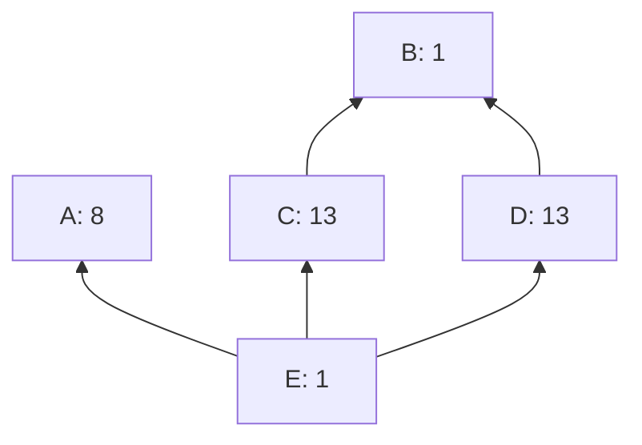
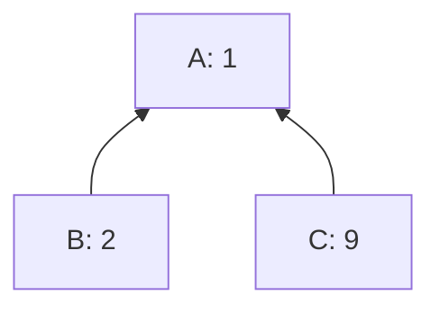
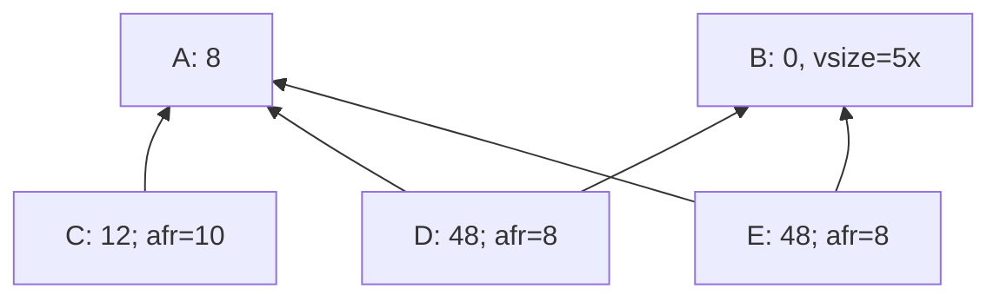
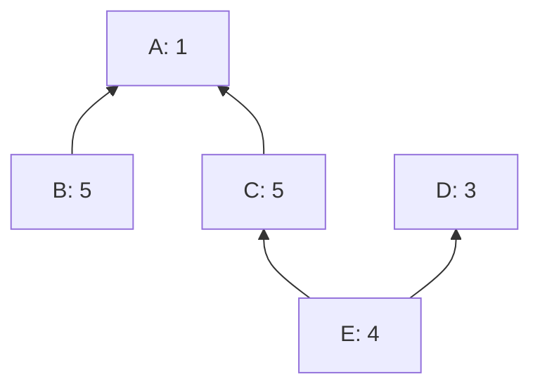

# Linearization post-processing (O(n^2) fancy chunking)

sipa | 2023-11-18 19:11:20 UTC | #1

### Cluster processing overview

So far we've thought of the process of processing clusters as:
* Run a linearization algorithm on the cluster (outputting a valid, and hopefully decent, topological ordering for its transactions).
  * The linearization algorithm internally repeatedly invokes a "find high-feerate topologically-valid subset" algorithm (which could be ancestor set feerate based, or an exponential search algorithm), adding its results to the output.
* Then run an $\mathcal{O}(n)$ chunking algorithm, which partitions the linearization into chunks that can be included in blocks at once. Intuitively: start with every transaction in its own chunk, and then repeatedly merge subsequent chunks where the second one has higher feerate than the first until no such pairs are left. In more detail, the algorithm is:
  * Start with an empty list of chunks.
  * For each transaction *tx* in the linearization:
    * Create a new chunk at the end of the list with just *tx*.
    * While there are at least two chunks, and the last one has higher feerate than the one before it:
      * merge the two chunks.

Since at most *n-1* merge operations can take place, the inner while loop can run at most *2n-1* times, making this $\mathcal{O}(n)$.

### Chunking can go bad

In the context of [per-chunk package RBF](https://delvingbitcoin.org/t/post-clustermempool-package-rbf-per-chunk-processing/190), it is becoming more important that the chunks that come out are "sane". We'd expect that with a decent linearization algorithm choice, this would be the case, but it turns out it's not too hard to find bizarre examples.

All transactions are the same size, number is feerate:

Ancestor-set based linearization gives order [A,B,C,D,E]. The chunking algorithm turns this into [ABCD,E]. However, ABCD consists of two disconnected components (A and BCD). Of course the optimal order is [B,C,D,A,E] which would get chunked as [BCD,A,E], but ancestor-set linearization does not discover this.

In the context of RBF policy it is probably undesirable that A and BCD would get processed simultaneously.

### A better chunking algorithm

To address this, it is possible to amend the chunking algorithm so that it can guarantee that the resulting chunks are always connected. Instead of merging two chunks when the second one has higher feerate, only do that if there is a dependency between the two chunks. If not, swap the two chunks. In more detail:

* Start with an empty list of chunks.
* For each transaction *tx* in the linearization:
  * Create a new chunk with just *tx* in it at the end of the list.
  * Make the variable *work* point to this newly created chunk.
  * While *work* is not the first chunk in the list, and *work* has higher feerate than the chunk before it:
    * If *work* depends on its predecessor:
      * Merge *work* and its predecessor in one chunk
      * Continue with *work* pointing to this merged chunk.
    * If *work* does not depend on its predecessor:
      * Swap the positions of the *work* chunk and its precessor.
      * Continue with *work* pointing to the same (now moved) chunk.

This can perform $\frac{n(n-1)}{2}$ swap operations, which makes the algorithm have complexity $\mathcal{O}(n^2)$. If applied to an already-optimal linearization however, no swaps will take place, making the result $\mathcal{O}(n)$. Based on fuzz-based searching, it appears possible that the number of swaps can remain quadratic for ancestor-based linearization.

To see why this is correct, observe that this never merges disconnected components, so that alone guarantees that the result consists of connected chunks. For it to be a valid chunking, it also needs to have monotonically decreasing feerates. This is a loop invariant: if we assume this is true before a new tx is processed, it's only every untrue for the *work* variable, which gets resolved before continuing with the next transaction.

This algorithm does more than just preventing connected chunks though; it swaps things, possibly making the resulting feerate diagram actually better. In fact, it *always* makes the feerate diagram strictly better everywhere, or doesn't affect it at all. It never worsens the diagram, or result in something incomparable. The cluster depicted above is also the simplest example (that I can find) for which this new algorithm improves the result.

Despite that, the quality of the input linearization still matters. For example:

The optimal chunking (and one which ancestor-based linearization plus naive chunking would find) is [AC,B]. However, if the (terrible) linearization [A,B,C] were to be given to this fancier algorithm, it would just result in the single chunk [ABC]. This is because after merging [AB] with [C], it doesn't consider splitting off [B] again. As a result, we cannot use this algorithm as a replacement for linearization - doing so would sometimes result in worse chunkings than ancestor-based would.

### As a postprocessing step

This algorithm can be considered as an improved version of the chunking algorithm, but it can also be conceived of as a post-processing algorithm for linearization. In this case it would operate on a list of lists of transactions rather than a list of chunks, but otherwise it remains the same. This has the advantage of outputting a linearization that the naive chunking algorithm (with lower complexity) can turn into the correct chunks again. In some cases it may be useful to be able to perform operations on the linearization that do not need a full relinearization, but only a rechunking.

Given that even ancestor-set based linearization is quadratic, having a (fast) postprocessing step for it with the same complexity is probably not too bad. Furthermore, re-running this postprocessing step on the output does only require linear time, so it may be desirable to remember the post-processed linearization.

When used in this manner, the algorithm also improves the linearization at a sub-chunk level, which may be useful when packing the very end of a block. There are other solutions too, though.

-------------------------

ajtowns | 2023-11-17 02:26:24 UTC | #2

Hmm, I've mostly been thinking of linearisation and chunking as synonyms -- you never do one without the other, and once you're done you only deal with chunks, not individual txs.

Feels to me like it might be possible to build up chunks from ancestor scoring directly (so create a graph of single-tx chunks; merge the chunks that cpfp each other greedily by ancestor fee rate; update anc fee rates as you go, which may result in other chunks cpfp'ing newly merged chunks; then sort the resulting chunks by their final score), but trying to write it down, it doesn't seem much simpler compared to the approach you're suggesting.

I think a simple-ish case this still wouldn't catch is:

(ie A,C,D,E are all the same size, B is 5x that size, A pays 8 in fees, C pays 12 in fees, etc)

The ancestor linearisation is A,C,B,D,E (picking C then D then E), and (I think) the new algorithm would produce a single chunk with score 12.89, but it would be more optimal to generate ABDE,C with scores 13 and 12.

Think that's just saying "this isn't optimal in all cases" though, which isn't really news.

-------------------------

sipa | 2023-11-17 03:44:58 UTC | #3

Regarding chunking and linearization being the same thing: @sdaftuar has told me his implementation does in some places modify linearizations directly (when splitting clusters), after which only a rechunking is needed, and not a full relinearization. Besides that, I agree - I think it's more natural for most operations to work in chunks, and if so, we can mostly treat the linearization as just an intermediary result to construct the chunking only. On the other hand, at least the O(n) chunking algorithm is so cheap that going from one representation to the other is trivial.

I believe your algorithm (depending on how the details are filled in) may be exactly equivalent to the O(n^2) algorithm I described in this topic. The "cpfp" combining is the merging, and the swapping is finding the existing set of chunks to attach to. In a way, the list of chunks in my algorithm is a pre-sorted combinations of all connected components' chunks in yours. And depending on the order in which you perform merging operations you may end up with better or worse results, which corresponds to the impact of the quality of the input linearization in mine.

It's possible that an implementation like this may be more efficient in practice, as it might need less than O(n) swaps per insertion if the data is more split up, but it also quickly becomes more complex.

-------------------------

ajtowns | 2023-11-17 04:37:08 UTC | #4

[quote="sipa, post:3, topic:201"]
I believe your algorithm (depending on how the details are filled in) may be exactly equivalent to the $O(n^2)$ algorithm I described in this topic.
[/quote]

Yeah; I couldn't see any ways in which it would come up with a different result, so it only seems worth doing if it's simpler (which it doesn't seem to be, particularly given ancestor linearisation is how we already make blocks) or if it's massively more efficient.

-------------------------

instagibbs | 2023-11-17 15:34:53 UTC | #5

The key improvement here IIUC is the reordering of the chunks themselves not just the new partitions(which un-swapped can make the diagram strictly inferior).  Seems natural to keep it in the linearization step, as a improvement over potentially any non-optimal linearization step.

-------------------------

sipa | 2023-11-17 20:32:10 UTC | #6

When implemented as a post-processing to linearization, the following also holds:
* It results in decent sub-chunk linearization (for use at the very end of a block when a full chunk no longer fits, though some amount of search, or skipping clusters to find ones with smaller chunks, is likely better).
* When re-running post-processing on an already-post-processed linearization, it runs in $\mathcal{O}(n)$ time (no swaps).

So if there are reasons to keep cluster in linearization format (rather than chunked format), I think it may be reasonable to actually do this post-processing at chunking time, but then also keep the result. This means chunkings always get the quality benefit, but sufficiently trivial re-chunkings stay linear in time.

-------------------------

sipa | 2023-11-30 04:25:45 UTC | #7

FWIW, experimentally it seems that ancestor sort will optimally sort every cluster up to 4 transactions, and post-processing according to the algorithm above does not change that.

The simplest cluster that I've been able to find which does *not* sort optimally under ancestor sort (with or without post-processing) is this:

* Ancestor sort yields [A,C,D,E,B], chunked as [ACDEB] (ACDE is picked first, but then B is chunked together with it).
* Optimal sort is [A,B,C,D,E], chunked as [ABC,DE].

-------------------------

sipa | 2023-11-29 22:52:59 UTC | #8

Another observation (noticed by @sdaftuar): the [gathering theorem](https://delvingbitcoin.org/t/merging-incomparable-linearizations/209/28) from [prefix-intersection merging](https://delvingbitcoin.org/t/merging-incomparable-linearizations/209) also applies here (it shows why swapping adjacent disconnected transaction sequences in a linearization, which each individually would be chunked together, where the latter one has higher feerate, is always an improvement).

-------------------------

