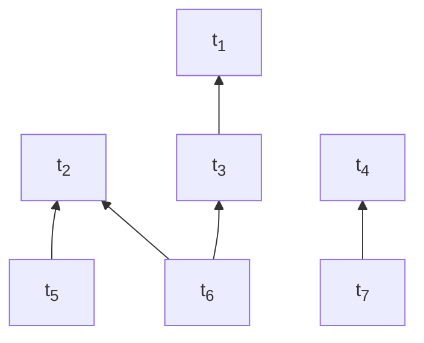

# Cluster mempool definitions & theory

sipa | 2023-12-09 04:02:45 UTC | #1

# Cluster mempool theory

## Transaction graphs and clusters

***Definition***. A **transaction graph**, or in cluster mempool context, just **graph**, is a [directed acyclic graph](https://en.wikipedia.org/wiki/Directed_acyclic_graph) (DAG), with *n* vertices (also called **transactions**), where each vertex is labelled with a **fee** (an integer) and a **size** (a strictly positive integer). If an edge from node *c* to node *p* exists, *p* is called a **parent** or **dependency** of *c*, and *c* a **child** of *p*. In other words, transaction graphs are dependency graph whose vertices point to their dependencies.

***Definition***. Given a graph *G* and a transaction *x* in it, the **ancestor set** $\operatorname{anc}(x)$ of *x* is the set of all transactions which can be [reached](https://en.wikipedia.org/wiki/Reachability) from *x* (this always includes *x* itself).

***Definition***. Given a graph *G* and a transaction *x* in it, the **descendant set** $\operatorname{des}(x)$ of *x* is the set of all transactions from which *x* can be reached.

***Definition***. A **cluster** is a [connected component](https://en.wikipedia.org/wiki/Component_(graph_theory)) of a graph *ignoring direction*. In other words, for any two transactions in a cluster it is possible to go from one to the other by making a sequence of steps, each traveling along an edge in either forward or backward direction. The clusters of a graph form a [partition](https://en.wikipedia.org/wiki/Partition_of_a_set) of its vertices, and the **cluster of a transaction** is the connected component which that transaction is part of. It can be found as the [transitive closure](https://en.wikipedia.org/wiki/Transitive_closure) of the "is parent or child of" relation on the singleton of the given transaction.

Consider the transaction graph below (fees and sizes are omitted):

In this example there are two clusters: $\{t_1, t_2, t_3, t_5, t_6\}$ and $\{t_4, t_7\}$.

***Definition***. Given a subset $S$ of nodes of a graph, define the following functions:
* $\operatorname{fee}(S) = \sum_{x \in S} \operatorname{fee}_x$: the sum of fees of transactions in $S$.
* $\operatorname{size}(S) = \sum_{x \in S} \operatorname{size}_x$: the sum of sizes of transactions in $S$.
* $\operatorname{feerate}(S) = \operatorname{fee}(S) / \operatorname{size}(S)$: the sum of the fees divided by the sum of the sizes of transactions in $S$. Only defined for non-empty sets $S$.

## Linearizations and chunks

***Definition***. A **topological subset** $S$ of a graph is a subset of its transactions that includes all ancestors of all its elements. In other words, $S$ is topological subset iff $\forall t \in S: \operatorname{anc}(t) \subset S$.

***Definition***. A **linearization** $L$ for a given graph $G$ is a permutation of its transactions in which parents appear before children. In other words, $L = (t_1, t_2, \ldots, t_n)$ is a linearization of $G$ if $\{t_1, t_2, \ldots, t_k\}$ is a topological subset of $G$ for all $k = 1 \ldots n$. A linearization is thus a [topological sort](https://en.wikipedia.org/wiki/Topological_sorting) of the graph vertices.

In the example above:
* $(t_1, t_2, t_3, t_4, t_5, t_6, t_7)$ is a valid linearization.
* $(t_2, t_5, t_1, t_3, t_6, t_4, t_7)$ is a valid linearization.
* $(t_1, t_3, t_6, t_2, t_5, t_4, t_7)$ is not ($t_6$ is included before its parent $t_2$).

***Definition***. Given a linearization $L$ for a graph $G$, and a subset $S$ of $G$, the **sublinearization** $L[S]$ is the linearization of $S$ which keeps the same internal ordering as those transactions have in $L$.

***Definition***. A **chunking** $C = (c_1, c_2, \ldots, c_n)$ for a given graph *G* is a list of sets of transactions (called **chunks**) of *G* such that:
* The chunks $c_i$ form a partition of *G* (no overlap, and their union contains all elements).
* Every prefix of chunks is topological ($\cup_{i=1}^{k} c_i$ for $k=1 \ldots n$ are topological subsets of $G$). Thus, a transaction's parent can appear in the same chunk as the transaction itself or in an earlier chunk, but not in a later chunk.
* The feerates of the sets are monotonically decreasing. Thus, the consecutive prefices of chunks form the highest, second-highest, ... feerate topological prefices.

***Definition***. A **corresponding chunking** of a linearization is a chunking obtained by converting the linearization into a list of singletons (one for each transaction, in order), and then repeatedly merging adjacent sets where the second set has a higher feerate than the first, until no such sets remain.

***Theorem***. The **corresponding chunking is a valid chunking, and is [unique](https://en.wikipedia.org/wiki/Uniqueness_theorem)**. The same chunking is obtained regardless of what order of merge operations is used. Thus, we can talk about *the* corresponding chunking $\operatorname{chunks}(L)$ of a linearization $L$. [no proof yet]

***Theorem***. The **feerate of a prefix of a linearization never exceeds its first chunk feerate**. If it did, the first chunk would clearly not be the highest-feerate prefix of the linearization.

***Theorem***. The **feerate of a suffix of a linearization is never less than its last chunk feerate**. This is true within the last chunk, because if there was a suffix of the last chunk with lower feerate than that chunk, that suffix could be split off, and the feerate of the part before it would go up. It is also true across multiple chunks, because if a suffix can't have a lower feerate than the last chunk, then extended the suffix to a chunk before it (whose maximum suffix feerate is even higher) cannot change that property.

***Definition***. We also define a **corresponding linearization of a chunking** as a linearization consisting of a concatenation of the chunks, in order, and within each chunk ordered topologically. This correspondence is not unique (because there can be multiple topological sorts of the chunk elements), but all corresponding linearizations of a chunking have the original chunking as corresponding chunking (or a strictly better one)
 Due to the simplicity of converting between chunking and linearization, we can often treat them as the same.

***Definition***. Given a chunking $C = (c_1, c_2, \ldots, c_n)$, its **feerate diagram** $\operatorname{diag}_C$ is a real function with domain $[0, \operatorname{size}(c_1 \cup c_2 \cup \ldots c_n)]$, defined as follows:
* Let $\gamma_i = \cup_{j=0}^{i} c_j$ for $i=0 \ldots n$, the union of all transactions in the first $i$ chunks.
* For all $i = 0 \ldots n-1$ and $\alpha \in [0,1]$:
  * $\operatorname{diag}_C(\operatorname{size}(\gamma_i) + \alpha \operatorname{size}(c_{i+1})) = \operatorname{fee}(\gamma_i) + \alpha \operatorname{fee}(c_{i+1})$.
* In other words, $\operatorname{diag}_C$ is a function from cumulative fees to cumulative sizes. When evaluated in the size of a prefix of chunks in $C$, it gives the fee in that prefix. For other values it linearly interpolates between those points.
* The feerate diagram of a linearization is that of its corresponding chunking.

***Theorem***. The **feerate diagram of a cluster is non-decreasing and [concave](https://en.wikipedia.org/wiki/Concave_function)**. [no proof]

***Theorem***. The **feerate diagram gives an overestimate for the fees in a linearization**. Given a linearization $L = (t_1, t_2, \ldots, t_n)$, $\operatorname{diag}_L(\operatorname{size}(\{t_1, t_2, \ldots, t_k\})) \geq \operatorname{fee}(\{t_1, t_2, \ldots, t_k\})$, and the feerate diagram of $L$ is the minimal concave function with this property. In other words, the $\operatorname{chunks}$ operation exactly groups transactions together such that connecting the lines between resulting cumulative (size, fee) points results in a concave function.

***Definition***. We define a **[preorder](https://en.wikipedia.org/wiki/Preorder)** on linearizations/chunkings for the same graph $G$ by comparing their feerate diagrams:
* Two linearizations are equivalent if their feerate diagrams coincide: $L_1 \sim L_2 \iff \forall x \in [0, \operatorname{size}(G)]: \operatorname{diag}_{L_1}(x) = \operatorname{diag}_{L_2}(x)$.
* A linearization is **at least as good** as another if its feerate diagram is never lower than the other's: $L_1 \gtrsim L_2 \iff \forall x \in [0, \operatorname{size}(G)]: \operatorname{diag}_{L_1}(x) \geq \operatorname{diag}_{L_2}(x)$.
* A linearization is **at least as bad** as another if its feerate diagram is never higher than the other's:  $L_1 \lesssim L_2 \iff \forall x \in [0, \operatorname{size}(G)]: \operatorname{diag}_{L_1}(x) \leq \operatorname{diag}_{L_2}(x)$.
* A linearization is **better** than another if its feerate diagram is never lower than the other's, and at least somewhere higher: $L_1 > L_2 \iff L_1 \gtrsim L_2$ and not $L_1 \sim L_2$.
* A linearization is **worse** than another if its feerate diagram is never higher than the other's, and at least somewhere lower: $L_1 < L_2 \iff L_1 \lesssim L_2$ and not $L_1 \sim L_2$.
* Linearizations $L_1$ and $L_2$ are **incomparable** when neither $L_1 \gtrsim L_2$ nor $L_1 \lesssim L_2$ (and **comparable** when at least one of those relations holds).
* This is not a [partial order](https://en.wikipedia.org/wiki/Partially_ordered_set), because $L_1 \sim L_2$ does not imply $L_1 = L_2$ (distinct linearizations can be equivalent).

## Transformations on linearizations

***Theorem***. The **chunk reordering theorem**: reordering a linearization with changes restricted to a single chunk results leaves it at least as good. 

***Proof***. Every prefix of chunks in the original linearization remains a prefix of transactions in the new linearization. Because the new feerate diagram is the minimal concave function not below these points, and these points form the old feerate diagram, the new feerate diagram cannot be below the old one.

***Theorem***. The **prefix stripping theorem**: Given two linearizations $L_1 = (t_1, t_2, \ldots, t_n)$ and $L_2 = (u_1, u_2, \ldots, u_n)$ for the same graph with a shared prefix: $t_i = u_i$ for all $i = 1 \ldots k$. In this case:
* If the suffix is at least as good, then the whole linearization is at least as good: $(t_{k+1}, t_{k+2}, \ldots, t_n) \gtrsim (u_{k+1}, u_{k+2}, \ldots, u_n) \implies L_1 \gtrsim L_2$.
* If the suffix is at least as bad, then the whole linearization is at least as bad: $(t_{k+1}, t_{k+2}, \ldots, t_n) \lesssim (u_{k+1}, u_{k+2}, \ldots, u_n) \implies L_1 \lesssim L_2$.

***Theorem***. The **gathering theorem**. Moving a sublinearization of transactions to the front of a linearization never worsens the linearization if the sublinearization's worst chunk feerate is at least that of the linearization's best chunk feerate (see discussion in [merging incomparable linearizations](https://delvingbitcoin.org/t/merging-incomparable-linearizations/209)):

* Let $L$ be a linearization of a graph $G$.
* Let $C = (c_1, c_2, \ldots, c_n) = \operatorname{chunks}(L)$.
* Let $S$ be a topologically valid subset of $G$.
* Let $D = (d_1, d_2, \ldots, d_m) = \operatorname{chunks}(L[S])$.
* Let $L' = L[S] + L[G \setminus S])$, the linearization obtained by moving $L[S]$ to the front.

In this case, $\operatorname{feerate}(d_m) \geq \operatorname{feerate}(c_1) \implies L' \gtrsim L$.

***Proof***.

* Let $f = \operatorname{feerate}(c_1)$, the feerate of the highest-feerate prefix of $L$.
* Let $e_j = c_j \cap S$ for $j=1 \ldots n$, the $S$ transactions in chunk $i$ of $L$. Note that this is distinct from $d_j$ because $e_j$ follows the chunk boundaries of $L$, while $d_j$ follows the boundaries of $L[S]$.
* Let $\gamma_j = \cup_{i=1}^{j} c_i$ for $j=1 \ldots n$, the transactions in the first $j$ chunks of $L$.
* Let $\zeta_j = \cup_{i=j+1}^{n} e_i$ for $j = 1 \ldots n$, the $S$ transactions *after* the first $j$ chunks of $L$.
* Let $P(x) = (\operatorname{size}(x), \operatorname{fee}(x))$, the point in 2D space corresponding to the size and fee of set $x$.
* We know $\operatorname{feerate}(c_j) \leq f$ for $j=1 \ldots n$, because chunk feerate decrease monotonically.
* We know $\operatorname{feerate}(\zeta_j) \geq f$ for $j=0 \ldots n-1$, because feerates of the suffix of a linearization ($L[S]$ in this case) are never below the last chunk's feerate.
* Thus, $\operatorname{feerate}(\zeta_j) \geq \operatorname{feerate}(c_k)$ for any $j, k$ where those values are defined.
* Define $\operatorname{ndiag}(x)$ as the real function that linearly interpolates through $(0,0)$ and through all $(P(\gamma_j \cup \zeta_j))_{j=0}^{n}$ (the set of chunk prefixes of $L plus all transactions from $S$).
* $\operatorname{ndiag}$ is not $\operatorname{diag_{L'}}$, the feerate diagram of $L'$, because it doesn't follow the proper chunking of $L'$. It is however a valid underestimate of it: $\forall x \in [0, \operatorname{size}(G)] : \operatorname{ndiag}(x) \leq \operatorname{diag_{L'}}$. This is because:
  * $\operatorname{diag_{L'}}$ is the minimal concave function through the $P$ points for all prefixes of $L'$.
  * $\operatorname{ndiag}$ is the minimal concave function through the $P$ points for some prefixes of $L'$ (those corresponding to the chunk prefixes of $L$, plus all transactions of $S$).

In what follows, we will show that $\forall x \in [0,\operatorname{size}(G)]: \operatorname{ndiag}(x) \geq \operatorname{diag_L}(x)$, and thus by extension that $\operatorname{diag_{L'}}(x) \geq \operatorname{diag}(x)$, or $L' \gtrsim L$.

In the drawing below, the red line represents $\operatorname{diag}_L$, while the blue line (plus the green $\zeta_0$ segment) represents $\operatorname{ndiag}$. Intuitively, the blue line lies above (or on) the red line everywhere because the slope of every the green $\zeta_j$ segments between red and blue is at least as high as that of any red $c_j$ segment.

$\operatorname{diag_L}$ is a concave function, which means it lies on or below each of its tangents. This implies that a point lies on or above the function iff it lies on or above at least one of its tangents. For every point on $\operatorname{ndiag}$ we will identify a tangent of $\operatorname{diag_L}$ that it lies on or above. As that function is made up of straight segments, its tangents are exactly these segments, extended to infinity in both directions.

* The points $\{\forall \alpha \in [0, 1]: \alpha P(\zeta_0)\}$ lie on the first segment of $\operatorname{ndiag}$. We show they lie on or above the (extension of the) $c_1$ segment of $\operatorname{diag}(L)$.
  * For $\alpha=0$, the functions coincide at $(0, 0)$.
  * For $\alpha > 0$, the slope from $(0,0)$ to $P(\gamma_1)$ is $\operatorname{feerate}(c_1) = f$. 
The slope of the line from $(0,0)$ to $\alpha P(\zeta_0)$ is $\operatorname{feerate}(\zeta_0) \geq f $, which is at least as high.
* For $i=0 \ldots n-1$, the points $\{\forall \alpha \in [0, 1]: (1-\alpha)P(\gamma_i \cup \zeta_i) + \alpha P(\gamma_{i+1} \cup \zeta_{i+1})\}$ lie on $\operatorname{ndiag}$. We show they lie on or above the (extension of the) $c_{i+1}$ segment of $\operatorname{diag}(L)$.
  * The slope of the $c_{i+1}$ segment, from $P(\gamma_i)$ to $P(\gamma_{i+1})$, is $\operatorname{feerate}(c_{i+1}) \leq f$.
  * For $\alpha = 0$, the slope of the line from $P(\gamma_i)$ to $(1-\alpha)P(\gamma_i \cup \zeta_i) + \alpha P(\gamma_{i+1} \cup \zeta_{i+1})$ is $\operatorname{feerate}(\zeta_i) \geq f$.
  * For $\alpha = 1$, the slope of the line from $P(\gamma_i)$ to $(1-\alpha)P(\gamma_i \cup \zeta_i) + \alpha P(\gamma_{i+1} \cup \zeta_{i+1})$ is $\operatorname{feerate}(\zeta_{i+1} \cup c_{i+1})$. Since $\operatorname{feerate}(\zeta_{i+1}) \geq \operatorname{feerate}(c_{i+1})$, it follows that $\operatorname{feerate}(\zeta_{i+1} \cup c_{i+1}) \geq \operatorname{feerate}(c_{i+1})$.
    * The one exception is $i = n-1$, as $\zeta_n$ is empty there, and thus has no $\operatorname{feerate}$; this is not a problem as the functions coincide in this point.
  * The points with $0 < \alpha < 1$ linearly interpolate between $\alpha=0$ and $\alpha=1$. Since both endpoints lie on or above the segment, the points in between also lie on or above the same segment.

Thus, $\operatorname{ndiag}$, an underestimate for the feerate diagram of $L'$, is always at least as high as $\operatorname{diag_L}$, the feerate diagram of $L$. We conclude that $L' \gtrsim L$.

## Optimal linearizations

***Definition***. An **optimal linearization/chunking** for a graph is one which sorts higher or equal than every other linearization/chunking for the same graph. Note that this implies that optimal linearizations/chunkings are comparable with every other linearization/chunking. An optimal linearization/chunking is a [greatest element](https://en.wikipedia.org/wiki/Greatest_element_and_least_element) of the set of all linearizations/chunkings of a graph.

***Theorem***. **Every graph has at least one optimal linearization/chunking**. An equivalent theorem is that if one has two incomparable linearizations/chunkings for a graph, then another linearization/chunking must exist which is strictly better than both. Optimal linearizations/chunkings are all equivalent to one another (if there are multiple), and all are strictly better than every non-optimal linearization/chunking.

***Proof***.

Define the function $\operatorname{opt}(G, L)$, for a given graph $G$ and linearization of that graph $L$ as:
* Let $S$ be the highest-feerate subset of $G$. If there are multiple, choose an arbitrary but consistent to order them.
* Let $L_S$ be the best topologically valid linearization of $S$, according to an arbitrary but consistent ordering on linearizations.
* $\operatorname{opt}(G, L) = L_S + \operatorname{opt}(G \setminus S, L[G \setminus S])$.

The output of $\operatorname{opt}(G, L)$ does not depend on $L$, so there is a unique result for every $G$. Yet, it can be shown that $\operatorname{opt}(G, L) \gtrsim L$ by induction. It is clearly true for empty $G$. For non-empty $G$, we reason:
* Let $L_1 = L[S] + L[G \setminus S]$. By the gathering theorem, $L_1 \gtrsim L$, because the highest-feerate subset $S$ necessarily forms a chunk on its own, with a feerate at least as high as the highest chunk feerate of $L$.
* Let $L_2 = L_S + L[G \setminus S]$. By the chunk reordering theorem, $L_2 \gtrsim L_1$, as only one chunk's transactions were affected.
* Let $L_3 = L_s + \operatorname{opt}(G \setminus S, L[G \setminus S])$. By the induction hypothesis, $\operatorname{opt}(G \setminus S, L[G \setminus S]) $ $\gtrsim$ $ L[G \setminus S]$, and thus by the stripping theorem, $L_3 \gtrsim L_2$.
* Thus, $\operatorname{opt}(G, L) = L_3 \gtrsim L_2 \gtrsim L_1 \gtrsim L$.

All together, we found a single linearization that is $\gtrsim$ every linearization, so $\operatorname{opt}(G, L)$ is an optimal linearization of $G$.

## Connected chunks

***Definition***. A **connected chunking** is a chunking for which each chunk is connected ignoring direction (i.e., given any transaction in a chunk, every other transaction in the same chunk can be reached when ignoring direction of the edges).

***Theorem***. **In an optimal linearization/chunking, the corresponding chunks have connected components whose feerate is all the same**. This is trivially true if the chunks are all connected. ***Proof*** If not, the chunks could be split in two, which would improve the diagram.

***Theorem***. **Every graph has at least one optimal linearization/chunking whose chunks are connected.**

-------------------------

murch | 2023-12-10 15:22:28 UTC | #2

[quote="sipa, post:1, topic:202"]
***Definition***. A **chunking** C = (c_1, c_2, \ldots, c_n)C=(c1,c2,…,cn)C = (c_1, c_2, \ldots, c_n) for a given graph *G* is a list of sets of transactions (called **chunks**) of *G* such that:

* The chunks c_icic_i form a partition of *G* (no overlap, and their union contains all elements).
* Every prefix of chunks is topological (\cup_{i=1}^{k} c_i∪ki=1ci\cup_{i=1}^{k} c_i for k=1 \ldots nk=1…nk=1 \ldots n are topological subsets of GGG). Thus, a transaction’s parent can appear in the same chunk as the transaction itself or in an earlier chunk, but not in a later chunk.
* The feerates of the sets are monotonically decreasing. Thus, the consecutive prefices of chunks form the highest, second-highest, … feerate topological prefices.
[/quote]

 I assume you are defining it on a graph so that you can have a chunking across multiple clusters, but 
it seems to me that this definition would only require that the topology is valid at the chunk borders and would not require the transactions to be topological _within the chunks_. I think it would be correct if you said "every prefix of the chunking" instead of "every prefix of chunks".

[quote="sipa, post:1, topic:202"]
***Theorem***. The **corresponding chunking is a valid chunking, and is [unique](https://en.wikipedia.org/wiki/Uniqueness_theorem)**. The same chunking is obtained regardless of what order of merge operations is used. Thus, we can talk about *the* corresponding chunking \operatorname{chunks}(L)chunks(L)\operatorname{chunks}(L) of a linearization LLL. [no proof yet]
[/quote]

[quote="sipa, post:1, topic:202"]
For other values it linearly interpolates between those points.
[/quote]

Would it perhaps be sufficient that a feerate diagram has exactly one "convex hull" for a geometric proof? E.g. if we draw all transactions separately in the feerate diagram instead of their chunks, could we use the approach you use in the _gathering theorem_ to show that all possible subgroupings will always be below the convex hull?

[quote="sipa, post:1, topic:202"]
***Theorem***. The **chunk reordering theorem**: reordering a linearization with changes restricted to a single chunk results leaves it at least as good.
[/quote]

Should this perhaps be restricted to topologically valid reorderings?

[quote="sipa, post:1, topic:202"]
Let e_j = c_j \cap Sej=cj∩Se_j = c_j \cap S for j=1 \ldots nj=1…nj=1 \ldots n, the SSS transactions in chunk iii of LLL. Note that this is distinct from d_jdjd_j because e_jeje_j follows the chunk boundaries of LLL, while d_jdjd_j follows the boundaries of L[S]L[S]L[S].
[/quote]

This should be "in chunk _j_ of _L_".

[quote="sipa, post:1, topic:202"]
Let \zeta_j = \cup_{i=j+1}^{n} e_iζj=∪ni=j+1ei\zeta_j = \cup_{i=j+1}^{n} e_i for j = 1 \ldots nj=1…nj = 1 \ldots n, the SSS transactions *after* the first jjj chunks of LLL.
[/quote]

Maybe "all remaining transactions of _S_ *after* the first _j_ chunks of _L_" would be clearer.

[quote="sipa, post:1, topic:202"]
Let SSS be the highest-feerate subset of GGG. If there are multiple, choose an arbitrary but consistent to order them.
[/quote]

"choose an arbitrary but consistent **way/approach/method/criteria/something** to order them"?

[quote="sipa, post:1, topic:202"]
***Theorem***. **In an optimal linearization/chunking, the corresponding chunks have connected components whose feerate is all the same**. This is trivially true if the chunks are all connected. ***Proof*** If not, the chunks could be split in two, which would improve the diagram.
[/quote]

Linebreak missing before the Proof.

I find that phrasing a bit confusing. What do you mean with "have connected components whose feerate is all the same"? I assume you are referring to the optimal linearization consisting only of chunks that cannot be split further by reordering, i.e. that any valid reordering would not lead to a different chunking, but the "have connected components whose feerate is all the same" makes me think that you are postulating that there are two chunks with the same feerate.

-------------------------

