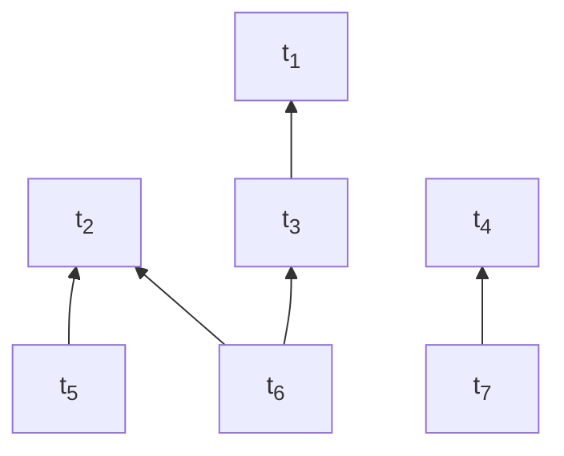
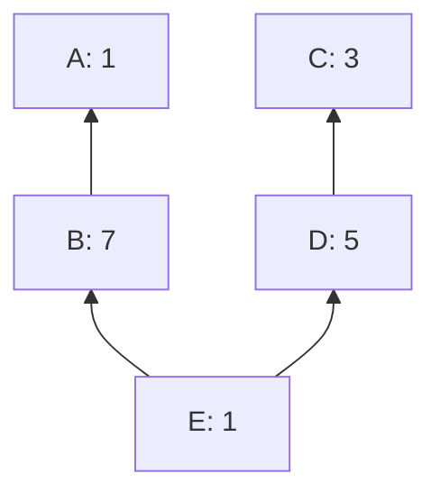

# Cluster mempool definitions & theory

sipa | 2024-02-22 03:32:13 UTC | #1

# Cluster mempool theory

 

## Transaction graphs and clusters

***Definition***. A **transaction graph**, or in cluster mempool context, just **graph**, is a [directed acyclic graph](https://en.wikipedia.org/wiki/Directed_acyclic_graph) (DAG), with *n* vertices (also called **transactions**), where each vertex is labelled with a **fee** (an integer) and a **size** (a strictly positive integer). If an edge from node *c* to node *p* exists, *p* is called a **parent** or **dependency** of *c*, and *c* a **child** of *p*. In other words, transaction graphs are dependency graph whose vertices point to their dependencies.

***Definition***. Given a graph *G* and a transaction *x* in it, the **ancestor set** $\operatorname{anc}_G(x)$ of *x* is the set of all transactions which can be [reached](https://en.wikipedia.org/wiki/Reachability) from *x* (this always includes *x* itself). For sets $S$, we define $\operatorname{anc}_G(S) = \cup_{x \in S} \operatorname{anc}_G(x)$, the union of the ancestor sets of all the transactions in the set.

***Definition***. Given a graph *G* and a transaction *x* in it, the **descendant set** $\operatorname{desc}_G(x)$ of *x* is the set of all transactions from which *x* can be reached. For sets $S$, we define $\operatorname{desc}_G(S) = \cup_{x \in S} \operatorname{desc}_G(x)$, the union of the descendant sets of all the transactions in the set.

***Definition***. A **cluster** is a [connected component](https://en.wikipedia.org/wiki/Component_(graph_theory)) of a graph *ignoring direction*. In other words, for any two transactions in a cluster it is possible to go from one to the other by making a sequence of steps, each traveling along an edge in either forward or backward direction. The clusters of a graph form a [partition](https://en.wikipedia.org/wiki/Partition_of_a_set) of its vertices, and the **cluster of a transaction** is the connected component which that transaction is part of. It can be found as the [transitive closure](https://en.wikipedia.org/wiki/Transitive_closure) of the "is parent or child of" relation on the singleton of the given transaction.

Consider the transaction graph below (fees and sizes are omitted):

In this example there are two clusters: $\{t_1, t_2, t_3, t_5, t_6\}$ and $\{t_4, t_7\}$.

***Definition***. Given a subset $S$ of nodes of a graph, define the following functions:
* $\operatorname{fee}(S) = \sum_{x \in S} \operatorname{fee}_x$: the sum of fees of transactions in $S$.
* $\operatorname{size}(S) = \sum_{x \in S} \operatorname{size}_x$: the sum of sizes of transactions in $S$.
* $\operatorname{feerate}(S) = \operatorname{fee}(S) / \operatorname{size}(S)$: the sum of the fees divided by the sum of the sizes of transactions in $S$. Only defined for non-empty sets $S$.

## Linearizations and chunks

***Definition***. A **topological subset** $S$ of a graph $G$ is a subset of its transactions that includes all ancestors of all its elements. In other words, $S$ is topological subset of $G$ iff $\operatorname{anc}_G(S) = S$.

***Definition***. A **linearization** $L$ for a given graph $G$ is a permutation of its transactions in which parents appear before children. In other words, $L = (t_1, t_2, \ldots, t_n)$ is a linearization of $G$ if $\{t_1, t_2, \ldots, t_k\}$ is a topological subset of $G$ for all $k = 1 \ldots n$. A linearization is thus a [topological sort](https://en.wikipedia.org/wiki/Topological_sorting) of the graph vertices.

In the example above:
* $(t_1, t_2, t_3, t_4, t_5, t_6, t_7)$ is a valid linearization.
* $(t_2, t_5, t_1, t_3, t_6, t_4, t_7)$ is a valid linearization.
* $(t_1, t_3, t_6, t_2, t_5, t_4, t_7)$ is not ($t_6$ is included before its parent $t_2$).

***Definition***. Given a linearization $L$ for a graph $G$, and a subset $S$ of $G$, the **sublinearization** $L[S]$ is the linearization of $S$ which keeps the same internal ordering as those transactions have in $L$.

***Definition***. A **chunking** $C = (c_1, c_2, \ldots, c_n)$ for a given graph *G* is a sequence of sets of transactions (called **chunks**) of *G* such that:
* The chunks $c_i$ form a partition of *G* (no overlap, and their union contains all elements).
* Every prefix of chunks is topological ($\cup_{i=1}^{k} c_i$ for $k=1 \ldots n$ are topological subsets of $G$). Thus, a transaction's parent can appear in the same chunk as the transaction itself or in an earlier chunk, but not in a later chunk.
* The feerates of the sets are monotonically decreasing.

Note that in practice, we will only work with chunkings of individual clusters, rather than possibly-disconnected graphs. The reasoning for that will come later, so for now, we define chunkings for graphs in general.

***Definition***. The function $\operatorname{chunks}(L)$ for a linearization $L = (t_1, t_2, \ldots, t_n)$ of a graph $G$ returns the **corresponding chunking** of that linearization, defined as:
* If $L$ (and thus $G$) is empty, $\operatorname{chunks}(L) = ()$.
* Otherwise:
  * Let $f_j = \operatorname{feerate}(\{t_1, t_2, \ldots, t_j)$ for $j = 1 \ldots n$.
  * Let $k$ be the smallest integer $\geq 1$ such that no $f_j > f_k$ exists.
  * Let $c = \{t_1, t_2, \ldots, t_k\}$.
  * $\operatorname{chunks}(L) = (c) + \operatorname{chunks}(L[\{t_{k+1}, \ldots n\}])$.

In other words, $\operatorname{chunks}$ constructs the chunking of a linearization consisting of successively best remaining prefixes of that linearization.

***Theorem***. The corresponding chunking $\operatorname{chunks}(L)$ is a valid chunking for $G$.

***Proof***. All criteria for a valid chunking are fulfilled:
* All transactions that occurred in $L$ (which are all transactions in $G$) will appear in $\operatorname{chunks}(L)$ once.
* Every prefix of chunks is topological, because each corresponds to a prefix of $L$ (which are topological for any valid linearization).
* The feerates are monotonically decreasing. If that wasn't the case, the chosen $k$ would violate the "no $f_j > f_k$" rule.

***Theorem***. The **feerate of a prefix of a linearization never exceeds its first chunk feerate**. If it did, the first chunk would clearly not be the highest-feerate prefix of the linearization.

***Theorem***. The **feerate of a suffix of a linearization is never less than its last chunk feerate**. This is true within the last chunk, because if there was a suffix of the last chunk with lower feerate than that chunk, that suffix could be split off, and the feerate of the part before it would go up. It is also true across multiple chunks, because if a suffix can't have a lower feerate than the last chunk, then extended the suffix to a chunk before it (whose maximum suffix feerate is even higher) cannot change that property.

***Definition***. We also define a **corresponding linearization of a chunking** as a linearization consisting of a concatenation of the chunks, in order, and within each chunk ordered topologically. This correspondence is not unique (because there can be multiple topological sorts of the chunk elements), but all corresponding linearizations of a chunking have the original chunking as corresponding chunking (or a strictly better one)
 Due to the simplicity of converting between chunking and linearization, we can often treat them as the same.

***Definition***. Given a chunking $C = (c_1, c_2, \ldots, c_n)$, its **feerate diagram** $\operatorname{diag}_C$ is a real function with domain $[0, \operatorname{size}(c_1 \cup c_2 \cup \ldots c_n)]$, defined as follows:
* Let $\gamma_i = \cup_{j=0}^{i} c_j$ for $i=0 \ldots n$, the union of all transactions in the first $i$ chunks.
* For all $i = 0 \ldots n-1$ and $\alpha \in [0,1]$:
  * $\operatorname{diag}_C(\operatorname{size}(\gamma_i) + \alpha \operatorname{size}(c_{i+1})) = \operatorname{fee}(\gamma_i) + \alpha \operatorname{fee}(c_{i+1})$.
* In other words, $\operatorname{diag}_C$ is a function from cumulative fees to cumulative sizes. When evaluated in the size of a prefix of chunks in $C$, it gives the fee in that prefix. For other values it linearly interpolates between those points.
* The feerate diagram of a linearization is that of its corresponding chunking.

***Theorem***. The feerate diagram $\operatorname{diag}_L$ of a linearization $L = (t_1, t_2, \ldots, t_n)$ is the minimal concave function for which for every $k = 0 \ldots n$ it holds that $\operatorname{diag}_L(\operatorname{size}(\{t_1, t_2, \ldots, t_k\}) \geq \operatorname{fee}(\{t_1, t_2, \ldots, t_k\})$. As such, it gives an overestimate for the fees in all prefixes of a linearization. In other words, the grouping of transactions performed by $\operatorname{chunks}$ exactly corresponds to the straight line segments resulting from requiring the feerate diagram to be concave. [no proof]

***Definition***. We define a **[preorder](https://en.wikipedia.org/wiki/Preorder)** on linearizations/chunkings for the same graph $G$ by comparing their feerate diagrams:
* Two linearizations are equivalent if their feerate diagrams coincide: $L_1 \sim L_2 \iff \forall x \in [0, \operatorname{size}(G)]: \operatorname{diag}_{L_1}(x) = \operatorname{diag}_{L_2}(x)$.
* A linearization is **at least as good** as another if its feerate diagram is never lower than the other's: $L_1 \gtrsim L_2 \iff \forall x \in [0, \operatorname{size}(G)]: \operatorname{diag}_{L_1}(x) \geq \operatorname{diag}_{L_2}(x)$.
* A linearization is **at least as bad** as another if its feerate diagram is never higher than the other's:  $L_1 \lesssim L_2 \iff \forall x \in [0, \operatorname{size}(G)]: \operatorname{diag}_{L_1}(x) \leq \operatorname{diag}_{L_2}(x)$.
* A linearization is **better** than another if its feerate diagram is never lower than the other's, and at least somewhere higher: $L_1 > L_2 \iff L_1 \gtrsim L_2$ and not $L_1 \sim L_2$.
* A linearization is **worse** than another if its feerate diagram is never higher than the other's, and at least somewhere lower: $L_1 < L_2 \iff L_1 \lesssim L_2$ and not $L_1 \sim L_2$.
* Linearizations $L_1$ and $L_2$ are **incomparable** when neither $L_1 \gtrsim L_2$ nor $L_1 \lesssim L_2$ (and **comparable** when at least one of those relations holds).
* This is not a [partial order](https://en.wikipedia.org/wiki/Partially_ordered_set), because $L_1 \sim L_2$ does not imply $L_1 = L_2$ (distinct linearizations can be equivalent).

## Transformations on linearizations

***Theorem***. The **chunk reordering theorem**: reordering a linearization with changes restricted to a single chunk results leaves it at least as good, provided the result is still a valid linearization (i.e., its prefixes are topological).

***Proof***. Every prefix of chunks in the original linearization remains a prefix of transactions in the new linearization. Because the new feerate diagram is the minimal concave function not below these points, and these points form the old feerate diagram, the new feerate diagram cannot be below the old one.

***Theorem***. The **prefix stripping theorem**: Given two linearizations $L_1 = (t_1, t_2, \ldots, t_n)$ and $L_2 = (u_1, u_2, \ldots, u_n)$ for the same graph with a shared prefix: $t_i = u_i$ for all $i = 1 \ldots k$. In this case:
* If the suffix is at least as good, then the whole linearization is at least as good: $(t_{k+1}, t_{k+2}, \ldots, t_n) \gtrsim (u_{k+1}, u_{k+2}, \ldots, u_n) \implies L_1 \gtrsim L_2$.
* If the suffix is at least as bad, then the whole linearization is at least as bad: $(t_{k+1}, t_{k+2}, \ldots, t_n) \lesssim (u_{k+1}, u_{k+2}, \ldots, u_n) \implies L_1 \lesssim L_2$.

***Theorem***. The **gathering theorem**. Moving a sublinearization of transactions to the front of a linearization never worsens the linearization if the sublinearization's worst chunk feerate is at least that of the linearization's best chunk feerate (see discussion in [merging incomparable linearizations](https://delvingbitcoin.org/t/merging-incomparable-linearizations/209)):

* Let $L$ be a linearization of a graph $G$.
* Let $C = (c_1, c_2, \ldots, c_n) = \operatorname{chunks}(L)$.
* Let $S$ be a topologically valid subset of $G$.
* Let $D = (d_1, d_2, \ldots, d_m) = \operatorname{chunks}(L[S])$.
* Let $L' = L[S] + L[G \setminus S])$, the linearization obtained by moving $L[S]$ to the front.

In this case, $\operatorname{feerate}(d_m) \geq \operatorname{feerate}(c_1) \implies L' \gtrsim L$.

***Proof***.

* Let $f = \operatorname{feerate}(c_1)$, the feerate of the highest-feerate prefix of $L$.
* Let $e_j = c_j \cap S$ for $j=1 \ldots n$, the $S$ transactions in chunk $j$ of $L$. Note that this is distinct from $d_j$ because $e_j$ follows the chunk boundaries of $L$, while $d_j$ follows the boundaries of $L[S]$.
* Let $\gamma_j = \cup_{i=1}^{j} c_i$ for $j=1 \ldots n$, the transactions in the first $j$ chunks of $L$.
* Let $\zeta_j = \cup_{i=j+1}^{n} e_i$ for $j = 1 \ldots n$, all remaining transactions of $S$ *after* the first $j$ chunks of $L$.
* Let $P(x) = (\operatorname{size}(x), \operatorname{fee}(x))$, the point in 2D space corresponding to the size and fee of set $x$.
* We know $\operatorname{feerate}(c_j) \leq f$ for $j=1 \ldots n$, because chunk feerate decrease monotonically.
* We know $\operatorname{feerate}(\zeta_j) \geq f$ for $j=0 \ldots n-1$, because feerates of the suffix of a linearization ($L[S]$ in this case) are never below the last chunk's feerate.
* Thus, $\operatorname{feerate}(\zeta_j) \geq \operatorname{feerate}(c_k)$ for any $j, k$ where those values are defined.
* Define $\operatorname{ndiag}(x)$ as the real function that linearly interpolates through $(0,0)$ and through all $(P(\gamma_j \cup \zeta_j))_{j=0}^{n}$ (the set of chunk prefixes of $L plus all transactions from $S$).
* $\operatorname{ndiag}$ is not $\operatorname{diag_{L'}}$, the feerate diagram of $L'$, because it doesn't follow the proper chunking of $L'$. It is however a valid underestimate of it: $\forall x \in [0, \operatorname{size}(G)] : \operatorname{ndiag}(x) \leq \operatorname{diag_{L'}}$. This is because:
  * $\operatorname{diag_{L'}}$ is the minimal concave function through the $P$ points for all prefixes of $L'$.
  * $\operatorname{ndiag}$ is the minimal concave function through the $P$ points for some prefixes of $L'$ (those corresponding to the chunk prefixes of $L$, plus all transactions of $S$).

In what follows, we will show that $\forall x \in [0,\operatorname{size}(G)]: \operatorname{ndiag}(x) \geq \operatorname{diag_L}(x)$, and thus by extension that $\operatorname{diag_{L'}}(x) \geq \operatorname{diag}(x)$, or $L' \gtrsim L$.

In the drawing below, the red line represents $\operatorname{diag}_L$, while the blue line (plus the green $\zeta_0$ segment) represents $\operatorname{ndiag}$. Intuitively, the blue line lies above (or on) the red line everywhere because the slope of every the green $\zeta_j$ segments between red and blue is at least as high as that of any red $c_j$ segment.

$\operatorname{diag_L}$ is a concave function, which means it lies on or below each of its tangents. This implies that a point lies on or above the function iff it lies on or above at least one of its tangents. For every point on $\operatorname{ndiag}$ we will identify a tangent of $\operatorname{diag_L}$ that it lies on or above. As that function is made up of straight segments, its tangents are exactly these segments, extended to infinity in both directions.

* The points $\{\forall \alpha \in [0, 1]: \alpha P(\zeta_0)\}$ lie on the first segment of $\operatorname{ndiag}$. We show they lie on or above the (extension of the) $c_1$ segment of $\operatorname{diag}(L)$.
  * For $\alpha=0$, the functions coincide at $(0, 0)$.
  * For $\alpha > 0$, the slope from $(0,0)$ to $P(\gamma_1)$ is $\operatorname{feerate}(c_1) = f$. 
The slope of the line from $(0,0)$ to $\alpha P(\zeta_0)$ is $\operatorname{feerate}(\zeta_0) \geq f $, which is at least as high.
* For $i=0 \ldots n-1$, the points $\{\forall \alpha \in [0, 1]: (1-\alpha)P(\gamma_i \cup \zeta_i) + \alpha P(\gamma_{i+1} \cup \zeta_{i+1})\}$ lie on $\operatorname{ndiag}$. We show they lie on or above the (extension of the) $c_{i+1}$ segment of $\operatorname{diag}(L)$.
  * The slope of the $c_{i+1}$ segment, from $P(\gamma_i)$ to $P(\gamma_{i+1})$, is $\operatorname{feerate}(c_{i+1}) \leq f$.
  * For $\alpha = 0$, the slope of the line from $P(\gamma_i)$ to $(1-\alpha)P(\gamma_i \cup \zeta_i) + \alpha P(\gamma_{i+1} \cup \zeta_{i+1})$ is $\operatorname{feerate}(\zeta_i) \geq f$.
  * For $\alpha = 1$, the slope of the line from $P(\gamma_i)$ to $(1-\alpha)P(\gamma_i \cup \zeta_i) + \alpha P(\gamma_{i+1} \cup \zeta_{i+1})$ is $\operatorname{feerate}(\zeta_{i+1} \cup c_{i+1})$. Since $\operatorname{feerate}(\zeta_{i+1}) \geq \operatorname{feerate}(c_{i+1})$, it follows that $\operatorname{feerate}(\zeta_{i+1} \cup c_{i+1}) \geq \operatorname{feerate}(c_{i+1})$.
    * The one exception is $i = n-1$, as $\zeta_n$ is empty there, and thus has no $\operatorname{feerate}$; this is not a problem as the functions coincide in this point.
  * The points with $0 < \alpha < 1$ linearly interpolate between $\alpha=0$ and $\alpha=1$. Since both endpoints lie on or above the segment, the points in between also lie on or above the same segment.

Thus, $\operatorname{ndiag}$, an underestimate for the feerate diagram of $L'$, is always at least as high as $\operatorname{diag_L}$, the feerate diagram of $L$. We conclude that $L' \gtrsim L$.

## Merging linearizations

***Definition***. Let $\operatorname{merge}(G, L_1, L_2)$ be the function on graphs $G$ with valid linearizations $L_1$ and $L_2$, defined as follows:
* If $G$ (and thus $L_1$ and $L_2$) are empty, $\operatorname{merge}(\{\}, (), ()) = ()$.
* Otherwise:
  * Let $(c_1, \ldots) = \operatorname{chunks}(L_1)$.
  * Let $(c_2, \ldots) = \operatorname{chunks}(L_2)$.
  * If $\operatorname{feerate}(c_1) > \operatorname{feerate}(c_2)$, swap $L_1$ with $L_2$ (and $c_1$ with $c_2$).
  * Let $L_3 = L_1[c_2]$, the first chunk of $L_2$, using the order these transactions have in $L_1$.
  * Let $(c_3, \ldots) = \operatorname{chunks}(L_3)$.
  * Let $L_4 = L_3[c_3] = L_1[c_3]$, the linearization of the first chunk of $L_3$.
  * $\operatorname{merge}(G, L_1, L_2) = L_4 + \operatorname{merge}(G \setminus c_3, L_1[G \setminus c_3], L_2[G \setminus c_3])$.

***Theorem***. $\operatorname{merge}(G, L_1, L_2) \gtrsim L_1$ and $\operatorname{merge}(G, L_1, L_2) \gtrsim L_2$.

***Proof***.

The theorem is trivially true for empty $G$. For others, we use induction:
* First note that $\operatorname{feerate}(c_3) \geq \operatorname{feerate}(c_1)$:
  * After the optional swapping step it must be the case that $\operatorname{feerate}(c_2) \geq \operatorname{feerate}(c_1)$.
  * Further, $\operatorname{feerate}(c_3) \geq \operatorname{feerate}(c_2)$, because $L_3$ contains the same transactions as $c_2$. If the $\operatorname{chunks}$ operation on $L_3$ finds nothing better, it will pick the entirety of $L_3$ as $c_3$, which has the same feerate as $c_2$.
* Now define the following:
  * Let $L_1' = L_4 + L_1[G \setminus c_3]$. By the gathering theorem, $L_1' \gtrsim L_1$, as it is bringing a topologically valid sublinearization ($L_4 = L_1[c_3]$) to the front, and it has just a single chunk ($c_3$), whose feerate is $\geq \operatorname{feerate}(c_1)$, the highest feerate in $L_1$.
  * Let $L_2' = L_4 + L_2[G \setminus c_3]$. By the chunk reordering them, $L_2' \gtrsim L_2$, as $L_2'$ equals $L_2$ apart from its first chunk ($c_3 \subset c_2$).
* By the induction hypothesis, $\operatorname{merge}(G \setminus c_3, L_1[G \setminus c_3], L_2[G \setminus c_3]) \gtrsim L_1[G \setminus c_3]$, and thus by the stripping theorem, $L_4 + \operatorname{merge}(G \setminus c_3, L_1[G \setminus c_3], L_2[G \setminus c_3]) \gtrsim L_4 + L_1[G \setminus c_3] = L_1'$. The same reasoning applies to $L_2'$.
* Put together, $\operatorname{merge}(G, L_1, L_2) \gtrsim L_1' \gtrsim L_1$ and $\operatorname{merge}(G, L_1, L_2) \gtrsim L_2' \gtrsim L_2$.

***Variations***. A number of variations on this algorithm are possible which do not break the proof above:
* Whenever a non-empty prefix $P$ is shared by $L_1$ and $L_2$, it can be skipped (this follows directly from the stripping theorem), so if $L_1 = P + A$ and $L_2 = P + B$, then one can define $\operatorname{merge}(G, L_1, L_2) = P + \operatorname{merge}(G \setminus P, A, B)$.
* Instead of only considering the first chunk of $L_2$ in the order of $L_1$, it's possible to also consider the first chunk of $L_1$ in the order of $L_2$, and then pick the first chunk of the one of those two which has the higher feerate.

## Optimal linearizations

***Definition***. An **optimal linearization/chunking** for a graph is one which sorts higher or equal than every other linearization/chunking for the same graph. Note that this implies that optimal linearizations/chunkings are comparable with every other linearization/chunking. An optimal linearization/chunking is a [greatest element](https://en.wikipedia.org/wiki/Greatest_element_and_least_element) of the set of all linearizations/chunkings of a graph.

***Theorem***. The set of linearizations/chunkings of a graph, with the preorder relation defined above, forms an  (upward) **[directed set](https://en.wikipedia.org/wiki/Directed_set)**.

***Proof***. From the properties of the $\operatorname{merge}$ algorithm it follows that for any two linearizations $L_1$ and $L_2$ there exists a $L_3 = \operatorname{merge}(G, L_1, L_2)$ such that $L_3 \gtrsim L_1$ and $L_3 \gtrsim L_2$.

***Theorem***. **Every graph has at least one optimal linearization/chunking**. 

***Proof***. In a directed set, every [maximal element](https://en.wikipedia.org/wiki/Maximal_and_minimal_elements) is a greatest element. Every finite preordered set has at least one maximal element. In a directed set, that element is a greatest element too.

***Definition***. For a given total ordering $R_1$ on the set of sets of transactions, and a total ordering $R_2$ on the set of sequences of transactions, define the function $\operatorname{opt}_{R_1,R_2}(G)$, for a given graph $G$ as follows:
* If $G$ is empty, return the empty sequence: $\operatorname{opt}_{R_1,R_2}(G) = ()$.
* Otherwise:
  * Let $S$ be the highest-feerate subset of $G$. If there are multiple, pick the first one according to $R_1$.
  * Let $L_S$ be the first valid linearization of $S$ according to $R_2$.
  * $\operatorname{opt}_{R_1,R_2}(G) = L_S + \operatorname{opt}_{R_1,R_2}(G \setminus S)$.

***Theorem***. $\operatorname{opt}_{R_1,R_2}(G)$ is an optimal linearization of $G$.

***Proof***. Assume $L = \operatorname{opt}_{R_1,R_2}(G)$ is not an optimal linearization of $G$. We already know an actual optimal linearization $L_{opt}$ must exist though, so $L_{opt} > L$.

There must be a first chunk in the chunking of $L$ where the fee-size diagram differs with $L_{opt}$. Let $p$ be the set of all transactions in $L$ in chunks before that point. Let $L_{opt}' = L[p] + L_{opt}[G \setminus p]$, i.e. the linearization obtained by moving the diagram-equal $L$ chunks to the front in $L_{opt}$. By repeatedly applying the gathering and stripping theorem, $L_{opt}' \gtrsim L_{opt}$. Because $L_{opt}$ is optimal this implies $L_{opt}' \sim L_{opt} > L$. $L_{opt}'$ and $L$ both start with the same chunks, so by removing them we get $L_{opt}[G \setminus p] > L[G \setminus p]$. $L[G \setminus p] = \operatorname{opt}_{R_1,R_2}(G \setminus p)$ however, and it starts by picking the highest-feerate subset of $(G \setminus p)$, and yet $L_{opt}[G \setminus p]$ starts with a better chunk. This is a contradiction.

For how to compute $\operatorname{opt}(G)$ efficiently, see [How to linearize your cluster](https://delvingbitcoin.org/t/how-to-linearize-your-cluster/303).

## Connected chunks

***Definition***. A **connected chunking** is a chunking for which each chunk is connected ignoring direction (i.e., given any transaction in a chunk, every other transaction in the same chunk can be reached when ignoring direction of the edges).

***Theorem***. **In an optimal linearization/chunking, the corresponding chunks have connected components whose feerate is all the same**. This is trivially true if the chunks are all connected.

***Proof*** If not, the chunks could be split in two, which would improve the diagram.

***Theorem***. **Every graph has at least one optimal linearization/chunking whose chunks are connected.**

-------------------------

murch | 2023-12-10 15:26:45 UTC | #2

[quote="sipa, post:1, topic:202"]
***Definition***. A **chunking** C = (c_1, c_2, \ldots, c_n)C=(c1,c2,…,cn)C = (c_1, c_2, \ldots, c_n) for a given graph *G* is a list of sets of transactions (called **chunks**) of *G* such that:

* The chunks c_icic_i form a partition of *G* (no overlap, and their union contains all elements).
* Every prefix of chunks is topological (\cup_{i=1}^{k} c_i∪ki=1ci\cup_{i=1}^{k} c_i for k=1 \ldots nk=1…nk=1 \ldots n are topological subsets of GGG). Thus, a transaction’s parent can appear in the same chunk as the transaction itself or in an earlier chunk, but not in a later chunk.
* The feerates of the sets are monotonically decreasing. Thus, the consecutive prefices of chunks form the highest, second-highest, … feerate topological prefices.
[/quote]

 I assume you are defining it on a graph so that you can have a chunking across multiple clusters, but 
it seems to me that this definition would only require that the topology is valid at the chunk borders and would not require the transactions to be topological _within the chunks_. I think it would be correct if you said "every prefix of the chunking is topological" instead of "every prefix of chunks is topological".

[quote="sipa, post:1, topic:202"]
***Theorem***. The **corresponding chunking is a valid chunking, and is [unique](https://en.wikipedia.org/wiki/Uniqueness_theorem)**. The same chunking is obtained regardless of what order of merge operations is used. Thus, we can talk about *the* corresponding chunking \operatorname{chunks}(L)chunks(L)\operatorname{chunks}(L) of a linearization LLL. [no proof yet]
[/quote]

[quote="sipa, post:1, topic:202"]
For other values it linearly interpolates between those points.
[/quote]

Would it perhaps be sufficient that a feerate diagram has exactly one "convex hull" for a geometric proof? E.g. if we draw all transactions separately in the feerate diagram instead of their chunks, could we use the approach you use in the _gathering theorem_ to show that all possible subgroupings will always be below the convex hull?

[quote="sipa, post:1, topic:202"]
***Theorem***. The **chunk reordering theorem**: reordering a linearization with changes restricted to a single chunk results leaves it at least as good.
[/quote]

Should this perhaps be restricted to topologically valid reorderings?

[quote="sipa, post:1, topic:202"]
Let e_j = c_j \cap Sej=cj∩Se_j = c_j \cap S for j=1 \ldots nj=1…nj=1 \ldots n, the SSS transactions in chunk iii of LLL. Note that this is distinct from d_jdjd_j because e_jeje_j follows the chunk boundaries of LLL, while d_jdjd_j follows the boundaries of L[S]L[S]L[S].
[/quote]

This should be "in chunk _j_ of _L_".

[quote="sipa, post:1, topic:202"]
Let \zeta_j = \cup_{i=j+1}^{n} e_iζj=∪ni=j+1ei\zeta_j = \cup_{i=j+1}^{n} e_i for j = 1 \ldots nj=1…nj = 1 \ldots n, the SSS transactions *after* the first jjj chunks of LLL.
[/quote]

Maybe "all remaining transactions of _S_ *after* the first _j_ chunks of _L_" would be clearer.

[quote="sipa, post:1, topic:202"]
Let SSS be the highest-feerate subset of GGG. If there are multiple, choose an arbitrary but consistent to order them.
[/quote]

"choose an arbitrary but consistent **way/approach/method/criteria/something** to order them"?

[quote="sipa, post:1, topic:202"]
***Theorem***. **In an optimal linearization/chunking, the corresponding chunks have connected components whose feerate is all the same**. This is trivially true if the chunks are all connected. ***Proof*** If not, the chunks could be split in two, which would improve the diagram.
[/quote]

Linebreak missing before the Proof.

I find that phrasing a bit confusing. What do you mean with "have connected components whose feerate is all the same"? I assume you are referring to the optimal linearization consisting only of chunks that cannot be split further by reordering, i.e. that any valid reordering would not lead to a different chunking, but the "have connected components whose feerate is all the same" makes me think that you are postulating that there are two chunks with the same feerate.

-------------------------

sipa | 2023-12-10 18:20:05 UTC | #3

[quote="murch, post:2, topic:202"]
I assume you are defining it on a graph so that you can have a chunking across multiple clusters
[/quote]

Right. I've added a paragraph to elaborate on why that is.

[quote="murch, post:2, topic:202"]
it seems to me that this definition would only require that the topology is valid at the chunk borders and would not require the transactions to be topological *within the chunks*.
[/quote]

Chunks, as defined here, are sets; they don't have an internal ordering. I've gone back and forth in my thinking whether sets or sequences are better. The advantage of sets is that at the chunking level, you don't need to care about distinct intra-chunk linearization orderings. The disadvantage is that converting back from chunkings to linearizations isn't as natural.

[quote="murch, post:2, topic:202"]
Would it perhaps be sufficient that a feerate diagram has exactly one “convex hull” for a geometric proof? E.g. if we draw all transactions separately in the feerate diagram instead of their chunks, could we use the approach you use in the *gathering theorem* to show that all possible subgroupings will always be below the convex hull?
[/quote]

Let me think a bit more about that.

[quote="murch, post:2, topic:202"]
Should this perhaps be restricted to topologically valid reorderings?
[/quote]

Done.

[quote="murch, post:2, topic:202"]
This should be “in chunk *j* of *L*”.
[/quote]

Fixed.

[quote="murch, post:2, topic:202"]
Maybe “all remaining transactions of *S* *after* the first *j* chunks of *L*” would be clearer.
[/quote]

Agreed, done.

[quote="murch, post:2, topic:202"]
“choose an arbitrary but consistent **way/approach/method/criteria/something** to order them”?
[/quote]

I've formalized this a bit more, selecting the ordering before the function definition.

[quote="murch, post:2, topic:202"]
What do you mean with “have connected components whose feerate is all the same”? I assume you are referring to the optimal linearization consisting only of chunks that cannot be split further by reordering, i.e. that any valid reordering would not lead to a different chunking, but the “have connected components whose feerate is all the same” makes me think that you are postulating that there are two chunks with the same feerate.
[/quote]

Consider the following cluster:

* The linearization [ACDBE] has chunking [ACDB,E]
* The linearization [ABCDE] has chunking [AB,CD,E]

As defined so far, both linearizations are equivalent (because their diagram coincides), and optimal. Yet still, chunk ACDB contains two disconnected components. The point of this theorem is showing that in an optimal linearization, chunks are still not necessarily connected, but this is only possible if the connected components all have the same feerate (4 in this example).

What I want to get to here, but haven't really fleshed out, is a stronger notion of optimality than defined so far, which also requires all chunks to be connected - and that every graph has such a very-optimal linearization too.

Actually, now that you bring it up, I realize that's not as strong as we'd want yet. Even with requiring connected chunks, it's still possible that optimal chunkings contain chunks with equal-feerate subsets, so I guess very-optimality should instead be "optimal diagram, and chunks cannot contain topologically-valid strict subsets with equal feerate as the chunk itself" or so?

-------------------------

ajtowns | 2023-12-10 22:11:26 UTC | #4

[quote="sipa, post:3, topic:202"]
What I want to get to here, but haven’t really fleshed out, is a stronger notion of optimality
[/quote]

Isn't this just about preferring (a) multiple smaller chunks to a single larger chunk, and (b) smaller chunks to be linearised before larger chunks, given the chunks have equal fee rates?

Is it possible to have two chunkings "A,B,C" and "D,E,F" where all have the same feerate, A is smaller than D, and DE is smaller than AB, and there is no alternative chunking "G,H,I" where G is smaller or equal to A and GH is smaller or equal to DE?

-------------------------

sipa | 2023-12-10 23:42:27 UTC | #5

[quote="ajtowns, post:4, topic:202"]
Isn’t this just about preferring (a) multiple smaller chunks to a single larger chunk, and (b) smaller chunks to be linearised before larger chunks, given the chunks have equal fee rates?
[/quote]

I believe that is too strong - while we do want to consider breaking up chunks into multiple equal-feerate ones an improvement, I don't think there is an objective reason to want the smallest ones first. (in my implementation, I do prefer smaller size when comparing equal-feerate transaction sets, but that's an arbitrary choice that happens to prevent merging of such equal-feerate chunks).

One possibility, which I think is sufficient, is in the $\gtrsim$ (& co) definitions is to use the total number of chunks as a tie-breaker when the fee-size diagram coincides exactly (more chunks = better). This has the advantage that "optimal linearization" automatically implies chunks which have no non-trivial subsets of the same feerate, and it doesn't introduce a new source of incomparability. The disadvantage is that (as stated) it breaks the gathering theorem, and I suspect fixing that would complicate matters somewhat. That may also have implications for the prefix-merging algorithm's proof (I believe the algorithm itself actually keeps its properties under this stronger ordering definition).

An alternative is leaving the preorder on linearizations alone, and instead only incorporate into the "optimal linearization" definition that chunks cannot have non-trivial subsets of higher or equal feerate. Alternatively, it could be a notion of "perfect linearization" which is stronger than optimal (and leave optimal to only be about the feerate diagram). This may be nicer in terms of presentation as the properties can be introduced and proven incrementally.

-------------------------

ajtowns | 2023-12-11 01:16:32 UTC | #6

[quote="sipa, post:5, topic:202"]
I don’t think there is an objective reason to want the smallest ones first.
[/quote]

Oh, actually, I think you want the smallest ones last, if anything? (Or is my guess for getting mildly better performance out of greedy knapsack selection off the mark?)

Is this about optimising for the last few transactions in a block, or choosing a canonical ordering so there's less uncertainty/ambiguity, or something else?

You can't get a strictly unique "perfect" linearisation, since if you have txs A, B, C, C spending A and B, and A,B having equal fee and size, but lower feerate than C, then [ABC] and [BAC] are equally good linearisations. You could break the tie by resorting to your arbitrary order $R_2$, of course, but that's still picking a winner arbitrarily...

Your definition of $opt$ seems weird? Shouldn't that just be $\operatorname{opt}(G) = L_G + \operatorname{opt}(G \setminus S_G)$ where $S_G$ is the highest-feerate subset of $G$ and $L_G$ is the first valid linearisation of $S_G$?

I would have proven the uniqueness claim non-constructively: set  $f(L) = |\{L_2 | L \ge L2\}|$. Pick a linearisation $L_x$ where $f(L_x) \ge f(L)$ for all $L$. If this value equals the count of all linearisations, then $L_x \ge L$ for all $L$, so $L_x$ is an optimal linearisation. If it's not the case, then there is some $L_y$ where $L_x \not\ge L_y$, so calculate $L_z = \operatorname{merge}(L_x, L_y)$ which gives us $L_z \ge L_x$ but also $L_z \ge L_y$. But for any $L$ where $L_x \ge L$, $L_z \ge L$ by transitivity,  so $f(L_z) \gt f(L_x)$ which contradicts our choice of $L_x$.

-------------------------

sipa | 2023-12-11 04:57:05 UTC | #7

[quote="ajtowns, post:6, topic:202"]
Oh, actually, I think you want the smallest ones last, if anything? (Or is my guess for getting mildly better performance out of greedy knapsack selection off the mark?)

Is this about optimising for the last few transactions in a block, or choosing a canonical ordering so there’s less uncertainty/ambiguity, or something else?
[/quote]

It's about optimizing for the last few transactions in a block; the more chunks clusters are broken up in, the more puzzle pieces there are to use. I don't think you can - without whole-mempool context - say whether the beginning or the end of a cluster is better to have small pieces, as you don't know ahead of time where they'll end up in a block. And I think the splitting itself is more important than the ordering.

[quote="ajtowns, post:6, topic:202"]
You can’t get a strictly unique “perfect” linearisation, since if you have txs A, B, C, C spending A and B, and A,B having equal fee and size, but lower feerate than C, then [ABC] and [BAC] are equally good linearisations. You could break the tie by resorting to your arbitrary order R_2R2R_2, of course, but that’s still picking a winner arbitrarily…
[/quote]

Yeah. I don't think we need to pick a well-defined unique optimal.

[quote="ajtowns, post:6, topic:202"]
Your definition of optoptopt seems weird? Shouldn’t that just be \operatorname{opt}(G) = L_G + \operatorname{opt}(G \setminus S_G)opt(G)=LG+opt(G∖SG)\operatorname{opt}(G) = L_G + \operatorname{opt}(G \setminus S_G) where S_GSGS_G is the highest-feerate subset of GGG and L_GLGL_G is the first valid linearisation of S_GSGS_G?

I would have proven the uniqueness claim non-constructively: set f(L) = |\{L_2 | L \ge L2\}|f(L)=|{L2|L≥L2}|f(L) = |\{L_2 | L \ge L2\}|. Pick a linearisation L_xLxL_x where f(L_x) \ge f(L)f(Lx)≥f(L)f(L_x) \ge f(L) for all LLL. If this value equals the count of all linearisations, then L_x \ge LLx≥LL_x \ge L for all LLL, so L_xLxL_x is an optimal linearisation. If it’s not the case, then there is some L_yLyL_y where L_x \not\ge L_yLx≱LyL_x \not\ge L_y, so calculate L_z = \operatorname{merge}(L_x, L_y)Lz=merge(Lx,Ly)L_z = \operatorname{merge}(L_x, L_y) which gives us L_z \ge L_xLz≥LxL_z \ge L_x but also L_z \ge L_yLz≥LyL_z \ge L_y. But for any LLL where L_x \ge LLx≥LL_x \ge L, L_z \ge LLz≥LL_z \ge L by transitivity, so f(L_z) \gt f(L_x)f(Lz)>f(Lx)f(L_z) \gt f(L_x) which contradicts our choice of L_xLxL_x.
[/quote]

Yeah, that's proving the existence of optimality through $\operatorname{merge}$. My thinking was to prove existence of optimality before introducing merging (because proving that "move best subset to the front, continue" is optimal seems more intuitive than through merging), but perhaps that's an unnecessary detour.

An alternative way to prove that, I think, is as follows. Let $M$ be the set of maximal elements of the set of valid linearizations for a given graph (maxima have no elements that compare strictly higher than them, but may have elements incomparable to them). 
* If $M = \{\}$: impossible in a finite set (start with any element and keep picking a strictly larger element, eventually you end up in a cycle, which is impossible as it implies elements strictly larger than themselves).
* If $M = \{m\}$, then $m$ is optimal. Again start with any element, and keep picking strictly larger elements. Each of these chains must end with $m$ as it's the only element with no larger ones. Thus, $m >$ everything else.
* Otherwise $M$ consists of two or more elements: merge them, and end up with something better than both. This is in contradiction with them being maximal elements.

-------------------------

sipa | 2023-12-12 13:52:13 UTC | #8

TIL about [directed sets](https://en.wikipedia.org/wiki/Directed_set): sets with a preorder $\geq$ and the additional property that for any pair of elements $(a, b)$ an element $c$ exists such that $c \geq a$ and $c \geq b$.

In a directed set, every maximal element ($m$ is maximal if no $x > m$ exists) is a greatest element ($m$ is greatest if for every $x$ it holds that $m \geq x$).

Linearizations (and chunkings) of graphs/clusters are directed sets (with $\gtrsim$ as the direction). The merge-intersection algorithm computes the $c$ mentioned above given $a$ and $b$. The "move highest feerate subset to front, continue with remainder" algorithm by construction computes a maximal element, which is thus a greatest element. "Optimal linearization" is the name we have for greatest element.

-------------------------

sipa | 2023-12-24 01:51:21 UTC | #9

I've incorporated this "directed set" idea. Existence of an optimal linearization now follows from the merging algorithm, and with that knowledge, a simpler proof is possible that $\operatorname{opt}(G)$ is optimal.

-------------------------

Crypt-iQ | 2024-02-26 23:36:49 UTC | #10

[quote="sipa, post:1, topic:202"]
By repeatedly applying the gathering and stripping theorem, $L_{opt}' \gtrsim L_{opt}$.
[/quote]

I'm a bit confused here; could you elaborate on how the gathering and stripping theorems are used here? Since the gathering theorem applies when a sublinearization is moved to the front, it alone doesn't prove that $L_{opt}' \gtrsim L_{opt}$ since $L[p]$ is the ordering from $L$ rather than from $L_{opt}$. I'm not sure where the prefix stripping theorem comes in, so I must be missing something.

-------------------------

sipa | 2024-02-27 16:07:46 UTC | #11

You're right, I'm skipping over a few steps here.

What is happening is that we're starting from $L_{opt}$, and moving the prefix of $L$ that feerate-diagram-coincides with it to the front of $L_{opt}$ so that we can skip over that, and just compare the part where the diagram actually differs. If it were any more obvious than it is, it would suffice to say "without loss of generality, assume $L$ and $L_{opt}$ have a distinct first chunk feerate". This part of the argument is just to show that it indeed is without loss of generality, because if there is a coinciding prefix, then applying the theorem to just the transactions not in that prefix still leads to a contradiction.

This prefix $p$ may consists of multiple chunks of $L$. If it consisted of 0 chunks, there is nothing to do, as $L'_{opt} = L_{opt}$ in that case. If $p$ consists of a single $L$-chunk, then just applying the gathering theorem gives our desired result (because in that case $p$ has a feerate at least as much (and in fact, exactly equal to) the first chunk of $L_{opt}$).

The difficulty is only when $p$ consists of multiple chunks. But in this case, repeatedly applying the gathering theorem (to move one $L$-chunk worth of $p$ subset to the front of $L_{opt}$) and the stripping theorem (to skip over the just moved part) gets the result. I'm happy to write it out more formally, but this informal description is perhaps more enlightening?

-------------------------

