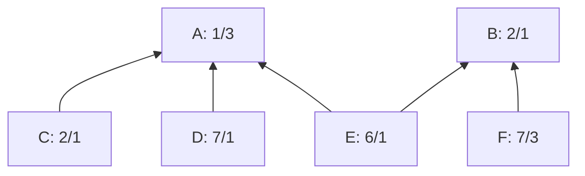
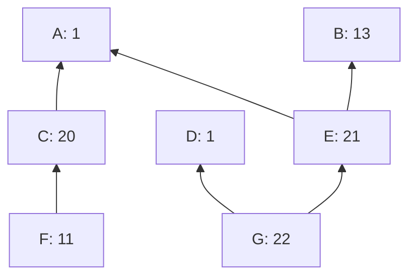
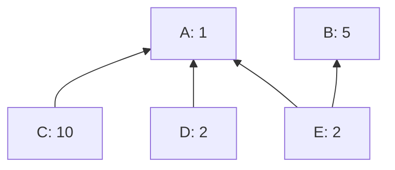

# Merging incomparable linearizations

sipa | 2023-12-04 21:36:19 UTC | #1

# Introduction

While we have several ways for computing good linearizations for a cluster from scratch, sometimes we don't start from scratch. We may have our own linearization already, but receive (through so far unspecified means) another linearization from a peer. If it's strictly better, we could just switch to it. But what if our linearization is better in some places, and theirs is better in other places? Can we somehow combine the "smarts" that they're based on, to construct an even better linearization?

As a reminder, we compare linearizations by computing all cumulative (size, fee) points after every chunk, and connecting them by straight lines. Each linearization has such a segmented line, which we call the fee-size diagram. If a linearization A has a diagram that is nowhere below that of linearization B, and at least in some places above it, we say A is strictly better than B. If the diagrams coincide everywhere, they're equal. If one diagram is on top in some place(s) and the other is on top in others, we call them incomparable.

Due to the (so far unproven, but accepted) property that every cluster has a well-defined non-empty set of optimal linearizations (which are all equal to each other, and all strictly better than all other linearizations), it must be the case that if two incomparable linearizations exist, there *must* exist at least one linearization that's strictly better than both. This topic is about finding such combined linearizations.

# Algorithms

## Best-chunk merging

We've known a simple merging algorithm for a while:

* Given two linearizations *L1* and *L2*:
  * While not all transactions have been processed:
    * Find highest-feerate prefix *P1* among all unprocessed transactions in *L1*.
    * Find highest-feerate prefix *P2* among all unprocessed transactions in *L2*.
    * Include the transactions from the higher-feerate of *P1* and *P2* in output linearization.
    * Mark the included transactions as processed

This algorithm can have $\mathcal{O}(n^2)$ runtime in the number of transactions, because there can be *n* iterations, and each can require $\mathcal{O}(n)$ work to find the highest-feerate prefix. In $\mathcal{O}(n)$ time we can of course also compute the full chunking of *L1* and *L2* (rather than just the first chunk), and it may be possible to reuse part of that computation across iterations; that may enable a lower complexity, but it seems nontrivial. And given the fact that in every case we'll probably want to run at least an ancestor-set based linearization from scratch ourselves (which is also $\mathcal{O}(n^2)$), it's probably fine to target the same complexity for a merging algorithm.

Sadly, this algorithm doesn't always produce an output that's better or equal than both inputs. It will produce a linearization whose diagram is at no point below the *lowest* of the two input diagrams, but that's not a particularly high bar. We could instead just stick with either one of the inputs instead to achieve that level of quality. In typical cases it'll be better of course, but there are no guarantees. And it is easy to find examples where the result is just one of the inputs, and thus still incomparable to the other one.

See the example below (labels are `fee/size`):

* The first input linearization is the ancestor set sort: [B,F,A,D,E,C], which is chunked as [BFADE,C].
* The second input is [B,A,E,C,D,F], which is chunked as [BAECD,F]. The BAECD chunk has higher feerate (18/7=2.571) than BFADE (23/9=2.556), but during the F part it is overtaken by BFADE.
* The result of merging is just the second input again.
* The optimal linearization would be [B,A,D,E,F,C], chunked as [BADE,F,C].

What we observe is that there is actually a common subset (BADE) of the two initial chunks that can be moved to the front, but the merging algorithm does not consider this.

## Intersection merging

In an attempt to address that, let's add a step to the merging algorithm to consider intersections:

* Given two linearizations *L1* and *L2*:
  * While not all transactions have been processed:
    * Find highest-feerate prefix *P1* among all unprocessed transactions in *L1*.
    * Find highest-feerate prefix *P2* among all unprocessed transactions in *L2*.
    * Let *P3* be the intersection of *P1* and *P2*. This is necessarily topologically valid.
    * Include the transactions from the highest-feerate of *P1*, *P2*, and *P3* in output linearization.
    * Mark the included transactions as processed

While it adds a step, the complexity is unchanged. Unfortunately, it still doesn't always result in a better linearization:

* The first input linearization is the ancestor set sort: [B,A,E,D,G,C,F], which is chunked as [B,AEDGC,F].
* The second input is [B,A,C,F,E,D,G], which is chunked as [BACFE,DG]. The BACFE chunk has higher feerate (66/5=13.5) than B (13) initially, but gets overtaken by the AEDGC chunk.
* The result of merging is equal to the second input.
* The optimal linearization would be [B,A,C,E,D,G,F], chunked as [BACE,DG,F].

Again the crux is discovering an intersection (BACE), but this time between the BACFE chunk and not one but two chunks of the other input (B and AEDGC).

## Prefix-intersection merging

The solution is to attempt more intersections. Observe that a linearization is really a way of constraining the search for subsets to just prefixes of the linearization. Given the intuition gained above that incomparabilities always seem to be due to a non-considered intersection between the two linearizations, it seems worthwhile try all intersections between prefixes of the first with prefixes of the second linearization. There can be a quadratic number of such intersections however, but maybe we can limit ourselves to just intersections that involve the best chunk of one of both linearizations at least:

* Given two linearizations *L1* and *L2*:
  * While not all transactions have been processed:
    * Find highest-feerate prefix *P1* among all unprocessed transactions in *L1*.
    * Find highest-feerate prefix *P2* among all unprocessed transactions in *L2*.
    * Find the highest-feerate set among all these:
      * Intersections between *P1* and all prefixes of *L2*.
      * Intersections between *P2* and all prefixes of *L1*.
    * Include the transactions from that set in the output linearization.
    * Mark the included transactions as processed
 
The various intersections between *P1* and prefixes of *L2* can be computed incrementally (keep adding transactions from *L2* if they're in *P1*, and remember the best one), and similarly for *P2* with prefixes of *L1*. This, like finding the *Pi* in the first place, can be done in $\mathcal{O}(n)$ time. The result is still an $\mathcal{O}(n^2)$ algorithm.

Surprisingly, this algorithm seems powerful enough to always find a linearization that's strictly better than both inputs if they're incomparable (and at least as good as the best of the two if they are comparable). This works regardless of the quality of the input linearizations (e.g. they don't need to be ancestor sort or better), and does not require connected chunks (see [linearization post-processing](https://delvingbitcoin.org/t/linearization-post-processing-o-n-2-fancy-chunking/201/6)). No proof, though.

-------------------------

ajtowns | 2023-11-20 09:46:53 UTC | #2

[quote="sipa, post:1, topic:209"]
The second input is [B,A,C,F,E,D,G], which is chunked as [BACFE,DG]. The BACFE chunk has higher feerate (66/5=13.5) than B (13) initially, but gets overtaken by the AEDGC chunk.
[/quote]

One way of characterising a chunk is by listing its childless-descendants; for BACFE, those would be E and F. But in this case F's feerate alone is 11, while BACFE's is 13.2; which gives you an easy clue that splitting that chunk into [BACE,F] would be an improvement.

[quote="sipa, post:1, topic:209"]
If one diagram is on top in some place(s) and the other is on top in others, we call them incomparable.
[/quote]

I think you could extend this comparison to create a compatible total order just by saying "given two diagrams, $d_1$ and $d_2$, then if $x_0$ is the earliest point where $d_1(x_0) \ne d_2(x_0)$, then $d_1 > d_2$ iff $d_1(x_0) > d_2(x_0)$" ?

I think "prefix-intersection merging" then guarantees to produce a linearisation $L_3$ such that $L_3 \ge L_1$ and $L_3 \ge L_2$ according to that total order. I don't think it guarantees that $L_3$ will be comparable to $L_1$ or $L_2$ according to the original partial order, but I think you'd need a fairly complicated cluster for that to actually occur.

-------------------------

sipa | 2023-11-23 18:01:38 UTC | #3

Prefix-intersection merging on $L_1$ and $L_2$ gives a linearization $L_3$ such that $L_3 \geq L_1$ and $L_3 \geq L_2$, according to the usual preorder on linearizations. If additionally $L_1$ and $L_2$ were incomparable (i.e., $L_1 \ngeq L_2$ and $L_1 \nleq L_2$), then $L_3 > L_1$ and $L_3> L_2$.

No proof, but I've spent a decent amount of CPU time (weeks) on trying to find counterexamples.

Under your total ordering it holds for any of these merge algorithms (including best chunk merging) that $L_3 \geq L_1$ and $L_3 \geq L_2$. The surprising part is that prefix-intersection merging seems powerful enough to achieve that under the preorder.

-------------------------

sdaftuar | 2023-11-20 17:32:17 UTC | #4

[quote="sipa, post:1, topic:209"]
If it’s strictly better, we should just switch to it.
[/quote]

I haven't processed this whole post yet, but just wanted to add an aside/reminder for the sake of our intuition: even if a linearization is strictly better than another one, it may still be the case that merging the two (even using our most naive algorithm) would produce a linearization better than either.

-------------------------

sipa | 2023-11-20 21:47:34 UTC | #5

[quote="ajtowns, post:2, topic:209"]
One way of characterising a chunk is by listing its childless-descendants; for BACFE, those would be E and F. But in this case F’s feerate alone is 11, while BACFE’s is 13.2; which gives you an easy clue that splitting that chunk into [BACE,F] would be an improvement.
[/quote]

Right, the childless-descendants in an optimal chunk are always higher feerate than the chunk itself (or more generally, any "bottom" subset (a subset that includes all its descendants) must have higher feerate than the chunk itself - if not, that subset could be removed without breaking topology, and doing so would increase the feerate).

This could be the basis for another general post-processing step (e.g. try all bottom subsets of 1 or 2 transactions, and if they have lower or equal feerate than the overall chunk, split them up). Similarly for top transactions with higher or equal feerate than the overall chunk. Of course, we could also hope to build linearization algorithms that just don't give rise to such chunkings in the first place.

FWIW, I think that relaying the set of childless-descendants for each chunk to a peer is another hypothetical way of conveying knowledge of linearizations. It could be made Erlay-compatible as it has set semantics, and with that set one can reconstruct the same linearization (and likely gives a decent result even if the clusters don't exactly match).

[quote="sdaftuar, post:4, topic:209"]
I haven’t processed this whole post yet, but just wanted to add an aside/reminder for the sake of our intuition: even if a linearization is strictly better than another one, it may still be the case that merging the two (even using our most naive algorithm) would produce a linearization better than either.
[/quote]

Yes, absolutely. I've changed the text to say "could" instead of "should". I think we'll want to run prefix-intersection merging (or some further iteration of this idea) anytime we have distinct linearizations of the same transactions. It even works when the input linearizations don't cover the exact same transactions but there is some overlap, though I haven't run tests for that.

-------------------------

sipa | 2023-11-23 18:00:57 UTC | #6

I've now learned that our comparison operation on linearizations (through comparing the diagram) is not a *partial order* but a *preorder*. The difference is that distinct elements can be equivalent under a preorder.

-------------------------

sipa | 2023-11-23 23:14:20 UTC | #7

Is it obvious that the following holds?

> By moving a subset of transactions, whose combined feerate is S, to the front of a linearization whose first chunk has feerate <= S, while keeping the relative order within the moved and within the non-moved transactions the same, the feerate diagram will be >= the old one (obviously subject to that being topologically valid).

If so, I may be able to prove prefix-intersection merging always results in something >= both original linearizations.

-------------------------

ajtowns | 2023-11-24 01:27:38 UTC | #8

I think you need slightly different terminology: given an ordered set of transactions $T = t_1, t_2, .., t_n$ then $Chunk(T)$ splits up that list, eg $C_1 = t_1, t_2; C_2 = t_3; C_3 = t_4, .., t_n$ while maintaining its order ($T = \sum Chunk(T)$), and gives you a valid diagram ($s(C_1) \ge s(C_2) \ge s(C_3)$). Then if chunking a given ordering of txs results in a single chunk, ie $Chunk(T) = C$, then any reordering of $T$ will result in a comparable diagram that is equal to or better than the diagram for $T$.

(That's then obviously true because the diagram has the same start/end points, the first diagram for $T$ is just a line, and the chunking inequality ensures the diagrams are concave)

-------------------------

ajtowns | 2023-11-24 15:23:37 UTC | #9

* Assume you have a function $C(L)$ that takes a linearisation $L$ and splits that into $P_L, T_L$ where $P_L$ is the first chunk, and $T_L$ is the rest of the linearisation. If $L$ is non-empty, $P_L$ is non-empty also; however $T_L$ may be empty.
* Assume you can calculate $L - X$ where $L$ and $X$ and the result is just $L$ with the transactions in $X$ removed
* We say that $A \le B$ by doing a feerate diagram comparison and noting $B$ is has a higher or equal feerate at all points.

I think prefix-intersection merging, $M(L_1, L_2)$ is equivalent to:

* Take $P_1, T_1 = C(L_1)$ and $P_2, T_2 = C(L_2)$
* Reorder the transactions in $P_1$ to match the order they appear in $L_2$, call this $P^\prime_1$, and then calculate $R_1, X_1 = C(P^\prime_1)$. Note that $P_1 \le R_1$.
* Calculate $R_2, X_2$ in the same way from $P_2$.
* Choose the highest feerate chunk from $R_1, R_2$:
  * If $R_1$ is the highest, then: $M(L_1, L_2) = R_1 + M(X_1 + T_1, L_2-R_1)$
  * Otherwise: $M_{PI}(L_1, L_2) = R_2 + M(L_1-R_2, X_2 + T_2)$

For the case where $R_1$ is highest, then $M(L_1, L_2) = M(R_1 + X_1 + T_1, L_2)$ and $L_1 \le R_1 + X_1 + T_1$.

The question is whether $L_2 \le R_1 + (L_2-R_1)$, noting that the transactions in $R_1$ that we've removed from $L_2$ maintain their order, and have an equal or higher feerate than the original best chunk.

Consider each chunk from $L_2$, call them $c_1, c_2, c_3, \dots, c_n$. Then define $d_i = c_i - R_1$, and $e_i = c_i - d_i$. In that case $R_1 = e_1 + e_2 + e_3 + \dots + e_n$ (because $R_1$ is the first chunk of $P^\prime_1$ which had its transactions put in the same order as $L_2$).

Define:

$$
\begin{align}
\gamma_j &= \sum_{i=1}^j c_i \\
\delta_j &= \sum_{i=1}^j d_i \\
\epsilon_j &= \sum_{i=1}^j e_i \\
\zeta_j &= \sum_{i=j+1}^n e_i \\
\end{align}
$$

We see $L_2 = \gamma_n$, and $R_1 + (L_2 - R_1) = \epsilon_n + \delta_n$ and $\epsilon_n = \epsilon_j + \zeta_j$. Note that the feerate of $\zeta_j$ is greater or equal to the feerate of $R_1 = \epsilon_n$ in all cases -- otherwise those transactions would not have been included in $R_1$ when calculating the chunk.

Consider total size of $\gamma_j$, $S(\gamma_j)$ and its total fee $F(\gamma_j)$. Note that the feerate diagram of $L_2$ is made up of the pairs $S(\gamma_j), F(\gamma_j)$.

If we consider $\epsilon_j + \delta_j$ then we simply have $S(\epsilon_j + \delta_j) = S(\gamma_j)$ and $F(\epsilon_j + \delta_j) = F(\gamma_j)$.

Now consider $\epsilon_j + \delta_j + \zeta_j$ -- for which the feerate diagram at position $S(\gamma_j)$ is at least $F(\epsilon_j + \delta_j)$, ie at least $F(\gamma_j)$. But we know $\zeta_j$ has a higher fee rate than any chunk in $\epsilon_j + \delta_j$, so the feerate diagram of $\epsilon_j + \zeta_j + \delta_j$ is an improvement. That gives $\gamma_j \le \epsilon_n + \delta_j$, and choosing $j=n$ gives $L_2 = \gamma_j \le \epsilon_n + \delta_n = R_1 + (L_2 - R_1)$. QED?

-------------------------

sipa | 2023-12-02 22:12:48 UTC | #10

(Only digested part of the above so far)

> Note that $R_1 \leq P_1$.

Why? Moving part of $P_1$ to the front could put a higher feerate new chunk up front.

> $M_{PI}(L_1,L_2)$

What is PI?

FWIW, my (incomplete) proof sketch is as follows:

* Assume that the following holds: moving transactions to the front of a linearization such that they form a new chunk, while leaving the internal ordering within moved and non-moved transactions the same, is a non-worsening of the diagram if the new chunk's feerate is >= the original first chunk's feerate. (~~no proof~~ EDIT: see proof [here](https://delvingbitcoin.org/t/merging-incomparable-linearizations/209/28))
* Also assume that reordering the transaction *within* one chunk can never worsen the diagram (worst case the chunk set remains the same, best case it splits in multiple parts).
* The prefix-intersection merging algorithm can be seen as starting with two linearizations $L_1$ and $L_2$, and in each step moves some transactions to the front of both. Each step is a non-worsening of the diagram of both, and in the end, both linearizations are identical. That resulting linearization is thus better or equal than each of the inputs. To see why each step is a non-worsening:
  * WLOG, assume the intersection found is a subset of $L_1$'s first chunk, in the order of transactions of $L_2$. (swap the linearizations if not)
  * The change applied to $L_1$ is just a reordering of its first chunk, which is fine.
  * The change applied to $L_2$ is moving a new chunk to the front, of feerate at least that of its original first chunk (if not, that chunk would have been chosen instead), leaving the order within moved and non-moved transactions the same. This is fine.
  * Afterwards, both linearizations start with the same transactions (at least one, so progress is made), so we can continue with just the distinct suffix.

-------------------------

ajtowns | 2023-11-25 11:09:50 UTC | #11

sigh, those are both typos. I mean $P_1 \le R_1$ [this is your "Also assume"] and I changed $M_{PI}$ to $M$ in editing - "PI" stood for prefix-intersection.

-------------------------

sipa | 2023-11-25 03:29:03 UTC | #12

(working my way through further)

Interesting observation, I hadn't realized this before: any suffix of a chunk's linearization (which leaves at least one transaction off) must have higher feerate than the chunk itself. If it didn't, the chunk without the suffix would have higher feerate and thus be the chunk instead.

-------------------------

ajtowns | 2023-11-25 11:36:05 UTC | #13

yeah, chunking means that suffix-pays-for-prefix. (could be equal rather than higher, depending on whether chunking is maximal or minimal) [edit: i guess we always want minimal -- as if we have two chunks of the same feerate, it's easy to combine them when building a block, but much harder to split a chunk]

-------------------------

sipa | 2023-11-25 12:42:36 UTC | #14

Indeed. Smaller chunks are better in general, so if possible, you want not chunk equal feerate subsets together.

-------------------------

sipa | 2023-11-26 03:33:29 UTC | #15

I don't think I follow the last paragraph.

This $\epsilon_j + \delta_j + \zeta_j$ diagram, is that considering this expression at different values of $j$? I'm confused how it can be evaluated at $S(\gamma_j)$, or really how it forms a diagram at all.

Also generally, to prove a diagram is everywhere &geq; than another, you need to show both that all points of the first lie &geq; the second, but **also** that all points of the second lie &leq; the first.

-------------------------

ajtowns | 2023-11-26 05:10:37 UTC | #16

(I'm finding it hard to work out a decent way of comparing diagrams that doesn't get lost in details really quickly. Perhaps the problem is that I really only want to compare orderings of a given set of transactions after chunking them, not compare two orderings of potentially two different sets of transactions with arbitrary groupings)

Anyway, I guess the general case I'm going for here is

$$
\epsilon_n + \delta_j \ge \gamma_j + \zeta_j
$$

Those are comprised of the exact same txs, ie $d_1, .., d_j$ and $e_1, .., e_n$, but in different orders. The QED step is setting $j=n$ giving $\zeta_j=\emptyset$, and thus $R_1 + (L_2 - R_1) = \epsilon_n + \delta_n \ge \gamma_n = L_2$. $\ge$ is a diagram comparison after chunking the txs, and $+, \sum$ are concatenation.

The initial step for $j=0$ is easy: $\delta_0 = \gamma_0 = \emptyset$ and $\epsilon_n = \zeta_0$ by construction.

The inductive step is to show $\epsilon_n + \delta_{j+1} \ge \gamma_{j+1} + \zeta_{j+1}$. To show that, we have:

$$
\begin{align}
\epsilon_n + \delta_{j+1} &= (\epsilon_n + \delta_j) + d_{j+1} \\
 &\ge (\gamma_j + \zeta_j) + d_{j+1} \\
 &= \gamma_j + (e_{j+1} + \zeta_{j+1}) + d_{j+1} \\
 &\ge \gamma_j + e_{j+1} + (d_{j+1}) + \zeta_{j+1} \\
 &\ge \gamma_j + (c_{j+1}) + \zeta_{j+1} \\
 &= \gamma_{j+1} + \zeta_{j+1}
\end{align}
$$

Note that this chain is from best linearisation to worse. Steps are:

 * inductive hypothesis
 * moving $d_{j+1}$ after $\zeta_{j+1}$ improves things (observe that $\zeta_{j+1}$ has a higher feerate than any chunk)
 * reordering the chunk $c_{j+1}$ into $e_{j+1} + d_{j+1}$ doesn't make things worse

Not sure how to properly formalise those steps yet, but I think they're okay.

-------------------------

sipa | 2023-11-26 13:49:30 UTC | #17

Ok, I'm with you. I didn't realize before that + meant concatenation.

So you're essentially relying on 3 steps which each individually don't make the diagram worse, and composing them to show that moving a new higher-fee chunk to the front while leaving internal ordering the same, makes the overal thing not worse.

Those 3 steps are:
* If $a \geq b$, then $a + c \geq b + c$. That seems reasonable, though I do want to think through what happens when $c$ gets chunked together with some suffix of $a$ or $b$ (but not both).
* Two chunks can be swapped if the second one has higher feerate than the (highest chunk feerate in) the first. That's probably true under some conditions, but it's not entirely clear to me what those conditions are. Does this also hold when both/either isn't really a chunk (in the sense of being chunked togeter) but consists of multiple?
* Reordering and splitting a chunk is fine. If it's really a chunk, then this is obviously the case - it's just reordering transactions within a chunk which at worst has no effect on the diagram - but is it obvious here that $c_{j+1}$ is actually a single chunk, when considered in the linearization presented there?

In short, I think we need some theorems that relate diagram quality with transformations/reorderings of the linearization, even when those modify chunk bounaries.

-------------------------

ajtowns | 2023-11-26 16:24:32 UTC | #18

I think all these steps rely really heavily on how they're setup via the prefix intersection algorithm -- eg, $c_{j+1}$ is a chunk in $\gamma_j + c_{j+1}$, because $\gamma_j = c_1 + c_2 + .. + c_j$ and $c_1, c_2, .., c_n$ is a correct chunking, and then the fact that you generate a chunking by merging tx sets in any order means that if you add stuff on the end of that, you can start off with that chunking, and then you'll only potentially be merging those chunks from the tail, you'll never need to split them up.

I'm starting to have a bit of luck formalising this in lean4, fwiw, but it's slow progress : I can convert a list of txs into a chunking, and compare fee rate graphs (evaluating the diagram at each integer byte/weight with a total fee in $\mathbb Q$), but currently don't have any theorems about any of that.

(If you have a better way of defining a diagram than as a function from $\mathbb N \to \mathbb Q$ that'd be great. I started off trying to do line segments from $(s_1,f_1) \to (s_2,f_2)$ but that got super painful super fast)

-------------------------

sipa | 2023-11-26 17:09:16 UTC | #19

I guess what we need is a slightly more general concept of a chunking, which is a sequence of transaction sets, without the requirement that their feerates are monotonically decreasing.

And we can define a diagram for such a general chunking too, it's just not necessarily ~~convex~~ concave.

Let $C\left((s_1,s_2,\ldots,s_n)\right) = (t_1,t_2,\ldots,t_m)$ be the chunking operation, which just merges adjacent sets whenever the later one is higher feerate than the earlier one.

Then there are some theorems that hold, I think, such as:
* $C(S) \geq S$
* $A \geq B \implies C(A) \geq C(B)$

-------------------------

ajtowns | 2023-11-26 17:08:05 UTC | #20

I think diagrams for chunked sets are concave not convex? (I looked it up after I said convex previously -- https://en.wikipedia.org/wiki/Concave_function -- outside of polygons, this terminology always confuses me)

Playing around at https://github.com/ajtowns/lean4-clump/tree/master/Clump . Copying the text of those files into https://live.lean-lang.org/ seems to work, without needing to install anything.

-------------------------

sipa | 2023-11-26 21:26:44 UTC | #21

If the "unicity of corresponding chunking" theorem holds (which seems fairly obvious to me, though I lack the formality to prove it), then this also holds:

* $C(A + B) = C(A + C(B)) \geq A + C(B)$
* $C(A + B) = C(C(A) + B) \geq C(A) + B$

-------------------------

ajtowns | 2023-11-27 07:15:18 UTC | #22

Oh, this gets easier if you split $C$ into two steps: one to raise `List Tx` into `List (List Tx)` (by putting every element in a singleton list), call it $c=R(s)$, and the other that repeatedly merges adjacent chunks when they're out of order and gives you the best chunking, $b=C(c)$

Then you have $C(a) \ge a$ fairly straightforwardly (hopefully?), and also $C(a+b) = C(C(a) + b) = C(a+C(b)) = C(C(a)+C(b))$ directly from merge order independence.

Also, I think that means you're always comparing chunks (`List Tx`) by feerate, and chunkings (`List (List Tx)`) by diagram.

-------------------------

sipa | 2023-11-27 12:29:10 UTC | #23

I was thinking of $C$ as an operation on a list of (generalized, not necessarily monotonically decreasing feerate) chunks - whether those are obtained by starting with the singletons from a linearization, or something else.

We want to prove that $C(\epsilon_n + \delta_n) \geq \gamma_n$ I think. I suspect it's possible to adapt your derivation above to work by placing $C()$ invocations carefully, and using the rules around it.

-------------------------

sipa | 2023-11-29 19:01:17 UTC | #24

EDIT: this theorem is insufficient, as it doesn't allow for cases where the moved good transactions get chunked together with bad transactions; a scenario that is possible in the prefix-intersection merging algorithm.

### Theorem

Given the following:
* A linearization $L$
* A topologically valid subset $T$ of the transactions in $L$ (which we'll call "good" transactions).
* The good transactions merge into a single chunk of feerate $f$, when considered in the order they appear in in $L$.
* The highest chunk feerate of the bad transactions, again retaining the order of $L$, does not exceed $f$.

Under those conditions, moving the good transactions to the front of the linearization (leaving the internal order of good transactions and that of bad transactions unchanged) results in a better or equivalent linearization (by becoming the new first chunk, of feerate $f$).

### Proof

Observe that, among the set of linearizations for the same transactions which leave the internal orderings unchanged, none can give rise to a chunk feerate exceeding $f$. If it did, there must be some topologically valid subset $v$ of transactions, consisting of a union of a prefix of the good transactions and a prefix of the bad transactions, whose combined feerate exceeds $f$. No prefix of the bad transactions can exceed feerate $f$, thus there must be a prefix of the good transactions that does. This is in contradiction with the given fact that all the good transactions merge into a single chunk of feerate $f$.

Further observe that all good transactions merging into a single chunk of feerate $f$ implies that any suffix of good transactions has feerate $\geq f$.

To prove that moving all good transactions to the front of the linearization always results in a better or equivalent linearization as the original, we will show that the following algorithm never worsens the diagram, and terminates when all the good transactions are in front:
* Compute the chunking $(c_0, c_1, \ldots, c_n)$ of the current linearization, merging equal-feerate chunks (this does not break the monotonic decrease property, and guarantees each $c_i$ has distinct feerate).
* Find the last chunk index $t$ such that $c_t \cap T \neq \emptyset$.
* Modify the linearization by reordering the $c_t$ transactions such that all of $c_t \cap T$ are at the start of $c_t$.
* Repeat (which implies rechunking).

To show that this never worsens the diagram, it suffices to see that reordering transactions within a chunk at worst leaves the chunk unchanged, and at best splits it, which improves the diagram.

Further, this algorithm makes progress as long as $c_t$ does not start with all its good transactions. As long as that is the case, a nonzero amount of progress towards having all the good transactions at the start of the linearization is made. Thus, after a finite number of such steps, that end state must be reached.

It remains to be shown that $c_t$ cannot start with all its good transactions unless the end state is reached. Assume it does start with all its good transactions. The set $c_t \cap T$ is a suffix of the good transactions, and thus has feerate $\geq f$. Since $c_t$ *starts* with $c_t \cap T$, the chunk $c_t$ itself must have feerate $\geq f$. However, every chunk must have feerate $\leq f$. The combination of those two means $c_t$ has *exactly* feerate $f$. There can only be one such chunk (as all $c_i$ have distinct feerates), and it must be the first one (because no higher feerate is possible), so $t=0$. In this case, we are in the end state, because the first chunk is the only one with good transactions, and all good transactions are at its front.

-------------------------

ajtowns | 2023-11-28 08:12:11 UTC | #25

[quote="sipa, post:24, topic:209"]
The highest chunk feerate of the bad transactions, again retaining the order of $L$, does not exceed $f$.
[/quote]

I don't like that assumption; you can only check it after you've done all the work, rather than beforehand, and it conceivably could turn out to be false. I think a better assumption would be "The first chunk of $L$ has a feerate $f_0$ which does not exceed $f$"

[quote="sipa, post:24, topic:209"]
there must be some topologically valid subset
[/quote]

I think by "topologically valid" you're meaning that no parents follow their child, **and** that all parents are included; ie if you have $c$ spends $p$ spends $gp$, then $[gp, p, c]$ and $[gp, p]$ are topologically valid, but $[p,c]$ is not. This lets you say that if $b$ is topologically valid, then for any $a,x$, if $a + b$ is topologically valid, then $b + a$ is also topologically valid. You also have $a + b$ being t.v implies $a$ is t.v, and that gives you $b_1 + b_2 + .. + b_n$ being t.v and $a_0 + b_1 + .. + b_n + a_n$ being t.v gives $b_1 + .. + b_n + a_0 + .. + a_n$ being t.v. 

[quote="sipa, post:24, topic:209"]
Modify the linearization by reordering the $c_t$ transactions such that all of $c_t \cap T$ are at the start of $c_t$.
[/quote]

For the intermediate steps, you're not moving txs all the way to the front, though, so I think you want something slightly cleverer still; perhaps $a + b + c$ and $a + c$ being t.v gives $a + c + b$ being t.v is enough.

I think you could rewrite this slightly:

 * Chunk to $(c_0, .., c_n)$ normally, pick $t$.
 * Note that fee rate of $c_0 \le f$ (is it?) and the feerate of $c_i \ge c_{i+1}$ as a property of chunking.
 * Construct $c^\prime_t$ by reordering $c_t$ to ensure the good txs are at the start.
 * If $c_{t-1}$ has feerate less than $f$ or $c_t \cap T \ne T$ then the good txs at that start of $c^\prime_t$ will have higher feerate than $c_{t-1}$ (because every tail of $T$ has higher feerate than $f$) and the final good txs will appear in chunk $t-1$ or lower on the next round.
 * Otherwise, the good txs at the start of $c^\prime_t$ are precisely $T$, those txs and each of $c_0, .., c_{t-1}$ have feerate $f$ (as $c_0$'s feerate is $f_0 \le f$ by assumption, and by feerate $c_i \ge c_{i+1}$ due to the chunking algorithm, and $T$ has feerate $f$ by definition). But in that case reordering to be $T, c_0, .., c_{t-1}$ doesn't change the diagram, because all the reordered chunks have precisely the same feerate.

Note that your good txs will never get split up once you've moved them, so $c_0$ will have the same composition and feerate it had originally until $t=0$ and $c_0 \cap T = T$, and merging some subset of the good txs into $c_{t-1}$ will mean all of them are merged.

Also, I think your theorem needs a tweak: if you have equal size txs with feerates $a=0,b=6,c=9,d=0,e=5$, and start with $L=[a,b,c,d,e]$ and $T=[a,e]$, then your original chunks were $[a,b,c], [d,e]$ with both those chunks and $T$ having a feerate of 5. But your new linearisation of $[a,e,b,c,d]$ chunks to $[a,e,b,c] [d]$ with feerates 6.25 and 0. Which is fine, it's just that $T$ doesn't actually become the first chunk, since we end up finding a chunk with feerate greater than $f$ instead.

-------------------------

sipa | 2023-11-28 13:13:05 UTC | #26

[quote="ajtowns, post:25, topic:209"]
I don’t like that assumption; you can only check it after you’ve done all the work, rather than beforehand, and it conceivably could turn out to be false.
[/quote]

It can be checked beforehand: it's just the feerate of the first chunk of $L \setminus T$ is $\leq f$.

[quote="ajtowns, post:25, topic:209"]
I think a better assumption would be “The first chunk of $L$ has a feerate $f_0$ which does not exceed $f$
[/quote]

Hmm, indeed, that would be a better starting point, as it exactly matches the conditions in the actual prefix-intersection merging algorithm. And it's not equivalent to mine (as your example at the end of your post shows; in that example the highest chunk feerate of bad transactions is 7.5 which exceeds $f=5$). I'll think about generalizing it.

[quote="ajtowns, post:25, topic:209"]
I think by “topologically valid” you’re meaning that no parents follow their child, **and** that all parents are included
[/quote]

Indeed, something like this needs to be included in the proof. Also further, it's currently unclear why it's even allowed to move the $c_t \cap T$ transactions to the front of $c_t$.

[quote="ajtowns, post:25, topic:209"]
I think you could rewrite this slightly:
[/quote]

I don't think you need an argument about what happens to $c_t$ after rechunking. It's sufficient that progress was made by moving a nonzero number of transactions towards the front. If you can keep doing that, all of them will end up at the front of $L$. And we prove progress will keep being made until they are all at the front of $L$, so that is indeed the end state.

[quote="ajtowns, post:25, topic:209"]
because all the reordered chunks have precisely the same feerate.
[/quote]

Note that I started off by merging equal-feerate chunks, so there can be at most one chunk for any given feerate.

[quote="ajtowns, post:25, topic:209"]
Also, I think your theorem needs a tweak
[/quote]

Right, this example does capture a situation we want the theorem to cover, but it currently doesn't.

-------------------------

sipa | 2023-11-28 20:14:40 UTC | #27

Sadly, the proof breaks entirely when chunks with feerate $> f$ are permitted. It is possible, by following the "move good transactions to front of last chunk that has any" algorithm, to end up in a situation that's *better* than the desired end state (all good transactions up front). The theorem is still likely true, but the proof technique of individual move steps to achieve it does not work, unless it can somehow be amended to never improve beyond the goal.

-------------------------

sipa | 2023-12-01 21:31:13 UTC | #28

New attempt, with a fully "geometric" approach to show the new diagram is above the old one, but largely using insights about sets from @ajtowns's [proof sketch](https://delvingbitcoin.org/t/merging-incomparable-linearizations/209/16) above.

### Theorem

Given:
* A linearization $L$
* A topologically valid subset $G$ of the transactions in $L$ ("G" for "good" transactions).
* Let $L_G$ be the linearization of the transactions $G$, in the order they appear in $L$.
* Let $L_B$ be the linearization of the transactions *not* in $G$ ("bad"), in the order they appear in $L$.
* Let $f$ be the highest chunk feerate of $L$.
* $L_G$ (considered in isolation) must form a single chunk, with feerate $\geq f$.

Then:
* $L_G + L_B$ is at least as good as $L$ (better or equal feerate diagram, never worse or incomparable).

Let's call this the **gathering theorem** (it matches what the `VGATHER*` AVX2 x86 CPU instructions do to bitsets).
### Proof

* Let $S(x), F(x), R(x)$ respectively denote the size, fee, and feerate of the set $x$.
* Let $(c_1, c_2, \ldots, c_n)$ be the chunking of $L$ (the $c_i$ are transaction sets).
* We know $R(c_i) \leq f$ for $i=1 \ldots n$, because of input assumptions.
* Let $\gamma_j = \cup_{i=1}^{j} c_i$ (union of all chunks up to $j$).
* Let $e_i = c_i \cap G$ for all $i=0 \ldots n$ (the good transactions from each chunk).
* Let $\zeta_j = \cup_{i=j+1}^{n} e_i$ (union of all good transactions in chunks after $j$).
* Because $\zeta_j$ is a suffix of $L_G$, which is a single chunk with feerate $\geq f$, we know $R(\zeta_j) \geq f$ for all $j=0 \ldots n-1$.
* Let $P(x) = (S(x), F(x))$ be the point in 2D space corresponding to the size and fee of set $x$.
* Let $D$ be the diagram connecting the points $(P(\gamma_j))_{j=0}^{n}$, corresponding to the prefixes of chunks of $L$. This is the diagram of $L$.
* Let $N$ be the diagram connecting the points $(0,0)$ followed by $(P(\gamma_j \cup \zeta_j))_{j=0}^n$, corresponding to the prefixes of $L_G + L_B$ consisting of all good transactions and the bad transactions up to chunk $j$.
* $N$ is *not* the diagram of $L_G + L_B$ because that requires rechunking that linearization. However, rechunking can only improve the diagram, so $N$ *is* an underestimate for the diagram of $L_G + L_B$.
* $D$ is a concave function. A point lies strictly under a concave function iff it lies under every line segment that makes up $D$, extended to infinity. Thus, a point lies on or above $D$ iff it lies on or above at least a single line that makes up $D$.

In the drawing below, the blue diagram formed using the $\gamma_i+\zeta_i$ points (plus initial green $\zeta_0$ segment) is an underestimate for $N$, the diagram of $L_G+L_B$. The red diagram shows $D$, the diagram for $L$. Intuitively, the blue diagram lies above the red diagram because the slope of all the green lines is never less than that of any red line:

In what follows, we will show that every point on $N$ lies on or above a line making up $D$. If that holds, it follows that $N$ in its entirety lies on or above $D$:
* The first diagram segment of $N$, from $(0,0)$ to $P(\gamma_0 \cup \zeta_0)$, is easy: it corresponds to $L_G$ itself, which has feerate (slope) $\geq f$. All of these points lie on or above the first line of $D$, from $P(\gamma_0)$ ($= (0,0)$) to $P(\gamma_1)$, which has feerate (slope) $f$.
* For all other diagram segments of $N$, we will compare line segments with those in $D$ with the same $j = 0 \ldots n-1$. In other words, we want to show that the line segment from $P(\gamma_j \cup \zeta_j)$ to $P(\gamma_{j+1} \cup \zeta_{j+1})$ lies on or above the line through $P(\gamma_j)$ and $P(\gamma_{j+1})$.
  * $P(\gamma_j \cup \zeta_j)$ lies on or above the line through $P(\gamma_j)$ and $P(\gamma_{j+1})$ iff $R(\zeta_j) \geq R(c_{j+1})$. This follows from $R(\zeta_j) \geq f$ and $R(c_{j+1}) \leq f$.
  * $P(\gamma_{j+1} \cup \zeta_{j+1})$ lies on or above the line through $P(\gamma_j)$ and $P(\gamma_{j+1})$ iff $R(c_{j+1} \cup \zeta_{j+1}) \geq R(c_{j+1})$. This follows from the $f$ relations too, except for $j=n-1$, but there the endpoints of the two graphs just coincide.
  * All points between $P(\gamma_j \cup \zeta_j)$ and $P(\gamma_{j+1} \cup \zeta_{j+1})$ lie on or above the line through $P(\gamma_j)$ and $P(\gamma_{j+1})$, given that the endpoints of the segment do.

Thus, all points on an *underestimate* of the diagram of $L_G + L_B$ lie on or above the diagram of $L$, and we conclude that $L_G + L_B$ is a better or equal linearization than $L$.

### Generalization

It is easy to relax the requirement that $L_G$ forms a single chunk. We can instead require that only the *lowest* chunk feerate of $L_G$ is $\geq f$. This would add additional points to $N$ corresponding to the chunks of $L_G$, but they would all lie above the existing first line segment of $N$, which cannot break the property that $N$ lies on or above $D$.

-------------------------

sipa | 2023-11-29 22:15:13 UTC | #29

Merging individually [post-processed](https://delvingbitcoin.org/t/linearization-post-processing-o-n-2-fancy-chunking/201) linearizations (thus, ones with connected chunks) may result in a linearization whose chunks are disconnected. This means post-processing the merged result can still be useful.

For example:

* L1 = [B,A,E,C,D] (chunked as [B,AEC,D])
* L2 = [B,A,D,C,E] (chunked as [B,ADC,E])
* Prefix-intersection merge yields [B,A,C,D,E] (chunked as [BAC,D,E])
* Post-processing the merge gives [A,C,B,D,E] (chunked as [AC,B,D,E])

-------------------------

ajtowns | 2023-11-30 19:01:40 UTC | #30

[quote="sipa, post:28, topic:209"]
In what follows, we will show that every point on $N$ lies on or above a line making up $D$. If that holds, it follows that $N$ in its entirety lies on or above $D$:
[/quote]

I think the intuition for this is that you're constructing a (possibly non-optimal) feerate diagram for $L_G+L_B$ by taking the subsets $L_G + \sum_{i=1}^j d_i$ and showing this is a better diagram than that of $L$. Because you can't say anything about $d_i$ (the bad parts of each chunk), you're instead taking the first $j$ chunks as a whole, which have a feerate of $f$ or lower, and then the suffix of $L_G$ that was missed, which has a feerate of $f$ or high, which kinks the diagram up. Kinking the diagram up means this subset has a better diagram than the chunks up to and including $c_j$.

FWIW, I think this was the argument I was trying to make in [my earlier comment](https://delvingbitcoin.org/t/merging-incomparable-linearizations/209/9) but couldn't quite get a hold of.

I think the general point is just: $L^* \ge L$ if (and only if?) for each $\gamma_i$ (prefixes matching the optimal chunking of $L$) there exists a set of txs $\zeta_i$ where $\gamma_i \cup \zeta_i$ is a prefix of $L^*$ and $R(\zeta_i) \ge R(\gamma_i)$.

Ah! Actually, isn't a better "diagram" to consider the ray from the origin to these $P(\gamma_i)$ points in general, ie, for $x=0...c_1$ plot the y value as $R(\gamma_1)$, for $x=c_1..c_2$ plot $R(\gamma_2)$ etc. Then (I think) you still compare two diagrams by seeing if all the points on one are below all the points on the other; but have the result that for an optimal chunking, the line is monotonic decreasing, rather than concave.

Also, with that approach, to figure out the diagram for the optimal chunking, you just do the diagram for every tx chunked individually, it's just $f_{opt}(x) = \max(f(x^\prime), x^\prime \ge x)$.

-------------------------

sipa | 2023-11-30 19:30:00 UTC | #31

[quote="ajtowns, post:30, topic:209"]
I think the intuition for this is that you’re constructing a (possibly non-optimal) feerate diagram for $L_G+L_B$ by taking the subsets $L_G + \sum_{i=1}^j d_i$ and showing this is a better diagram than that of $L$. Because you can’t say anything about $d_i$ (the bad parts of each chunk), you’re instead taking the first $j$ chunks as a whole, which have a feerate of $f$ or lower, and then the suffix of $L_G$ that was missed, which has a feerate of $f$ or high, which kinks the diagram up. Kinking the diagram up means this subset has a better diagram than the chunks up to and including $c_j$.
[/quote]

Exactly. I've added a drawing to illustrate this, I think.

[quote="ajtowns, post:30, topic:209"]
Ah! Actually, isn’t a better “diagram” to consider the ray from the origin to these $P(\gamma_i)$ points in general, ie, for $x=0...c_1$ plot the y value as $R(\gamma_1)$, for $x=c_1..c_2$ plot $R(\gamma_2)$ etc. Then (I think) you still compare two diagrams by seeing if all the points on one are below all the points on the other; but have the result that for an optimal chunking, the line is monotonic decreasing, rather than concave.
[/quote]

Do you perhaps mean plotting $F(\gamma_i)$ (fee) instead of $R(\gamma_i)$ (feerate)?

If so, that's always monotonically increasing (just because fees are never negative).

-------------------------

ajtowns | 2023-11-30 19:51:14 UTC | #32

FWIW, I think you don't need case $\gamma_0 + \zeta_0$ in your proof, just the ones after each chunk suffice.

[quote="sipa, post:31, topic:209"]
Do you perhaps mean plotting $F(\gamma_i)$ (fee) ...
[/quote]

No, I meant fee rate -- plotting fee gives you the current diagram, eg:

Plotting fee rate looks like:

Spreadsheet to play around: https://docs.google.com/spreadsheets/d/1blG8NBjcjidVJhsmXGoEaJljlmeFFUJccYrWfTUVcjU/edit?usp=sharing

-------------------------

sipa | 2023-11-30 20:03:23 UTC | #33

[quote="ajtowns, post:32, topic:209"]
FWIW, I think you don’t need case $\gamma_0 + \zeta_0$ in your proof, just the ones after each chunk suffice.
[/quote]

I think that's a question of formality. It's of course obvious that if all points after each chunk lie above the old diagram, then the line from the origin to the first point does too. Yet, we actually do require the property that that line in its entirety lies above the old diagram too. Depending on how "obvious" something needs to be before you choose not to mention it, it could be considered necessary or not.

[quote="ajtowns, post:30, topic:209"]
Then (I think) you still compare two diagrams by seeing if all the points on one are below all the points on the other
[/quote]

~~I don't think this works. It is very much possible to construct a (fee) graph N that lies above graph D everywhere, but whose derivatives (feerates) aren't.~~

EDIT: I see, you're talking about average feerate for the entire set up to that point, not the feerate of the chunk/section itself. Hmm. Isn't that just another way of saying the fee diagram is higher?

-------------------------

ajtowns | 2023-11-30 20:16:51 UTC | #34

[quote="sipa, post:33, topic:209, full:true"]
[quote="ajtowns, post:32, topic:209"]
FWIW, I think you don’t need case $\gamma_0 + \zeta_0$ in your proof, just the ones after each chunk suffice.
[/quote]

I think that's a question of formality.
[/quote]

No, I mean that you can just choose the origin for your first point and go straight to $\gamma_1 \cup \zeta_1$ when constructing $N$, and run the same logic.

[quote="sipa, post:33, topic:209"]
EDIT: I see, you’re talking about average feerate for the entire set up to that point, not the feerate of the chunk/section itself. Hmm. Isn’t that just another way of saying the fee diagram is higher?
[/quote]

Yes, precisely -- it is another way of saying the same thing, I think it's just easier to reason about (horizontal line segments that decrease when you've found the optimal solution).

Translating the $N$ is better than $L$ proof becomes: look at the feerate at $\gamma_i$; now consider the feerate for $\gamma_i + \zeta_i$ -- it's higher, because $\zeta_i \ge f$ and the size of that set is greater, and an optimal chunking will extend that feerate leftwards, so $N$ chunks better up to $i$, for each $i$, done. You don't have to deal with line intersections.

-------------------------

sipa | 2023-11-30 23:17:01 UTC | #35

[quote="ajtowns, post:34, topic:209"]
No, I mean that you can just choose the origin for your first point and go straight to $\gamma_1 \cup \zeta_1$when constructing $N$, and run the same logic.
[/quote]

Right, that works, we could just drop $\gamma_0 \cup \zeta_0$ from $N$. I don't think it actually simplifies the proof though, because the reasoning for the first segment (now from $(0,0)$ to $P(\gamma_1 \cup \zeta_1)$), would still be distinct from that for the other segments.

[quote="ajtowns, post:34, topic:209"]
Yes, precisely – it is another way of saying the same thing, I think it’s just easier to reason about (horizontal line segments that decrease when you’ve found the optimal solution).
[/quote]

Consider the following:
* 3 transactions A (fee 0), B (fee 3), C (fee 1), all the same size.
* $L_1$ = [A,B,C], chunked as [AB=3/2, C=1/1]
* $L_2$ = [B,A,C], chunked as [B=3/1, AC=1/2]
* $L_2$ is a strictly better linearization, the fee-size diagram is higher everywhere.
* The feerate (using the $R(\gamma_i)$ method) for the middle byte is 3/2 for $L_1$, but 4/3 for $L_2$. Would they be considered incomparable by the feerate-size diagram?

-------------------------

ajtowns | 2023-12-04 06:42:52 UTC | #36

[quote="sipa, post:35, topic:209"]
I don’t think it actually simplifies the proof though
[/quote]

Yeah, agreed; was more just thinking from the general case where $\zeta_i$ might not have the same nice pattern.

[quote="sipa, post:35, topic:209"]
Consider the following:
[/quote]

Hmm, you're right, my simplification to a flat graph doesn't seem to do anything useful. :sob:

[EDIT: added the :sob: emoji as a possible post reaction]

-------------------------

sipa | 2023-12-03 18:44:47 UTC | #37

Interesting, it appears that prefix-intersection merging is not associative.

That is, given 3 linearizations A, B, C of a given cluster it is possible that not all three of these are equally good:
* merge(merge(A, B), C)
* merge(merge(A, C), B)
* merge(merge(B, C), A)

This holds even when the inputs, intermediary results, or outputs (or any combination thereof) are [post-processed](https://delvingbitcoin.org/t/linearization-post-processing-o-n-2-fancy-chunking/201).

-------------------------

sipa | 2023-12-03 20:17:32 UTC | #38

Prefix-intersection merging can be simplified to the following:

* Given two linearizations $L_1$ and $L_2$
* (Optionally) Output any prefix of both that's identical.
* Let $P_i$ be the highest-feerate prefix of $L_i$, for $i \in {1,2}$.
* Assume without loss of generality that $R(P_1) \geq R(P_2)$ (swap the inputs if not).
* Let $C$ be the highest-feerate prefix of $L_2 \cap P_1$.
* Output $C$, remove it from $L_1$ and $L_2$, and start over.

So we only need to find the best prefix of the intersection of the highest-feerate prefix with the other linearization, and not the other direction.

This does not break the "as good as both inputs" proof, and from fuzzing it appears it that this doesn't worsen the result even (it could be that this results in worse results while still being at least as good as both inputs, but that seems not to be the case).

I don't have a proof (yet) that the algorithms are equivalent, but given that it's certainly correct still, it's probably fine to just use this simpler version?

-------------------------

ajtowns | 2023-12-04 06:45:08 UTC | #39

If you have L1=[5,3,1,8,0] (chunk feerates: 5, 4, 0)  and L2=[0,8,1,3,5] (chunk feerates: 4, 3) then [bestPi](https://delvingbitcoin.org/t/merging-incomparable-linearizations/209/38) chooses $C=L2 \cap [5]$ to start with, ending up as [5,8,3,1,0]. Whereas calculating and comparing $C_1$ and $C_2$ would produce [8,5,3,1,0].

But [post-processing](https://delvingbitcoin.org/t/linearization-post-processing-o-n-2-fancy-chunking/201) probably fixes that for most simple examples at least?

(Even if post-processing didn't fix it; I think so long as merging produces something at least as good as both, that's fine; quicker/cheaper is more important)

-------------------------

ajtowns | 2023-12-04 08:44:31 UTC | #40

I think you can make post-processing fail to help for this example just by adding a small, low-fee parent transaction P that is a parent to both the 8-fee and 5-fee txs.

I think if you have five transactions, A,B,C,D,E, of 10kvB each at 50,30,10,80,0 sat/vb, and one transaction, P, at 100vB and 0 sat/vb that each of A,D spends an output of, with the same arrangement as above, then post-processing doesn't fix it either?

 * L1 = [P,A,B,C,D,E]; chunks as PA: 49.5, BCD: 40, E: 0
 * L2 = [P,E,D,C,B,A]; chunks as PED: 39.8, CBA: 30
 * P1 > P2; $L_2 \cap P_1$ = PA, C=PA
 * repeat: P1=BCD, P2=ED, equal feerates; $L_1 \cap P_2=DE$ and $L_2 \cap P_1 = DCB$, so C=D in either case.
 * repeating gives B then C then E
 * result is L=PADBCE

Post-processing (work marked with *):
 * [*P]
 * [P,*A], [*PA]
 * [PA,*D], [*PAD]
 * [PAD,*B]
 * [PAD,B,*C]
 * [PAD,B,C,*E]

-------------------------

ajtowns | 2023-12-04 08:56:10 UTC | #41

[quote="sipa, post:37, topic:209"]
Interesting, it appears that prefix-intersection merging is not associative.
[/quote]

Merging isn't necessarily commutative either, I think, in the case where both linearisations have different (eg, non-overlapping) first chunks at equal feerates.

-------------------------

sipa | 2023-12-04 13:45:54 UTC | #42

[quote="ajtowns, post:39, topic:209"]
f you have L1=[5,3,1,8,0] (chunk feerates: 5, 4, 0) and L2=[0,8,1,3,5] (chunk feerates: 4, 3) then [bestPi](https://delvingbitcoin.org/t/merging-incomparable-linearizations/209/38) chooses C=$L2 \cap [5]$ to start with, ending up as [5,8,3,1,0]. Whereas calculating and comparing $C_1$ and $C_2$ would produce [8,5,3,1,0].
[/quote]

What are the chunks here? I have a hard time imagining how [5,3,1,8,0] turns into [5, 4, 0].

-------------------------

ajtowns | 2023-12-04 13:51:48 UTC | #43

[5] [3,1,8] (feerate 4) [0]

-------------------------

sipa | 2023-12-05 19:47:48 UTC | #44

[quote="ajtowns, post:43, topic:209, full:true"]
[5] [3,1,8] (feerate 4) [0]
[/quote]

Hmm, indeed. This example shows that bestPi isn't always as good as the original PiMerge description.

Given that, I lean towards sticking with the original, as I don't think that the performance difference between the two is significant. If there was no observable difference at all, it'd make sense to pick the faster one, but that doesn't seem to be the case now?

[quote="ajtowns, post:41, topic:209"]
Merging isn’t necessarily commutative either, I think, in the case where both linearisations have different (eg, non-overlapping) first chunks at equal feerates.
[/quote]

The linearizations that come out can differ depending on whether the transactions from $L_1$ or $L_2$ is chosen when the found subsets have the same feerate, ~~but I believe this cannot affect the fee-size diagram. Generally I use "smaller size is better" as tie-breaker when comparing equal-feerate chunks, as inside linearization algorithms this sometimes avoids accidentally merging equal-feerate subsets, but I don't believe it matters here what tie-breaker is chosen. Do you have a counter-example?~~

EDIT: here is a counterexample:

* Transactions: A=1, B=2, C=3, D=2, E=1 (all same size)
* L1: [B,E,C,A,D], chunked as [B:2, EC:2, AD:1.5]
* L2: [D,B,A,C,E], chunked as [D:2, B:2, AC:2, E:1]
* Merge(L1,L2): [B,C,D,E,A], chunked as [BC:2.5, D:2, E:1, A:1]
* Merge(L2,L1): [D,B,C,A,E], chunked as [DBC:2.33, A:1, E:1]

-------------------------

sipa | 2023-12-05 16:33:31 UTC | #45

Ok, with that counterexample in place I'm now again leaning the other direction: that the right approach is using the simplest algorithm that works.

My impression is that the non-commutativity and non-associativity of merging are effectively randomly stumbled upon through accidentally having/putting transactions in the right order. And these accidents can't be prevented, and moreover trying more subsets will inevitably mean there is a small chance of finding something better still.  However, that doesn't mean it's worth spending time on even if it's a small cost. That time could be better spent on directly trying more things in the linearization algorithm.

-------------------------

