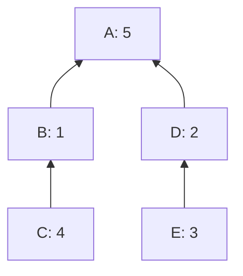
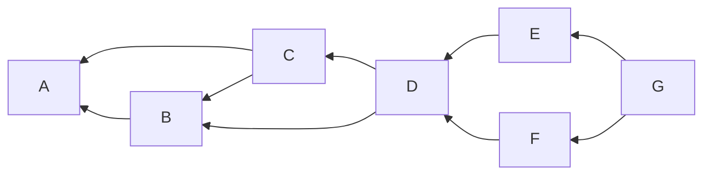

# How to linearize your cluster

sipa | 2023-12-18 20:55:14 UTC | #1

# How to linearize your cluster

Most transaction clusters are small. At least today, the majority are just a single transaction, and those which aren't usually are just a few transactions.  We plan to set the cluster size limit so that even at the limit, the ancestor-set based linearization algorithm completes in a reasonable time. Yet, most clusters will be smaller, and better algorithms can be used.

Here I build up an incremental algorithm that eventually finds the optimal linearization. It can be run with a computation limit, in which case it'll find something at least as good as ancestor-set based.

 

## 1. Linearization overall

The most high-level description for pretty much any linearization cluster algorithm is:
* While there are unincluded transactions:
  * Find the highest-feerate subset of the remaining transactions in the cluster (or an approximation thereof)
  * Sort that subset according to some topologically valid order (doesn't matter which one, so e.g. sorting by number of unconfirmed ancestors suffices), output it, and mark the transactions as included.
  * Continue with the remainder of the cluster.
* Optionally run a post-processing algorithm on the output, like [this one](https://delvingbitcoin.org/t/linearization-post-processing-o-n-2-fancy-chunking/201/8).

Almost all the complexity (both in the computation sense and the implementation work sense) is in the "find high-feerate subset" algorithm. If we instantiate that with "pick highest-feerate ancestor set", we get ancestor-set based linearization. The next section will go into finding better subsets, but first there are a few high-level improvements possible to the overall algorithm.

### 1.1 Splitting in connected components

A cluster is (by definition) always connected, but it need not remain connected once some subset of transactions have been included. For example:

The highest-feerate subset is [A], but once that's included the cluster breaks apart into two components.

Whenever the remainder of the cluster consists of multiple components, it is possible to run the linearization algorithm recursively on those components, and then merging them (by chunking them, and the merge-sorting the chunks).

### 1.2 Bottleneck splitting

Given a subset of transactions $S$ in a graph $G$, define the set of bottlenecks as

$$
B = S \cap \bigcap_{x \in S} \left(\operatorname{anc}_G(x) \cup \operatorname{desc}_G(x) \right)
$$

These are the transactions in $S$ that are either a descendant or an ancestor of every other transaction in the set. These transactions must be included in a fixed order, and by doing so, split the set up into separate groups that can be linearized separately. For example

In this example, A, D, and G are bottleneck transactions. If there is a single root which everything descends from, or a single leaf that descends from everything, these will necessarily be bottlenecks, but the concept is more general and can include inner transactions too, like D above.

Bottleneck splitting is detecting bottlenecks, and then linearizing the parts between them separately, and then combining them by concatenation. In a way, bottleneck splitting is the serial analogue of the parallel connected-component splitting. Here it would amount to recursively invoking linearization for BC and EF, and then outputting A + lin(BC) + D + lin(EF) + G.

I'm not convinced bottleneck splitting is worth it as an optimization, as it only seems to help with clusters that are already relatively easy to linearize by what follows.

## 2. Finding high-feerate subsets

The bulk of the work is in the internal algorithm to find high-feerate subsets (or ideally, the highest-feerate subset). I conjecture that finding the highest-feerate subset is an NP-hard problem, so we're very likely limited to small (remainders of) clusters, or approximations.

### 2.1 Searching

Overall, the search for high-feerate subsets of a given (remainder of a) cluster $G$ follows an approach where a set of work items in maintained, each of corresponds to some definitely-included transactions, some definitely-excluded transactions, and some undecided transactions. Then a processing loop follows which "splits" a work item in two, by taking some transaction and making it included once, and making it excluded once.

* Let $W = \{(\emptyset,\emptyset)\}$, the set of work items, initialized with a single element $(\emptyset,\emptyset)$.
  * Each work item $(inc,exc)$ consists of two non-overlapping sets; $inc$ represents transactions that have to be included, and $exc$ represents transactions that cannot be included. Transactions that are not in either are undecided. $inc$ always includes its own ancestors ($\operatorname{anc}(inc)=inc$), while $exc$ always includes its own descendants ($\operatorname{desc}(exc)=exc$).
  * The single initial item $(\emptyset,\emptyset)$ represents "everything undecided".
* Set $best = \emptyset$, the best subset seen so far.
* While $W$ is non-empty (and computation limit is not reached):
  * Take some element $(inc, exc)$ out of $W$.
  * Find a transaction $t$ not in $inc$ and not in $exc$ (an undecided one).
  * Let $inc_{add} = inc \cup \operatorname{anc}(t)$.
  * Let $exc_{del} = exc \cup \operatorname{desc}(t)$.
  * If $\operatorname{feerate}(inc_{add}) > \operatorname{feerate}(best)$ (or $best = \emptyset$):
    * Set $best = inc_{add}$.
  * For each $(inc_{new}, exc_{new}) \in \{(inc_{add}, exc), (inc, exc_{del})\}$:
    * If there are undecided transactions left corresponding to $(inc_{new}, exc_{new})$:
      * Add $(inc_{new}, exc_{new})$ to $W$.
* Return $best$

Regardless of the choice of element to take out of $W$, or the choice of undecided transaction within it, this will iterate all valid topological subsets of $G$, and thus put in $best$ the actual best subset.

It would be possible to restrict the choice of undecided transaction to only consider ones that share ancestry with $inc$ (if non-empty). Doing so will make the algorithm only consider *connected* subsets, and we know at least one connected highest-feerate subset always exists. This would result in a moderate speedup as it reduces the search space, but interferes with a much more important improvement later.

### 2.2 Bounding through potential sets

To avoid iterating literally every topological subset, we can compute a conservative upper bound on how good each work item can get. If that is not better than $best$, the item can be discarded.

This conservative upper bound is the *potential set* $pot$, which we will compute for every work item. For a given work item $(inc, exc)$, $pot$ is the highest-feerate set among *all* sets (not just topologically valid ones) for which $inc \subset pot$ and $exc \cap pot = \emptyset$. This is easy to compute:
* Initialize $pot = inc$.
* For each $u$ not in $pot$ or $exc$, in decreasing individual feerate order:
  * If $\operatorname{feerate}(u) > \operatorname{feerate}(pot)$: set $pot = pot \cup \{u\}$.
  * Otherwise, stop iterating.

Observe that all elements of $(pot \setminus inc)$ have a strictly higher feerate than $pot$ (it's true for the last one added, and all previously-added ones have an even higher feerate), and all undecided elements not in $pot$ have a feerate not exceeding $pot$ (if they did, they'd have been included). Thus, adding any other undecided transactions to pot, or removing any non-$inc$ transactions from it, or any combination thereof, decreases its feerate. Therefore, it must be a maximum.

Thus the algorithm becomes:

* Let $W = \{(\emptyset,\emptyset)\}$.
* Set $best = \emptyset$.
* While $W$ is non-empty (and computation limit is not reached):
  * Take some element $(inc, exc)$ out of $W$.
  * Set $pot = inc$.
  * For each $u$ not in $pot$ or $exc$, in decreasing individual feerate order:
    * If $\operatorname{feerate}(u) > \operatorname{feerate}(pot)$: set $pot = pot \cup \{u\}$.
    * Otherwise, stop iterating.
  * If $\operatorname{feerate}(pot) > \operatorname{feerate}(best)$:
    * Find a transaction $t$ not in $inc$ and not in $exc$ (an undecided one).
    * Let $inc_{add} = inc \cup \operatorname{anc}(t)$.
    * Let $exc_{del} = exc \cup \operatorname{desc}(t)$.
    * If $\operatorname{feerate}(inc_{add}) > \operatorname{feerate}(best)$ (or $best = \emptyset$):
      * Set $best = inc_{add}$.
  * For each $(inc_{new}, exc_{new}) \in \{(inc_{add}, exc), (inc, exc_{del})\}$:
    * If there are undecided transactions left corresponding to $(inc_{new}, exc_{new})$:
      * Add $(inc_{new}, exc_{new})$ to $W$.
* Return $best$

This change helps the average case, but not the worst case, as it's always possible that the optimal subset is only found in the last iteration. However, it's a necessary preparation for the next improvement.

### 2.3 Jumping ahead

The potential set, as introduced in the previous section, has an important property: its non-$inc$ transactions each have a higher feerate than the highest-feerate set possible (compatible with the work item's $inc$ and $exc$), even when ignoring topology. Thus, if one is given a compatible set which lacks one or more transactions in $(pot \setminus inc)$, then adding those transactions will *always* be an improvement to the feerate.

This implies that if $pot$ contains any topologically-valid subset, that entire subset can be added to $inc$ as well. This works because regardless of what this work item evolves into (by including or excluding elements in its undecided set), adding a subset of $pot$ will always be an improvement. This effectively lets us jump ahead, by (possibly) including multiple transactions automatically without needing to split on each individually.

We also move the computation of $pot$ and updating of $best$ inside the addition loop, as we want to perform the jumping as soon as possible and update $best$ accordingly. This can replace the "if there are undecided transactions left" test, as a lack of undecided transactions implies $pot = inc$:

* Let $W = \{(\emptyset,\emptyset)\}$.
* Set $best = \emptyset$.
* While $W$ is non-empty (and computation limit is not reached):
  * Take some element $(inc, exc)$ out of $W$.
  * Find a transaction $t$ not in $inc$ or $exc$ (an undecided one); this must exist.
  * Let $inc_{add} = inc \cup \operatorname{anc}(t)$.
  * Let $exc_{del} = exc \cup \operatorname{desc}(t)$.
  * For each $(inc_{new}, exc_{new}) \in \{(inc_{add}, exc), (inc, exc_{del})\}$:
    * Set $pot_{new} = inc_{new}$.
    * For each $u$ not in $pot_{new}$ or $exc_{new}$, in decreasing individual feerate order:
      * If $\operatorname{feerate}(u) > \operatorname{feerate}(pot_{new})$: set $pot_{new} = pot_{new} \cup \{u\}$.
      * Otherwise, stop iterating.
    * For every transaction $p \in (pot_{new} \setminus inc_{new})$:
      * If $\operatorname{anc}(p) \subset pot_{new}$:
        * Set $inc_{new} = inc_{new} \cup \operatorname{anc}(p)$.
    * If $\operatorname{feerate}(inc_{new}) > \operatorname{feerate}(best)$ (or $best = \emptyset$):
      * Set $best = inc_{new}$.
    * If $\operatorname{feerate}(pot_{new}) > \operatorname{feerate}(best)$:
      * Add $(inc_{new}, exc_{new})$ to $W$.
* Return $best$

### 2.4 Choosing the transaction to split on

One thing that is unspecified so far is how to pick $t$, the transaction being added to $inc$ or $exc$ in every iteration.

The choice matters; there appear to be a number of "good" choices which combined with the jump ahead optimization above result in an ~$\mathcal{O}(1.6^n)$ algorithm (purely empirical number, no proof), while others yield $\mathcal{O}(2^n)$.

These all appear to be good choices, with only constant-factor differences in the worst case between them:
* Use as $t$ the highest-individual-feerate undecided transaction.
* Use as $t$ the transaction which maximizes $\operatorname{min}(|exc|+|inc \cup \operatorname{anc}(t)|,|exc \cup \operatorname{desc}(t)|+|inc|)$ (i.e., reduces the search space the most) among:
  * All undecided transactions.
  * All (undecided) transactions in $pot \setminus inc$.
  * All undecided transactions that are ancestors or descendants of the highest-individual-feerate undecided transaction.

In particular the last two options appear to be good choices, with no clear winner among them. Specific clusters exist for which either of the algorithms performs very significantly better than the other, but this works both ways.

### 2.5 Choosing which work item to process

Lots of heuristics for the choice of $(inc,exc) \in W$ are possible which can great affect the runtime in specific cases, but the worst case is effectively unaffected by this choice.

A very simple choice is treating $W$ like a (LIFO) stack which new work items get appended tot, and popped from. This effectively results in a depth first traversal of the search tree, with a stack size that cannot exceed the total number of transactions in the cluster. This is probably the best choice from a memory usage (and locality) perspective.

If introducing randomness is desired (which may be the case if the algorithm is given a bounded runtime), it's possible to instead treat $W$ like an small fixed-size array of $k$ (say, 4) LIFO stacks, and picking from $W$ and/or additions to it are appending to/popping from a random one. This retains DFS-ish behavior with (in almost all cases) only a small constant factor larger memory usage.

### 2.6 Caching feerates and the potential set

To avoid recomputing the feerates of the involved sets ($inc$, $pot$, and $best$, specifically), the fees and sizes can be precomputed and passed along wherever the sets themselves are passed (including inside the work items). When sets are updated, e.g. in $inc = inc \cup \operatorname{anc}(t)$, only the fees and sizes of $(\operatorname{anc}(t) \setminus inc)$ need to be looked up and added to the cached value.

By extending our definition of work item to $(inc, exc, pot)$, carrying the potential set $pot$ along between its computation and the item it is for, more duplicate work can be avoided. The new variables $pot_{add}$ and $pot_{del}$ are underestimates for the eventual $pot_{new}$, in the inclusion resp. exclusion case.

* Let $W = \{(\emptyset,\emptyset, \emptyset)\}$.
* Set $best = \emptyset$.
* While $W$ is non-empty (and computation limit is not reached):
  * Take some element $(inc, exc, pot)$ out of $W$.
  * Find a transaction $t$ not in $inc$ or $exc$ (an undecided one); this must exist.
  * Let $inc_{add} = inc \cup \operatorname{anc}(t)$.
  * Let $pot_{add} = pot \cup \operatorname{anc}(t)$.
  * Let $exc_{del} = exc \cup \operatorname{desc}(t)$.
  * Let $pot_{del} = pot \setminus \operatorname{desc}(t)$.
  * For each $(inc_{new}, exc_{new}, pot_{new}) \in \{(inc_{add}, exc, pot_{add}), (inc, exc_{del}, pot_{del})\}$:
    * For eack $u$ not in $pot_{new}$ or $exc_{new}$, in decreasing individual feerate order:
      * If $\operatorname{feerate}(u) > \operatorname{feerate}(pot_{new})$: set $pot_{new} = pot_{new} \cup \{u\}$.
      * Otherwise, stop iterating.
    * For every transaction $p \in (pot_{new} \setminus inc_{new})$:
      * If $\operatorname{anc}(p) \subset pot_{new}$:
        * Set $inc_{new} = inc_{new} \cup \operatorname{anc}(p)$.
    * If $\operatorname{feerate}(inc_{new}) > \operatorname{feerate}(best)$ (or $best = \emptyset$):
      * Set $best = inc_{new}$.
    * If $\operatorname{feerate}(pot_{new}) > \operatorname{feerate}(best)$:
      * Add $(inc_{new}, exc_{new}, pot_{new})$ to $W$.
* Return $best$

### 2.7 Seeding with best ancestor sets

Under no circumstances do we want to end up with a $best$ whose feerate is worse than the highest-feerate ancestor set, as that'd mean we're worse off than just ancestor set based linearization. It is possible to run ancestor set based linearization and a bounded version of the search algorithm developed so far and then [merge](https://delvingbitcoin.org/t/merging-incomparable-linearizations/209) them, but it is less work to instead pre-seed the search algorithm with the best ancestor set.

All we need to do is pre-split the initial $W$ item:
* Find $a$, the transaction whose ancestor set feerate is highest.
* Let $W = \{(\operatorname{anc}(a), \emptyset, \operatorname{anc}(a)), (\emptyset, \operatorname{desc}(a), \emptyset)\}$.
* Let $best = \operatorname{anc}(a)$.
* While $W$ is non-empty ...

-------------------------

