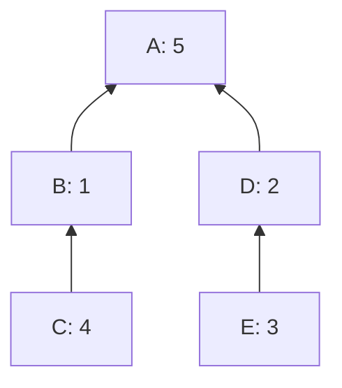
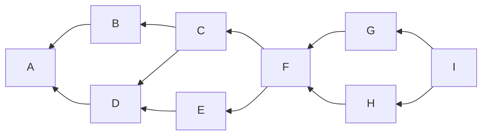

# How to linearize your cluster

sipa | 2024-04-25 20:27:06 UTC | #1

# How to linearize your cluster

Most transaction clusters are small. At least today, the majority consist of just a single transaction, and those which aren't usually have no more than a few transactions.  We plan to set the cluster size limit so that even at the limit, the ancestor-set based linearization algorithm completes in a reasonable time. Yet, most clusters will be smaller, and better algorithms can be used.

Here I build up an algorithm that eventually finds the optimal linearization. It can be run with a computation limit, in which case it'll find something at least as good as ancestor-set based linearization.

 

## 1. Linearization overall

The most high-level description for pretty much any cluster linearization algorithm is:
* While there are remaining transactions:
  * Find a high-feerate subset of the remaining transactions in the cluster (or ideally, the highest-feerate)
  * Sort that subset according to some topologically valid order (doesn't matter which one, so e.g. sorting by number of unconfirmed ancestors suffices), append those transactions to the output, and remove them from the cluster.
  * Continue with the remainder of the cluster.
* Optionally run a post-processing algorithm on the output, like [this one](https://delvingbitcoin.org/t/linearization-post-processing-o-n-2-fancy-chunking/201/8).

Almost all the complexity (both in the computational sense and the implementation complexity sense) is in the "find high-feerate subset" algorithm. If we instantiate that with "pick highest-feerate ancestor set", we get ancestor-set based linearization. The next section will go into finding better subsets, but first there are a few high-level improvements possible to the overall algorithm.

In practice, transactions aren't actually removed from the cluster data structure, but instead a set of remaining transactions is kept, and all operations (connectivity checks, ancestor sets, descendant sets, ...) only care about the part of the cluster that remains. For readability we drop the $_G$ index to $\operatorname{anc}()$ and $\operatorname{desc}()$; it is always implicitly the part of the cluster that remains.

### 1.1 Splitting in connected components

A cluster is (by definition) always connected, but it need not remain connected once some subset of transactions have been included. For example:

The highest-feerate subset is [A], but once that is included the cluster breaks apart into two components.

Whenever the remainder of the cluster consists of multiple components, it is possible to run the linearization algorithm recursively on those components separately, and then merge them (by chunking  and merge-sorting the chunks).

### 1.2 Bottleneck splitting

Define the set of bottleneck transactions for a cluster $G$ as:

$$
B = \bigcap_{x \in G} \operatorname{anc}(x) \cup \operatorname{desc}(x) 
$$

These are the transactions that are either a descendant or an ancestor of every other transaction in the cluster. These transactions must be included in a fixed order, and by doing so, they partition the set into separate groups that can be linearized separately. For example

In this example, A, F, and I are bottleneck transactions. If there is a single root which everything descends from, or a single leaf that descends from everything, these will necessarily be bottlenecks, but the concept is more general and can include inner transactions too, like F above.

Bottleneck splitting consists of computing bottlenecks, and then linearizing the parts between them separately, and then combining them by concatenation. In a way, bottleneck splitting is the serial analogue of the parallel connected-component splitting. Here it would amount to invoking linearization recursively for BCDE and GH, and then outputting [A] + lin(BCDE) + [F] + lin(GH) + [I].

I'm not convinced bottleneck splitting is worth it as an optimization, as it only seems to help with clusters that are already relatively easy to linearize by what follows.

## 2. Finding high-feerate subsets

The bulk of the work is in the internal algorithm to find high-feerate subsets (or ideally, *the* highest-feerate subset). I conjecture that finding the highest-feerate subset is an NP-hard problem, so we're very likely limited to small (remainders of) clusters, or approximations.

### 2.1 Searching

Overall, the search for high-feerate subsets of a given (remainder of a) cluster $G$ follows an approach where a set of work items is maintained, each of which corresponds to some definitely-included transactions, some definitely-excluded transactions, and some undecided transactions. Then a processing loop follows which in every iteration "splits" one work item in two: one where the transaction becomes included (called the addition branch), and one where the transaction becomes excluded (called the deletion branch).

* Set $W = \{(\varnothing,\varnothing)\}$, the set of work items, initialized with a single element $(\varnothing,\varnothing)$.
  * Each work item $(inc,exc)$ consists of two non-overlapping sets; $inc$ represents transactions that have to be included, and $exc$ represents transactions that cannot be included. Transactions that are not in either are undecided. $inc$ always includes its own ancestors $(\operatorname{anc}(inc)=inc)$, while $exc$ always includes its own descendants $(\operatorname{desc}(exc)=exc).$
  * The initial item $(\varnothing,\varnothing)$ represents "everything undecided".
* Set $best = \varnothing$, the best subset seen so far.
* While $W$ is non-empty and computation limit is not reached:
  * Take some work item $(inc, exc)$ out of $W$.
  * Find a transaction $t$ not in $inc$ and not in $exc$ (an undecided one).
  * Set $work_{add} = (inc \cup \operatorname{anc}(t), exc)$; work item for the addition branch.
  * Set $work_{del} = (inc, exc \cup \operatorname{desc}(t))$; work item for the deletion branch.
  * For each $(inc_{new}, exc_{new}) \in \{work_{add}, work_{del}\}$:
    * If $inc_{new} \neq \varnothing$ and ($best = \varnothing$ or $\operatorname{feerate}(inc_{new}) > \operatorname{feerate}(best)$):
      * Set $best = inc_{new}$.
    * If there are undecided transactions left corresponding to $(inc_{new}, exc_{new})$:
      * Add $(inc_{new}, exc_{new})$ to $W$.
* Return $best$

Regardless of the choice of element to take out of $W$, or the choice of undecided transaction $t$ within it, this will iterate over all valid topological subsets of $G$, and thus put in $best$ the actual best subset.

It would be possible to restrict the choice of undecided transactions to only consider ones that share ancestry with $inc$ (if non-empty). Doing so will make the algorithm only consider *connected* subsets, which is sufficient as we know at least one connected highest-feerate subset always exists. This would result in a moderate speedup as it reduces the search space, but interferes with a much more important improvement later.

### 2.2 Potential-set bounding

To avoid iterating over literally every topological subset of the cluster (there may be up to $2^{n-2}$), we can compute a conservative upper bound on how good (the evolution of) each work item can get. If that is not better than $best$, the item can be discarded.

This conservative upper bound is the *potential set* $pot$, which we will compute for every work item. For a given work item $(inc, exc)$, $pot$ is the highest-feerate set among *all* sets (not just topologically valid ones) that include $inc$ and exclude $exc$: $inc \subset pot$ and $exc \cap pot = \varnothing$. This is easy to compute:
* Initialize $pot = inc$.
* For each $u$ not in $pot$ or $exc$, in decreasing individual feerate order:
  * If $pot = \varnothing$ or $\operatorname{feerate}(u) > \operatorname{feerate}(pot)$:
    * Set $pot = pot \cup \{u\}$.
  * Otherwise, stop iterating.

Observe that all elements of $(pot \setminus inc)$ have a feerate at least as high as $pot$ itself (this is clearly true for the last one added, and the transactions before that one cannot have lower feerate), and all undecided elements not in $pot$ have a feerate not exceeding $pot$'s (if they did, they would have been included). Thus, adding any other undecided transactions to $pot$, or removing any non-$inc$ transactions from it, or any combination thereof, cannot increase its feerate. Therefore, it must be a maximum.

Incorporating this into the search algorithm we get:

* Set $W = \{(\varnothing,\varnothing)\}$.
* Set $best = \varnothing$.
* While $W$ is non-empty and computation limit is not reached:
  * Take some work item $(inc, exc)$ out of $W$.
  * Set $pot = inc$.
  * For each $u$ not in $pot$ or $exc$, in decreasing individual feerate order:
    * If $pot = \varnothing$ or $\operatorname{feerate}(u) > \operatorname{feerate}(pot)$:
      * Set $pot = pot \cup \{u\}$.
    * Otherwise, stop iterating.
  * If $best = \varnothing$ or $\operatorname{feerate}(pot) > \operatorname{feerate}(best)$:
    * Find a transaction $t$ not in $inc$ and not in $exc$ to split on.
    * Set $work_{add} = (inc \cup \operatorname{anc}(t), exc)$.
    * Set $work_{del} = (inc, exc \cup \operatorname{desc}(t))$.
    * For each $(inc_{new}, exc_{new}) \in \{work_{add}, work_{del}\}$:
      * If $inc_{new} \neq \varnothing$ and ($best = \varnothing$ or $\operatorname{feerate}(inc_{new}) > \operatorname{feerate}(best)$):
        * Set $best = inc_{new}$.
      * If there are undecided transactions left (not in $inc_{new}$ or $exc_{new}$):
        * Add $(inc_{new}, exc_{new})$ to $W$.
* Return $best$

This change helps the average case, but not the worst case, as it's always possible that the optimal subset is only found in the last iteration. However, it's a necessary preparation for the Jumping Ahead optimization, which very much does improve the worst case.

### 2.3 Best-bounding of potentials

A small optimization is possible to the above description, which seems to result in a ~25% reduction in feerate comparisons in the worst case.

The goal of the $pot$ set is to ultimately decide if a work item is worth working on, namely when $\operatorname{feerate}(pot) > \operatorname{feerate}(best)$. Additions to $pot$ which themselves have a feerate below that of $best$ cannot contribute to that. Therefore, we can break out of the addition loop early whenever the next transaction being added no longer meets the $\operatorname{feerate}(u) > \operatorname{feerate}(best)$ condition.

In fact, this can be precomputed any time $best$ changes. We introduce an $imp$ (improvements) set, which starts off being equal to the cluster, but when $best$ is updated, we remove from $imp$ transactions which have a feerate lower than $best$.

* Set $W = \{(\varnothing,\varnothing)\}$.
* Set $best = \varnothing$.
* Set $imp = G$.
* While $W$ is non-empty and computation limit is not reached:
  * Take some work item $(inc, exc)$ out of $W$.
  * Set $pot = inc$.
  * For each $u \in imp \setminus (pot \cup exc)$, in decreasing individual feerate order:
    * If $pot = \varnothing$ or $\operatorname{feerate}(u) > \operatorname{feerate}(pot)$:
      * Set $pot = pot \cup \{u\}$.
    * Otherwise, stop iterating.
  * If $best = \varnothing$ or $\operatorname{feerate}(pot) > \operatorname{feerate}(best)$:
    * Find a transaction $t$ not in $inc$ and not in $exc$ to split on.
    * Set $work_{add} = (inc \cup \operatorname{anc}(t), exc)$.
    * Set $work_{del} = (inc, exc \cup \operatorname{desc}(t))$.
    * For each $(inc_{new}, exc_{new}) \in \{work_{add}, work_{del}\}$:
      * If $inc_{new} \neq \varnothing$ and ($best = \varnothing$ or $\operatorname{feerate}(inc_{new}) > \operatorname{feerate}(best)$):
        * Set $best = inc_{new}$.
        * Set $imp = \{x \in imp : \operatorname{feerate}(x) > \operatorname{feerate}(best)\}$.
      * If there are undecided transactions left (not in $inc_{new}$ or $exc_{new}$):
        * Add $(inc_{new}, exc_{new})$ to $W$.
* Return $best$

### 2.4 Jumping ahead

The potential set, as introduced in the previous section, has an important property: the transactions in $pot$ that do not belong to $inc$ must have a feerate at least as high as can be achieved by *any* set that includes $inc$ and excludes $exc$ (even ones that are not topologically valid). In fact, this relation is strict except for the case where $inc = \varnothing$ and $pot$ only contains a single transaction.
Thus, if one is given such a set that is non-empty but which lacks one or more transactions in $pot$, then adding those transactions will *always* increase its feerate.

This implies that every highest-feerate topologically-valid set among those that include $inc$ and exclude $exc$ *must* contain every topologically valid subset of $pot$. If not, then a topologically valid highest-feerate set $best$ that includes $inc$ and excludes $exc$ must exist, with a topologically-valid subset $subpot \subset pot$ such that $subpot \not\subset best$. In this case, $best \cup subpot$ will also be topologically valid, include $inc$, exclude $exc$, and have higher feerate than $best$ (because adding $pot$ transactions always improves feerate) which was assumed to be the highest-feerate such subset - a contradiction.

Because of the above, we can safely add topologically valid subsets of $pot$ to $inc$. This effectively lets us jump ahead, by (possibly) including multiple transactions automatically without needing to split on each individually. We do this by iterating over all transactions in $pot_{new} \setminus inc_{new}$, and whenever one is found whose ancestry is contained entirely within $pot_{new}$, we add that ancestry to $inc_{new}$.

Note that this change makes the $work_{add}$ and $work_{del}$ variables only contain a *preliminary* $inc$, not the one that may eventually be added to $W$, as the jump ahead step is still applied to it.

We also move the computation of $pot$ and updating of $best$ inside the addition loop, as we want to perform the jumping as soon as possible and update $best$ accordingly. This can replace the "if there are undecided transactions left" test, as a lack of undecided transactions implies $pot = inc$:

* Set $W = \{(\varnothing,\varnothing)\}$.
* Set $best = \varnothing$.
* Set $imp = G$.
* While $W$ is non-empty and computation limit is not reached:
  * Take some work item $(inc, exc)$ out of $W$.
  * Find a transaction $t$ not in $inc$ or $exc$ to split on; this must exist.
  * Set $work_{add} = (inc \cup \operatorname{anc}(t), exc)$.
  * Set $work_{del} = (inc, exc \cup \operatorname{desc}(t))$.
  * For each $(inc_{new}, exc_{new}) \in \{work_{add}, work_{del}\}$:
    * Set $pot_{new} = inc_{new}$.
    * For each $u \in imp \setminus (pot_{new} \cup exc_{new})$, in decreasing individual feerate order:
      * If $pot_{new} = \varnothing$ or $\operatorname{feerate}(u) > \operatorname{feerate}(pot_{new})$: 
        * Set $pot_{new} = pot_{new} \cup \{u\}$.
      * Otherwise, stop iterating.
    * For every transaction $p \in (pot_{new} \setminus inc_{new})$:
      * If $\operatorname{anc}(p) \subset pot_{new}$:
        * Set $inc_{new} = inc_{new} \cup \operatorname{anc}(p)$.
    * If $inc_{new} \neq \varnothing$ and ($best = \varnothing$ or $\operatorname{feerate}(inc_{new}) > \operatorname{feerate}(best)$):
      * Set $best = inc_{new}$.
      * Set $imp = \{x \in imp : \operatorname{feerate}(x) > \operatorname{feerate}(best)\}$.
    * If $\operatorname{feerate}(pot_{new}) > \operatorname{feerate}(best)$:
      * Add $(inc_{new}, exc_{new})$ to $W$.
* Return $best$

### 2.5 Choosing transactions

One thing that is unspecified so far is how to pick $t$, the transaction being added to $inc$ or $exc$ in every iteration.

The choice matters; there appear to be a number of "good" choices which combined with the jump ahead optimization above result in an ~$\mathcal{O}(1.6^n)$ algorithm (purely empirical number, no proof), while others yield $\mathcal{O}(2^n)$.

These all appear to be good choices, with no meaningful differences for the worst case between them:
1. Use as $t$ the highest-individual-feerate undecided transaction.
2. Use as $t$ the transaction for which splitting on it minimizes the search space the most, among:
    1. All undecided transactions.
    2. All undecided transactions in $pot$.
    3. All undecided transactions that are ancestors of the highest-individual-feerate undecided transaction.

We measure the size of the search space simply as $2^{|undecided|}$, which is proportional to $2^{-|inc|-|exc|}$. The search space after a split on transaction $t$ therefore has a size proportional to $2^{-|inc\,\cup\,\operatorname{anc}(t)|-|exc|}+2^{-|inc|-|exc\,\cup\,\operatorname{desc}(t)|}$.

It turns out that we do not need to compute the exponentiation here, and can compare the (maximum and minimum of) exponents instead, because

$$
(2^{a_1} + 2^{b_1} \geq 2^{a_2} + 2^{b_2}) \iff (\operatorname{max}(a_1, b_1), \operatorname{min}(a_1, b_1)) \geq (\operatorname{max}(a_2, b_2), \operatorname{min}(a_2, b_2))
$$

Thus, to find the $t$ that results in the smallest search space, we maximize the minimum:

$$
\operatorname{min}(|inc\,\cup\,\operatorname{anc}(t)|+|exc|, |inc|+|exc\,\cup\,\operatorname{desc}(t)|)
$$

and as a tie-breaker maximize the maximum of those same arguments.

In particular option 2.3 above appears to be a good choice, though the numbers do not differ much.

### 2.6 Choosing work items

Lots of heuristics for the choice of $(inc,exc) \in W$ are possible which can greatly affect the runtime in specific cases, but the worst case is unaffected by this choice.

Thus it's reasonable to stick to a simple choice: treating $W$ like a (LIFO) stack which work items get appended to, and popped from. This effectively results in a depth first traversal of the search tree, with a stack size that cannot exceed the total number of transactions in the cluster. This is probably the best choice from a memory usage (and locality) perspective.

If introducing randomness is desired (which may be the case if the algorithm is only given a bounded runtime), it's possible to instead treat $W$ like a small (say, $k=4$) fixed-size array of $k$ LIFO stacks, and make picking from $W$ and/or adding apply to a random stack in it. This retains DFS-ish behavior with (in almost all cases) only a small constant factor larger memory usage.

### 2.7 Caching feerates and potential sets

To avoid recomputing the feerates of the involved sets ($inc$, $pot$, and $best$, specifically), the fees and sizes can be precomputed and stored alongside the sets themselves (including inside the work items). When sets are updated, e.g. in $inc = inc \cup \operatorname{anc}(t)$, only the fees and sizes of $(\operatorname{anc}(t) \setminus inc)$ need to be looked up and added to the cached value.

We can go further. By extending our definition of work item to $(inc, exc, pot)$, which stores the potential set $pot$ between its computation and the item being processed, more duplicate work can be avoided. A $pot_{new}$ entry is added to the $work_{add}$ and $work_{del}$ variables, containing a preliminary conservative subset for the actual potential set in these branches. Specifically:
* For the inclusion branch, the new potential set $\subset (pot \cup \operatorname{anc}(t))$. It must certainly contain $\operatorname{anc}(t)$ because that's part of the new $inc$, but it must also contain $pot$. This is because the newly added transactions fall into two categories:
  * Ones that were already part of $pot$; adding these to $inc$ doesn't affect the potential set.
  * Ones that were not part of $pot$, and thus had a feerate below any undecided $pot$ transactions. The algorithm for finding undecided potential transactions will consider the same transactions, but may at best continue for longer (as at every point its accumulated feerate is lower now) and at worst stop at the same point.
* For the exclusion branch, the new potential set $\subset (pot \setminus \operatorname{desc}(t))$. This is because the newly excluded transactions fall again into two categories:
  * Ones that were not part of $pot$; adding these to $exc$ doesn't affect the potential set.
  * Ones that were part of $pot$, and thus has a feerate above that of $pot$. Adding these to $exc$ means the algorithm for undecided potential transactions will consider the same transactions (except these removed ones), but otherwise at best again continue for longer, and at worst stop at the same point.

Finally, this change also lets us move the check that $pot$ has higher feerate than $best$ to the beginning of the processing loop, where it can catch cases where $best$ improved between adding a work item and it being processed. The check inside the addition loop can be weakened to $pot \neq inc$. This is sufficient to make sure undecided transactions remain, and is faster than a feerate comparison (assuming set operations are implemented using bitsets). If the check fails (so when $pot = inc$), then no improvement is possible, and adding a work item is useless. If it succeeds then it *is* possible that $\operatorname{feerate}(pot) \not> \operatorname{feerate}(best)$, but that will be detected once the item gets processed.

* Set $W = \{(\varnothing,\varnothing, \varnothing)\}$.
* Set $best = \varnothing$.
* Set $imp = G$.
* While $W$ is non-empty and computation limit is not reached:
  * Take some work item $(inc, exc, pot)$ out of $W$.
  * If $best = \varnothing$ or $\operatorname{feerate}(pot) > \operatorname{feerate}(best)$:
    * Find a transaction $t$ not in $inc$ or $exc$ to split on; this must exist.
    * Set $work_{add} = (inc \cup \operatorname{anc}(t), exc, pot \cup \operatorname{anc}(t))$.
    * Set $work_{del} = (inc, exc \cup \operatorname{desc}(t), pot \setminus \operatorname{desc}(t))$.
    * For each $(inc_{new}, exc_{new}, pot_{new}) \in \{work_{add}, work_{del}\}$:
      * For each $u \in imp \setminus (pot_{new} \cup exc_{new})$, in decreasing individual feerate order:
        * If $pot_{new} = \varnothing$ or $\operatorname{feerate}(u) > \operatorname{feerate}(pot_{new})$:
          * Set $pot_{new} = pot_{new} \cup \{u\}$.
        * Otherwise, stop iterating.
      * For every transaction $p \in (pot_{new} \setminus inc_{new})$:
        * If $\operatorname{anc}(p) \subset pot_{new}$:
          * Set $inc_{new} = inc_{new} \cup \operatorname{anc}(p)$.
      * If $inc_{new} \neq \varnothing$ and ($best = \varnothing$ or $\operatorname{feerate}(inc_{new}) > \operatorname{feerate}(best)$):
        * Set $best = inc_{new}$.
        * Set $imp = \{x \in imp : \operatorname{feerate}(x) > \operatorname{feerate}(best)\}$.
      * If $pot_{new} \neq inc_{new}$:
        * Add $(inc_{new}, exc_{new}, pot_{new})$ to $W$.
* Return $best$

### 2.8 Seeding with best ancestor sets

Under no circumstances do we want to end up with a $best$ whose feerate is worse than the highest-feerate ancestor set, as that would mean we are worse off than just ancestor set based linearization. If the algorithm runs to completion (until $W = \varnothing$), it will always find the optimal. But when running with a bound on computation, it is possible that the result is worse than ancestor-set based.

To prevent that, it is possible to run both ancestor set based linearization and a bounded version of the search algorithm developed so far, and then [merge](https://delvingbitcoin.org/t/merging-incomparable-linearizations/209) the two. It's better however to run the search algorithm, but pre-split the initial state on the transaction with the best ancestor set. This too guarantees that stopping at any point will result in a $best$ at least as good as the best ancestor set, but in addition also makes this information available for search.

To accomplish that, we abstract out the entire body of the "For each $(inc_{new}, exc_{new}, pot_{new})$" loop to a helper that potentially updates $best$ and potentially adds an element to $W$. This helper is then used in the normal processing loop, but also for the initialization of $W$.

Overall, this leaves us with:
* Set $W = \varnothing$.
* Set $best = \varnothing$.
* Set $imp = G$.
* Define helper operation $\operatorname{add}(inc_{new}, exc_{new}, pot_{new})$ as:
  * For each $u \in imp \setminus (pot_{new} \cup exc_{new})$, in decreasing individual feerate order:
    * If  $pot_{new} = \varnothing$ or $\operatorname{feerate}(u) > \operatorname{feerate}(pot_{new})$:
      * Set $pot_{new} = pot_{new} \cup \{u\}$.
    * Otherwise, stop iterating.
  * For every transaction $p \in (pot_{new} \setminus inc_{new})$:
    * If $\operatorname{anc}(p) \subset pot_{new}$:
      * Set $inc_{new} = inc_{new} \cup \operatorname{anc}(p)$.
  * If $inc_{new} \neq \varnothing$ and ($best = \varnothing$ or $\operatorname{feerate}(inc_{new}) > \operatorname{feerate}(best)$):
    * Set $best = inc_{new}$.
    * Set $imp = \{x \in imp : \operatorname{feerate}(x) > \operatorname{feerate}(best)\}$.
  * If $pot_{new} \neq inc_{new}$:
    * Add $(inc_{new}, exc_{new}, pot_{new})$ to $W$.
* Find $a$, the transaction whose ancestor set feerate is highest.
* Invoke $\operatorname{add}(\operatorname{anc}(a), \varnothing, \operatorname{anc}(a))$.
* Invoke $\operatorname{add}(\varnothing, \operatorname{desc}(a), \varnothing)$.
* While $W$ is non-empty and computation limit is not reached:
  * Take some work item $(inc, exc, pot)$ out of $W$.
  * If $\operatorname{feerate}(pot) > \operatorname{feerate}(best)$:
    * Find a transaction $t$ not in $inc$ or $exc$ to split on; this must exist.
    * Invoke $\operatorname{add}(inc \cup \operatorname{anc}(t), exc, pot \cup \operatorname{anc}(t))$.
    * Invoke $\operatorname{add}(inc, exc \cup \operatorname{desc}(t), pot \setminus \operatorname{desc}(t))$.
* Return $best$.

## 3. Current implementation

My current [implementation](https://github.com/sipa/bitcoin/blob/wip_memepool_fuzz/src/cluster_linearize.h) incorporates most of the ideas listed above, with a few deviations:
* The connected-component splitting isn't implemented for linearization in general, but done inside the find-high-feerate-subset algorithm. It's combined with the ancestor pre-seeding there ($W$ is initialized with 2 elements per connected component: each excludes every other component, but one includes the component's best ancestor set, and one excludes the best ancestor set's transaction's descendants). This is somewhat suboptimal, as the find-high-feerate-subset algorithm only finds one subset, so in case there are multiple components, work for the later ones is duplicated. However, it was a lot simpler to implement than having the linearize code perform merging of multiple sublinearizations, and still beneficial.
* Newly added work items are added to one of $k=4$ LIFO stacks, in a round-robin fashion. A uniformly random stack is chosen to pop work items to process from.
* The transaction to split on is, among the set of ancestors and descendants of the highest-individual-feerate undecided transaction, the one that minimizes the search space the most.

-------------------------

hebasto | 2024-02-22 10:22:58 UTC | #2

Given the complexity of the linearization algorithm, has an alternative approach ever been considered, such as transforming the transaction graph into a graph of valid chunks first?

-------------------------

sipa | 2024-02-22 10:29:02 UTC | #3

@hebasto The problem of finding the (optimal) chunks is reducible to the problem of finding the optimal linearization actually, and the other way around. So if you can do one, you can do the other. The meat of the algorithm described here is effectively iterating all topologically-valid subsets, and then moving the highest-feerate one to the front, where it becomes a chunk.

So either I'm misunderstanding your suggestion, or it's effectively what we're doing already. Happy to hear if you have more ideas to try, though. We don't have a proof that finding the optimal linearization (or finding the highest-feerate topologically-valid subset) is NP-hard, so it's possible a polynomial algorithm exist.

-------------------------

lorbax | 2025-01-06 17:30:02 UTC | #4

Hi!
First of all I give you my compliments for your work. It is very complete and comprehensive. I am struggling to understand the following statement:
[quote="sipa, post:1, topic:303"]
the transactions in $pot$ that do not belong to $inc$ must have a feerate at least as high as can be achieved by *any* set that includes $inc$ and excludes $exc$
[/quote]
I have the feeling that I am missing something. Consider this example: there are three transactions $a,b$ and $c$, with equal size and fees respectively $2, 1000$ and $1$. Suppose that $a$ has $b$ as only parent, and $b$ has $c$ as only parent, so in the graph  $a \to b \to c$. Suppose also that $inc = \{a\}$ and $pot = \{a,b,c\}$. Then adding $a$ to $\{b,c\}$ actually decrease feerate.

BTW the same example seems to go against the following Proposition with $best = \{b,c\}$ and $pot$ as a topologically valid subset of itself.

[quote="sipa, post:1, topic:303"]
every highest-feerate topologically-valid set among those that include $inc$ and exclude $exc$ *must* contain every topologically valid subset of $pot$
[/quote]

Can examples like the above appear?

Anyway, this is needed only for the jump ahead optimization, but seems that the heart of the algo is still pretty much effective!

-------------------------

sipa | 2025-01-06 17:37:34 UTC | #5

[quote="lorbax, post:4, topic:303"]
Suppose also that $inc = \{a\}$ and $pot = \{a,b,c\}$.
[/quote]

This is not possible. $pot$ is a pure function of $inc$ and $exc$: the set of undecided transactions, picked from high feerate to low feerate ignoring topology, until the feerate stops increasing.

Presumably in your case $inc=\{a\}$, $exc=\{\}$, so $und = \{b,c\}$. $pot$ is computed as follows:
* Start with $pot = inc = \{a\}$.
* See if adding $b$ (the highest feerate transaction in $und \setminus pot$) improves it. And indeed, $\{a,b\}$ is better than $\{a\}$, so $b \in pot$.
* See if adding $c$ improves it. It does not: $\{a,b,c\}$ is worse than $\{a,b\}$, so $c \not\in pot$.

Thus, $pot$ in this case is $\{a,b\}$.

-------------------------

lorbax | 2025-01-06 18:59:43 UTC | #6

Sorry, you are right.
Anyway, is the following trivial? Is there a proof for it?

>the transactions in $pot$ that do not belong to $inc$ must have a feerate at least as high as can be achieved by *any* set that includes $inc$ and excludes $exc$

-------------------------

sipa | 2025-01-06 20:12:46 UTC | #7

[quote="lorbax, post:6, topic:303"]
Sorry, you are right. Anyway, is the following trivial? Is there a proof for it?
[/quote]

Let $B$ be the highest-feerate subset including $inc$, and excluding $exc$, ignoring topology. We're trying to prove that $pot = B$.

$B$ must have the property that for any $t \in und$ it is the case that $t \in B$ if and only if $\operatorname{feerate}(t) > \operatorname{feerate}(B)$, for the simple reason that if it didn't, and there was a $t \not\in B$ with higher feerate than $B$, you could add it to $B$, and improve it further. Similarly, if there was a $t \in B$ with lower feerate than $B$, it could be removed from it to improve it.

Furthermore, this property defines $B$, in the sense that there is only one subset (including $inc$ and excluding $exc$) that satisfies that property. Imagine we had distinct $B_1$ and $B_2$ that both satisfy the property. Without loss of generality, assume that $B_2$ is the bigger one, so $B_1 \subset B_2$. The set of transactions $t \in B_2 \setminus B_1$ have $\operatorname{feerate}(t) \leq B_1$, otherwise they would be included in $B_1$. Thus, $\operatorname{feerate}(B_2) \leq \operatorname{feerate}(B_1)$, because $B_2$ does include these transactions. But these transactions also have a $\operatorname{feerate}(t) > \operatorname{feerate}(B_2)$ because of the property above, and thus also $\operatorname{feerate}(t) > \operatorname{feerate}(B_1)$, so they should have been included in $B_1$, a contradiction.

Thus, if we can show that $pot$ satisfies the property, it must be the case that $pot = B$.

We know that $B$ must consist of $inc$ plus some *prefix* of $und$ (when considered in decreasing-feerate order), which matches how $pot$ is constructed. And it must be the same, because if the last transaction had feerate $\leq$ than $pot$'s, it wouldn't have been included. If the next not included transaction had feerate $>$ than $pot$'s, it would have been included.

-------------------------

lorbax | 2025-01-07 12:37:16 UTC | #8

Thank you, now I understand.
All of this started in my head while trying to understand the proof of the following.

[quote="sipa, post:1, topic:303"]
every highest-feerate topologically-valid set among those that include $inc$ and exclude $exc$ *must* contain every topologically valid subset of $pot$
[/quote]

I tried to expand the proof of it, using the additional material you provided. From the comment above we can deduce the following

*Lemma.* 
1. $pot$ is *the* (i.e. unique) highest amongst all the sets including $inc$ and excluding $exc$.
2. $t\in pot$ if and only if $feerate(t)> feerate(pot)$.

*Proposition.* Let $B$ an element that maximize the feerate in the following collection.$\{U \text{ topological} \mid inc \subseteq U \subseteq exc^c \}$. If $C \subseteq pot$ is topological, then $C\subseteq B$.

*Proof.* By contraddiction, suppose that there is $B$ like in the hypothesis and $C$ topological, $C\subseteq pot$ and $C \not \subseteq B$. Since $C$ is topological, possibly replacing $t$ with some of its ancestors, it is no loss to assume $anc(t) \subseteq B$. Since $t\in pot$, by 2. of Lemma above, $feerate(t) > feerate(pot)$. By characterization of $pot$ in 1. of Lemma above, we have that $feerate(pot) \ge feerate(B)$. So, $feerate(t)> feerate(B)$. Consider $B' = \{t\} \cup B$. Clearly, $feerate(B')> feerate(B)$; moreover, since $anc(t) \subseteq (B)$, $B'$ is topological. This is against the definition of $B$.

Let me know what do you think.

-------------------------

stefanwouldgo | 2025-01-29 13:09:02 UTC | #9

Hi sipa, thanks for your great work on this. 

[quote="sipa, post:3, topic:303"]
We don’t have a proof that finding the optimal linearization (or finding the highest-feerate topologically-valid subset) is NP-hard, so it’s possible a polynomial algorithm exist.
[/quote]

I've been thinking about this problem for some months now, alternating between looking for an algorithm and a reduction from some NP hard problem. It really is not obvious. However, DeepSeek R1 finally helped me find the surprising answer: 

Finding a highest-feerate topologically-valid subset is possible in $O(nm \log (n^2/m))$ time, and this has been shown in 1989 by Gallo, Grigoriadis and Tarjan ("A FAST PARAMETRIC MAXIMUM FLOW ALGORITHM
AND APPLICATIONS", SIAM J. COMPUT.
Vol. 18, No. 1, pp. 30-55, February 1989, you can find it on sci-hub). Actually, there have been even earlier algorithms for this, quoted in this article, though they are a little slower. For your reference, the problem is called maximum-ratio closure problem (p. 48), the only difference being the direction of the arrows in the graph.

It requires a rather involved algorithm, where the graph is modified into a flow network whose capacities depend on a parameter $\lambda$ (standing for the target feerate) and a min-cut is calculated for several $\lambda$ until the optimum is found. Gallo, Grigoriadis and Tarjan solve this in the same asymptotic time that a single min-cut would take by modifying the Goldberg-Tarjan push-relabel algorithm to keep on working on the next $\lambda$ after finding the min-cut for the one before, and proving that under some conditions that hold here, there are only $O(n)$ breakpoints at which we need to calculate the min-cut. 

This seems great news to me. It should mean that we can accomodate much larger clusters. The question is, how do we implement this? I haven't found an open source implementation of exactly this algorithm, but the repo at [https://github.com/jonas-sauer/MonotoneParametricMinCut](https://github.com/jonas-sauer/MonotoneParametricMinCut) has several algorithms in C++ that solve very similar problems, are supposed to be even faster in practice, and might be modified for our purposes (MIT license). The alternative would be to write the push-relabel parameterized min-cut algorithm from scratch, but as I said, this is not trivial.

-------------------------

sipa | 2025-01-29 14:05:48 UTC | #10

Hi @stefanwouldgo, crazy! I see a vague relation with min-cut / max-flow problems, but would never had thought to look in this direction.

[quote="stefanwouldgo, post:9, topic:303"]
Finding a highest-feerate topologically-valid subset is possible in $O(nm \log (n^2/m))$ time
[/quote]

I haven't been able to find the publication yet, based on what I find for related algorithm, but I assume $n$ is the number of nodes (transactions), and $m$ is the number of arcs (dependencies)? If so, that sounds great if it is practical as well. Note that the number of dependencies itself may be up to quadratic in the number of transactions, so this is essentially cubic in $n$?

In the abstract of [this paper](https://pubsonline.informs.org/doi/10.1287/opre.37.5.748), an additional condition is present (emphasis mine):

> We present a simple sequential algorithm for the maximum flow problem on a network with $n$ nodes, $m$ arcs, and integer arc capacities bounded by $U$. Under the practical assumption that ***U* is polynomially bounded in *n***, our algorithm runs in time $O(nm + n^2 \log n)$.

It's not clear if that condition is also present in the algorithm you're citing, but if it is, that may be a problem.

[quote="stefanwouldgo, post:9, topic:303"]
the only difference being the direction of the arrows in the graph.
[/quote]

Difference between what?

> This seems great news to me. It should mean that we can accomodate much larger clusters.

Maybe. The cluster size bound is really informed by how big of a cluster we can linearize with "acceptable" quality (scare-quotes, because it isn't all that clear what acceptable should mean), not what we can linearize optimally, in an extremely small amount of time (we've imposed a 50 µs ourselves, because a single transaction may simultaneously affect many clusters, which would all require re-linearization).

So far, we've interpreted acceptable as "at least as good as what we had before" (through [LIMO](https://delvingbitcoin.org/t/limo-combining-the-best-parts-of-linearization-search-and-merging/825)), and "at least as good as ancestor sort" (the current CPFP-accomodating mining algorithm, which is inherently $O(n^2)$. But (so far) all the ideas in this thread are "extra", in the sense that they'd only be applied when we have time left, or in a background re-linearization process, that does not act until after transaction relay.

Now, it is quite possible that this algoritm is *so* fast that it can linearize larger clusters *optimally* in the time that ancestor sort + LIMO may need for smaller ones. That would obviously move the needle. Or if it's possible that a reasonable argument can be made that a time-bounded version of this algorithm (only performing a lower-than-optimal number of cuts, for example, and then stopping) results in something that is practically as good as ancestor-sort (e.g., sufficient to make CPFP in typical, but potentially adverserial, scenarios work).

[quote="stefanwouldgo, post:9, topic:303"]
The alternative would be to write the push-relabel parameterized min-cut algorithm from scratch, but as I said, this is not trivial.
[/quote]

That's a concern, because we don't just care about asymptotic complexity, but real performance for relatively small problems too. And complicated algorithms, with complicated data structures, tend to result in things with high start-up costs (to convert the problem into the right representation), or with high constant factors (e.g., for some small problems, (sorted) lists can be several times faster than hash maps).

---

This is probably the point where I should reveal that we've been working on a new cluster linearization algorithm too (which I will write a bigger post about in time). It's a result of a conversation we had at the Bitcoin Research Week, where Dongning Guo and Aviv Zohar pointed out that the "find highest-feerate topologically-valid subset" problem can be formulated as a Linear Programming problem, on which all LP solving methods are applicable. This implies two things:
* Through [Interior-Point Methods](https://en.wikipedia.org/wiki/Interior-point_method), the problem can be solved in $O((n+m)^{2.5} \log S)$ time, where $S$ is the sum of transaction sizes, or essentially $O(n^5)$ in just $n$.
* The simplex algorithm, while worst-case exponential in the general case but practically very fast, becomes applicable. And it is possible that for our specific problem, these exponential cases don't exist as well.

Inspired by this last point, by observing what the simplex algorithm "steps" translate to in our problem space, in terms of sets and fees and feerates rather than matrix row-operations, removing some apparently useless transitions, and observing that it effectively finds a full linearization rather than just a single topologically-valid highest-feerate subset, we obtain the following:

* Input: $n$ transactions with fees and sizes, and $m$ dependencies between them (as $(parent, child)$ pairs).
* Output: a list of sets (the chunks), forming a graph partition, with all the consecutive highest-feerate topologically-valid subsets of what remains after the previous ones.
* Algorithm:
  * For every dependency, have a boolean "active"; initially all dependencies are inactive.
    * These partition the graph into components (when two transactions are reachable from one another by travelling only over active dependencies, up or down, they are in the same component).
    * Thus, the initial state has every transaction in its own singleton component.
    * As an additional invariant, no (undirected) cycles of active dependencies are allowed, so the component's active dependencies form a spanning tree for that component. The entire state can thus be described as an (undirected) spanning forest, which is a subgraph of the problem graph.
  * Keep performing any of the following steps as long as any apply:
    * If a dependency is inactive, and is between two distinct components, and the "child" component has higher feerate than the "parent" component, make it active.
    * If a dependency is active, and making it inactive would split the component it is in in two components (due to no-cycles property, this is true for every active dependency), where the parent component has higher feerate than the child component, make it inactive.
  * Finally, output all the component in decreasing feerate order.

This appears to be very fast in practice, and easy to implement. Further, it can be proven that if it terminates, the result is indeed an optimal linearization. However, we don't have a proof it always terminates, and certainly no bound on its runtime. A lot seems to depend on the policy on *how* to pick which dependency to make active or inactive in every step, but this needs a lot more investigation.

-------------------------

stefanwouldgo | 2025-01-29 14:35:08 UTC | #11

[quote="sipa, post:10, topic:303"]
I haven’t been able to find the publication yet, based on what I find for related algorithm, but I assume nnn is the number of nodes (transactions), and mmm is the number of arcs (dependencies)? If so, that sounds great if it is practical as well. Note that the number of dependencies itself may be up to quadratic in the number of transactions, so this is essentially cubic in nnn?
[/quote]

The publication can be found at [https://www.wellesu.com/10.1137/0218003](https://www.wellesu.com/10.1137/0218003). Yes, n is the number of nodes and m the number of edges, so that is cubic in the worst case.

[quote="sipa, post:10, topic:303"]
In the abstract of [this paper](https://pubsonline.informs.org/doi/10.1287/opre.37.5.748), an additional condition is present (emphasis mine):

> We present a simple sequential algorithm for the maximum flow problem on a network with nnn nodes, mmm arcs, and integer arc capacities bounded by UUU. Under the practical assumption that ***U* is polynomially bounded in *n***, our algorithm runs in time O(nm + n^2 \log n)O(nm+n2logn)O(nm + n^2 \log n).
[/quote]

No, one of the contributions of the GGT paper linked above is that they show how to bound the runtime independently of U. 

[quote="sipa, post:10, topic:303"]
Difference between what?
[/quote]

The difference between what we call highest-feerate topologically-valid subset and they call maximum-ratio closure problem is that in their model, they want a closure regarding descendants, while we want a closure regarding ancestors, which can be achieved by simply turning every edge (u,v) into (v,u), i.e. changing the direction of the arrows.

-------------------------

