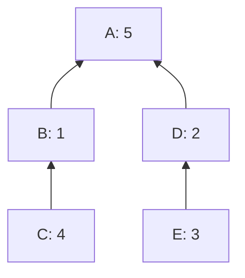
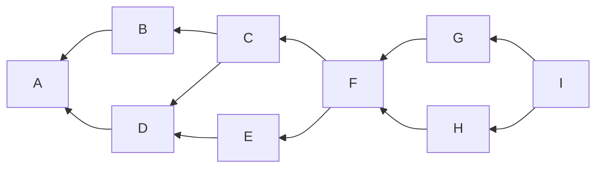

# How to linearize your cluster

sipa | 2024-04-25 20:27:06 UTC | #1

# How to linearize your cluster

Most transaction clusters are small. At least today, the majority consist of just a single transaction, and those which aren't usually have no more than a few transactions.  We plan to set the cluster size limit so that even at the limit, the ancestor-set based linearization algorithm completes in a reasonable time. Yet, most clusters will be smaller, and better algorithms can be used.

Here I build up an algorithm that eventually finds the optimal linearization. It can be run with a computation limit, in which case it'll find something at least as good as ancestor-set based linearization.

<div data-theme-toc="true"> </div>

## 1. Linearization overall

The most high-level description for pretty much any cluster linearization algorithm is:
* While there are remaining transactions:
  * Find a high-feerate subset of the remaining transactions in the cluster (or ideally, the highest-feerate)
  * Sort that subset according to some topologically valid order (doesn't matter which one, so e.g. sorting by number of unconfirmed ancestors suffices), append those transactions to the output, and remove them from the cluster.
  * Continue with the remainder of the cluster.
* Optionally run a post-processing algorithm on the output, like [this one](https://delvingbitcoin.org/t/linearization-post-processing-o-n-2-fancy-chunking/201/8).

Almost all the complexity (both in the computational sense and the implementation complexity sense) is in the "find high-feerate subset" algorithm. If we instantiate that with "pick highest-feerate ancestor set", we get ancestor-set based linearization. The next section will go into finding better subsets, but first there are a few high-level improvements possible to the overall algorithm.

In practice, transactions aren't actually removed from the cluster data structure, but instead a set of remaining transactions is kept, and all operations (connectivity checks, ancestor sets, descendant sets, ...) only care about the part of the cluster that remains. For readability we drop the $_G$ index to $\operatorname{anc}()$ and $\operatorname{desc}()$; it is always implicitly the part of the cluster that remains.

### 1.1 Splitting in connected components

A cluster is (by definition) always connected, but it need not remain connected once some subset of transactions have been included. For example:



The highest-feerate subset is [A], but once that is included the cluster breaks apart into two components.

Whenever the remainder of the cluster consists of multiple components, it is possible to run the linearization algorithm recursively on those components separately, and then merge them (by chunking  and merge-sorting the chunks).

### 1.2 Bottleneck splitting

Define the set of bottleneck transactions for a cluster $G$ as:

$$
B = \bigcap_{x \in G} \operatorname{anc}(x) \cup \operatorname{desc}(x) 
$$

These are the transactions that are either a descendant or an ancestor of every other transaction in the cluster. These transactions must be included in a fixed order, and by doing so, they partition the set into separate groups that can be linearized separately. For example



In this example, A, F, and I are bottleneck transactions. If there is a single root which everything descends from, or a single leaf that descends from everything, these will necessarily be bottlenecks, but the concept is more general and can include inner transactions too, like F above.

Bottleneck splitting consists of computing bottlenecks, and then linearizing the parts between them separately, and then combining them by concatenation. In a way, bottleneck splitting is the serial analogue of the parallel connected-component splitting. Here it would amount to invoking linearization recursively for BCDE and GH, and then outputting [A] + lin(BCDE) + [F] + lin(GH) + [I].

I'm not convinced bottleneck splitting is worth it as an optimization, as it only seems to help with clusters that are already relatively easy to linearize by what follows.

## 2. Finding high-feerate subsets

The bulk of the work is in the internal algorithm to find high-feerate subsets (or ideally, *the* highest-feerate subset). I conjecture that finding the highest-feerate subset is an NP-hard problem, so we're very likely limited to small (remainders of) clusters, or approximations.

### 2.1 Searching

Overall, the search for high-feerate subsets of a given (remainder of a) cluster $G$ follows an approach where a set of work items is maintained, each of which corresponds to some definitely-included transactions, some definitely-excluded transactions, and some undecided transactions. Then a processing loop follows which in every iteration "splits" one work item in two: one where the transaction becomes included (called the addition branch), and one where the transaction becomes excluded (called the deletion branch).

* Set $W = \{(\varnothing,\varnothing)\}$, the set of work items, initialized with a single element $(\varnothing,\varnothing)$.
  * Each work item $(inc,exc)$ consists of two non-overlapping sets; $inc$ represents transactions that have to be included, and $exc$ represents transactions that cannot be included. Transactions that are not in either are undecided. $inc$ always includes its own ancestors $(\operatorname{anc}(inc)=inc)$, while $exc$ always includes its own descendants $(\operatorname{desc}(exc)=exc).$
  * The initial item $(\varnothing,\varnothing)$ represents "everything undecided".
* Set $best = \varnothing$, the best subset seen so far.
* While $W$ is non-empty and computation limit is not reached:
  * Take some work item $(inc, exc)$ out of $W$.
  * Find a transaction $t$ not in $inc$ and not in $exc$ (an undecided one).
  * Set $work_{add} = (inc \cup \operatorname{anc}(t), exc)$; work item for the addition branch.
  * Set $work_{del} = (inc, exc \cup \operatorname{desc}(t))$; work item for the deletion branch.
  * For each $(inc_{new}, exc_{new}) \in \{work_{add}, work_{del}\}$:
    * If $inc_{new} \neq \varnothing$ and ($best = \varnothing$ or $\operatorname{feerate}(inc_{new}) > \operatorname{feerate}(best)$):
      * Set $best = inc_{new}$.
    * If there are undecided transactions left corresponding to $(inc_{new}, exc_{new})$:
      * Add $(inc_{new}, exc_{new})$ to $W$.
* Return $best$

Regardless of the choice of element to take out of $W$, or the choice of undecided transaction $t$ within it, this will iterate over all valid topological subsets of $G$, and thus put in $best$ the actual best subset.

It would be possible to restrict the choice of undecided transactions to only consider ones that share ancestry with $inc$ (if non-empty). Doing so will make the algorithm only consider *connected* subsets, which is sufficient as we know at least one connected highest-feerate subset always exists. This would result in a moderate speedup as it reduces the search space, but interferes with a much more important improvement later.

### 2.2 Potential-set bounding

To avoid iterating over literally every topological subset of the cluster (there may be up to $2^{n-2}$), we can compute a conservative upper bound on how good (the evolution of) each work item can get. If that is not better than $best$, the item can be discarded.

This conservative upper bound is the *potential set* $pot$, which we will compute for every work item. For a given work item $(inc, exc)$, $pot$ is the highest-feerate set among *all* sets (not just topologically valid ones) that include $inc$ and exclude $exc$: $inc \subset pot$ and $exc \cap pot = \varnothing$. This is easy to compute:
* Initialize $pot = inc$.
* For each $u$ not in $pot$ or $exc$, in decreasing individual feerate order:
  * If $pot = \varnothing$ or $\operatorname{feerate}(u) > \operatorname{feerate}(pot)$:
    * Set $pot = pot \cup \{u\}$.
  * Otherwise, stop iterating.

Observe that all elements of $(pot \setminus inc)$ have a feerate at least as high as $pot$ itself (this is clearly true for the last one added, and the transactions before that one cannot have lower feerate), and all undecided elements not in $pot$ have a feerate not exceeding $pot$'s (if they did, they would have been included). Thus, adding any other undecided transactions to $pot$, or removing any non-$inc$ transactions from it, or any combination thereof, cannot increase its feerate. Therefore, it must be a maximum.

Incorporating this into the search algorithm we get:

* Set $W = \{(\varnothing,\varnothing)\}$.
* Set $best = \varnothing$.
* While $W$ is non-empty and computation limit is not reached:
  * Take some work item $(inc, exc)$ out of $W$.
  * Set $pot = inc$.
  * For each $u$ not in $pot$ or $exc$, in decreasing individual feerate order:
    * If $pot = \varnothing$ or $\operatorname{feerate}(u) > \operatorname{feerate}(pot)$:
      * Set $pot = pot \cup \{u\}$.
    * Otherwise, stop iterating.
  * If $best = \varnothing$ or $\operatorname{feerate}(pot) > \operatorname{feerate}(best)$:
    * Find a transaction $t$ not in $inc$ and not in $exc$ to split on.
    * Set $work_{add} = (inc \cup \operatorname{anc}(t), exc)$.
    * Set $work_{del} = (inc, exc \cup \operatorname{desc}(t))$.
    * For each $(inc_{new}, exc_{new}) \in \{work_{add}, work_{del}\}$:
      * If $inc_{new} \neq \varnothing$ and ($best = \varnothing$ or $\operatorname{feerate}(inc_{new}) > \operatorname{feerate}(best)$):
        * Set $best = inc_{new}$.
      * If there are undecided transactions left (not in $inc_{new}$ or $exc_{new}$):
        * Add $(inc_{new}, exc_{new})$ to $W$.
* Return $best$

This change helps the average case, but not the worst case, as it's always possible that the optimal subset is only found in the last iteration. However, it's a necessary preparation for the Jumping Ahead optimization, which very much does improve the worst case.

### 2.3 Best-bounding of potentials

A small optimization is possible to the above description, which seems to result in a ~25% reduction in feerate comparisons in the worst case.

The goal of the $pot$ set is to ultimately decide if a work item is worth working on, namely when $\operatorname{feerate}(pot) > \operatorname{feerate}(best)$. Additions to $pot$ which themselves have a feerate below that of $best$ cannot contribute to that. Therefore, we can break out of the addition loop early whenever the next transaction being added no longer meets the $\operatorname{feerate}(u) > \operatorname{feerate}(best)$ condition.

In fact, this can be precomputed any time $best$ changes. We introduce an $imp$ (improvements) set, which starts off being equal to the cluster, but when $best$ is updated, we remove from $imp$ transactions which have a feerate lower than $best$.

* Set $W = \{(\varnothing,\varnothing)\}$.
* Set $best = \varnothing$.
* Set $imp = G$.
* While $W$ is non-empty and computation limit is not reached:
  * Take some work item $(inc, exc)$ out of $W$.
  * Set $pot = inc$.
  * For each $u \in imp \setminus (pot \cup exc)$, in decreasing individual feerate order:
    * If $pot = \varnothing$ or $\operatorname{feerate}(u) > \operatorname{feerate}(pot)$:
      * Set $pot = pot \cup \{u\}$.
    * Otherwise, stop iterating.
  * If $best = \varnothing$ or $\operatorname{feerate}(pot) > \operatorname{feerate}(best)$:
    * Find a transaction $t$ not in $inc$ and not in $exc$ to split on.
    * Set $work_{add} = (inc \cup \operatorname{anc}(t), exc)$.
    * Set $work_{del} = (inc, exc \cup \operatorname{desc}(t))$.
    * For each $(inc_{new}, exc_{new}) \in \{work_{add}, work_{del}\}$:
      * If $inc_{new} \neq \varnothing$ and ($best = \varnothing$ or $\operatorname{feerate}(inc_{new}) > \operatorname{feerate}(best)$):
        * Set $best = inc_{new}$.
        * Set $imp = \{x \in imp : \operatorname{feerate}(x) > \operatorname{feerate}(best)\}$.
      * If there are undecided transactions left (not in $inc_{new}$ or $exc_{new}$):
        * Add $(inc_{new}, exc_{new})$ to $W$.
* Return $best$

### 2.4 Jumping ahead

The potential set, as introduced in the previous section, has an important property: the transactions in $pot$ that do not belong to $inc$ must have a feerate at least as high as can be achieved by *any* set that includes $inc$ and excludes $exc$ (even ones that are not topologically valid). In fact, this relation is strict except for the case where $inc = \varnothing$ and $pot$ only contains a single transaction.
Thus, if one is given such a set that is non-empty but which lacks one or more transactions in $pot$, then adding those transactions will *always* increase its feerate.

This implies that every highest-feerate topologically-valid set among those that include $inc$ and exclude $exc$ *must* contain every topologically valid subset of $pot$. If not, then a topologically valid highest-feerate set $best$ that includes $inc$ and excludes $exc$ must exist, with a topologically-valid subset $subpot \subset pot$ such that $subpot \not\subset best$. In this case, $best \cup subpot$ will also be topologically valid, include $inc$, exclude $exc$, and have higher feerate than $best$ (because adding $pot$ transactions always improves feerate) which was assumed to be the highest-feerate such subset - a contradiction.

Because of the above, we can safely add topologically valid subsets of $pot$ to $inc$. This effectively lets us jump ahead, by (possibly) including multiple transactions automatically without needing to split on each individually. We do this by iterating over all transactions in $pot_{new} \setminus inc_{new}$, and whenever one is found whose ancestry is contained entirely within $pot_{new}$, we add that ancestry to $inc_{new}$.

Note that this change makes the $work_{add}$ and $work_{del}$ variables only contain a *preliminary* $inc$, not the one that may eventually be added to $W$, as the jump ahead step is still applied to it.

We also move the computation of $pot$ and updating of $best$ inside the addition loop, as we want to perform the jumping as soon as possible and update $best$ accordingly. This can replace the "if there are undecided transactions left" test, as a lack of undecided transactions implies $pot = inc$:

* Set $W = \{(\varnothing,\varnothing)\}$.
* Set $best = \varnothing$.
* Set $imp = G$.
* While $W$ is non-empty and computation limit is not reached:
  * Take some work item $(inc, exc)$ out of $W$.
  * Find a transaction $t$ not in $inc$ or $exc$ to split on; this must exist.
  * Set $work_{add} = (inc \cup \operatorname{anc}(t), exc)$.
  * Set $work_{del} = (inc, exc \cup \operatorname{desc}(t))$.
  * For each $(inc_{new}, exc_{new}) \in \{work_{add}, work_{del}\}$:
    * Set $pot_{new} = inc_{new}$.
    * For each $u \in imp \setminus (pot_{new} \cup exc_{new})$, in decreasing individual feerate order:
      * If $pot_{new} = \varnothing$ or $\operatorname{feerate}(u) > \operatorname{feerate}(pot_{new})$: 
        * Set $pot_{new} = pot_{new} \cup \{u\}$.
      * Otherwise, stop iterating.
    * For every transaction $p \in (pot_{new} \setminus inc_{new})$:
      * If $\operatorname{anc}(p) \subset pot_{new}$:
        * Set $inc_{new} = inc_{new} \cup \operatorname{anc}(p)$.
    * If $inc_{new} \neq \varnothing$ and ($best = \varnothing$ or $\operatorname{feerate}(inc_{new}) > \operatorname{feerate}(best)$):
      * Set $best = inc_{new}$.
      * Set $imp = \{x \in imp : \operatorname{feerate}(x) > \operatorname{feerate}(best)\}$.
    * If $\operatorname{feerate}(pot_{new}) > \operatorname{feerate}(best)$:
      * Add $(inc_{new}, exc_{new})$ to $W$.
* Return $best$

### 2.5 Choosing transactions

One thing that is unspecified so far is how to pick $t$, the transaction being added to $inc$ or $exc$ in every iteration.

The choice matters; there appear to be a number of "good" choices which combined with the jump ahead optimization above result in an ~$\mathcal{O}(1.6^n)$ algorithm (purely empirical number, no proof), while others yield $\mathcal{O}(2^n)$.

These all appear to be good choices, with no meaningful differences for the worst case between them:
1. Use as $t$ the highest-individual-feerate undecided transaction.
2. Use as $t$ the transaction for which splitting on it minimizes the search space the most, among:
    1. All undecided transactions.
    2. All undecided transactions in $pot$.
    3. All undecided transactions that are ancestors of the highest-individual-feerate undecided transaction.

We measure the size of the search space simply as $2^{|undecided|}$, which is proportional to $2^{-|inc|-|exc|}$. The search space after a split on transaction $t$ therefore has a size proportional to $2^{-|inc\,\cup\,\operatorname{anc}(t)|-|exc|}+2^{-|inc|-|exc\,\cup\,\operatorname{desc}(t)|}$.

It turns out that we do not need to compute the exponentiation here, and can compare the (maximum and minimum of) exponents instead, because

$$
(2^{a_1} + 2^{b_1} \geq 2^{a_2} + 2^{b_2}) \iff (\operatorname{max}(a_1, b_1), \operatorname{min}(a_1, b_1)) \geq (\operatorname{max}(a_2, b_2), \operatorname{min}(a_2, b_2))
$$

Thus, to find the $t$ that results in the smallest search space, we maximize the minimum:

$$
\operatorname{min}(|inc\,\cup\,\operatorname{anc}(t)|+|exc|, |inc|+|exc\,\cup\,\operatorname{desc}(t)|)
$$

and as a tie-breaker maximize the maximum of those same arguments.

In particular option 2.3 above appears to be a good choice, though the numbers do not differ much.

### 2.6 Choosing work items

Lots of heuristics for the choice of $(inc,exc) \in W$ are possible which can greatly affect the runtime in specific cases, but the worst case is unaffected by this choice.

Thus it's reasonable to stick to a simple choice: treating $W$ like a (LIFO) stack which work items get appended to, and popped from. This effectively results in a depth first traversal of the search tree, with a stack size that cannot exceed the total number of transactions in the cluster. This is probably the best choice from a memory usage (and locality) perspective.

If introducing randomness is desired (which may be the case if the algorithm is only given a bounded runtime), it's possible to instead treat $W$ like a small (say, $k=4$) fixed-size array of $k$ LIFO stacks, and make picking from $W$ and/or adding apply to a random stack in it. This retains DFS-ish behavior with (in almost all cases) only a small constant factor larger memory usage.

### 2.7 Caching feerates and potential sets

To avoid recomputing the feerates of the involved sets ($inc$, $pot$, and $best$, specifically), the fees and sizes can be precomputed and stored alongside the sets themselves (including inside the work items). When sets are updated, e.g. in $inc = inc \cup \operatorname{anc}(t)$, only the fees and sizes of $(\operatorname{anc}(t) \setminus inc)$ need to be looked up and added to the cached value.

We can go further. By extending our definition of work item to $(inc, exc, pot)$, which stores the potential set $pot$ between its computation and the item being processed, more duplicate work can be avoided. A $pot_{new}$ entry is added to the $work_{add}$ and $work_{del}$ variables, containing a preliminary conservative subset for the actual potential set in these branches. Specifically:
* For the inclusion branch, the new potential set $\subset (pot \cup \operatorname{anc}(t))$. It must certainly contain $\operatorname{anc}(t)$ because that's part of the new $inc$, but it must also contain $pot$. This is because the newly added transactions fall into two categories:
  * Ones that were already part of $pot$; adding these to $inc$ doesn't affect the potential set.
  * Ones that were not part of $pot$, and thus had a feerate below any undecided $pot$ transactions. The algorithm for finding undecided potential transactions will consider the same transactions, but may at best continue for longer (as at every point its accumulated feerate is lower now) and at worst stop at the same point.
* For the exclusion branch, the new potential set $\subset (pot \setminus \operatorname{desc}(t))$. This is because the newly excluded transactions fall again into two categories:
  * Ones that were not part of $pot$; adding these to $exc$ doesn't affect the potential set.
  * Ones that were part of $pot$, and thus has a feerate above that of $pot$. Adding these to $exc$ means the algorithm for undecided potential transactions will consider the same transactions (except these removed ones), but otherwise at best again continue for longer, and at worst stop at the same point.

Finally, this change also lets us move the check that $pot$ has higher feerate than $best$ to the beginning of the processing loop, where it can catch cases where $best$ improved between adding a work item and it being processed. The check inside the addition loop can be weakened to $pot \neq inc$. This is sufficient to make sure undecided transactions remain, and is faster than a feerate comparison (assuming set operations are implemented using bitsets). If the check fails (so when $pot = inc$), then no improvement is possible, and adding a work item is useless. If it succeeds then it *is* possible that $\operatorname{feerate}(pot) \not> \operatorname{feerate}(best)$, but that will be detected once the item gets processed.

* Set $W = \{(\varnothing,\varnothing, \varnothing)\}$.
* Set $best = \varnothing$.
* Set $imp = G$.
* While $W$ is non-empty and computation limit is not reached:
  * Take some work item $(inc, exc, pot)$ out of $W$.
  * If $best = \varnothing$ or $\operatorname{feerate}(pot) > \operatorname{feerate}(best)$:
    * Find a transaction $t$ not in $inc$ or $exc$ to split on; this must exist.
    * Set $work_{add} = (inc \cup \operatorname{anc}(t), exc, pot \cup \operatorname{anc}(t))$.
    * Set $work_{del} = (inc, exc \cup \operatorname{desc}(t), pot \setminus \operatorname{desc}(t))$.
    * For each $(inc_{new}, exc_{new}, pot_{new}) \in \{work_{add}, work_{del}\}$:
      * For each $u \in imp \setminus (pot_{new} \cup exc_{new})$, in decreasing individual feerate order:
        * If $pot_{new} = \varnothing$ or $\operatorname{feerate}(u) > \operatorname{feerate}(pot_{new})$:
          * Set $pot_{new} = pot_{new} \cup \{u\}$.
        * Otherwise, stop iterating.
      * For every transaction $p \in (pot_{new} \setminus inc_{new})$:
        * If $\operatorname{anc}(p) \subset pot_{new}$:
          * Set $inc_{new} = inc_{new} \cup \operatorname{anc}(p)$.
      * If $inc_{new} \neq \varnothing$ and ($best = \varnothing$ or $\operatorname{feerate}(inc_{new}) > \operatorname{feerate}(best)$):
        * Set $best = inc_{new}$.
        * Set $imp = \{x \in imp : \operatorname{feerate}(x) > \operatorname{feerate}(best)\}$.
      * If $pot_{new} \neq inc_{new}$:
        * Add $(inc_{new}, exc_{new}, pot_{new})$ to $W$.
* Return $best$

### 2.8 Seeding with best ancestor sets

Under no circumstances do we want to end up with a $best$ whose feerate is worse than the highest-feerate ancestor set, as that would mean we are worse off than just ancestor set based linearization. If the algorithm runs to completion (until $W = \varnothing$), it will always find the optimal. But when running with a bound on computation, it is possible that the result is worse than ancestor-set based.

To prevent that, it is possible to run both ancestor set based linearization and a bounded version of the search algorithm developed so far, and then [merge](https://delvingbitcoin.org/t/merging-incomparable-linearizations/209) the two. It's better however to run the search algorithm, but pre-split the initial state on the transaction with the best ancestor set. This too guarantees that stopping at any point will result in a $best$ at least as good as the best ancestor set, but in addition also makes this information available for search.

To accomplish that, we abstract out the entire body of the "For each $(inc_{new}, exc_{new}, pot_{new})$" loop to a helper that potentially updates $best$ and potentially adds an element to $W$. This helper is then used in the normal processing loop, but also for the initialization of $W$.

Overall, this leaves us with:
* Set $W = \varnothing$.
* Set $best = \varnothing$.
* Set $imp = G$.
* Define helper operation $\operatorname{add}(inc_{new}, exc_{new}, pot_{new})$ as:
  * For each $u \in imp \setminus (pot_{new} \cup exc_{new})$, in decreasing individual feerate order:
    * If  $pot_{new} = \varnothing$ or $\operatorname{feerate}(u) > \operatorname{feerate}(pot_{new})$:
      * Set $pot_{new} = pot_{new} \cup \{u\}$.
    * Otherwise, stop iterating.
  * For every transaction $p \in (pot_{new} \setminus inc_{new})$:
    * If $\operatorname{anc}(p) \subset pot_{new}$:
      * Set $inc_{new} = inc_{new} \cup \operatorname{anc}(p)$.
  * If $inc_{new} \neq \varnothing$ and ($best = \varnothing$ or $\operatorname{feerate}(inc_{new}) > \operatorname{feerate}(best)$):
    * Set $best = inc_{new}$.
    * Set $imp = \{x \in imp : \operatorname{feerate}(x) > \operatorname{feerate}(best)\}$.
  * If $pot_{new} \neq inc_{new}$:
    * Add $(inc_{new}, exc_{new}, pot_{new})$ to $W$.
* Find $a$, the transaction whose ancestor set feerate is highest.
* Invoke $\operatorname{add}(\operatorname{anc}(a), \varnothing, \operatorname{anc}(a))$.
* Invoke $\operatorname{add}(\varnothing, \operatorname{desc}(a), \varnothing)$.
* While $W$ is non-empty and computation limit is not reached:
  * Take some work item $(inc, exc, pot)$ out of $W$.
  * If $\operatorname{feerate}(pot) > \operatorname{feerate}(best)$:
    * Find a transaction $t$ not in $inc$ or $exc$ to split on; this must exist.
    * Invoke $\operatorname{add}(inc \cup \operatorname{anc}(t), exc, pot \cup \operatorname{anc}(t))$.
    * Invoke $\operatorname{add}(inc, exc \cup \operatorname{desc}(t), pot \setminus \operatorname{desc}(t))$.
* Return $best$.

## 3. Current implementation

My current [implementation](https://github.com/sipa/bitcoin/blob/wip_memepool_fuzz/src/cluster_linearize.h) incorporates most of the ideas listed above, with a few deviations:
* The connected-component splitting isn't implemented for linearization in general, but done inside the find-high-feerate-subset algorithm. It's combined with the ancestor pre-seeding there ($W$ is initialized with 2 elements per connected component: each excludes every other component, but one includes the component's best ancestor set, and one excludes the best ancestor set's transaction's descendants). This is somewhat suboptimal, as the find-high-feerate-subset algorithm only finds one subset, so in case there are multiple components, work for the later ones is duplicated. However, it was a lot simpler to implement than having the linearize code perform merging of multiple sublinearizations, and still beneficial.
* Newly added work items are added to one of $k=4$ LIFO stacks, in a round-robin fashion. A uniformly random stack is chosen to pop work items to process from.
* The transaction to split on is, among the set of ancestors and descendants of the highest-individual-feerate undecided transaction, the one that minimizes the search space the most.

-------------------------

hebasto | 2024-02-22 10:22:58 UTC | #2

Given the complexity of the linearization algorithm, has an alternative approach ever been considered, such as transforming the transaction graph into a graph of valid chunks first?

-------------------------

sipa | 2024-02-22 10:29:02 UTC | #3

@hebasto The problem of finding the (optimal) chunks is reducible to the problem of finding the optimal linearization actually, and the other way around. So if you can do one, you can do the other. The meat of the algorithm described here is effectively iterating all topologically-valid subsets, and then moving the highest-feerate one to the front, where it becomes a chunk.

So either I'm misunderstanding your suggestion, or it's effectively what we're doing already. Happy to hear if you have more ideas to try, though. We don't have a proof that finding the optimal linearization (or finding the highest-feerate topologically-valid subset) is NP-hard, so it's possible a polynomial algorithm exist.

-------------------------

lorbax | 2025-01-06 17:30:02 UTC | #4

Hi!
First of all I give you my compliments for your work. It is very complete and comprehensive. I am struggling to understand the following statement:
[quote="sipa, post:1, topic:303"]
the transactions in $pot$ that do not belong to $inc$ must have a feerate at least as high as can be achieved by *any* set that includes $inc$ and excludes $exc$
[/quote]
I have the feeling that I am missing something. Consider this example: there are three transactions $a,b$ and $c$, with equal size and fees respectively $2, 1000$ and $1$. Suppose that $a$ has $b$ as only parent, and $b$ has $c$ as only parent, so in the graph  $a \to b \to c$. Suppose also that $inc = \{a\}$ and $pot = \{a,b,c\}$. Then adding $a$ to $\{b,c\}$ actually decrease feerate.

BTW the same example seems to go against the following Proposition with $best = \{b,c\}$ and $pot$ as a topologically valid subset of itself.

[quote="sipa, post:1, topic:303"]
every highest-feerate topologically-valid set among those that include $inc$ and exclude $exc$ *must* contain every topologically valid subset of $pot$
[/quote]

Can examples like the above appear?

Anyway, this is needed only for the jump ahead optimization, but seems that the heart of the algo is still pretty much effective!

-------------------------

sipa | 2025-01-06 17:37:34 UTC | #5

[quote="lorbax, post:4, topic:303"]
Suppose also that $inc = \{a\}$ and $pot = \{a,b,c\}$.
[/quote]

This is not possible. $pot$ is a pure function of $inc$ and $exc$: the set of undecided transactions, picked from high feerate to low feerate ignoring topology, until the feerate stops increasing.

Presumably in your case $inc=\{a\}$, $exc=\{\}$, so $und = \{b,c\}$. $pot$ is computed as follows:
* Start with $pot = inc = \{a\}$.
* See if adding $b$ (the highest feerate transaction in $und \setminus pot$) improves it. And indeed, $\{a,b\}$ is better than $\{a\}$, so $b \in pot$.
* See if adding $c$ improves it. It does not: $\{a,b,c\}$ is worse than $\{a,b\}$, so $c \not\in pot$.

Thus, $pot$ in this case is $\{a,b\}$.

-------------------------

lorbax | 2025-01-06 18:59:43 UTC | #6

Sorry, you are right.
Anyway, is the following trivial? Is there a proof for it?

>the transactions in $pot$ that do not belong to $inc$ must have a feerate at least as high as can be achieved by *any* set that includes $inc$ and excludes $exc$

-------------------------

sipa | 2025-01-06 20:12:46 UTC | #7

[quote="lorbax, post:6, topic:303"]
Sorry, you are right. Anyway, is the following trivial? Is there a proof for it?
[/quote]

Let $B$ be the highest-feerate subset including $inc$, and excluding $exc$, ignoring topology. We're trying to prove that $pot = B$.

$B$ must have the property that for any $t \in und$ it is the case that $t \in B$ if and only if $\operatorname{feerate}(t) > \operatorname{feerate}(B)$, for the simple reason that if it didn't, and there was a $t \not\in B$ with higher feerate than $B$, you could add it to $B$, and improve it further. Similarly, if there was a $t \in B$ with lower feerate than $B$, it could be removed from it to improve it.

Furthermore, this property defines $B$, in the sense that there is only one subset (including $inc$ and excluding $exc$) that satisfies that property. Imagine we had distinct $B_1$ and $B_2$ that both satisfy the property. Without loss of generality, assume that $B_2$ is the bigger one, so $B_1 \subset B_2$. The set of transactions $t \in B_2 \setminus B_1$ have $\operatorname{feerate}(t) \leq B_1$, otherwise they would be included in $B_1$. Thus, $\operatorname{feerate}(B_2) \leq \operatorname{feerate}(B_1)$, because $B_2$ does include these transactions. But these transactions also have a $\operatorname{feerate}(t) > \operatorname{feerate}(B_2)$ because of the property above, and thus also $\operatorname{feerate}(t) > \operatorname{feerate}(B_1)$, so they should have been included in $B_1$, a contradiction.

Thus, if we can show that $pot$ satisfies the property, it must be the case that $pot = B$.

We know that $B$ must consist of $inc$ plus some *prefix* of $und$ (when considered in decreasing-feerate order), which matches how $pot$ is constructed. And it must be the same, because if the last transaction had feerate $\leq$ than $pot$'s, it wouldn't have been included. If the next not included transaction had feerate $>$ than $pot$'s, it would have been included.

-------------------------

lorbax | 2025-01-07 12:37:16 UTC | #8

Thank you, now I understand.
All of this started in my head while trying to understand the proof of the following.

[quote="sipa, post:1, topic:303"]
every highest-feerate topologically-valid set among those that include $inc$ and exclude $exc$ *must* contain every topologically valid subset of $pot$
[/quote]

I tried to expand the proof of it, using the additional material you provided. From the comment above we can deduce the following

*Lemma.* 
1. $pot$ is *the* (i.e. unique) highest amongst all the sets including $inc$ and excluding $exc$.
2. $t\in pot$ if and only if $feerate(t)> feerate(pot)$.

*Proposition.* Let $B$ an element that maximize the feerate in the following collection.$\{U \text{ topological} \mid inc \subseteq U \subseteq exc^c \}$. If $C \subseteq pot$ is topological, then $C\subseteq B$.

*Proof.* By contraddiction, suppose that there is $B$ like in the hypothesis and $C$ topological, $C\subseteq pot$ and $C \not \subseteq B$. Since $C$ is topological, possibly replacing $t$ with some of its ancestors, it is no loss to assume $anc(t) \subseteq B$. Since $t\in pot$, by 2. of Lemma above, $feerate(t) > feerate(pot)$. By characterization of $pot$ in 1. of Lemma above, we have that $feerate(pot) \ge feerate(B)$. So, $feerate(t)> feerate(B)$. Consider $B' = \{t\} \cup B$. Clearly, $feerate(B')> feerate(B)$; moreover, since $anc(t) \subseteq (B)$, $B'$ is topological. This is against the definition of $B$.

Let me know what do you think.

-------------------------

stefanwouldgo | 2025-01-29 13:09:02 UTC | #9

Hi sipa, thanks for your great work on this. 

[quote="sipa, post:3, topic:303"]
We don’t have a proof that finding the optimal linearization (or finding the highest-feerate topologically-valid subset) is NP-hard, so it’s possible a polynomial algorithm exist.
[/quote]

I've been thinking about this problem for some months now, alternating between looking for an algorithm and a reduction from some NP hard problem. It really is not obvious. However, DeepSeek R1 finally helped me find the surprising answer: 

Finding a highest-feerate topologically-valid subset is possible in $O(nm \log (n^2/m))$ time, and this has been shown in 1989 by Gallo, Grigoriadis and Tarjan ("A FAST PARAMETRIC MAXIMUM FLOW ALGORITHM
AND APPLICATIONS", SIAM J. COMPUT.
Vol. 18, No. 1, pp. 30-55, February 1989, you can find it on sci-hub). Actually, there have been even earlier algorithms for this, quoted in this article, though they are a little slower. For your reference, the problem is called maximum-ratio closure problem (p. 48), the only difference being the direction of the arrows in the graph.

It requires a rather involved algorithm, where the graph is modified into a flow network whose capacities depend on a parameter $\lambda$ (standing for the target feerate) and a min-cut is calculated for several $\lambda$ until the optimum is found. Gallo, Grigoriadis and Tarjan solve this in the same asymptotic time that a single min-cut would take by modifying the Goldberg-Tarjan push-relabel algorithm to keep on working on the next $\lambda$ after finding the min-cut for the one before, and proving that under some conditions that hold here, there are only $O(n)$ breakpoints at which we need to calculate the min-cut. 

This seems great news to me. It should mean that we can accomodate much larger clusters. The question is, how do we implement this? I haven't found an open source implementation of exactly this algorithm, but the repo at [https://github.com/jonas-sauer/MonotoneParametricMinCut](https://github.com/jonas-sauer/MonotoneParametricMinCut) has several algorithms in C++ that solve very similar problems, are supposed to be even faster in practice, and might be modified for our purposes (MIT license). The alternative would be to write the push-relabel parameterized min-cut algorithm from scratch, but as I said, this is not trivial.

-------------------------

sipa | 2025-01-29 14:05:48 UTC | #10

Hi @stefanwouldgo, crazy! I see a vague relation with min-cut / max-flow problems, but would never had thought to look in this direction.

[quote="stefanwouldgo, post:9, topic:303"]
Finding a highest-feerate topologically-valid subset is possible in $O(nm \log (n^2/m))$ time
[/quote]

I haven't been able to find the publication yet, based on what I find for related algorithm, but I assume $n$ is the number of nodes (transactions), and $m$ is the number of arcs (dependencies)? If so, that sounds great if it is practical as well. Note that the number of dependencies itself may be up to quadratic in the number of transactions, so this is essentially cubic in $n$?

In the abstract of [this paper](https://pubsonline.informs.org/doi/10.1287/opre.37.5.748), an additional condition is present (emphasis mine):

> We present a simple sequential algorithm for the maximum flow problem on a network with $n$ nodes, $m$ arcs, and integer arc capacities bounded by $U$. Under the practical assumption that ***U* is polynomially bounded in *n***, our algorithm runs in time $O(nm + n^2 \log n)$.

It's not clear if that condition is also present in the algorithm you're citing, but if it is, that may be a problem.

[quote="stefanwouldgo, post:9, topic:303"]
the only difference being the direction of the arrows in the graph.
[/quote]

Difference between what?

> This seems great news to me. It should mean that we can accomodate much larger clusters.

Maybe. The cluster size bound is really informed by how big of a cluster we can linearize with "acceptable" quality (scare-quotes, because it isn't all that clear what acceptable should mean), not what we can linearize optimally, in an extremely small amount of time (we've imposed a 50 µs ourselves, because a single transaction may simultaneously affect many clusters, which would all require re-linearization).

So far, we've interpreted acceptable as "at least as good as what we had before" (through [LIMO](https://delvingbitcoin.org/t/limo-combining-the-best-parts-of-linearization-search-and-merging/825)), and "at least as good as ancestor sort" (the current CPFP-accomodating mining algorithm, which is inherently $O(n^2)$. But (so far) all the ideas in this thread are "extra", in the sense that they'd only be applied when we have time left, or in a background re-linearization process, that does not act until after transaction relay.

Now, it is quite possible that this algoritm is *so* fast that it can linearize larger clusters *optimally* in the time that ancestor sort + LIMO may need for smaller ones. That would obviously move the needle. Or if it's possible that a reasonable argument can be made that a time-bounded version of this algorithm (only performing a lower-than-optimal number of cuts, for example, and then stopping) results in something that is practically as good as ancestor-sort (e.g., sufficient to make CPFP in typical, but potentially adverserial, scenarios work).

[quote="stefanwouldgo, post:9, topic:303"]
The alternative would be to write the push-relabel parameterized min-cut algorithm from scratch, but as I said, this is not trivial.
[/quote]

That's a concern, because we don't just care about asymptotic complexity, but real performance for relatively small problems too. And complicated algorithms, with complicated data structures, tend to result in things with high start-up costs (to convert the problem into the right representation), or with high constant factors (e.g., for some small problems, (sorted) lists can be several times faster than hash maps).

---

This is probably the point where I should reveal that we've been working on a new cluster linearization algorithm too (which I will write a bigger post about in time). It's a result of a conversation we had at the Bitcoin Research Week, where Dongning Guo and Aviv Zohar pointed out that the "find highest-feerate topologically-valid subset" problem can be formulated as a Linear Programming problem, on which all LP solving methods are applicable. This implies two things:
* Through [Interior-Point Methods](https://en.wikipedia.org/wiki/Interior-point_method), the problem can be solved in $O((n+m)^{2.5} \log S)$ time, where $S$ is the sum of transaction sizes, or essentially $O(n^5)$ in just $n$.
* The simplex algorithm, while worst-case exponential in the general case but practically very fast, becomes applicable. And it is possible that for our specific problem, these exponential cases don't exist as well.

Inspired by this last point, by observing what the simplex algorithm "steps" translate to in our problem space, in terms of sets and fees and feerates rather than matrix row-operations, removing some apparently useless transitions, and observing that it effectively finds a full linearization rather than just a single topologically-valid highest-feerate subset, we obtain the following:

* Input: $n$ transactions with fees and sizes, and $m$ dependencies between them (as $(parent, child)$ pairs).
* Output: a list of sets (the chunks), forming a graph partition, with all the consecutive highest-feerate topologically-valid subsets of what remains after the previous ones.
* Algorithm:
  * For every dependency, have a boolean "active"; initially all dependencies are inactive.
    * These partition the graph into components (when two transactions are reachable from one another by travelling only over active dependencies, up or down, they are in the same component).
    * Thus, the initial state has every transaction in its own singleton component.
    * As an additional invariant, no (undirected) cycles of active dependencies are allowed, so the component's active dependencies form a spanning tree for that component. The entire state can thus be described as an (undirected) spanning forest, which is a subgraph of the problem graph.
  * Keep performing any of the following steps as long as any apply:
    * If a dependency is inactive, and is between two distinct components, and the "child" component has higher feerate than the "parent" component, make it active.
    * If a dependency is active, and making it inactive would split the component it is in in two components (due to no-cycles property, this is true for every active dependency), where the parent component has higher feerate than the child component, make it inactive.
  * Finally, output all the component in decreasing feerate order.

This appears to be very fast in practice, and easy to implement. Further, it can be proven that if it terminates, the result is indeed an optimal linearization. However, we don't have a proof it always terminates, and certainly no bound on its runtime. A lot seems to depend on the policy on *how* to pick which dependency to make active or inactive in every step, but this needs a lot more investigation.

-------------------------

stefanwouldgo | 2025-01-29 14:35:08 UTC | #11

[quote="sipa, post:10, topic:303"]
I haven’t been able to find the publication yet, based on what I find for related algorithm, but I assume nnn is the number of nodes (transactions), and mmm is the number of arcs (dependencies)? If so, that sounds great if it is practical as well. Note that the number of dependencies itself may be up to quadratic in the number of transactions, so this is essentially cubic in nnn?
[/quote]

The publication can be found at [https://www.wellesu.com/10.1137/0218003](https://www.wellesu.com/10.1137/0218003). Yes, n is the number of nodes and m the number of edges, so that is cubic in the worst case.

[quote="sipa, post:10, topic:303"]
In the abstract of [this paper](https://pubsonline.informs.org/doi/10.1287/opre.37.5.748), an additional condition is present (emphasis mine):

> We present a simple sequential algorithm for the maximum flow problem on a network with nnn nodes, mmm arcs, and integer arc capacities bounded by UUU. Under the practical assumption that ***U* is polynomially bounded in *n***, our algorithm runs in time O(nm + n^2 \log n)O(nm+n2logn)O(nm + n^2 \log n).
[/quote]

No, one of the contributions of the GGT paper linked above is that they show how to bound the runtime independently of U. 

[quote="sipa, post:10, topic:303"]
Difference between what?
[/quote]

The difference between what we call highest-feerate topologically-valid subset and they call maximum-ratio closure problem is that in their model, they want a closure regarding descendants, while we want a closure regarding ancestors, which can be achieved by simply turning every edge (u,v) into (v,u), i.e. changing the direction of the arrows.

-------------------------

sipa | 2025-02-01 16:23:11 UTC | #12

[quote="stefanwouldgo, post:11, topic:303"]
The publication can be found at https://www.wellesu.com/10.1137/0218003. Yes, n is the number of nodes and m the number of edges, so that is cubic in the worst case.
[/quote]

Thank you!

Ok, here is my understanding so far. This paper, and two other papers it cites, introduce the concept of the "maximum-ratio closure problem", which is what we've been calling "maximum-feerate topologically-valid subset finding".

### 1. Maximum-weight closure

To explain it, we first need a simpler problem, the "maximum-weight closure problem", which, if applied to our setting, is effectively this:
* Input: a transaction graph with dependencies, fees, sizes, where fees can be positive or negative.
* Output: the maximum-**fee** topologically-valid subset (not feerate), which may be empty. This is trivial if all fees are positive (the entire graph is always maximal then), but nontrivial when negative fees are present.
* Algorithm:
  * Assign capacity $\infty$ to each dependency between transactions.
  * Add two special nodes to the graph (in addition to the transactions), $s$ (source) and $t$ (sink).
  * Add an edge from $s$ to each transaction, with capacity equal to the transaction's fee.
  * Add an adge from each transaction, with capacity $0$.
  * Run a [minimum cut](https://en.wikipedia.org/wiki/Minimum_cut) algorithm between $s$ and $t$. The side of the cut that includes $s$ consists of the highest-fee topologically-valid subset.

### 2. Closure with ratio above a given $\lambda$

Given this, one can define a slightly more complex problem:
* Input: a transaction graph with dependencies, fees, sizes, and a feerate $\lambda$.
* Output: a non-empty topologically-valid subset with feerate $\geq \lambda$ if one exists, or $\varnothing$ otherwise.
* Algorithm:
  * Subtract $\lambda$ from the feerates of all transactions, leaving their sizes unchanged (i.e., transform $(\operatorname{fee},\operatorname{size}) \rightarrow (\operatorname{fee} - \lambda \operatorname{size}, \operatorname{size})$).
  * Run the maximum-weight closure algorithm above, and return its result. The empty set has fee $0$, so if any topologically-valid subset with higher fee exists, one will be returned, and since $\lambda$ was subtracted from all feerates, the result necessarily has higher feerate than $\lambda$ in this case.

### 3. Maximum-ratio closure

Finally, we can define the maximum-ratio closure problem, which is asking what the highest $\lambda$ is for which the previous problem has a non-empty set as answer (and what that set is). Three different papers use three different approaches:
* **Bisection search**:
  * Paper: E. L. Lawler, "Sequencing jobs to minimize total weighted completion time subject to precedence constraints", 1978
  * Approach: use a lower and upper bound on the maximum $\lambda$, and use bisection search to find the highest for which a set exists.
  * Complexity: $\mathcal{O}(knm \log(n^2/m))$, where $k$ is the number of bits in the sizes/fees involved.
* **FP algorithm**:
  * Paper: J.C. Picard and M. Queyranne, "Selected applications of minimum cuts in networks", 1982.
  * Approach: maintain a single best solution, with associated feerate $\lambda$. Run the previous algorithm with that $\lambda$ as input, and if it returns a non-empty solution, update lambda to be that set's feerate, and start over.
  * Complexity: $\mathcal{O}(n^2 m \log(n^2/m))$, due to the fact that apparently no more than $\mathcal{O}(n)$ iterations are necessary.
* **Parametric min-cut**:
  * Paper: Giorgio Gallo, Michael D. Grigoriadis, and Robert E. Tarjan, "A Fast Parametric Maximum Flow Algorithm And Applications", 1989.
  * Approach: make the graph itself parametrized by $\lambda$, and then solve the whole thing generically to find the maximum $\lambda$, rather than needing multiple improvement steps. I don't quite get this yet.
  * Complexity: $\mathcal{O}(nm \log(n^2/m))$.

Depending on whether the number of dependencies is linear or quadratic in the number of transactions, this last approach is $\mathcal{O}(n^2 \log{n})$ or $\mathcal{O}(n^3)$ in the number of transactions. That is however just for a single topologically-valid subset, and for a full linearization we need to potentially run it $n$ times, meaning an overall $\mathcal{O}(n^3 \log{n})$ or $\mathcal{O}(n^4)$. If it were somehow possible to reuse information from one subset-finding to the next this may be avoided, but that's not yet clear to me. Also, state of the art on minimum-cut algorithms has improved since 1989, so it's possible that even better is possible now.

-------------------------

sipa | 2025-01-31 21:03:05 UTC | #13

[quote="stefanwouldgo, post:9, topic:303"]
However, DeepSeek R1 finally helped me find the surprising answer:
[/quote]

I do wonder: what was your query, and what was the response that you learned this from?

-------------------------

stefanwouldgo | 2025-02-01 07:35:35 UTC | #14

This is a great summary! I have only read the GGT paper, not the citations in there, so I cannot comment on how accurately you depicted these, but I like the way you framed it as three problems. 

GGT really don't do much else than Picard and Queranne (in your interpretation), but they use a specific min-cut algorithm that can be modified so it can keep its working state after finding the best solution for one $\lambda$. The rest is simply a better analysis AFAIU. 

[quote="sipa, post:12, topic:303"]
If it were somehow possible to reuse information from one subset-finding to the next this may be avoided, but that’s not yet clear to me.
[/quote]

I wonder if one could reuse this state even further after removing the highest feerate closure in order to find the next. I suspect this isn't so easy because then the graph has really changed, but it might merit further investigation.  

[quote="sipa, post:12, topic:303"]
Also, state of the art on minimum-cut algorithms has improved since 1989, so it’s possible that even better is possible now.
[/quote]

Yes, they have. Min-cut is theoretically possible in the optimum conceivable $O(m)$, but I believe this is not really a practical result so far. There are numerous approaches, but it isn't clear which of these are amenable to  modification for solving the parametric problem in one go. 

The github repo I posted before and the paper it belongs to test several algorithms on real-world instances. It appears that our problem, or rather, its generalized solution which is called ***source-sink-monotone parametric min-cut*** has applications in something called polygon aggregation for map simplification and other topics in computer vision. There also seem to be more papers to be explored that report such experiments.

-------------------------

stefanwouldgo | 2025-02-01 07:33:33 UTC | #15

[quote="sipa, post:13, topic:303"]
I do wonder: what was your query, and what was the response that you learned this from?
[/quote]

Here's my prompt:

> Here’s a mathematical problem: let G be a directed graph. We call a subset of its nodes topological if it includes all its ancestors. Now let’s assume every node of the graph has two integer properties called size and fee, and a derived property called feerate=fee/size. The feerate of a set of nodes is the sum of their fees divided by the sum of their sizes. Can you give an algorithm that finds the highest feerate topological subset of a given directed graph?

DeepSeek-R1 thought about this for about two minutes (and it always puts out its thought process, which is very interesting, but for some reason I cannot copy from the iOS App I did this in) and then it answered

> To solve the problem of finding the highest feerate topological subset in a directed graph, we can use a binary search approach combined with a max-flow/min-cut algorithm. Here's the step-by-step algorithm:
> 
> ### Algorithm
> 
> 1. Binary Search Setup:
>    - Initialize low to 0 and high to the maximum feerate of any individual node (or a sufficiently large upper bound).
> 
> 2. Binary Search Loop:
>    - While high - low exceeds a small precision threshold (e.g., `1e-9`):
>      - Compute mid = (low + high) / 2.
>      - For each node v, calculate its adjusted weight: w(v) = fee(v) - mid * size(v).
> 
> 3. Flow Network Construction:
>    - Create a flow network with a source s and sink t.
>    - For each node v:
>      - If w(v) > 0, add an edge from s to v with capacity w(v).
>      - If w(v) < 0, add an edge from v to t with capacity -w(v).
>    - For each original directed edge u → v, add an edge from u to v with infinite capacity (practically a large value).
> 
> 4. Max-Flow/Min-Cut Computation:
>    - Compute the min cut of the constructed flow network. The nodes on the source side of the min cut form a candidate subset S.
> 
> 5. Decision:
>    - Calculate the total adjusted weight of S: W = sum(w(v) for v in S).
>    - If W > 0, set low = mid (feasible to aim higher). Otherwise, set high = mid.
> 
> 6. Extract Optimal Subset:
>    - After convergence, recompute the flow network for λ = low and determine the subset S from the min cut.
> 
> 7. Result:
>    - The subset S obtained from the final min cut is the highest feerate topological subset, with the maximum feerate λ ≈ low.
> 
> ### Explanation
> 
> - Binary Search: Efficiently narrows down the possible feerate values, leveraging the monotonicity of the feerate function.
> - Flow Network Transformation: Converts the problem of finding a maximum weight closed set into a max-flow problem, ensuring the subset includes all ancestors.
> - Min-Cut Interpretation: The min cut in the flow network corresponds to the optimal subset, balancing the inclusion of high-feerate nodes and exclusion of low-feerate ones.
> 
> This approach ensures we efficiently find the subset with the highest feerate while respecting the topological constraints, using polynomial-time algorithms for max-flow.

I first didn't believe it so I asked it for a proof that the problem is hard and it correctly answered me that it isn't. Then I asked for a correctness proof, which didn't really convince me, but from my understanding of the ideas in the algorithm and the thought process I started to believe that this could actually work. 

So I asked to find a precise runtime bound, and the answer was a little meh (and included log U). I then suspected that it might be possible to lose that U and asked it

> Can we refine this analysis (make it independent of U) by only taking into account lambda steps that change the sign of a node’s weight?

The answer was really handwavy, but pointed in the right direction. But when I asked it

> Where has this technique of ratio maximization using a Lagrange multiplier been first introduced?

the answer was

> The technique of maximizing a ratio (e.g., fee/size) by introducing a parameter \( \lambda \) and converting it into a feasibility problem (e.g., checking if \( \text{fee}(S) - \lambda \cdot \text{size}(S) \geq 0 \)) is rooted in Dinkelbach's algorithm for fractional programming. This approach is analogous to using a Lagrange multiplier to handle the ratio objective, though it differs in its exact mechanics. Here’s a breakdown of its origins and key milestones:
> 
> ---
> 
> ### 1. Foundational Work: Fractional Programming
> - Wolfgang Dinkelbach (1967) introduced the parametric method for solving nonlinear fractional programs in his seminal work:
>   - Title: *"On Nonlinear Fractional Programming"* (Management Science, 1967).
>   - Key Idea: Transform the problem of maximizing \( \frac{f(x)}{g(x)} \) into solving \( f(x) - \lambda g(x) = 0 \) via iterative updates of \( \lambda \).
>   - This is the earliest formalization of the technique used in the algorithm.
> 
> ---
> 
> ### 2. Application to Combinatorial Optimization
> The adaptation of this parametric approach to combinatorial problems (e.g., graph subsets with constraints) emerged later, notably in:
> 
> - Jean-Claude Picard (1976):
>   - Showed that finding a maximum closure (a subset closed under predecessor inclusion) in a directed graph reduces to a min-cut problem.
>   - Title: *"Maximal Closure of a Graph and Applications to Combinatorial Problems"* (Management Science, 1976).
>   - This work enabled the use of flow networks to enforce topological closure constraints.
> 
> - Gallo, Grigoriadis, and Tarjan (1989):
>   - Developed parametric max-flow algorithms to efficiently solve sequences of flow problems with parameter-dependent capacities.
>   - Title: *"A Fast Parametric Maximum Flow Algorithm and Applications"* (SIAM Journal on Computing, 1989).
>   - This allowed binary search over \( \lambda \) with guaranteed polynomial runtime.
> 
> ---
> 
> ### 3. Modern Adaptations for Ratio Maximization
> The specific use of this technique for feerate-like ratio maximization (e.g., density maximization \( \frac{\text{sum of weights}}{\text{size}} \)) was popularized in:
> 
> - Charikar (2000):
>   - Formalized the \( O(\log n) \)-approximation algorithm for the maximum coverage problem using LP rounding.
>   - Title: *"Greedy Approximation Algorithms for Finding Dense Components in a Graph"* (APPROX 2000).
>   - While not identical, this work highlighted the broader applicability of parametric methods.
> 
> - Goldberg (1984):
>   - Studied the maximum density subgraph problem and showed it reduces to parametric max-flow.
>   - Title: *"Finding a Maximum Density Subgraph"* (UC Berkeley Technical Report, 1984).
>   - This directly connects ratio maximization to flow-based techniques.
> 
> ---
> 
> ### Why It’s Linked to Lagrange Multipliers
> The parameter \( \lambda \) acts similarly to a Lagrange multiplier in constrained optimization:
> - It balances the trade-off between the numerator (fee) and denominator (size) in the ratio.
> - However, unlike classical Lagrange multipliers (which handle equality/inequality constraints), this method uses \( \lambda \) to transform the ratio objective into a sequence of feasibility checks.
> 
> ---
> 
> ### Key Takeaway
> The technique was first introduced by Dinkelbach (1967) for general fractional programming. Its adaptation to graph problems (e.g., maximum density subgraph, topological subsets) emerged in the 1980s–2000s through the integration of parametric max-flow algorithms. The modern flow-based implementation for ratio maximization in directed graphs is largely attributed to Gallo-Grigoriadis-Tarjan (1989) and later refinements by Goldberg and others.

And this finally convinced me to read GGT, where I found that they actually completely solve this problem as an application of their general technique. Which is something that the AI hasn't really told me, it stuck to a bisection approach. But it has helped me find the key paper which would have been very hard otherwise.

-------------------------

sipa | 2025-02-01 18:06:05 UTC | #16

[quote="stefanwouldgo, post:14, topic:303"]
I wonder if one could reuse this state even further after removing the highest feerate closure in order to find the next. I suspect this isn’t so easy because then the graph has really changed, but it might merit further investigation.
[/quote]

Actually, I don't think the graph really changes.

You can think of removing the previously-found subset as setting the fee and size of all its transactions to 0, which satisfies the monotonicity of capacities requirement. As in, while a transaction is not removed its capacity is $f-\lambda s$, and afterwards it is just 0?

-------------------------

stefanwouldgo | 2025-02-01 18:06:59 UTC | #17

That’s an interesting idea but I don’t believe it’s quite that easy. The weight $fee-\lambda size$ is positive for some nodes and negative for others, so setting it to 0 doesn’t seem to preserve monotonicity in general.

-------------------------

sipa | 2025-02-01 18:23:07 UTC | #18

How about just leaving the capacity at $f - \lambda_1 s$ once chunk $1$ has been found, etc. (meaning its combined capacity remains at 0 for the whole chunk).

-------------------------

stefanwouldgo | 2025-02-01 18:23:23 UTC | #19

However, it might actually be easily fixable: if we just set the negative weights to 0, there’s no reason to include the positive ones in a min-cut, because no remaining negative ones depend on them.

-------------------------

stefanwouldgo | 2025-02-01 18:27:06 UTC | #20

Yeah, it looks like there might be a way to fix this. I don’t have time to check the details right now, but will look into it next week.

-------------------------

sipa | 2025-02-01 23:32:56 UTC | #21

Sorry, I don't think this is possible.

When you remove a chunk, it may be possible to find a way to keep the capacities of the chunk itself monotonic, but everything else pretty fundamentally needs to go up, because the next $\lambda$ will be lower (you've removed the highest-feerate subset, the next subset you remove can have a lower feerate).

-------------------------

Lagrang3 | 2025-02-02 09:01:18 UTC | #22

I could help with the implementation of a min-cut algorithm from scratch.
Given the fact that clusters are expected to be small, I would stick to simpler implementations
so the Bisection search would be my pick (E.L. Lawler mentioned above).
Also a tailored implementation could exploit the problem's specific characteristics, eg. that
all arcs besides those connecting s and t, have unlimited capacity and that the cluster
doesn't have cycles.

It would be nice to have some test cases, like the typical worst case clusters one might expect
and such, for benchmarks.

-------------------------

stefanwouldgo | 2025-02-04 15:05:35 UTC | #23

I've looked into the problem some more and it turns out that its structure is really fascinating and helpful. The key property here is that the min-cuts are **nested** for a large class of parametric min-cut problems including the monotone source-sink ones. This means that as we look at the series of potential feerates $\lambda$ from the highest to the lowest, the min-cuts are only ever increasing in the sense that the highest weight closure for a lower $\lambda$ includes all the highest weight closures for higher $\lambda$. To be more precise, there always is a min-cut with this property and all the algorithms that we are looking at here are preserving it, for example by always looking for a sink-minimal min-cut. This also makes sense intuitively: Including a better chunk into your worse chunk only improves the feerate. 

This property is very useful: Firstly, it means that there can only be at most $O(n)$ different min-cuts/subsets/$\lambda$ that we need to find. And secondly, it means we can solve the entire problem (not just finding the highest feerate subset, but partition the entire cluster into optimal chunks) in asymptotically the same time that it takes to find a single min-cut!

Because of the nested min-cuts, one can also simply continue on to the next lower $\lambda$ to find the next best closure (which includes the previous ones, but of course it's easy to strip these away to get at the chunks). All this trickery that we were thinking about isn't really necessary.  However, it turns out the canonical way of speeding up working after finding the highest fee closure is to contract the entire source side (the closure) into the source, and this was already proposed in the GGT paper. 

Another interesting thought occured to me as I was thinking about this problem: One application where we might use these algorithms is in deciding whether a potential RBF tx improves the cluster diagram. But this is especially simple because we already know the feerates that we are comparing to. So calling any min-cut algorithm at these $\lambda$ will at least let us know if the new cluster improves on the old one. But maybe this is premature optimization.

Let's talk about implementation: [This paper](https://www.cs.cmu.edu/~jonderry/maxflow.pdf#page14) from 2007 compares an implementation of the full GGT algorithm (which includes calculating the flow forward and backwards from the sink to the source in order to get a better worst-case bound) to a simplified GGT algorithm (which doesn't do the bidirectional flow calculation and "starts each maximum flow from scratch" but also seems to do the source contraction). The simple algorithm always wins in practice (they also compare it to an algorithm that is even faster in natural instances but only works on bipartite graphs, which doesn't apply here). 

[This paper from 2012](https://arxiv.org/pdf/2410.15920#page14) is also really helpful, in particular because it supplies multiple implementations (including their own "simpler" algorithm) in the github repo I've already linked above. They even have benchmark examples there, though I'm not sure how comparable they will be to our instances. However, their algorithm seems to perform best on all their instances, they are all MIT licensed C++ implementations and it seems to me they solve exactly our full problem: We just need to use $-\lambda$ instead of $\lambda$ everywhere (because the standard description of source-sink monotone has capacities that are increasing at the source and decreasing at the sink with increasing $\lambda$, we use it the other way round), and instantiate the capacity functions a little more involved than they do (they use affine functions, but the only 
important property for their algorithm, or really for any algorithm that finds all min-cuts, is that one can easily find roots of these functions, which should be just as easy for ours). It's great that you want to help with the implementation, @Lagrang3, and I suggest starting by investigating this code. I'm not a C++ wizard and you guys certainly will have an easier time of deciding how useable this is for us. For example, are the dependencies this has a problem, are there ways of speeding it up even more in our case etc.

Now it might be that because our graphs are so small, an even simpler approach might be even faster: Really any standard min-cut/max-flow algorithm, combined with some logic that finds the correct series of $\lambda$ (this process is described quite well in both papers). So it would probably indeed be helpful to have some test cases/benchmarks.

-------------------------

sipa | 2025-02-04 16:25:02 UTC | #24

I have posted a topic about the algorithm we had been working on before these min-cut based approaches were discovered: https://delvingbitcoin.org/t/spanning-forest-cluster-linearization/1419. Perhaps some of the insights there carry over still.

---
[quote="stefanwouldgo, post:23, topic:303"]
This means that as we look at the series of potential feerates \lambdaλ\lambda from the highest to the lowest, the min-cuts are only ever increasing in the sense that the highest weight closure for a lower $\lambda$ includes all the highest weight closures for higher $\lambda$.
[/quote]

That's an amazing insight, and with it, it indeed sounds plausible that with the same overall complexity all chunks can be found. My belief was that since there can exist $O(2^n)$ different-feerate chunks, an algorithm like this needs extra work to remove previous chunks to avoid the blowup, but what you're saying is that maximizing weight for a given minimum $\lambda$ already accomplishes that?

[quote="stefanwouldgo, post:23, topic:303"]
So calling any min-cut algorithm at these \lambdaλ\lambda will at least let us know if the new cluster improves on the old one. But maybe this is premature optimization.
[/quote]

Determining if an RBF is an improvement isn't just a question of whether the first chunk is better, but whether the diagram is better everywhere (RBFs can conflict with transactions in other clusters even, and we care about the combined diagram in this case).


[quote="stefanwouldgo, post:23, topic:303"]
However, their algorithm seems to perform best on all their instances, they are all MIT licensed C++ implementations and it seems to me they solve exactly our full problem
[/quote]

This is a very preliminary comment, as I haven't looked at the actual implementation, but I'm skeptical that any existing implementation will do. We're working with extremely tight timeframes (sub-millisecond, preferably less), which in my experience means that even just the cost of converting the problem to a data structure an existing implementation accepts may be non-trivial already. If the approach is restricted to a background thread that re-linearizes any hard things that weren't linearized optimally at relay time, such concerns are less relevant, but still, ideally we have just a single codebase that can handle all cases.

[quote="stefanwouldgo, post:23, topic:303"]
So it would probably indeed be helpful to have some test cases/benchmarks.
[/quote]

Unfortunately, because we work in an adverserial setting, the real question isn't (just) about real-life clusters we see today, but also worst-case clusters that attackers can construct. Obviously it doesn't matter that attacker clusters are optimally linearized, but attackers may in some scenarios be able to attach their transactions to honest users' transactions, and ideally, even in these settings simple use cases keep working (e.g. CPFP).

As an example, imagine an honest user performing a CPFP, which causes a transaction to be fee-bumped slightly. Simultaneously, an attacker manages to attach to this simple CPFP cluster a bunch of transactions of their own, which involve significant potential gains from good linearization. A linearization algorithm that spends all its time optimizing the attacker side, but then runs out of time and is interrupted before it ever considers finding the honest users' fee-bump, would break things.

In the currently-merged code, this is addressed by always including an ancestor-set finding in the result: each successive chunk has a feerate that is at least as high as the best ancestor set (single child together with all its ancestors) among the transactions that remain. It may be possible to keep using that strategy here; please have a look at the [LIMO algorithm](https://delvingbitcoin.org/t/limo-combining-the-best-parts-of-linearization-search-and-merging/825) which may still apply. There is no guarantee that that is sufficient for any particular use case, but it's probably not far from best we can do within $O(n^2)$ time algorithms, and anything worse than $O(n^2)$ is probably infeasible in the worst case for the cluster sizes we want to support within our time limits.

But all of this means is that what we're actually aiming for isn't all that well defined. Still:
* We don't necessarily care about the time it takes to find an optimal linearization, but more about how much improvement to the linearization is made per time unit.
* It's not necessarily actual clusters we see today that matter, but also worst cases attackers can produce.
* We probably need an algorithm that can run with a time limit, and produce a valid (possibly non-optimal) linearization still.
* It would be nice if the algorithm can incorporate "externally" found good topologically-valid sets, like LIMO can with ancestor sets, guaranteeing them as a minimum quality level.
* When the algorithm runs with a time limit that results in the optimal not being found, ideally the work it did is spread out over all transactions. This may mean some degree of randomization is needed to prevent deterministic behavior that lets an attacker direct where work is performed. It may even be worth doing so if the randomization worsens the worst-case complexity.
* Probably obvious, but still worth stating: for small problems like ours, constant factors matter a lot, and may matter more than asymptotic complexity. In particular, things like bitvectors to represent sets of transactions are possible, which in theory have $O(n)$ cost set operation, but with very significantly lower constant factors than say an $O(\log n)$ tree structure which a purely theoretical complexity analysis would likely suggest.

[quote="Lagrang3, post:22, topic:303"]
I could help with the implementation of a min-cut algorithm from scratch. Given the fact that clusters are expected to be small, I would stick to simpler implementations so the Bisection search would be my pick (E.L. Lawler mentioned above). Also a tailored implementation could exploit the problem’s specific characteristics, eg. that all arcs besides those connecting s and t, have unlimited capacity and that the cluster doesn’t have cycles.
[/quote]

That's great! I do think we need time to experiment with these algorithms, because as stated above, actual performance will matter a lot. Once I understand the min-cut algorithms and this paper better I will probably try writing a from-scratch implementation too.

[quote="Lagrang3, post:22, topic:303"]
It would be nice to have some test cases, like the typical worst case clusters one might expect and such, for benchmarks.
[/quote]

Worst cases really depend on the algorithm. This isn't just theoretical: the currently-merged (exponential) linearization algorithm seems to have clusters with $O(1)$ dependency per transaction as worst case, while the spanning-forest algorithm I had been working on (see above) seems to have clusters with $O(n)$ dependencies per transaction as worst case.

It is entirely possible that a well-optimized min-cut based implementation works in pretty much negligible time for any real clusters we see today, which makes it hard to source benchmarks there.

That said, there are benchmarks for the currently-merged algorithm: https://github.com/bitcoin/bitcoin/blob/94ca99ac51dddbee79d6409ebcc43b1119b0aca9/src/bench/cluster_linearize.cpp

-------------------------

stefanwouldgo | 2025-02-06 15:37:45 UTC | #25

[quote="sipa, post:24, topic:303"]
I have posted a topic about the algorithm we had been working on before these min-cut based approaches were discovered: [Spanning-forest cluster linearization](https://delvingbitcoin.org/t/spanning-forest-cluster-linearization/1419). Perhaps some of the insights there carry over still.
[/quote]

Thank you for the in-depth writeup. It's certainly full of interesting observations.  It appears you have independently rediscovered a lot of the theory that applies here.

[quote="sipa, post:24, topic:303"]
My belief was that since there can exist O(2^n)O(2n)O(2^n) different-feerate chunks, an algorithm like this needs extra work to remove previous chunks to avoid the blowup, but what you’re saying is that maximizing weight for a given minimum \lambdaλ\lambda already accomplishes that?
[/quote]

I'm not quite sure I understand your question. What I am saying is that for any $\lambda$, a min-cut calculation gives us a chunk/closure of at least feerate $\lambda$ (or possibly the empty set if there is no such chunk). For a very low $\lambda$ (say the lowest feerate of any transaction), it might just give us the entire cluster. If we increase $\lambda$ from there, we will get better chunks until we overshoot to a $\lambda$ that is higher than the optimum feerate (after that we might just get the empty set). But the nested cut property means that in every step we get a subset of the earlier chunks. So if we search in the other direction, starting with a high $\lambda$, we get bigger and bigger chunks and can just remove the better chunks we have found before. 

In particular, the min-cuts/optimal chunks we find this way form a sub-lattice of the lattice of closures/topogical subsets, that is, they are closed under union and intersection. Even more astoundingly, if $X_1$ is a min-cut for $\lambda_1$  and  $X_2$ a min-cut for $\lambda_2$ with $\lambda_1 \geq \lambda_2$, then $X_1 \cap X_2$  is a min-cut for $\lambda_1$ and $X_1 \cup X_2$ is a min-cut for $\lambda_2$. This is sometimes called the ascending property. And I believe it is exactly this structure that you have been rediscovering with the cluster diagrams and guides.

[quote="sipa, post:24, topic:303"]
Determining if an RBF is an improvement isn’t just a question of whether the first chunk is better, but whether the diagram is better everywhere (RBFs can conflict with transactions in other clusters even, and we care about the combined diagram in this case).
[/quote]

I know. But the structure that I have just tried to explain appears to guarantee that we can check if we can find a better diagram for the cluster including the new RBF tx by calculating a min-cut at the breakpoints of the combined conflicting diagram. In this way we might not find the optimal chunking, but we can decide if it is better than what we already have.

[quote="sipa, post:24, topic:303"]
Unfortunately, because we work in an adverserial setting, the real question isn’t (just) about real-life clusters we see today, but also worst-case clusters that attackers can construct.
[/quote]

Yes, that is why I think it's very important to find good worst-case bounds. 

The CPFP example you give is very interesting. I'll have to think more about the implications.

[quote="sipa, post:24, topic:303"]
We probably need an algorithm that can run with a time limit, and produce a valid (possibly non-optimal) linearization still.
[/quote]

I think the minimum unit of time in which this kind of algorithm can be useful is the time it takes to calculate a min-cut. But it is always easy to get a linearization of any cluster by simply sorting it topologically. From there, with every min-cut we calculate, we can find an optimal chunk to put at the beginning of a linearization. It will be really interesting to find out how fast we can calculate these min-cuts in practice. As I said, in theory this can be done linearly in the number of edges, but that's not how it will be done in practice. Also in theory, it doesn't help for our graphs to be DAGs, because any flow network can be transformed into an equivalent DAG in linear time, but in practice it might be very fast. Unless an attacker can construct a bad graph ...
so designing how to deploy these algorithms in a secure way might be another challenge.

[quote="sipa, post:24, topic:303"]
It would be nice if the algorithm can incorporate “externally” found good topologically-valid sets, like LIMO can with ancestor sets, guaranteeing them as a minimum quality level.
[/quote]

In a way, this helps, because like in the RBF case mentioned above, it gives us feerates that can be a good starting point. Unfortunately, the nice ascending property from above doesn't apply to just any chunking we get from anywhere. So if we take the union or intersection of, say, an ancestor set and an optimal min-cut, we will get a closure, but it could have arbitrarily bad feerate. Your LIMO algorithm might help here, but I haven't fully understood that yet.

-------------------------

sipa | 2025-02-06 18:16:54 UTC | #26

[quote="sipa, post:24, topic:303"]
My belief was that since there can exist O(2^n)O(2n)O(2^n) different-feerate chunks, an algorithm like this needs extra work to remove previous chunks to avoid the blowup
[/quote]

Just in case I confused you here: I was trying to explain why this ascending property you mention later wasn't obvious to me earlier. It doesn't matter, it makes sense to me now.

[quote="stefanwouldgo, post:25, topic:303"]
I’m not quite sure I understand your question.
[/quote]

My question was whether I had understood things correctly; given your responses, I believe that was indeed the case.

[quote="stefanwouldgo, post:25, topic:303"]
I know. But the structure that I have just tried to explain appears to guarantee that we can check if we can find a better diagram for the cluster including the new RBF tx by calculating a min-cut at the breakpoints of the combined conflicting diagram. In this way we might not find the optimal chunking, but we can decide if it is better than what we already have.
[/quote]

I see now. That may work, but it's probably premature optimization. Just evaluating the new diagram at all the old diagram breakpoints may be just as hard as just computing the new diagram?

[quote="stefanwouldgo, post:25, topic:303"]
I think the minimum unit of time in which this kind of algorithm can be useful is the time it takes to calculate a min-cut.
[/quote]

That may be somewhat unfortunate. I was hoping it would be possible to spend some time finding *some* cut (not necessarily the minimal one), and then later revisit and find a better cut. Because even just finding a single min-cut is $O(n^3)$ as I understand it (if $m = O(n^2)$), which is probably too much.

[quote="stefanwouldgo, post:25, topic:303"]
But it is always easy to get a linearization of any cluster by simply sorting it topologically. From there, with every min-cut we calculate, we can find an optimal chunk to put at the beginning of a linearization.
[/quote]

Right, but doing this in a "time-restricted" setting means you might end up with a linearization where the beginning is optimal, but the end is terrible, which might be undesirable.

[quote="stefanwouldgo, post:25, topic:303"]
Your LIMO algorithm might help here, but I haven’t fully understood that yet.
[/quote]

You can think of LIMO as repeatedly doing:
* Given a cluster with an existing linearization L for it
  * Loop:
    * Find a topological subset S with good feerate to move to the front.
    * Compute L', which is L with with S moved to the front (leaving the order of transactions within S, and outside of S, unchanged from L).
    * Compute L'' as a merge of L and L', which has a diagram that's at least as good as the best of both everywhere.
    * Output the first chunk of L'', and continue with L as what remains of L''.

I suspect this can be done in combination with the GGT approach, but the more interesting combination is if it can feed back too, i.e. the S set finding algorithm can be bootstrapped by using the first chunk of L at that point. This may be harder.

I'm currently polishing up an implementation of the spanning-forest algorithm, so that I don't forget the ideas I got while creating the writeup, and also to have a benchmark to target for future things (I think that comparing with the current exponential algorithm will be hard, as the style of graphs which are hard may differ wildly between exponential and GGT, but the difference between spanning-forest and GGT is probably smaller). After that, I plan to dig deeper into minimal-cut and GGT.

-------------------------

sipa | 2025-02-06 21:00:39 UTC | #27

Woah, :exploding_head:.

The ~~GGT algorithm~~ min-cut based algorithms are effectively finding a subset $x$ which maximizes
$$
\operatorname{fee}_x - \lambda \operatorname{size}_x
$$
for a given existing solution $S$ with feerate $\lambda$. In order words, it maximizes
$$
\operatorname{fee}_x - \frac{\operatorname{fee}_S}{\operatorname{size}_S} \operatorname{size}_x
$$
which, given that $\operatorname{size}_S$ is a constant in this context, is the same as maximizing
$$
\operatorname{fee}_x\operatorname{size}_S - \operatorname{fee}_S\operatorname{size}_x
$$

Which is what I've called $q(x, S)$ in the spanning-forest writeup, the quantity being maximized when performing chunk splits...

-------------------------

Lagrang3 | 2025-02-06 20:47:07 UTC | #28

[quote="sipa, post:27, topic:303"]
The GGT algorithm is effectively finding a subset xxx which maximizes

\operatorname{fee}_x - \lambda \operatorname{size}_x

feex−λsizex
[/quote]

That, I think is not accurate to say. For a fixed $\lambda$ finding a subset that maximizes $\mathrm{fee}_x - \lambda \mathrm{size}_x$ simply transforms to the "maximum weight closure problem" that can be solved with any min-cut finding algorithm. The "max. weight closure problem" is a subproblem of your original "maximum feerate closure problem". The novelty of GGT is that you don't need to do bisection to solve the "maximum feerate closure" and the computation complexity of the feerate problem stays the same as the computational complexity of a single "max. weight closure".

-------------------------

sipa | 2025-02-06 20:51:41 UTC | #29

[quote="Lagrang3, post:28, topic:303"]
The novelty of GGT is that you don’t need to do bisection to solve the “maximum feerate closure” and the computation complexity of the feerate problem stays the same as the computational complexity of a single “max. weight closure”.
[/quote]

Forget that I mentioned GGT here, I understand. I was using it as a shorthand for "min-cut based approaches", which is indeed not the novelty of GGT at all, it came earlier.

-------------------------

Lagrang3 | 2025-02-09 10:45:10 UTC | #30

There several options for implementing preflow-push (Goldberg-Tarjan maxflow/min-cut algorithm). The fastest theoretical bound $O(nm \log(n^2/m))$ is obtained using a dynamic tree data structure or alternatively one can simply use a queue to process *active* nodes in FIFO order leading to a provable $O(n^3)$ complexity.
The FIFO-preflow-push is actually pretty simple to implement. See for example:
https://github.com/Lagrang3/max-density-closure/blob/27c874164a0b457cc4092e64f0fc46457e60ab7e/examples/kattis-maxflow.cpp

-------------------------

Lagrang3 | 2025-02-09 10:45:52 UTC | #31

The other take away points from GGT is that the same preflow-push algorithm can be extended to parametric problems (like the maximum-rate-closure problem that we are interested in) and still keep the same runtime complexity of $O(n^3)$
for our FIFO-preflow-push case.

There is another interesting point to remember, which is the fact that we are interested in the min-cut set and not on the maxflow itself. So we may stop the algorithm execution earlier and possibly save half of the running time by doing so.

-------------------------

sipa | 2025-02-09 16:37:28 UTC | #32

[quote="Lagrang3, post:30, topic:303"]
or alternatively one can simply use a queue to process *active* nodes in FIFO order leading to a provable $O(n^3)$ complexity
[/quote]

Or, from what I understand so far, one can use maximum-label as a selection strategy ($O(n^2 \sqrt{m})$), which also means a $O(n^3)$ worst-case provably complexity, but only $O(n^{2.5})$ when the number of dependencies scales linearly with the number of transactions (which is probably somewhat true in practice, as dependencies cost input vsize).

[quote="Lagrang3, post:31, topic:303"]
The other take away points from GGT is that the same preflow-push algorithm can be extended to parametric problems (like the maximum-rate-closure problem that we are interested in) and still keep the same runtime complexity of $O(n^3)$ for our FIFO-preflow-push case
[/quote]

That's good to know. My guess would be that the dynamic trees version (which would be also $O(n^3)$ in the worst case, but $O(n^2 \log n)$ for a linear number of dependencies) might be not worth it for us for the small problem sizes.

[quote="Lagrang3, post:31, topic:303"]
There is another interesting point to remember, which is the fact that we are interested in the min-cut set and not on the maxflow itself. So we may stop the algorithm execution earlier and possibly save half of the running time by doing so.
[/quote]


That's surprising to me, because if you computed the min-cut, in our setting, you know the closure, whose total fee and size you can determine in $O(n)$ time (just sum them up), and the max flow of the problem you just solved will be $\operatorname{fee} - \lambda \operatorname{size}$, with $\lambda$ the parameter value you just solved for. So it seems to me that not computing the actual max flow can at best save you $O(n)$ work.

---

I also had the following realization (see diagram posted [below](https://delvingbitcoin.org/t/how-to-linearize-your-cluster/303/34)). Solving for the closure with maximal $\operatorname{fee} - \lambda \operatorname{size}$ can be visualized on the feerate diagram (diagram with cumulative size on X axis, cumulative fee on Y axis, dots for all optimal chunk boundaries, straight lines between them).

In the initial step, where you set $\lambda$ to the feerate of the entire cluster, draw a line L from the origin to the end point of the diagram (whose slope will be $\lambda$). The min cut found will the point on the diagram whose highest point lies most *above* L, in vertical distance. And from this it is clear that point must be on a chunk boundary (if it wasn't, and was on or below a line segment of the diagram, then depending on the slope of L, one of the two segment end points must lie higher above L).

In a second iteration (which in GGT does not require starting over from scratch), one does the same thing, but with $\lambda$ now set to the feerate of the previously-found solution, and L a line from the origin to the point found there. The next min-cut will now found us the point that lies most above *that* L, etc.

From this it is clear that there can at most be N steps, because there can be at most N chunks, and each min-cut step is sort of a bisection search, cutting off one or more bad chunks of the solution.

It also means that the breakpoints GGT finds each correspond with chunk boundaries of the diagram already, but not all of them. To find all of them, one needs to rerun the search in the "other half" of the bisections cut off as well?

-------------------------

Lagrang3 | 2025-02-09 13:17:00 UTC | #33

[quote="sipa, post:32, topic:303"]
That’s surprising to me, because if you computed the min-cut, in our setting, you know the closure, whose total fee and size you can determine in O(n)O(n)O(n) time (just sum them up), and the max flow of the problem you just solved will be \operatorname{fee} - \lambda \operatorname{size}fee−λsize\operatorname{fee} - \lambda \operatorname{size}, with \lambdaλ\lambda the parameter value you just solved for. So it seems to me that not computing the actual max flow can at best save you O(n)O(n)O(n) work.
[/quote]

One thing is the scalar value of the maximum flow (the sum of all incoming flows to the sink) and the flow function that achieves that value (real valued function over the set of edges). In the context of Goldberg-Tarjan algorithm when you arrive to a certain state for which every node with positive excess is unable to reach the sink, then you can already construct the min-cut and maxflow value with $O(m)$, but this might be an incomplete state for the sake of the flow function cause the balance conditions are not guaranteed to be satisfied yet,
you're still at a preflow state and every excess flow has to go back to the source before a proper flow function is obtained.

-------------------------

sipa | 2025-02-09 14:46:34 UTC | #34

To demonstrate what I mean above:


* D is the feerate diagram of the optimal linearization, so each black dot on it corresponds to some topologically-valid subset, and D is the convex hull through them. The vertices of the convex hull (and the transaction sets they correspond to) are what we are trying to find.
* $L_1$ is the line whose slope is the $\lambda_1$ for the first min-cut iteration, corresponding with the feerate of the entire cluster.
* Then we run the min-cut algorithm, to find the closure $C_1$ whose weight $Q_1 = \operatorname{fee}_{C_1} - \lambda_1 \operatorname{size}_{C_1}$ is maximal.
* Then we set $\lambda_2$ to the previous solution, i.e., $\lambda_2 = \operatorname{fee}_{C_1} /\operatorname{size}_{C_1}$.
* $L_2$ is the line whose slope is $\lambda_2$.
* Then we run the min-cut algorithm again, to find the closure $C_2$ whose weight $Q_2 = \operatorname{fee}_{C_2} - \lambda_2 \operatorname{size}_{C_2}$ is maximal.

In every iteration, one or more chunks are removed, but the solutions each correspond to a prefix of chunks of the optimal linearization. So by the time we find the first chunk $C_2$, we have found the next chunk already too ($C_1 \setminus C_2$), but not the one after that because the first iteration skipped that one already. I'm guessing that's where the contraction comes in: replace the source $s$ with $C_1 \cup \{s\}$, and start over, and somehow that is still possible without fully resetting the algorithm state?

-------------------------

stefanwouldgo | 2025-02-10 10:59:31 UTC | #35

[quote="sipa, post:34, topic:303"]
To demonstrate what I mean above:
[/quote]

Wow, this is a brilliant visualization of what's happening here.

[quote="sipa, post:26, topic:303"]
You can think of LIMO as repeatedly doing:

* Given a cluster with an existing linearization L for it
  * Loop:
    * Find a topological subset S with good feerate to move to the front.
    * Compute L’, which is L with with S moved to the front (leaving the order of transactions within S, and outside of S, unchanged from L).
    * Compute L’’ as a merge of L and L’, which has a diagram that’s at least as good as the best of both everywhere.
    * Output the first chunk of L’‘, and continue with L as what remains of L’'.

I suspect this can be done in combination with the GGT approach, but the more interesting combination is if it can feed back too, i.e. the S set finding algorithm can be bootstrapped by using the first chunk of L at that point. This may be harder
[/quote]

This sounds as if LIMO is a good solution for improving an existing linearization in combination with a min-cut approach. The existing best chunk gives a great starting $\lambda$, and from there, a min-cut will find a better chunk if there is one, which yields a better linearization. Every min-cut calculation will then either improve a chunk or show that it cannot be improved.

[quote="sipa, post:32, topic:303"]
It also means that the breakpoints GGT finds each correspond with chunk boundaries of the diagram already, but not all of them. To find all of them, one needs to rerun the search in the “other half” of the bisections cut off as well?
[/quote]

Yes, and that is why the GGT algorithm for finding all breakpoints (3.3) is so involved. In order to get the same runtime bound, it needs to contract the s- or t- components. Because the sizes of the s- and t-sides might be badly distributed, it needs to run the flow calculation on the reverse graph from t to s in parallel, and only use the result of the calculation that finishes first. This is obviously wasteful and complicated, and in practice, a simpler algorithm is always better. The PBST-algorithm avoids this waste and seems even faster in reality (and just as good in the worst case), and it finds all the breakpoints in ascending order (descending $\lambda$ for our case), which might be a desirable property. However, it is also pretty involved. But, we already have code for it.

-------------------------

sipa | 2025-03-22 18:27:34 UTC | #36

[quote="stefanwouldgo, post:35, topic:303"]
The PBST-algorithm avoids this waste and seems even faster in reality (and just as good in the worst case), and it finds all the breakpoints in ascending order (descending \lambdaλ\lambda for our case), which might be a desirable property.
[/quote]

That does sound at least conceptually simpler.

You mean PBFS from https://arxiv.org/pdf/2410.15920, right? Its complexity bound seems somewhat worse than GGT.

Summarizing the different algorithms I see (FP = solve each min-cut from scratch), where:
* $n$: number of transactions
* $m$: number of dependencies (which is itself $\mathcal{O}(n)$ for sparse graphs and $\mathcal{O}(n^2)$ for dense graphs).
* $k$: number of chunks (up to $\mathcal{O}(n)$).


| Algorithm | Complexity | Sparse | Dense |
|:--|:--|:--|:--|
| FP (generic) | $\mathcal{O}(k n^2 m)$ | $\mathcal{O}(n^4)$ | $\mathcal{O}(n^5)$ |
| FP (FIFO) | $\mathcal{O}(k n^3)$ | $\mathcal{O}(n^4)$ | $\mathcal{O}(n^4)$ |
| FP (max label) | $\mathcal{O}(k n^2 \sqrt{m})$ | $\mathcal{O}(n^{3.5})$ | $\mathcal{O}(n^4)$ |
| FP (dynamic trees) | $\mathcal{O}(knm \log(n^2/m))$ | $\mathcal{O}(n^3 \log n)$ | $\mathcal{O}(n^4)$ |
| PBFS | $\mathcal{O}(n^2 m)$ | $\mathcal{O}(n^3)$ | $\mathcal{O}(n^4)$ |
| GGT (generic) | $\mathcal{O}(n^2 m)$ | $\mathcal{O}(n^3)$ | $\mathcal{O}(n^4)$ |
| GGT (FIFO) | $\mathcal{O}(n^3)$ | $\mathcal{O}(n^3)$ | $\mathcal{O}(n^3)$ |
| GGT (max label) | $\mathcal{O}(n^2 \sqrt{m})$ | $\mathcal{O}(n^{2.5})$ | $\mathcal{O}(n^3)$ |
| GGT (dynamic trees) | $\mathcal{O}(nm \log(n^2/m))$ | $\mathcal{O}(n^2 \log n)$ | $\mathcal{O}(n^3)$ |

We'll need to experiment with specialized implementations though, because seeing papers talk about problems with millions of nodes means that what they consider "practical problems" may be very different than what we have in mind (we'll probably prefer simpler algorithms over better complexity ones) but also that many data-structure optimizations may not apply in their settings. However, we also care more about worst-case performance than they do, presumably.

-------------------------

stefanwouldgo | 2025-02-10 16:50:11 UTC | #37

[quote="sipa, post:36, topic:303"]
That does sound at least conceptually simpler.

You mean PBFS from https://arxiv.org/pdf/2410.15920, right? Its complexity bound seems somewhat worse than GGT.
[/quote]

Yes, that's the one I mean. In fact, it seems conceptually more complex to me. And you are right, the asymptotic worst-case complexity is potentially worse. But in experiments, FP (what they call DS in the PBFS paper) seems to always beat GGT (the other experimental paper), and PBFS seems to always beat FP/DS. And this is already on instances that are probably way bigger than what we need: Their smallest example has about 5k nodes and is done in 11 ms. Assuming cubic runtime, we might expect 500 nodes to run in less than 50 $\mu s$. 

So it's all about the constants, but they are also very dependent on implementation details. Your running time table is a great starting point. But it might turn out that for the instances we are interested in, the story looks exactly the other way round than asymptotics suggest. In fact, our instances are small enough that simple DS/FP with a nicely tuned min-cut algorithm might be the best solution.

-------------------------

sipa | 2025-02-10 18:39:53 UTC | #38

[quote="stefanwouldgo, post:37, topic:303"]
Assuming cubic runtime, we might expect 500 nodes to run in less than 50 \mu sμs\mu s.
[/quote]

I think that would be an incorrect assumption; the benchmarks in the paper seem to exhibit behavior very far from the proven complexity bound. I ran regression on its data set, and obtain runtimes that are approximated by $t = 0.00098 \times n^{0.091} \times m^{0.77}$.

-------------------------

stefanwouldgo | 2025-02-10 19:26:16 UTC | #39

That’s an interesting idea, but the result doesn’t appear very convincing. The algorithm should at least look at every node and edge once.

But of course my estimation may be far off, there are probably large additive constants in effect.

-------------------------

sipa | 2025-02-11 00:34:48 UTC | #40

Another advantage that GGT (or DS) may have over PBFS is that the chunk splittings that each min-cut corresponds to is in a sense optimal: it is *the* best improvement to the diagram possible, when considering only steps that subdivide a single chunk in two. PBFS doesn't have this, as it finds the breakpoints in order.

If the way this gets implemented is by aborting the computation as soon as a time/work threshold is exceeded, for GGT this probably means a better/fairer partial solution than PBFS (which may have spent all its time on the first chunk, and nother further).

-------------------------

ajtowns | 2025-02-11 10:02:17 UTC | #41

[quote="sipa, post:38, topic:303"]
I ran regression on its data set, and obtain runtimes that are approximated by $t = 0.00098 \times n^{0.091} \times m^{0.77}$.
[/quote]

That just suggests the example problems being solved are effectively getting simpler as $n,m$ increase, no?

I haven't read the papers, but I'm not following how you construct a network flow where solving a max flow / min cut gives you a subset of txs that maximises $f_C - \lambda s_C$ for a given $\lambda$. The [DeepSeek](https://delvingbitcoin.org/t/how-to-linearize-your-cluster/303/15) approach seems like it could solve for a $C$ that gives the largest feerate, by bisecting on different values for $\lambda$, but that seems more like finding the breakpoints in order?

If you have txs A at $f/s = 100/1$, B at 3980/50, C at 920/49 (with $\lambda=5000/100=50$), and where C spends B and B spends A, what's the flow diagram that tells you the first/best breakpoint is AB vs C, rather than A vs BC?

-------------------------

stefanwouldgo | 2025-02-11 10:44:34 UTC | #42

[quote="ajtowns, post:41, topic:303"]
I haven’t read the papers, but I’m not following how you construct a network flow where solving a max flow / min cut gives you a subset of txs that maximises f_C - \lambda s_CfC−λsCf_C - \lambda s_C for a given \lambdaλ\lambda.
[/quote]

But that's just what the DeepSeek approach does. It finds a subset $C$ with maximum weight under the side condition that $C$ is a closure. And we choose the weight to be $f-\lambda s$ for all nodes. It's a closure because it's a min-cut, and the original edges get infinite capacity, so they are never cut. It maximizes weight because the size of the min-cut is exactly the sum of excluded nodes with positive weight plus the sum of included nodes with negative weight. 

The trick is that turning our feerate into a weight by introducing $\lambda$ lets us simply sum up the weights into total weight instead of directly optimizing a ratio. 

[quote="ajtowns, post:41, topic:303"]
The [DeepSeek](https://delvingbitcoin.org/t/how-to-linearize-your-cluster/303/15) approach seems like it could solve for a CCC that gives the largest feerate, by bisecting on different values for \lambdaλ\lambda, but that seems more like finding the breakpoints in order?
[/quote]

No, bisection does not find them in order. It always finds the optimal improvement for the diagram in the interval you are looking at. And then you choose the next interval to look for.

-------------------------

stefanwouldgo | 2025-02-11 10:59:28 UTC | #43

[quote="ajtowns, post:41, topic:303"]
If you have txs A at f/s = 100/1f/s=100/1f/s = 100/1, B at 3980/50, C at 920/49 (with \lambda=5000/100=50λ=5000/100=50\lambda=5000/100=50), and where C spends B and B spends A, what’s the flow diagram that tells you the first/best breakpoint is AB vs C, rather than A vs BC?
[/quote]

In this case the weights are 100-50=50 for A, 3980-2500=1480 for B, and 920-2450=-1530 for C. So the min-cut will pick AB as first subset/chunk. 

Next you can choose to see if optimizing AB further is even better: the new $\lambda$ is the new breakpoint is the combined feerate of AB, which is 4080/51=80.  Then the new weights become 20 for A, -20 for B, -3000 for C. So the min-cut will pick A as the next best chunk. We could let the algorithm run again with the new breakpoint $\lambda=100$ and see that now we get the empty set or maybe A again, but we already know that a single node cannot be improved upon, so the optimal chunking is (A,B,C).

-------------------------

ajtowns | 2025-02-11 15:48:05 UTC | #44

[quote="stefanwouldgo, post:43, topic:303"]
In this case the weights are 100-50=50 for A, 3980-2500=1480 for B, and 920-2450=-1530 for C. So the min-cut will pick AB as first subset/chunk.
[/quote]

Oh, I think I follow now; I was missing something super basic just as I thought. So you have the network:

```mermaid height=330,auto
flowchart TB
         s --50--> A
         s --1480--> B
         C --1530--> t
         subgraph txs
         C --∞--> B --∞--> A
         end
 ```

and your max flow is 0, which means the residual network is the same as the original network, and the min cut sets are {s,A,B} (the nodes reachable from the source) and {C,t} (the nodes that can reach the sink). With a less trivial example you might have some flow from s to B to A to t (where B pays for its parent A whose feerate is below $\lambda$) in which case you'd do some actual work.

So... is the essence of the idea really just:

 * take your collection of txs, and its overall feerate $\lambda$
 * calculate a min cut of $S$ (higher feerate) and $T$ (lower feerate) on a network with $n+m$ edges using $f-\lambda s$ and $\infty$ as the capacities
 * repeat the algorithm on both $S$ and $T$ to further improve things, prioritising $S$
 * run the algorithm at most $2k-1$ times where $k$ is the final/optimal number of chunks -- each run will either split a chunk into two, or tell us we no longer need to do any more processing of that chunk

And I guess that means the different variants are simply about reusing info from the previous step (eg of ABC with $\lambda_0=50$) to make the next step (eg of AB with $\lambda_1=80$) faster than doing it from scratch, since the nature of the network is really restricted -- all you're doing is changing the value of $\lambda$ and getting either a subset of S as you increase it, or a subset of T as you decrease it?

-------------------------

ajtowns | 2025-02-11 19:59:20 UTC | #45

[quote="sipa, post:34, topic:303"]
Then we run the min-cut algorithm, to find the closure $C_1$ whose weight $Q_1 = \operatorname{fee}_{C_1} - \lambda_1 \operatorname{size}_{C_1}$ is maximal.
[/quote]

I believe a different way of looking at this is that the min cut algorithm collects ***all*** the chunks from the optimal feerate diagram whose individial chunk feerate is greater than the target feerate $\lambda_1$. That makes $Q_1$ maximal, because a greater slope means the lines were moving apart as the cumulative size increased (and a lower slope from then on means they're getting closer together).

(Finding the residual network from the max flow eliminates chunks with lower feerates as a chunk with a lower feerate is either only connected to the sink, or because any higher feerate children have their connection to the source eliminated because more flow is able to go to the sink than can come from the source)

-------------------------

sipa | 2025-02-12 04:05:25 UTC | #46

[quote="ajtowns, post:45, topic:303"]
I believe a different way of looking at this is that the min cut algorithm collects ***all*** the chunks from the optimal feerate diagram whose individial chunk feerate is greater than the target feerate $\lambda_1$.
[/quote]

Oh, right, of course. That's an easier way to think about it.

-------------------------

Lagrang3 | 2025-02-13 13:08:09 UTC | #47

@sipa on which branch can one follow the progress of this work?
Is it `wip_memepool_fuzz`?

-------------------------

sipa | 2025-02-14 04:29:21 UTC | #48

Depending on what you mean by "this work":
* The old exponential algorithm (which the [first post](https://delvingbitcoin.org/t/how-to-linearize-your-cluster/303/1) in this thread is about) is merged in Bitcoin Core's [master branch](https://github.com/bitcoin/bitcoin/blob/a5b0a441f85db25ca3d866185fef5d282a2efd72/src/cluster_linearize.h), along with various related things (postlinearizing, merging, LIMO, ancestor sort, ...). The current work is building a higher abstraction layer around it to manage clusters, and integrating it in the mempool and validation code. See the [tracking issue](https://github.com/bitcoin/bitcoin/issues/30289). This is currently taking most of my time.
* The simplex-derived spanning forest algorithm that I recently [posted](https://delvingbitcoin.org/t/spanning-forest-cluster-linearization/1419) about is implemented in my [spanning_tree_linearization](https://github.com/sipa/bitcoin/commits/spanning_tree_linearization) branch. I am currently no longer working on it, as the min-cut approaches being discussed here are more promising.
* As for min-cut based linearization approaches, my thinking is to start experimenting with a from-scratch implementation of GGT (with FIFO or max-label strategies) as that seems to be the most promising balance between implementation complexity and worst-case asymptotic behavior, but I don't have any code yet.

I expect that the min-cut work will eventually lead to a better cluster linearization algorithm that can be a drop-in replacement of the currently-merged code, but that's probably a longer-term thing than getting the existing code actually operational.

-------------------------

sipa | 2025-03-07 03:18:10 UTC | #50

So, short update.

My plan is still to write a prototype of GGT (with max-distance selection strategy, not dynamic trees, so $\mathcal{O}(n^2 \sqrt{m})$ complexity) to experiment with, but no code yet.

@ajtowns and I spent some time thinking about how to represent capacities/flows internally. The paper only describes them as real numbers, but actual implementations need to represent them somehow:
* The most obvious choice is using floating-point data types, but these involve potential rounding issues. More conceptually, it's also unclear under what circumstances they actually result in exact results.
* A line of thinking we followed for a while was representing them as exact fractions. It turns out that within **one** min-cut (ignoring GGT slicing), all capacities will be a multiple of $1/S$, where $S =\sum_{i \in G} \operatorname{size}(i)$, so one can easily represent all capacities/flows as integer multiples thereof, which can grow up to $\mathcal{O}(FS)$ (with $F = \sum_{i \in G} \operatorname{fee}(i)$). Unfortunately, when slicing (descending into one side of the cut) in GGT, the flows are inherited by the child problem, which needs a different denominator. Bringing everything on the same denominator could lead to ever-growing numerators.
* A next line of thinking was to convert the problem from one denominator to another, by first mapping to the closest integer, and then getting rid of the remaining fractional parts using [Flow Rounding](https://arxiv.org/pdf/1507.08139), which will find a flow with integer numerators for the subproblem using a flow for the parent with integer numerators these. It's not very costly computationally, but seems nontrivial, and just feels unnecessary.
* [This paper](https://www.cs.cmu.edu/~jonderry/maxflow.pdf) suggests a simpler alternative: multiply the flows and capacities by a *fixed* constant (the same for the entire GGT problem, including subproblems) and represent them as *rounded* integer multiples. It argues that as long as this multiplier $M$ is such that all distinct breakpoints (in our context: chunk feerates) multiplied by $M$ are at least 2 apart, the found min-cuts will be exactly correct. No two (distinct) chunk feerates can differ by less than $1/(S^2 - S)$, so picking $M=2S^2$ would suffice for exact results. This involves $\mathcal{O}(S^3 F)$ multiplication results internally, but 128-bit integers should more than suffice in practice.

-------------------------

stefanwouldgo | 2025-03-06 08:50:04 UTC | #51

[quote="sipa, post:50, topic:303"]
[This paper](https://www.cs.cmu.edu/~jonderry/maxflow.pdf) suggests a simpler alternative: multiply the flows and capacities by a *fixed* constant (the same for the entire GGT problem, including subproblems) and represent them as *rounded* integer multiples. It argued that as long as this multiplier MMM is such that all distinct breakpoints (in our context: chunk feerates) multiplied by MMM are at least 2 apart, the found min-cuts will be exactly correct. No two chunk feerates can differ by less than 1/(S^2 - S)1/(S2−S)1/(S^2 - S), so picking M=2S^2M=2S2M=2S^2 would suffice for exact results. This involves \mathcal{O}(S^3 F)O(S3F)\mathcal{O}(S^3 F) multiplication results internally, but 128-bit integers should more than suffice in practice
[/quote]

This approach seems appropriate. I’d even argue that we don’t much care for exact breakpoints if they are very close, so 64-bit arithmetic might be good enough. 

Maybe these considerations are also another hint that calculating one breakpoint at a time using a simple min-cut algorithm is preferable for our small instances.

-------------------------

sipa | 2025-03-07 04:03:46 UTC | #52

[quote="stefanwouldgo, post:51, topic:303"]
I’d even argue that we don’t much care for exact breakpoints if they are very close, so 64-bit arithmetic might be good enough.
[/quote]

That is probably true. Even if cluster sizes are limited to 4 MWU, and feerates are limited to ~10000 sat/vB, $M = 461$ can be used, which suffices to separate chunks whose feerate are just $0.004$ sat/vB apart.

That said, I think the cost of 128-bit vs 64-bit arithmetic is probably close to negligible. There is one division per chunk, and a few multiplications per transaction per chunk. Everything else (the bulk of min-cut itself) is just comparisons, additions, and subtractions. I expect the bulk of the runtime cost to come from iterating over nodes and edges, and maintaining the data structures for them.

---

Unrelatedly, the [paper](https://sci-hub.se/10.1137/0218072) that introduced the $\mathcal{O}(n^2 \sqrt{m})$ bound for max-height push-relabel also looks interesting. It appears to contain recipes for building worst cases for which that complexity is actually reached. This may be useful for us for benchmarking worst cases.

-------------------------

Lagrang3 | 2025-03-15 17:22:05 UTC | #53

[quote="sipa, post:1, topic:303"]
Here I build up an algorithm that eventually finds the optimal linearization.
[/quote]

Hi @sipa.
As far as I understand, the *linearization* of a cluster means any algorithm
that takes as input a dependency graph of transactions
and outputs those transactions in topological order (if B is a child of A,
"B->A", then A must come before B).
I understand that filling blocks maximizing fees is a hard problem (literally)
but some approximate heuristics can be used to obtain fairly good solutions,
for example linearizing the clusters of transactions and merging the
resulting sequences.
But still it is not clear to me what's the definition of the *optimal linearization*.
How do you measure the quality of one linearization vs another.

I am asking because I can think of other ways, besides the one described
here, to linearize the cluster and I am not able to judge it good or bad
because I lack the definition of *optimality* or the measure of *goodness*
in this problem.

-------------------------

sipa | 2025-03-15 22:16:37 UTC | #54

I've made a number of posts on the topic, but it's explained at least in:
* https://delvingbitcoin.org/t/introduction-to-cluster-linearization/1032 (more accessible)
* https://delvingbitcoin.org/t/cluster-mempool-definitions-theory/202 (more theory)

Summarized very briefly:
* A *linearization* is any topological ordering for the transactions in a cluster (i.e., parents always go before children).
* The *fee-size diagram* for a linearization of a cluster is the convex hull through the points whose $(x,y)$ are the $(size,fee)$ of all prefixes of the linearization. The line sections of the diagram correspond to *chunks* of the linearization: groups of transactions which "pay for each other" (which can be seen as a generalization of CPFP).
* A linearization $L_1$ is *at least as good as* a linearization $L_2$ for the same cluster if the diagram of $L_1$ is nowhere below the diagram of $L_2$. The intuition is that we don't know ahead of time how much of the cluster we'll be able to include in a block (when considering clusters in isolation), so we want something that is good "everywhere" - the diagram tells us (roughly, ignoring the fact that the convex-hulling makes it approximate) how good a linearization is for every possible prefix that gets included.
* There is a proof that by this definition, at least one optimal linearization for every cluster exists, which means a linearizations that is at least as good as every other linearization for the cluster. In other words, making the convex-hull approximation is sufficient to simplify the problem enough so that a globally optimal linearization always exists, abstracting away the fact that we don't know ahead of time how much of a cluster will be included in a block.

One way of constructing an optimal linearization is by finding the highest-feerate topologically-closed subset of the cluster, moving it to the front of the linearization, and then continuing with what remains of the cluster. GGT uses another approach, by subdividing the cluster into smaller and smaller portions, which end up being the chunks.

-------------------------

gmaxwell | 2025-03-16 04:28:01 UTC | #55

If the "convex hull" part of Sipa's description of optimality seems capricious to you,  perhaps it would be helpful for me to share why I found it intuitive:

Consider the mining problem without the issue of dependencies.  An obvious approximation algorithm for the problem is to sort transactions by feerate, and include transactions in that order until you can't fit the next one.

One thing to observe about the algorithm is that if the last transaction you include exactly fills the block then this greedy algorithm is optimal, not approximate.  With that in mind, you can see that there is an obvious bound on the worst case approximation error:  You will at most miss out on fees for the unfilled bytes times the next best feerate.   The relative error is also small so long as transactions are small compared to the block (since the loss is no more than the left out transaction).  Of course, in practice its less than that if you fill in the remaining space as best you can (which is what Bitcoin Core has done for a long time).

A similar kind of analogy exists for the "chunk" approximation--  the constraint to chunks causes an approximation error in the otherwise elegant definition of optimality... but only when the available space doesn't line up with chunks. And when it doesn't the amount of error is bounded by the maximum size of a chunk.

And since any kind of optimized linearization is going to have some less attractive parent transactions ahead of child transactions that make them worthwhile, there will always be some approximation loss for any algorithim that isn't figuring out the order just in time.  I think that an argument can also be made that it doesn't make sense to optimize for any particular fullness location because the distribution of the remaining space is going to look like a sum of arbitrarily many randomly sized chunks mod the typical chunk size, and will be pretty uniformly distributed (though admittedly that's a total hand-wave, but it's my intuition).

I think it's also important to keep in mind that the linearization is usually unimportant:

The *vast* majority of all clusters have only one possible linearization because there is only a single txn or the txn form a straight chain.  And the linearization is irrelevant during both mining and eviction if either none of the transactions would be selected or if all of them would be selected. -- which is again usually the case.

-------------------------

stefanwouldgo | 2025-03-25 15:52:30 UTC | #56

As I was pondering all the potential ways an adversary might abuse the fact that finding a good chunking/linearization can take time (even if it's polynomial), the following idea struck me: why don't we allow/expect someone submitting a cluster of transactions that conflicts with some mempool txns (RBF) or that improves the mempool diagram (CPFP) to show this improvement themselves by also submitting a chunking/linearization of all affected txs?

While we have been discussing in this thread that it is absolutely possible to calculate an optimal chunking in reasonable time, it might still be a burden to do this for every adversarially submitted tx on low spec hardware. But most txns don't need this at all, and for those that do, Core could offer to do it locally and then forward this linearization with the txns. Checking if it really improves the status quo should be possible in linear time and in particular shouldn't be harder than what is checked now.

There are surely encodings for such chunkings that add negligible space overhead to the transactions themselves.

-------------------------

sipa | 2025-03-25 16:09:53 UTC | #57

Yeah, we've discussed the possibility of relaying linearizations or other cluster/chunking information along with transactions.

It's hard to make it a requirement however, because the sender's cluster might not be the same as your cluster, and requiring that they're identical would permit even worse attacks, by an attacker attaching different incompatible transactions to the same cluster for different peers.

Still, it is possible to do this as an independent improvement, because the linearization merging algorithm can always be applied between the linearization received over the network, and the linearization the receiver already had for a cluster, even when the clusters aren't exactly identical.

Because of the above however, I don't think it can remove the need for having a fast-but-good-enough from-scratch linearization algorithm that can run at relay/tx processing time.

-------------------------

stefanwouldgo | 2025-03-25 16:29:27 UTC | #58

I don’t think the clusters have to be identical. We just want the received linearization to beat any conflicting transactions or show the improvement by CPFP. Can you elaborate on a scenario where an attacker can do this in multiple ways? What would they gain? Would this enable free relay or prevent me from further improving the graph? I’m having a hard time envisioning a concrete attack.

-------------------------

stefanwouldgo | 2025-03-25 17:29:21 UTC | #59

In particular, we can always assume ancestor sets as the baseline. Beyond that, BYO linearization or optimize your whole mempool with the algorithms from this thread if you have spare resources.

-------------------------

sipa | 2025-03-25 18:01:16 UTC | #60

Ok, taking a step back.

I'm interpreting your suggestion as follows:

> Instead of computing linearizations locally every time a cluster changes, require peers to give you a better linearization than what you had before, along with the new transaction, in order for it to be acceptable.

This is nice, because it means the cost of computing linearizations can be deduplicated, and the responsibility to find it lands on the relayer, who probably already has it anyway or they wouldn't have accepted/relayed it.

But what if someone wants to send you a transaction to attach to your cluster (incl. a linearization for the result), but you already have in the cluster a transaction that conflicts with the newly relayed one (and this conflicting one, for DoS-protection reasons, can't be evicted)?

The rule cannot be "if the linearization received isn't for the _exact_ cluster you're considering, reject it", because that would make it in some cases trivial for an attack to make a transaction to relay at all (spam the network simultaneously with many different transactions attaching to the same cluster, so everyone has a different cluster).

The rule could be "merge the linearization received with the linearization you already have, for the part that overlaps, and if the result is better than the cluster you had, and it doesn't conflict with anti-DoS rules, accept it". However, I think this can still be used by attacker to thwart relay, by attaching different other transactions to the cluster that offer significant linearization opportunities when combined with the new honest transaction being relayed. E.g., the honest transaction and the attacker's attachment both fee-bump a parent, but the attacker's transaction can bump more than the honest transaction alone. In this case, when the honest transaction is relayed along with a linearization, which does not include the already-accepted attacker transaction, it may appear worse (or not strictly better) than what the receiver already had.

Note that all of this is about using network-relayed linearization as **replacement** for requiring nodes to compute their own good from-scratch linearizations/improvements, which I fear could be exploited. If we're just talking about **additionally** relaying linearizations and incorporating their linearizations along with self-computed ones, there is no problem.

-------------------------

stefanwouldgo | 2025-03-26 11:36:40 UTC | #61

[quote="sipa, post:60, topic:303"]
The rule could be “merge the linearization received with the linearization you already have, for the part that overlaps, and if the result is better than the cluster you had, and it doesn’t conflict with anti-DoS rules, accept it”.
[/quote]

Yes, that's what I had in mind.


[quote="sipa, post:60, topic:303"]
However, I think this can still be used by attacker to thwart relay, by attaching different other transactions to the cluster that offer significant linearization opportunities when combined with the new honest transaction being relayed.
[/quote]

This is where I fail to see the problem ATM. Of course, it's hard to prove that there isn't any problem, but intuitively, an attacker would have to attach transactions that make the mempool objectively better (and provide linearizations for them if they are not trivial) and so has to spend as many resources as anybody else.

[quote="sipa, post:60, topic:303"]
E.g., the honest transaction and the attacker’s attachment both fee-bump a parent, but the attacker’s transaction can bump more than the honest transaction alone. In this case, when the honest transaction is relayed along with a linearization, which does not include the already-accepted attacker transaction, it may appear worse (or not strictly better) than what the receiver already had.
[/quote]

Sounds like fair competition to me. The attacker got there first and I haven't heard of them updating the mempool. OK, my tx gets rejected. Ideally with a reason why. But this way or through normal propagation I will learn of the newly attached attacker transaction eventually. When I do, I do the calculation again and resubmit with a better linearization. Of course the attacker could again attach something better in the mean time, but again it will cost him fees.

It may well be that my intuition here is way off, but it feels to me like this kind of dance should already be possible now, just with one less round of communication between me and the relay, because my linearization might be outdated.

Notice also that in this case, one min-cut calculation with the feerate that we are competing against would suffice for the relay node to check if the current cluster can be improved upon. And if this times out, the sender can still retry.

I was also wondering if the problem isn't even easier in our setting because we receive the transactions online. That is, whether we receive one tx or a whole bundle, these new txs can only be dependent on clusters already in the mempool. But the mempool clusters cannot depend on the new txs. With this limitation, can there even arise linearizations that are better than merging a linearization for the new txs with a linearization of the existing clusters?

-------------------------

sipa | 2025-03-26 15:17:30 UTC | #62

[quote="stefanwouldgo, post:61, topic:303"]
But this way or through normal propagation I will learn of the newly attached attacker transaction eventually. When I do, I do the calculation again and resubmit with a better linearization.
[/quote]

No, not necessarily. If the attacker makes many different versions of the attached transaction, that all conflict with each other, and races them all to the network, then every network participant will eventually learn *one* of them, but not all, "partitioning" the network into groups of nodes which have the same attacker transaction. And relay of other, honest, transactions across these partition boundaries will be harder if you require the sender to provide good linearization information, because it will be a requirement of linearization on a cluster the sender does not (exactly) have.

---

In other news, I have a working GGT implementation with max-height active node selection strategy (so, $\mathcal{O}(n^2 \sqrt{m})$): https://github.com/sipa/bitcoin/commits/min_cut_linearization. It passes all tests, so I'm reasonably confident that it can actually optimally linearize from scratch. I'll post more detailed benchmarks later, but my benchmarks for up to 64 transactions run in 5-15 µs, and up to 60 µs for up to 99 transactions. These numbers are comparable to the spanning-forest linearizarion algorithm I posted about in the other thread. It's a bit slower (around 1.5x) than the numbers I had before adding the concurrent reverse execution, but maybe that's not a terrible price for gaining a factor $n$ in the worst case.

Counting how many iterations the algorithm actually performs, and extrapolating that to the worst case for 64 transactions predicts something in the "few ms" range, which is amazing performance for a background optimizer, but probably not acceptable for doing at relay time itself.

-------------------------

stefanwouldgo | 2025-03-28 09:57:45 UTC | #63

[quote="sipa, post:62, topic:303"]
If the attacker makes many different versions of the attached transaction, that all conflict with each other, and races them all to the network, then every network participant will eventually learn *one* of them, but not all, “partitioning” the network into groups of nodes which have the same attacker transaction. And relay of other, honest, transactions across these partition boundaries will be harder if you require the sender to provide good linearization information, because it will be a requirement of linearization on a cluster the sender does not (exactly) have.
[/quote]

This is an interesting partitioning attack. First, the partitioning part is already possible now. But it doesn’t really hurt anyone as long as nobody needs to attach to the attacker txns. If anybody else needs to spend an attacker txn, that is a problem already now, because presumably your mempool won’t accept a txn that spends an unknown attacker txn (which conflicts with your version of the attacker txn), so propagation of the honest txn might become impossible. Package relay might fix this.

What would change if we required nontrivial chunkings/linearizations to be forwarded? The attacker might partition the network with not just single txns but entire clusters that differ (maybe just in id, or maybe in structure). OK, here is where it gets worse: if for some reason we need to attach to the entire cluster (not just the attacker part, it might be an earlier tx that we spend), we cannot propagate our attachment, because we can only optimize our linearization for the cluster version that we know. Again, package relay might fix this, because if the entire cluster is preferable to the competing attacker clusters (because we optimized it), it can replace all of them. 

So I see this as an interesting attack that probably needs fixing through package relay. And you are right that requiring linearizations makes it worse in the sense that the attack now also works if we don’t need to attach directly to malleable attacker txns, which probably makes it much more problematic, say, for LN. However, it seems to me that in all cases, it can be fixed by relaying entire clusters.

Also, in the case that is different from today, where we don’t directly attach to attacker txns, it seems that simply merging the attacker linearization with ours should be optimal. If we can prove that, I don’t see why requiring linearizations makes things worse.

-------------------------

stefanwouldgo | 2025-03-31 14:59:18 UTC | #64

I‘ve opened a new topic for the discussion on this attack [here](https://delvingbitcoin.org/t/cluster-mempool-partitioning-attacks/1548?u=stefanwouldgo) because I don’t want to clutter this topic further and because I believe it is of independent interest.

-------------------------

Lagrang3 | 2025-04-05 21:26:50 UTC | #65

I was implementing a proof of concept myself, just to get some understanding of GGT.
https://github.com/Lagrang3/max-density-closure/blob/e298019aac6b4b7725d68156737aaff20b87968b/examples/maxfeerate-ggt.cpp

I will love to see through your code.

I think there might be a little optimization gain if we consider the fact that the graph
is bipartite. Nodes have either a non-zero capacity arc with the source or the sink but not both.
If we classify nodes this way, let's say into set N1 (nodes connected to the source)
and N2 (nodes connected to the sink) we also realize that we can ignore arcs that go from
N1 to N1, and N2 to N2, why is that? because for any arc that connects nodes a and b (in N1 for
instance) that arc either:

case 1, does NOT carry any flow in the final solution, so it can be ignored,

case 2, it DOES carry some flow, but that means that there exist some node c in N2 for which
a and b have an arc with (by the dependency transitivity) so we might as well deviate that flow
directly from a to c and not use arc a-b, this can be done since these arcs have infinite capacity.

Similarly with N2-N2 arcs.

I might be wrong though, but I think it is an interesting idea worth exploring.

-------------------------

sipa | 2025-04-05 23:30:05 UTC | #66

Hmm, I think this works, but it has some caveats:
* Changes to $\lambda$ during GGT recursion mean that transactions may move from the sink side of the partition to the source side; I believe this violates the condition that only sink-to-node and node-to-source capacities may change. If so, this means the factor $n$ speedup on the worst case disappears.
* It means that the edges need to be expanded to their transitive closure (if A depends on B, and B depends on C, we need an edge from A to C as well). With complexities like $\mathcal{O}(n^2 \sqrt{m})$, this may be a slight worsening in practice, if we account for the fact that realistic clusters tend to have $m = \mathcal{O}(n)$, but the full transitive closure may well have $m = \mathcal{O}(n^2)$.

I do remember reading about specialized bipartite-graph min-cut algorithms, though...

---

[quote="Lagrang3, post:65, topic:303"]
I will love to see through your code.
[/quote]


I'll do a writeup soon on the implementation and optimizations I came up with, but I'm still experimenting with a few ideas first (in particular, trying representing the edge data in $n\times n$ matrix form, so bitsets can be used to match things more easily).

-------------------------

