# Group Penalty Channels

aakselrod | 2023-12-20 05:29:17 UTC | #1

# Group Penalty Channels

With few [exceptions](https://delvingbitcoin.org/t/aggregate-delegated-exit-for-l2-pools/297), [proposed](https://nakamotoinstitute.org/static/docs/scalable-funding-of-bitcoin-micropayment-channel-networks.pdf) [multi](https://blockstream.com/eltoo.pdf)-[party](https://github.com/JohnLaw2/ln-factory-optimized) [channel](https://www.arkpill.me/deep-dive) [structures](https://lists.linuxfoundation.org/pipermail/bitcoin-dev/2023-August/021897.html) all assume a requirement for unilateral, non-interactive, individual exit to layer 1, which is most of what takes up block space. [Payment channels](https://en.bitcoin.it/wiki/Payment_channels) have been designed this way from the beginning. I have some ideas in the design space where this is not a requirement, including unions, co-ops, family budgets, or any other group or event where the money belongs to the organization and not individual members.

I'm interested in designing a structure where group members would know and trust each other enough to work together, preventing Sybil attacks from anonymous/pseudonymous participants. Budget decisions should be made together, democratically, delegating smaller budgets to subgroups. Subgroups can be groups of stakeholders with differing priorities such as customers, co-owners, or workers organized by department. Liquidity providers can help cross trust boundaries with other groups or channel types. Spending policies can be mutually enforced by group members using [threshold](https://eprint.iacr.org/2020/852) [signatures](https://eprint.iacr.org/2022/550). Thresholds should be configured to minimize delegation of trust, and place more trust in the larger group than smaller subgroups.

The current design below takes advantage of off-chain pre-signed transactions as a substitute for covenants, but could potentially be more efficient with on-chain covenants. In addition, covenants would still be useful for nesting channels based on individual exit within group penalty channels.

Thanks to Jennifer Akselrod, Carl Dong, Tadge Dryja, Brian Groll, Johan Halseth, Jonathan Harvey-Buschel, Joost Jager, Jordi Montes, and James O'Beirne for review and discussion of the ideas here.

## On-chain Time-Decay Threshold (TDT) output

The first building block for group penalty channels is the TDT output. When a transaction containing such an output is confirmed, the resulting UTXO starts a timer to agree on funds distribution. The output is a P2TR with the internal key being the maximum required threshold (not necessarily 100%) for full consensus for an immediate spend of the output. Each tapleaf is another redemption option: the longer the CSV delay, the lower the threshold to spend. Disaster recovery tapleaves can have threshold options lower than 50%, but a very long CSV delay.

```mermaid
---
title: Example On-chain Time Decay Threshold (TDT) Output PkScript
---
graph BT
subgraph PkScript
direction LR
OutRoot(OP_1)
Q("🔒Q")
end
subgraph Key
direction LR
NofN("🔒mConsensus/n")
plus{+}
T("🔀T")
end
Key-->Q
GenMult{* G}-->T
subgraph TapTweak["#️⃣TapTweak"]
direction LR
taggedHash1("TaggedHash(")
tapTweakStr1("#quot;TapTweak#quot;,")
NofN2("🔒mConsensus/n,")
script_root("#️⃣script_root)")
end
TapTweak-->GenMult
subgraph TapTree["Time Decay Threshold (TDT) TapTree"]
tlDisaster("🍁tlDisaster")-->script_root
Disaster-->tlDisaster
subgraph Disaster
mDisaster/n("🔒mDisaster/n")
OP_CDDS(OP_CHECKSIG)
dDisaster("⏲️dDisaster")
OP_CSVDD(OP_CHECKSEQUENCEVERIFY)
OP_DDD(OP_DROP)
end
end
```

m*Case* is the threshold in each case, and d*Case* is delay. For this example, m*Consensus* should be *floor*(50%+1) to ensure a democratic decision, and m*Disaster* might be 20% and d*Disaster* a long time period in case a majority of the group is permanently unavailable.

## Revocable Off-Chain Time Decay Threhold (RTDT) Output

The next building block is the single-group RTDT output. Off-chain transactions can contain such outputs for the top-level group or any subgroup. This is, again, a P2TR output. These outputs can be used to nest replaceable transactions, allowing allocation of money between subgroups.

To commit to a state where the output is valid, the group co-signs a transaction spending the output using the `tlCommit` script path, redeemable after a CSV revocation delay. Then the group co-signs the transaction containing the output.

To revoke the current state, the group co-signs a key path spend to a transaction which has a TDT output for the group itself and/or its larger parent group. This creates a "group penalty": the entire balance of the revoked output goes to the group to democratically decide what to do with, should the revoked state be confirmed. The penalty TDT output can be customized, e.g. the larger group's script leaves may have lower CSV delays than the subgroup's.

## Dual-group modified [Taproot channels](https://github.com/lightning/bolts/pull/995)

It's possible to use TDT outputs in a channel between two groups. In this case, the internal key of any funding or commitment output is a NUMS point, so the output must be spent using the script path. Each threshold key can be checked separately, avoiding potential issues with nesting (e.g. FROST in MuSig2). As such nesting is further developed, we could optimize by using the key path for multisig with no delay. Instead of internal revocation keys, pre-signed revocation transactions with TDT outputs are used.

There are several differences in commitment transaction outputs, depending on their purpose:
  - A to_local tapleaf for the local delay key, consisting of the local group's threshold for committing to the state, redeemable after a CSV delay. Before signing the parent commitment transaction, the group should sign a second-level transaction spending the output with this tapleaf, having a local TDT output, and distribute it to each group member for storage until revocation.
  - A revocation tapleaf checks two threshold signatures, one from each group, without a CSV delay. On revocation, a second-level transaction spending the output with that tapleaf is signed by the local party, having a penalty TDT output to the remote party. Unlike revealing a private key used as the taproot internal key, this guarantees that the remote party can redeem the TDT output even in case of breach during disaster. If the remote party is using a threshold key, they should counter-sign the transaction as quickly as possible and each group member should keep a copy until channel closure. This revocation mechanism uses more storage per state, but the data is shared among the group and partially prunable.
  - An HTLC success tapleaf for a payment preimage and both threshold keys, unchanged. However, the second-level HTLC also uses a NUMS point for the output's taproot internal key, and has a separate revocation tapleaf for which a spend is signed at revocation.
  - An HTLC timeout tapleaf for both threshold keys and a CLTV delay, unchanged. However, the second-level HTLC also uses a NUMS point for the output's taproot internal key, and has a separate revocation tapleaf for which a spend is signed at revocation.

The to_remote output in such a channel would be a TDT output for the remote party.

This type of channel may be on-chain between two mutually-distrusting groups, or nested in a transaction which is a child of an RTDT, allowing payments between subgroups. One potential setup for an on-chain channel is to create it between two top-level groups, and then delegate to subgroups from each side to do the liquidity provision, knowing the penalty from any dispute will always go to the larger groups that control the on-chain output.

-------------------------

