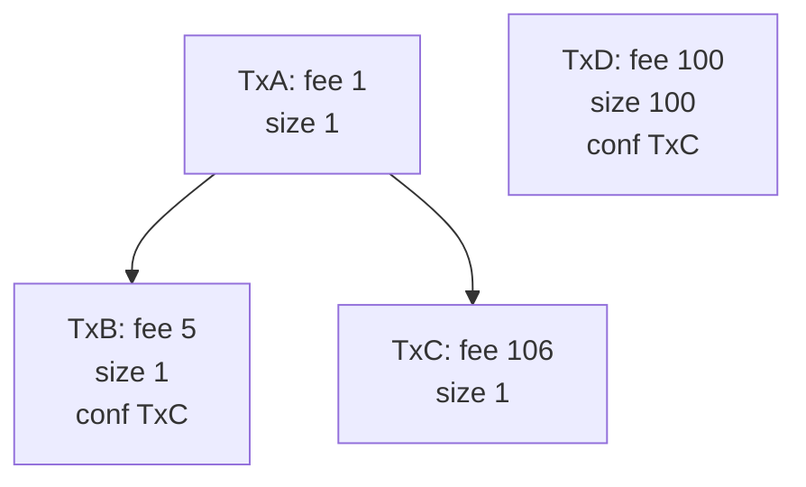
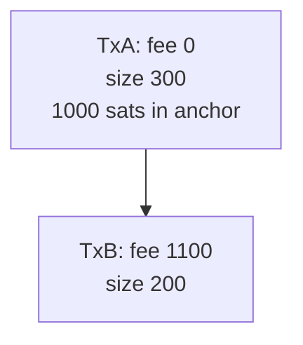
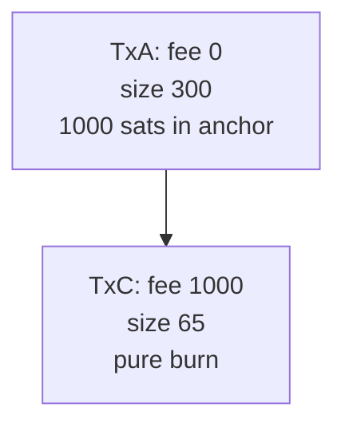
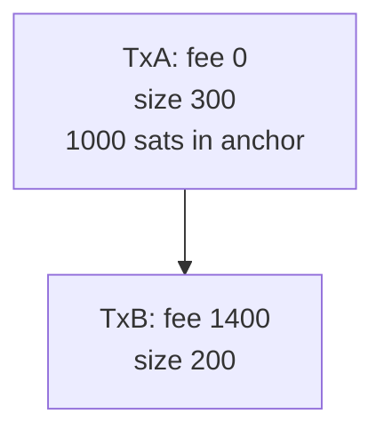
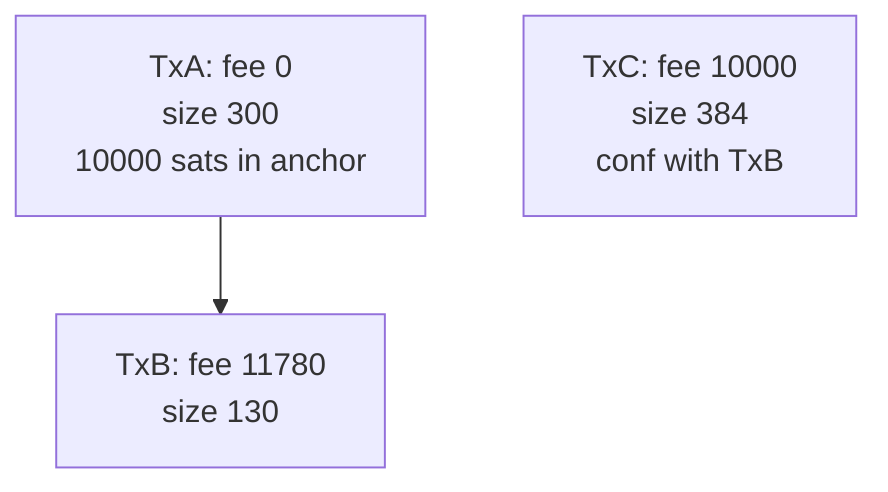

# Ephemeral Anchors and MEVil

instagibbs | 2024-01-19 16:11:53 UTC | #1

# Setting and initial solution

This has been something I've been considering since the start of my work, and was echoed by @ariard here: https://github.com/bitcoin/bips/pull/1524#issuecomment-1865322320

To quote:

> As of today, Bob could do the same attack by routing the HTLCs, however as the trimmed HTLCs are committed as miner fees, if Bob does not have low-hashrate capabilities, he cannot steal from Alice. Moving trimmed HTLC amounts from miners fees to a anyone-can-spend amount changes notably the threat model, in my opinion"

In other words, if an ephemeral anchor has non-0 value, depending on other factors, it may be in the best interest of a counter-party to try and claim the ephemeral anchor funds for themselves, giving only enough fees to get the transaction package in the block.

This is also a potential MEV: Miners should probably intercede and simply burn the funds to fees in that case.

Rather than proactively require miners to do the work for us, it may make sense to essentially do an RBF incentive compatibility check: Should the ephemeral spend transaction just have burned funds to fees? This fee burn, at relay minimums, would be 65 vbytes: An ephemeral anchor spend, and a minimal size OP_RETURN to reach the relay minimum stripped size sending all the ephemeral value to fees. (Note a miner could do batching, or go even smaller, or redirect funds to a key they control to spend it faster; for reducing MEV this seems like a good place to start.)

At first, this meant to me that we should do normal incentives checks against this minimal burn: Is the spender of equal or higher feerate than a relay-minimal direct to miner burn? If it is >=, we accept it. This should in theory make it not useful to inflate the ephemeral anchor value and try to claim it themselves, unless your smart contract adversary is a miner themselves(can't fix that clearly).

# Problem with first solution

Doing a bit of analysis, I realized that a minimal relay burn of funds is actually a pin! If an adversary front-runs the child spend with a pure burn to fees, the fees are large enough to get into the mempool but not into a block, then there's a potential RBF pin. Example:

"Trimmed" value in channel: 50k satoshis(default max of many implementations of LN)  

Mempool minfee: 1 sat/vbyte  
Going rate for block inclusion: 2 sat/vbyte  
Ephemeral Parent: 40k vbytes, 0 fees  
Pure ephemeral burn to fees child: 65 vbytes, 50k fees , feerate of 769 sat/vbyte  
-> Package feerate of 1.24 sat/vbyte  

To replace this child to increase package feerate, it requires we exceed the existing child feerate:

RBF'ing CPFP child size: 65 + 58(taproot input for more fees) + 30(delta size to taproot output for change) = 153 <-- key ratio is this vs pure burn size
Final CPFP child stats: 153 vbytes, 40,153*2= 80,306 fees, feerate of 524 sat/vbyte  
-> Package feerate of 2 sat/vbyte

So to get the RBF into the mempool, you'll need to increase the child feerate by a factor of 769/524=1.46, even though incentive-wise speaking, we should have accepted it as long as package feerate exceeds 1.2 sat/vbytes.

The pin can get larger with larger in-mempool unconfirmed parent, as well as the difference in "pure burn" feerate and the "going rate" for block inclusion, multiplied by the required size of the "honest" CPFP which can grow without the best utxo discipline.

This is pretty ugly and problematic for wallets, as there is a potentially large step function from "ephemeral anchor burn is sufficient" to "we need to bring in more funds". Can we do better?

# Diagram Checks Fix This

We can do better. Similar to the strategy in https://github.com/bitcoin/bitcoin/pull/28984 , we can check if a cluster-size-1 tx RBF is conflicting only with clusters of size two, and do a cluster mempool-like diagram check. The diagram check would allow the scenario's 524 sat/vbyte replacement, as the transaction is incentive compatible, and also brings in more total fees.

This change would require the new RBF rule, and then applying that RBF rule additionally against every ephemeral anchor spend.

With this check, it should blunt any incentives for smart contract counter-parties to attempt to steal the ephemeral anchor value, and reduce MEV potential greatly.

-------------------------

rustynail | 2024-01-09 01:58:02 UTC | #2

[quote="instagibbs, post:1, topic:383"]
if an ephemeral anchor has non-0 value
[/quote]

Why would anyone make a non-trivial-value ephemeral anchor? Is it really necessary to put code in place to fix this?

-------------------------

t-bast | 2024-01-09 09:03:40 UTC | #3

> Why would anyone make a non-trivial-value ephemeral anchor? Is it really necessary to put code in place to fix this?

In the context of lightning, this is necessary to handle dust HTLCs. When Alice sends a dust HTLC to Bob, the following steps happen:

1. Sign a commitment transaction where we subtract the HTLC amount from Alice's main output: since the HTLC is dust, we **don't** create a corresponding HTLC output in that commitment transaction
2. When Bob fulfills the HTLC, sign a commitment transaction where the HTLC amount is added to Bob's main output

In the first step, since we subtracted the HTLC amount from Alice's output but didn't add this amount anywhere else, *we temporarily increased the on-chain fees of the commitment transaction*. In the second step, we decrease the on-chain fees of the commitment transaction back to its previous value. If the commitment transaction of the first step is broadcast, *the dust HTLC amount goes directly to the miners*.

I believe any L2 contract that allows transferring amounts that cannot be claimed on-chain will have a similar issue.

Once we introduce ephemeral anchors, we can either:

1. Not change anything to the current protocol and keep increasing the commitment transaction fees by the dust HTLC amount
2. Add the dust HTLC amount to the ephemeral anchor output to keep the commitment transaction fees constant

The issue with the first option is that the commitment transaction can end up paying a lot of on-chain fees on its own, which means it would make sense to include it in a block without claiming the tiny (most likely 0 sat) ephemeral anchor output (which will then pollute the utxo set).

That's why we're currently advocating for the second option, which ensures that the feerate of the commitment transaction is always 0 sat/byte (which then simplifies the lightning protocol greatly). However, from the miner's point of view, they'll always want to claim the whole value of the ephemeral anchor output for themselves if it's larger than the current feerate (MEV)! In that scenario it is a bit wasteful that we need a follow-up transaction to spend the ephemeral anchor to the miner (without adding any new input since it pays enough fees on its own), but I don't see how to do it better.

-------------------------

instagibbs | 2024-01-09 14:30:36 UTC | #4

Even today, I think dumping trimmed HTLC value is a bit odd incentive-wise in general, in that a counter-party could fund their unilateral close by circular routing games, then go to chain instead of trying to resolve the HTLCs. With the fees being forwarded to a CPFP, this would get even weirder of course since there are free-form fields, like potential payments, so it's better if it's at least no worse than status quo LN spec.

[quote="t-bast, post:3, topic:383"]
I believe any L2 contract that allows transferring amounts that cannot be claimed on-chain will have a similar issue.
[/quote]

A LN spec alternative could be to directly donate trimmed value to the community via OP_RETURN burn, at the expense of 10 more vbytes. Incentives for this seem better, but it is also more wasteful in the average case, which is why I haven't seriously proposed it?

----

Another point: If we don't do the anti-MEV check, due to anti-DoS rules like bip125 rule#3, whoever spends the ephemeral anchor first can inflate the required size without risking their funds, even in the case where a "pure burn" would have been high enough to get into the next block.

-------------------------

MattCorallo | 2024-01-09 18:30:13 UTC | #5

In general, my thinking on these things has always been "it doesn't matter as long as one person runs a bot which creates these transactions for miners". MEVil comes about when miners have to run some sidecar daemon in order to maximize their mined value. Transactions which are trivial to build and can freely enter the mempool (eg ones which burn funds entirely to fees) can meet that criteria, but only if no one is doing so as a public service. Thus, systems which do generate such ephemeral anchors (eg lightning) really need to build these kinds of bots into existing software (shame on me). Alternatively, some single "someone needs to run this" software project which tries to gather all the known such value and put it in the mempool would also suffice.

-------------------------

instagibbs | 2024-01-19 16:56:04 UTC | #6

So there is one remaining oddity even with the diagram based "anti-MEVil" check:

There is still an additional incentive for someone to ramp up the ephemeral anchor value(if another party is paying), if the additional satoshis can be used to have the child conflict with another transaction in the case where the other transaction is a bip125 rule#3 pin.

Example where Bob uses Alice's trimmed funds to pay for conflict against `TxD`:



This oddity only exists due to anti-DoS rules, otherwise there'd be no (additional)incentive to do this as the adversary is only increasing their own required child feerate.

-------------------------

ajtowns | 2024-01-20 04:52:15 UTC | #7

That diagram doesn't make sense to me: all the txs pay a non-zero fee, so presumably none of them have ephemeral anchor outputs?

I think in your scenario Alice wants to see `TxA + TxB + TxD` and Bob is creating `TxC` which conflicts with both `TxB` and `TxD` (the conflict with `TxD` being via some already confirmed utxo).

But I think in that case, the ephemeral anchor from `TxA` has to be less than 5 in value; otherwise a miner would prefer to just claim it directly via a 65byte OP_RETURN tx, rather than mine either `TxB` or `TxC`. Which means Bob's TxC is already contributing 101 units of fees from elsewhere, and can just generate a conflict with `TxD` directly that will have both higher fee and higher feerate without interacting with `TxA` at all?

-------------------------

instagibbs | 2024-01-23 17:15:37 UTC | #8

Thinking more about how precisely this would be implemented as I think this can be made simpler, but posting my draft to give the idea:


[quote="ajtowns, post:7, topic:383"]
That diagram doesn’t make sense to me: all the txs pay a non-zero fee, so presumably none of them have ephemeral anchor outputs?
[/quote]

Ok everything I said was wrong in last post; I think it all works. Let me try again with diagrams which I should have been making earlier:

When an ephemeral anchor spend is evaluated against `TxA`:


We simulate/induce an RBF against a  65byte OP_RETURN tx:

which results in a diagram check:


As you can see, even though the total fees are higher, it doesn't dominate the pure burn, so it would be rejected. The "pure burn" case would of course be accepted, since we would not be doing an incremental relay check.

If instead the proposed spend looked like:



we get:  


and this would be accepted.

-------------------------

ajtowns | 2024-01-24 05:20:08 UTC | #9

I think the "diagram check" is just saying "TxA+TxB's feerate is 2.2, but TxA plus a 65B burn of the eph anchor would be ~2.74 (1000/(300+65)), so no". ie:

```c++
if (spender.fee * (to_spend.size + 65) < anchor_value * (to_spend.size + spender.size)) {
    fail(insufficient_fee_by_eph_anchor_spend);
}
```

If the miner can just add the eph anchor as an additional input to an existing transaction then 65 should be reduced to 41, to account for adding an additional input without the overhead of the tx header or any additional outputs.

-------------------------

instagibbs | 2024-01-24 12:19:55 UTC | #10

[quote="ajtowns, post:9, topic:383"]
I think the “diagram check” is just saying “TxA+TxB’s feerate is 2.2, but TxA plus a 65B burn of the eph anchor would be ~2.74 (1000/(300+65)), so no”. ie:

```

```
[/quote]

This was what I was thinking, I wasn't sure of this, since the proposed spend could also be replacing other in-mempool transactions. Could conflicting with other transactions somehow cause this check to be insufficient from incentives perspective? 

[quote="ajtowns, post:9, topic:383"]
If the miner can just add the eph anchor as an additional input to an existing transaction then 65 should be reduced to 41
[/quote]

I don't think ruling out a pure burn a peer can make is what we want. A miner won't be effected by this check anyways.

-------------------------

Crypt-iQ | 2024-01-24 22:04:54 UTC | #11

Hopefully I'm following the conversation correctly so far, but is the point of the diagram check to avoid the case where a 3rd party requires the channel parties to pay more? If so, how do you handle the case where the pure burn is not enough to make it into the mempool so fees have to be added? In this case, I think a 3rd party could make a spend of the ephemeral anchor + attach some fees where the pure burn diagram check succeeds but the package sits in the mempool. Since presumably the parties to the channel want the package confirmed at the going block feerate, they'll need to RBF the ephemeral anchor spend and end up paying more than if the 3rd party didn't exist.

-------------------------

instagibbs | 2024-01-24 22:44:23 UTC | #12

[quote="Crypt-iQ, post:11, topic:383"]
to avoid the case where a 3rd party requires the channel parties to pay more?
[/quote]

A diagram check, or similar, gives you a more accurate estimation of what's incentive compatible. In this instance we're discussing, it's attempting to avoid the case where a counterparty increases the ephemeral anchor value to either pay itself directly or pay for another transaction beyond the pure burn.

[quote="Crypt-iQ, post:11, topic:383"]
In this case, I think a 3rd party could make a spend of the ephemeral anchor + attach some fees where the pure burn diagram check succeeds but the package sits in the mempool. Since presumably the parties to the channel want the package confirmed at the going block feerate, they’ll need to RBF the ephemeral anchor spend and end up paying more than if the 3rd party didn’t exist.
[/quote]

The responding("you") party would have had to increase the package feerate to make it more incentive compatible to mine, so bip125 rule3 concerns(which v3 intends to mitigate), and incremental feerate aside, I'm not sure what is problematic. Maybe if you have a concrete example?

-------------------------

instagibbs | 2024-01-31 19:13:07 UTC | #13

[quote="instagibbs, post:10, topic:383"]
This was what I was thinking, I wasn’t sure of this, since the proposed spend could also be replacing other in-mempool transactions. Could conflicting with other transactions somehow cause this check to be insufficient from incentives perspective?
[/quote]

I think not doing a full diagram check means it would be insufficient to stop incentives to inflate the value.

For math simplicity, assume an additional input to doublepend `TxC` is 65 vbytes:



`TxA+PureBurn(10k sats)` package rate is 27 sat/vbyte  
`TxA+TxB` package rate is the same  
But it also pays for eviction of `TxC`. In other words, a channel counterparty has additional incentives to drive it up.

If we actually require a diagram check, it may be that we "simulate" the conflict more directly in an actual implementation and let RBF logic handle it post-cluster mempool.

Pre-cluster mempool, it may be simpler to just start with 0-value outputs.

-------------------------

Crypt-iQ | 2024-02-19 18:46:49 UTC | #14

[quote="instagibbs, post:13, topic:383"]
But it also pays for eviction of `TxC`. In other words, a channel counterparty has additional incentives to drive it up.
[/quote]

Is this issue here that the party in control of `TxB` is paying 1,780 sats over the "pure burn" ephemeral anchor spend to evict `TxC` rather than a separate transaction paying > 10,000 sats per rule #3 (thereby saving money and incentivizing inflating the anchor)?

[quote="instagibbs, post:13, topic:383"]
Pre-cluster mempool, it may be simpler to just start with 0-value outputs.
[/quote]

If we start with 0-value outputs but still want to keep the commitment transaction 0-fee, couldn't we add an anyone-can-spend output that's timelocked far in the future (and hence won't interfere with anything in the mempool)?

-------------------------

instagibbs | 2024-02-20 13:16:12 UTC | #15

[quote="Crypt-iQ, post:14, topic:383"]
Is this issue here that the party in control of `TxB` is paying 1,780 sats over the “pure burn” ephemeral anchor spend to evict `TxC` rather than a separate transaction paying > 10,000 sats per rule #3 (thereby saving money and incentivizing inflating the anchor)?
[/quote]

Basically yes. You can make it further obvious by driving up the ephemeral value.

[quote="Crypt-iQ, post:14, topic:383"]
If we start with 0-value outputs but still want to keep the commitment transaction 0-fee, couldn’t we add an anyone-can-spend output that’s timelocked far in the future (and hence won’t interfere with anything in the mempool)?
[/quote]

Yes

-------------------------

