# An overview of the cluster mempool proposal

sdaftuar | 2024-02-05 22:30:23 UTC | #1

Last spring, @sipa and I first floated a concept for a new mempool design to a group of Bitcoin Core contributors, which I later wrote up as a github issue (https://github.com/bitcoin/bitcoin/issues/27677).  Over the course of the past year, the ideas have been refined, and I will use this post to provide an updated high level summary of the overall proposal -- including the motivations and implications -- for anyone looking to catch up on this topic.

----------

# Proposal overview in brief

Here is a summary of the mempool policy changes in the draft implementation (https://github.com/bitcoin/bitcoin/pull/28676) -- note that all these terms and ideas are explained further below:

* Enforce two new limits governing the size of *clusters* in the mempool, so that both the number of transactions in a cluster and the number of vbytes the transactions in the cluster take up are bounded.

* Drop the existing ancestor and descendant limits.

* Update the replace-by-fee rules, so that replacement transactions are accepted to the mempool if and only if they would result in a "strictly better feerate diagram" (explained below).

Note that adding a new restriction on the transaction graph immediately makes the existing "CPFP carveout" policy moot, so that is also removed.  See discussion below.

Also, by bounding cluster sizes, we are able to achieve more optimal orderings of transactions in the mempool for mining (explained below), and so there are two additional behaviors that would be modified by this proposal:

* Update the mining code to take advantage of the more optimal sorting that can be achieved with bounded cluster sizes, and--

* Update mempool eviction to always evict a set of transactions that would be the last ones to be selected by the mining algorithm.
----------
# Background and motivation

The current mempool is designed around maintaining two different sort orders, where for each transaction we keep track of its position in an ancestor-feerate-sort and in a descendant-feerate-sort.

> **Note**: By "ancestor feerate" of a transaction, we refer to the sum of fees divided by sum of vbytes of a transaction along with its unconfirmed ancestors, which represents the minimal set of transactions that would need to be included for the transaction to be valid in a block.  "Descendant feerate" is the analogous concept for a transaction with its in-mempool descendants, which represents the minimal set of transactions that would need to be evicted from the mempool in order for the target transaction to be evicted, in order to avoid orphan transactions from persisting in the mempool.

We use these two sort orders in order to implement eviction and transaction selection (for mining). Whenever the mempool exceeds its size limit, we evict the transaction that has the lowest descendant-feerate, along with all of the transaction's descendants.  We repeat until the mempool is below its size limit.

When we select transactions during block template construction, we choose the transaction with the highest ancestor feerate, and select that transaction with all its ancestors to appear in the block. The ancestor scores of the remaining in-mempool transactions are updated to reflect these selections, and then we repeat by choosing the transaction with next highest-ancestor feerate, and so on until the block is full.

Those algorithms are deficient in several ways. In particular, the eviction algorithm **does not guarantee that the first transaction evicted would be the last transaction mined**, and there exist situations where we could evict a transaction that would otherwise be mined in the next block (see below).

Furthermore, the mining algorithm is more complex than the ancestor feerate sort we maintain, and it is insufficient to merely do lookups into our ancestor feerate index to determine which of two transactions will be mined from the mempool first. This lack of a total ordering on mempool transactions makes RBF calculations difficult to align with miner incentives, and creates distortions where we sometimes can replace transactions via RBF that would actually be better for a miner than the replacement.

To solve all these problems, we can instead maintain a total ordering on mempool transactions, which is used to implement a mining and eviction algorithm that are symmetrically opposite and provide better RBF rules for determining when to allow a replacement to occur.

## Example: Eviction and mining are not opposite

Consider the following transaction graph:

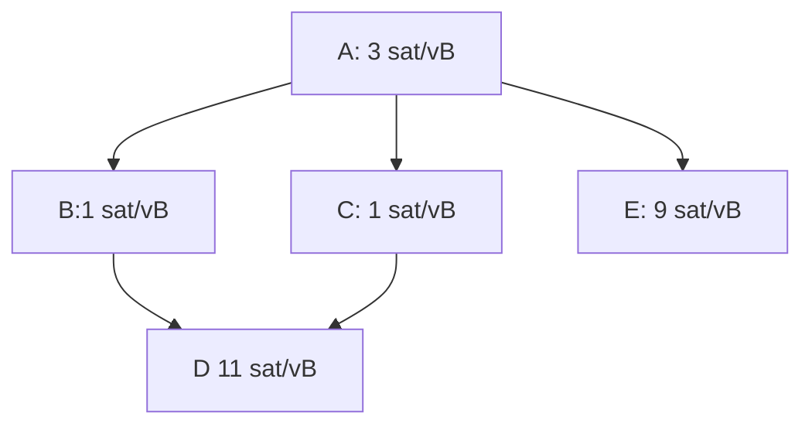

The transaction with lowest descendant feerate is tx A, at 5 sat/vB.  However, the transaction with highest ancestor feerate is tx E, at 6 sat/vB.  This means that our mining algorithm would select transaction E (along with A) to appear in the next block, but our eviction algorithm would select tx A and evict this whole transaction graph if we were above our size limit.

> **Note:** A more complex example that exaggerates the difference between these feerates can be found [here](https://github.com/bitcoin/bitcoin/issues/27677#eviction-mining-not-opposite).

## Example: Our current RBF rules are not always incentive compatible

When a transaction is received that conflicts with some existing in-mempool transaction(s), Bitcoin Core uses policy rules that are (roughly) described in [BIP 125](https://github.com/bitcoin/bips/blob/deae64bfd31f6938253c05392aa355bf6d7e7605/bip-0125.mediawiki) in order to determine if the new transaction should be accepted (which requires evicting the conflicts from the mempool). However, there are many forms of incentive incompatibility that are part of those rules:

* The "no-new-parents" rule doesn't consider the replacement transaction's desirability to a miner -- it might be better than all the to-be-replaced transactions, despite the new unconfirmed parent.
* The rule requiring that a new transaction pays a higher feerate than its direct conflicts is insufficient to ensure that the new transaction is more desirable than what is being evicted. 

To illustrate some specific incentive compatibility issues, consider this example, where A+B are already in the mempool, and transaction A' arrives that conflicts with A:

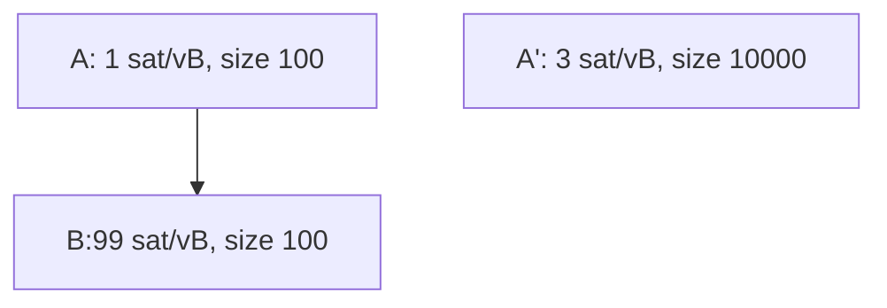

Here, transaction B has an ancestor feerate of 50 sat/vB, while tx A' is only paying 3 sat/vB.  Yet under BIP 125 rules we would evaluate A' as a successful replacement of [A, B], because it pays a higher feerate than A (3 sat/vB vs 1 sat/vB) and pays a higher total fee than A+B (30,000 sats vs. 10,000 sats).

Failure to accept incentive compatible replacements can also occur; consider this example, where A and B are already in the mempool, and B' is a potential replacement of B:

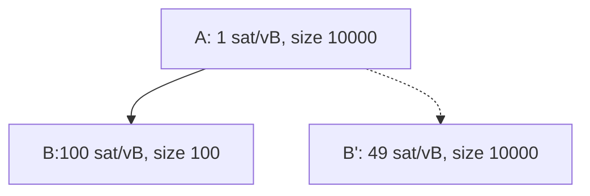

B' cannot replace B in the mempool under the BIP 125 rules, because it pays a lower feerate than B; however B' has an ancestor feerate of 25 sat/vB, while B has an ancestor feerate of just under 2 sat/vB(!).

Many other examples exist as well.

----------
# Designing a solution

## Maintaining a total ordering on the mempool

To fix the problem with eviction and mining, we start with the realization that those should be opposite operations on the mempool -- when we need to evict, we should always evict the transactions that are least desirable to be mined.  The difficulty in achieving this with today's mempool design is that we can't easily calculate the last transaction that would be mined -- the mining algorithm runs in time $O(dn \log n)$, where $n$ is the number of transactions in the mempool, and $d$ is the descendant limit, so it is not currently feasible to run the algorithm on the entire mempool in order to calculate the transactions to evict first.

However, that is exactly what we'd like to do -- so a natural question to ask is, what bound could we add to the mempool in order to make it feasible to have a total ordering?  One way to see the answer to this question is to consider how many mempool transactions' mining scores might be changed when a single new transaction is added -- if we always maintained a full sort on the mempool, then this gives an idea of how much work might need to be done to update the mempool as transactions are added.

The answer to this is that every transaction that is connected to a new transaction, via either parent or child relationships, might have its mining score changed. Consider this example (credit to @sipa):

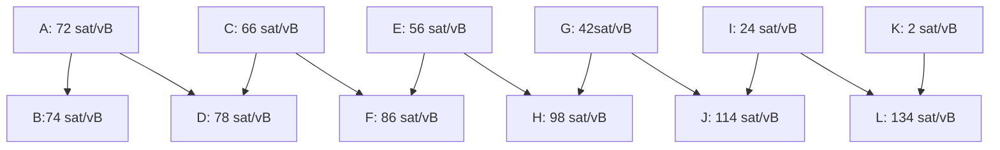
With some calculation, we can see that tx B has the highest ancestor feerate at 73 sat/vB.  Once it and tx A are selected for inclusion in a block, tx D would have the next highest ancestor feerate at 72 sat/vB, followed by tx D, tx F, tx H, tx J, and tx L.

If a new transaction M were to arrive as follows:
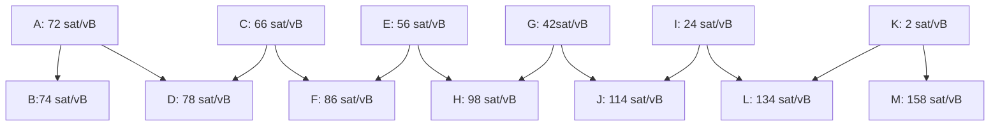

Then the ancestor feerates get reversed(!).  The highest ancestor feerate is now tx M (80 sat/vB), followed by tx L (at 79 sat/vB, once tx K has been selected), and then J, H, F, D, and B -- exactly in the reverse order as before transaction L arrived.

This illustrates that to bound the work required to update mining scores when a new transaction is added, we must bound the size of connected components in the graph of transactions.  We refer to these connected components as *clusters*.

## Implications of a cluster-size limit

### We can keep the mempool fully sorted at all times.

To fully sort the mempool, it suffices to (a) sort each cluster using some sorting/transaction selection algorithm (such as our existing ancestor-feerate algorithm), and (b) devising a way to merge sorted clusters together.

For part (a), we can now realize that we might be able to do better than just use our ancestor feerate algorithm when sorting a cluster.  For very small clusters, we can use exponential run-time algorithms that select the optimal sort order across all possible topologically valid orderings of transactions.  For larger clusters, we can still fall back to using our ancestor feerate algorithm, or consider more advanced strategies, as long as we bound CPU usage to some reasonable value.  

> **Note**: we use the term *linearization* to refer to the process of producing a topologically valid ordering of transactions in a cluster.

For part (b), merging sorted clusters together: this is straightforward.  Suppose we have two clusters, $C_1 = [tx_{a_1}, ..., tx_{a_n}]$, and $C_2 = [tx_{b_1}, ..., tx_{b_m}]$. To determine the optimal merge of these clusters into a single sort order, we want to find the highest feerate prefix of $C_1$ and the highest feerate prefix of $C_2$ and compare them; this best prefix should be the first set of transactions we would include in a block.  Then we'd remove those transactions from whichever cluster it came from, and repeat until all transactions are selected.

> **Note**: we refer to the calculation of successive, highest-feerate-prefixes of a cluster as the *chunks* of a cluster.  We can calculate the chunks of a linearized cluster in linear time.  

For more information on these topics, and other related concepts, see @sipa's writeup [here](https://delvingbitcoin.org/t/cluster-mempool-definitions-theory/202).

### With a fully sorted mempool, mining transaction selection is very fast.

We simply iterate the clusters in descending chunk feerate order, and select transactions from each chunk, until the block is full.

### With a fully sorted mempool, eviction is the opposite of mining.

To run the eviction algorithm when the mempool is full, we simply iterate the chunks in ascending chunk feerate order, and select chunks for eviction until the mempool is below its size limit.

### RBF can now be made incentive compatible for miners.

The first question to ask is what "incentive compatible" should mean.  To consider what this should mean, consider the following example, where the mempool starts with these transactions (assume all transactions are 100 vB in size):

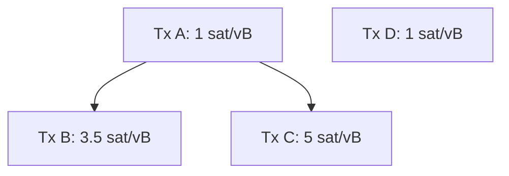

And consider a potential replacement transaction C', which conflicts with tx C, and would produce the following mempool:

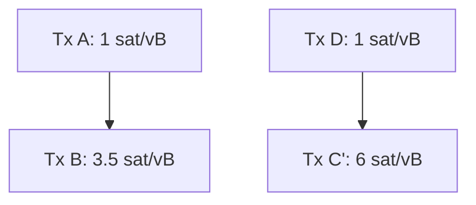

How can we tell whether transaction C' should be accepted?  Using the BIP 125 rules, we might say that C' should be rejected because it brings in a new unconfirmed parent; or we might say that the unconfirmed parent rule is silly since we're just replacing a parent with another parent of the exact same fee/size, and transaction C' pays a strictly higher fee and feerate than C, so we should obviously take it.

It turns out that neither of these explanations is wholly satisfactory.  Consider the total mempool sort order for the "old" mempool that contains tx C, and the "new" mempool that contains C' instead.  

The optimal sort order for the "old" mempool is [A, B, C], [D] (brackets indicate chunks).  A miner who mined just the first chunk of that old mempool would collect 950 sats and have included 300 vB of size; a miner who mined the whole mempool would collect 1050 sats and included 400 vB of size.

Meanwhile, the optimal sort of the new mempool would be: [D, C'], [A, B]. A miner that included the first chunk would collect 700 sats in 200 vB of size; a miner including both chunks would collect 1150 sats in 400 vB of size.

We can graph this data in what we have termed the "feerate diagram" of each mempool option, where on the x-axis we plot the size of the transactions included by a miner, and on the y-axis we plot the maximum fees that the miner can achieve at that size.  If we look at the feerate diagrams for this "old" and "new" mempool, we get the following:

Note that the (300, 950) point from the first diagram lies outside the diagram for the new mempool!  What this tells is that there are sizes at which the old mempool is better than the new one; and similarly in this example there are sizes for which the new mempool is better than the old one.  

We would say that these feerate diagrams are "incomparable", meaning that neither one is strictly better than the other, and they are also not equivalent.  If the red line were greater than or equal to the blue line everywhere, and strictly better at least at one point, then we'd say that the new mempool was "strictly better" than the old one. This would mean that no matter how much size was selected from the mempool, that -- ignoring the tail effects from when a block is nearly full -- a miner would always be better off by selecting transactions from the "new" mempool rather than the old one.

This graph shows why various heuristics for whether a replacement should be taken are unsatisfactory.  Instead, to ensure that a replacement is always better for miners, we propose making the RBF validation rule be that the mempool must get "strictly better" using this feerate diagram check in order to be accepted.

> **Note**: To guard against free relay (an anti-DoS concern), we still will require that the total fee of the new transaction exceed the total fee of the conflicting transactions by at least as much as the min-relay-feerate * size of the new transaction.  However this is a small effect, since the incentive compatibility rule described above already requires that the total fee cannot go down -- this just bumps that value up slightly.

### The CPFP carveout rule can no longer be supported.

The CPFP carveout rule in Bitcoin Core currently allows the mempool to exceed the limit on the number of descendant transactions that a given transaction has, in a specific case that is relevant to the lightning protocol.

The background here is that by default, our mempool policy is to reject an incoming transaction if it would cause some existing mempool transaction to have more than 25 descendant transactions.  In some lightning use case, as I understand it, two parties might both have spendable outputs from some parent transaction.  One of the parties might have an incentive to "pin" the transaction at a low feerate in the mempool by creating child spends that fill up the 25 permitted descendants, but don't effectively bump the feerate to a significant value.  Meanwhile, the other party might wish to use CPFP to fee bump the parent, but be unable to do so because of this descendant limit having already been hit.

The CPFP carveout rule specifically allows the mempool to exceed the descendant limit by exactly 1 transaction in the case where an incoming transaction has exactly 1 in-mempool ancestor (and where the incoming transaction has some small bounded size in vbytes).  The implication is that in a 2-party protocol where each party has a single spendable output from some shared transaction, that either party should always be able to add a child transaction that can bump the fee of the parent.  For more background and thoughts on this, see the mailing list [thread](https://lists.linuxfoundation.org/pipermail/bitcoin-dev/2018-November/016518.html).

However, this CPFP carveout only makes sense because there are no other topology restrictions other than the descendant limit which can prevent a new transaction from being accepted.  By proposing the addition of a new cluster size limit, the CPFP carveout ceases to be helpful -- an adversary can utilize the cluster size limit to prevent the other party from being able to attach a child transaction to the shared parent.  Moreover, because cluster limits are not a property of a particular transaction (the way that the descendant limit is), there is no straightforward way to introduce a new carveout that would apply to allow bypassing this limit in a bounded way.

So the conclusion here is that the carveout rule must be dropped, and projects like lightning that currently rely on it would need to have some other mechanism to bypass this issue.  The [v3 transaction proposal](https://delvingbitcoin.org/t/v3-transaction-policy-for-anti-pinning/340/1) is one attempt to provide such a mechanism.

----------
# Considerations

## Is it reasonable to bound cluster sizes?

A fair question to raise is whether usage patterns on the network are inconsistent with the idea of a cluster size limit; specifically, if it is fair or if it's a bad design that other participants on the network can attach children to a transaction in a way that interferes with someone's ability to (say) attach their own child transaction to an unconfirmed parent.

For this specific concern, I don't believe that the cluster size limits are materially different in character than the existing descendant size limits.  In particular, any scenario where an adversary can attach transactions that would cause the cluster size to be reached (thus preventing an additional spend) is also a scenario where that same adversary could cause a descendant limit to be reached today. 

So my belief is that there's nothing fundamentally worse about cluster size limits than descendant size limits (provided that we can set the cluster size limits to be at least as large as the current default descendant limit, which I expect should be the case).

## Why is there a bound on cluster size in vbytes?

This is for exactly the same reason that we have a bound on the ancestor and descendant sizes -- it provides a bound on how poorly transaction selection can work when we use a greedy algorithm, in situations where the knapsack problem is what we need to solve.  Specifically, by limiting ancestor sizes to approximately 10% of the size of a block, our greedy transaction selection algorithm will always be at least 90% of the maximum fee that we'd achieve if we had a knapsack solver instead.  

Similarly, by bounding descendant sizes we also bound the small amount of free relay that can occur when mempool eviction happens.

To achieve the same effect in cluster mempool, we need to bound chunk sizes.  The simplest way to do that is to bound a cluster size (since a cluster might consist of a single chunk).  While it may be theoretically possible to bound chunk sizes at a smaller value than the cluster size limit, this would create more theoretical questions that we'd need to resolve, which may not be worth the effort and complexity (as no longer would it be the case that chunk feerates within a cluster are monotonically decreasing).

## Why are ancestor and descendant limits being dropped?

One benefit of the cluster mempool approach is that we no longer need to maintain ancestor and descendant feerate state, which means that we no longer need to iterate over ancestors/descendants when updating the mempool as transactions are added and removed, or when blocks are found.  This means that we no longer need to enforce limits on ancestor and descendant count in order to bound CPU usage.

----------
# Next steps

A draft implementation against a recent version of the Bitcoin Core master branch is available [here](https://github.com/bitcoin/bitcoin/pull/28676).  The implementation details are still being improved upon, and the particular choices of parameters for cluster size limits and RBF will be determined after further benchmarking of the code and analysis of the effects of this logic on historical transaction data.

Looking ahead, the framework introduced here for reasoning about the mempool (and RBF specifically) seems helpful for [reasoning about package validation and package RBF](https://delvingbitcoin.org/t/post-clustermempool-package-rbf-per-chunk-processing/190), though that work is still in progress.

-------------------------

harding | 2024-01-12 01:26:13 UTC | #2

[quote="sdaftuar, post:1, topic:393"]
we propose making the RBF validation rule be that the mempool must get “strictly better” using this feerate diagram check in order to be accepted.
[/quote]

How is that comparison made when two feerate diagrams terminate at different points?  For example, OLD terminates at 123,456 vbytes and NEW terminates at 78,901 vbytes?  If the accumulated fees of all the transactions in NEW is above the accumulated fees at the 78,901th byte in OLD, do we choose NEW even if OLD accumulates more fees by the end of its final transaction?

What I'm really asking is what is the chance that RBF pinning will still be an issue because replacing a ~100,000 vbyte transaction at 1 sat/vbyte with a ~100 vbyte transaction will still cost more than 1,000x what the user wanted to pay because the terminal end of the new mempool with the replacement is ~100,000 sats lower than the old mempool.

[quote="sdaftuar, post:1, topic:393"]
### The CPFP carveout rule can no longer be supported.

[...] because cluster limits are not a property of a particular transaction (the way that the descendant limit is), there is no straightforward way to introduce a new carveout that would apply to allow bypassing this limit in a bounded way.
[/quote]

There's really no easy way around this?  For example, when a transaction comes in that matches the carve-out rules, it gets a simple flag set on it that prevents it from being counted against its max cluster size, or that prevents it from getting evicted from that cluster if the cluster size exceeds the maximum?

(I'm all for removing special case rules like carve-out; it's just surprising to me that there's no easy workaround here.)

-------------------------

sdaftuar | 2024-01-12 15:04:58 UTC | #3

@harding Thanks for giving this a thorough read!

[quote="harding, post:2, topic:393"]
How is that comparison made when two feerate diagrams terminate at different points? For example, OLD terminates at 123,456 vbytes and NEW terminates at 78,901 vbytes? If the accumulated fees of all the transactions in NEW is above the accumulated fees at the 78,901th byte in OLD, do we choose NEW even if OLD accumulates more fees by the end of its final transaction?
[/quote]

Great question, as this is something that I have discussed at length with others.

I take the view that the feerate diagram should represent the amount of fees that a miner would receive by mining a given number of vbytes from the mempool, and if the mempool runs out of vbytes when you're trying to look up the corresponding total fees for that size, then the natural thing to do is to assume you have 0-fee paying transactions that take up the additional space.

So in your example, I would pad the diagram for NEW to be of the same size as OLD, and the amount of fees in NEW's diagram at 123,456 vbytes would be the same as the amount of fees in NEW's diagram at 78,901 vbytes.  And so if NEW is greater than OLD at 78,901 vbytes, but less than old at 123,456 vbytes, I would say that the two mempools are incomparable, and not accept a transaction that would move us from one of those states to the other.

Another point of view one could have is that there's some "tail feerate", possibly greater than 0, at which there is essentially an infinite supply of transactions that could be included by miners in blocks.  If this is your view, then you could imagine picking some tail feerate value (presumably, this is a value that has an upper bound given by the lowest chunk feerate in the mempool), and then extrapolating the feerate diagram of NEW at that feerate so that it has the same size as OLD, and then doing a comparison on the resulting diagrams which will then be the same size.

However, if you take this view that the tail feerate is greater than 0, then this should also change the way you view a NEW mempool that has *more* vbytes than the OLD mempool, such that you ought to extrapolate the feerate diagram of OLD in that situation so that you are imputing more fees in the OLD mempool than are actually there.  This in turn would then prevent some replacements that would be successful if we used a tail feerate of 0 instead, and frankly it seems surprising to me that we'd assume the existence of fees that a miner running our software can't actually realize.

So my overall view is that a tail feerate of 0 is the most justifiable idea right now.  Moreover, even if we had an interpretation of mempool incentive compatibility that permitted some non-zero tail feerate, we'd still be limited by the anti-DoS rule that requires total fees to go up (to prevent free relay), making the point moot -- so for now at least, I think this is more of a theoretical issue than a practical one.

I could imagine in the future that research could be done regarding incentive-compatibility to take into account the idea that feerates near the top of the mempool are more significant for miners than feerates near the bottom of the mempool, and therefore an optimal diagram comparison would apply some kind of discounting to things at the bottom versus things at the top. And should someone develop a robust model for how to do this, I think we could update our software in the future to implement a different test.

[quote="harding, post:2, topic:393"]
There’s really no easy way around this? For example, when a transaction comes in that matches the carve-out rules, it gets a simple flag set on it that prevents it from being counted against its max cluster size, or that prevents it from getting evicted from that cluster if the cluster size exceeds the maximum?
[/quote]

I don't have a proof, but my intuition is that there is no solution here. 

The problem is that literally any non-child transaction in the mempool today might be a candidate for having a child that satisfies the criteria of the carveout rule.  For the sake of my illustrative capabilities, assume that we'd like to enforce a cluster size limit of 10, and we had a mempool cluster that looked like this:

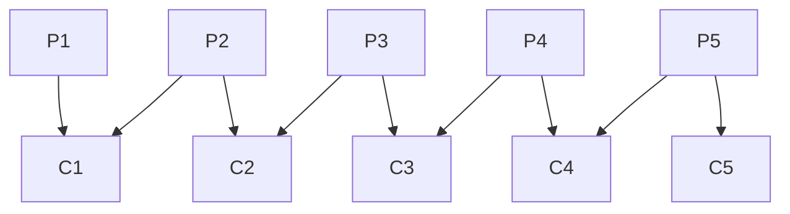
This cluster is full, but any any one of those transactions P1, P2, .., P5 might have another spendable output allowing creation of children that would match the requirements of the current carveout rule (which just checks that the incoming transaction have exactly 1 ancestor and be below some size limit).  So to implement carveout in its current form, we'd have to be either willing to (a) evict an existing transaction from this cluster to make room, or (b) allow all 5 new transactions to be added, blowing through our cluster size limit of 10 and creating a cluster of size 15.

Neither of these options is good.  For (a), there are two issues with evicting an existing transaction.  The first is that any of the in-mempool parent transactions might be a shared transaction in some multiparty contracting protocol, and the other participant might be relying on *their* spend of their output to be the one that gets the parent confirmed.  Now, we could mitigate that by trying to use our RBF rules to find another transaction in the cluster to evict, to make room for the new transaction; but this is problematic for two reasons.  One is that you could easily be pinned by transactions that are larger but pay a lower feerate, and be forced into a choice of supporting carveout at the expense of opening up free relay attacks; the other is that this introduces a great deal of complexity into our validation code if we have to find a transaction to evict, given that there may be many choices for which one to evict, creating a lot of processing overhead to determine which is the most incentive compatible outcome (and I imagine there could easily be incomparable options to sort amongst).

For (b), my philosophy on this work is that we should strive for cluster size limits that we are allowed to meet and never exceed -- for instance, if we thought that it was safe to have clusters with 100 transactions, maybe you could design a policy regime where the default limit is much lower (say 50), and then we permit carveout exceptions and try to reason that this could never take us above 100.  I think this would be bad design, though, as it means that we're significantly restricting the permitted cluster size for the vast majority of network users in order to try to reason about what I view as a very edge case situation.  My engineering opinion is also that this is just bad software design, of having a limit in mind that you can't actually enforce without some analysis of emergent properties at a higher layer. 

Anyway, it's possible that I'm wrong about there being no simple workarounds here, so if you have other ideas of things to consider please suggest away...

However it strikes me that there's a more obvious solution available to us: if we have an idea for what *topology* the carveout rule is intended to match, then we should instead just offer a policy regime that allows transactions to opt into that topology, and then we can enforce cluster size limits as we'd like to.  The v3 transaction proposal is designed with this in mind, so if it proves to be workable for the use cases that currently rely on carveout, I think this would be vastly superior.

-------------------------

instagibbs | 2024-01-12 15:31:36 UTC | #4

[quote="sdaftuar, post:3, topic:393"]
I could imagine in the future that research could be done regarding incentive-compatibility to take into account the idea that feerates near the top of the mempool are more significant for miners than feerates near the bottom of the mempool, and therefore an optimal diagram comparison would apply some kind of discounting to things at the bottom versus things at the top. And should someone develop a robust model for how to do this, I think we could update our software in the future to implement a different test.
[/quote]

Yes, it's completely natural to apply some sort of future discounting, as something far away from "top blocks" are likely to:
1) be trimmed
2) be RBF'd
3) timeout

so reflecting that uncertainty directly is something someone can explore further. I did some initial number analysis to see if it could help anti-pin(it can't :) )

[quote="sdaftuar, post:3, topic:393"]
(a) evict an existing transaction from this cluster to make room
[/quote]

A minor note, but this also necessarily opens up to "mempoolfullrbf" style RBFs, good or bad.

One idea I'd had, which Suhas has essentially responded to above, is that we could:  

1) receive new chunk somehow that exceeds cluster limits
2) allow temporary exceeding of limits  
3) re-linearize cluster with exceeded limits
4) "chop off" the excess at the end

As Suhas notes, this can get pretty weird with pinning/anti-DoS. I don't think it's a dead-end, but more of a whiteboarding project at this point.

-------------------------

harding | 2024-01-12 18:04:39 UTC | #5

The idea described below in this post doesn't work.  I tried to find a way to make carveout compatible with cluster mempool and failed.  Normally I wouldn't advertise my failures, but I think it could be useful to future discussions to show several people tried working this problem and couldn't find a solution.

[quote="sdaftuar, post:3, topic:393"]
the current carveout rule (which just checks that the incoming transaction have exactly 1 ancestor and be below some size limit).
[/quote]

Your description and diagram match how carveout works (AIUI) but I think it's worth noting that LN anchor channels only have exactly 2 outputs that can be spent in the same block as the parent transaction (see BOLT3).  This is necessary to prevent a malicious counterparty who controls >1 output from using the carveout themselves and preventing its use by the honest counterparty, so I think we can safely assume that any other thoughtful users of carveouts are doing something similar.  An implication of this is that your diagram's P2 to P5 could not have a carveout attached because both immediately-spendable outputs have already been spent.

I think we can reformulate carveout's rules as used by LN:

1. A carveout is 1,000 vbytes or less
2. A carveout has exactly one unconfirmed ancestor (it's parent)
3. A carveout's parent has no unconfirmed ancestors
4. A carveout is either the first or second spent output of a transaction that has fewer than three of its outputs spent so far

Checking whether a newly received transaction obeys rule #1 is obviously easy. Checking that it obeys rule #2 is also easy because we have to look up each of a transaction's inputs anyway.  When we find the carveout's exactly one unconfirmed ancestor, we can check that it obeys rule #3 using the same mechanism (no special traits or caching required).  Now to check rule #4 we need only determine how many spends of the parent transaction's outputs are currently in the mempool; if it's currently 0 or 1, and all the previous rules were satisfied, we tag this transaction as a carveout and allow it to exceed the cluster size limit.

Using free CPU cycles, we can periodically check every transaction tagged as a carveout to see if its parent now has three or more spends, in which case we can clear the carveout flag.

When writing the above, I thought my proposed scheme meant a cluster could never have more than two carveouts.  However, here's a case where there can be many more:

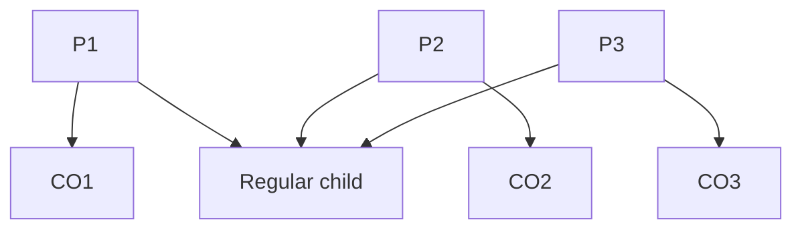

-------------------------

instagibbs | 2024-01-12 18:21:48 UTC | #6

[quote="harding, post:5, topic:393"]
A carveout is 1,000 vbytes or less
[/quote]

doesn't actually matter for the example, but I believe it's 10kvB

-------------------------

sdaftuar | 2024-01-12 19:27:17 UTC | #7

[quote="harding, post:5, topic:393"]
I think we can reformulate carveout’s rules as used by LN:

1. A carveout is 1,000 vbytes or less
2. A carveout has exactly one unconfirmed ancestor (it’s parent)
3. A carveout’s parent has no unconfirmed ancestors
4. A carveout is either the first or second spent output of a transaction that has fewer than three of its outputs spent so far
[/quote]

Just thought it is worth noting here that in trying to think about what the LN carveout rule should match for, rules 2, 3 and 4 are all about the transaction graph topology -- and yet currently, the LN anchors have no enforced topology restrictions (beyond their construction of having 2 spendable outputs -- but those outputs can be spent arbitrarily).  If we had a way to enforce that spends of an anchor output were not permitted to have additional children or pull in additional parents, then this problem again becomes easy -- which is exactly what v3 contemplates.

-------------------------

sdaftuar | 2024-02-02 14:30:38 UTC | #8

I was wondering if a form of sibling eviction might work as a topological (if not economic) substitute for the carveout rule going away.  That is, is there a sibling eviction policy that we could adopt which would give current users of the CPFP carveout rule an economic way to get a transaction into the mempool when the cluster it would be joining is full? If so, then this might be an alternative we could consider to the suggestion of using v3 policy rules as a carveout replacement.

Specifically, I was wondering if we could implement the following sibling eviction policy, as part of the cluster mempool approach:

If a new transaction is rejected from the mempool due to a cluster size limit, and it has a single unconfirmed parent, and that parent has exactly 1 other unconfirmed child, then consider that child as a candidate for eviction in order to accept the new transaction.  Specifically, we'd use our RBF rules (feerate diagram check) to determine if the mempool + new transaction - replacement candidate is strictly better than the existing mempool, and process the replacement if so.

I should point out immediately that with no other constraints on the sibling described in that rule, that RBF pinning with a high fee transaction would be possible.  Still, I wondered if having *some* way to evict a transaction to make room for another might still be valuable, in a general setting, as that gives users more options than rules which have no economic mechanism to bypass.

However, I don't think we can easily achieve this behavior while maintaining an additional intuitive property:

 * Any transactions we evict under this policy should not succeed in re-entering the mempool if immediately resubmitted.

The proposed rule fails this test.  Consider this picture:

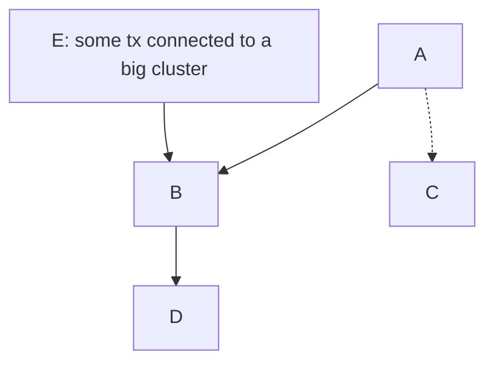

Imagine tx C arrives, and we consider eviction of tx B to make room for it. Even if "accept tx C and evict tx B (along with B's descendants)" is a valid replacement under the feerate diagram check, it's possible that immediately re-accepting tx B would be successful, because without tx D it might be under the cluster size limits.

To resolve this, we could (say) require for our rule that tx B only be evaluated for eviction if it has no unconfirmed children.  However, then we immediately lose the benefits for something like this as a carveout alternative, because it's trivially pinnable by a counterparty where if the other sibling has multiple children, no sibling eviction would be considered.

Alternatively, we could find some child transaction to consider evicting; however if there is more than one candidate, then we might be in a difficult situation of trying to pick which one to evaluate, and there's no obvious way to make that choice. 

By contrast, the v3 rules resolve this problem, by requiring that v3 children have no children of their own.

(Just sharing this in the spirit of @harding's comment about the potential value in looking at failed ideas!)

-------------------------

instagibbs | 2024-02-02 14:46:32 UTC | #9

[quote="sdaftuar, post:8, topic:393"]
However, I don’t think we can easily achieve this behavior while maintaining an additional intuitive property:

* Any transactions we evict under this policy should not succeed in re-entering the mempool if immediately resubmitted.
[/quote]

Can you motivate this as a principled objection? Mempool quality increases, just not in the most optimal way possible. The alternative is to not improve the mempool at all?

[quote="sdaftuar, post:8, topic:393"]
Alternatively, we could find some child transaction to consider evicting; however if there is more than one candidate, then we might be in a difficult situation of trying to pick which one to evaluate, and there’s no obvious way to make that choice.
[/quote]

Again, if our constraint is "we can only pick the optimal evictions", sure this is intractable, but I am not convinced of that. For now I'd rather focus on the premise of the objection on the simple non-v3 case.

---
Also while we're here, the other strategy previously discussed to allow cluster limits to be breached, temporarily and in some limited size/count way, linearize, then "prune" until you get back to cluster limits. Accept/reject said linearization based on normal diagram checks. I know you've already dismissed this, but good to have alternatives all in one place.

With other objections you've had aside, I think this strategy is more limited because you may not be able to practically make the sibling eviction candidates small.

-------------------------

sdaftuar | 2024-02-02 15:00:33 UTC | #10

[quote="instagibbs, post:9, topic:393"]
Can you motivate this as a principled objection? Mempool quality increases, just not in the most optimal way possible. The alternative is to not improve the mempool at all?
[/quote]

Hmm, I'm not sure that I can -- it just seems like this is a messy behavior, and so I think we're missing something in the design if we can't come up with a cleaner way of achieving the goal.  It's wasteful to have to rebroadcast/revalidate transactions that never should have been evicted in the first place.

Also I suppose there are other solutions we could consider; one is that we somehow require a peer sending us this transaction to do the work of calculating which transaction we should evict to make room for a new transaction, which we then just verify will satisfy our requirements? Seems like that could be a "clean" approach from an engineering aesthetics point of view, though it begs the question of how that determination might be made by a wallet in the first place.

Edit: Maybe the broader observation is, if this narrow idea for sibling eviction is still this messy, and it has obvious pinning vectors anyway due to how RBF works, and it only applies in a very limited topology to begin with, is it worth adding the complexity to the implementation?

-------------------------

instagibbs | 2024-02-05 14:59:31 UTC | #11

[quote="sdaftuar, post:10, topic:393"]
one is that we somehow require a peer sending us this transaction to do the work of calculating which transaction we should evict to make room for a new transaction
[/quote]

Doesn't work when the peer cannot "see" the other transactions. You can't really give hints that will work consistently.

[quote="sdaftuar, post:10, topic:393"]
and it only applies in a very limited topology to begin with
[/quote]

I don't buy that premise though either, I was deferring for sake of argument.

[quote="sdaftuar, post:10, topic:393"]
though it begs the question of how that determination might be made by a wallet in the first place.
[/quote]

It would certainly have to be well motivated. In a future package relay world there's a few, less so in the near future where 1p1c makes most sense.

---

edit: last thoughts for now

1) something I had thought of and forgot later, but [sibling eviction is less important in a "top block" world](https://delvingbitcoin.org/t/0conf-ln-channels-and-v3-anchors/494/7#future-solution-2)
2) We could decide that later, with "top block"-like solutions that allow relaxed topologies, sibling eviction could be an add-on measure where we do something simple to avoid DoS but perhaps not remove all pins

-------------------------

ajtowns | 2024-02-03 11:29:09 UTC | #12

[quote="sdaftuar, post:8, topic:393"]
Imagine tx C arrives, and we consider eviction of tx B to make room for it. Even if “accept tx C and evict tx B (along with B’s descendants)” is a valid replacement under the feerate diagram check, it’s possible that immediately re-accepting tx B would be successful, because without tx D it might be under the cluster size limits.
[/quote]

I'm not sure I see this as bad? The mempool would be going from:

 * [E] [A]  (separate clusters)
 * [E, B] [A]
 * [E, B, D] [A]
 * [E, A, C]
 * [E, A, C, B]

Those are all fairly different states, and each one is strictly improving the feerate diagram. That seems like a good thing!

The only drawback I can see is that "B" would be potentially be being relayed and validated twice (which is wasteful, and you might be able to convert that into a DoS attack of some sort if you can cheaply construct lots of C's and D's?).

If there was some reasonable way of jumping directly from "[EBD] [A]" to "[EACB]" without the intervening step where B is evicted from the mempool, that would seem perfect. If we already have a linearisation of the stuff we're evicting (ie "[...BD]") could we just try adding those txs back in in order immediately?

-------------------------

instagibbs | 2024-02-05 15:08:32 UTC | #13

[quote="ajtowns, post:12, topic:393"]
could we just try adding those txs back in in order immediately?
[/quote]

As a post-processing kind of step, the replacing chunk would have had to pay total/incremental for evicting the things being re-added, so this seems relatively conservative.

Even better is if we could cheaply compute a small subset of items(ordered by increasing CFR?) that we could remove to make the new chunk fit. This would allow the evict-er to pay less in fees, but also might stray into computationally dubious territory.

-------------------------

instagibbs | 2024-02-08 14:15:36 UTC | #14

Something like this might be general enough to be useful(Uncle eviction?):

If proposed chunk is too large for cluster by (remaining_size, remaining_count):
1) add all existing chunks to minheap by CFR
2) While heap not empty, pop chunk:
   For each transaction in chunk(in reverse topo order):  
   if in proposed chunks' ancestor set: skip  
   else mark for eviction and reduce remaining_size by tx size and remaining_count by 1
   If remaining_size <= 0 and remaining_count <= 0: break
3) If anything was marked for eviction: Do diagram check (don't check remaining_*, maybe we split clusters accidentally?)
   
   
You could also restrict the space of transactions to evict to something more "local"
like the descendants of the proposed chunk's ancestors'(not including the ancestor set itself).
This should allow eviction in every case still if the new chunk's fees are high enough, while acting a bit more "locally".

These should allow improvements to the mempool with O(nlogn) processing, and no resubmission of transactions? Doesn't solve incremental relay pins of course.

-------------------------

sdaftuar | 2024-02-08 15:00:36 UTC | #15

Nothing strikes me as particularly problematic with the algorithm you describe -- I think there are a bunch of bounded search algorithms we could consider which look for a subset that is strictly better than what we started with -- but I think if we accept that (a) we don't currently have a framework for deciding what an optimal subset of transactions from a too-big-cluster is, and (b) that therefore any approach that tries to find something better than what we have is going to be guesswork for now, then I think it would make sense to motivate the logic with a use case that would need it.

I'd hope that with more research, at some point in the future we are able to come up with a rigorous notion of what an optimal subset of transactions from a too-big-cluster is, and at that point it would be a shame if we were held up in deploying it due to reliance that has developed on existing behavior.  (Of course, if there are use cases that would concretely benefit today from our guesswork solutions, then that would be a reason in favor of trying something like this.)

EDIT: regarding this:

[quote="instagibbs, post:14, topic:393"]
These should allow improvements to the mempool with O(nlogn) processing, and no resubmission of transactions? Doesn’t solve incremental relay pins of course.
[/quote]

You could have a resubmission of transactions that works, if I understand the algorithm right. Consider this picture:

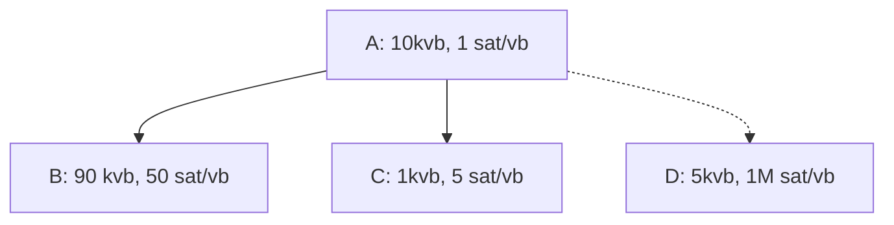

So A, B, C are in the mempool and D arrives.  ABC is at the cluster size limit, and the cluster should chunk as [AB, C]. Running your algorithm, we mark C for eviction, and then mark B for eviction -- at which point we've freed enough space.  We compare [AD] to [AB, C] and assuming I made D's feerate high enough, it gets in.  But now there is room for C to be re-added as well.

-------------------------

instagibbs | 2024-02-08 15:23:54 UTC | #16

[quote="sdaftuar, post:15, topic:393"]
So A, B, C are in the mempool and D arrives. ABC is at the cluster size limit, and the cluster should chunk as [AB, C]. Running your algorithm, we mark C for eviction, and then mark B for eviction – at which point we’ve freed enough space. We compare [AD] to [AB, C] and assuming I made D’s feerate high enough, it gets in. But now there is room for C to be re-added as well.
[/quote]

You're of course right, since we're not optimally pruning these effects can still happen. So you might want to have the evicting party pay for it, but then let it back in via re-submission. Or just be more optimal.

[quote="sdaftuar, post:15, topic:393"]
it would be a shame if we were held up in deploying it due to reliance that has developed on existing behavior.
[/quote]

Shower-thought level quality aside, the goal is to give wallets, who maybe don't even see the cluster limit being hit, a way to improve the mempool and get their transactions confirmed. If we find an even better way later, we should take it.

[quote="sdaftuar, post:15, topic:393"]
then I think it would make sense to motivate the logic with a use case that would need it.
[/quote]

A couple use-cases for motivation in the future, all relying on cluster sizes of [above 2](https://delvingbitcoin.org/t/v3-and-some-possible-futures/523):

1) 0-conf funding transactions in LN. Funding transaction may have descendants added on, so the anchor spend(or slightly larger replacement) is unable to enter the cluster.
2) Ark/Timeout trees. You may want log(n) nodes in the tree published with a single anchor at the end of the chain, but once enough branches are put into the mempool, you're unable to make attempts at inclusion.

Adding anchors at each step "fixes" these, but significant marginal bytes to protect against scenarios no one has seen in the wild is a hard sell.

-------------------------

hebasto | 2024-02-18 15:28:06 UTC | #17

Do I understand correctly that the cluster size limit might affect the experience of the CoinJoin transaction participants? Considering a transaction with no ancestors, which has the number of outputs that exceeds the cluster size limit, only first `max_cluster_size - 1` participants will be able to spend their outputs, no?

-------------------------

sdaftuar | 2024-02-18 15:43:27 UTC | #18

[quote="hebasto, post:17, topic:393"]
Considering a transaction with no ancestors, which has the number of outputs that exceeds the cluster size limit, only first `max_cluster_size - 1` participants will be able to spend their outputs, no?
[/quote]

Just to be clear, only the first `max_cluster_size - 1` participants will be able to spend their outputs in separate transactions *before the parent transaction is confirmed*, but yes that is correct.

Note that today, the descendant count limit (25 transactions by default) already imposes a restriction on unconfirmed spends of outputs from a single transaction.  While we haven't finalized a proposed cluster size limit yet, my hope is that we'll be able to support a number that is bigger than 25 (in my draft PR, this number is set to 100 for now).

-------------------------

hebasto | 2024-02-21 12:31:28 UTC | #19

[quote="sdaftuar, post:1, topic:393"]
This graph shows why various heuristics for whether a replacement should be taken are unsatisfactory. Instead, to ensure that a replacement is always better for miners, we propose making the RBF validation rule be that the mempool must get “strictly better” using this feerate diagram check in order to be accepted.
[/quote]

1. Without knowing a mempool ordering, is it possible for a wallet to construct an RBF transaction candidate that will be guaranteed to be accepted?

if not,

2. What kind of a mempool ordering data would be sufficient for a wallet to achieve such a goal?

-------------------------

sdaftuar | 2024-02-21 13:59:55 UTC | #20

[quote="hebasto, post:19, topic:393"]
1. Without knowing a mempool ordering, is it possible for a wallet to construct an RBF transaction candidate that will be guaranteed to be accepted?
[/quote]

I think the short answer is "no" -- philosophically at least, what I'm proposing is that our RBF rules become even more of a black box than they are today.  

When we first implemented RBF in Bitcoin Core (back in 2015), I had suggested that we write up our replacement rules in a BIP (BIP 125) so that wallets would be able to know what the rules are and be able to comply with them.  However, because those rules depend on the feerates and total fees of all conflicting transactions (including descendants of direct conflicts), wallets already need access to a full node's mempool in order to know how to replace a given transaction. 

Because of this existing complexity, my understanding is that most (all?) wallets today, in practice, just try to keep bumping the fee on a transaction until it is accepted by a full node's mempool (if access to one is available) or until it confirms.  I'd be curious to know if there are wallets in use that attempt to calculate the BIP 125 requirements for themselves though, and if so, how they achieve it.

[quote="hebasto, post:19, topic:393"]
2. What kind of a mempool ordering data would be sufficient for a wallet to achieve such a goal?
[/quote]

Let's say we're constructing a new transaction $T$, which would directly conflict with some existing transactions ${E_1, ..., E_N}$. Then in theory, in order to calculate exactly whether T would be a successful replacement, we'd need to know:
- the existing orderings of the clusters that each $E_i$ is currently in.
- the orderings of the clusters that would be affected by adding $T$ and removing each $E_i$ from the mempool
- the total fees of $T$, and the total fees of the transactions being removed from the mempool.

In practice, though, the rules line up largely with what I think users expect.  You can take a look at my draft PR (https://github.com/bitcoin/bitcoin/pull/28676) and look at the changes that needed to be made to the functional tests -- basically no substantive changes were made to the tests in `feature_rbf.py`.  So I think that is indicative that the rules aren't really changing in ways that are unexpected for real-world use cases.

-------------------------

