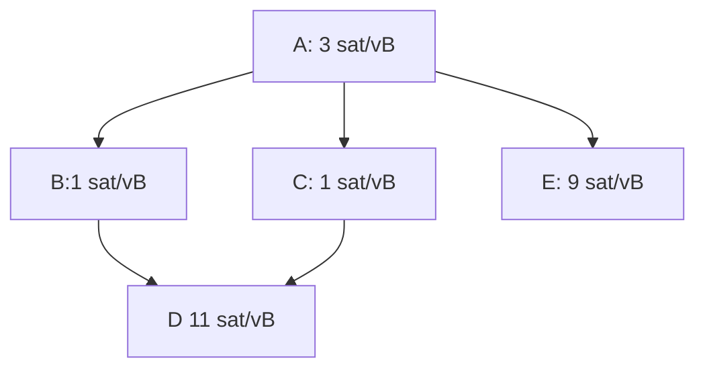
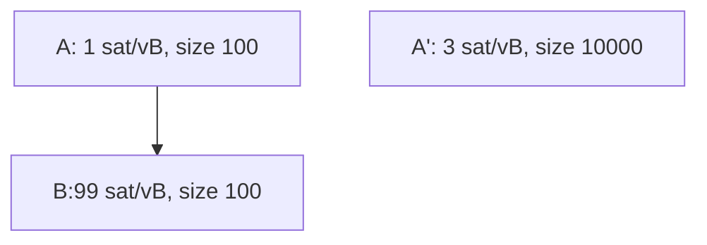
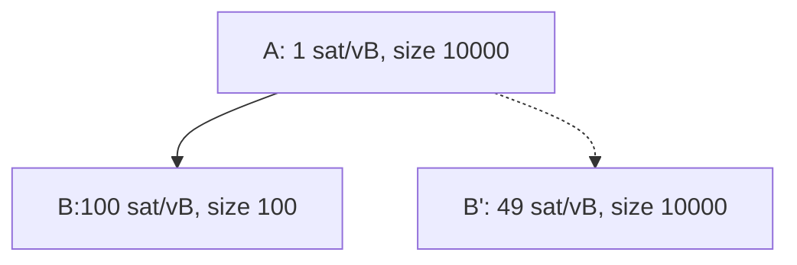
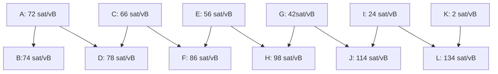
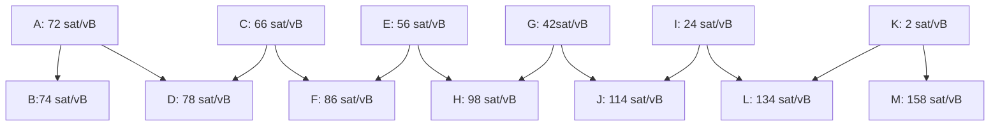
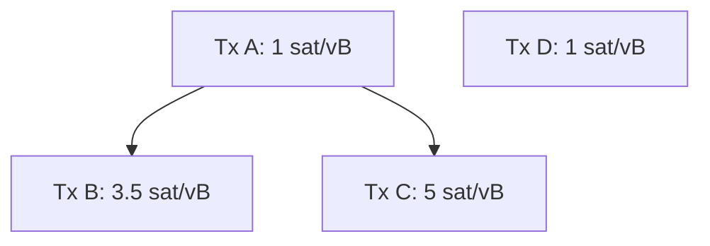
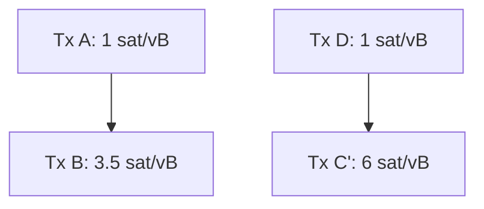

# An overview of the cluster mempool proposal

sdaftuar | 2024-01-09 22:52:52 UTC | #1

Last spring, @sipa and I first floated a concept for a new mempool design to a group of Bitcoin Core contributors, which I later wrote up as a github issue (https://github.com/bitcoin/bitcoin/issues/27677).  Over the course of the past year, the ideas have been refined, and I will use this post to provide an updated high level summary of the overall proposal -- including the motivations and implications -- for anyone looking to catch up on this topic.

----------

# Proposal overview in brief

Here is a summary of the mempool policy changes in the draft implementation (https://github.com/bitcoin/bitcoin/pull/28676) -- note that all these terms and ideas are explained further below:

* Enforce two new limits governing the size of *clusters* in the mempool, so that both the number of transactions in a cluster and the number of vbytes the transactions in the cluster take up are bounded.

* Drop the existing ancestor and descendant limits.

* Update the replace-by-fee rules, so that replacement transactions are accepted to the mempool if and only if they would result in a "strictly better feerate diagram" (explained below).

Note that adding a new restriction on the transaction graph immediately makes the existing "CPFP carveout" policy moot, so that is also removed.  See discussion below.

Also, by bounding cluster sizes, we are able to achieve more optimal orderings of transactions in the mempool for mining (explained below), and so there are two additional behaviors that would be modified by this proposal:

* Update the mining code to take advantage of the more optimal sorting that can be achieved with bounded cluster sizes, and--

* Update mempool eviction to always evict a set of transactions that would be the last ones to be selected by the mining algorithm.
----------
# Background and motivation

The current mempool is designed around maintaining two different sort orders, where for each transaction we keep track of its position in an ancestor-feerate-sort and in a descendant-feerate-sort.

> **Note**: By "ancestor feerate" of a transaction, we refer to the sum of fees divided by sum of vbytes of a transaction along with its unconfirmed ancestors, which represents the minimal set of transactions that would need to be included for the transaction to be valid in a block.  "Descendant feerate" is the analogous concept for a transaction with its in-mempool descendants, which represents the minimal set of transactions that would need to be evicted from the mempool in order for the target transaction to be evicted, in order to avoid orphan transactions from persisting in the mempool.

We use these two sort orders in order to implement eviction and transaction selection (for mining). Whenever the mempool exceeds its size limit, we evict the transaction that has the lowest descendant-feerate, along with all of the transaction's descendants.  We repeat until the mempool is below its size limit.

When we select transactions during block template construction, we choose the transaction with the highest ancestor feerate, and select that transaction with all its ancestors to appear in the block. The ancestor scores of the remaining in-mempool transactions are updated to reflect these selections, and then we repeat by choosing the transaction with next highest-ancestor feerate, and so on until the block is full.

Those algorithms are deficient in several ways. In particular, the eviction algorithm **does not guarantee that the first transaction evicted would be the last transaction mined**, and there exist situations where we could evict a transaction that would otherwise be mined in the next block (see below).

Furthermore, the mining algorithm is more complex than the ancestor feerate sort we maintain, and it is insufficient to merely do lookups into our ancestor feerate index to determine which of two transactions will be mined from the mempool first. This lack of a total ordering on mempool transactions makes RBF calculations difficult to align with miner incentives, and creates distortions where we sometimes can replace transactions via RBF that would actually be better for a miner than the replacement.

To solve all these problems, we can instead maintain a total ordering on mempool transactions, which is used to implement a mining and eviction algorithm that are symmetrically opposite and provide better RBF rules for determining when to allow a replacement to occur.

## Example: Eviction and mining are not opposite

Consider the following transaction graph:

The transaction with lowest descendant feerate is tx A, at 5 sat/vB.  However, the transaction with highest ancestor feerate is tx E, at 6 sat/vB.  This means that our mining algorithm would select transaction E (along with A) to appear in the next block, but our eviction algorithm would select tx A and evict this whole transaction graph if we were above our size limit.

> **Note:** A more complex example that exaggerates the difference between these feerates can be found [here](https://github.com/bitcoin/bitcoin/issues/27677#eviction-mining-not-opposite).

## Example: Our current RBF rules are not always incentive compatible

When a transaction is received that conflicts with some existing in-mempool transaction(s), Bitcoin Core uses policy rules that are (roughly) described in [BIP 125](https://github.com/bitcoin/bips/blob/deae64bfd31f6938253c05392aa355bf6d7e7605/bip-0125.mediawiki) in order to determine if the new transaction should be accepted (which requires evicting the conflicts from the mempool). However, there are many forms of incentive incompatibility that are part of those rules:

* The "no-new-parents" rule doesn't consider the replacement transaction's desirability to a miner -- it might be better than all the to-be-replaced transactions, despite the new unconfirmed parent.
* The rule requiring that a new transaction pays a higher feerate than its direct conflicts is insufficient to ensure that the new transaction is more desirable than what is being evicted. 

To illustrate some specific incentive compatibility issues, consider this example, where A+B are already in the mempool, and transaction A' arrives that conflicts with A:

Here, transaction B has an ancestor feerate of 50 sat/vB, while tx B is only paying 3 sat/vB.  Yet under BIP 125 rules we would evaluate A' as a successful replacement of [A, B], because it pays a higher feerate than A (3 sat/vB vs 1 sat/vB) and pays a higher total fee than A+B (30,000 sats vs. 10,000 sats).

Failure to accept incentive compatible replacements can also occur; consider this example, where A and B are already in the mempool, and B' is a potential replacement of B:

B' cannot replace B in the mempool under the BIP 125 rules, because it pays a lower feerate than B; however B' has an ancestor feerate of 25 sat/vB, while B has an ancestor feerate of just under 2 sat/vB(!).

Many other examples exist as well.

----------
# Designing a solution

## Maintaining a total ordering on the mempool

To fix the problem with eviction and mining, we start with the realization that those should be opposite operations on the mempool -- when we need to evict, we should always evict the transactions that are least desirable to be mined.  The difficulty in achieving this with today's mempool design is that we can't easily calculate the last transaction that would be mined -- the mining algorithm runs in time $O(dn \log n)$, where $n$ is the number of transactions in the mempool, and $d$ is the descendant limit, so it is not currently feasible to run the algorithm on the entire mempool in order to calculate the transactions to evict first.

However, that is exactly what we'd like to do -- so a natural question to ask is, what bound could we add to the mempool in order to make it feasible to have a total ordering?  One way to see the answer to this question is to consider how many mempool transactions' mining scores might be changed when a single new transaction is added -- if we always maintained a full sort on the mempool, then this gives an idea of how much work might need to be done to update the mempool as transactions are added.

The answer to this is that every transaction that is connected to a new transaction, via either parent or child relationships, might have its mining score changed. Consider this example (credit to @sipa):

With some calculation, we can see that tx B has the highest ancestor feerate at 73 sat/vB.  Once it and tx A are selected for inclusion in a block, tx D would have the next highest ancestor feerate at 72 sat/vB, followed by tx D, tx F, tx H, tx J, and tx L.

If a new transaction M were to arrive as follows:

Then the ancestor feerates get reversed(!).  The highest ancestor feerate is now tx M (80 sat/vB), followed by tx L (at 79 sat/vB, once tx K has been selected), and then J, H, F, D, and B -- exactly in the reverse order as before transaction L arrived.

This illustrates that to bound the work required to update mining scores when a new transaction is added, we must bound the size of connected components in the graph of transactions.  We refer to these connected components as *clusters*.

## Implications of a cluster-size limit

### We can keep the mempool fully sorted at all times.

To fully sort the mempool, it suffices to (a) sort each cluster using some sorting/transaction selection algorithm (such as our existing ancestor-feerate algorithm), and (b) devising a way to merge sorted clusters together.

For part (a), we can now realize that we might be able to do better than just use our ancestor feerate algorithm when sorting a cluster.  For very small clusters, we can use exponential run-time algorithms that select the optimal sort order across all possible topologically valid orderings of transactions.  For larger clusters, we can still fall back to using our ancestor feerate algorithm, or consider more advanced strategies, as long as we bound CPU usage to some reasonable value.  

> **Note**: we use the term *linearization* to refer to the process of producing a topologically valid ordering of transactions in a cluster.

For part (b), merging sorted clusters together: this is straightforward.  Suppose we have two clusters, $C_1 = [tx_{a_1}, ..., tx_{a_n}]$, and $C_2 = [tx_{b_1}, ..., tx_{b_m}]$. To determine the optimal merge of these clusters into a single sort order, we want to find the highest feerate prefix of $C_1$ and the highest feerate prefix of $C_2$ and compare them; this best prefix should be the first set of transactions we would include in a block.  Then we'd remove those transactions from whichever cluster it came from, and repeat until all transactions are selected.

> **Note**: we refer to the calculation of successive, highest-feerate-prefixes of a cluster as the *chunks* of a cluster.  We can calculate the chunks of a linearized cluster in linear time.  

For more information on these topics, and other related concepts, see @sipa's writeup [here](https://delvingbitcoin.org/t/cluster-mempool-definitions-theory/202).

### With a fully sorted mempool, mining transaction selection is very fast.

We simply iterate the clusters in descending chunk feerate order, and select transactions from each chunk, until the block is full.

### With a fully sorted mempool, eviction is the opposite of mining.

To run the eviction algorithm when the mempool is full, we simply iterate the chunks in ascending chunk feerate order, and select chunks for eviction until the mempool is below its size limit.

### RBF can now be made incentive compatible for miners.

The first question to ask is what "incentive compatible" should mean.  To consider what this should mean, consider the following example, where the mempool starts with these transactions (assume all transactions are 100 vB in size):

And consider a potential replacement transaction C', which conflicts with tx C, and would produce the following mempool:

How can we tell whether transaction C' should be accepted?  Using the BIP 125 rules, we might say that C' should be rejected because it brings in a new unconfirmed parent; or we might say that the unconfirmed parent rule is silly since we're just replacing a parent with another parent of the exact same fee/size, and transaction C' pays a strictly higher fee and feerate than C, so we should obviously take it.

It turns out that neither of these explanations is wholly satisfactory.  Consider the total mempool sort order for the "old" mempool that contains tx C, and the "new" mempool that contains C' instead.  

The optimal sort order for the "old" mempool is [A, B, C], [D] (brackets indicate chunks).  A miner who mined just the first chunk of that old mempool would collect 950 sats and have included 300 vB of size; a miner who mined the whole mempool would collect 1050 sats and included 400 vB of size.

Meanwhile, the optimal sort of the new mempool would be: [D, C'], [A, B]. A miner that included the first chunk would collect 700 sats in 200 vB of size; a miner including both chunks would collect 1150 sats in 400 vB of size.

We can graph this data in what we have termed the "feerate diagram" of each mempool option, where on the x-axis we plot the size of the transactions included by a miner, and on the y-axis we plot the maximum fees that the miner can achieve at that size.  If we look at the feerate diagrams for this "old" and "new" mempool, we get the following:

Note that the (300, 950) point from the first diagram lies outside the diagram for the new mempool!  What this tells is that there are sizes at which the old mempool is better than the new one; and similarly in this example there are sizes for which the new mempool is better than the old one.  

We would say that these feerate diagrams are "incomparable", meaning that neither one is strictly better than the other, and they are also not equivalent.  If the red line were greater than or equal to the blue line everywhere, and strictly better at least at one point, then we'd say that the new mempool was "strictly better" than the old one. This would mean that no matter how much size was selected from the mempool, that -- ignoring the tail effects from when a block is nearly full -- a miner would always be better off by selecting transactions from the "new" mempool rather than the old one.

This graph shows why various heuristics for whether a replacement should be taken are unsatisfactory.  Instead, to ensure that a replacement is always better for miners, we propose making the RBF validation rule be that the mempool must get "strictly better" using this feerate diagram check in order to be accepted.

> **Note**: To guard against free relay (an anti-DoS concern), we still will require that the total fee of the new transaction exceed the total fee of the conflicting transactions by at least as much as the min-relay-feerate * size of the new transaction.  However this is a small effect, since the incentive compatibility rule described above already requires that the total fee cannot go down -- this just bumps that value up slightly.

### The CPFP carveout rule can no longer be supported.

The CPFP carveout rule in Bitcoin Core currently allows the mempool to exceed the limit on the number of descendant transactions that a given transaction has, in a specific case that is relevant to the lightning protocol.

The background here is that by default, our mempool policy is to reject an incoming transaction if it would cause some existing mempool transaction to have more than 25 descendant transactions.  In some lightning use case, as I understand it, two parties might both have spendable outputs from some parent transaction.  One of the parties might have an incentive to "pin" the transaction at a low feerate in the mempool by creating child spends that fill up the 25 permitted descendants, but don't effectively bump the feerate to a significant value.  Meanwhile, the other party might wish to use CPFP to fee bump the parent, but be unable to do so because of this descendant limit having already been hit.

The CPFP carveout rule specifically allows the mempool to exceed the descendant limit by exactly 1 transaction in the case where an incoming transaction has exactly 1 in-mempool ancestor (and where the incoming transaction has some small bounded size in vbytes).  The implication is that in a 2-party protocol where each party has a single spendable output from some shared transaction, that either party should always be able to add a child transaction that can bump the fee of the parent.  For more background and thoughts on this, see the mailing list [thread](https://lists.linuxfoundation.org/pipermail/bitcoin-dev/2018-November/016518.html).

However, this CPFP carveout only makes sense because there are no other topology restrictions other than the descendant limit which can prevent a new transaction from being accepted.  By proposing the addition of a new cluster size limit, the CPFP carveout ceases to be helpful -- an adversary can utilize the cluster size limit to prevent the other party from being able to attach a child transaction to the shared parent.  Moreover, because cluster limits are not a property of a particular transaction (the way that the descendant limit is), there is no straightforward way to introduce a new carveout that would apply to allow bypassing this limit in a bounded way.

So the conclusion here is that the carveout rule must be dropped, and projects like lightning that currently rely on it would need to have some other mechanism to bypass this issue.  The [v3 transaction proposal](https://delvingbitcoin.org/t/v3-transaction-policy-for-anti-pinning/340/1) is one attempt to provide such a mechanism.

----------
# Considerations

## Is it reasonable to bound cluster sizes?

A fair question to raise is whether usage patterns on the network are inconsistent with the idea of a cluster size limit; specifically, if it is fair or if it's a bad design that other participants on the network can attach children to a transaction in a way that interferes with someone's ability to (say) attach their own child transaction to an unconfirmed parent.

For this specific concern, I don't believe that the cluster size limits are materially different in character than the existing descendant size limits.  In particular, any scenario where an adversary can attach transactions that would cause the cluster size to be reached (thus preventing an additional spend) is also a scenario where that same adversary could cause a descendant limit to be reached today. 

So my belief is that there's nothing fundamentally worse about cluster size limits than descendant size limits (provided that we can set the cluster size limits to be at least as large as the current default descendant limit, which I expect should be the case).

## Why is there a bound on cluster size in vbytes?

This is for exactly the same reason that we have a bound on the ancestor and descendant sizes -- it provides a bound on how poorly transaction selection can work when we use a greedy algorithm, in situations where the knapsack problem is what we need to solve.  Specifically, by limiting ancestor sizes to approximately 10% of the size of a block, our greedy transaction selection algorithm will always be at least 90% of the maximum fee that we'd achieve if we had a knapsack solver instead.  

Similarly, by bounding descendant sizes we also bound the small amount of free relay that can occur when mempool eviction happens.

To achieve the same effect in cluster mempool, we need to bound chunk sizes.  The simplest way to do that is to bound a cluster size (since a cluster might consist of a single chunk).  While it may be theoretically possible to bound chunk sizes at a smaller value than the cluster size limit, this would create more theoretical questions that we'd need to resolve, which may not be worth the effort and complexity (as no longer would it be the case that chunk feerates within a cluster are monotonically decreasing).

## Why are ancestor and descendant limits being dropped?

One benefit of the cluster mempool approach is that we no longer need to maintain ancestor and descendant feerate state, which means that we no longer need to iterate over ancestors/descendants when updating the mempool as transactions are added and removed, or when blocks are found.  This means that we no longer need to enforce limits on ancestor and descendant count in order to bound CPU usage.

----------
# Next steps

A draft implementation against a recent version of the Bitcoin Core master branch is available [here](https://github.com/bitcoin/bitcoin/pull/28676).  The implementation details are still being improved upon, and the particular choices of parameters for cluster size limits and RBF will be determined after further benchmarking of the code and analysis of the effects of this logic on historical transaction data.

-------------------------

