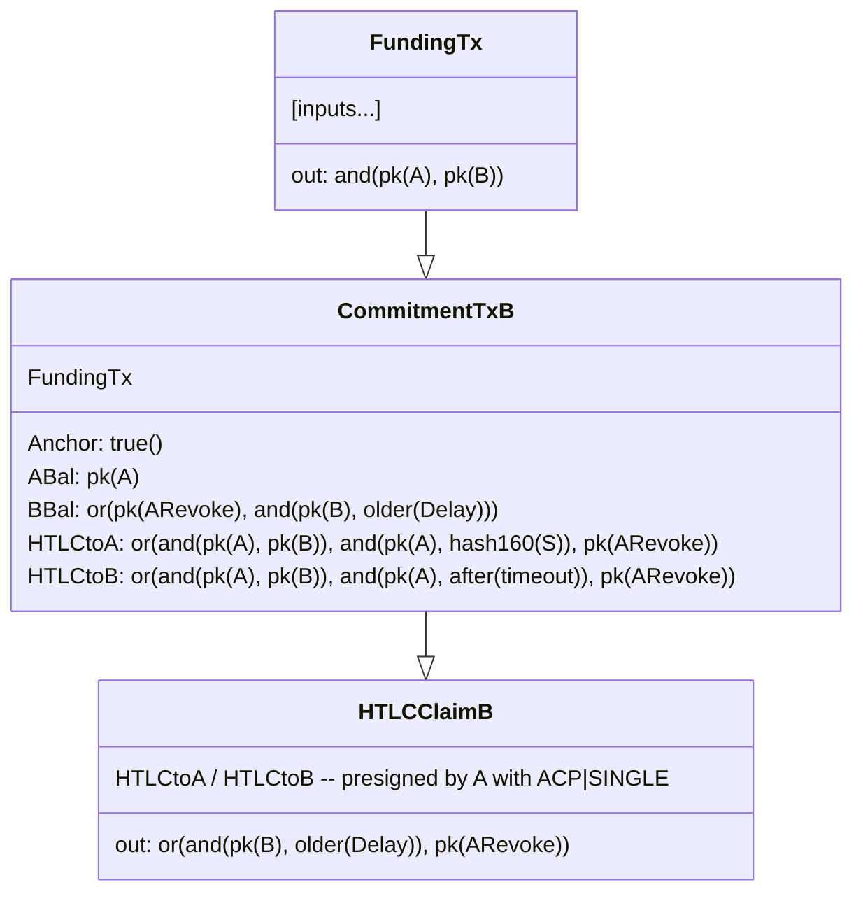
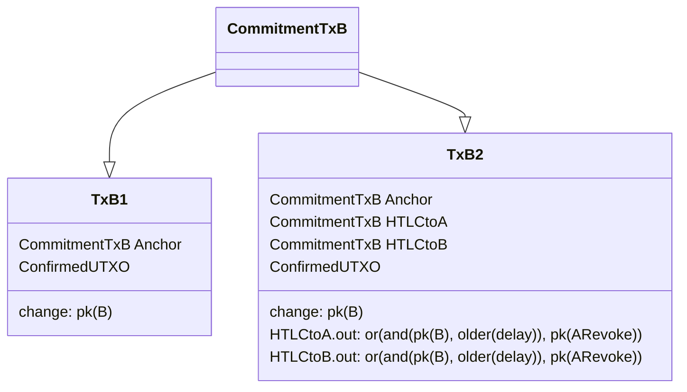
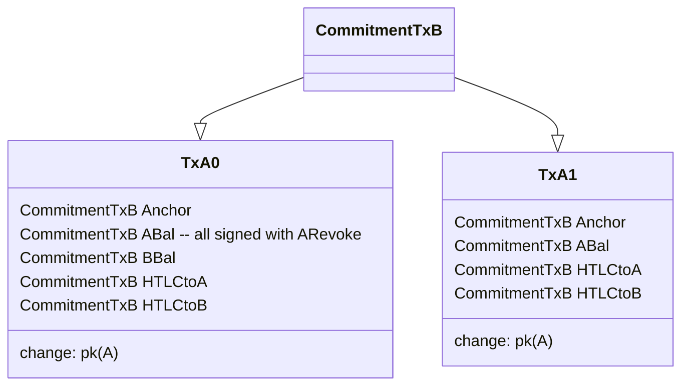

# Lightning transactions with v3 and ephemeral anchors

t-bast | 2024-01-16 17:28:44 UTC | #1

# Lightning transactions with v3 and ephemeral anchors

In this post, I'll detail the changes I believe we should make to lightning transactions to leverage v3 transactions and ephemeral anchors.
See https://delvingbitcoin.org/t/v3-transaction-policy-for-anti-pinning for details on those policy changes at the bitcoin layer.

## Commitment transaction

The commitment transaction represents the current state of a lightning channel's funds, by splitting the funding amount into the various outputs of the commitment transaction.
Whenever a change happens in the channel (HTLCs are added or removed or the feerate changes), a new commitment transaction is signed.
The previous commitment transaction is revoked by revealing a revocation key that allows the other peer to spend every output of that transaction.

It has the following format:

```ascii
+------------+
| funding tx |
+------------+
      |
      |        +-------------------+
      +------->|    commit tx B    |
               +-------------------+
                  |  |  |  |  |  |  
                  |  |  |  |  |  | A's main output
                  |  |  |  |  |  +-----------------> to A after a 1-block relative delay
                  |  |  |  |  |
                  |  |  |  |  |                 +---> to B after a relative delay
                  |  |  |  |  | B's main output |
                  |  |  |  |  +-----------------+
                  |  |  |  |                    |
                  |  |  |  |                    +---> to A immediately with revocation key
                  |  |  |  |
                  |  |  |  |                   +---> to A with its channel funding key
                  |  |  |  | A's anchor output |
                  |  |  |  +-------------------+
                  |  |  |                      |
                  |  |  |                      +---> to anyone after a 16-blocks relative delay
                  |  |  |
                  |  |  |                   +---> to B with its channel funding key
                  |  |  | B's anchor output |
                  |  |  +-------------------+
                  |  |                      |
                  |  |                      +---> to anyone after a 16-blocks relative delay
                  |  |
                  |  |                                              +---> to B after relative delay
                  |  |                        +-----------------+   |
                  |  |                   +--->| HTLC-timeout tx |---+
                  |  | HTLC offered by B |    +-----------------+   |
                  |  +-------------------+      (after timeout)     +---> to A immediately with revocation key
                  |                      |
                  |                      +---> to A with payment preimage after a 1-block relative delay
                  |                      |
                  |                      +---> to A immediately with revocation key
                  |
                  |                                                     +---> to B after relative delay
                  |                            +-----------------+      |
                  |                    +------>| HTLC-success tx |------+
                  | HTLC received by B |       +-----------------+      |
                  +--------------------+     (with payment preimage)    +---> to A immediately with revocation key
                                       |
                                       +---> to A after timeout (absolute delay) and a 1-block relative delay
                                       |
                                       +---> to A immediately with revocation key
```

Some interesting details to highlight are:

- the anchor outputs are the only outputs that don't have a CSV (except when spending a revoked commitment)
- the anchor outputs have a fixed amount (330 sat)

The fees of the commitment transaction are deduced from the channel initiator's main output.
Both peers can agree to update the feerate and thus deduce more (or less) fees from the channel initiator's output.
Note that this creates a strong coupling between the current on-chain fees and the funds that are available to spend off-chain, which is undesirable.

There is another mechanism that increases the fees paid by the commitment transaction: pending trimmed HTLCs.
When HTLCs are added that aren't economical to spend on-chain, we don't create an HTLC-offered or HTLC-received output in the commitment transaction.
The amount of that HTLC is instead simply deduced from the sender's main output, and temporarily allocated to mining fees.
When that HTLC is resolved, its amount is either added back to the sender's main output (if failed) or added to the recipient's main output (if fulfilled).

With v3 and ephemeral anchors, we could make the following changes:

- the commit tx uses v3
- we replace the two anchor outputs by a single ephemeral anchor output
- the amount of the ephemeral anchor output will be the sum of all pending trimmed HTLCs (thus potentially 0 sat)
- we remove the 1-block relative delay on the main outputs and HTLC outputs
- we remove the `update_fee` message (since commitment transactions don't pay fees anymore)

This effectively removes the coupling between the current on-chain fees and the funds available to spend off-chain.
The maximum amounts that can be sent and received on a given channel are now fully deterministic.
We don't need hacks such as the [fee spike buffer](https://github.com/lightning/bolts/pull/740) anymore and similar edge cases disappear.
Channel participants only need to care about on-chain fees whenever they publish a commitment transaction.

Notes and caveats:

- the commitment transaction can only be published as a package, with a child transaction spending the ephemeral anchor
- only packages of 1-parent 1-child will be allowed initially, which prevents batching
- the ephemeral anchor transaction may need additional wallet inputs when broadcasting our local commitment, if the ephemeral anchor value is too low
  - those wallet inputs must be confirmed
- but it doesn't need any wallet input when we detect a revoked commitment or the remote commitment: we can instead use one of the channel's outputs to pay the fees

An interesting thing to note is that if the ephemeral anchor output has an amount that is greater than the current on-chain fees, miners will always have an incentive to claim it all for themselves.
For example Alice may publish a commitment transaction with a 50 000 sats ephemeral anchor, along with a child transaction spending the ephemeral anchor and sending 20 000 sats back to herself.
This package pays 30 000 sats of mining fees. But since the ephemeral anchor can be spent by anyone, miners should replace the child transaction by one that sends the funds to themselves, thus earning 50 000 sats of fees.
This isn't an issue, since this is already the case with lightning today: whenever a commitment transaction with pending trimmed HTLCs is broadcast, those trimmed HTLCs directly go to miners.
Node operators decide what their [maximum dust exposure](https://github.com/lightning/bolts/pull/919) is, and it will constrain the amount of the ephemeral anchor output.

The commitment transaction will then have the following format:

```ascii
+------------+
| funding tx |
+------------+
      |
      |        +-----------------+
      +------->|   commit tx B   |
               +-----------------+
                  |  |  |  |  |  
                  |  |  |  |  | A's main output
                  |  |  |  |  +-----------------> to A
                  |  |  |  |
                  |  |  |  |                 +---> to B after a relative delay
                  |  |  |  | B's main output |
                  |  |  |  +-----------------+
                  |  |  |                    |
                  |  |  |                    +---> to A with revocation key
                  |  |  |
                  |  |  |
                  |  |  | ephemeral anchor output
                  |  |  +-------------------------> to anyone
                  |  |  
                  |  |                                              +---> to B after relative delay
                  |  |                        +-----------------+   |
                  |  |                   +--->| HTLC-timeout tx |---+
                  |  | HTLC offered by B |    +-----------------+   |
                  |  +-------------------+      (after timeout)     +---> to A with revocation key
                  |                      |
                  |                      +---> to A with payment preimage
                  |                      |
                  |                      +---> to A with revocation key
                  |
                  |                                                     +---> to B after relative delay
                  |                            +-----------------+      |
                  |                    +------>| HTLC-success tx |------+
                  | HTLC received by B |       +-----------------+      |
                  +--------------------+     (with payment preimage)    +---> to A with revocation key
                                       |
                                       +---> to A after timeout (absolute delay)
                                       |
                                       +---> to A with revocation key
```

## HTLC transactions

When using `option_anchors_zero_fee_htlc_tx`, HTLC transactions don't pay any mining fees: they are signed with `SIGHASH_SINGLE | SIGHASH_ANYONECANPAY` to allow the broadcaster to add inputs.
We don't need to change this behavior, it will keep working exactly the same after changing the format of the commitment transaction.
I don't think we should change anything for HTLC transactions, but maybe I'm missing an interesting opportunity here?

## Upgrade path

There are various proposals to upgrade channels without closing them:

- https://github.com/lightning/bolts/pull/868
- https://github.com/lightning/bolts/pull/1117

They have nice interactions with [splicing](https://github.com/lightning/bolts/pull/863) (which is a feature that most implementations are already working on).
Depending on the timeline and perceived urgency of upgrading, we may wait for one of these proposals to be finalized into the spec, or create a simpler upgrade path for that specific scenario.

-------------------------

instagibbs | 2024-01-16 18:06:54 UTC | #2

[quote="t-bast, post:1, topic:418"]
we remove the 1-block relative delay on the main outputs and HTLC outputs
[/quote]

Note that this is easily done by having the feature not be `option_anchors`, since that's the prior format for all the output scripts.

The other discussion that came up is that of deployment strategy. There's a bit of a timeline problem:
1) We need to roll out updates to mempool/relay to make the transition to v3 style transactions safe, so LN implementations can adopt it
2) We need LN implementations to update before we can deploy cluster mempool upgrade, since CPFP carveout as it stands is inapplicable to cluster mempool. 

A suggestion on the call was essentially "what if Bitcoin Core implicitly opts commitment transactions that rely on CPFP carveout into a new regime that doesn't rely on the carveout per se"?

This could lead to a revised project roadmap:

1) V3, 2-cluster package rbf, 1p1c relay + mild orphanage churn protection
2) Imbue LN commit txs with two anchors with “implicit signaling” of V3  
  a)  Anything with *two 330-sat outputs*?  
      i) Or get more specific, e.g., one input only, nversion==2, a couple of bytes here or there...  
  b) Allow 1p2c “cpfp carveout”  
    i) “One more” child, same size limitations as normal v3 child tx limit  
    ii) This, along with 2-cluster package RBF, means if you stop spending the remote anchor, you can now efficiently do package rbf against remote tx, and the counter-party cannot pin local commit tx. Child will have to be “small” following V3 rules. Exact implementation TBD  
3) Further rollouts, with no inherent inter-dependencies
  a) Cluster mempool
  b) Further make orphan handling robust
  c) Ephemeral anchors
  d) LN spec update to do 0-fee commit txns
4) ... Remove the 1p2c CPFP carveout

It doesn't interfere with the current work, and removes critical paths from deployment, so I think it's worth considering.

With the revised timeline, we may be able to swap out CPFP carveout without doing any harm, allow implementations to improve their security via limited package rbf, and allow spec updates to happen on their own time for further improvements.

---

# V3 Child tx size

We would also like feedback on what the maximal V3 child size should be. It's an inherent tradeoff between practical CPFP tx sizes and potential pin vectors, so it'd be nice to know what expectations are around that from any wallet project.

-------------------------

MattCorallo | 2024-01-16 22:55:57 UTC | #3

[quote="instagibbs, post:2, topic:418"]
We would also like feedback on what the maximal V3 child size should be. It’s an inherent tradeoff between practical CPFP tx sizes and potential pin vectors, so it’d be nice to know what expectations are around that from any wallet project.
[/quote]

Honestly, this doesn't really seem lightning-specific at all. In fact, for many nodes this is entirely a function of Bitcoin Core's wallet. What we *will* want from Bitcoin Core (and other wallet libraries) is the ability to restrict coin selection to, at max, some total input weight.

-------------------------

t-bast | 2024-01-17 09:58:32 UTC | #4

[quote="instagibbs, post:2, topic:418"]
2. Imbue LN commit txs with two anchors with “implicit signaling” of V3
a) Anything with *two 330-sat outputs*?
[/quote]

Why can't you pattern match to apply the v3 rules *when an anchor output is spent* instead of trying to pattern match when seeing the commit tx alone?
This way you can explicitly match on the very specific anchor output script when it spends a 330 sat output:

`<some_public_key> OP_CHECKSIG OP_IFDUP OP_NOTIF OP_16 OP_CSV OP_ENDIF`

Since every other output has a CSV-1, the commit tx can only be spent through one of the anchors, so that should work easily, unless I'm missing something?

The only drawback I'm seeing with that pattern-matching option is that LN implementations that currently do batching (spend multiple anchor outputs of unrelated channels in a single transaction) would have their anchor spend rejected by upgraded nodes, right? So LN implementations should first disable that batching code to avoid being negatively impacted, but apart from that I'm not seeing any drawback to this implicit v3 rules application.

One thing to note is that this kind of batching is inherently dangerous, so I don't mind that restriction (and haven't implemented it in eclair because of those security drawbacks), but I believe lnd does it so maybe @roasbeef would be opposed to that?

[quote="instagibbs, post:2, topic:418"]
We would also like feedback on what the maximal V3 child size should be. It’s an inherent tradeoff between practical CPFP tx sizes and potential pin vectors, so it’d be nice to know what expectations are around that from any wallet project.
[/quote]

This is really hard to say, because it is very tightly correlated with the maximum size of the commitment transactions we allow. When allowing 483 HTLCs in both direction, we may need to pay a very large fee even at low feerate, thus requiring big-ish wallet inputs or multiple wallet inputs. However, with more restrictions on the commit tx size (such as eclair only allowing 30 HTLCs in both directions), the amounts are much lower and easier to satisfy with few inputs.

Lightning nodes need to maintain a "healthy" utxo pool anyway to minimize their operational costs, so I guess this is just another parameter to take into account in the utxo pool management, so we should rather just pick "reasonable" values to the maximum v3 child size (and the current bikeshed values seem "reasonable" to me) and it's the job of the lightning implementation to make sure they have a wallet state that fits with that.

-------------------------

glozow | 2024-01-17 11:20:38 UTC | #5

(post deleted by author)

-------------------------

glozow | 2024-01-17 11:23:16 UTC | #6

(Sorry, I posted this earlier but had clicked reply to the wrong post)

[quote="instagibbs, post:2, topic:418"]
Imbue LN commit txs with two anchors with “implicit signaling” of V3 a) Anything with *two 330-sat outputs*?
[/quote]

[quote="t-bast, post:4, topic:418"]
Why can’t you pattern match to apply the v3 rules *when an anchor output is spent* instead of trying to pattern match when seeing the commit tx alone?
[/quote]

I suppose both are doable, though the question for me is less "how can we identify a (LN) anchor spend?" and more "how can we identify users of CPFP carve out?"  At the end of the day we're trying to continue supporting CPFP carve out as long as possible, for applications that don't explicitly set nVersion=3 right?

My view is that have 2 anchors => need CPFP carve out, so I think checking 2x330 might be cleaner. If there is a non-negligible false positive rate though, we'd probably want to template-match something stricter.

-------------------------

instagibbs | 2024-01-17 12:44:11 UTC | #7

[quote="glozow, post:6, topic:418"]
I suppose both are doable, though the question for me is less “how can we identify a (LN) anchor spend?”
[/quote]

having to do multiple types of script introspection(segwitv0 and tapscript) is also something I'd like to avoid if possible

-------------------------

t-bast | 2024-01-17 13:33:00 UTC | #8

[quote="glozow, post:6, topic:418"]
I suppose both are doable, though the question for me is less “how can we identify a (LN) anchor spend?” and more “how can we identify users of CPFP carve out?” At the end of the day we’re trying to continue supporting CPFP carve out as long as possible, for applications that don’t explicitly set nVersion=3 right?
[/quote]

I misunderstood then, I thought it wouldn't be possible to keep supporting the CPFP carve-out logic alongside cluster mempool code. That's why I thought the only option was to implicitly enroll the only users of CPFP carve-out (lightning commitment txs containing two anchor outputs) to the v3 policies to replace CPFP carve-out entirely.

-------------------------

glozow | 2024-01-17 13:54:52 UTC | #9

No you understood correctly! That's my poor choice of words, apologies. What I meant by "continue supporting CPFP carve out" was exactly what you said, implicitly enroll the CPFP carve out users to this v3 + extra child (1 parent 2 children) policy.

-------------------------

t-bast | 2024-01-17 14:11:04 UTC | #10

Thanks, then it all makes sense! From my point of view it's an ACK as eclair's usage of the anchor outputs would be compatible with this, but we'd need feedback from the other implementations to check whether they're ok with the additional restrictions it creates compared to today's usage of anchor CPFP:

- cannot use batching to spend multiple anchor outputs at once anymore
- cannot use the change output of an unconfirmed anchor tx to fund another transaction
- cannot use unconfirmed inputs for the anchor tx
- am I missing something else?

-------------------------

murch | 2024-01-17 14:34:16 UTC | #11

> What we *will* want from Bitcoin Core (and other wallet libraries) is the ability to restrict coin selection to, at max, some total input weight.

We are basically 90% there. Our coin selection algorithms already take a `max_weight` parameter for us to be able to avoid exceeding the standardness limit for weight. Passing something through the transaction building RPCs should be fairly easy. CoinGrinder would be a big help though, since SRD only greedily searches for a solution below the weight limit by removing the lowest effective value input when it is overweight. BnB and CG should always find a solution if it exists.

Of course, CoinGrinder has been open since July and has seen only a modicum of review so far, so a few more people would have to take a look at it.

-------------------------

morehouse | 2024-01-17 22:45:18 UTC | #12

[quote="t-bast, post:1, topic:418"]
## HTLC transactions

When using `option_anchors_zero_fee_htlc_tx`, HTLC transactions don’t pay any mining fees: they are signed with `SIGHASH_SINGLE | SIGHASH_ANYONECANPAY` to allow the broadcaster to add inputs. We don’t need to change this behavior, it will keep working exactly the same after changing the format of the commitment transaction. I don’t think we should change anything for HTLC transactions, but maybe I’m missing an interesting opportunity here?
[/quote]

At a minimum, we probably want to make HTLC transactions v3.  If we really want to fix pinning, we may also need to make *all* HTLC spending paths use presigned v3 transactions.

#### Why make HTLC transactions v3?
- v3 allows them to be relayed as part of the commitment package.
- I think v3 also prevents MitM pinning attacks where someone extracts the `SIGHASH_SINGLE | SIGHASH_ANYONECANPAY` signature and uses it to construct and pin a low feerate conflicting transaction.

#### Fixing HTLC pinning

With no other changes, HTLC transactions are still vulnerable to pinning attacks since the remote path can be spent by non-v3 transactions.  For example:

1. Alice offers HTLC1 to Mallory, which times out at block T.  Alice also offers HTLC2 to Mallory, which times out at block T+5.
1. Mallory has preimages for both HTLCs, but she withholds them.
1. At block T-1, Alice broadcasts her commitment with a single child transaction that spends the ephemeral anchor, Alice's local balance, and HTLC1 via the presigned HTLC-timeout transaction.
    - Mallory is unable to pin any competing transaction in this case, due to v3 policy.
1. The commitment and child transaction confirm in block T.
1. At block T+4, Alice broadcasts her HTLC-timeout transaction claiming HTLC2.  At the same time, Mallory broadcasts a low feerate preimage spend of HTLC2 and pins it in mempools.  With good connectivity and timing, Mallory can partition mempools such that Alice's mempool contains the HTLC-timeout and all other mempools contain the pinned preimage spend.

Because Mallory's preimage spend can opt out of v3 policy, she is able to pin her transaction in mempools while preventing Alice from learning the preimage or confirming her HTLC-timeout transaction.

One way to fix this pinning vector is to start requiring presigned v3 transactions for HTLC remote spends.

-------------------------

instagibbs | 2024-01-17 23:13:02 UTC | #13

[quote="morehouse, post:12, topic:418"]
At a minimum, we probably want to make HTLC transactions v3. If we really want to fix pinning, we may also need to make *all* HTLC spending paths use presigned v3 transactions.
[/quote]

Huh! I hadn't considered the fact that *revoked* states would allow *HLTC-Timeout paths* to create pins. Another symptom of layered transactions if I'm thinking about this right. So I think you're right, not only would you need to lock down HTLC-Success paths, as I'd thought and previously proposed, but you'll also need to pre-sign HTLC-Timeout paths.

v3 alone probably isn't enough, as adversary can use the ANYONECANPAY-nature of owned-by-remote HTLC-Success paths to inflate their data to generate a pin. Switching to v3+epehemeral anchor would mitigate the pin, at the cost of extra vb in benign cases :frowning:  

Aside: If LN commit txns weren't layered, this becomes slightly easier, as we only have to lock down the HLTC-Success paths since the contesting period wouldn't be exposing HTLC outputs directly.

-------------------------

ajtowns | 2024-01-18 05:02:14 UTC | #14

Mermaid diagram with miniscript for @t-bast's proposed commitment transaction format for whatever it's worth:



If `CommitmentTxB` is v3, then the fact that it has an ephemeral anchor output would mean that that output has to be spent concurrently for the tx to be relayed, so Bob might broadcast `Tx1` just to get `CommitmentTxB` funded, or might post `Tx2` to also lock in some of the HTLCs that have either expired or that he knows the preimage for.



Alternatively, A might decide B's txs don't pay enough fees and decide to get things confirmed earlier, either by posting her own `CommitmentTxA` (conflicting with `CommitmentTxB`) in much the same way, or by creating her own spends of `CommitmentTxB` (conflicting with `TxB1` or `TxB2`):



In either case, she probably doesn't need to use any confirmed funds, as she can pay the on-chain fees directly from her channel balance immediately.

-------------------------

ajtowns | 2024-01-18 05:12:05 UTC | #15

[quote="instagibbs, post:13, topic:418"]
Huh! I hadn’t considered the fact that *revoked* states would allow *HLTC-Timeout paths* to create pins.
[/quote]

One option might be to have two versions of the `HTLCClaimB` txs:

 * one signed with ACP|SINGLE, but with nSequence = delay so that the honest party can claim revoked outputs
 * one signed with SIGHASH_ALL and no delay, which creates an ephemeral anchor output and prevents pinning

Doubles the number of HTLC signatures you need to do, though, which sucks.

-------------------------

