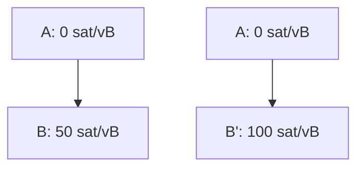
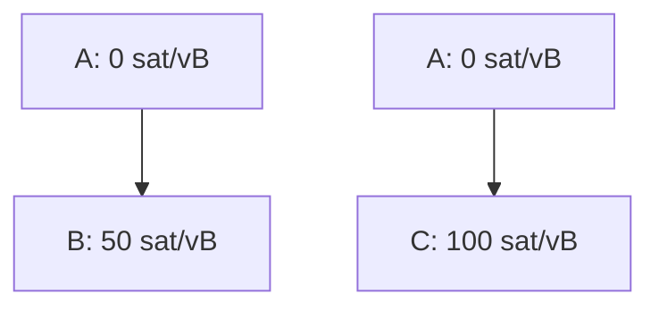

# Sibling Eviction for v3 transactions

glozow | 2024-01-25 09:43:22 UTC | #1

When we receive a transaction that would bust a mempool transaction's descendant limits, we usually reject it (unless it is eligible for CPFP carve out).

An alternative approach (e.g. when this transaction is very high feerate and it'd be a shame to let it go) is to consider evicting the least incentive compatible descendant in favor of this new transaction. That way we don't compromise on our anti-DoS-motivated descendant limit (like we do with CPFP carve out), but don't need to be stuck with the one we received earlier.

Let's define **sibling eviction** as triggering the eviction of a _non-conflicting_ descendant of your ancestor based on incentive compatibility. It is similar to RBF, but an important distinction is that you don't spend conflicting inputs.

Ephemeral Anchors emulates sibling eviction by having a "must spend" anchor to basically force all children to conflict with each other (general idea credit to instagibbs who suggested this at that LN meeting in 2022).

A few concerns then were:
(1) This is full-rbf-y (what if the sibling didn't signal RBF? What if wallets aren't expecting any possible replacements?)
(2) It's very complex to choose which descendant(s) to evict. There are many possible combinations especially if the problem is that we hit the descendant vsize limit. This transaction might also have multiple ancestors. Short of cluster mempool / feerate diagram tools, this problem seemed intractable.
(3) Is this incentive compatible?

Problems (1) and (2) are easy to fix with v3. V3 transactions all signal replaceability, so the "full-rbf-iness" shouldn't be a concern. And (2) is trivial in v3, since there is only 1 possible descendant and this child cannot have multiple ancestors (credit to sdaftuar for pointing this out to me, leading me to try to implement it).

One way of looking at (3) is that if we had just received these two descendants in the opposite order, we would have kept the other one. With the framework that our descendant limit is the maximum we can handle before we have DoS and pinning problems, we should just be trying to get the most incentive compatible set of transactions that fits in that limit.

An implementation: https://github.com/bitcoin/bitcoin/pull/29306

We apply the RBF rules to these sibling evictions, not just because we get to reuse all the code, but because there are similar requirements wrt incentive compatibility increase and limiting the bandwidth/validation cost. For example, we don't want to allow 2 siblings to evict each other over and over again with 1 additional sat each time.

### Benefits:

(1) We can easily do the imbued v3 logic for existing LN commitment transactions, even though they have 2 anchors.

There was a [suggestion](https://delvingbitcoin.org/t/lightning-transactions-with-v3-and-ephemeral-anchors/418/2?u=glozow) to pattern-match LN commitment transactions and automatically enroll them under the v3 policy rules if it takes a while for LN to switch to using v3.

One obstacle is the fact that, currently, commitment transactions have two anchors, while v3 only supports a 1-parent-1-child topology. What about implementations that try to bump remote transactions in mempool? Even if everyone stops doing that, what if your remote broadcasts and spends your tx with a low-feerate child (thus blocking you from bumping yours)?

With sibling eviction, local and remote's CPFPs (each no more than 1000vB) can evict each other. We wouldn't need to roll a new 1p2c or v3+carveout topology.

(2) It makes v3 work nicely for transactions shared between n>2 parties who might want to CPFP without a dedicated anchor. Imagine e.g. a v3 coinjoin - if somebody wants to CPFP, they can do so using their output, evicting somebody else's child if they lowballed their bump.

-------------------------

morehouse | 2024-01-24 17:07:42 UTC | #2

Doesn't 1p1c package relay and package RBF also give us sibling eviction (i.e. a 1p1c package can replace another that has the same parent transaction in the package)?

To fix pinning in LN we still need package RBF, and to make 0-fee commitments we still need package relay.  So I'm not sure sibling eviction alone gives us much besides a temporary alternative to CPFP carve-out.

-------------------------

ajtowns | 2024-01-25 09:14:54 UTC | #3

I think we're using "sibling eviction" to refer to evicting a non-conflicting tx that spends a different output from a common parent. (I guess it would be cousin eviction if it was a non-conflicting tx that shares an ancestor, or was in the same cluster?)

RBF without sibling eviction will only replace txs when there's a conflict; if there's no conflict but other rules are broken (too many ancestors/descendants, too many txs in the cluster), then RBF without sibling eviction would just fail, no matter how much higher the fee was. At least, that's how I understand the terminology?

-------------------------

glozow | 2024-01-25 09:45:32 UTC | #4

To clarify, this would be in addition to package RBF and 1p1c package relay.
[quote="ajtowns, post:3, topic:472"]
I think we’re using “sibling eviction” to refer to evicting a non-conflicting tx that spends a different output from a common parent.
[/quote]

Exactly. We're "replacing" our sibling even though we don't actually spend the same input / have a conflict with them.

[quote="ajtowns, post:3, topic:472"]
(I guess it would be cousin eviction if it was a non-conflicting tx that shares an ancestor, or was in the same cluster?)
[/quote]

Right, in v3, there's only siblings (direct child of a direct parent). We've also talked about this for more complex topologies, where you can evict some descendant of your ancestor (I'm hesitant to use family relationship terms as it starts getting a bit Game of Thronesy...)

(I've edited the original post now to include a clearer definition, thanks).

Going back to the "imbuing existing LN commitment transactions with v3 while they aren't actually v3" idea, we want to make it so that if your remote broadcasts one of the following:
* (1r) their commit + child of their anchor
* (2r) your commit + child of their anchor

You are always able to CPFP by broadcasting:
* (1l) your commit + child of your anchor 
* (2l) child of their anchor
* subsequent child RBF if you want to raise the fee again

So regardless of what happens, you are always able to bump:
* (1l) can replace (1r) via package RBF
* (1l) can replace the (2r) child via sibling eviction
* (2l) can replace (1r) child via sibling eviction.

And mempools will keep the 1-parent-1-child topology instead of needing to deal with 2 children (breaks package RBF which currently is based on 1p1c).

-------------------------

morehouse | 2024-01-25 16:05:57 UTC | #5

[quote="glozow, post:4, topic:472"]
So regardless of what happens, you are always able to bump:

* (1l) can replace (1r) via package RBF
* (1l) can replace the (2r) child via sibling eviction
* (2l) can replace (1r) child via sibling eviction.
[/quote]

Let's see if I understand correctly...  With only 1p1c package relay and package RBF, the following v3 package replacement works:

And this v3 package replacement works:

But this v3 package replacement doesn't?:

In that case, I say yes we definitely want sibling eviction, since that's the most intuitive behavior.  Package RBF should mean that the `A-C` package can replace the `A-B` package if `A-C` has better fees.  Intuitively, it shouldn't matter whether `A` is already in the mempool or not; the entire v3 package should be considered for RBF.

-------------------------

instagibbs | 2024-01-25 16:18:52 UTC | #6

[quote="morehouse, post:5, topic:472"]
In that case, I say yes we definitely want sibling eviction, since that’s the most intuitive behavior.
[/quote]

Yes, your understanding is correct. This was part of my original intent behind ephemeral anchors, as the requirement to spend it means implicit sibling eviction. This is splitting up the feature basically.

-------------------------

t-bast | 2024-01-25 16:47:34 UTC | #7

If I'm understanding this correctly, I'd say that yes, this is very desirable and should be simple enough to add for v3 transactions, since the v3 rules make it easy to evaluate which sibling is the best one to keep.

I don't think this would change what we plan to do for lightning commitment transactions though, it is still better to use a single ephemeral anchor (which makes the commitment transaction slightly smaller) than use two of them? 

Or is the goal to get rid entirely of the ephemeral anchor (and rely on other outputs of the commitment transaction to do CPFP)? That could be interesting, but I'd need to make sure that this works safely in all cases...

-------------------------

instagibbs | 2024-01-25 17:03:34 UTC | #8

I have no plans on dropping ephemeral anchor work. 0-satoshi outputs have a number of important use cases outside of LN.

> I don’t think this would change what we plan to do for lightning commitment transactions though, it is still better to use a single ephemeral anchor (which makes the commitment transaction slightly smaller) than use two of them?

You could use a single shared-key(slightly larger) at 330 sats.

General sibling eviction would also allow an anchor to be completely removed, in certain scenarios where balance outputs are completely unencumbered(and no HTLCs exist?).

You'd need an anchor in many situations however.

-------------------------

morehouse | 2024-01-25 18:02:11 UTC | #9

[quote="instagibbs, post:8, topic:472"]
You could use a single shared-key(slightly larger) at 330 sats.
[/quote]

This, along with package relay/RBF and sibling eviction, would be enough for LN to greatly simplify commitment transactions.  If ephemeral anchors existed we would probably use them for fee efficiency, but they wouldn't be required anymore.

-------------------------

ariard | 2024-02-26 02:25:21 UTC | #10

see my comment in https://github.com/bitcoin/bitcoin/pull/29306, especially the linked test.
no need for sibling eviction.
occam’s razor.

-------------------------

