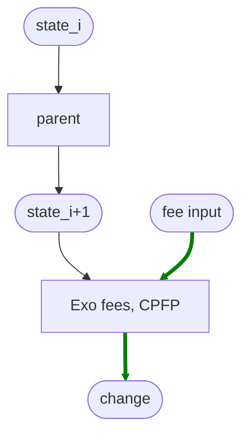

# Taxonomy of Transaction Fees in Smart Contracts

instagibbs | 2024-02-01 16:52:08 UTC | #1

We're going to take a look through many of the common
fee tropes that wallets and smart contracts use and hopefully
figure out a more common language in how we discuss these
rather than just "CPFP vs RBF". For mempool design, this
is important as we should be looking to support what users
are attempting to make, where reasonable, to avoid out-of-band fee solutions.
This becomes even
more important as people discuss the design characteristics
of covenants proposals, and their potential Bitcoin-scaling
benefits.

For this post, "smart contracts" can also simply
be understood as logical transactions: people
want some state change effectuated, and they
may make otherwise-unrelated logical transactions
to pay fees for them.

In the below diagrams, green
arrows indicate where fees are "coming from".

# Endogenous fees, single transaction RBF

These bring fees from "inside" the logical transaction
which also happens to be a single Bitcoin transaction.

This is the most basic setup, and includes things like
simple wallet sends, up to non-anchor ln-penalty channels.
They are "maximally" compact in that fee-sizing aside,
the transaction itself is quite compact.

# Exogenous fees, single transaction RBF

These bring fees from outside the smart contract, but contain
it within a single Bitcoin transaction.

Typically seen with `SIGHASH_SINGLE | ANYONCANPAY` arrangements.

Examples in LN spec HTLC presigned transactions,
ln-symmetry "update" transactions, Murcery Wallet's
statechains, degen NFT trades, and likely more.

Keeping it within a single transaction saves a bit
of overhead vs other strategies, but requires additional
inputs and possibly an output to be added.

Without additional mitigations it can 

Both single-transaction RBF types benefit
from simplicity of the RBF case in today's
mempool and relay policies.

# Endogenous fees, CPFP

Fees are brought from within the parent
transaction, with no requirements to
resolve a conflict from the parent's
input set.

This is most applicable to when the parent
transaction is not under the control of the
user making the CPFP, or when replacing
it would be too expensive, disallowing RBF.

A common use-case would be users receiving
a transaction from someone and the sender
unwilling or unable to increase the fee
themselves. ln-symmetry settlement
transactions have all outputs freely spendable,
also allowing endogenous spends. 
Another would be fee bumping
an LN remote transaction using your own
balance output in pre-anchor channels.

# Exogenous fees, CPFP

Same use-cases as above, but perhaps
some outputs in the smart contract
are unable to be spent due to locktimes
or other factors.

We see this pattern in today's LN anchor channels
which requires all fees to be exogenous to avoid
pinning scenarios.

# Endogenous fees, Package RBF

"Package RBF" is a term to describe the combination
of CPFP and package RBF, where the child is paying
for the parent's conflict.

If the smart contract's outputs are otherwise
unencumbered, fees can be paid for endogenously.

Currently this is unavailable to Bitcoin's
various mempool implementations as this requires
evaluation of entire packages, but users of this
would be LN for commitment transactions plus
fee paying child if outputs became otherwise
unencumbered by a one block relative timelock.

# Exogenous fees, Package RBF

Today's LN anchor channels is the primary example.

# Composeable Transaction Structures

Not all smart contract paradigms use the parent and child scheme.

For example, there are a number of schemes involving either pre-signed or
CTV-encumbered transaction trees. 

These transaction trees will end up fitting in these above
buckets in different ways, depending on tradeoffs like usual:

1. Are we able to relay and get package evaluation for the final package?
1. Are the ultimate ("virtual")UTXOs immediately spendable, allowing endogenous fees?
1. Do we need [sibling eviction](https://delvingbitcoin.org/t/sibling-eviction-for-v3-transactions/472/9) to avoid cluster limits? How would it need to differ from v3-style sibling eviction? 

Composing these ideas, you could imagine a Timeout Tree where the leaf nodes use
Endogenous, single transaction RBF-compatible channels, and if users want to go to
chain, it composes to endogenous fees paying for the CPFP, and exercising package
RBF if sibling eviction becomes required or any ancestor input in the chain was conflicted. This unilateral exit could also be used to pay for a separate exogenously-fee-settled smart contract that has failed.

-------------------------

rustyrussell | 2024-02-01 21:06:42 UTC | #2

 As fees rise, compactness will override all other concerns. (Including security!)

This implies that we'll will use endogenous fees where possible, and single transaction which stacks as many otherwise-unrelated operations, with a single exogenous fee in/out.

We should be designing for this reality, when considering covenant constructions.

-------------------------

ajtowns | 2024-02-02 04:23:23 UTC | #3

[quote="rustyrussell, post:2, topic:512"]
As fees rise, compactness will override all other concerns. (Including security!)
[/quote]

That seems unsound? "I want to save money, therefore I'll make it easy for someone to steal all my money" If you really want to save on fees, and don't mind security risks, you don't go on-chain at all, you use a centralised database, or a more-centralised blockchain than bitcoin.

The risk that makes sense to me here is the one to decentralisation: you're still going onchain, you're still keeping your funds secured, but you're paying fees out of band to the largest miners via a trusted relationship, ignoring the downside that, at scale, this makes smaller miners less profitable, and perhaps unsustainable.

(We've got evidence that people will abandon security when trying to claim BRC20 mints and the like, but that's a lottery in the first place: if your tx isn't amongst the first N to claim, you're throwing your money away anyway)

I don't think the decentralisation risk is avoidable though.

Consider the case where an LSP wants to unilaterally close a channel: then they will need to get a commitment tx on chain, but in a high/variable fee environment cannot rely on the commitment tx to have precommitted sufficient fee payment (for ln-symmetry/eltoo channels, they may not be able to precommit to any fee payment), and because it's a unilateral close, can't immediately claim any of their own channel balance to use that for fees.

One approach is to do what we do now: pull in fees from an existing utxo, and add a change address. That can be done via an anchor output and CPFP, or by the commitment tx only being signed with SINGLE|ANYONECANPAY, or by pre-preparing a utxo with the exact fee and an ALL|ANYONECANPAY signature.

But a large LSP that has their own mining operation has another option: they can just prioritise the tx directly, even if it has 0 fee. When that is mined, as a miner they'll be forgoing fees so it's not free, but that's still cheaper: they're only forgoing X vbytes worth of fees from the bottom of the block, where X is the size of the commitment without any additional fee inputs/change outputs, rather than paying X+Y bytes worth of fees at the top/middle of the block, where Y is the size of the additional fee inputs and change outputs (and any overhead).

[quote="rustyrussell, post:2, topic:512"]
This implies that we’ll will use endogenous fees where possible, and single transaction which stacks as many otherwise-unrelated operations, with a single exogenous fee in/out.
[/quote]

In this scenario, the "single exogenous fee" doesn't make it onchain at all (it's an internal transfer from the LSP part of the business to the mining part of the business), but presumably all the LSP's txs are still combined together into a single 0-fee tx at the start of the block.

Adding introspection logic isn't needed for that setup, and would itself be unnecessary overhead.

-------------------------

oohrah | 2024-02-02 04:49:06 UTC | #4

[quote="ajtowns, post:3, topic:512"]
That seems unsound? “I want to save money, therefore I’ll make it easy for someone to steal all my money” If you really want to save on fees, and don’t mind security risks, you don’t go on-chain at all, you use a centralised database, or a more-centralised blockchain than bitcoin.

The risk that makes sense to me here is the one to decentralisation: you’re still going onchain, you’re still keeping your funds secured, but you’re paying fees out of band to the largest miners via a trusted relationship, ignoring the downside that, at scale, this makes smaller miners less profitable, and perhaps unsustainable.
[/quote]

With V3 txns and things like it wouldn't LSPs and others just pay miners out-of-band to mine the tx and let the anchor output just go unspent? Doesn't seem like a trusted relationship to me because you can fall back to the expensive V3 mechanism. I wouldn't expect them to care about the UTXO set being polluted with anchors.

[quote="ajtowns, post:3, topic:512"]
But a large LSP that has their own mining operation has another option
[/quote]

Why would they need a mining operation rather than use an accelerator like mempool.space/ViaBTC/Binance/etc?

-------------------------

