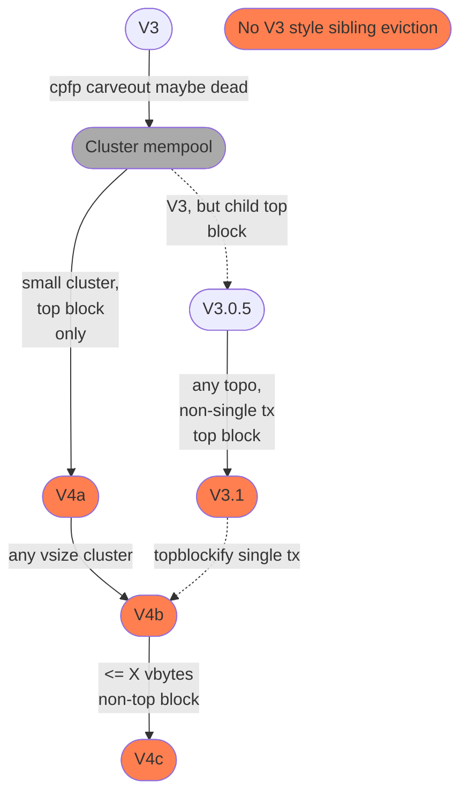

# V3 and some possible futures

instagibbs | 2024-02-06 18:11:07 UTC | #1

[V3 transactions](https://delvingbitcoin.org/t/v3-transaction-policy-for-anti-pinning/340/) were an answer to pinning that predates the practical idea of a totally ordered mempool.
Being unable to answer simple questions about allowable transactional topologies on the local
mempool makes reasoning about safety of simple operations like transaction entry impossible.
By restricting topologies of these kinds of transactions, it made it easier to reason about.
In a [post-cluster mempool world](https://delvingbitcoin.org/t/an-overview-of-the-cluster-mempool-proposal/393), with our ability to reason about things, it is worth a re-examination.

As a semi-sequel to [priority transactions](https://delvingbitcoin.org/t/opt-in-transaction-policies-for-anti-pinning/159/3), this post explores possibilities for v3 and v3-like policies in a post-cluster mempool world. It tries to answer questions:

- How much can we remove the topology restrictions? Given the general resistance of people to concept ACK a specific transaction topology like V3, I was thinking it would be useful to think ahead and see what policy relaxations or restrictions we could enact in the future to make things more flexible, incentive compatible, and overall more useful, in a backwards compatible manner.
- What other rules can we add to express the intention of v3? If we think of this as a way for smart contracts to opt in to a set of policies where “I’m only going to {add, replace} transactions if it’s a fee-bump,” can we implement rules that are closer to that?
- After cluster mempool, how useful is v3? Will we regret having deployed v3 and its features, seeing it as a future maintenence burden?

**TL;DR: V3 is useful and likely upgradeable to something more post-cluster mempool world in a backwards compatible way.**

# Definitions

“**top block**” refers to whatever level we want. Using a cluster mempool we can check properties of incoming transactions such as: “chunk would enter the first or second block even if we estimate 10 minutes of additional inflow”, or whatever statistical massaging we want to reduce pins, while not unduly impeding the ability for miners to have a backlog of transactions from which to mine in the short term.

“**goldfinger++**” is the concept where an adversary either knows transactional load is incoming or induces a transaction load in the mempool, such that all the top-block-using transactions become buried on each other, and may be unable to reorder effectively due to incremental fee pinning induced by the attacker. Goldfinger attacks are not a new concept, and outside the scope of mempools to solve. The “++” is to indicate the additional pin vector which allows the attacker to possibly choose the order of the defenders' time-sensitive transactions in the mempool, which may allow additional value extraction on top of a classical goldfinger attack where the defenders are at least able to reorder transactions respectful to the total funds at risk. I have no data or simulations on how much worse this is, but it's worth noting as a possibility.

# Ideas

All deployment ideas below are suggested paths that could be taken,
with their benefits and drawbacks hopegully enumerated.

*The future labels and version numbers came to me in a dream.*

## V3

1. One parent, up to one <=1kvB child.

Pros:
- Trivially optimal [sibling eviction](https://delvingbitcoin.org/t/sibling-eviction-for-v3-transactions/472) due to reduced topology
- It's coded. Relatively simple. Doesn't require cluster mempool.
- Reduces max pinning ~100x, and package limit pinning for this topology.
- Requires fewer relay changes to fully use, like 1-parent-1-child(1p1c) relay

Cons:
- Not clearly incentive compatible: If we're asking wallets to make structural
 changes beyond flipping a bit, is that too much?
- 1kvB is a guess on what size is required for a CPFP, so it leaves pinning potential
  along with the potential that it's not even big enough for larger value bumps.
- Does not support batched CPFP.
- Does not fix ANYONCANPAY usage and other useful single tx RBF fee cases.
- Does not support chains of larger than two, such as 0-conf channel funding chains,
    or chains from presigned/CTV trees, two CPFPs of an anchor, etc.

As we can see, V3 leaves a lot to be desired, but can be done today
with known pinning bounds.
  
## V3.0.5

1. Deploy V3.
2. Deploy Cluster Mempool.
3. Require "top block" for V3 *child* (parent can still just hit minfee)
4. Relax child size

Pros:
- Small leap from V3
- Allows wallets to not always shoot for top block, unless they need a CPFP
- Less/no more guesswork on CPFP size
- Maintains trivial [sibling eviction](https://delvingbitcoin.org/t/sibling-eviction-for-v3-transactions/472/9)

Cons:
- Same topologically based cons as V3.
- Additional size may allow for additional "goldfinger attack++" damage.

This is both a tightening and relaxation of policy, which is arguably
more incentive compatible, and blunts a lot of pinning attacks. Single
transactions are allowed to relay at any feerate about minfee.

## V3.1

1. Deploy V3.
2. Deploy Cluster Mempool.
3. Require "top block" for any cluster size of 2 or more

Pros:
- Relaxed topology allows anything normally representable, allowing
  for easier migration for wallet systems, provided they can be
  aggressive about fees when making size 2+ clusters.
- Multi-tx pin-resistant constructs possible.
- Still allows for less-fee-aggressive size 1 clusters that can be later
  bumped or batched in more fee-aggressive way in less adversarial settings.
- If the parent is 0-fee(and SIGHASH_ALL), it's relatively pin
  resistant since getting CPFP into mempool
  requires top-block. Smart contracts can do less introspection of
  other people's scripts.

Cons:
- Need to rethink [V3 sibling eviction](https://delvingbitcoin.org/t/an-overview-of-the-cluster-mempool-proposal/393/8). With top block do we need it?
- Both [endogenous and exogenous fee single transaction RBF](https://delvingbitcoin.org/t/taxonomy-of-transaction-fees-in-smart-contracts/512#endogenous-fees-single-transaction-rbf-1) transactions are not pin
  resistant in general. Parent contract can be inflated with 0-fee
  junk then put into the mempool just above minfee. 

## V4(a)

- To enter mempool the tx must be entering "top block".
- Cluster can only be <= X kvB

Pros:
- No topological restrictions, aside from lower bound in vbytes.
  - ANYONECANPAY support. [Endogenous and exogenous single tx RBF are pin resistant.](https://delvingbitcoin.org/t/taxonomy-of-transaction-fees-in-smart-contracts/512#endogenous-fees-single-transaction-rbf-1)
- Maybe less pinning potential from golfinger++ and fee spikes than default cluster size
- Limit could be expanded later with more research/reasoning (i.e. V4(b))

Cons:
- Need to rethink V3 sibling eviction.  With top block do we need it?
- Limited vsize makes it cheaper to hit cluster size limits. Might want to think more about this.
- Size restriction may stop usage like LN commitment tx, ln-symmetry settlement tx, unless
  HTLC number restricted (though it looks like 10kvB would support almost 230 HTLCs...)
- "normal" transactions won't propagate unless they're top block.
  - It might not be useful enough to get widespread usage from non-time
sensitive usecases? 

## V4(b)

- To enter mempool the tx must be entering "top block".

Pros:
- Same as V4(a)
- Not much to bikeshed about.
- Easy to reason about under same cluster limits as mempool default.

Cons:
- "normal" transactions won't propagate unless they're top block.
  - It might not be useful enough to get widespread usage from non-time
sensitive usecases? 

## V4(c)

Can we somehow unify the benefits of V3.1 and V4?

- V4(b), with two possible relaxations:
  - if single tx and <= X vbytes, allow non-top block, or
  - if chunk being added is <= X vbytes out of top block, allow

You can imagine X being something quite small, since rather than
disallowing the transaction entirely, breaching the limit "merely"
requires the transaction to pay much more aggressive fees
to be relayed.

Pros:
- V4(b), but allows more natural non-top block usage
- Allows more backlog to build.
One opt-in policy to rule them all?

Cons:
- Reintroduces a less important bikeshed, and additional
pin vector.

These are related ideas, with subtle differences, but fundamentally
these are about allowing "non-pin" transactions to propagate without
being top block, introducing minimal pinning risk alongside it.

This may allow more users to opt into this regime, build up
more backlog, reducing the UX pain and incentive compatibility
question of dropping low-feerate but small transactions.

The remaining use-cases for V3.1 style policy would essentially
be consolidation transactions.

# Some Possible Deployments

Here are some ideas on what path we could take. Aside from
cluster mempool, there are no hard constraints on what has to be
shipped in what order, almost any steps can be completely skipped.
The most logical ordering will involve simple relaxations to relay rules.

-------------------------

glozow | 2024-02-07 17:16:12 UTC | #2

I like the style of v3.1 and v4.1c, i.e. "you have restricted topology unless you're creating something that's 'top block.'" I think it's a good example of what relaxations can happen: from "you want to be in the fast lane so you can't be too complex/big because then we don't know if you're still fast" to "you want to be in the fast lane so you can only be complex/big if you're still fast".

I am concerned about the (in)ability to support sibling eviction in 3.1, though. From previous discussion, it seems pretty intractable trying to support it for >2 clusters.

-------------------------

