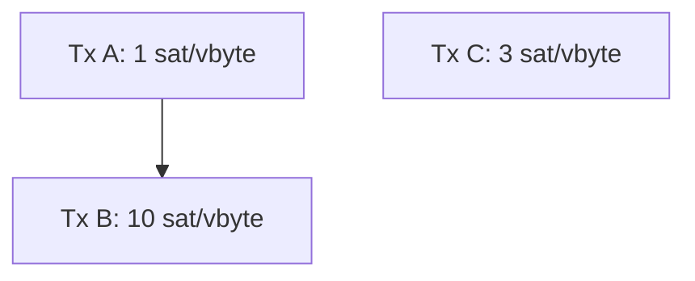
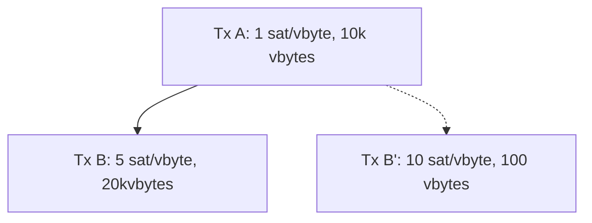
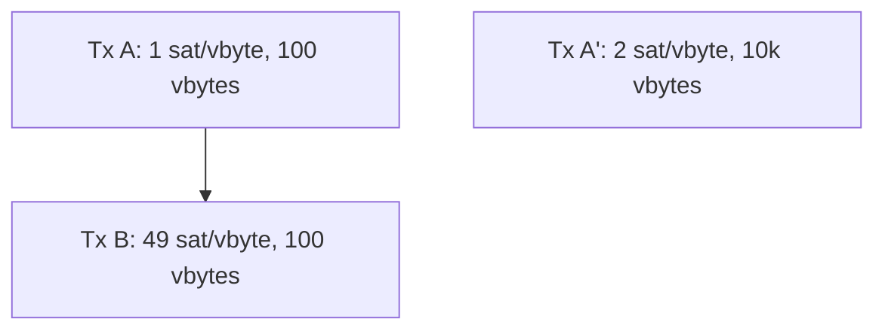
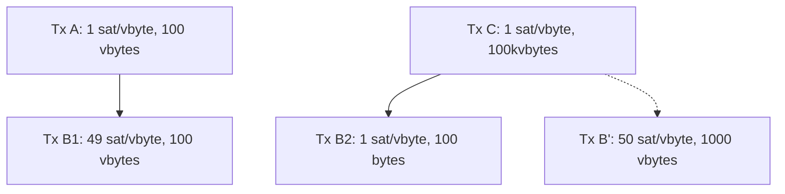
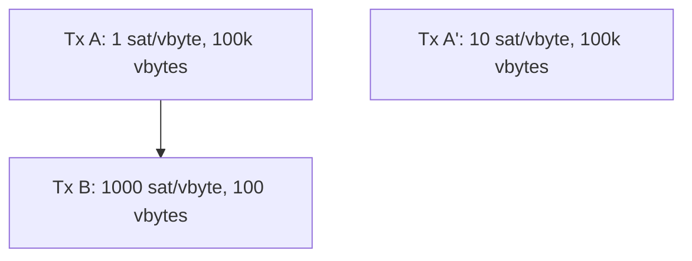
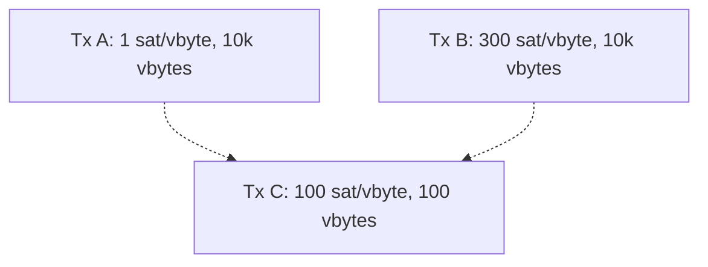
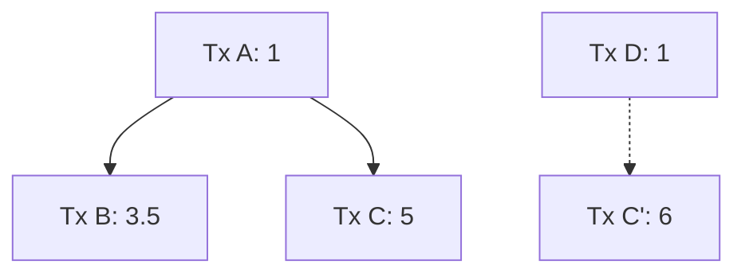
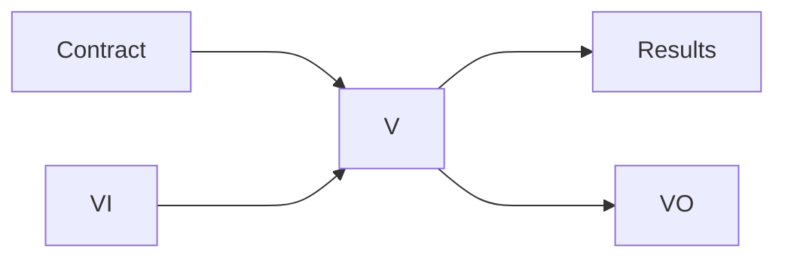
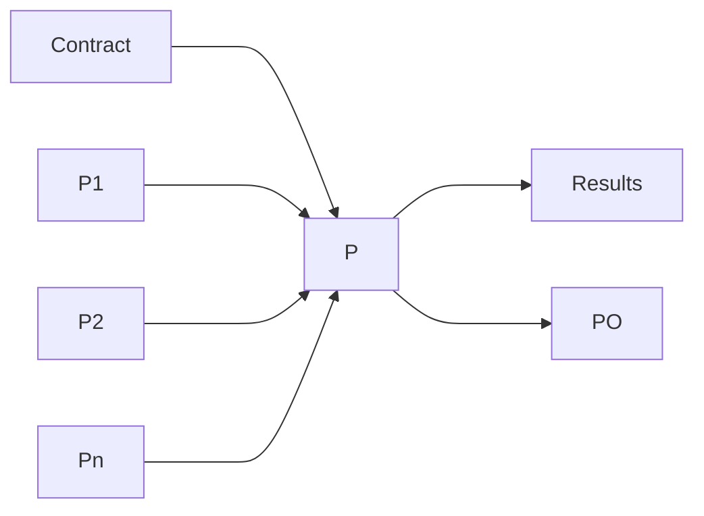
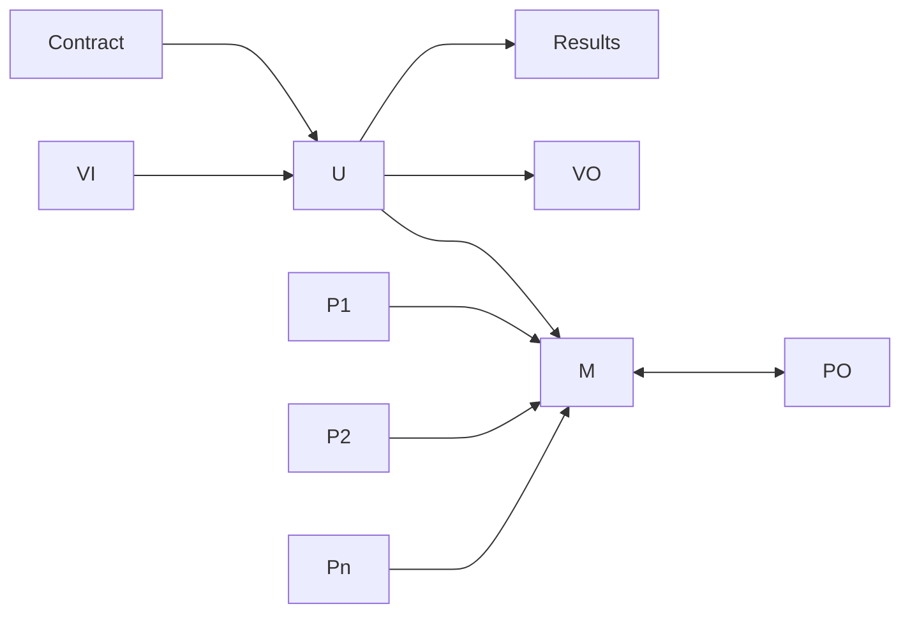

# Mempool Incentive Compatibility

sdaftuar | 2024-02-20 19:05:46 UTC | #1

In this post, I'll attempt to summarize my current understanding of how to think about incentive compatibility, which has evolved over the past year while working on the cluster mempool project[^0].

## Motivating questions

Given a mempool with many transactions, which ones should be selected in the next block?  Assuming there's more than one miner on the network[^1], the incentive is to maximize the next block's fees[^2] given the block size constraints.

Of course, once the next block is found, we're going to want to do this again. So a natural extension of that question is to ask: how should we order all the transactions in the mempool, to fill all the blocks that could be filled, in such a way as to maximize the (cumulative) fees collected as each block is mined?  (This question would be nice to answer, because having a total ordering on all mempool transactions seems useful for knowing which transactions we should evict if we need to.)

A related but more difficult question will follow: suppose we have two incompatible sets of transactions.  How can we determine which is the best set of transactions for miners to pick?  If we can answer this question, then this will give us some insights about how to develop a suitable RBF policy.

## Ordering the mempool by "feerate"

Due to the influx of new transactions, at any given point in time it's not clear how much of the mempool that we can see will ultimately be mined in the next block -- new transactions may arrive that will be preferable to include, reducing what we select from what we can see right now.

For a fixed mempool, the optimal sort order of the transactions in it will depend on how many vbytes we select. So the ideal set of questions to ask would be something like: for every integer N > 0 , what is the optimal ordering of the transactions in the mempool to maximize total fees, if we were to select exactly N vbytes of transactions?  If we knew this answer, that would tell us everything we could possibly want to know about a transaction's value to us.  For example, if a transaction always sorted last (for every value of N), then that would be the first transaction we should evict if our mempool needed to be trimmed. 

Of course, as instances of the knapsack problem, answering these questions as stated is not feasible. And as a practical matter, it would be much more convenient to approximate the answer by just having a single ordering, or "**linearization**", of our transactions, which we would use to estimate the contents of the best block at any given size by simply cutting off our ordered list at whatever size is needed.

If topology[^3] were not an issue, we could approximate this answer very well by simply sorting all transactions in descending feerate order. As long as individual transactions are small compared to the block size, then this approximation would be close to the optimal answer we'd get by actually solving the knapsack problem (the error is bounded by the ratio between the largest transaction in our mempool and the block size).

However, topology requirements add an additional constraint -- Bitcoin's consensus rules require us to order child transactions after their parents.  This introduces a new question: how should we think about linearizations in the presence of dependencies?  Consider a motivating example (assume all transactions shown are 100 vbytes):

Tx A is low feerate, and Tx C has a higher feerate then A; but A+B together have a higher feerate than C. Of course, the intuitive answer here is that we probably want to bundle A+B together, and select them as a single "chunk" of transactions before C. But how can we systematize this understanding, and reconcile it with the idea that tx C has higher feerate than tx A, and therefore in some scenarios ought to be selected first?

### Feerate diagrams as a way to resolve this question

That example raises the question of how we know whether to prefer linearizing those transactions as ABC or CAB -- can we characterize what it means for one ordering of a set of transactions to be better than another?  Naively, we think of an optimal linearization as one where the most fees are collected in the fewest vbytes of transaction data.  We can represent this idea graphically; for a given linearization, plot the set of points:

$\{(x_n, y_n) | x_n = $ total_vbytes_of_first_n_transactions, $ y_n = $ total_fees_of_first_n_transactions, $ 0 <= n <= $ total_number_of_transactions $\}$

These points measure the accumulated fees collected by a miner for selecting some subset of transactions in a way that is consistent with the linearization.

In the 3-transaction example above, the two linearizations ABC and CAB would produce these diagrams:

Looking at this, it's not at first clear which ordering is better, because if 100 vbytes were to be selected from the mempool, then using the CAB order is best, while if 200 vbytes were to be selected, then ABC is the best order.  However, if we apply our reasoning from before, that if transactions -- or in this case, chunks of transactions -- are small compared to the block size, then a better approximation would be to assume that we'd never need to consider splitting the pair A+B into separate pieces (we can pretend they represent a single indivisible transaction). With this assumption, we can construct new feerate diagrams that look like this:

In this graph, A+B is treated as indivisible in both orderings, and we can see now that the diagram for ABC is now the convex
hull of its original diagram: as we move from left to right, the slope (ie feerate) of successive line segments is monotonically decreasing.  Looking at the CAB ordering, we can now also realize that we ought to never choose C without also selecting A+B, because the feerate goes *up* if we select all 3 together; so we ought to consider its convex hull as well, which would produce this diagram:

Taking these new graphs -- the convex hulls of what we started with -- as our canonical **feerate diagram** representation of a linearization, we can define that a linearization $O$ is "at least as good as" linearization $P$ if the graph of $O$ contains the graph of $P$, or equivalently, if there are no points on the graphs of either for which $P$'s accumulated fees exceed that of $O$. (Similarly, we can say that $O$ is "strictly better" than $P$ if it is at least as good as $P$, but $P$ is not at least as good as $O$ -- ie, there is some point on the graphs of $O$ or $P$ where $O$'s accumulated fee exceeds that of $P$.)

Note that it's also possible that two feerate diagrams might be incomparable, if neither one contains the other. So for a given fixed set of transactions, this introduces a partial ordering on the set of linearizations of those transactions.

> **Note:**
> Overall, the key insight is that under the assumption that transaction chunks are small compared to the block size, then the convex hull of these accumulated fee diagrams captures the fee-maximizing strategy of a miner who will be using a
> single linearization of transactions to construct blocks.

### Optimal orderings possible in this setting

Using the convex hull as our basis for defining a comparison of two linearizations turns out to have a very nice property.  Given this partial ordering, it turns out that for any given set of transactions, there always exists an optimal linearization (not necessarily unique) that is at least as good as any other linearization that can be constructed.  Pieter Wuille has proven this theorem [here](https://delvingbitcoin.org/t/cluster-mempool-definitions-theory/202#optimal-linearizations-6).

The intuitive way to construct an optimal ordering is by simply selecting amongst all topologically valid subsets of transaction the one that has the highest feerate, and then repeating until all transactions have been selected.  It is easy to see that if an optimal linearization exists, this algorithm must achieve it.

### Clusters

Another simple observation is that transaction chunks in an optimal sort will always be topologically connected (if not, we could do better by splitting the chunk into connected components and then sorting the resulting pieces by feerate).  Thus, we can separately linearize the connected components, or **clusters**, of a given set of transactions and still be able to recover the optimal transaction ordering across all clusters (just by merge sorting the chunks of each cluster).  This insight is the motivation behind the [**cluster mempool**](https://delvingbitcoin.org/t/an-overview-of-the-cluster-mempool-proposal/393/1) proposal.

### Summary

Given the feerate diagram construction and partial ordering defined above, there must exist a single (not necessarily unique) linearization of transactions which we can use to construct blocks of arbitrary size. This gives an approximate solution to the block construction problem, and the deviation from the optimal block that could be found is bounded by the ratio between the maximum chunk size and the block size.

## Comparing linearizations of different transaction sets

The feerate diagram defined above can be used to determine how we might compare different options for linearizing the **same** set of transactions.  However, our second question to address is how we might compare the desirability of two different incompatible sets of transactions; this is exactly the question we need to answer when implementing an RBF policy.

### Background

As far as I am aware, in Bitcoin's 15 year history, no one has ever implemented RBF rules that satisfy the property that replacements are rejected unless they definitely make miners better off (with the exception of software versions that disallowed *all* replacements(!)).

Here are some motivating examples that demonstrate the issues[^4].  I'll focus on the RBF implementation from Bitcoin Core (largely described in BIP 125, and which has been around for 8+ years) and also touch on some other ideas that have come up from time to time.

#### Feerate rule

A rule that appears in BIP 125 is that the feerate of a replacement transaction must exceed that of all its (direct[^direct]) conflicts. This might make it *seem* that the replacement transaction should be mined sooner than the transaction it replaces, meaning that miners would collect more fees sooner -- which sounds like a better mempool than the original.  However this is not the case:

In this example, A and B are in the mempool, and B' is a potential replacement of B.  B' pays a higher feerate than B, yet a miner including A+B' collects a lower feerate (and lower total fee) than a miner taking A+B.  This should make it clear that merely requiring the feerate of a replacement to be higher (even much higher!) than its conflicting transaction is insufficient by itself to guarantee incentive compatibility.

#### Total fee rule

BIP 125 also specifies that the total fee of a replacement must go up.  However this does not fix the problem described in the last section; just using that last example, we can see that if A and B' were already in the mempool, and then transaction B arrived, then it would be rejected under BIP 125 rules (since its feerate is below that of B'), even though A+B has a better feerate than A+B'.

Of course, that would be an example of a replacement not being permitted where it should be. We have the other problem as well, which is that these rules can still be used to allow replacements which should not be permitted.  Consider:

Imagine that A and B are already in the mempool, and transaction A' arrives that conflicts with A. It has a feerate that is greater than that of A (its only direct conflict), and pays a total fee in excess of A+B.  So under the feerate + total fee rule, A' could replace A+B, even though A+B have a feerate of 25 sat/vbyte, which is much higher than the feerate of A'.

Trying to modify this rule to take into account the feerate of indirect conflicts doesn't help much either.  If we require
that a replacement beat the feerate of indirect conflicts, then (a) that still is insufficient to prevent incentive incompatible replacements, AND (b) it introduces some significant pinning issues (preventing replacements that should be allowed).  Here are two small examples demonstrating each of these properties:

In this example, B' conflicts with both B1 and B2.  Since it has a higher feerate than B1 and B2 and pays more total fees than both, it would pass both a total fee and feerate comparison test, yet it would be selected by miners at a lower feerate than B1 (due to its large, low fee parent C).  So we should not accept B' as a replacement.

On the other hand, if we required a transaction to beat the feerates of all conflicting transactions, that would prevent some replacements from occurring which should be permitted:

In this example, if A+B are already in the mempool, then A' would not be permitted as a replacement, even though the feerate and total fees are substantially higher if we take A'[^5].  In order for A' to exceed B's feerate in this example, it would have to pay a very large amount in total fees.

#### Using the ancestor feerate

I've previously suggested not just using a transaction's feerate[^26451], but also its ancestor feerate as a score to consider in our RBF rules. Specifically, my initial suggestion was to use the minimum of a transactions feerate and its ancestor feerate as a proxy for its mining score, thinking that this would be a lower bound on where it would get mined. But it turns out this is not conservative enough -- consider this example:

Imagine that C would be a replacement of some other mempool transaction, and we want to know what C's mining score is. C's own feerate is 100 sats/vbyte; its ancestor feerate is clearly much higher, but its actual feerate when mined will be very low, because tx B would get mined by itself.

It seems instead that any RBF policy would need to take the actual topology into account, which is something that statistics like the ancestor feerate gloss over.

#### Using actual mining scores for an RBF heuristic

In my initial cluster mempool proposal, I suggested that if we are given a total ordering on the mempool, in which we know the feerate at which every transaction would be mined ("mining score"), then we ought to be able to come up with a [simple RBF rule](https://github.com/bitcoin/bitcoin/issues/27677#RBF), which would just be to check that the mining score of a new transaction should exceed the mining scores of any transaction that would be evicted and that the total fee of the new transaction should also be greater than the total fee of what is evicted.

However, it turns out that this simple rule is insufficient to guarantee that the mempool is clearly better for a miner after a replacement.  Consider this example, where all transactions are 100 vbytes, and a new transaction C' arrives which would conflict with C:

The mining score of C' is 3.5, which is better than the mining score of C (~3.2).  And C' pays more fee than C.  However, a miner working on the original transaction set {A, B, C, D} can collect 9.5 in fees in 300 vbytes by selecting transactions [ABC], while a miner working on the new transaction set {A, B, C', D} can only collect at most 8 in fees in 300 vbytes (by selecting [DC'A].

I was pretty surprised by this result -- the original transaction set is better than expected when compared to the conflicting set, for topological reasons that are somehow missed when looking just at the mining scores of the specific transactions being added and removed.

### Using feerate diagrams as an RBF policy tool

After the previous section argued for the virtues of feerate diagrams as a way to compare the quality of linearizations, it is
natural to wonder whether feerate diagrams might help us in the RBF setting as well.

Suppose we have one set of transactions S and some incompatible other set of transactions T (arrived at by adding some transactions that conflict with one or more transactions in S).  We want to know if miners should stick with S or switch to T.

As before, we can calculate the feerate diagram of the linearization of S (F(S)) and compare it to the feerate diagram of the linearization of T (F(T)).  If F(S) is strictly better than F(T) then it seeems clear that miners should prefer S to T.  However, if F(S) and F(T) are incomparable, meaning there is some size at which F(T) has a higher accumulated fee -- and therefore higher feerate -- than F(S), and vice versa, then we have no way to tell which is better for miners.

In the setting of linearizations of a single set of transactions, we had the nice property that we know an optimal linearization always exists that is at least as good as any other, so dealing with what to do in the face of incomparable linearizations is not really an issue[^merging]. However, that concept does not generalize to how we think about incompatible transaction sets.  Consider two conflicting transactions:

* Tx A: feerate 100 s/vbyte, 100 vbytes, 10k sats total
* Tx A': feerate 50 s/vbyte, 2000 vbytes, 100k sats total

Which one is better for a miner? The feerate diagram of two mempools that differ only in the presence of tx A vs A' would have incomparable feerate diagrams.  If nothing else in the mempool was anywhere near the feerate of A', then a miner would probably prefer it, as that would maximize the fee in the next block. On the other hand, if there are a lot of transactions with feerates in between A and A', then it's possible that a miner would prefer tx A.

#### A simple analysis of a toy problem

To illustrate this point further, consider another example of two conflicting transactions that are the same size (and assume for simplicity that there are no other transactions in the mempool):

* Tx B: 1000 sats, eligible to be mined in next block
* Tx B': 100k sats, but timelocked so it can only be mined *after* the next block, ie in the second block from now

What should a miner do in this situation? I believe it depends on factors outside of what is stated.  Every miner has a choice of whether to follow a GREEDY strategy and try to include tx B now (and tx B' in the next block, if tx B is NOT mined in the first block), or a WAIT strategy where they include nothing in the next block in the hopes of being able to include B' in the second block.

First, let's consider a miner with 0.5% of the total hash rate on the network. 

We can calculate the payoffs for following each strategy for this miner, conditioning on what the rest of the network does:

| Strategy of rest of network | Payoff for WAIT | Payoff for GREEDY|
|-----------------------------|-----------------|------------------|
| WAIT | $0.005 * 100000 = 500$ | $0.005 * 1000 + 0.995 * 0.005 * 100000 = 502.5$ |
| GREEDY | $0.005 * 0.005 * 100000 = 2.5$ | $0.005 * 1000 = 5$ |

So regardless of what the rest of the network does, for the 0.5% miner, the payoff for GREEDY is greater than the payoff for WAIT, and this miner should be including tx B now.

Consider instead how this analysis plays out for a miner with 25% hashrate:
 
| Strategy of rest of network | Payoff for WAIT | Payoff for GREEDY|
|-----------------------------|-----------------|------------------|
| WAIT | $0.25 * 100000 = 25000$ | $0.25 * 1000 + 0.75 * 0.25 * 100000 = 19000$ |
| GREEDY | $0.25 * 0.25 * 100000 = 6250$ | $0.25 * 1000 = 250$ |

For this miner, regardless of what the rest of the network does, the payoff for WAIT exceeds that of GREEDY, and the 25% miner would prefer to **not** work on tx B in the next block, unlike the 0.5% miner.

I imagine there's a more comprehensive way of thinking about this problem, but I believe this illustrates that the choice of which transaction to prefer in the face of conflicts depends on more information than just
the transactions themselves[^centralization].

> **Note:** Having an RBF policy that requires the feerate diagram to strictly improve prevents incentive incompatible replacements, but it likely also excludes replacements which are incentive compatible as well. This seems like an area that would be a good future research project.

## Anti-DoS considerations

All of the above discussion is just focused on incentive compatibility, without regard to denial of service concerns -- all we were concerned with was ordering transactions we somehow have, or figuring out which transactions that we have access to are best to keep.

In practice, we have to also ask the question of whether our incentive compatibility reasoning introduces denial-of-service concerns -- it's not a priori obvious that this shouldn't be the case.  Our main concern is typically preventing "free relay", ie preventing situations where transactions are relayed on the network without any kind of external cost being borne -- if that were possible, then it would be free to overwhelm the network with such "free" transactions and tie up nodes' CPU and network resources.

Since our goal for the Bitcoin p2p network is one that is decentralized and open to anyone to join, we can't easily assign fees to particular network peers. Instead, we prevent free relay by ensuring that the fees in the transactions being relayed are commensurate with the bytes being relayed -- our goal is that over any given time period (say, where no blocks have been found), we want that `total_fees_added_to_mempool / bytes_relayed >= minimum_relay_fee`.

While the minimum relay fee is itself an arbitrary value (1 sat/vbyte by default in Bitcoin Core), this principle ensures that increased network usage comes with increased costs. Moreover, raising the minimum relay fee is a way to increase
the costs associated with increased network use, while decreasing the fee lowers the cost for users (or attackers) to tie up network resources.

### Example: BIP 125's prevention of free relay

One of the most important (but frustrating!) BIP 125 policy rules is the requirement that the total fees in the mempool after processing a replacement must increase by `minimum_relay_fee * new_transaction_size`. As discussed above, the BIP 125 rules do not achieve incentive compatibility, but because of this rule they do at least prevent free relay.

This rule is also the chief source of RBF "pinning", where large, low-feerate transactions cannot easily be replaced by smaller, high feerate transactions.  But if we were to eliminate it, then the minimum relay fee will cease to be a bound on `fees paid / bytes relayed`.  Analyzing a particular scenario requires taking into account the variety of other policy rules in place (which may serve to limit usage patterns in some way), but a simple example that would become possible if we just dropped the total fee rule of BIP 125 would be the following:

 * 100 transactions of size 100kvb are relayed on the network and added to the mempool, at the min relay fee (say 1 sat/vbyte)
 * A single 100-input transaction that conflicts with a single input from each of those transactions is relayed at 1.001 sat/vbyte (I'll approximate it as 10kvb in total size, but it's actually a bit less).

At this point, a little over 10MvB have been relayed on the network, but only about 10k sats have been spent in fees available to be mined.  This is a factor of almost 1000 decrease in the minimum relay fee we'd like to enforce -- meaning that if users wanted to update their node settings so that the resource usage costs are the same in this hypothetical as they are today, they'd have to update their min relay fee to 1000 sats/vbyte -- probably not something anyone wants to do.[^worse]

### Example: mempool eviction is a source of (bounded) free-relay

When the mempool exceeds its size limit (after accepting a new transaction), we will evict transactions from the "bottom" -- and potentially the total fee of the mempool will have gone down as a result.  To avoid unbounded free relay, we increase the feerate required to enter the mempool whenever an eviction takes place, by bumping the minimum relay to a value equal to the feerate of what we have evicted plus an increment (equal to the min relay fee).

Effectively, we use new transactions being added to the mempool to pay for the eviction that has just happened. Since that happens after the eviction, though, there is an opportunity for free relay if no new transactions come in, because eventually the minimum relay fee will decay back down to its starting value. That decay parameter, coupled with maximum size we might evict at once, gives us a way to calculate the amount of free relay that is possible (over some time period).

### Summary

An interesting and valuable area of research would be to determine if there are incentive compatible behaviors that would not be DoS-resistant to deploy on the entire network (and characterize them, if they exist). If so, such behaviors could introduce an incentive for users to connect directly to miners, which might be mutually beneficial to those parties but harmful to the decentralization of mining on the network overall.

Understanding those scenarios may also be helpful to us as we try to design incentive compatible protocols that *are* DoS-resistant, so that we know where the boundaries are of what is possible.

[^0]: My thoughts here are based on many discussions with others, particularly in the last year; thanks especially to Pieter Wuille, Mark Erhardt, Clara Shikhelman, Greg Sanders, Gloria Zhao, and Anthony Towns for sharing their insights and analysis with me.
[^1]: In the case that there is only 1 miner, then the order doesn't matter since the miner eventually collects everything; all the miner would care about is total fees collected.
[^2]: In this post, I'm focused on the narrow question of how to order transactions in the mempool to maximize fees.  I'm ignoring the game theoretic effects of miners potentially leaving high-fee paying transactions out of a block as an incentive for other miners to extend the chain, rather than reorg it.
[^3]: By "topology", I mean the consensus rules that govern valid orderings of transactions in a block, namely that parent transactions must appear before child transactions.
[^direct]: By "direct" conflicts, we refer to transactions which are spending 1 or more of the same inputs. By "indirect" conflicts, we mean transactions that do not directly spend the same inputs as a given transaction, but are descendant transactions of a direct conflict.
[^4]: See for instance: Gloria's [mailing list post on RBF](https://lists.linuxfoundation.org/pipermail/bitcoin-dev/2022-January/019817.html), this comment from [PR #23121](https://github.com/bitcoin/bitcoin/pull/23121#issuecomment-929475999), and also some discussion in [#26451](https://github.com/bitcoin/bitcoin/pull/26451).
[^5]: Note that the other BIP 125 rules (eg against not introducing new unconfirmed parents, or the maximum number of conflicts allowed) don't help the situation at all.  The examples in this section wouldn't have triggered violations of those rules either.
[^26451]: I started to propose an approach like this [here](https://github.com/bitcoin/bitcoin/pull/26451), before realizing it was pretty broken (and not just because it would making RBF pinning far worse than it is today!).
[^merging]: In fact, Pieter came up with a polynomial-time [merging algorithm](https://delvingbitcoin.org/t/cluster-mempool-definitions-theory/202#merging-linearizations-5) that can take two incomparable linearizations as input, and produce a linearization that is strictly better than either.
[^worse]: I imagine there are ways to make network usage go up by more than what I just described here -- this is not a very sophisticated scenario! I can think of one modification to raise the effect from being a 1000x decrease to 50,000x decrease, but the details are boring and possibly there are more clever scenarios that exist anyway.
[^centralization]: An interesting side note to this example is that while offering a feerate-only RBF policy may be in the best interests of a user and a small miner, because large miners benefit from maximizing total fees, it seems plausible that that users attempting to do feerate-only RBF might create incentives for miners to form coalitions and cooperate to prevent this from happening, since they all benefit when total fees are maximized. I have no idea if the game theory would actually play out this way, however; perhaps this is a question worthy of further study.

-------------------------

sanket1729 | 2024-02-14 01:25:53 UTC | #2

Excellent post. Thanks for writing down formally and elaborating how this is not an easy problem to solve. 

[quote="sdaftuar, post:1, topic:553"]
This gives an approximate solution to the block construction problem, and the deviation from the optimal block that could be found is bounded by the ratio between the maximum chunk size and the block size.
[/quote]

Curious to know if there is data on how optimal the current mined blocks are? I presume this is hard to do exactly because out of band transactions and inconsistent mempools.

-------------------------

sdaftuar | 2024-02-14 15:13:07 UTC | #3

[quote="sanket1729, post:2, topic:553"]
Curious to know if there is data on how optimal the current mined blocks are? I presume this is hard to do exactly because out of band transactions and inconsistent mempools.
[/quote]

I haven't tried to measure this in a while, but I can try to include some analysis of this as I continue with the cluster mempool proposal.  I think there are probably a few different ideas to separate out when thinking about this question.

First, we have two different mining algorithms to consider: the existing ancestor-feerate transaction selection mechanism (which has been in Bitcoin Core for many years now), and a new transaction selection algorithm that arises from the cluster mempool strategy (which should be more optimal, for a number of reasons). So one thing we can try to do is measure how much better the cluster-mempool algorithm ends up being versus the legacy algorithm (I believe it should be strictly better, when given the same set of mempool transactions to operate on).

Second, in thinking about deviations from optimal, even with the cluster mempool proposal I expect there will be situations where we will not optimally sort a cluster.  This is simply because we want to support reasonably large clusters, and our belief is that [optimal sorting is an exponential-run-time operation](https://cs.stackexchange.com/questions/163467/finding-highest-value-weight-ratio-in-dependency-graph-np-hard) -- though we don't have a proof of this. So the implementation we're working on falls back to simpler, polynomial-time strategies for big clusters (such as the ancestor-feerate algorithm).  Getting a handle on how far below optimal a polynomial-time algorithm ends up being may be difficult for me to manage, because running the exponential-time algorithm will take too long!

And finally, there is the knapsack problem -- even if we optimally sorted clusters based on the feerate diagram metric, actually optimal blocks can deviate from our approximation, because at the end of the block we might not have space for our next highest feerate-sorted transaction chunk.  Getting a bound on this in practice is pretty easy; we can just look at how full the block is at the first point that we'd select a chunk of transactions that don't fit, and that gives an idea of how close we must be to optimal.  In the worst case, since ancestor packages (and cluster sizes, in the current cluster mempool proposal) are bounded at 101kvb, we're only in theory guaranteed to be ~90% of optimal, but I believe in practice most transactions are small enough that we do much better.

At any rate, I should be able to produce some data on the first and last items here as I do more research (but it will likely be several months before I get to this).

-------------------------

rustyrussell | 2024-02-22 02:45:53 UTC | #4

Thanks for this excellent summary:  I learned a lot!

# On greedy vs wait for Miners

If we step back for a moment, we realize that all timeout-based protocols assume (and require!) miners take a greedy approach, as it is a subset of the "no censorship" assumption.

If a miner considers waiting for a future larger reward, timeouts get broken.  Moreover, it's a trivial step for miners to consider *potential* future rewards even if they don't see them yet: knowing a deadline approaches and deferring a tx will usually cause it to bid upwards, and then after the deadline a bidding war will begin between the parties.

Fortunately, the actual divergence from miner incentives here is fairly narrow in practice, as these extreme examples do not regularly occur.  Bitcoin software also doesn't mine backwards even in the case of a large fee double-spend, and I haven't seen anyone complaining about that.  Similarly, I suggest leaving this door firmly closed.

# On Mempool As a Linearization Fantasy

A subset of these problems (though definitely not all of them!) seems to come from the requirement that the mempool be consistent.  If it were a simple collection of potentially incompatible but all possibly-valid transactions, and selection were made at block creation time, we would be able to trade some problems for others.  We would need, however, some other mechanism for DoS protection.

# The Hysteresis Approach to RBF Bypass

I wanted to mention what is still my current favorite solution in the replacement wars: that RBF rules be bypassed in favor of a simpler "higher feerate" iff all the replaced txs would not have been in the successive block, and all new ones are.  This addresses both the sharp end of RBF complaints in a multi-party scenario (blocking progress) and the sharp end of miner incentive (getting those juicy fees).  [Aside: ISTR someone had a critique of this approach, but I can't find the link? Help?!]

There are some potential replay games to be played on the low end of the current block, but this is difficult to do in practice (other txs must push you out), and the game is terminated when a new block is made.  If necessary, hysteresis can be added (e.g. replaced txs must be more than 1.5 blocks back, new txs must be in first 1.0 blocks of mempool), but I'm not sure that's required.

# Unrelated Transaction Propagation DoS Principles

It's possible to consider a different approach to tx propagation, with a more direct correlation with miner incentives: In theory, high-fee txs should propagate faster than low-fee txs.

This, of course, reintroduces many of the issues you discussed here, and is still not sufficient:
1. You still don't want 1,000 (clashing) txs even if they are all offering top-dollar: you need *some* rbf-style limits.
2. You actually want to defer *evaluating* txs if they're low-enough fee, but you can't actually figure out feerates without UTXO lookup which is much of the expense.  This seems to require that the feerate be sent with the tx, included in the WTXID.

Some of these points are probably too-radical a departure from existing practice to be worth serious consideration, but maybe someone smarter than me will feel inspired to explore them further :orange_heart:

-------------------------

sdaftuar | 2024-02-24 10:19:09 UTC | #5

[quote="rustyrussell, post:4, topic:553"]
Fortunately, the actual divergence from miner incentives here is fairly narrow in practice, as these extreme examples do not regularly occur. Bitcoin software also doesn’t mine backwards even in the case of a large fee double-spend, and I haven’t seen anyone complaining about that. Similarly, I suggest leaving this door firmly closed.
[/quote]

I imagine you're right, and I certainly am not proposing that anyone write software that would do anything differently in this regard. However I think it's important to understand that if protocols are implicitly creating mechanisms where miners would get paid more overall if they censor a transaction in order to wait for a later one, that we know under what assumptions this is incentive compatible, so that we don't stray into territory where the system falls apart (either because miners independently decide its in their interest to wait, or because it creates incentives for miners to cooperate because they collect more total fee this way).

So I view this as an area for theoretical research to be done to figure out how the incentives work out and what the game theoretic implications are.

[quote="rustyrussell, post:4, topic:553"]
If it were a simple collection of potentially incompatible but all possibly-valid transactions, and selection were made at block creation time, we would be able to trade some problems for others. We would need, however, some other mechanism for DoS protection.
[/quote]

Agreed -- though my intuition is that this is an insurmountable DoS problem to solve.

[quote="rustyrussell, post:4, topic:553"]
I wanted to mention what is still my current favorite solution in the replacement wars: that RBF rules be bypassed in favor of a simpler “higher feerate” iff all the replaced txs would not have been in the successive block, and all new ones are. This addresses both the sharp end of RBF complaints in a multi-party scenario (blocking progress) and the sharp end of miner incentive (getting those juicy fees). [Aside: ISTR someone had a critique of this approach, but I can’t find the link? Help?!]
[/quote]

So I had hoped that the reasoning from my post shows why this is an insufficient criteria by itself, even putting aside potential DoS issues and only considering miner incentive compatibility, but I can try to come up with a more concrete example to make my point clearer.

Suppose in our mempool we have the following:
* 1000 transactions, $A_1, ... A_{1000}$, each of which pays 10k sats in fees, and is 1k vbytes in size (so 10 sats/vbyte feerate).
* 500 transactions, $B_1, ..., B_{500}$, each of which pays 9k sats in fees, and also 1k vbytes in size (9 sats/vbyte feerate)
* 500 transactions, $C_1, ..., C_{500}$, each of which pays 1k sats in fees, and also 1k vbytes in size (1 sat/vbyte feerate)
* 1 transaction, $D$, which pays 900k sats in fees, and is 100k vbytes in size (9 sat/vbyte feerate).

At this point, the next block would consist of all the $A_i$ transactions and pay 10M sats in fees, while the second block would consist of $[B_1, ..., B_{500}, D, C_1, ..., C_{400}]$ and pay 5.8M sats in fees.

Imagine we have a replacement transaction, $D'$, which conflicts with $D$, pays a feerate of 10.001 sats/vbyte, and is 1000 vbytes[^typo] in size.  Under your proposed rule, $D'$ would be in the top block and accepted as a replacement -- indeed, it would be the highest feerate transaction in the whole mempool -- but it only increases the fees in the top block by 1 satoshi.

Meanwhile, the result of taking $D'$ and evicting $D$ would be that the second block in the mempool will now consist of: $[A_{1000}, B_1, ..., B_{500}, C_1, ..., C_{499}]$, which has a total fee of 5.009M sats, a reduction of 791k sats.

I think this raises two immediate questions:
1) Are there any miners that would find it incentive compatible to work on a block that pays 1 sat more, if it means giving up 791k sats in the next block?  (Note that in the future when fees are the only thing rewarding miners, that this would seem to create an additional incentive to reorg out such blocks.) I believe that in today's network, the answer is no.
2) Even if there are, is it bad for the network to promote policies that try to exploit this kind of behavior, because it might create an incentive for miners to centralize to try to maximize total fees collected?  I don't know how strong this effect might be, but I think we should notice that this would seem to rely on (extreme) decentralization of mining in order to work, and we should determine if we might be undermining that important property with a usage pattern that incentives subverting it.

My overall takeaway from this is that (a) at the least, the distribution of fees in the mempool seems to matter for what is incentive compatible, even when looking at "top block" replacement rules, and (b) even taking into account such distributions, more research is needed to figure out what is incentive compatible for miners, particularly in situations where total fees are going down.

Going further: even in situations where total fees are not going down, I think there is more room for research.  I think there's a rough intuition that when evaluating an RBF and looking at feerate diagrams, that probably what is happening in the top few blocks matters a lot more than what is happening further down in the mempool.  But we lack any specifics on how we might characterize this -- you could imagine an RBF that would increase the top block by 1 sat, decrease the second block by 100k sats, but increase the third block by 101k sats.  Is that an RBF that we should accept?  etc

[^typo]: In the initial post, I mistyped this as 1000 *kvbytes* -- sorry for the error!

-------------------------

instagibbs | 2024-02-22 19:14:14 UTC | #6

[quote="sdaftuar, post:5, topic:553"]
But we lack any specifics on how we might characterize this – you could imagine an RBF that would increase the top block by 1 sat, decrease the second block by 100k sats, but increase the third block by 101k sats. Is that an RBF that we should accept? etc.
[/quote]

I've mentioned this elsewhere, but I imagine a way to primarily considering this is weighing the reward with some kind of exponential discounting which reflects the inherent uncertainty of the mempool and of the future itself. [Things further down can be replaced, buried further, trimmed, etc](https://sci-hub.se/https://dl.acm.org/doi/abs/10.1145/3466826.3466833). This would be a fairly large departure from the current methodology of comparing diagrams, involves consequential judgment calls about weighing, and doesn't answer anti-DoS questions, naturally.

-------------------------

ajtowns | 2024-02-23 06:06:54 UTC | #7

[quote="instagibbs, post:6, topic:553"]
I imagine a way to primarily considering this is weighing the reward with some kind of exponential discounting which reflects the inherent uncertainty of the mempool and of the future itself.
[/quote]

I wonder how true that is: I think the worst case scenario for this is: (a) stratumv2 is a huge success, decoupling transaction selection from reward pooling, so we end up with a single pool with ~100% of hashpower, and every miner expects to have a fair proportion of all future fees; and (b) bitcoin is stable and deflationary, so the discount rate is low (eg, 1.02 BTC in a year is worth 1.0 BTC now).

In that case, if you have a 50kB tx that's expected to confirm in the next month at 20sat/vb (1M sat fee), and want to cancel it with a 200B tx, then bumping it to 100sat/vb (20k sat fee) would cost miners 980ksat discounted by 30 days; if the bottom fee rate for the next block was 21sat/vb, they're making 16ksat now, so the implied discount rate is 6125% per month, rather than on the order of 2% per year.

Looked at the other way, if you want to bring a 1M sat fee paying tx forward by a month, at a 2% discount rate, that would only justify ~1650sat reduction in fees, ie, less than 0.17%. Though, by freeing up space in the block, you're also pulling the rest of the mempool forward, but only by a block. Supposing there's something like 1000 BTC in fees expected over the next month (23sat/vb for a month's worth of blocks), then that would be worth about 38ksat reduction in fees, bringing it up to 3.8%. But those are a long way from the 98% reduction we'd like to justify by replacing it with a tiny high-fee tx.

If pools are competing with each other in a cut-throat manner, this is much easier: if your pool has 2% hashrate, your odds of receiving any reward from a future block that includes the conflicting tx is only 2%, and 20ksat now is going to be worth more than 2% chance of 1Msat in the future with any discount rate.

There's certainly practical reasons to introduce uncertainty: you don't want to track TBs of transactions when the bottom most ones won't be mined for years just for practical reasons, and there's always a chance that someone building a block will lose track of their mempool and accept a lower-fee replacement by accident, or a transactor might be a miner themselves and prioritise their own transaction replacements when building their own candidate blocks.

But aside from pools competing with each other, those all seem like they only justify very small reductions in absolute fee value to me, and in particular that retaining pinning txs is economically rational for large mining pools. Not really the conclusion I was hoping for...

-------------------------

instagibbs | 2024-02-23 12:13:17 UTC | #8

[quote="ajtowns, post:7, topic:553"]
But aside from pools competing with each other, those all seem like they only justify very small reductions in absolute fee value to me, and in particular that retaining pinning txs is economically rational for large mining pools. Not really the conclusion I was hoping for…
[/quote]

My guess is my estimates of miner uncertainty is higher but to be clear, I don't think it's necessarily an incentives answer to *pinning*, just describing what I think is another reasonable direction to look for re:incentives. I gamed out some potential curves months ago, and it only really works for "solving pinning" if it's incredibly aggressive.

-------------------------

rustyrussell | 2024-02-24 03:42:41 UTC | #9

[quote="sdaftuar, post:5, topic:553"]
My overall takeaway from this is that (a) at the least, the distribution of fees in the mempool seems to matter for what is incentive compatible, even when looking at “top block” replacement rules, and (b) even taking into account such distributions, more research is needed to figure out what is incentive compatible for miners, particularly in situations where total fees are going down.
[/quote]

While further research is certainly a good idea, I push back pretty hard on this example!

You have already violated a major assumption here, by accepting a non-standard-size transaction.  Yet we've already hand-waved over the bin-packing problem, accepting that it can be suboptimal in theory while Good Enough in practice.  If this is untrue, we have other problems.

Simplicity *and predictability* itself is a virtue, as long as the result is congruent in practice: miners will almost certainly agree with this, as we've seen them lose real rewards by trying to be tricky with block construction in the past!  (I posit, far more than more optimal packing strategies will gain them in their lives).  

I think if we were to analyze the difference *in practice* we will end up so far below the engineering salary required to implement and vet the more complex scheme :slight_smile:

-------------------------

rustyrussell | 2024-02-24 03:47:35 UTC | #10

Yes, the stratum2-gives-100% case was exactly why I suggested leaving this door firmly closed, and only considering the immediate next block in bitcoin.  If some other implementation wants to implement a more complex system, they can do the work, and we can assess the damage at that time.

-------------------------

ajtowns | 2024-02-24 04:29:01 UTC | #11

[quote="rustyrussell, post:9, topic:553"]
You have already violated a major assumption here, by accepting a non-standard-size transaction.
[/quote]

The max transaction size is 101kvB (`-limitancestorsize` and `-limitdescendantsize`); all of those transactions meet standardness requirements...

-------------------------

rustyrussell | 2024-02-24 06:25:07 UTC | #12

I thought D' was 1000 kvb?

-------------------------

ajtowns | 2024-02-24 06:33:02 UTC | #13

It should be 1000 vb or 1 kvb; it's only evicting $A_{1000}$ from the top block which is also 1k vb.

-------------------------

sdaftuar | 2024-02-24 11:18:37 UTC | #14

@rustyrussell 
Sorry for the transaction size typo; I corrected my earlier post and added a footnote mentioning the error. With that correction made, do you still find the example objectionable?

My RBF policy suggestion is that we should allow a replacement transaction to evict some set of conflicts if:
* the feerate diagram of the resulting mempool is strictly better, and 
* the total fees in the mempool go up by at least the min relay fee times the size of the new transaction

I'll call this the "Feerate Diagram Policy".

I think you've suggested an alternate RBF policy that would allow a replacement transaction to evict some set of conflicts if:
* the new transactions would all appear in the next block, and
* none of the conflicting transactions would have appeared in the next block

Let's call this the "Next Block Policy". 

Here's how I'd summarize these two policies:

|Policy | Prevents incentive incompatible replacements? | Rejects some incentive compatible replacements? | Is DoS resistant?|
|--- | --- | --- | ---|
|Feerate Diagram Policy | Yes | Probably | Yes|
|Next Block Policy | No | Yes/Probably[^rejects] | No|

Is there any entry in this table that you'd disagree with?  

The Next Block Policy seems to land in a region that we should avoid, namely of failing to guarantee incentive compatibility while also opening up the network to DoS (the example I gave in the OP shows a DoS vector that is possible when total fees are allowed to drop, which is relevant here).

My immediate proposal -- part of the cluster mempool design -- is that we switch our RBF acceptance rules to follow the Feerate Diagram Policy I described above (the rationale for which is laid out in the OP).  This by itself doesn't "solve" the pinning issues that occur when low-feerate children are attached to transactions, but for all the reasons I've laid out we don't currently have even an incentive compatibility framework that allows us to know under what circumstances allowing total fees to drop might be okay, let alone a DoS-resistant mechanism for doing so.

Instead, I think relay rules like the v3 relay policy (https://delvingbitcoin.org/t/v3-transaction-policy-for-anti-pinning/340) are our best bet to mitigate pinning vectors for the foreseeable future.

And in the long-run, maybe someone can come up with an anti-DoS design that works better on an open network than what we've come up with so far, and if that is coupled with a better understanding of what is incentive compatible, then maybe there will be room for alternate pinning solutions...?  (I don't think anyone should count on this being invented anytime soon!)

[^rejects]: I don't know if the Next Block Policy proposal would also layer on the Feerate Diagram Policy when considering replacements that wouldn't touch the top block; if so then the answer here should be "maybe".  But if the Next Block Policy always rejected replacements that would be further down in the mempool because the new transaction is not in the top block, then I'd argue that it would definitely miss replacements that are incentive compatible, and hence the entry should be "Yes".

-------------------------

rustyrussell | 2024-02-25 03:56:28 UTC | #15

[quote="sdaftuar, post:14, topic:553"]
@rustyrussell Sorry for the transaction size typo; I corrected my earlier post and added a footnote mentioning the error. With that correction made, do you still find the example objectionable?
[/quote]

Sorry, I should have filtered that myself!  All good, thanks!

[quote="sdaftuar, post:14, topic:553"]
Is there any entry in this table that you’d disagree with?
[/quote]

I'm still kind of nerd crushing on the clarity of your post, TBH.  It's really nice! :orange_heart: 

FDP  "probably rejects some incentive compatible" is trivially Yes, I think?  In a flat mempool a miner should accept a 64 byte tx which pays a greater feerate than a larger tx it replaces.  It's not immediately clear to how we would *quantify* it, but I suspect that the total fee rule makes FDP less incentive compatible in realistic scenarios than NBP.

Secondly, DoS resistance is not a binary.  I'm not sure we'd be happy with the traffic increase if every tx RBF-stomped its way through the mempool in currently-allowed minimal increments?  (To be fair, I haven't calculated this in detail!).  On the other hand, if we allowed a possible violation of the "must pay your way" rule which was difficult to execute in practice (such as filling the second block and hoping it doesn't get mined before you replace it with the first block) we might be able to convince ourselves it's not too bad statistically.  Especially since we can adjust this, somewhat, by using greater hysteresis (e.g. you get an exception if you're going from > 2 blocks in to < 0.5 block in the mempool, etc).

My main issue with this table, though, is the missing column is the one I care about!  That's the adversarial case.

And while v3 is a useful hack for CPFP, we *don't want* CPFP as fees rise: we want inline fees and we want to stack multiple txs as much as possible to share the fee in/out (presumably using future covenant tech), but this means v3 doesn't help us :(

[quote="sdaftuar, post:14, topic:553"]
I don’t know if the Next Block Policy proposal would also layer on the Feerate Diagram Policy when considering replacements that wouldn’t touch the top block; if so then the answer here should be “maybe”.
[/quote]

Yes, I was initially assuming a carveout for the sharpest case where we currently clash with miner incentives, which is things going in the top block (also enables clients to have a Grug-like RBF model of "not in block yet, Grug pay more!" which suits my abilities).  I think this would also apply to FDP, which has the same issue.  

But I think to evaluate it we need to know:
1) how much of a DoS we are opening,
2) how incentive compatible it really is (given an non-infinite discount on future blocks, sigh), and 
3) how much does it really help against the adversarial case.  

(1) and (3) seem to require some mempool model and maybe a propagation model and a major thesis or three...

-------------------------

rustyrussell | 2024-02-26 05:19:43 UTC | #16

Actually, thinking about this overnight, I realized the DoS caused by carving out the "total fees" rule for block 1 entry is less than the one we already have.

You can already play the "free relay" game at the bottom of the mempool.  In this case, there are three outcomes:

1. Fees go up, you get evicted, you win a Free Relay.
2. Fees go don't go up, you don't get to play this round.
3. Fees go down for long enough, your tx gets mined, you lose.

The same game played on the 1-block boundary (with the Next Block Carvout) is worse:

1. Fees go up, you get evicted, you win.
2. Fees don't go up, you get mined, you lose.

In addition, this game is *more expensive* than the tail-of-mempool game.

Unfortunately, you can play both games, so strictly speaking it does make the DoS opportunity greater.  But it's a fairly strong argument that this does not make it significantly worse, either.

This is a fair way out of my expertise, though: have I missed anything?

-------------------------

instagibbs | 2024-02-26 15:09:35 UTC | #17

[quote="rustyrussell, post:15, topic:553"]
And while v3 is a useful hack for CPFP,
[/quote]

Without derailing this excellent conversation happening too much, V3 in its current form I'd argue is useful for a number of the fee tropes, just not for single tx exogenous fees specifically, which of course is a bit of a shame, but it's not just for CPFP! 

[quote="rustyrussell, post:16, topic:553"]
Fees go up, you get evicted, you win a Free Relay.
[/quote]

I might be reading this game wrong, but if it's evicted, we attempt to make subsequent txs "pay for it" by increasing minfee by incremental rate. So it's limited in scope and by time(similar to how we allow free relay for transactions that sat in mempool for 2 weeks and time out). Strictly weaker than harvesting the fees directly of course.

-------------------------

sdaftuar | 2024-02-26 20:04:01 UTC | #18

[quote="rustyrussell, post:15, topic:553"]
FDP “probably rejects some incentive compatible” is trivially Yes, I think? In a flat mempool a miner should accept a 64 byte tx which pays a greater feerate than a larger tx it replaces. It’s not immediately clear to how we would *quantify* it, but I suspect that the total fee rule makes FDP less incentive compatible in realistic scenarios than NBP.
[/quote]

I'm going with "Probably" rather than "Yes" exactly because we haven't yet done the work to quantify or characterize the circumstances under which such a replacement would be incentive compatible.  My guess is that in a situation like what you're describing, the reason our intuition is that the replacement should be taken is because maybe we're assuming there's some infinite demand for blockspace at whatever the feerate is you're talking about, and so miners are literally giving up nothing to accept a higher feerate (but smaller fee) transaction.

However, I don't presently have a precise argument about what is needed to justify this conclusion, and I don't think anyone else does either -- so until someone carefully writes up the assumptions under which this behavior is incentive compatible, I'll assume there's some chance our intuition may yet be wrong.  In particular, as I mentioned in the OP, in a world where there is just one miner/mining pool on the network (like @ajtowns described, in a stratumv2 world where everyone expects to gets their hashrate-proportion of all tx fees), it seems reasonable that the natural RBF policy is one that requires total fees to always increase, so there's some reason to think that the incentives and game theory are more complex than we're accounting for?

[quote="rustyrussell, post:15, topic:553"]
Secondly, DoS resistance is not a binary. 
[/quote]

Yes you're absolutely right that this isn't a binary thing -- what I had in my head when I typed the "Is DoS resistant?" phrase is a much narrower statement about free relay, which I think I could better phrase as: "Does the minimum relay feerate bound the ratio between (fees-in-mempool + fees-mined-in-blocks) and vbytes-relayed-on-the-network?" 

With that narrower statement, I think my table would hold.  That raises the question about whether this bound on costs to relay bytes is a *useful* characterization of relay policies.  I think it is, because (a) it makes it very easy to calculate the costs for generating a given amount of traffic, and (b) it makes it so that all usages of tx relay bandwidth are treated equally.

[quote="rustyrussell, post:15, topic:553"]
My main issue with this table, though, is the missing column is the one I care about! That’s the adversarial case.
[/quote]

Can you elaborate on what you mean by this?  My guess would be that you are referring to RBF pinning, and maybe you mean: how can a 3rd party increase the costs of me replacing a transaction I created, in such a way that it does not increase the likelihood of the transaction getting confirmed that is somehow commensurate with the adversary's costs?  

Defining what a pin really is seems somewhat difficult to me (curious if anyone has a precise definition we can use?), at least in part because if we are just looking at RBF policies like the Feerate Diagram Policy I have proposed here, there is always *some* fee you can put on a replacement transaction to get it into the mempool. So it's just a question of whether, in a given situation, you think that is a "fair" number.  But defining fairness here is pretty hard, and I think it exactly comes back to incentive compatibility questions for miners.... To see why, consider that we might need to answer this same question in a different context:

Imagine that Alice creates a transaction (tx A) that pays Bob, and she's thinking about relaying a double-spend (tx A') to send the funds back to herself.  Under what circumstances should the network accept A' as a replacement for A? In particular, if Bob has issued his own transaction B that spends A, under what circumstances should the network prefer the tx package A+B rather than A'?

This CPFP vs. RBF choice is fundamental to the question of what our RBF policies should be.  It's unfair to Bob (and to miners!) if Alice can replace tx A at such a cheap price that miners would have been better off with the A+B package, and similarly it seems unfair to Alice (and to miners!) if the costs of her replacing A+B are far beyond what the incentive compatible amount would be for miners to take tx A' instead.  

I think, today, we don't really have a good framework to answer this question. If someone thinks they have assumptions under which we can do better in particular examples, then that would be a great place for us to start working from, and we can decide whether the assumptions are reasonable and what use cases would open up as a result.

[quote="rustyrussell, post:15, topic:553"]
And while v3 is a useful hack for CPFP, we *don’t want* CPFP as fees rise: we want inline fees and we want to stack multiple txs as much as possible to share the fee in/out (presumably using future covenant tech), but this means v3 doesn’t help us :frowning:
[/quote]

I'm surprised by this take on v3: if you think CPFP is bad, then when designing your own protocol you could disallow it, simply by not having any immediately spendable outputs?  Or, for general transaction spends that are not tied to any particular protocol/where you can't control how the outputs might be spent, we could propose other ideas, such as allowing users to opt-in to a policy where children are either not allowed at all[^mailing-list], or are allowed only under very limited circumstances.

So the way I'd look at v3 is exactly from the opposite perspective: we all agree that unconfirmed transaction chains are generally *bad*, and v3 gives us a way (for the first time) to actually limit them, and thereby make RBF more useful.  

One thought experiment that I think is helpful: suppose in Bitcoin's history, relay of transactions with unconfirmed parents was non-standard by default.  Under what circumstances would we have relaxed that policy to allow for unconfirmed transaction chains?  My guess is that we would only have permitted it for cases that make sense and meet particular use cases, like a single CPFP transaction bumping a single parent (much like v3!), which is easy for users to understand and for mining code to optimize for.  

However, since we started with allowing arbitrary topologies and chains of transactions, we are left going in the other direction, of finding ways to cut back on what topologies are permitted instead.  Our mempool issues would be far, far simpler in a world where clusters were limited to size 1!

[quote="rustyrussell, post:16, topic:553"]
You can already play the “free relay” game at the bottom of the mempool. In this case, there are three outcomes:

1. Fees go up, you get evicted, you win a Free Relay.
2. Fees go don’t go up, you don’t get to play this round.
3. Fees go down for long enough, your tx gets mined, you lose.

The same game played on the 1-block boundary (with the Next Block Carvout) is worse:

1. Fees go up, you get evicted, you win.
2. Fees don’t go up, you get mined, you lose.
[/quote]

You're right that mempool eviction can give rise to free relay, but at any given moment, the number of additional bytes that have been relayed beyond what should have been allowed due to the minimum relay feerate is bounded at most by 101kvb, the maximum size of a descendant package.  This is because (as Greg also pointed out above) the mempool minimum fee rises to ensure that new transactions being relayed will pay sufficient fee so that the last eviction is paid for before the next one takes place.

However, with the Next Block Policy, you can play the free relay game over and over again.  Exactly how much depends on the distribution of fees in the mempool.  I'll try to redo the calculation I [wrote about above](https://delvingbitcoin.org/t/mempool-incentive-compatibility/553) in the specific context of a Next Block Policy RBF rule.

For concreteness: let's say we're allowing any transaction into the mempool as long as it would go into the next block, and as long as any conflicts are not already in the 1st or 2nd block which would be mined (so this captures one of your suggestions above of requiring some gap in the mempool order between what is accepted and what would be evicted).

What should we assume the distribution of feerates in the mempool is?  I just grabbed this screen shot from mempool.space to see what the feerate ranges are for the past few and next few blocks:

I haven't checked if this data is correct, but it looks like the feerate to get into the next block may not be that much higher than for blocks 3, 4, 5, etc.  So for the sake of argument, let's assume a hypothetical where a feerate of 20s/vbyte puts you out of the top 2 blocks, and a feerate of 40s/vbyte or higher would put you in the next block, and we'll see what an attacker could do:

Let's say an attacker filled up the mempool from blocks 3 and higher with transactions at 20 sats/vbyte.  I think with my default mempool settings, due to various overhead my node has roughly 80 blocks worth of transactions in it right now (with a basically full mempool), so let's say the attacker relays 78MvB of transaction data in 780 transactions of size 100kvb[^time] to accomplish this.

According to this [transaction size calculator](https://bitcoinops.org/en/tools/calc-size/), an attacker can then relay about 45k vbytes of transaction data (using p2tr) that conflict with one input of each of these 780 transactions. Under our assumption, this transaction would evict all 780 transactions as long as the feerate on this new transaction is 40 sats/vbyte, or about 1.8Msats in total[^rbf_limits].

* Total vbytes relayed: about 78.5MvB.  
* Total fees collected: 1.8M sats.

This is far below what the minimum relay feerate would imply miners should collect in order for this much data to be relayed.  Or, another way to  look at it is that the attacker was able to drain all but the top 2 blocks in the mempool for just 1.8M sats spent, in the process removing 78MvB * 20 sats/vbyte = 15.6 BTC from the mempool. (Please correct me if I made any numerical errors here.)

Moreover, the attacker could then repeat this attack, over and over again, tying up CPU and relay bandwidth of 78 blocks worth of data, for just 1.8M sats in cost each time (about 900USD at today's prices?).  Also note that in the process, the attacker has likely driven up the cost to enter the mempool up to 20 sats/vbyte by filling it up in the first place, but without an actual corresponding increase of fees collected by the miners.

We could discuss whether this is an attack anyone would have an economic incentive to perform (perhaps one miner attacking another, by draining their mempool?), but regardless I would maintain that this is not something that we should permit to happen, for both anti-DoS and incentive compatibility reasons.

[^mailing-list]: This was actually something that was brought up a long time ago on the bitcoin-dev mailing list; see for instance https://lists.linuxfoundation.org/pipermail/bitcoin-dev/2017-July/014678.html.  The main issue with that particular proposal was that it would have applied to all opt-in-rbf transactions and prevented the ability to CPFP.  However, we could imagine a few variations: (a) the v3 proposal itself, which allows a single small child; (b) only allowing a child if the resulting parent+child package would be included in the next block, but otherwise disallowing children; (c) some variant of v3 where the child transaction size is limited even further, say to 200 vbytes, so that CPFP is still permitted but the number of extra bytes that a replacement might have to pay for is as small as reasonably possible.  See also Greg's writeup, https://delvingbitcoin.org/t/v3-and-some-possible-futures/523/1, which covers some more general ideas that may be possible in a post-cluster-mempool world.

[^time]: My guess is that it would take on the order of several minutes to get these transactions to relay across the network using Bitcoin Core, but I haven't modeled it carefully.  I believe we currently relay transactions at 7 tx/second to inbound peers and about 17.5 tx/second to outbound peers.  Not sure what the network's overall bandwidth looks like for this much data though.

[^rbf_limits]: If you object to the number of transactions being evicted at once, since BIP 125 caps the number of conflicts from a single replacement at 100, then just imagine the attacker does this in 8 transactions that are all approximately 1/8th the size -- I don't think a conflict limit has a meaningful effect on these numbers.

-------------------------

ajtowns | 2024-02-27 05:39:39 UTC | #19

[quote="sdaftuar, post:18, topic:553"]
Defining what a pin really is seems somewhat difficult to me (curious if anyone has a precise definition we can use?),
[/quote]

Here's my shot: a pinning tx P, is one that:

 * is accepted into the mempool at a low feerate (so will not be mined in the near future)
 * conflicts with a high feerate tx, V, but is not RBF-replacable by V
 * the fee cost to fix this is excessive, whether by:
    * bringing P's feerate up to a level where it will be mined soon (by CPFP or out of band accelerator payments to miners); or
     * bumping V's fee such that it becomes a valid RBF-replacement; or
     * constructing an alternative tx U that has a high feerate and does RBF-replace P

"Excessive" is always a judgement call. I think if you retain the requirement that total fees always increase, then the only way to prevent fees becoming excessive is to require that the total size of txs evicted by replacing P with U is at most only a small multiple of the size of V. That multiple then tells you exactly how much U needs to overpay compared to V, so ideally you choose it based on your own definition of "excessive".

----

An alternative highly speculative design, that would at minimum require magic new opcodes and might not be possible at all in bitcoin's model, would be to allow deconstructing the pinning transaction: that is, if you start off with P spending inputs $C, I_1, .., I_n$ and creating outputs $X, P_O$ versus the simpler tx that spends $C, V_I$ and creates outputs $X, V_O$, you could imagine constructing a new tx U that spends $C, V_I$ and creates outputs $X, V_O, M$, and another transaction W that spends $M, I_1, .., I_n$ to create the single output $P_O$, reusing the same signatures for $I_1, .., I_n$ from P. That way miners aren't losing any total fees, pinning is easily worked around as long as you observe the pin, and everyone's happy.

However specifying a constraint for spending C such that all the sibling inputs have signatures that allow C to be replaced by M (but not some other output with the same scriptPubKey and value) and only commit to the output $P_O$ is probably quite tricky, if it's even possible at all.

Some pictures. The transaction we'd like, with small size, modest fee, high feerate:

The pinning transaction, with large size, possible high fee, but low/modest feerate:

The magic solution; U has small size, modest fee, high feerate, and gets the contract results, while any additional fees from P are still available by mining M, even if its feerate is low/modest.

-------------------------

rustyrussell | 2024-02-27 06:32:35 UTC | #20

[quote="instagibbs, post:17, topic:553"]
[quote="rustyrussell, post:16, topic:553"]
Fees go up, you get evicted, you win a Free Relay.
[/quote]

I might be reading this game wrong, but if it’s evicted, we attempt to make subsequent txs “pay for it” by increasing minfee by incremental rate. So it’s limited in scope and by time(similar to how we allow free relay for transactions that sat in mempool for 2 weeks and time out). Strictly weaker than harvesting the fees directly of course.
[/quote]

If you're dropped from the mempool, it's like you never existed. There's no "minimum increase" other than what gets you in the (now more expensive) mempool?

(Edit: Apparently this is wrong, because minfee increases? For how long does that happen?)

-------------------------

ajtowns | 2024-02-27 06:48:42 UTC | #21

There's a halflife of 12 hours specified, which decreases to 6 hours if the mempool is less than half full, or 3 hours if the mempool is less than a quarter full; provided there's been a block since the last time the minfee was bumped due to tx eviction, the minfee will decay towards 0 at that rate. So at 20sat/vb, when the minfee is raised by 1sat/vb it'll take ~53min to decay back; at 50sat/vb, about 21 minutes; at 100sat/vb about 10 minutes; at 5sat/vb about 4 hours.

https://github.com/bitcoin/bitcoin/blob/4d7d7fd123113342f09871b1a383cda1bb53d0ea/src/txmempool.cpp#L1091-L1121

-------------------------

rustyrussell | 2024-02-27 09:43:17 UTC | #22

[quote="sdaftuar, post:18, topic:553"]
[quote="rustyrussell, post:15, topic:553"]
And while v3 is a useful hack for CPFP, we *don’t want* CPFP as fees rise: we want inline fees and we want to stack multiple txs as much as possible to share the fee in/out (presumably using future covenant tech), but this means v3 doesn’t help us :frowning:
[/quote]

I’m surprised by this take on v3: if you think CPFP is bad, then when designing your own protocol you could disallow it, simply by not having any immediately spendable outputs? Or, for general transaction spends that are not tied to any particular protocol/where you can’t control how the outputs might be spent, we could propose other ideas, such as allowing users to opt-in to a policy where children are either not allowed at all[[1]](#footnote-1702-1), or are allowed only under very limited circumstances.
[/quote]

Predicting fees is Too Hard, and over-paying increasingly Too Expensive. So you really need to BYO fees at spend time (rather than construction/signature exchange time), and if you can do that you can ride out fee spikes without needing to renegotiate with the other party, too, making your protocol more robust.

With current tech, we can only do this for SIGHASH-SINGLE/ANYONE_CAN_PAY (limiting your protocol to single in and out, which doesn't usually work for multi-party stuff), OR using CPFP which requires one output which is spendable immediately.

i.e. CPFP is the only game in town today. v3 helps here *today*!

But I think the end game of Bitcoin is high fees (which will justify a great deal of engineering and effort to mitigate), and introspection which allows us more room to optimize. The medium case is bringing your own fee input/output at spend time, but really optimal is paying someone (over lightning or anything but onchain Bitcoin) to gather multiple unrelated txs together from everyone, with one fee input and output covering the entire thing.

Perhaps we would end up using introspection to limit the tx size anyway, so we just need the no-unconfirmed-children rule. Or perhaps the diminishing returns from bundling mean the tx size doesn't have to be very large.

Now I write this out, I think I understand @instagibbs point about the generality of the v3 proposal, which would still serve here?

(End of a long day here, I will digest the rest of your post before the weekend, I hope!)

-------------------------

rustyrussell | 2024-03-07 00:58:22 UTC | #23

[quote="instagibbs, post:17, topic:553"]
[quote="rustyrussell, post:16, topic:553"]
Fees go up, you get evicted, you win a Free Relay.
[/quote]

I might be reading this game wrong, but if it’s evicted, we attempt to make subsequent txs “pay for it” by increasing minfee by incremental rate. So it’s limited in scope and by time(similar to how we allow free relay for transactions that sat in mempool for 2 weeks and time out). Strictly weaker than harvesting the fees directly of course.
[/quote]

Thanks, indeed, this makes the "free relay at bottom of the mempool" game less easy to play, depending on how fast that decays.  From AJ's answer, I'd guesstimate 10-100 blocks might be typical, but it's not a far cry from 2 weeks...

-------------------------

rustyrussell | 2024-03-07 02:53:25 UTC | #24

[quote="sdaftuar, post:18, topic:553"]
According to this [transaction size calculator ](https://bitcoinops.org/en/tools/calc-size/), an attacker can then relay about 45k vbytes of transaction data (using p2tr) that conflict with one input of each of these 780 transactions. Under our assumption, this transaction would evict all 780 transactions as long as the feerate on this new transaction is 40 sats/vbyte, or about 1.8Msats in total[[3]](#footnote-1702-3).
[/quote]

Ah yes, unconfirmed children strike again :frowning: 

> (Please correct me if I made any numerical errors here.)

Even if you did, the order of magnitude is correct.  

> this is not something that we should permit to happen, for both anti-DoS and incentive compatibility reasons.

I agree with anti-DoS, but it's not even clear that it's not incentive compatible.  If you expect other miners to do the replacement, it depends on your discount rate.  Which is annoyingly circular reasoning, but I think we can do better.

Let's assume v3 rules, so children need not apply.  All the pre-signed transactions I know of can trivially enforce this condition, so it seems fair, and cuts the problem down a fair way.

What does it fundamentally cost to drop a random transaction from the mempool?  If we assume the Mempool Is Always Full, then it seems reasonable that it will be eventually replaced by a transaction at feerate minfee - epsilon.  And if we assume a tx of < 101k, and some continuous looking feerate distribution around and below the bottom of the mempool, I'm happy to ignore epsilon.

In this model, a miner would consider an RBF tx fundamentally incentive compatible be comparing the total fees above the minfee rate. To give some numbers:

My node's mempool is oversized, but a quick grep/cut/awk hack gives me the threshold for block 78 as 7.7432 sat/vb (and block 1 as 14.0673 sat/vb).  Under this model, a 100k tx paying 774,320 sats is worth epsilon (~0), so a miner would want to accept a replacement 1k tx paying any higher feerate, say 7744 sats.

Now, does this actually help our pinning attack?  Not as much as the previous proposal, at least on these numbers.  Halfway up the mempool (block 39) is 12.0378 sat/vb (higher in the mempool means it's more likely to get mined and just fail, so this is a reasonable worst-case sketch).  Mallory puts a 100k tx there, be paying 1,203,780 sats, thus a fee-above-minimum of 429,460 sats.  Alice's 1k tx would have to beat that fee-above-minimum, so 437 sat/vb feerate (it could otherwise get in the top block for 14 sat/vb, so this does feel like extortion).

But I think it does imply that there's a significant conflict between miner incentives and the current RBF DoS rules (under which Alice's 1k tx would have to pay a feerate of 1204 sats/vb).

-------------------------

murch | 2024-03-12 18:28:58 UTC | #25

[quote="rustyrussell, post:24, topic:553"]
I agree with anti-DoS, but it’s not even clear that it’s not incentive compatible. If you expect other miners to do the replacement, it depends on your discount rate. Which is annoyingly circular reasoning, but I think we can do better.
[/quote]

While I think that Suhas’s example above is somewhat similar, I recently elaborated an example how introducing a replace-by-feerate scheme in addition to our current RBF rules would cause new substantial DOS vectors. While my example is based on a concrete proposal, I believe that it illustrates a general issue afflicting all schemes that do away with the absolute fee increase in replacements: https://bitcoin.stackexchange.com/q/121541/5406

My example entails a negligible cost to the attacker while permitting continuous resubmission of essentially the same transaction cycle. The collection of transaction has a substantially larger total weight than the data that is ever up for inclusion in the blocks and hence severely underpays for relay to the detriment of the entire network’s bandwith-usage. I hope studying my write-up would help substantiate why transaction replacements must increase the total fees in the mempool.

-------------------------

rustyrussell | 2024-03-16 00:27:19 UTC | #26

I think this technical definition is overspecialized (or perhaps implied by the question?).

The problem is: you want to spend some shared input in a timely manner, and are prepared to pay competitive rates to do so vs other transactions.  Another transaction is preventing this.  You don't really care why, or *which* tx gets mined, but you have some deadline.

I think we've demonstrated that there are cases where the miners are incentivized to fix this, and cases they are not.  In the latter case, there's a Schelling point where, even if it's not directly incentive compatible for a miner to replace, it becomes so if the *other* miners do.  Such a Schelling point might come into existence if (1) miners agree it's generally better for the network, (2) the gains of not doing so are minor anyway, and (3) it's the default.

We still have to deal with the DoS problem, but perhaps that's as simple as "if a tx has been in the mempool for over 12 blocks and you're offered feerate to get the replacement into the top of mempool, and they've both v3, allow RBF ignoring the total fee rule".

-------------------------

rustyrussell | 2024-03-18 23:35:58 UTC | #27

This was the link I was looking for earlier, thanks!!

We need to consider three things here:
* Bandwidth consumption
* Higher layer protocol efficacy
* Miner incentives

I think we've demonstrated a conflict between them (i.e. we need to compromise, and we implicitly are already).

I don't think your example works for lightning today, where the first transaction is of fixed size, so games can only be played with the children, and v3 restricts those. 

But it does effect a general stackable-txs case, which is where we're headed eventually, so must be considered.  Sigh, ok 

The real problem in your example seems to be step 7: by RBF not considering the package feerate, but a single tx feerate, it discards an imminent tx! This is not incentive compatible if you assume any reasonable discount rate for future blocks?

-------------------------

instagibbs | 2024-03-18 18:16:36 UTC | #28

[quote="rustyrussell, post:27, topic:553"]
But it does effect a general stackable-txs case, which is where we’re headed eventually, so must be considered. Sigh, ok
[/quote]

The stackable case is interesting in that an attacker can easily coordinate with itself to pin 100 channels, but collective action to outbid it might be prohibitive in terms of interactivity. So even if a miner "knows" it would pairwise not take the pin-evicting txs, it might err on the side of taking it anyways, excluding DoS concerns.

My ideal is if we had some future discounting, and we applied it to diagram checks, we could make all diagrams comparable during these checks. With that in hand, incentives and DoS checks would be two completely separate concerns. From there we can think about alternative anti-DoS measures with a bit more clarity.

-------------------------

murch | 2024-03-18 18:25:02 UTC | #29

[quote="rustyrussell, post:27, topic:553"]
I don’t think your example works for lightning today, where the first transaction is of fixed size, so games can only be played with the children, and v3 restricts those.
[/quote]

Yeah, I am not concerned with benign users of a "RBF bypass" but with a malicious adversary using such a new rule creatively beyond the intended application.

-------------------------

ajtowns | 2024-03-19 01:10:26 UTC | #30

[quote="rustyrussell, post:26, topic:553"]
I think we’ve demonstrated that there are cases where the miners are incentivized to fix this, and cases they are not. In the latter case, there’s a Schelling point where, even if it’s not directly incentive compatible for a miner to replace, it becomes so if the *other* miners do. Such a Schelling point might come into existence if (1) miners agree it’s generally better for the network, (2) the gains of not doing so are minor anyway, and (3) it’s the default.
[/quote]

Hmm, poking at this some more, I think my [previous post](https://delvingbitcoin.org/t/mempool-incentive-compatibility/553/7) went too far into the miners-all-cooperate edge case.

If you consider some pinning tx that won't be worth mining for 100 blocks, and a stratumv2 mining pool with only 98% hashrate that keeps the pinning tx hoping for its high fees, that's still leaves an 86% chance that the remaining 2% hashrate mines a block a block in the meantime with the high feerate tx, invalidating the pinning tx. In that case, the pinning tx needs to pay $h^{1-n}$ times as much as the pinned tx, or the pool would have had a higher expected value for just trying to mine the higher feerate/lower fee pinned tx instead. For a pool with 100% hashrate, that devolves to always requiring a higher fee independent of $n$; but for a pool with 90% hashrate, it's already 100x fee at about 45 blocks; at 50% hashrate, it's 500x fee at 10 blocks. For the 98% pool at 100 blocks, it's a factor of about 7.4.

That model may give a strong incentive to defect, if you get some direct benefit from fees, other than just "the pool has more funds to distribute". For example, if a sv2 pool finds that some percent of hashpower is just building working on empty blocks, perhaps it will decide to issue rewards rated not just by number of shares found, but also by the potential reward that those blocks would return to the pool. In that case, defecting and attempting to mine the replacement transaction would increase your share of rewards in the short term, and, provided the pool doesn't check for that sort of defection and punish it, and without having done the maths, I think that would end up being attractive, at least, for small miners within the pool.

I think that still adds up to "the replacement tx needs to pay a fee proportional to the total fee of the tx being replaced" though -- along with having a threshold along the lines of "don't replace txs you expect will confirm in the next 50 blocks" -- but at least it allows that proportion to be substantially less than 1. 

I think in this view, you can conclude that as long as you don't have a mining pool/cartel with over 95% hashrate, than replacing a tx that won't be mined for 135 or more blocks with one that would be mined immediately is fine unless the total fee of the existing tx is more than 1000x that of the new one (pretty implausible as it would mean even a 100vb tx replacement would be paying a lower feerate than a max size 100kvb tx), as is replacing a tx whose total fee is under 10x and won't be mined for 50 or more blocks.

Those numbers seem much more reasonable, though I'm not sure how you'd make any of this practical to implement -- both the "this tx won't be mined for $n$ blocks" and "$h$ percent of hashpower will wait to try to collect fees from the pinning tx" aren't really things you can measure very accurately... Dealing with a 50 or 135 block delay might not be very practical for many applications either.

-------------------------

rustyrussell | 2024-03-19 02:18:21 UTC | #31

Indeed, and restricting the carve-out to some reduced size would work for lightning, but not general protocols.

But to revisit your example, RBF rule 2 (no other unconfirmed inputs) seems to want to prevent the requirement to consider entire packages, but by playing *on top* of an unconfirmed tx you work around this?  If the RBF bypass rule were only to apply to v3 transactions, I think this could not be done.  Otherwise, we could consider replacing Rule 2 with a more sophisticated requirement that the new package outbid the one being replaced.

-------------------------

rustyrussell | 2024-03-19 02:33:30 UTC | #32

[quote="ajtowns, post:30, topic:553"]
Those numbers seem much more reasonable, though I’m not sure how you’d make any of this practical to implement – both the “this tx won’t be mined for nnn blocks” and “hhh percent of hashpower will wait to try to collect fees from the pinning tx” aren’t really things you can measure very accurately… Dealing with a 50 or 135 block delay might not be very practical for many applications either.
[/quote]

Thanks for the numbers, they definitely shed light!  You're assuming the ~100% cartel is too polite to reorg out for dominance, of course.

Given the widespread awareness of a 51% attack, I think it's *uncontroversial* to write software optimized for miners who control less than that.

(Complete disclosure: I'm with Peter Todd (IIRC) that small miners are more valuable than large miners, so I'm biased to optimize the system for them with my volunteer efforts!).

But even without this bias, 50% discount degrades so fast, it's not far from 100% really, which is **far easier to implement**.  After 7 blocks the error for a 50% miner is < 1%.  A 50% miner has resources to change this if they wish, but the expected return would be minimal.

-------------------------

rustyrussell | 2024-03-19 02:38:56 UTC | #33

[quote="instagibbs, post:28, topic:553"]
My ideal is if we had some future discounting, and we applied it to diagram checks, we could make all diagrams comparable during these checks. With that in hand, incentives and DoS checks would be two completely separate concerns. From there we can think about alternative anti-DoS measures with a bit more clarity.
[/quote]

Agreed!  Despite discussing both here (partially in the hope of producing some magic solution which addresses both!) they are best considered separately.

While stackable txs are vulnerable to this problem, that's actually OK I think?  Because if we have the introspection tech required to stack txs, I assume we can also use that to restrict total tx size.  If there's a healthy marketplace of people making stacked txs with reasonable fees with some frequency, you don't need this of course.

-------------------------

