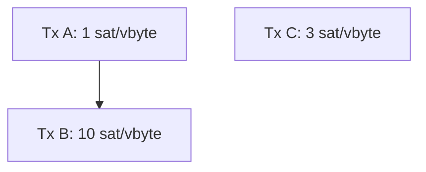
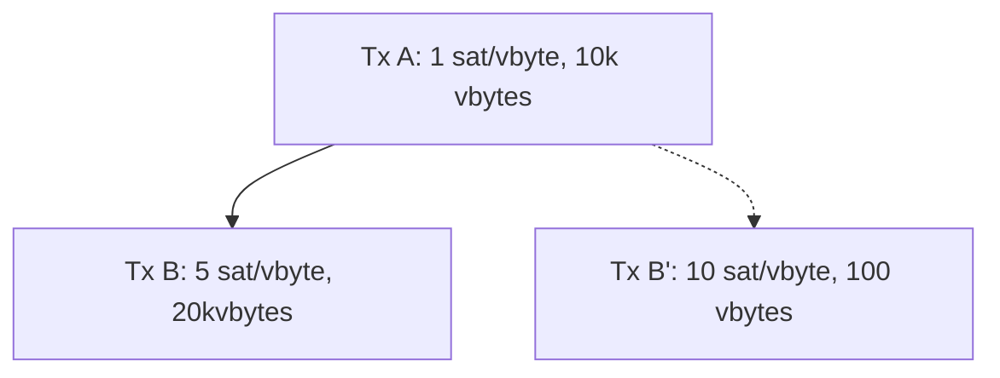
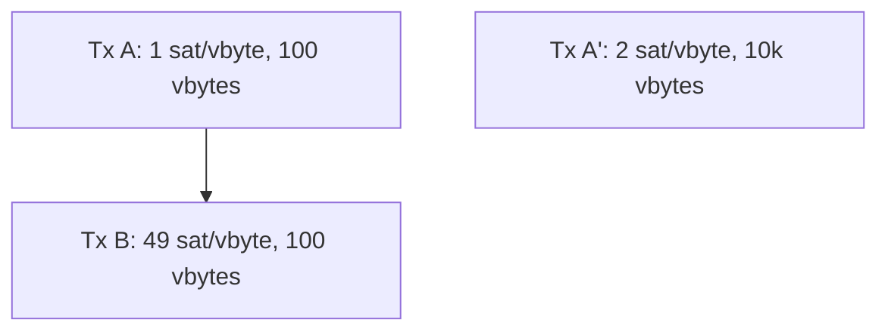
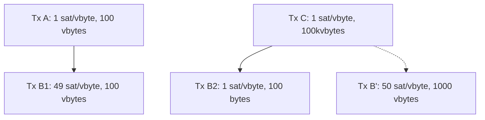
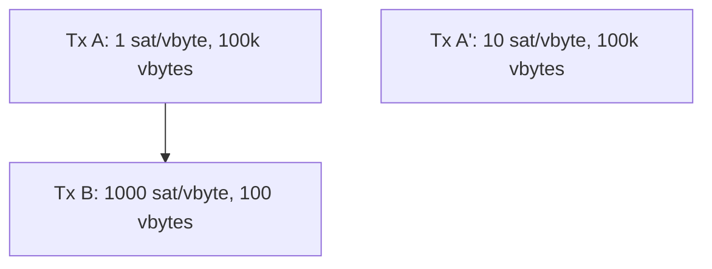
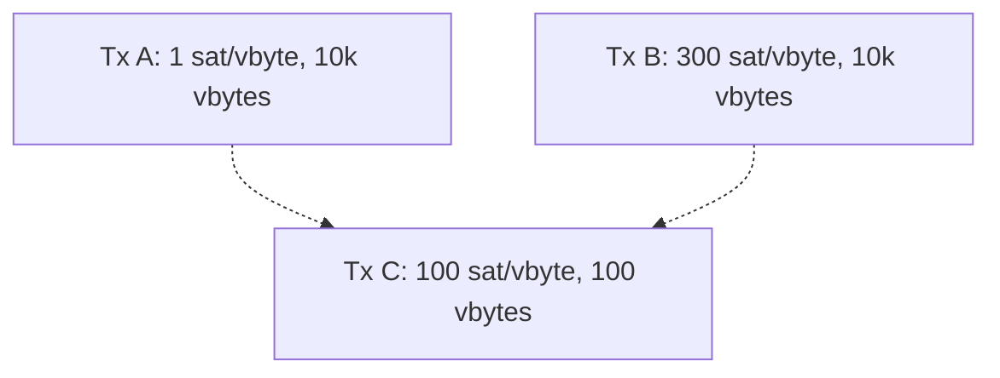
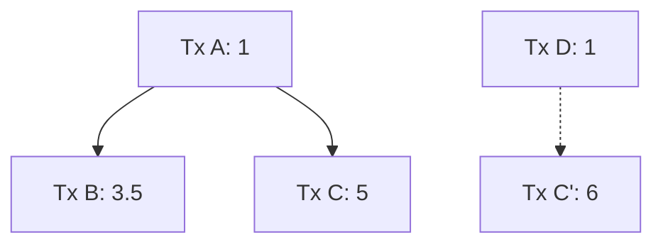

# Mempool Incentive Compatibility

sdaftuar | 2024-02-20 19:05:46 UTC | #1

In this post, I'll attempt to summarize my current understanding of how to think about incentive compatibility, which has evolved over the past year while working on the cluster mempool project[^0].

## Motivating questions

Given a mempool with many transactions, which ones should be selected in the next block?  Assuming there's more than one miner on the network[^1], the incentive is to maximize the next block's fees[^2] given the block size constraints.

Of course, once the next block is found, we're going to want to do this again. So a natural extension of that question is to ask: how should we order all the transactions in the mempool, to fill all the blocks that could be filled, in such a way as to maximize the (cumulative) fees collected as each block is mined?  (This question would be nice to answer, because having a total ordering on all mempool transactions seems useful for knowing which transactions we should evict if we need to.)

A related but more difficult question will follow: suppose we have two incompatible sets of transactions.  How can we determine which is the best set of transactions for miners to pick?  If we can answer this question, then this will give us some insights about how to develop a suitable RBF policy.

## Ordering the mempool by "feerate"

Due to the influx of new transactions, at any given point in time it's not clear how much of the mempool that we can see will ultimately be mined in the next block -- new transactions may arrive that will be preferable to include, reducing what we select from what we can see right now.

For a fixed mempool, the optimal sort order of the transactions in it will depend on how many vbytes we select. So the ideal set of questions to ask would be something like: for every integer N > 0 , what is the optimal ordering of the transactions in the mempool to maximize total fees, if we were to select exactly N vbytes of transactions?  If we knew this answer, that would tell us everything we could possibly want to know about a transaction's value to us.  For example, if a transaction always sorted last (for every value of N), then that would be the first transaction we should evict if our mempool needed to be trimmed. 

Of course, as instances of the knapsack problem, answering these questions as stated is not feasible. And as a practical matter, it would be much more convenient to approximate the answer by just having a single ordering, or "**linearization**", of our transactions, which we would use to estimate the contents of the best block at any given size by simply cutting off our ordered list at whatever size is needed.

If topology[^3] were not an issue, we could approximate this answer very well by simply sorting all transactions in descending feerate order. As long as individual transactions are small compared to the block size, then this approximation would be close to the optimal answer we'd get by actually solving the knapsack problem (the error is bounded by the ratio between the largest transaction in our mempool and the block size).

However, topology requirements add an additional constraint -- Bitcoin's consensus rules require us to order child transactions after their parents.  This introduces a new question: how should we think about linearizations in the presence of dependencies?  Consider a motivating example (assume all transactions shown are 100 vbytes):

Tx A is low feerate, and Tx C has a higher feerate then A; but A+B together have a higher feerate than C. Of course, the intuitive answer here is that we probably want to bundle A+B together, and select them as a single "chunk" of transactions before C. But how can we systematize this understanding, and reconcile it with the idea that tx C has higher feerate than tx A, and therefore in some scenarios ought to be selected first?

### Feerate diagrams as a way to resolve this question

That example raises the question of how we know whether to prefer linearizing those transactions as ABC or CAB -- can we characterize what it means for one ordering of a set of transactions to be better than another?  Naively, we think of an optimal linearization as one where the most fees are collected in the fewest vbytes of transaction data.  We can represent this idea graphically; for a given linearization, plot the set of points:

$\{(x_n, y_n) | x_n = $ total_vbytes_of_first_n_transactions, $ y_n = $ total_fees_of_first_n_transactions, $ 0 <= n <= $ total_number_of_transactions $\}$

These points measure the accumulated fees collected by a miner for selecting some subset of transactions in a way that is consistent with the linearization.

In the 3-transaction example above, the two linearizations ABC and CAB would produce these diagrams:

Looking at this, it's not at first clear which ordering is better, because if 100 vbytes were to be selected from the mempool, then using the CAB order is best, while if 200 vbytes were to be selected, then ABC is the best order.  However, if we apply our reasoning from before, that if transactions -- or in this case, chunks of transactions -- are small compared to the block size, then a better approximation would be to assume that we'd never need to consider splitting the pair A+B into separate pieces (we can pretend they represent a single indivisible transaction). With this assumption, we can construct new feerate diagrams that look like this:

In this graph, A+B is treated as indivisible in both orderings, and we can see now that the diagram for ABC is now the convex
hull of its original diagram: as we move from left to right, the slope (ie feerate) of successive line segments is monotonically decreasing.  Looking at the CAB ordering, we can now also realize that we ought to never choose C without also selecting A+B, because the feerate goes *up* if we select all 3 together; so we ought to consider its convex hull as well, which would produce this diagram:

Taking these new graphs -- the convex hulls of what we started with -- as our canonical **feerate diagram** representation of a linearization, we can define that a linearization $O$ is "at least as good as" linearization $P$ if the graph of $O$ contains the graph of $P$, or equivalently, if there are no points on the graphs of either for which $P$'s accumulated fees exceed that of $O$. (Similarly, we can say that $O$ is "strictly better" than $P$ if it is at least as good as $P$, but $P$ is not at least as good as $O$ -- ie, there is some point on the graphs of $O$ or $P$ where $O$'s accumulated fee exceeds that of $P$.)

Note that it's also possible that two feerate diagrams might be incomparable, if neither one contains the other. So for a given fixed set of transactions, this introduces a partial ordering on the set of linearizations of those transactions.

> **Note:**
> Overall, the key insight is that under the assumption that transaction chunks are small compared to the block size, then the convex hull of these accumulated fee diagrams captures the fee-maximizing strategy of a miner who will be using a
> single linearization of transactions to construct blocks.

### Optimal orderings possible in this setting

Using the convex hull as our basis for defining a comparison of two linearizations turns out to have a very nice property.  Given this partial ordering, it turns out that for any given set of transactions, there always exists an optimal linearization (not necessarily unique) that is at least as good as any other linearization that can be constructed.  Pieter Wuille has proven this theorem [here](https://delvingbitcoin.org/t/cluster-mempool-definitions-theory/202#optimal-linearizations-6).

The intuitive way to construct an optimal ordering is by simply selecting amongst all topologically valid subsets of transaction the one that has the highest feerate, and then repeating until all transactions have been selected.  It is easy to see that if an optimal linearization exists, this algorithm must achieve it.

### Clusters

Another simple observation is that transaction chunks in an optimal sort will always be topologically connected (if not, we could do better by splitting the chunk into connected components and then sorting the resulting pieces by feerate).  Thus, we can separately linearize the connected components, or **clusters**, of a given set of transactions and still be able to recover the optimal transaction ordering across all clusters (just by merge sorting the chunks of each cluster).  This insight is the motivation behind the [**cluster mempool**](https://delvingbitcoin.org/t/an-overview-of-the-cluster-mempool-proposal/393/1) proposal.

### Summary

Given the feerate diagram construction and partial ordering defined above, there must exist a single (not necessarily unique) linearization of transactions which we can use to construct blocks of arbitrary size. This gives an approximate solution to the block construction problem, and the deviation from the optimal block that could be found is bounded by the ratio between the maximum chunk size and the block size.

## Comparing linearizations of different transaction sets

The feerate diagram defined above can be used to determine how we might compare different options for linearizing the **same** set of transactions.  However, our second question to address is how we might compare the desirability of two different incompatible sets of transactions; this is exactly the question we need to answer when implementing an RBF policy.

### Background

As far as I am aware, in Bitcoin's 15 year history, no one has ever implemented RBF rules that satisfy the property that replacements are rejected unless they definitely make miners better off (with the exception of software versions that disallowed *all* replacements(!)).

Here are some motivating examples that demonstrate the issues[^4].  I'll focus on the RBF implementation from Bitcoin Core (largely described in BIP 125, and which has been around for 8+ years) and also touch on some other ideas that have come up from time to time.

#### Feerate rule

A rule that appears in BIP 125 is that the feerate of a replacement transaction must exceed that of all its (direct[^direct]) conflicts. This might make it *seem* that the replacement transaction should be mined sooner than the transaction it replaces, meaning that miners would collect more fees sooner -- which sounds like a better mempool than the original.  However this is not the case:

In this example, A and B are in the mempool, and B' is a potential replacement of B.  B' pays a higher feerate than B, yet a miner including A+B' collects a lower feerate (and lower total fee) than a miner taking A+B.  This should make it clear that merely requiring the feerate of a replacement to be higher (even much higher!) than its conflicting transaction is insufficient by itself to guarantee incentive compatibility.

#### Total fee rule

BIP 125 also specifies that the total fee of a replacement must go up.  However this does not fix the problem described in the last section; just using that last example, we can see that if A and B' were already in the mempool, and then transaction B arrived, then it would be rejected under BIP 125 rules (since its feerate is below that of B'), even though A+B has a better feerate than A+B'.

Of course, that would be an example of a replacement not being permitted where it should be. We have the other problem as well, which is that these rules can still be used to allow replacements which should not be permitted.  Consider:

Imagine that A and B are already in the mempool, and transaction A' arrives that conflicts with A. It has a feerate that is greater than that of A (its only direct conflict), and pays a total fee in excess of A+B.  So under the feerate + total fee rule, A' could replace A+B, even though A+B have a feerate of 25 sat/vbyte, which is much higher than the feerate of A'.

Trying to modify this rule to take into account the feerate of indirect conflicts doesn't help much either.  If we require
that a replacement beat the feerate of indirect conflicts, then (a) that still is insufficient to prevent incentive incompatible replacements, AND (b) it introduces some significant pinning issues (preventing replacements that should be allowed).  Here are two small examples demonstrating each of these properties:

In this example, B' conflicts with both B1 and B2.  Since it has a higher feerate than B1 and B2 and pays more total fees than both, it would pass both a total fee and feerate comparison test, yet it would be selected by miners at a lower feerate than B1 (due to its large, low fee parent C).  So we should not accept B' as a replacement.

On the other hand, if we required a transaction to beat the feerates of all conflicting transactions, that would prevent some replacements from occurring which should be permitted:

In this example, if A+B are already in the mempool, then A' would not be permitted as a replacement, even though the feerate and total fees are substantially higher if we take A'[^5].  In order for A' to exceed B's feerate in this example, it would have to pay a very large amount in total fees.

#### Using the ancestor feerate

I've previously suggested not just using a transaction's feerate[^26451], but also its ancestor feerate as a score to consider in our RBF rules. Specifically, my initial suggestion was to use the minimum of a transactions feerate and its ancestor feerate as a proxy for its mining score, thinking that this would be a lower bound on where it would get mined. But it turns out this is not conservative enough -- consider this example:

Imagine that C would be a replacement of some other mempool transaction, and we want to know what C's mining score is. C's own feerate is 100 sats/vbyte; its ancestor feerate is clearly much higher, but its actual feerate when mined will be very low, because tx B would get mined by itself.

It seems instead that any RBF policy would need to take the actual topology into account, which is something that statistics like the ancestor feerate gloss over.

#### Using actual mining scores for an RBF heuristic

In my initial cluster mempool proposal, I suggested that if we are given a total ordering on the mempool, in which we know the feerate at which every transaction would be mined ("mining score"), then we ought to be able to come up with a [simple RBF rule](https://github.com/bitcoin/bitcoin/issues/27677#RBF), which would just be to check that the mining score of a new transaction should exceed the mining scores of any transaction that would be evicted and that the total fee of the new transaction should also be greater than the total fee of what is evicted.

However, it turns out that this simple rule is insufficient to guarantee that the mempool is clearly better for a miner after a replacement.  Consider this example, where all transactions are 100 vbytes, and a new transaction C' arrives which would conflict with C:

The mining score of C' is 3.5, which is better than the mining score of C (~3.2).  And C' pays more fee than C.  However, a miner working on the original transaction set {A, B, C, D} can collect 9.5 in fees in 300 vbytes by selecting transactions [ABC], while a miner working on the new transaction set {A, B, C', D} can only collect at most 8 in fees in 300 vbytes (by selecting [DC'A].

I was pretty surprised by this result -- the original transaction set is better than expected when compared to the conflicting set, for topological reasons that are somehow missed when looking just at the mining scores of the specific transactions being added and removed.

### Using feerate diagrams as an RBF policy tool

After the previous section argued for the virtues of feerate diagrams as a way to compare the quality of linearizations, it is
natural to wonder whether feerate diagrams might help us in the RBF setting as well.

Suppose we have one set of transactions S and some incompatible other set of transactions T (arrived at by adding some transactions that conflict with one or more transactions in S).  We want to know if miners should stick with S or switch to T.

As before, we can calculate the feerate diagram of the linearization of S (F(S)) and compare it to the feerate diagram of the linearization of T (F(T)).  If F(S) is strictly better than F(T) then it seeems clear that miners should prefer S to T.  However, if F(S) and F(T) are incomparable, meaning there is some size at which F(T) has a higher accumulated fee -- and therefore higher feerate -- than F(S), and vice versa, then we have no way to tell which is better for miners.

In the setting of linearizations of a single set of transactions, we had the nice property that we know an optimal linearization always exists that is at least as good as any other, so dealing with what to do in the face of incomparable linearizations is not really an issue[^merging]. However, that concept does not generalize to how we think about incompatible transaction sets.  Consider two conflicting transactions:

* Tx A: feerate 100 s/vbyte, 100 vbytes, 10k sats total
* Tx A': feerate 50 s/vbyte, 2000 vbytes, 100k sats total

Which one is better for a miner? The feerate diagram of two mempools that differ only in the presence of tx A vs A' would have incomparable feerate diagrams.  If nothing else in the mempool was anywhere near the feerate of A', then a miner would probably prefer it, as that would maximize the fee in the next block. On the other hand, if there are a lot of transactions with feerates in between A and A', then it's possible that a miner would prefer tx A.

#### A simple analysis of a toy problem

To illustrate this point further, consider another example of two conflicting transactions that are the same size (and assume for simplicity that there are no other transactions in the mempool):

* Tx B: 1000 sats, eligible to be mined in next block
* Tx B': 100k sats, but timelocked so it can only be mined *after* the next block, ie in the second block from now

What should a miner do in this situation? I believe it depends on factors outside of what is stated.  Every miner has a choice of whether to follow a GREEDY strategy and try to include tx B now (and tx B' in the next block, if tx B is NOT mined in the first block), or a WAIT strategy where they include nothing in the next block in the hopes of being able to include B' in the second block.

First, let's consider a miner with 0.5% of the total hash rate on the network. 

We can calculate the payoffs for following each strategy for this miner, conditioning on what the rest of the network does:

| Strategy of rest of network | Payoff for WAIT | Payoff for GREEDY|
|-----------------------------|-----------------|------------------|
| WAIT | $0.005 * 100000 = 500$ | $0.005 * 1000 + 0.995 * 0.005 * 100000 = 502.5$ |
| GREEDY | $0.005 * 0.005 * 100000 = 2.5$ | $0.005 * 1000 = 5$ |

So regardless of what the rest of the network does, for the 0.5% miner, the payoff for GREEDY is greater than the payoff for WAIT, and this miner should be including tx B now.

Consider instead how this analysis plays out for a miner with 25% hashrate:
 
| Strategy of rest of network | Payoff for WAIT | Payoff for GREEDY|
|-----------------------------|-----------------|------------------|
| WAIT | $0.25 * 100000 = 25000$ | $0.25 * 1000 + 0.75 * 0.25 * 100000 = 19000$ |
| GREEDY | $0.25 * 0.25 * 100000 = 6250$ | $0.25 * 1000 = 250$ |

For this miner, regardless of what the rest of the network does, the payoff for WAIT exceeds that of GREEDY, and the 25% miner would prefer to **not** work on tx B in the next block, unlike the 0.5% miner.

I imagine there's a more comprehensive way of thinking about this problem, but I believe this illustrates that the choice of which transaction to prefer in the face of conflicts depends on more information than just
the transactions themselves[^centralization].

> **Note:** Having an RBF policy that requires the feerate diagram to strictly improve prevents incentive incompatible replacements, but it likely also excludes replacements which are incentive compatible as well. This seems like an area that would be a good future research project.

## Anti-DoS considerations

All of the above discussion is just focused on incentive compatibility, without regard to denial of service concerns -- all we were concerned with was ordering transactions we somehow have, or figuring out which transactions that we have access to are best to keep.

In practice, we have to also ask the question of whether our incentive compatibility reasoning introduces denial-of-service concerns -- it's not a priori obvious that this shouldn't be the case.  Our main concern is typically preventing "free relay", ie preventing situations where transactions are relayed on the network without any kind of external cost being borne -- if that were possible, then it would be free to overwhelm the network with such "free" transactions and tie up nodes' CPU and network resources.

Since our goal for the Bitcoin p2p network is one that is decentralized and open to anyone to join, we can't easily assign fees to particular network peers. Instead, we prevent free relay by ensuring that the fees in the transactions being relayed are commensurate with the bytes being relayed -- our goal is that over any given time period (say, where no blocks have been found), we want that `total_fees_added_to_mempool / bytes_relayed >= minimum_relay_fee`.

While the minimum relay fee is itself an arbitrary value (1 sat/vbyte by default in Bitcoin Core), this principle ensures that increased network usage comes with increased costs. Moreover, raising the minimum relay fee is a way to increase
the costs associated with increased network use, while decreasing the fee lowers the cost for users (or attackers) to tie up network resources.

### Example: BIP 125's prevention of free relay

One of the most important (but frustrating!) BIP 125 policy rules is the requirement that the total fees in the mempool after processing a replacement must increase by `minimum_relay_fee * new_transaction_size`. As discussed above, the BIP 125 rules do not achieve incentive compatibility, but because of this rule they do at least prevent free relay.

This rule is also the chief source of RBF "pinning", where large, low-feerate transactions cannot easily be replaced by smaller, high feerate transactions.  But if we were to eliminate it, then the minimum relay fee will cease to be a bound on `fees paid / bytes relayed`.  Analyzing a particular scenario requires taking into account the variety of other policy rules in place (which may serve to limit usage patterns in some way), but a simple example that would become possible if we just dropped the total fee rule of BIP 125 would be the following:

 * 100 transactions of size 100kvb are relayed on the network and added to the mempool, at the min relay fee (say 1 sat/vbyte)
 * A single 100-input transaction that conflicts with a single input from each of those transactions is relayed at 1.001 sat/vbyte (I'll approximate it as 10kvb in total size, but it's actually a bit less).

At this point, a little over 10MvB have been relayed on the network, but only about 10k sats have been spent in fees available to be mined.  This is a factor of almost 1000 decrease in the minimum relay fee we'd like to enforce -- meaning that if users wanted to update their node settings so that the resource usage costs are the same in this hypothetical as they are today, they'd have to update their min relay fee to 1000 sats/vbyte -- probably not something anyone wants to do.[^worse]

### Example: mempool eviction is a source of (bounded) free-relay

When the mempool exceeds its size limit (after accepting a new transaction), we will evict transactions from the "bottom" -- and potentially the total fee of the mempool will have gone down as a result.  To avoid unbounded free relay, we increase the feerate required to enter the mempool whenever an eviction takes place, by bumping the minimum relay to a value equal to the feerate of what we have evicted plus an increment (equal to the min relay fee).

Effectively, we use new transactions being added to the mempool to pay for the eviction that has just happened. Since that happens after the eviction, though, there is an opportunity for free relay if no new transactions come in, because eventually the minimum relay fee will decay back down to its starting value. That decay parameter, coupled with maximum size we might evict at once, gives us a way to calculate the amount of free relay that is possible (over some time period).

### Summary

An interesting and valuable area of research would be to determine if there are incentive compatible behaviors that would not be DoS-resistant to deploy on the entire network (and characterize them, if they exist). If so, such behaviors could introduce an incentive for users to connect directly to miners, which might be mutually beneficial to those parties but harmful to the decentralization of mining on the network overall.

Understanding those scenarios may also be helpful to us as we try to design incentive compatible protocols that *are* DoS-resistant, so that we know where the boundaries are of what is possible.

[^0]: My thoughts here are based on many discussions with others, particularly in the last year; thanks especially to Pieter Wuille, Mark Erhardt, Clara Shikhelman, Greg Sanders, Gloria Zhao, and Anthony Towns for sharing their insights and analysis with me.
[^1]: In the case that there is only 1 miner, then the order doesn't matter since the miner eventually collects everything; all the miner would care about is total fees collected.
[^2]: In this post, I'm focused on the narrow question of how to order transactions in the mempool to maximize fees.  I'm ignoring the game theoretic effects of miners potentially leaving high-fee paying transactions out of a block as an incentive for other miners to extend the chain, rather than reorg it.
[^3]: By "topology", I mean the consensus rules that govern valid orderings of transactions in a block, namely that parent transactions must appear before child transactions.
[^direct]: By "direct" conflicts, we refer to transactions which are spending 1 or more of the same inputs. By "indirect" conflicts, we mean transactions that do not directly spend the same inputs as a given transaction, but are descendant transactions of a direct conflict.
[^4]: See for instance: Gloria's [mailing list post on RBF](https://lists.linuxfoundation.org/pipermail/bitcoin-dev/2022-January/019817.html), this comment from [PR #23121](https://github.com/bitcoin/bitcoin/pull/23121#issuecomment-929475999), and also some discussion in [#26451](https://github.com/bitcoin/bitcoin/pull/26451).
[^5]: Note that the other BIP 125 rules (eg against not introducing new unconfirmed parents, or the maximum number of conflicts allowed) don't help the situation at all.  The examples in this section wouldn't have triggered violations of those rules either.
[^26451]: I started to propose an approach like this [here](https://github.com/bitcoin/bitcoin/pull/26451), before realizing it was pretty broken (and not just because it would making RBF pinning far worse than it is today!).
[^merging]: In fact, Pieter came up with a polynomial-time [merging algorithm](https://delvingbitcoin.org/t/cluster-mempool-definitions-theory/202#merging-linearizations-5) that can take two incomparable linearizations as input, and produce a linearization that is strictly better than either.
[^worse]: I imagine there are ways to make network usage go up by more than what I just described here -- this is not a very sophisticated scenario! I can think of one modification to raise the effect from being a 1000x decrease to 50,000x decrease, but the details are boring and possibly there are more clever scenarios that exist anyway.
[^centralization]: An interesting side note to this example is that while offering a feerate-only RBF policy may be in the best interests of a user and a small miner, because large miners benefit from maximizing total fees, it seems plausible that that users attempting to do feerate-only RBF might create incentives for miners to form coalitions and cooperate to prevent this from happening, since they all benefit when total fees are maximized. I have no idea if the game theory would actually play out this way, however; perhaps this is a question worthy of further study.

-------------------------

sanket1729 | 2024-02-14 01:25:53 UTC | #2

Excellent post. Thanks for writing down formally and elaborating how this is not an easy problem to solve. 

[quote="sdaftuar, post:1, topic:553"]
This gives an approximate solution to the block construction problem, and the deviation from the optimal block that could be found is bounded by the ratio between the maximum chunk size and the block size.
[/quote]

Curious to know if there is data on how optimal the current mined blocks are? I presume this is hard to do exactly because out of band transactions and inconsistent mempools.

-------------------------

sdaftuar | 2024-02-14 15:13:07 UTC | #3

[quote="sanket1729, post:2, topic:553"]
Curious to know if there is data on how optimal the current mined blocks are? I presume this is hard to do exactly because out of band transactions and inconsistent mempools.
[/quote]

I haven't tried to measure this in a while, but I can try to include some analysis of this as I continue with the cluster mempool proposal.  I think there are probably a few different ideas to separate out when thinking about this question.

First, we have two different mining algorithms to consider: the existing ancestor-feerate transaction selection mechanism (which has been in Bitcoin Core for many years now), and a new transaction selection algorithm that arises from the cluster mempool strategy (which should be more optimal, for a number of reasons). So one thing we can try to do is measure how much better the cluster-mempool algorithm ends up being versus the legacy algorithm (I believe it should be strictly better, when given the same set of mempool transactions to operate on).

Second, in thinking about deviations from optimal, even with the cluster mempool proposal I expect there will be situations where we will not optimally sort a cluster.  This is simply because we want to support reasonably large clusters, and our belief is that [optimal sorting is an exponential-run-time operation](https://cs.stackexchange.com/questions/163467/finding-highest-value-weight-ratio-in-dependency-graph-np-hard) -- though we don't have a proof of this. So the implementation we're working on falls back to simpler, polynomial-time strategies for big clusters (such as the ancestor-feerate algorithm).  Getting a handle on how far below optimal a polynomial-time algorithm ends up being may be difficult for me to manage, because running the exponential-time algorithm will take too long!

And finally, there is the knapsack problem -- even if we optimally sorted clusters based on the feerate diagram metric, actually optimal blocks can deviate from our approximation, because at the end of the block we might not have space for our next highest feerate-sorted transaction chunk.  Getting a bound on this in practice is pretty easy; we can just look at how full the block is at the first point that we'd select a chunk of transactions that don't fit, and that gives an idea of how close we must be to optimal.  In the worst case, since ancestor packages (and cluster sizes, in the current cluster mempool proposal) are bounded at 101kvb, we're only in theory guaranteed to be ~90% of optimal, but I believe in practice most transactions are small enough that we do much better.

At any rate, I should be able to produce some data on the first and last items here as I do more research (but it will likely be several months before I get to this).

-------------------------

rustyrussell | 2024-02-22 02:45:53 UTC | #4

Thanks for this excellent summary:  I learned a lot!

# On greedy vs wait for Miners

If we step back for a moment, we realize that all timeout-based protocols assume (and require!) miners take a greedy approach, as it is a subset of the "no censorship" assumption.

If a miner considers waiting for a future larger reward, timeouts get broken.  Moreover, it's a trivial step for miners to consider *potential* future rewards even if they don't see them yet: knowing a deadline approaches and deferring a tx will usually cause it to bid upwards, and then after the deadline a bidding war will begin between the parties.

Fortunately, the actual divergence from miner incentives here is fairly narrow in practice, as these extreme examples do not regularly occur.  Bitcoin software also doesn't mine backwards even in the case of a large fee double-spend, and I haven't seen anyone complaining about that.  Similarly, I suggest leaving this door firmly closed.

# On Mempool As a Linearization Fantasy

A subset of these problems (though definitely not all of them!) seems to come from the requirement that the mempool be consistent.  If it were a simple collection of potentially incompatible but all possibly-valid transactions, and selection were made at block creation time, we would be able to trade some problems for others.  We would need, however, some other mechanism for DoS protection.

# The Hysteresis Approach to RBF Bypass

I wanted to mention what is still my current favorite solution in the replacement wars: that RBF rules be bypassed in favor of a simpler "higher feerate" iff all the replaced txs would not have been in the successive block, and all new ones are.  This addresses both the sharp end of RBF complaints in a multi-party scenario (blocking progress) and the sharp end of miner incentive (getting those juicy fees).  [Aside: ISTR someone had a critique of this approach, but I can't find the link? Help?!]

There are some potential replay games to be played on the low end of the current block, but this is difficult to do in practice (other txs must push you out), and the game is terminated when a new block is made.  If necessary, hysteresis can be added (e.g. replaced txs must be more than 1.5 blocks back, new txs must be in first 1.0 blocks of mempool), but I'm not sure that's required.

# Unrelated Transaction Propagation DoS Principles

It's possible to consider a different approach to tx propagation, with a more direct correlation with miner incentives: In theory, high-fee txs should propagate faster than low-fee txs.

This, of course, reintroduces many of the issues you discussed here, and is still not sufficient:
1. You still don't want 1,000 (clashing) txs even if they are all offering top-dollar: you need *some* rbf-style limits.
2. You actually want to defer *evaluating* txs if they're low-enough fee, but you can't actually figure out feerates without UTXO lookup which is much of the expense.  This seems to require that the feerate be sent with the tx, included in the WTXID.

Some of these points are probably too-radical a departure from existing practice to be worth serious consideration, but maybe someone smarter than me will feel inspired to explore them further :orange_heart:

-------------------------

