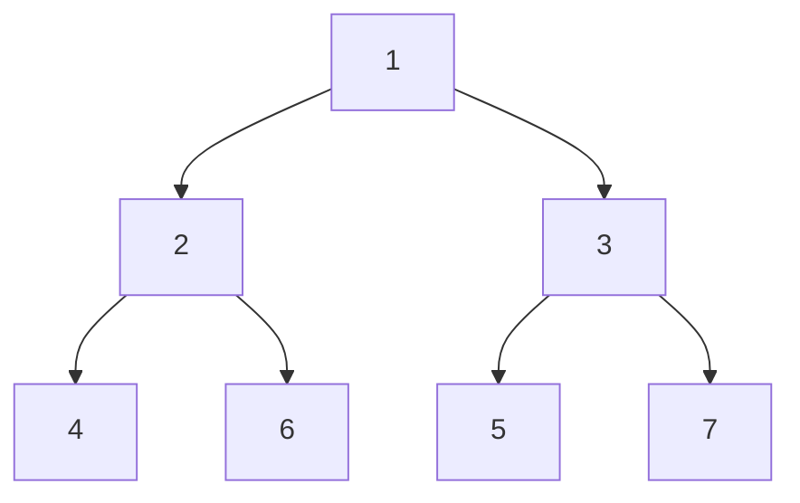

# Chia Lisp For Bitcoiners

ajtowns | 2024-03-04 02:46:38 UTC | #1

I want to talk [some](https://lists.linuxfoundation.org/pipermail/bitcoin-dev/2022-March/020036.html) [more](https://lists.linuxfoundation.org/pipermail/bitcoin-dev/2023-October/022099.html) about doing a Lisp variant for script on Bitcoin, but before I do that in detail, I figure it's probably helpful to do a summary of what [Lisp looks like on the Chia blockchain](https://chialisp.com/), since that already has good answers for many of the questions that come up. If that sounds interesting, read on; if not, maybe remember this post exists so you can refer back to it later when I treat it as assumed knowledge in posts that do sound interesting!

This writeup assumes you're familiar with Bitcoin and [Bitcoin Script](https://en.bitcoin.it/wiki/Script), but not with [Chia](https://en.wikipedia.org/wiki/Chia_(cryptocurrency)) or [Lisp](https://www.buildyourownlisp.com/). It takes a very bottom up approach, and doesn't go into any real detail about what any of this makes possible.

For those who are familiar with Chialisp, note that I'm mostly talking about the behaviour of [clvm](https://chialisp.com/clvm/) (ie what's implemented in consensus and seen on-chain in chia), rather than Chialisp per se (ie, the syntax you use to write complicated programs that then gets compiled down to clvm).

<div data-theme-toc="true"> </div>

## Why?

Why is this worth thinking about at all? After all, Bitcoin script is a great little language, essentially a tiny stack based RPN calculator, that's robust enough to be ready to replace central bank clearing houses, with enough programmability to do a bunch of neat things. But from a programmer's perspective, there are two things that as a language it can't do well: looping and structured data.

Not being able to do a loop natively means that scripts that do the same thing repeatedly quickly become cumbersome, for example the [Lamport Sigs and CAT tricks](https://delvingbitcoin.org/t/lamport-signatures-and-other-cat-tricks/236) design has 20 steps each involving an 8 level merkle tree that need to be spelt out separately, rather than just having two loops -- so 160 steps that should just be one in a loop. There's been thoughts about adding constructs that could enable looping to bitcoin script in the past, eg [BIP 12 OP_EVAL](https://github.com/bitcoin/bips/blob/b3701faef2bdb98a0d7ace4eedbeefa2da4c89ed/bip-0012.mediawiki) and [BIP 117 Tail Call Semandtics](https://github.com/bitcoin/bips/blob/b3701faef2bdb98a0d7ace4eedbeefa2da4c89ed/bip-0117.mediawiki), both of which are explicitly limited to disable looping, or [OP_FOLD](https://lists.linuxfoundation.org/pipermail/bitcoin-dev/2022-February/020021.html).

Not being able to natively deal with structured data isn't as big a problem: you can work around it by using the various stack rotation opcodes and moving things on and off the alt stack, however that becomes annoying to actually do in practice. For example, a few of the recent script proposals suggest modest changes to imply a little more structure: eg,
 * [OP_VAULT](https://github.com/bitcoin/bips/pull/1421) allows you to specify a number of items that will be encoded as minimal pushes and prefixed to the provided `leaf-update-script-body`,
 * [OP_SEGMENT](https://rusty.ozlabs.org/2024/01/04/OP_SEGMENT.html) proposes introducing a code-separator like opcode that does nothing itself, but is used to separate out the impact of `OP_SUCCESSx` behaviour, so that script fragments can be manipulated within script itself
 * there is a [proposal being tossed around](https://twitter.com/reardencode/status/1760324791343665396) for CHECKSIGFROMSTACK to also allow specifying up to 16 additional bits of message data, that will be hashed and combined for the actual signature verification operation occurs

The approach Chia Lisp takes addresses both these limitations in perhaps the simplest way possible:

 * it adds an "apply" opcode (`a`) that allows for recursion and hence can be used for looping; and
 * it replaces the concept of a stack with that of a binary tree -- any element can either be a leaf node (aka an "atom") that is just a byte string (the same as stack elements now), or it can be a branch and contain a pair of elements (aka a "cons"), which are themselves either branches or leaves.

As is usual for Lisp, programs are then encoded in that same data structure, allowing the program itself to be introspected using the same operations that allow manipulating any other data structure.

## Making Lists

Lisp is known for its lists, though, not for binary trees, so the above may seem slightly surprising. It's fairly simply resolved however: lists are constructed recursively, where the first element in the list is put on the left side of a cons, and the rest of the list is put on the right side, and the empty list is defined as the empty byte vector, also known as "nil". We have special notations for this:

 * `()` is the empty list aka the empty byte vector
 * `(a . b)` indicates a cons or branch element with `a` on the left and `b` on the right.
 * `(a b c d)` indicates a list of four elements, equivalent to `(a . (b . (c . (d . ()))))`
 * `(a b c d . e)` indicates a "dotted" list, which ends with `e` instead of an implicit `nil`, ie is the same as `(a . (b . (c . (d . e))))`.

This means that `(a b . (c d))` is just an alternative way of writing `(a b c d)`.

If you keep taking the righthand side of each cons until you come to an atom (ie a byte vector, aka a leaf node), then either the byte vector is empty, and you have a normal list, called a "proper list", or it's a non-empty byte vector, and you have what's called an "improper" list.

For anyone like me who has heard about [`car` and `cdr`](https://en.wikipedia.org/wiki/CAR_and_CDR) but didn't know what they meant, `car` just means take the left side of the pair, and `cdr` just means take the right, and they come from implementation details from the original Lisp. Better, in my opinion, to call them "head" and "tail" (as is usual in other [functional](https://hackage.haskell.org/package/base-4.19.1.0/docs/Data-List.html) [languages](https://www.scala-lang.org/api/current/scala/collection/immutable/List.html)), or as Common Lisp and Chia Lisp do, "first" and "rest".

## Having opcodes operate on lists

It then becomes fairly straightforward to extend opcodes to operate on a list of arguments: eg, rather than `OP_ADD` taking exactly two things off the stack and adding them together, we can have the `+` opcode expect a list of values that it will add together. Then we just put the opcode and its arguments together as a pair, ie `(+ . (1 2 3))`, but of course, as we just established, that's the same as writing `(+ 1 2 3)`, and that becomes our general notation for expressions in our programs.

## The environment

We want to be able to write programs that are applied to some "user input", so the way we do that is we have something called the "environment", which the program can access. The environment is just another list (or binary tree), but we have a clever way of accessing any part of it just via an integer. In particular, we say that `1` gets us the whole thing verbatim; `2` gets the left side, `3` gets the right side, `4` gets the left side of the left side, `6` gets the right side of the left side, etc.



The general procedure is:

```python
def get_env(n, e):
  if n == 0: return nil
  while n > 1:
    if n % 2 == 0:
      e = e.left
    else:
      e = e.right
    n //= 2
  return e
```

So if the environment is the list `(1 2 3)` then `get_env(2, env)` gives 1, `get_env(5, env)` gives 2, `get_env(11, env)` gives 3, and `get_env(15, env)` gives the final nil.

Thus if you want the program "(a*b)+c" you can write that as `(+ (* 2 5) 11)`, and the numbers will be treated as environment lookups, so if the environment is `(1 2 3)` the result will be `(1*2)+3=5`.

## Quoting

What if you want to triple a number (multiply by 3), rather than multiply by whatever the user inputs? In that case you can "quote" values, to avoid resolving them either from an environment lookup or evaluating them as an expression. This involves a special opcode, `q`, which has special evaluation rules compared to every other opcode. Its behaviour is quite simple: its result is just its argument passed through without any evaluation. It's also special in that it doesn't necessarily expect a proper (nil-terminated) list for its argument.

So if you instead of `(a*b)+c`, you want to calculate `(a*b)+(3*c)`, you can write that as `(+ (* 2 5) (* (q . 3) 11)`.

## Evaluation

At a high level, then, the logic for evaluating a program is therefore:

 * If the program is an atom, treat it as representing a number, and lookup the environment based on that number. The answer is the result of the program.
 * If the program is a cons, take the front (left) and call it the opcode, and take the rest (right) and call it the arguments
   * If the opcode is not an atom, or the cons of an atom and nil, fail. If the atom does not match a known opcode, fail (or, in non-strict mode, treat as no-op and evaluate as nil).
   * If the opcode is `q` (ie the one-byte atom 0x01), return the arguments verbatim
   * Otherwise, evaluate the arguments:
      * If it's nil, stop
      * Otherwise if it's a cons, recursively evaluate the first (left) element as a program, and fee that into the opcode, then continue with the rest (right element).
      * If it's not nil or a cons, error.
    * Return the result of feeding the processed arguments into the opcode.

Note that this is an "eager-evaluation" approach: eg the "if-then-else" opcode (`i`) accepts three arguments, a "condition", a "then" value and an "else" value, however it does not short-circuit, so whether or not the condition is true, both the "then" and "else" values will be calculated, even though one or the other will be immediately discarded. That becomes important if you're doing recursive/looping constructs, and when evaluating the execution cost of the program.

Also note that numbers in Chialisp are represented as signed, 2's-complement big-endian (more or less the opposite of Bitcoin's little-endian with a sign-bit approach). Numbers can be arbitrarily large, they're not limited to 4bytes or 64, 128 or 256bits, but rather they're limited by the overall cost of evaluating the program as a whole.

## Opcodes

As well as `q`, there are a bunch of other opcodes:

| opcode (name) | arguments | atom value | description |
| --- | --- | --- | --- |
| `q` (quote) | ... | 0x01 | special, return arguments unevaluated
| `a` (apply) | A B | 0x02 | evaluate A as a program with environment B
| `i` (if) | C T E | 0x03 | if C is not nil, then T, otherwise E
| `c` (cons) | L R | 0x04 | produce a cons element with L and R as left and right
| `f` (first) | C | 0x05 | return the left element of C, fail if C is an atom
| `r` (rest) | C | 0x06 | return the right element of C, fail if C is an atom
| `l` (listp) | X | 0x07 | return 1 if X is a cons, nil otherwise
| `x` (raise) | ... | 0x08 | fail the program immediately
| `=` (eq) | *A *B | 0x09 | return 1 if A B are both atoms are equal, nil otherwise
| `>s` (gr_bytes) | *A *B | 0x0a | return 1 if A is greater than B when both are interepreted as byte strings, nil otherwise
| `sha256` | *A *B *C ... | 0x0b | calculate the sha256 of the concatenation of the arguments
| `substr` | *A *B *C | 0x0c | return the substring of A between B and C
| `strlen` | *A | 0x0d | return the length of A
| `concat` | *A *B *C ... | 0x0e | return an atom concatenating all the arguments
| `+` (add) | *A *B *C ... | 0x10 | return A+B+C
| `-` (subtract) | *A *B *C ... | 0x11 | return A-B-C
| `*` (multiply) | *A *B *C ... | 0x12 | return A * B * C
| `/` (div) | *A *B | 0x13 | return A / B
| `divmod` | *A *B | 0x14 | return the pair A/B and A%B
| `>` (gr) | *A *B | 0x15 | return 1 if A is greater than B when both are interpreted as numbers, nil otherwise
| `ash` | *A *B | 0x16 | return the value of A arithmetically shifted by B bits (ie with sign extension)
| `lsh` | *A *B | 0x17 | return the value of A logically shifted by B bits (ie treated as unsigned)
| `logand` | *A *B *C ... | 0x18 | bitwise and of A, B, C (follows python behaviour for & of negative values)
| `logior` | *A *B *C ... | 0x19 | bitwise inclusive-or of A, B, C
| `logxor` | *A *B *C ... | 0x1a | bitwise exclusive-or of A, B, C
| `lognot` | *A | 0x1b | bitwise inversion of A
| `point_add` `g1_add` | *P1 *P2 ... | 0x1d | BLS12-381 addition of G1 points (renamed in CHIP-11)
| `pubkey_for_exp` | *A | 0x1e | BLS12-381 create a G1 point (multiply the generator by A)
| `not` | A | 0x20 | return 1 if A is nil, return nil otherwise
| `any` | A B C ... | 0x21 | return 1 if any of A B C.. is not nil; return nil otherwise
| `all` | ... | 0x22 | return 1 if none of A B C... are nil; return nil otherwise
| `softfork` | *C *E P A | 0x24 | evaluate P with environment A (like `a` opcode) but with new behaviour defined by E, and a cost of C

Arguments marked with an asterisk are required to be atoms: if a cons is provided instead the program fails immediately. (Note that this restriction is only applied after the argument is evaluated, though)

In addition, these opcodes are added by [CHIP-11](https://github.com/Chia-Network/chips/blob/b096b5735989b243f7c2dec8533aa0080d084dc8/CHIPs/chip-0011.md); initially via the `softfork` operator with extension 0, but after the [CHIP-12 hardfork](https://github.com/Chia-Network/chips/blob/b096b5735989b243f7c2dec8533aa0080d084dc8/CHIPs/chip-0011.md), also directly, as if they'd always been there.

| opcode (name) | arguments | atom value | description |
| --- | --- | --- | --- |
| `coinid` | *PARENT *PUZHASH *AMOUNT | 0x30 | Return the coinid given the parent coin, puzzle hash and amount; fail if any of those arguments are invalid/non-canonical
| `g1_subtract` | *A *B *C ... | 0x31 | BLS12-381 subtraction of G1 points (A-B-C)
| `g1_multiply` | *P *S | 0x32 | BLS12-381 multiplication of G1 point P by scalar S
| `g1_negate` | *P | 0x33 | BLS12-381 negation of a G1 point P
| `g2_add` | *A *B *C ... | 0x34 | BLS12-381 addition of G2 points
| `g2_subtract` | *A *B *C ... | 0x35 | BLS12-381 subtraction of G2 points (A-B-C)
| `g2_multiply` | *P *S | 0x36 | BLS12-381 multiplication of G2 point P by scalar S
| `g2_negate` | *P | 0x37 | BLS12-381 negation of a G2 point P
| `g1_map` | *DATA *DST | 0x38 | Map arbitrary data (by hashing it) to a BLS12-381 G1 point with optional domain separation tag
| `g2_map` | *DATA *DST | 0x39 | Map arbitrary data (by hashing it) to a BLS12-381 G2 point with optional domain separation tag
| `bls_pairing_identity` | *G1_1 *G2_1 *G1_2 *G2_2 ... | 0x3a | Return nil if the pairing of all given pairs is the identity, otherwise fail
| `bls_verify` | *G2 *G1_1 *M1 *G1_2 *M2 ... | 0x3b | Return nil if the signature (G2) is valid for the combination of the messages (Mn) and public keys (G1_n)
| `modpow` | *B *E *M | 0x3c | Returns B raised to the power E, modulo M
| `SOFTFORK` | *C [unspecified] | 0x5a | For allowing future upgrades to the classes of conditions a Chialisp program can return
| `secp256k1_verify` | *P *M *S | 0x13d61f00 | ECDSA signature check (pubkey P, message digest M, signature S) via secp256k1
| `secp256r1_verify` | *P *M *S | 0x1c3a8f00 | ECDSA signature check (pubkey P, message digest M, signature S) via secp256r1

One thing worth noting there is that unlike in bitcoin, very few opcodes are dedicated to control flow and data manipulation: just `q`, `a`, `i`, `c`, `f`, `r`, `x` (7); as compared to `if`, `notif`, `else`, `endif`, `verify`, `return`, `toaltstack`, `fromaltstack`, `ifdup`, `depth`, `drop`, `dup`, `nip`, `over`, `pick`, `roll`, `rot`, `swap`, `tuck`, `2drop`, `2dup`, `3dup`, `2over`, `2rot`, `2swap` (25). In effect, the ability to easily access any part of the environment just by using an integer to specify its location gives an arbitrarily large number of "stack access" opcodes.

## The softfork operator

Instead of either a range of upgradable NOP opcodes or taproot's `OP_SUCCESSx`, Chia lisp has a single `(softfork ...)` wrapper function. This accepts four arguments:
 * a program and environment that will be interpreted in a similar way as the arguments for the `(a ...)` opcode would be, except with new behaviour defined in a soft fork
 * a code identifying the soft fork(s) that should be applied to the program
 * the expected total cost of evaluating the program (so that the consensus critical cost of the program can be correctly calculated even by older software that does not implement the specified soft fork behaviour)

This is essentially an extended `OP_NOP` -- the result of the softfork opcode is always nil, so the only additional behaviour that can be implemented within a softfork program is to fail the script entirely, which is exactly the same as when introducing new functionality to Bitcoin script via `OP_NOP` opcodes. Where it differs is that it is easy to provide complicated arguments to `(softfork)` in lisp, that can include a whole program with many new opcodes; doing the same in Bitcoin script is not as simple, simply because you'd need to define a new way of specifying those complicated arguments.

## Conditions

One thing you may note is that Chia's original list of opcodes doesn't include a "checksig" equivalent. That is because rather than Bitcoin Script's approach of returning a boolean as to whether the script succeeded or the transaction is invalid, Chialisp takes the approach of returning a set of ["conditions"](https://chialisp.com/conditions/) that need further validation, generally in the context of the block of transactions. This includes (aggregated) signature validation, but can also includes requirements like "this coin must also be spent simultaneously".

I'm not going to go into any detail about this behaviour, because most of it doesn't map easily onto Bitcoin, and it's essentially a separate layer to the lisp scripting in any event.

## Recursion and looping

What does looping look like given these primitives? Consider the normal example, calculating a factorial:

 * `f(1) = 1`
 * `f(n+1) = (n+1) * f(n)`

The [clvm implementation of that](https://github.com/Chia-Network/clvm_tools/blob/b78d414703fe9a0c1cb3f81a8ad9b42a33768dd8/README.md?plain=1#L50) looks like:

 * `(a (q a 2 (c 2 (c 5 ()))) (c (q a (i (= 5 (q . 1)) (q 1 . 1) (q 18 5 (a 2 (c 2 (c (- 5 (q . 1)) ()))))) 1) 1))`

That breaks down somewhat like:

 * `(a (q . PROGRAM) (ENV))` - run PROGRAM with environment ENV 
 * `PROGRAM = (a 2 (c 2 (c 5 ())))` - run the program in slot 2 of the environment, in the context of a new environment (that's pretty much the same as the existing one)
 * `ENV = (c (q . APPLYIF) 1)` -- create a new environment with APPLYIF in slot 2, and the current environment in slot 3
 * `APPLYIF = (a (i (= 5 (q . 1)) (q q . 1) (q * 5 (a 2 RECURENV)) 1)` -- check if the value in slot 5 is 1, if it is evaluate as `(a (q . 1))`, if it's not evaluate as a recursive call, `(a (* 5 (a 2 RECURENV)) 1)`. The `(a (i X (q . Y) (q . Z)) 1)` pattern allows you to have a short-circuiting if, despite the `i` opcode not having that behaviour natively.
 * `RECURENV = (c 2 (c (- 5 (q . 1)) ())))` -- recursive step changes to arguments: 2 stays the same, 5 has 1 subtracted from it, 7 is nil

## Compiling

Putting the values into the right place in the environment, and ensuring they're quoted correctly involves a lot of fiddling, as you can see by all the `c` and `q` invocations, and getting those things right manually is pretty hard. That brings us to the difference between "Chialisp" and "clvm". Compared to the clvm code for factorial shown above, the [Chialisp](https://chialisp.com/modern-chialisp/) code for factorial looks like a much more normal functional program:

```lisp
(mod (INDEX)
    (defun factorial (VALUE)
        (if (= VALUE 1) 1 (* VALUE (factorial (- VALUE 1))))
    )
    (factorial INDEX)
)
```

Some points from the above:

 * `defun` allows you to define (possibly recursive) functions, that can be treated like opcodes, rather than having to manually invoke them with the `a` opcode
 * Unlike with clvm, you don't have to quote numbers; you use names when you want to access the environment, and the compiler figures out where in the environment to put them. Obviously, the compiler quotes those numbers when translating into clvm code. (You can use `@` to access the environment directly if you don't want to use names for some reason)
 * `if` is a macro that supports short-circuiting, unlike the `i` opcode

One caveat that may be worth noting is that chialisp often does not check that additional arguments aren't provided. For example with the code for "factorial" above, the generated clvm code will correctly calculate `120` as the result when presented with the input `(5)`, and given an `= on list` type error if presented with `((10))` or a `path into atom` error if presented with `5`, but it will also produce the result `120` if given the extended list `(5 13)` -- it only grabs the value 5 from the left hand side of the cons, it doesn't also check that the right hand side of the cons in nil, it just ignores it entirely. This creates a third party malleability vector; however while that may be a problem in the Bitcoin context (it would decrease the tx's effective feerate, making it less attractive to mine, and would introduce a conflicting wtxid which may be confusing), it perhaps isn't much of a problem in Chia's context (as bundling gives the opportunity to optimise unreferenced atoms out anyway).

There are a variety of other features available at that higher level, including the ability to `include` code from other files, and it's possible to add or change the supported features arbitrarily without requiring consensus changes. In some sense you might consider chialisp as similar to the miniscript policy language, while clvm code is similar to miniscript/script code.

## Encoding

As you may expect, clvm programs/data are represented over the wire in a binary format, rather than an ascii one. It's a fairly straightforward encoding:

| first byte | extra bytes | meaning |
| --- | --- | --- | 
| `b0xxx_xxxx` | | the one byte atom with the same value
| `b1000_0000`  | | the zero byte atom (nil)
| `b10xx_xxxx`  | | 1-63 byte atom follows
| `b110x_xxxx` | 1 | 0-8,191  byte atom follows
| `b1110_xxxx` | 2 | 0-1,048,575  byte atom follows
| `b1111_0xxx` | 3 | 0-134,217,727  byte atom follows
| `b1111_10xx` | 4 | 0-17,179,869,183  byte atom follows
| `b1111_110x` | | invalid
| `b1111_1110` | | invalid
| `b1111_1111` | | cons elements follow

This format does mean there are multiple encodings of the same data: eg the single byte atom `0x42` can be encoded as a single byte `0x42`, or as two bytes `0x8142`, or as three bytes `0xc00142`, etc.

It also may not be well optimised for its use case: each list requires a `0xff` cons marker for each entry in the list, and a `0x80` nil terminator; it may have been better to have linear overhead for megabyte or gigabyte length atoms, rather than linear overhead for even small lists.

Compared to Bitcoin script, clvm here has a lower overhead for one-byte constants greater between 17 and 127 (inclusive), but higher overhead for 64-75 byte pushes. The latter impacts signatures for Bitcoin, though does not impact signatures for Chia: BLS12-381 signatures are ~96 bytes in length anyway, and because it supports pairing, signatures are designed to be aggregated together into a single signature per block anyway, and an additional byte of overhead per block rather than per spent coin is pretty immaterial. That has a moderate impact: the cost limit for chia blocks implies a limit of up to 920kB of data per block (and much less when you add in actual signature verification etc), and is measured against this serialization, so wasted bytes do matter somewhat.

## Costs

Speaking of costs: [carefully accounting for costs](https://chialisp.com/costs/) is how chialisp allows flexible computation primitives without introducing the same denial-of-service attack vectors that caused a range of Bitcoin script's original opcodes to be disabled.

The overall block cost limit is 11e9; each opcode then has a cost made up of three components: a fixed cost per operation, a per-argument cost, and a per-byte cost. So `(* 0x10 0x2000 0x400000)` has three arguments, and six bytes, eg. Futher there is an additional cost dependant on the size of the returned valued. Finally the conditions resulting from a script also have significant costs (as these are what result in coins being spent/created and signatures being verified). Finally, there is a per-byte cost simply for encoding the script in the first place.

One non-obvious difference is that in Bitcoin, we have a stack size limit of 1000 and an element size limit of 520 bytes, so that the program's data is limited to taking about 500kB of memory at any point in time (though various overheads can make this a little larger). By contrast, Chia largely does not have a point-in-time runtime limit, but rather a total compute limit. This means it largely doesn't make your program any cheaper if you design it so memory can be freed earlier.

I think an example of a program that uses lots of memory but still fits within Chia's cost budget is:

```lisp
(mod (C) 
    (defun double (N X) (if (> N 0) (double (- N 1) (concat X X)) X))
    (double C "foo")
)
```

which just doubles the string "foo" however many times you ask it to. If you say "double it 26 times", that would result in a 200MB string, with a calculated cost of 5,234,558,878 which is slightly below the half the 11e9 limit for a block (mempool transactions are limited to half the block cost).

## Bundles

Another non-obvious difference between Chia and Bitcoin costs is due to [spend bundles](https://docs.chia.net/spend-bundles/). This is in many ways a natural consequence of supporting automatic signature aggregation: rather than transactions remaining separate, they're combined into bundles, and their signatures are aggregated. However, at the same time the signature is aggregated, their lisp scripts are also bundled together, which can then allow some further optimisation: eg if many coins have the same script just with different public keys, you could have the script be a template, and reuse it via a loop for each coin that it corresponds with.

The downside of this seems to me to be twofold:
 * it makes it harder to reuse the cache of validated transactions from your mempool to speed up block validation
 * it makes block assembly more complicated, and in a highly competitive environment, may increase centralisation pressure and become a vector for censorship

So while this is neat, I don't really think it's interesting enough to try retrofitting into Bitcoin, and am pretty much ignoring it as a feature.

## Tooling

In order to mess around with clvm/chialisp, [chia-dev-tools](https://github.com/Chia-Network/chia-dev-tools/) seems to be the main starting point; following the pip install there gives you `run` (a chialisp compiler that generates clvm code), `brun` (a clvm interpreter that executes clvm code), and `cdv` (which does fancy stuff much of which I don't understand and haven't looked at). I haven't found any online tools that you can use to compile/test/debug code online without installing software locally. There's also a [rust implementation](https://github.com/Chia-Network/clvm_rs), which is definitely preferable.

## Defects

Perhaps an interesting thing to look at is what defects have been found in the clvm since it's launch, and how they were addressed. Examples I'm aware of:

 * [Inconsistent division results](https://www.chia.net/2022/03/04/divided-we-fork/) was a bug where the `div` operator didn't behave as expected for negative values, fixed by making negative division invalid, recommending usage if the `divmod` operator instead in the rare cases where it might be desired. 
 * [CATbleed](https://github.com/Chia-Network/post-mortem/blob/7889789f8ea6ae74a0783dbbb64845c2ea012930/2022-08/2022-08-19-CATbleed.md) was a smart contract programming error (insufficient checking of inputs to a hash function allowing different input sets to result in the same hash), fixed by updating the smart contract to a new version, and mitigated for the future by introducing a new [coinid opcode](https://github.com/Chia-Network/chips/blob/b096b5735989b243f7c2dec8533aa0080d084dc8/CHIPs/chip-0011.md#coinid) that does all the checks directly. (CAT here refers to "Chia Asset Tokens", and isn't related to `OP_CAT`)
 * [Excessive recursion](https://github.com/Chia-Network/post-mortem/blob/7889789f8ea6ae74a0783dbbb64845c2ea012930/2023-01/2023-01-31-CLVM-infinite-recursion.md) via a bug where internal stack usage didn't contribute to the cost calculation so wasn't effectively limited; fixed by adding a stack depth limit
 * Missing functionality: as noted above [CHIP-11](https://github.com/Chia-Network/chips/blob/b096b5735989b243f7c2dec8533aa0080d084dc8/CHIPs/chip-0011.md) adds a bunch of opcodes, covering directly doing ECC operations on the BLS12-381 curve, as well as ECDSA signature checking on secp256k1 and secp256r1, modular exponentiation, and a mod operator that doesn't require an extra step to drop the division result.
 * Missing functionality: [CHIP-11](https://github.com/Chia-Network/chips/blob/b096b5735989b243f7c2dec8533aa0080d084dc8/CHIPs/chip-0011.md) and [CHIP-14](https://github.com/Chia-Network/chips/blob/b096b5735989b243f7c2dec8533aa0080d084dc8/CHIPs/chip-0014.md) add some conditions, namely (for CHIP-11) various new signatures committing to only part of the coinid, and (for CHIP-14) reverse timelock conditions (must be spent prior to ...), concurrent spend conditions (must be spent in the same block as ..., and creation assertions (coin being spent was created at ...).

## Conclusion

Anyway, I think that covers all the key features of clvm/chialisp in reasonable detail, as long as you're not actually trying to develop actual chia scripts/contracts (in which case you need to know how conditions work in at least some detail).

Note that I'm not an expert in lisp/clvm/chialisp, and have more focused on the design/potential than the details per se, so there may be errors in my understanding and/or description. No warranty, etc.

-------------------------

josibake | 2024-03-04 12:51:37 UTC | #2

This is a really cool idea, thanks for the detailed writeup! From the linked discussions, this point resonated with me:

> A particular advantage of lisp-like approaches is that they treat code
and data exactly the same -- so if we're trying to leave the option open
for a transaction to supply some unexpected code on the witness stack,
then lisp handles that really naturally: you were going to include data
on the stack anyway, and code and data are the same, so you don't have
to do anything special at all

Its also really nice to already have real-world usage, devtooling, known bugs, etc with chialisp.

Would we be able to take advantage of Formal Verification tooling that exists for LISP? You mention "lisp-variant," which makes me feel like the answer is no, but figured I'd mention it.

-------------------------

