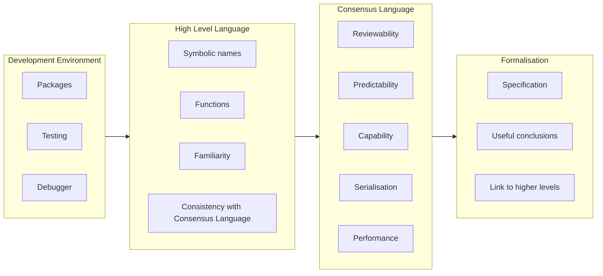

# BTC Lisp as an alternative to Script

ajtowns | 2024-03-14 12:51:49 UTC | #1

This is a continuation from my post on [Chia Lisp](https://delvingbitcoin.org/t/chia-lisp-for-bitcoiners/636). It maintains the bottom-up theme, so again, if this doesn't strike you as innately interesting, maybe just remember that this topic exists so you can refer back to it later as useful background material when we do finally get to something interesting.

<div data-theme-toc="true"> </div>

## Background

So on and off over the past couple of years I've been poking at what it might look like to have some form of lisp available as an alternative to script, mostly in the form of hackish python code that I call [btclisp.py](https://github.com/ajtowns/lisp-play/blob/916d22c7bc322f66abed361e96e6e991a597173a/btclisp.py). It's mostly designed as a learning tool for me, the idea being to help me figure out answers to questions like:

 * What sort of features are possible if you had Lisp as a transaction language?
 * Do the ideas that seem fine in theory turn out to work or fail when you try them in practice?
 * How annoying is it to implement/maintain/upgrade a Lisp interpreter?
 * How annoying is it to write code in Lisp?

It might be useful context to know that while I'm familiar with functional programming (having dabbled in haskell, hope, coq, lean4), I've never done anything with lisp before (not even emacs lisp). My main sources of inspiration here are Daniel Holden's [Build Your Own Lisp](https://www.buildyourownlisp.com/) and, as mentioned, Chia Lisp.

## Scope

My idea here is fairly simple: what if we made a Lisp that was a drop-in replacement for [BIP 342 tapscript](https://github.com/bitcoin/bips/blob/b3701faef2bdb98a0d7ace4eedbeefa2da4c89ed/bip-0342.mediawiki)? That is, introduce a new tapleaf version, so that when that's used, the taproot script is decoded into a lisp expression, the remaining witness data is stuffed into the environment, and the lisp expression is evaluated, with the result that the transaction is invalid if the evaluation fails, and is valid otherwise.

Some things are out of scope, eg:

 * Changing the UTXO database -- Chia's coin set model has different information in its database compared to Bitcoins UTXO set model, which allows for some clever structures. We're not considering that here, since it requires changing the UTXO database, and that is a much more significant change than adding a new tapleaf version.
 * Having scripts interact -- various features of Chia's model allows scripts to interact: conditions allow a script to require that some other script in the same block created or spent a coin; spend bundles allow scripts from different coins to potentially be combined and duplicated; signature aggregation allows signatuers to be, uh, aggregated; and the [`transactions_generator_ref_list`](https://docs.chia.net/block-format/) feature even lets you pull in historical scripts from earlier blocks so you can cheaply reuse code or data from those scripts. All of that is also out of scope.
 * Changing how a tx is treated as a result of the program -- Chia's scripts are often only the first step in validation: eg, in Chia you don't know how much "space" a transaction will take up in the block until you evaluate the script, as calculating the cost is a side effect of evaluating the script, and the result of evaluating a script in chia is a set of constraints that also need to be fulfilled by the block. The aim here is not to do that, so that running the script only results in a boolean result, ie "valid" or "invalid", and any other information (such as weight/cost, timelocks, relationships with other txs) should be available prior to script evaluation.

None of this is to say that those ideas are necessarily bad, though: just that I'm treating them as out of scope here. That is, this is just about exploring the possibility of using lisp as a tapscript alternative, not more complex changes.

## Summary

As you might expect, I ended up repeating most of the same design decisions that resulted in Chia lisp, so I'm only going to describe the differences here. Conveniently, there's already another post that discusses [Chia Lisp](https://delvingbitcoin.org/t/chia-lisp-for-bitcoiners/636) -- how convenient!

## Opcodes

So let's start with a run through of the opcodes that I roughly ended up with.

| Opcode | Value | Args | Chia | Description |
|----|----|----|----|----|
| `q` (quote) | 0x00 | ... | `q` | special, return arguments unevaluated
| `a` (apply) | 0x01 | P ENV... | `a` | build ENV... args into an environment, run P in that environment
| `x` (exception) | 0x02 | ... | `x` | fail the program (provides args as error message when debugging)
| `i` (if) | 0x03 | C T E | `i` | if C is not nil, return T, otherwise E
| `sf` (softfork) | 0x04 | M P ENV... | `softfork` | similar to `a`, but with new evaluation rules defined b y M, always evaluates to nil
| `c` (cons) | 0x05 | H T | `c` | build a cons element with H and T
| `h` (head) | 0x06 | L | `f` | return the head element of L, fail if L is not a cons
| `t` (tail) | 0x07 | L | `r` | return the tail element of L, fail if L is not a cons 
| `l` (list?) | 0x08 | X | `l` | return 1 if X is a cons, or nil if X is an atom
| `b` (bintree) | 0x20 | ENV... | | construct a balanced, left-biased binary tree consisting of each of the arguments
| `not` (nand) | 0x09 | A B ... | `not` | if all of A, B.. are nil return 1, else return nil
| `all` | 0x0a | A B ... | `all` | if any of A, B... are nil return nil, else return 1
| `any` | 0x0b | A B ... | `any` | if all of A, B... are nil return nil, else return 1
| `=` (eq) | 0x0c | A B C ... | `=` | if all of B, C... equal A return 1, else nil
| `<s` (lt_str) | 0x0d | *A *B *C ... | `>s` | if A is less than B (lexicographically), C is less than B, etc return 1, else nil
| `strlen` | 0x0e | *A *B ... | `strlen` | return the sum of the lengths of A, B, etc
| `substr` | 0x0f | *A *B *E | `substr` | return the substring of A, starting at position B, ending at position E; if B is missing return A, if E is missing, treat it as `(strlen A)`
| `cat` | 0x10 | *A *B ... | `concat` | return a new atom with A, B, etc concatenated together` |
| `~` (nand_u64) | 0x11 | *A *B ... | `lognot` | treat the values as u64, and nand them together
| `&` (and_u64) | 0x12 | *A *B ... | `logand` | treat the values as u64, and and them together
| `\|` (or_u64) | 0x13 | *A *B ... | `logior` | treat the values as u64, and or them together
| `^` (xor_u64) | 0x14 | *A *B ... | `logxor` | treat the values as u64, and xor them together
| `+` (add) | 0x17 | *A *B ... | `+` | add A, B, etc together
| `-` (sub) | 0x18 | *A *B ... | `-` | subtract B, ... from A
| `*` (mul) | 0x19 | *A *B ... | `*` | multiply A, B, ... together
| `%` (mod) | 0x1a | *A *B | `%` | return remainder of A after division by B
| `/%` (divmod) | 0x1b | *A *B | `divmod` | return a pair, ((/ A B) . (% A B))
| `<<` (lshift) | 0x1c | *A *B | `lsh` | shift A left by B
| `>>` (rshift) | 0x1d | *A *B | `lsh` | shift A right by B (two opcodes needed since B is treated as unsigned)
| `**%` (modexp) | | *N *E *M | `modpow` | return N raised to the power E modulo M
| `<` (lt_le) | 0x1e | *A *B *C ... | | if A is less than B (treated as unsigned little endian), B is less than C, etc return 1, else nil
| `log2b42` | 0x1f | *A | | calculates $\log_2(A) * 2^{42}$
| `rd` (read) | 0x22 | *A | | deserializes byte string A into a lisp expression
| `wr` (write) | 0x23 | A | | serializes lisp expression A into a byte string
| `sha256` | 0x24 | *A *B ... | `sha256` | produces the sha256 hash of the concatenation of A, B, etc
| `ripemd160` | 0x25 | *A *B ... | | produces the ripemd160 hash of the concatenation of A, B, etc
| `hash160` | 0x26 | *A *B ... | | produces the ripemd160 hash of the sha256 of the concatenation of A, B, etc
| `hash256` | 0x27 | *A *B ... | | produces the double sha256 hash of the concatenation of A, B, etc
| `bip340_verify` | 0x28 | *K *M *S | | performs the BIP 340 verification function on key K, message M, signature S, returns 0 if S is nil, fails the script if the verification fails, otherwise returns 1
| `ecdsa_verify` | 0x29 | *K *M *S | `secp256k1_verify` | performs ECDSA verification of key K, message M, signature S
| `secp256k1_muladd` | 0x2a | A B ... | | check that A+B+... sum to the point at infinity. fail the program if not, return 1 otherwise. (see below for details)
| `tx` | 0x2b | A B ... | | return information about the tx (see below for details)
| `bip342_txmsg` | 0x2c | *SIGHASH | | calculate the signature message for the tx per BIP 342, given an optional SIGHASH byte

Asterisks mark arguments that must be atoms. This gives about 45 opcodes total, though not all of them are implemented in btclisp.py at all, and some that are are implemented incorrectly -- it's a learning tool after all: the reader needs some exercises!

Some details on some of the above:

### Quoting

Actually, one thing I'll note first: my expression parser allows abbreviating `(q . x)` as `'x`. No big deal, but it makes things easier to write, so I'll make use of that abbreviation below.

### Environment trees

[Chia-style environment structuring](https://www.youtube.com/watch?v=XbZ8zDpX2Mg) is pretty neat, but it's more optimal if your environment is structured as a binary tree, rather than a list -- with a list, each element is put in position 2, 5, 11, 23, 47, 95, etc, with each subsequent position being $p_{n+1} = 2p_n+1$, effectively doubling the value each time. But if done with a small binary tree instead, you only need values up to $2n$ (well, $2^{\lceil \log_2(2n) \rceil}$), so 6 elements could be instead encoded as 8, 12, 10, 14, 5, 7. Whether that really matters is debatable, however at some point serializing a reference to a larger number becomes less efficient that a smaller number would be, so optimisation here has some potential to be useful.

In any event, I implemented this behaviour for the ENV... parameters in the `a` opcode, and via the `b` opcode: in both cases, if you provide those operators 4 arguments, they'll convert that list into a balanced tree of conses, going from `(a b c d)` to `((a . b) . (c . d))`. If the `sf` opcode were implemented, the same behaviour would apply there too.

### ECC calculations

The `secp256k1_muladd` opcode allows doing ECC operations by hand to some degree, in particular it allows making assertions along the lines of `a*P + b*Q = c*R` where `a`, `b`, `c` are scalars, and `P`, `Q`, `R` are points on the secp256k1 curve. There are a few tricks to the encoding for this operation:

 * if an argument is an atom, it's treated as expressing a scalar multiple of the generator, ie `a*G`
 * if the argument is a cons, the head part is treated as the scalar, and the tail part as the point, ie `h*T`; the point can either be a normal 33-byte point, or a 32-byte x-only point
 * if the head part of the cons is nil, the scalar is treated as -1
 * if the tail part of the cons is nil, the point is treated as `-G`
 * rather than treat one of the arguments as being alone on its side of the equal signs, we actually evaluate `a*P + b*Q + c*R = 0` (where 0 is the point at infinity)
 * scalars are treated as big-endian numbers (matching the treatment in BIP 340), which diverges from the little-endian approach elsewhere here

The BIP 340 verification equation (`s*G = R + h*P`) can thus be expressed as `(secp256k1_muladd (s . nil) (1 . R) (h . P))`. This allows writing `bip340_verify` directly, something like:

```lisp
(a '(secp256k1_muladd 
       (c '1 4) 
       (c (sha256 5 4 7 (bip342_txmsg)) 7)
       (c 6 nil)
     )
    (substr 3 0 '32)
    (substr 3 '32 '64)
    (a '(cat 1 1) (sha256 '"BIP0340/challenge"))
    2
)`
```

assuming the initial environment is `(key . sig)`.

I think that serves as an example of how you could use the building blocks provided by a reasonably powerful language with reasonably generic opcodes in order to experiment with new functionality, in this case getting the functionality of BIP 340, without having to first get the logic implemented in C++ and merged into bitcoin core, eg.

(For example, being able to implement BIP 340 Schnorr signature verification by hand, means you have the option of tweaking the construction to make different design choices than BIP 340 did, eg to allow signatures to not commit to their own signing key.)

### Transaction Introspection

Almost any interesting new functionality is going to require some logic based on the transaction -- so if we want to make experimenting with ideas like `SIGHASH_ANYPREVOUT` or `OP_CSV` possible without having to implement them in C++ first, then you need something that pulls out information about the transaction being validated. This is what the `tx` op is all about. It's very straightforward: you give it a list of arguments that tell it what bits of information about the tx you want, and it gives you all that information back. (Except, if you only want one piece of information, it won't wrap that in a list, to save you a call to `h`)

The bits of information currently supported are:

| number | level | description
| --- | --- | --- |
| 0 | tx | nVersion
| 1 | tx | nLockTime
| 2 | tx | number of inputs
| 3 | tx | number of outputs
| 4 | tx | index of input for this script
| 5 | tx | full tx without witness
| 6 | tx | tapleaf hash for the current script
| 7 | tx | taproot internal public key for this input
| 8 | tx | taproot merkle path to this script for this input
| - | tx | (missing) taproot parity bit, leaf version, script for this input
| |
| 10 | input | nSequence
| 11 | input | prevout hash
| 12 | input | prevout index
| 13 | input | scriptSig
| 14 | input | annex (nil if not present, annex including 0x50 prefix if present)
| 15 | input | coin being spent's nValue
| 16 | input | coin being spent's scriptPubKey
|| 
| 20 | output | nValue
| 21 | output | scriptPubKey

The idea here is that if you just specify the number, eg `(tx 5 13 20)` you'll get the corresponding data for the current input, or the output with the same index as the current input, and if you want to investigate a different input/output, you use a cons pair to specify the number and the input/output that you're interested in, eg: `(tx (10 . 0) (20 . 0))`.

Note that for other inputs, only the scriptSig and annex are made available, not the entire witness stack; the idea being twofold: first, that the witness stack for other inputs may depend on future soft forks, and not be something you can analyse meaningfully, and second, that we could reasonably aim to keep the annex small, so that analysing other inputs' annexes is a quick and cheap operation, while their witness data may be large, causing analysis of it to be slow and expensive.

This does not currently define a format for putting data in the annex, and hence does not provide functionality for pulling snippets of data out of the annex. Probably that would be best done via an `annex` opcode.

The `bip342_txmsg` opcode gives you a way of grabbing the specific tx information needed for signing per BIP 342. You can implement `txmsg` directly, but it gets complicated:

```lisp
(a '(a '(sha256 4 4 '0x00 6 3) 
       (sha256 '\"TapSighash\") 
       (cat '0x00 (tx '0) (tx '1)
            (sha256 (a 1 1 '(cat (tx (c '11 1)) (tx (c '12 1))) '0 (tx '2) 'nil))
            (sha256 (a 1 1 '(tx (c '15 1)) '0 (tx '2) 'nil))
            (sha256 (a 1 1 '(a '(cat (strlen 1) 1) (tx '(16 . 0))) '0 (tx '2) 'nil))
            (sha256 (a 1 1 '(tx (c '10 1)) '0 (tx '2) 'nil))
            (sha256 (a 1 1 '(cat (tx (c '20 1)) (a '(cat (strlen 1) 1) (tx (c '21 1)))) '0 (tx '3) 'nil))
            (i (tx '14) '0x03 '0x01)
            (substr (cat (tx '4) '0x00000000) 'nil '4)
            (i (tx '14) (sha256 (a '(cat (strlen 1) 1) (tx '14))) 'nil)
       )
       (cat (tx '6) '0x00 '0xffffffff)
    ) 
   '(a (i 14 '(a 8 8 12 (+ 10 '1) (- 14 '1) (cat 3 (a 12 10))) '3))
)
```

The above assumes that SIGHASH_DEFAULT is all that's desired, that `OP_CODESEPERATOR` has not been used and that the `scriptPubKey` length is under 253 (to avoid doing proper `CompactSize` encoding).

## Numbers

There's already a topic up about [64 bit arithmetic in script](https://delvingbitcoin.org/t/64-bit-arithmetic-soft-fork/397) and many of the same considerations from there apply here: if we want to be able to deal with sat values of  we need more than script's current 32-bit CScriptNum's. I went with the easy approach and just said "math operators treat their inputs as 64-bit unsigned little-endian numbers, truncating if necessary". My guess is that having arbitrary size little-endian numbers with the highest bit acting as a sign bit (matching CScriptNum behaviour) is probably more sensible though.

Adding a `strrev` function would allow easily swapping a positive number to it's big-endian representation, which would then make it possible to calculate scalars for use with `secp256k1_muladd`, which may be useful.

## Serialization

While Chia's serialization format is admirably simple, I thought it would make sense to have one that was more optimised for the use case. In that vein, I figured the following things were likely to be frequent and that it might be worth minimising the overhead for them:

 * nil
 * small numbers (for opcodes and environment references, eg 0x01 to 0x2f)
 * small atoms (strings of up to 64 bytes so that we can include bip340 signatures, eg)
 * small lists (eg, lists with one through five elements plus the terminator)
 * nil-terminated lists (ie, mark lists as proper or improper, so that a nil terminator is implied)
 * quoted elements

So I picked the following encoding:

| byte value | meaning |
| --- | --- |
| 0x00 | nil | 
| 0x01 - 0x33 | one byte atom with value 0x01 to 0x33
| 0x34 | leftover atoms: if the next byte is 0x00 or 0x34 to 0xFF, then it is that single byte atom, if the next byte is 0x01 to 0x33 (s), then a multibyte atom of length 64+1 to 64+33 bytes follows
| 0x35 - 0x73 | multibyte atom of length 2 to 64 bytes follows
| 0x74 | read a length value (0-inf), a multibyte atom of length 64+33+1+(0 to inf) bytes follows
| 0x75 - 0x79 | a nil-terminated list of 1 to 5 entries, those entries follow immediately
| 0x7a - 0x7e | an improper list of 2 to 6 entries, those entries follow immediately (the last one being the terminator)
| 0x7f | a list of more than five entries; first read the size and whether the list is nil-terinated, then the entries in the list follow
| 0x80 - 0xff | the same as 0x00 to 0x7f, except quoted

With this encoding, the programs above to verify a schnorr signature and to calculate the BIP 342 sighash serialise to:

> ```7f0001f82a7705810477057924050407752c0777050600780f0300a0780f03a0b4407701f71001017624c4424950303334302f6368616c6c656e676502``` (61 bytes)

and

> ```7701f901ff00240404b40006037624bd546170536967686173687f0610b400762b80762b8176247f01010101f710762b77058b01762b77058c0180762b828076247f01010101f62b77058f0180762b828076247f01010101f701f710760e0101762bf51080762b828076247f01010101f62b77058a0180762b828076247f01010101f710762b770594017701f710760e0101762b7705950180762b83807803762b8e8381780f7710762b84b70000000080847803762b8e76247701f710760e0101762b8e807810762b86b400b7fffffffff60178030eff010108080c77170a8177180e8177100377010c0a83``` (236 bytes)

Certainly preferable to use a built-in one byte opcode when it's available, but if there isn't an opcode that does exactly what you want and the only alternative is waiting for a consensus change to be developed, supported, merged, deployed and activated, then costing about the same as a 2-of-3 multisig seems pretty good. If you're not trying to match an existing spec, then some more bytes can be shaved off by designing your hash to match what's easily expressible with the provided opcodes, too -- eg, just grab the data you want via `(tx ...)`, then serialize it with `(wr (tx ...))` then take the hash of that `(sha256 (wr (tx ..)))`, and things should be both easier and cheaper, without losing any expressivity or security.

## Costing

The above assumes that the witness size in bytes is the important thing to worry about when working out the cost of a script. That's true today, but it isn't true with any language that allows looping: with the ability to do iteration or recursion, a program that takes only a few bytes to write down, can take a large amount of time or memory to actually conclude.

I think there's three fundamental things to worry about:

 * the size of the program -- this has to be revealed on the blockchain, so takes up bandwidth and space accordingly
 * the amount of time/compute needed to run the program -- all the programs in a block should complete within a few seconds; so any individual program should take up time proportional to how much of the block weight limit it uses up
 * the amount of memory needed to run the program -- currently, script programs are limited to operating on about 500kB of data on the stack (including the altstack), while that could be expanded, maintaining a small fixed limit is probably wise

I included a rough sketch of how those limits might be monitored (`ALLOCATOR.limit` sets a global allocation limit to track the memory usage being used, and `ALLOCATOR.effort_limit` nominally tracks the total computation resources, assuming calls to `ALLOCATOR.record_work(x)` are made when computation is done), but haven't actually set the costs of various functionality in any meaningful way. Really, I figure that we'd need to do a realistic implementation of all the opcodes in C++, then benchmark them to produce realistic costs, then work backwards from that to set the overall computation limit per block.

Note that costing current memory usage implies defining a "consensus-preferred" way of evaluating the program: eager vs lazy evaluation, tail call elimination, and order of evaluation can all require different amounts of memory to each other for different programs, and because exceeding the memory usage limit would render a transaction invalid, consistently and accurately accounting for that limit is consensus critical in this model. That doesn't mean optimisation can't be done, though, it just means that the costing/limit checking is an additional result of evaluation, and it must not be changed as a result of any optimisations.

## Midstates

One of the interesting things Liquid/Elements did [a little while ago now](https://blog.blockstream.com/tapscript-new-opcodes-reduced-limits-and-covenants/) was to add "streaming hash opcodes":

> We added “streaming hash” opcodes to allow feeding data into a hash engine without needing to put it all into a single stack element. This cleanly avoids the 520-byte stack element limit without requiring any more resource usage from the script interpreter.

These took the form of `OP_SHA256INITIALIZE` (takes a string, generates a midstate), `OP_SHA256UPDATE` (takes a midstate and string, generates a midstate), `OP_SHA256FINALIZE` (takes a midstate and string, generates the final hash). So instead of `A B C CAT CAT SHA256` you might have `A SHA256INIT B SHA256UPDATE C SHA256FINALIZE`.

The direct consequence of this, that you can generate a hash from a sequence of small pieces of data without having to combine them first, isn't interesting here, as we can simply provide the same sequence of small pieces of data as arguments to the `(sha256 ...)` opcode, and achieve the same result.

That's fine as far as it goes, but when you consider making the underlying scripting language more powerful, it's worth considering how that changes things. So there are effectively two important differences:

 * Interleaving calculation of the input values to the hash function and calls to update
 * Reusing inputs across different hash functions

For an example of the first issue, suppose (as a programming exercise) you wanted to calculate the sha256 of the concatenation of the first 2000 fibonacci numbers. With Chia's model, namely having a multi-argument sha256 opcode and eager evaluation, this would require first calculating the 2000 fibonacci numbers, then running sha256 over them, requiring about 174kB of memory to store binary representations for all those numbers, rather than calculating them, feeding them to the hash function, then discarding them as the next number is calculated.

An approach that solves that problem is lazy evaluation: you construct a program that generates the list of `(sha256 1 1 2 3 5 ...)` for your 2000 fibonacci numbers, then you call `a` on it. Because the evaluation happens lazily, nothing is calculated until the sha256 opcode actually needs its next argument, and the simplest way of writing the program automatically becomes relatively efficient.

However the second challenge can't be resolved by leaving it up to the interpreter -- working out when to interleave calculations might be possible to automate, but certainly seems to complex to add as a consensus feature.

A possible generic approach to making that feature available might be adding a "partial application" opcode, so that writing `(partial sha256 a b c)` returns a special "function" object that encapsulates the midstate of having hashed `a b c` without any finalisation. That object could then be passed to `a` to finish the operation, or could be passed to another `(partial ...)` invocation to continue it further.

Even if that behaviour is a bit too obscure to justify much design/implementation work, I think the other advantage of a `(partial ..)` construct is that it would allow more efficient runtime evaluation of an operation with a large number of arguments even if the the interpreter is implemented in an eager rather than lazy fashion.

(As I understand it, Simplicity slightly extends the approach taken by Liquid, adding 6 jets each for sha256 and sha3)

## Compilation

Anyway, one of the questions above was "how annoying is it to write code" and the answer is, well, "pretty annoying!"

Having a lazy interpreter so that I can just write `(i C nil (x))` to check that `C` is true rather than having to write `(a (i C (q q nil) (q x)))` makes things a bit easier, but even then managing the environment remains pretty hard, and getting all the quoting right is also pretty hard (Can I just say nil here? Does it need one `q` or two or...? Do I need to use `c` to construct a list instead of just quoting it?).

The good news is that adding a compilation stage that allows you to write named functions with named parameters pretty much fixes that. (And if you're doing that, you might as well also rewrite `if` so that you can treat it as lazy, even if the underlying opcode is evaluated by an eager interpreter)

I hacked something together to make it slightly easier to write some of my examples, but I think mostly what I did there needs to be thrown away and started from scratch, so I'm not really going to describe it. I guess one aspect is probably worth preserving though: it seems much nicer to treat symbols (opcode names, function names, function parameter names) distinct from atoms -- so that `(foo)` is treated as an error if `foo` isn't defined as a symbol somewhere, rather than just being expanded to the three-byte string `"foo"` as occurs with Chia. (One thing that's probably worth exploring is to write the compiler using a real Lisp, perhaps racket?, treating it as translating from one DSL to another)

## Conclusion

To go back to my original questions:

 * What sort of features are possible if you had Lisp as a transaction language?
 * Do the ideas that seem fine in theory turn out to work or fail when you try them in practice?
 * How annoying is it to implement/maintain/upgrade a Lisp interpreter?
 * How annoying is it to write code in Lisp?

My answers are something like:

 * It can be a little expensive on-chain, but it seems like you can do pretty much anything; at least so long as you don't mind the "scope" constraints that I assumed, like not changing how the UTXO set is stored/queried.
 * There were only two things that worried me as far as practice not living up to theory: the first is that some programs seemed slower than I was really comfortable with, but I mostly put that down to them being run under an experimental python evaluation engine; the other just being the conflict between liking Chia's one-opcode sha256 approach but also liking the flexibility allowed by Liquid's explicit sha256-midstate handling.
 * I don't think implementing either a Lisp interpreter or the bucket of opcodes that would need to accompany it is too hard.
 * It is pretty annoying to write Lisp code without a compiler translating from a higher level representation down to the consensus-level opcodes, but that seems solvable.

## Future work

I think there's a few ways this could be taken further:

 1. improve the `btclisp.py` demo code
    * fix bugs, implement unimplemented opcodes, clean stuff up
    * add a `partial` opcode (and switch back to eager evaluation?)
    * rewrite the "compiler" to make programming much more accessible
 2. work out if there are any interesting contracts that can be built with a more powerful language like this, and how that would look in practice, with `btclisp.py` based demos
 3. implementing a language like this and deploying it on signet/inquisition, either:
    * with a view to eventually making it available on mainnet or a federated sidechain
    * as a way to allow developers to construct and test new smart contracts without writing C++ code or deploying additional consensus upgrades, with a view to designing limited primitives that would support deployment of similar contracts (eg, test vault behaviours implemented in lisp on signet, then take the good ones and design OP_VAULT opcodes that support exactly those behaviours and deploy them on mainnet)

-------------------------

prozacchiwawa | 2024-03-14 22:23:35 UTC | #2

Hello, I'm the person at chia working on the chialisp compiler.  I'm mainly replying to make an introduction.  

There may be some more ideas you can take from our effort to modernize the chialisp language (overview [here](https://chialisp.com/modern-chialisp/).  Ongoing development is taking place in [this rust code](https://github.com/Chia-Network/clvm_tools_rs/tree/base/src/compiler).

If interested, we've been collecting feedback on a gradual type system for chialisp ([intro doc](https://github.com/Chia-Network/clvm_tools_rs/blob/7aa40d44fb3310c6dde14af181d40f9dd4029fef/types.md)) and there may be some helpful work or observations in there if you decide to do something similar.

If I had one piece of advice, it's to nail down a great system for mapping high level lisp to low level code for debuggers and interpreters early.  Chia is behind in this (hoping to catch up) and it's probably the biggest negative feedback about chialisp development.

-------------------------

ZmnSCPxj | 2024-03-14 22:19:45 UTC | #3

First and foremost: NACK ON THE ONE-CHARACTER NAMES (the `=` `+` etc get a pass, but not crap like `q`, `a`, `x`...).  Just give the proper names `quote`, `apply`, etc.  Good call on `'foo` though.  Lisp also has quasiquotation [code]`(foo ,(cons '1 'nil))[/code] syntax, maybe could use it as a shorthand for some combination of `apply` and `bintree` with automatic quotation?  Sure this is a compilation target but making it more readable so you can more easily debug a compiler without losing too much hair is always better.

[quote="ajtowns, post:1, topic:682"]
However the second challenge can’t be resolved by leaving it up to the interpreter – working out when to interleave calculations might be possible to automate, but certainly seems to complex to add as a consensus feature.
[/quote]

Alternatively, go the Haskell route and mandate everything be lazily evaluated all the time.  The interpreter can evaluate strictly but only if it does not diverge from the lazy-evaluation order.

-------------------------

ZmnSCPxj | 2024-03-14 22:25:27 UTC | #4

[quote="ajtowns, post:1, topic:682"]
Adding a `strrev` function would allow easily swapping a positive number to it’s big-endian representation, which would then make it possible to calculate scalars for use with `secp256k1_muladd`, which may be useful.
[/quote]

Or just use big-endian order for numbers.

[quote="prozacchiwawa, post:2, topic:682"]
If I had one piece of advice, it’s to nail down a great system for mapping high level lisp to low level code for debuggers and interpreters early. Chia is behind in this (hoping to catch up) and it’s probably the biggest negative feedback about chialisp development.
[/quote]

Over in JavaScript-land there is a concept of "source maps" where you indicate the source location of the "high-level" non-mangled code, based on the equivalent location of the "low-level" mangled code.  Source maps are not included in the mangled code that is delivered to browsers, for obvious reasons. Would a similar concept help?

-------------------------

prozacchiwawa | 2024-03-14 23:03:34 UTC | #5

Source maps can be a good start, but there are a few things about clvm and similar compilation targets that may need at least one more step.  In javascript, the vast majority of code the vm executes comes from a source file, is read once and ultimately referenced by address.  Doing that, it's easy to centralize the information needed to map a specific statement (however the vm stores that internally) to a souce map reference.  You wouldn't have source map info for the function that results from calling the Function constructor.  At least in chialisp, there is a lot of code that passes on or modifies the environment as a normal clvm value (a lot like calling a function that results from the Function constructor in javascript).  

If care is not taken, it can be difficult or expensive to determine whether some clvm value passed to apply matches a function from the original clvm code.  Really the difficulty boils down to these specifics:

- Determine as well as possible the heritage of values passed to apply to recover their relationship to specific parts of the input clvm expression.
- No statements means no high level sequencing outside of either functions or individual forms.
- Very compact structure means that individual subexpression can have the same clvm representation, which means that a simple 1-1 mapping of literal values in apply isn't sufficient.
- Javascript environments are mutable hashes with names that have inferrable mappings.  clvm only has numeric environment references, and they only take place after a full apply.  A system with as much power as dwarf is likely needed to fully recover variable assignments in every context.

-------------------------

bramcohen | 2024-03-14 23:44:37 UTC | #6

Bitcoin scripts already have a mechanism for communication, which is the transaction they're a part of. You could have multiple smart UTXOs all expect to have their spends be aggregated into a single bigger transaction and use free-form statements made there as a place of common understanding. They can also use the list of inputs to enforce capabilities. Likely you'd want to have special opcodes for talking about these things, but they're entirely doable.

A significant different in approach between Chia and Bitcoin is that in Chia the running of a script literally can't make reference to anything external whatsoever and can only return things so they return conditions while Bitcoin can make some limited direct references to the outside world in the form of assertions, basically covering the same things as Chia conditions do. The two approaches have their pluses and minuses, but it may be that continuing the tradition of Bitcoin scripts making direct assertions about their transaction and birthday is the best way to go for BTC Lisp

-------------------------

roconnor-blockstream | 2024-03-15 21:59:44 UTC | #7

Last thread I commented on a high-level comparison between Chia Lisp and Simplicity.
In this thread I want to comment on some lower-level comparisons between Chia Lisp and Simplicity.

I understand you are somewhat cool to the idea of using Simplicity, and I'd like to try to get you a little bit more excited about Simplicity.  The use of combinators in Simplicity likely seems unfamiliar and in comparison lisp has a more familiar feeling and feels like it ought to be easier to write.  But I want to argue that in an extremely broad sense, Simplicity, Chia Lisp, and even Bitcoin Script are all kinda the same.

I write about this in more detail at https://github.com/BlockstreamResearch/simplicity/discussions/89#discussioncomment-2700904 but there are three fundamental ways of composing computations: sequential composition where the output of one composition is used in the input of another computation; parallel computation (parallel in the logical sense rather than necessarily an operational sense) where the same input is used by two different computations; and conditional composition where an input is sent to one of two or more alternative computations and the output of the chosen computation is returned. (There is a forth fundamental composition for computation which is looping, something that Chia Lisp can do, but neither Simplicity nor Bitcoin Script can do (though it can be kinda-faked with Simplicity)).

Bitcoin Script, with it's various duping, swapping and op_if-ing, Simplicity, and Chia Lisp can all perform these three sorts of compositions and, in some sense, it is just a matter of how they end up being expressed.

As you noted before, in Chia Lisp, expressions are evaluated in the context of an environment, where data is stored in a binary tree that is accessed by numbers that index into that environment.  Put this way, you can view a Chia Lisp expression as a function from the environment to some resulting computation on that environment.

The way that Simplicity's combinators work is fundamentally the same.  In Simplicity, an expression is a function from an input type to an output type.
In practice that input type is almost always some nested product type, e.g. ((A × B) × (C × D)) whose value is an "environment" of values of data types A B C and D.  In turn, a product of types in Simplicity is fundamentally the same as the cons cells in Lisp, it holds a pair of values, which in turn can hold other pairs of values.

In Simplicity, if you want to access part of the input, which you can think of as an environment, you use Simplicity's take and drop combinators to access that.  So if you want to fetch the B value from the previous "enviroment" you would use the Simplicity expression (take (drop iden)) which has type ((A × B) × (C × D)) → B.  If you want to fetch the D value you use the simplicity expression (drop (drop iden)) of type ((A × B) × (C × D)) → D.

This take, drop, iden, idiom is so prevalent in Simplicity for "looking up values in the environment", that I typically use a short hand where O means drop and I means take and H means iden. I can write these examples as OIH : ((A × B) × (C × D)) → B and IIH : ((A × B) × (C × D)) → D.  The O's and I's are meant to evoke the idea that you have encoded an index in binary and are lookup up a value of that index from the environment.

So while Simplicity's combinators are all formally defined in terms of combining functions, you can think of those functions as denoting  "a value given an environment".

For example in Chia Lisp, if you have two expressions L and R, and you build a cons expression from them, yielding (cons L R), you get a Chia Lisp expression that represents a function from an environment that passes that environment into L and into R, forming a pair of resulting two values. This is exactly the "parallel composition" described earlier.  In Simplicity we have a pair combinator which is fundamentally the same.  If you have two Simplicity expressions, s : A → B and t : A → C, then (pair s t) (also written as (s △ t)) is an expression of type A → (B × C), which takes an input of type A and passes it to s and t, and then pairs the two results.  This is exactly the same.

Simplicity is comparable to the clvm. clvm expressions such as (a (q a 2 (c 2 (c 5 ()))) (c (q a (i (= 5 (q . 1)) (q 1 . 1) (q 18 5 (a 2 (c 2 (c (- 5 (q . 1)) ()))))) 1) 1)) are just as unreadable as simplicity expressions like drop (OOH △ IOH) △ (OH △ drop (OIH △ IIH) ; full-addₙ) ; IIH △ (IOH △ OH ; full-addₙ) ; IOH △ (IIH △ OH).  In both cases expressions can be programed by hand, but they are not meant to be programmed by hand.  They are meant to be the target language of a compiler from some human readable language and are instead mean to be easy to machine evaluate (which is why in the all the cases, Bitcoin Script, Simplicity and clvm, there are no variable names, as such, in the language).  As you noted, you want to translate from a higher-level language to produce BTC lisp, and same goes for Simplicity where Sanket and now Chris have been working on a higher-level language (code named Simphony) that can be translated to Simplicity, but where the higher-level language is not itself consensus critical.

Even though I'm arguing that all these languages are, in a very broad sense, fundamentally the same, they are indeed different, and these differences are not necessarily immaterial, and are worth debating.  There are *lots* of low level choices to be made: what fundamental data types are there going to be to handle, integers, digital signatures, elliptic curve points, compressed points, scalar curve values, hash values, strings, lock times, sequence numbers, optional values (and in the case of Elements additionally, asset ids, confidential values, range proofs ...), how are they going to be represented, which ones can be converted to each other, what set of operations are going to be made available etc.  There is a huge variety of choices that can be made and Simplicity and Chia Lisp have made quite different choices here.

Probably the most significant lowish level difference between Chia Lisp and Simplicity is that Chia Lisp is dynamically typed and Simplicity is statically typed.  This difference likely leads other design choices mentioned before down different paths.  I'm doubtful we are going to solve the computer science question of dynamic types vs static types in this thread.  However I will mention that the choice static typing of Simplicity does have operational consequences.  It means that, once a Simplicity program passes type checking (type checking runs in quasi-linear time in the size of the program), the Simplicity interpreter can run without bounds checking. (e.g. every "index" into "the environment" fetches its value without failure because otherwise the Simplicity program wouldn't be well-typed).  Theoretically, some sort of JIT Simplicity compiler implementation could potentially operate quite fast without safety concerns.

In conclusion, Simplicity and the clvm are both low level languages that are meant to be easy for machines to evaluate which causes tradeoffs that make them hard for humans to read. They are intended to be the compiled from some different, human-readable, non-consesnus-critical language.  Simplicity and the clvm are different ways of expressing the same old things: fetching data from an environment, tupling up bits of data, running conditional statements, and a whole bunch of primitive operations of some sorts.  Like clvm code, Simplicity code is pretty annoying to write by hand, and while no one else should be doing this, I have written, for example, an entire implementation of Schnorr signature verification on the secp256k1 curve, including its own implementation of libsecp256k1, in raw Simplicity.  Of course, you would use a primitives instead (what I'd call jets in Simplicity), but the point is that you can indeed build programs of that sort of complexity in Simplicity.

-------------------------

roconnor-blockstream | 2024-03-15 22:53:08 UTC | #8

Oh one last thing I forgot to add is that since we want this low-level / high-level consensus / non-consensus language split regardless, the details of the low-level language become somewhat less important.  i.e. with some effort your high level BTC lisp language could probably be translated/complied to Simplicity using this "values computed from an environment are just functions" interpretation, at least modulo issues of unbounded-recrusion and choice of primitives.  Similarly, wherever the design of Simphony ends up, it can probably be translated/complied your low level btc lisp language, with each translator/compiler language pair offering different potential complexity/optimization opportunities.

-------------------------

ajtowns | 2024-03-19 00:48:28 UTC | #9

[quote="roconnor-blockstream, post:7, topic:682"]
I understand you are somewhat cool to the idea of using Simplicity, and I’d like to try to get you a little bit more excited about Simplicity.
[/quote]

I think Simplicity is plenty cool; it's more that I'm not convinced that it's hitting the sweet spot for a consensus language. If that's true, in the worst case it's because Simplicity has some fundamental feature that's a bad fit, so trying other approaches is definitely a good idea; but in the best case, exploring the problem space with other approaches seems like it should reveal solutions that Simplicity could adapt and adopt and end up as a better language. And maybe I'm wrong entirely, in which case working on a lisp alternative will just end up with me saying "look, I can do `X` with lisp, how awesome is that?" and you replying "ha, you think that's cool, here's `++X` in simplicity" and it being much better for objectively verifiable reasons `Y`, `Z` and `W`. All of which seem like good outcomes to me.

I'm not super well-informed about Simplicity; if you're in the mood to educate me, then maybe a good starting point would be:

[quote="roconnor-blockstream, post:7, topic:682"]
(There is a forth fundamental composition for computation which is looping, something that Chia Lisp can do, but neither Simplicity nor Bitcoin Script can do (though it can be kinda-faked with Simplicity)).
[/quote]

That doesn't really make sense to me. For example, when calculating a bip342-style signature hash of a transaction, you naturally loop over each input and each output, applying the same computation to each part. I believe you already have jets for those sorts of things in the form of `sighash-all` etc. How do you specify something like that in simplicity more directly when you don't know what value the `num-outputs` jet will return, but want to define a custom sighash (like BIP 118, eg) that doesn't already exist as a jet? I would have guessed that what you'd do is define a recursive calculation that could recurse up to $2^{32}-1$ times as far as the type system is concerned, but will actually only recurse `num-outputs` times; but if so, that sure sounds like regular looping to me, so I don't really understand what the distinction you're getting at is.

Maybe you just mean a function can't ever call itself per se, but you end up having to define `sighash[<2^32]` which can call `sighash[<2^31]` etc, and maybe you end up with a program whose size is logarithmic in the size of the data it can deal with?

(Feel free to start a separate topic discussing this if you like, rather than leaving it hidden as a response here)

For what it's worth, I don't really think of Lisp/Simplicity as being in competition per se -- I think you could probably describe all the "lisp" opcodes in Simplicity terms by parameterising the opcodes with the length of their operands, and perhaps by adding a "virtual" parameter to "apply" to forcibly bound any potential recursion, for instance.

Actually, let me draw a little picture of how I think about this:



(arrows could be read as "builds on")

For Bitcoin script as it stands, we don't have much in the way of formalisation; the consensus language is well known and pretty well understood, thanks to it not being very novel in the first place and more than a decade of experience with it on top of that; though in many ways it's not incredibly capable. As a higher level language, miniscript and miniscript policy are one approach, sapio is another -- miniscript being by design very consistent with script, and miniscript policy a little less so; while sapio is very different to script. For the dev environment there are things like [btcdeb](https://github.com/bitcoin-core/btcdeb), [bsst](https://github.com/dgpv/bsst) and [tapsim](https://delvingbitcoin.org/t/tapsim-bitcoin-tapscript-debugger/292). I suppose you could argue that miniscript introduces something of a formalism for the subset of a script that it covers, and bsst perhaps implies a formalisation in the way it analyses scripts.

AIUI, Simplicity is building up from the right, with an excellent formalism, a mostly complete consensus language that directly builds on that formalism, with the high level tooling still being very much a work in progress (at least, googling for "Simphony" didn't seem to find much). Being able to say "as long as this typechecks, all operations will be within bounds" is the sort of thing I mean by "useful conclusions". (I would probably describe "Simplicity" as the formalism, "the bit machine" as the consensus language, then presumably "Symphony" will fill out some of the higher levels)

Chia on the other hand doesn't have much of a formalism, but has a fine consensus language and a fine high level language built on top of it, and based on some of the comments here is mostly looking to improve things in the dev env and high level areas. I think it's fair to say that more formalism could have helped avoid things like the [negative division bug](https://www.chia.net/2022/03/04/divided-we-fork/), but there's a cost/benefit tradeoff there, of course.

I guess my main issue with Simplicity is as a "Consensus Language", particularly the reviewability aspect -- implementing Simplicity is a sizable amount of code ([Elements#1219](https://github.com/ElementsProject/elements/pull/1219) is currently +41238-18 eg), and even if the path of least resistance to understanding that code is to treat much of it as generated (ie better to spend your time understanding the formal specification and the code generation tools than looking at C/C++ code directly) that's also a lot of complexity and requires a pretty high baseline of expertise.

I guess it feels like while the formalism fundamentals certainly live up to the "Simplicity" name, everything beyond that ends up being uncomfortably complex, and, maybe I'm dreaming, but I'd like it better if it things were simple at each layer even looking at them in isolation?

I don't mean that as criticism per se, more as an explanation of why I'm looking at alternatives. Maybe it will turn out all the alternatives are terrible for other reasons; but even so, learning why/how they suck is still a valuable outcome.

[quote="roconnor-blockstream, post:7, topic:682"]
Probably the most significant lowish level difference between Chia Lisp and Simplicity is that Chia Lisp is dynamically typed and Simplicity is statically typed.
[/quote]

I guess I don't really see that as a fundamental difference for a consensus language: the first time you see the program in consensus is when you're evaluating the program against a particular piece of input data, at which point you can examine both of them and infer everything's exact type.

That obviously sucks in some sense: if you've got to essentially run the program to figure out its types, you're not really getting much benefit from knowing the types; but it's not clear to me how much benefit that types can actually bring to a consensus language. Certainly they bring lots of benefits to a high level language, where they can prevent bugs before you even make them; but at the consensus level, it's already too late for detecting bugs to do anyone much good ("would have be nice to know I was burning my funds before I burnt them..."), and even if the type checking is cheaper than evaluating the program, an attacker can always come up with something that type checks but fails during evaluation if they're trying to make you waste CPU by sending invalid transactions.

[quote="roconnor-blockstream, post:7, topic:682"]
Theoretically, some sort of JIT Simplicity compiler implementation could potentially operate quite fast without safety concerns.
[/quote]

That seems a bit unappealing to me -- better to have something that's simple (and reviewable) than something that pushes the edges of being optimally fast? I understand that there's the possibility of proving the JIT code will always be equivalent to the non-JIT code which in theory allows offloading the review to an automated proof verification tool, but that again adds a lot of complexity, just in different ways.

(If you had a blockchain with a very high transaction rate, and correspondingly few fully validating nodes, then also having a level of complexity that's hard to verify is probably worth the tradeoff of having better performance. So it's at least a potentially interesting feature for language design in general, it just doesn't feel like it's a win here)

[quote="roconnor-blockstream, post:8, topic:682"]
Oh one last thing I forgot to add is that since we want this low-level / high-level consensus / non-consensus language split regardless, the details of the low-level language become somewhat less important.
[/quote]

I think there's also value in being able to go from the consensus language to a formalism, if that allows you to analyse your scripts for high-level issues, eg analysing what possible witnesses will allow for valid transactions. It would be nice if that also turns out to be somewhat language independent, so that a similar framework could be used in different contexts.

(Treating current bitcoin script as the "high level language" and compiling/translating it to lisp/simplicity, then analysing that via the corresponding formalisation might also be interesting)

-------------------------

ZmnSCPxj | 2024-03-21 00:19:14 UTC | #10

Environment Objects
===============

A thing I should note from my days as a programming language theory nerd is that a Scheme (a kind of Lisp) can be implemented such that a Scheme interpreter is really a Scheme compiler that targets a stack virtual machine, and in fact toy implementations of Scheme often do this.

Now in Scheme a function may capture variables that are not defined in its arguments or in its `let` forms, but outside of the function.  This gets compiled down to an array of values, the values being the captured variables.  These arrays are often called "closures" or "environments" --- it is likely that chialisp actually got the "environment" from this concept, and an actual chialisp virtual machine can probably optimize by putting the binary tree into an array and using array indexes to look up environments.

Note that stack-based Scheme toy implementations will in fact allow you to create such closure/environment structures by popping of some number of items off the stack, and usually have a concept of "the current environment" which is often loaded when a function is entered.  Then there are convenient stack operations that just push corresponding items from the environment on the stack.

As we know, when experimenting with more complex SCRPT utilizing more complex covenants stuff like `OP_CAT`, a fair amount of code is futzing around the stack.  We could instead have a "load stack items into current environment" and "push an item from a specific index of the current environment onto the stack" as part of the stack-based actual underlying language, in order to assist this.

In particular, a Lisp expression `(f (g 2 3) (h 4 (i 6)))` can be compiled to a stack-based language like `<6> OP_I <4> OP_H <3> <2> OP_G OP_F`, i.e. reverse polish notation.  The problem with current Bitcoin SCRIPT is that accessing variables --- "captured" variables that are part of the SCRIPT commited to in the `scriptPubKey`, such as public keys, as well as "argument" variables that are part of the `witness` --- requires stack gymnastics.  Having operations to load a "current environment" from the stack (which then contains the witness i.e. arguments, as well as some of the captured variables such as public keys or hashes) and accessing that environment by index would drastically reduce stack gymnastics while still retaining SCRIPT.

Softfork Semantics
===========

A really cute part of chialisp is how they handle new opcodes.

Before Taproot our only way to create new opcodes was by replacing `OP_NOP`.  This was restrictive because `OP_NOP` cannot change the stack, so it seemed that new opcodes that manipulate the stack were impossible to add.

However, we can imagine an `OP_EVALINSOFTFORK` operation that can replace `OP_NOP` while allowing new opcodes that pop and push items onto the stack, congruent to the chialisp `softfork` form.

The arguments to `OP_EVALINSOFTFORK` would be, from stack top:

* A softfork identifier
* A script to run with the softfork identified above.
* A number, specifying additional stack items to load into the initial stack of the given script (or alternatively, to load into the "current environment" of the given script).

`OP_EVALINSOFTFORK` then evaluates the given script under the rules of the identified softfork with  a fresh separate stack from the outer script. If the softfork identifier is not recognized, then no validation is done --- to allow softforks.  The script simply needs to succeed --- it does not affect the stack of the outer script. This allows `OP_EVALINSOFTFORK` to replace `OP_NOP`, but the inner script can have new opcodes that change the stack because the inner stack is separate from the outer stack, and the only thing the inner script can signal is "pass / fail".

Of course as we all know, any `OP_EVAL` allows arbitrary looping, and `OP_EVALINSOFTFORK` allows this as well.  We can quine a script by loading itself into the "copy these items" part of `OP_EVALINSOFTFORK`, which is sufficient to allow arbitrary looping.

To prevent looping, we can turn to our inherent assumptions.  In Bitcoin, we assume that the cost of validating a transaction is proportional to its weight, i.e. the number of bytes, which is why feerates are based on weight.  To limit looping, we can require that if an `OP_EVALINSOFTFORK` evaluates its script, it keeps track of the number of actual operations executed, and continually compares it to the size of the input script.  All operations are counted as 1, except sub-`OP_EVALINSOFTFORK`, which is the actual number of operations executed inside it.  When an `OP_EVALINSOFTFORK` is executed inside another `OP_EVALINSOFTFORK`, the limit of the outer `OP_EVALINSOFTFORK`, as well as its accumulated number-of-operations, is passed to the inner `OP_EVALINSOFTFORK` (or stated differently, the outermost `OP_EVALINSOFTFORK` sets the limit and initializes number-of-operations to 0 for all inner `OP_EVALINSOFTFORK`, and inner `OP_EVALINSOFTFORK` just continue the same limit and number-of-operations variable).  Thus, quining must eventually terminate.  For non-looping uses, the size of the script must be greater than or equal to the number of `OP_` codes.

The advantage of `OP_EVALINSOFTFORK` is that it replaces `OP_NOP` and can be used in pre-Taproot P2SH and P2WSH.  Another advantage of `OP_NOP` replacement is that we can use the scheme in https://delvingbitcoin.org/t/economic-majority-signaling-for-op-ctv-activation/635/6 as well, even for activation of opcodes that manipulate stack (because such opcodes are inside an `OP_NOP`-replacing `OP_EVALINSOFTFORK`).

-------------------------

ajtowns | 2024-03-21 14:10:49 UTC | #11

[quote="roconnor-blockstream, post:7, topic:682"]
This take, drop, iden, idiom is so prevalent in Simplicity for “looking up values in the environment”, that I typically use a short hand where O means drop and I means take and H means iden. I can write these examples as OIH
[/quote]

I think that turns out remarkably similar to the chia environment lookups if you express them in binary: rather than writing `13`, if you write `0b1101` then I think that's the same as OIOH -- ie, it's kind of exactly reversed, so reads from right to left rather than left to right, O maps to 1, I maps to 0, and the most-significant 1 maps to H. Writing CLVM environment numbers in binary seems like it makes things much easier.

-------------------------

