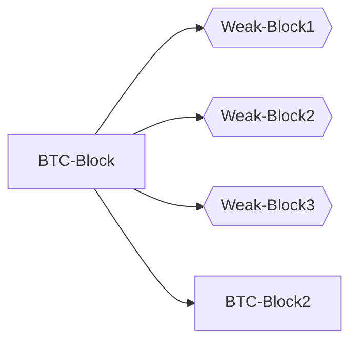
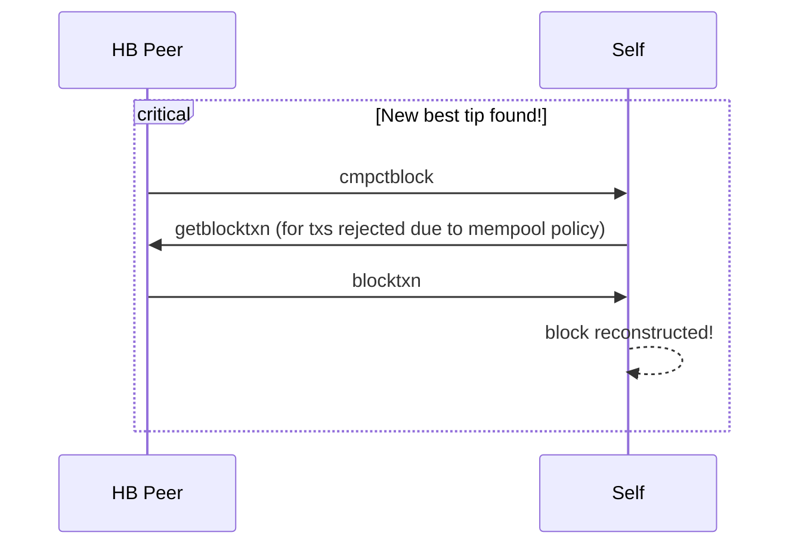
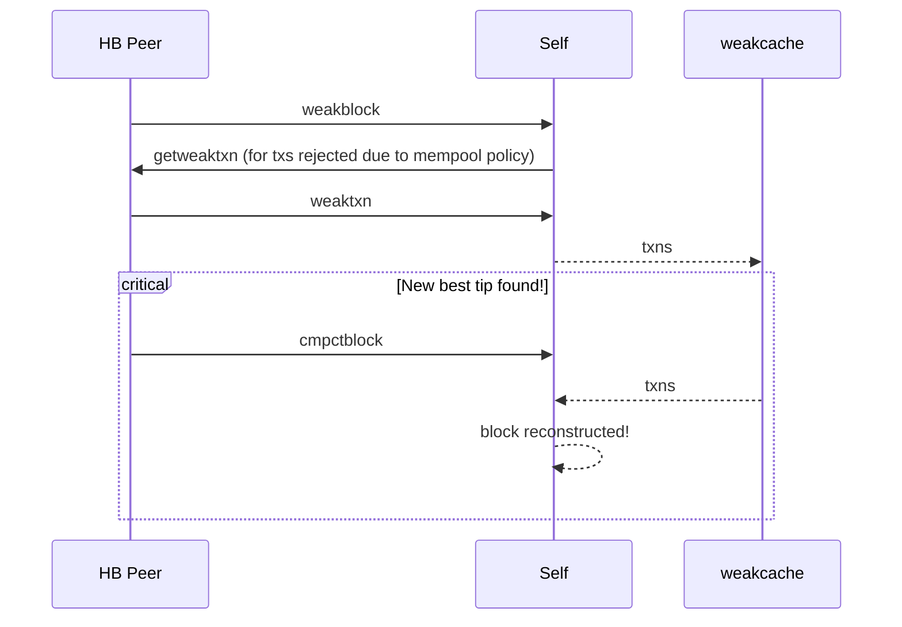

# Second Look at Weak Blocks

instagibbs | 2024-04-16 17:45:35 UTC | #1

[Weak blocks](https://bitcoinsearch.xyz/?search=weak+blocks), or "near blocks" are not a new idea.

In short, have miners propagate what amounts to mining shares over the p2p network, which allows PoW-backed sharing of data.

[Historical discussions](https://gnusha.org/bitcoin-wizards/2015-12-02.log) of weak blocks centered around the [blocksize and scaling debate](https://btctranscripts.com/scalingbitcoin/hong-kong-2015/invertible-bloom-lookup-tables-and-weak-block-propagation-performance/), which means there was intense focus on reducing the marginal bytes sent per weak block to aid "gigameg blocks". There was seemingly a lot of focus on creating DAGs, extra-consensus chains, and similar mechanisms for increasing the blocksize safely.

Almost 10 years have passed, communities have split, basically everyone is a small blocker of some kind. Ignoring blocksize increases as a motivation, *is there value in reconsidering this type of proposal?*

Some considerations jumped out to me:
1. We have compact blocks deployed for an off-the-shelf toolset to reduce the amount of bandwidth necessary to transmit these weak blocks.
2. We are seeing diverging mempool policies for a number of reasons, which along with mempool churn, results in additional round-trips and delays for final block propagation, which hurts mining fairness and thus decentralization.

 **What if we can use compact blocks-derived infrastructure to enable weak blocks, which in turn makes compact block relay perform better by reducing round trips?**

"Specification" 
===
Re-use a variant of [compact blocks messages](https://github.com/bitcoin/bips/blob/b3701faef2bdb98a0d7ace4eedbeefa2da4c89ed/bip-0152.mediawiki) to support propagation of "weak compact blocks". Don't make a DAG or require consensus over these messages, just use them as a DoS-resistant messaging layer for things miners appear to be working on.

It's ok for these messages to be slower or fail, as long as the PoW is validated carefully. They are not as speed-critical as regular compact blocks.

Open questions:

1. What level of validation of weak blocks is required to share the weak block transactions?
2. Since we don't want to require persistence of weak blocks to disk, we need to allow for a full weak block to be "forgotten" even after being advertised via a weak compact block. Add a `notfound` type response?

Implementation
===

Basic [PoC here](https://github.com/instagibbs/bitcoin/commits/2024-03-weakblocks_poc/) with light tests only to demonstrate the high level idea.

When a weak block comes in, we fetch the missing transactions from our peer using `getwblocktxns`, then once the weak block is validated as structurally sound, attempt to insert any transactions we don't have yet into our mempool, and relay the weak block via weak compact blocks in turn.

Everything is held in a "holding cell", even if rejected from the mempool(possibly for standardness reasons).

The implementation is only doing a "best effort" last seen weak block, but clearly this will be insufficient for a full implementation.

Open questions:

1. What PoW "multiplier"(factor decrease from consensus-required) should we set? For the PoC branch I set this to 2 simply for testing. Increasing this value increases the expected number of weak blocks per block interval.
1. How many blocks should we buffer?
1. Do we have to buffer the transactions even if they're in the mempool already? If we're asked for them via `getwblocktxns`, we need to respond somehow even if they've been cycled out of your mempool.
1. Should we support the "low bandwidth" path, with an additional round-trip via `weak headers` message? Should we even support the "high bandwidth" path?

Bonus use-cases
===
["Forcible insertion"](https://lists.linuxfoundation.org/pipermail/bitcoin-dev/2021-October/019578.html) of transactions that are incentive-compatible but violate anti-DoS rules? (e.g., "pinning replacement")

Next-block fee estimation?

Next Steps
===
1. Gather higher-level feedback on a proposed specification/implementation
2. If there's general enthusiasm for such a proposal among developers, figure out if/how miners would actually use this. Do miners use RPCs to submit blocks? Should we support a (whitelisted peer only) protocol to submit non-compact versions of weak blocks to nodes for initial propagation? Would miners actually want to run this? Market research is required, although small miners can run these on their own and benefit from the increased network convergence.

-------------------------

ajtowns | 2024-04-17 15:28:21 UTC | #2

Perhaps a variation on this approach would be interesting: limit the weak block cache based on the size of transactions (skipping duplicates), and have it be relatively high rate, say 16x. Then you'd almost always have txs from a recent block generated by any mining pool with 10%+ hashpower.

The downside to that approach is that given the poisson intervals you'd "often" have 50 or 100 weak blocks between each real block, and you'd "often" get weak blocks being found only a few seconds after the previous weak block. ("Often" in this case is "once a day") That probably just means you want to be able to process weak block messages very quickly; but if you're only validating PoW and stuffing the contents into a cache, that's probably okay?

This would probably be interesting to run on signet: both because it's easy to get 100% miner coverage, and because inquisition means there are actually meaningfully divergent mempools ([eg](https://mempool.space/signet/block/000000bd051e8937e19a8d7aaf515570b2ef3d2e144b9af595ffcac6adeda92b)).

-------------------------

instagibbs | 2024-04-17 15:56:26 UTC | #3

[quote="ajtowns, post:2, topic:805"]
The downside to that approach is that given the poisson intervals you’d “often” have 50 or 100 weak blocks between each real block
[/quote]

I guess there is a large design space to explore here where *not all weak blocks have to be fetched or sent* in a given period. Nodes can decide to not fetch subsequent weak block transactions, and maybe use `weakheaders` first to further reduce extra bandwidth usage at the cost of a bit more latency.

[quote="ajtowns, post:2, topic:805"]
and you’d “often” get weak blocks being found only a few seconds after the previous weak block.
[/quote]

Seems fine to me, unless we commit/transmit more data than top block we probably haven't seen a lot of these transactions in a prior weak block.

-------------------------

jungly | 2024-04-18 07:16:55 UTC | #4

Hi instagibbs,

[quote="instagibbs, post:1, topic:805"]
Re-use a variant of [compact blocks messages ](https://github.com/bitcoin/bips/blob/b3701faef2bdb98a0d7ace4eedbeefa2da4c89ed/bip-0152.mediawiki) to support propagation of “weak compact blocks”. Don’t make a DAG or require consensus over these messages, just use them as a DoS-resistant messaging layer for things miners appear to be working on.
[/quote]

Not requiring consensus on these is a good move here.

As I understand your proposal, the idea is that we use weak blocks, propagated using compact block specs to make sure all nodes pull in any missing transactions. Is that right? If so, the proposal could be called a proposal to check-point transaction propagation across the network.

## Validation

When we validate a chain of weak blocks, we need to enable support for propagating weak blocks. You raise this point as your second question. It also slows down validation of weak blocks while waiting for filling holes in the past.

Instead, if each weak block directly refers to the last confirmed bitcoin block, then we don't need to validate a chain of weak blocks and we can eliminate questions about retaining weak blocks. We also know for sure we don't need to fill any holes before validating weak blocks as everyone has the last strong block.

In the diagram below, if some node receives `Weak-Block3`, they don't need to ask for `Weak-Block2` before they can validate `Weak-Block3`. We are taking just this approach in Braidpool as described in an [early proposal](https://github.com/pool2win/braidpool/blob/8d0724f9fb191ddbd5e02afa20f847fc0249f128/proposal/proposal.pdf).
                  

With the above approach, all nodes are synching their state every time they receive a weak block. Also the delta between weak blocks will be smaller than the delta between strong blocks, so that when a strong block arrives, there is much less history to fill.

I hope I am not missing a subtle point in your proposal that is making me miss the bigger picture.

Best regards

-------------------------

garlonicon | 2024-04-18 11:16:26 UTC | #5

> What level of validation of weak blocks is required to share the weak block transactions?

Well, it is possible to introduce "delayed validation". For example: validating the block hashes would be the first step, then validating only the coinbase transaction (because it contains the basic block reward), and later, validating a single high-fee-paying transaction (and when we will run out of the basic block reward, people will focus on those). Because I guess you don't have to validate 100% of the block, if it does not meet all consensus rules. It is "purely informational", and can be used for example to distribute the coinbase reward, by handling "weak blocks" as "shares". Also, when it comes to header-only validation, it may be useful to trace all valid block headers, to properly calculate the global difficulty.

> What PoW “multiplier”(factor decrease from consensus-required) should we set?

It could be "difficulty per X seconds, based on valid received blocks". Which means, that if your node receives more block headers, it will raise the locally accepted difficulty, and if there is nothing for a longer time, then weaker blocks are accepted. So, it could be locally adjusted, based on the traffic. And of course, not every node needs every block, because they are "outside consensus rules" anyway.

> How many blocks should we buffer?

This is similar question to "how many blocks should we prune?". And I guess, that the proper answer is similar, and could be expressed by the stored bytes, instead of the number of blocks (or could be both, like in pruning, for example 550 MB, and 288 blocks).

-------------------------

AntoineP | 2024-04-18 12:46:56 UTC | #6

Nice! It would address concerns regarding slower block propagations in the presence of diverging relay policies on the network, and it's neat we can just reuse compact blocks instead of rolling out an IBLT or something.

[quote="instagibbs, post:1, topic:805"]
[“Forcible insertion”](https://lists.linuxfoundation.org/pipermail/bitcoin-dev/2021-October/019578.html) of transactions that are incentive-compatible but violate anti-DoS rules? (e.g., “pinning replacement”)
[/quote]

Assuming you refer to this excerpt from the linked email:

[quote]

> and naturally resolve all current issues inherent in package relay and rbf rules. It also resolves the recent minimum relay questions, as relay is no longer a concern for unmined transactions.

There are other solutions to this, like weak blocks (miners get to relay partial PoW solutuon of say 10% of the difficulty to the network; and nodes which receive such a weak block can "forcibly" insert its transaction to their mempool, as there is evidence it's actually being worked on, while still being DoS resistant because partial PoW is still PoW).
[/quote]

I don't think this addresses pinning concerns. If a miner is already working on a template which includes your transaction, you're not getting pinned anymore.

However, and this also relates to the other bonus use-case, it can be used as pinning detection. You can detect your transaction is not getting included in any of the miners' templates whereas you attached a next-block fee.

-------------------------

mcelrath | 2024-04-18 13:36:59 UTC | #7

As a means to synchronize the mempool in a fragmented mempool world, this does not (and cannot) accomplish that goal. When miners are taking fees out of band, they will not relay the txs they've been paid for out of band, nor will they advertise them in weak blocks, as this allows other miners to snipe the fees they've been paid out of band. This causes block validation times to go up for everyone else as they retrieve the missing transactions. Weak block relay is too little, too late, and cannot solve the problem.

The only viable path is to incentivize these miners so that it's not in their best interest to mine txs out of band but instead should participate in a decentralized mining pool for the other benefits it offers (lower variance, hashrate derivatives, outsourced tx selection to individual miners). This what Braidpool intends to accomplish.

Another problem with this proposal is that it interferes with the "first seen" rule of the mempool. When constructing a block in the face of conflicting transactions, the mempool accepts the "first seen" of conflicting transactions. This is not censorship resistant broadcast, and weak blocks (alone) is also not censorship resistant. Putting a weak PoW on a blob of transactions alone does not give me any consensus on which txs came first, and timestamps can be manipulated. Seeing a weak block and retrieving txs in it does not give me a solution to resolve conflicting txs between two weak blocks.

This leads to putting a consensus mechanism on the weak blocks, which provides a time ordering and conflict resolution mechanism on the contained txs. The simplest way to do this is just to extend Nakamoto consensus to a DAG and follow the "most PoW" rule. [DAGKnight](https://eprint.iacr.org/2022/1494.pdf) is a reasonable solution and I believe [my Braid proposal is equivalent](https://rawgit.com/mcelrath/braidcoin/master/Braid%2BExamples.html). It's very simple to add a committed header field pointing to the most recently seen "tip" weak blocks, which forms a DAG structure. The DAG can be partial ordered in linear time using known algorithms ("Most Recent Common Ancestor") that are only ~100 lines of code. Once a DAG consensus protocol is present, a decentralized mining pool can enforce that a block must contain only transactions already broadcast in its ancestor weak-blocks.

Note that the existence of a decentralized mining pool cannot stop centralized pools from accepting txs out of band. There is no protocol way to do that. The only way to do that is to make it economically nonviable to do so.

For further reading, you might be interested in my [discussion of weak blocks](https://github.com/braidpool/braidpool/blob/cd5c7d4b610c3894794766d83ee1991cf2a753b4/docs/general_considerations.md) or the [Overview to get an idea how a decentralized mining pool could be attractive enough to overtake centralized pools (and tx withholding/OOB)](https://github.com/braidpool/braidpool/blob/cd5c7d4b610c3894794766d83ee1991cf2a753b4/docs/overview.md) and there's the [WIP Spec which we'd be happy to receive further feedback on](https://github.com/braidpool/braidpool/blob/cd5c7d4b610c3894794766d83ee1991cf2a753b4/docs/braidpool_spec.md).

Cheers,
-- Bob

-------------------------

instagibbs | 2024-04-18 15:47:09 UTC | #8

Hi Bob!

[quote="mcelrath, post:7, topic:805"]
As a means to synchronize the mempool in a fragmented mempool world, this does not (and cannot) accomplish that goal. When miners are taking fees out of band, they will not relay the txs they’ve been paid for out of band, nor will they advertise them in weak blocks, as this allows other miners to snipe the fees they’ve been paid out of band.
[/quote]

Mempool synchronization was not the goal here, it's for improved relay. It's also (obviously) not a replacement for something that could incentivize the publishing of "hidden" transactions.

[quote="mcelrath, post:7, topic:805"]
This what Braidpool intends to accomplish.
[/quote]
I'd be interested in a discussion of braidpool in a different thread of course. I just am not making any claims to solve what braidpool is claiming to solve.

[quote="mcelrath, post:7, topic:805"]
Another problem with this proposal is that it interferes with the “first seen” rule of the mempool. When constructing a block in the face of conflicting transactions, the mempool accepts the “first seen” of conflicting transactions. This is not censorship resistant broadcast, and weak blocks (alone) is also not censorship resistant. Putting a weak PoW on a blob of transactions alone does not give me any consensus on which txs came first, and timestamps can be manipulated. Seeing a weak block and retrieving txs in it does not give me a solution to resolve conflicting txs between two weak blocks.
[/quote]

I'm not sure what this is addressing. I suspect based on your linked writing you have additional requirements I'm not attempting to include here, which is again, just a discussion about using PoW as a DoS-resistant cache to speed up propagation of blocks. I'm not suggesting these be directly used to construct block templates or even necessarily effect a node's local mempool.

Thanks for the links regardless, obviously braidpool is the more ambitious idea here with wider implications!

-------------------------

mcelrath | 2024-04-18 17:14:04 UTC | #9

[quote="instagibbs, post:8, topic:805"]
Mempool synchronization was not the goal here, it’s for improved relay. It’s also (obviously) not a replacement for something that could incentivize the publishing of “hidden” transactions.
[/quote]

In that case I'm really confused about what weak block propagation is supposed to accomplish. Adding a PoW header doesn't improve block relay in any way that I can see. Can you elaborate on that?

-------------------------

ajtowns | 2024-04-19 12:39:23 UTC | #10

The idea is that it improves block relay when nodes' mempool policies differ from miners, by reducing round-trips. 

Ideally you'd like the time between hearing about a block (the `cmpctblock` message) and having successfully reconstructed the block locally to be as short as possible. One way that's slow is if you have to do round-trips, and the main reason you have to do round-trips is if you didn't have all the txs in the block in your mempool. But for txs that don't meet your mempool policy, it's tricky. What we do now is just request the missing txs (ones that never made it into our mempool or that expired from the mempool long enough ago that they also aren't in our extra txns cache), adding a round trip:

What this proposal does is let miners send weak blocks that they find as well, with the idea that it's very likely that any transactions from a block that weren't recently in the mempool will have been in a recent weak block, making the p2p interaction look more like:

which removes the round trip from the critical section, and speeds up block relay (both for us directly, and for the network as a whole, since we can then pass that block on to our peers more quickly).

-------------------------

mcelrath | 2024-04-19 14:51:19 UTC | #11

[quote="ajtowns, post:10, topic:805"]
The idea is that it improves block relay when nodes’ mempool policies differ from miners, by reducing round-trips.
[/quote]

There's only one reason that miner policies would differ from nodes' mempool policies: when they're mining transactions OOB, which they (probably) won't want to broadcast anyway.

If there's another reason that miners want to mine a transaction that is not currently relayed, then they need to participate in the development process and get it added to core. There are good reasons some txs are not relayed, and giving miners an end-run around peer-reviewing their tx idea I think is not a good idea, and we shouldn't encourage that behavior by working around it.

There is potentially a good reason to do PoW proofs on txs anyway: a lot of the relay policies have to do with DDoS protection. If a miner wants to mine a zero fee or dust transaction, putting a PoW on it is a good way to make relay of that transaction safe and not a DDoS risk. But I think there are other ways to do this that are lighter-weight than sending around entire blocks. In such a case, the low fee is going to discourage other miners from sniping it and the miner can still be paid OOB while advertising the tx ahead of time for fast block relay.  But even this idea may have problems: adversarial miners could then snipe these low-fee/dust txs in order to deprive their competitor of revenue. (But I can see a way around that in that the miner still gets paid OOB regardless of who mines it) There's a lot more game theory around this than at first glance...

Consider for instance a modification of INV that is a PoW proof: weak block header (referencing a known recent parent block) plus Merkle proof that this tx was included. This way just the TX plus some metadata could be propagated in INV instead of entire weak blocks. (Sending around a blob of 2000 txs in a weak block is a very heavy-handed way to get one missing tx, INV is far more efficient if their goal is something other than withholding -- can you think of other non-withholding use cases?) I think e.g. Mara mining an entire graffiti block are going to be the exception rather than the rule long term, though in that specific case compact blocks would be more efficient.

One other point: if part of the motivation is just not having a tx for latency/packet loss/bandwidth reasons, adding another message *worsens* that problem. And a compact block is a very heavyweight message compared to INV, despite the round trip.

Finally, I'm happy to see people thinking about this. Weak blocks *are* mining shares and are fundamental to all mining pools, whether decentralized or not. :smiley:

Cheers,
-- Bob

-------------------------

