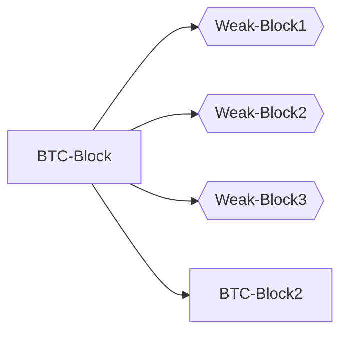

# Second Look at Weak Blocks

instagibbs | 2024-04-16 17:45:35 UTC | #1

[Weak blocks](https://bitcoinsearch.xyz/?search=weak+blocks), or "near blocks" are not a new idea.

In short, have miners propagate what amounts to mining shares over the p2p network, which allows PoW-backed sharing of data.

[Historical discussions](https://gnusha.org/bitcoin-wizards/2015-12-02.log) of weak blocks centered around the [blocksize and scaling debate](https://btctranscripts.com/scalingbitcoin/hong-kong-2015/invertible-bloom-lookup-tables-and-weak-block-propagation-performance/), which means there was intense focus on reducing the marginal bytes sent per weak block to aid "gigameg blocks". There was seemingly a lot of focus on creating DAGs, extra-consensus chains, and similar mechanisms for increasing the blocksize safely.

Almost 10 years have passed, communities have split, basically everyone is a small blocker of some kind. Ignoring blocksize increases as a motivation, *is there value in reconsidering this type of proposal?*

Some considerations jumped out to me:
1. We have compact blocks deployed for an off-the-shelf toolset to reduce the amount of bandwidth necessary to transmit these weak blocks.
2. We are seeing diverging mempool policies for a number of reasons, which along with mempool churn, results in additional round-trips and delays for final block propagation, which hurts mining fairness and thus decentralization.

 **What if we can use compact blocks-derived infrastructure to enable weak blocks, which in turn makes compact block relay perform better by reducing round trips?**

"Specification" 
===
Re-use a variant of [compact blocks messages](https://github.com/bitcoin/bips/blob/b3701faef2bdb98a0d7ace4eedbeefa2da4c89ed/bip-0152.mediawiki) to support propagation of "weak compact blocks". Don't make a DAG or require consensus over these messages, just use them as a DoS-resistant messaging layer for things miners appear to be working on.

It's ok for these messages to be slower or fail, as long as the PoW is validated carefully. They are not as speed-critical as regular compact blocks.

Open questions:

1. What level of validation of weak blocks is required to share the weak block transactions?
2. Since we don't want to require persistence of weak blocks to disk, we need to allow for a full weak block to be "forgotten" even after being advertised via a weak compact block. Add a `notfound` type response?

Implementation
===

Basic [PoC here](https://github.com/instagibbs/bitcoin/commits/2024-03-weakblocks_poc/) with light tests only to demonstrate the high level idea.

When a weak block comes in, we fetch the missing transactions from our peer using `getwblocktxns`, then once the weak block is validated as structurally sound, attempt to insert any transactions we don't have yet into our mempool, and relay the weak block via weak compact blocks in turn.

Everything is held in a "holding cell", even if rejected from the mempool(possibly for standardness reasons).

The implementation is only doing a "best effort" last seen weak block, but clearly this will be insufficient for a full implementation.

Open questions:

1. What PoW "multiplier"(factor decrease from consensus-required) should we set? For the PoC branch I set this to 2 simply for testing. Increasing this value increases the expected number of weak blocks per block interval.
1. How many blocks should we buffer?
1. Do we have to buffer the transactions even if they're in the mempool already? If we're asked for them via `getwblocktxns`, we need to respond somehow even if they've been cycled out of your mempool.
1. Should we support the "low bandwidth" path, with an additional round-trip via `weak headers` message? Should we even support the "high bandwidth" path?

Bonus use-cases
===
["Forcible insertion"](https://lists.linuxfoundation.org/pipermail/bitcoin-dev/2021-October/019578.html) of transactions that are incentive-compatible but violate anti-DoS rules? (e.g., "pinning replacement")

Next-block fee estimation?

Next Steps
===
1. Gather higher-level feedback on a proposed specification/implementation
2. If there's general enthusiasm for such a proposal among developers, figure out if/how miners would actually use this. Do miners use RPCs to submit blocks? Should we support a (whitelisted peer only) protocol to submit non-compact versions of weak blocks to nodes for initial propagation? Would miners actually want to run this? Market research is required, although small miners can run these on their own and benefit from the increased network convergence.

-------------------------

ajtowns | 2024-04-17 15:28:21 UTC | #2

Perhaps a variation on this approach would be interesting: limit the weak block cache based on the size of transactions (skipping duplicates), and have it be relatively high rate, say 16x. Then you'd almost always have txs from a recent block generated by any mining pool with 10%+ hashpower.

The downside to that approach is that given the poisson intervals you'd "often" have 50 or 100 weak blocks between each real block, and you'd "often" get weak blocks being found only a few seconds after the previous weak block. ("Often" in this case is "once a day") That probably just means you want to be able to process weak block messages very quickly; but if you're only validating PoW and stuffing the contents into a cache, that's probably okay?

This would probably be interesting to run on signet: both because it's easy to get 100% miner coverage, and because inquisition means there are actually meaningfully divergent mempools ([eg](https://mempool.space/signet/block/000000bd051e8937e19a8d7aaf515570b2ef3d2e144b9af595ffcac6adeda92b)).

-------------------------

instagibbs | 2024-04-17 15:56:26 UTC | #3

[quote="ajtowns, post:2, topic:805"]
The downside to that approach is that given the poisson intervals you’d “often” have 50 or 100 weak blocks between each real block
[/quote]

I guess there is a large design space to explore here where *not all weak blocks have to be fetched or sent* in a given period. Nodes can decide to not fetch subsequent weak block transactions, and maybe use `weakheaders` first to further reduce extra bandwidth usage at the cost of a bit more latency.

[quote="ajtowns, post:2, topic:805"]
and you’d “often” get weak blocks being found only a few seconds after the previous weak block.
[/quote]

Seems fine to me, unless we commit/transmit more data than top block we probably haven't seen a lot of these transactions in a prior weak block.

-------------------------

jungly | 2024-04-18 07:16:55 UTC | #4

Hi instagibbs,

[quote="instagibbs, post:1, topic:805"]
Re-use a variant of [compact blocks messages ](https://github.com/bitcoin/bips/blob/b3701faef2bdb98a0d7ace4eedbeefa2da4c89ed/bip-0152.mediawiki) to support propagation of “weak compact blocks”. Don’t make a DAG or require consensus over these messages, just use them as a DoS-resistant messaging layer for things miners appear to be working on.
[/quote]

Not requiring consensus on these is a good move here.

As I understand your proposal, the idea is that we use weak blocks, propagated using compact block specs to make sure all nodes pull in any missing transactions. Is that right? If so, the proposal could be called a proposal to check-point transaction propagation across the network.

## Validation

When we validate a chain of weak blocks, we need to enable support for propagating weak blocks. You raise this point as your second question. It also slows down validation of weak blocks while waiting for filling holes in the past.

Instead, if each weak block directly refers to the last confirmed bitcoin block, then we don't need to validate a chain of weak blocks and we can eliminate questions about retaining weak blocks. We also know for sure we don't need to fill any holes before validating weak blocks as everyone has the last strong block.

In the diagram below, if some node receives `Weak-Block3`, they don't need to ask for `Weak-Block2` before they can validate `Weak-Block3`. We are taking just this approach in Braidpool as described in an [early proposal](https://github.com/pool2win/braidpool/blob/8d0724f9fb191ddbd5e02afa20f847fc0249f128/proposal/proposal.pdf).
                  

With the above approach, all nodes are synching their state every time they receive a weak block. Also the delta between weak blocks will be smaller than the delta between strong blocks, so that when a strong block arrives, there is much less history to fill.

I hope I am not missing a subtle point in your proposal that is making me miss the bigger picture.

Best regards

-------------------------

