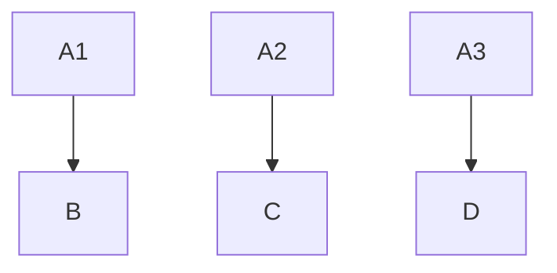
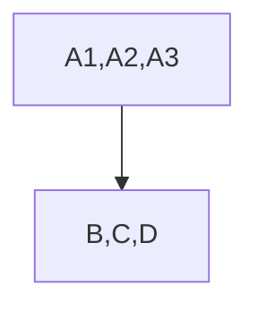
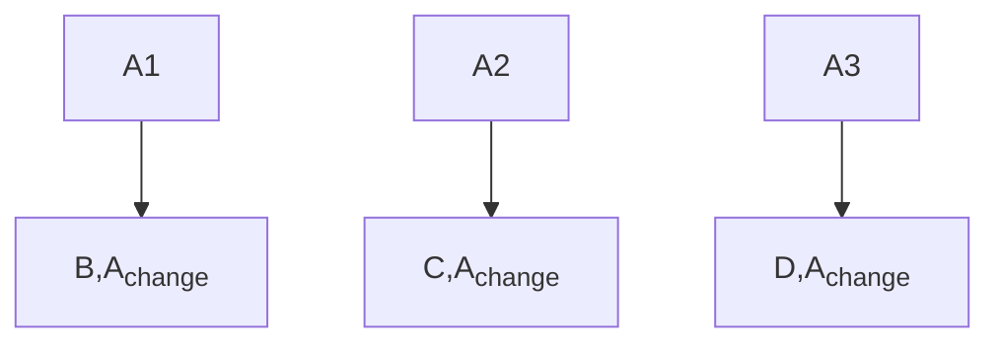
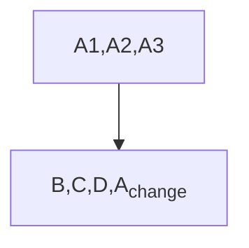
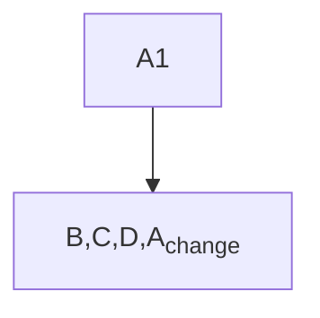

# CISA and Privacy

1440000bytes | 2024-04-22 21:24:52 UTC | #1

<h1>CISA: Cross-Input Signature Aggregation</h1>

Signature aggregation allows aggregating a set of signatures into a single signature which reduces transaction weight and fees. 

Research and Development: https://github.com/BlockstreamResearch/cross-input-aggregation  
Playground: https://github.com/fjahr/cisa-playground

||savings|
|---|---|
|half aggregation|7.6%|
|full aggregation|9.6%|
|max |15.2%|

<h2>Observations</h2>

Consider an example in which Alice has 3 UTXOs (A1, A2 and A3) in her wallet that could be used separately to pay Bob, Carol and Dave in different transactions. Normally, she would pay them separately and some of these transactions could have change although inputs remain different.

Without CISA:

If Alice gets some discount on weight and fees by aggregating signatures, she would prefer to use all inputs in the same transaction and pay them. 

With CISA:

> Apart from incentivizing users to harm their privacy, it requires a **new address format** and new taproot key type. So these transactions would be easy to differentiate on chain and make chain analysis easier.

<h2>Conclusion</h2>

CISA encourages practices that are bad for privacy and introduces lot of complexity for marginal fee savings.

---
This post is not related to recent research [fellowship announced by HRF](https://hrf.org/hrf-announces-cisa-research-fellowship/) although I hope it helps others who apply for it.

-------------------------

harding | 2024-04-24 19:27:03 UTC | #2

I think you're ignoring the existing effect of [payment batching](https://bitcoinops.org/en/topics/payment-batching/).  Let's use and extend your examples, providing numbers.  All examples below assume P2TR keypath inputs and P2TR outputs with  sizes from [Optech's tx calc](https://bitcoinops.org/en/tools/calc-size/).

**No batching or CISA:**

Each tx has 1 input and 2 outputs (payment & change), making it 154 vbytes.  Three transactions is thus 462 vbytes.

**Batching without CISA:**

In the worst case, this is:

The size is 355 vbytes, a 23% savings over the base case.

In the best case, this is:

That best-case size is 240 vbytes, a 48% savings over the base case.

**With batching and CISA:**

The best-case from above remains exactly the same (assuming CISA doesn't add any overhead).  In the multi-input case:

- Half-agg reduces the size of the second and third inputs by 8 vbytes each, bringing the transaction size down from 355 vbytes to 339 vbytes.  This is an extra 3.6% savings.
- Full-agg reduces the size of the second and third inputs by 16 vbytes each, brining the transaction size down from 355 vbytes to 323.  This is an extra 7.1% savings.

The existing Bitcoin protocol heavily incentivizes batching.  CISA makes batching only slightly more efficient, so I don't think there's any reason to consider it a privacy problem on that basis.

I'm not aware of CISA necessarily requiring a new address format, and even if it does, I assume that it can be an address format that encompasses most expected output uses (like taproot), so it will eventually become the default address format.  I don't think we should avoid adding useful new features to Bitcoin because there will be a transitional period where it's easier to distinguish between upgraded and non-upgraded wallets.

Additionally, CISA reduces the cost of creating coinjoins and payjoins, two deployed protocols that improve privacy.  It may also reduce the cost of other protocols that enhance privacy, including both current protocols (like LN channels closes with multiple in-flight HTLCs) and proposed protocols.  The cost reduction is modest, but I think anything that gives privacy an advantage is worth considering.

-------------------------

murch | 2024-05-05 12:14:30 UTC | #3

From what I understand, CISA does require a new output script type as adding it to P2TR would imply a hardfork. The new output script type could definitely use the same address format (bech32m).

-------------------------

1440000bytes | 2024-05-05 13:13:25 UTC | #4

[quote="harding, post:2, topic:824"]
The size is 355 vbytes, a 23% savings over the base case.
[/quote]

This will be below 5% if there is no change or more inputs are used.

[quote="harding, post:2, topic:824"]
The existing Bitcoin protocol heavily incentivizes batching. CISA makes batching only slightly more efficient, so I don’t think there’s any reason to consider it a privacy problem on that basis.
[/quote]

Batching is mainly done to pay multiple people in the same transaction irrespective of inputs used. The problem here is mostly related to inputs and not outputs. Multiple inputs in the same transaction that belong to us affect privacy in 90% of the cases.

Examples: Unnecessary input, Mixed types of inputs, Toxic change as input etc.

CISA demotivates coin control and incentivizes more inputs to be used in the same transaction. Coinjoin is less than 10% of bitcoin transactions.

[quote="harding, post:2, topic:824"]
Additionally, CISA reduces the cost of creating coinjoins and payjoins, two deployed protocols that improve privacy. It may also reduce the cost of other protocols that enhance privacy, including both current protocols (like LN channels closes with multiple in-flight HTLCs) and proposed protocols. The cost reduction is modest, but I think anything that gives privacy an advantage is worth considering.
[/quote]

Are you saying that users will do more coinjoin because of 5% discount but they wont do normal transactions in which all inputs belong to them?

-------------------------

ajtowns | 2024-05-06 04:15:02 UTC | #5

[quote="murch, post:3, topic:824, full:true"]
From what I understand, CISA does require a new output script type as adding it to P2TR would imply a hardfork. The new output script type could definitely use the same address format (bech32m).
[/quote]

Technically, you could do a limited CISA that requires you to use a taproot script path, but only needs one signature for each of the revealed paths. Compared to a non-CISA key path spend, that'd reduce the savings from 64B per input to ~29B per input, which is probably not really worthwhile. (Hardforking CISA and applying it to old scriptPubKey formats in general is interesting as it would make it cheaper to clean up old p2pkh utxos, etc)

-------------------------

