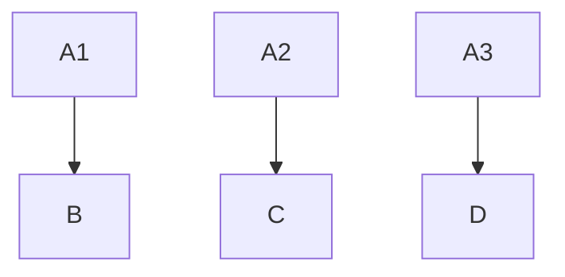
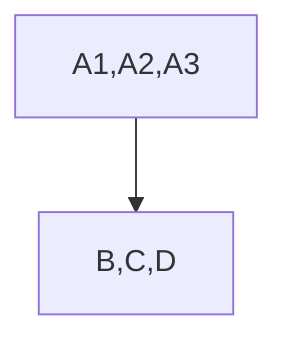

# CISA and Privacy

1440000bytes | 2024-04-22 21:24:52 UTC | #1

<h1>CISA: Cross-Input Signature Aggregation</h1>

Signature aggregation allows aggregating a set of signatures into a single signature which reduces transaction weight and fees. 

Research and Development: https://github.com/BlockstreamResearch/cross-input-aggregation  
Playground: https://github.com/fjahr/cisa-playground

||savings|
|---|---|
|half aggregation|7.6%|
|full aggregation|9.6%|
|max |15.2%|

<h2>Observations</h2>

Consider an example in which Alice has 3 UTXOs (A1, A2 and A3) in her wallet that could be used separately to pay Bob, Carol and Dave in different transactions. Normally, she would pay them separately and some of these transactions could have change although inputs remain different.

Without CISA:

If Alice gets some discount on weight and fees by aggregating signatures, she would prefer to use all inputs in the same transaction and pay them. 

With CISA:

> Apart from incentivizing users to harm their privacy, it requires a **new address format** and new taproot key type. So these transactions would be easy to differentiate on chain and make chain analysis easier.

<h2>Conclusion</h2>

CISA encourages practices that are bad for privacy and introduces lot of complexity for marginal fee savings.

---
This post is not related to recent research [fellowship announced by HRF](https://hrf.org/hrf-announces-cisa-research-fellowship/) although I hope it helps others who apply for it.

-------------------------

