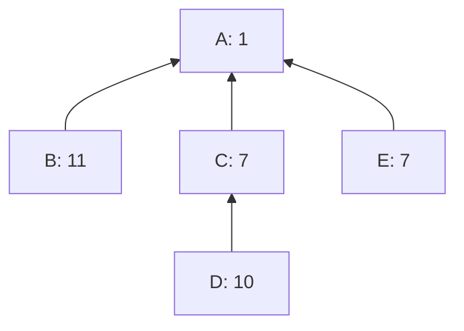

# LIMO: combining the best parts of linearization search and merging

sipa | 2024-04-24 14:47:07 UTC | #1

# LIMO: Linearization through Incremental Merging of Optimizations

 

## 1. Introduction

Consider the linearization algorithm as suggested in [How To Linearize Your Cluster](https://delvingbitcoin.org/t/how-to-linearize-your-cluster/303), excluding the approach from Section 1.2 (Bottleneck Splitting). In broad lines:
* While transactions remain in the cluster:
  * Use a computationally-bounded search algorithm which pre-splits on the best remaining ancestor set to find a good topologically valid set of transactions in what remains of the cluster.
  * Output the transactions of that topologically valid set as the next linearized transactions.
  * Remove the set from the cluster and repeat.

One might expect that this algorithm will always produce a linearization which is (by the convex-hull [feerate diagram](https://delvingbitcoin.org/t/cluster-mempool-definitions-theory/202#linearizations-and-chunks-3) metric) at least as good as straight up picking the best ancestor sets of what remains, as this is just additionally doing search on top. It turns out this is **not the case**. In fact, it may (rarely) be strictly worse.

Consider the following example cluster:

**Ancestor-set based linearization.** The consecutive remaining best ancestor sets are AB (6), CD (8.5), and E (7), and the resulting [A,B,C,D,E] linearization is in fact optimal, chunked as [ABCD (7.25), E (7)].

**Computationally-bounded search.** However, ACDE (6.25) has higher feerate than AB (but worse than ABCD), and thus a (very) bounded search might end up with ACDE as first set to include. The resulting [A,C,D,E,B] linearization, chunked as [ACDEB (7.2)], is not optimal, and strictly worse than [A,B,C,D,E].

It is not a very satisfactory situation that an algorithm that performs strictly more work can end up with a worse solution.

## 2. Incremental merging

Of course, we have a good algorithm for combining the best parts of two linearizations already: [merging](https://delvingbitcoin.org/t/merging-incomparable-linearizations/209).

With that, it is possible to compute two separate linearizations, one using just ancestor sets, and one using bounded search, and then merging the two. But that has downsides too; either:
* We only perform the optimal ancestor set finding once, as part of the ancestor linearization, but then the bounded search cannot take advantage of this information, as it's only available during the merge at the very end.
* We perform the search for optimal ancestor sets twice (once inside the ancestor linearization, and once inside the pre-splitting during search), meaning duplicate work.

Overall, it feels like using merging to address this comes "too late". Ideally, we would incorporate the findings of ancestor sort as input to the search. This can be accomplished by turning the overall linearization algorithm into a improvement algorithm:
* Start with an initial linearization $L$, e.g. the ancestor-based linearization.
* While transactions remain in $L$:
  * Use bounded search to find a high-feerate topologically valid subset $S$ of what remains of $L$.
  * Perform an optimization step that reorders $L$ without worsening it, and such that the initial part of its diagram is at least as good as the diagram of $L[S]$.
  * Output the highest-feerate prefix of $L$ and continue with what remains.

**Definition.** The notation $L \triangleleft S$, for a linearization $L$ of graph $G$ and set $S$ is used to mean $L[S] + L[G \setminus S]$, i.e. $L$ but with the subset $S$ moved to the front.

The optimization step above can then be written as $\operatorname{merge}(L, L \triangleleft S)$. This is a strict improvement over the existing linearization algorithm, which can be seen as switching to $L \triangleleft S$ directly. In addition to guaranteeing a result that is as good as the combinations of prefixes of found subsets, the optimization step also guarantees a result that is as good as the initial linearization. And contrary to the merge-at-the-end strategy, the subset searches get to take advantage of the quality of the initial linearization too, as that affects what remains in $L$ (and more, see below).

## 3. Single-set improvement steps

The approach above requires performing a $\operatorname{merge}$ operation for every search step, which can be up to cubic in complexity, as $\operatorname{merge}$ may take up to $\mathcal{O}(n^2)$ time, and we may need to run it up to $n$ times. This would make the overall operation potentially significantly slower than just merging once at the end.

To address that, observe that the [merging algorithm](https://delvingbitcoin.org/t/merging-incomparable-linearizations/209#prefix-intersection-merging-5) itself works by incrementally moving high-feerate subsets to the front. If instead of performing a full merge in every step, we just determine what the first to-be-moved subset would be for the resulting merge, and output that before continuing with what remains of the linearization, we are back to quadratic complexity.

The result is the LIMO algorithm:

**Definition.** $\Pi(L)$ denotes the highest-feerate prefix of $L$ (i.e, its first chunk).

* Given an initial linearization $L$:
  * While there are transactions left in $L$:
    * Let $l = \Pi(L)$.
    * Find a high-feerate topologically-valid subset $S$ of the transactions in $L$ (search).
    * Let $s = \Pi(L[S])$.
    * Let $b = s$ if $\operatorname{feerate}(s) > \operatorname{feerate}(l)$; $b = \Pi(L[l] \triangleleft s)$ otherwise.
    * Append $L[b]$ to output linearization.
    * Remove $b$ from $L$ and repeat.

As long as the consecutive $S$ sets do not degrade in quality, the resulting linearization will be as good as all its combined prefixes.

For every search step an initial guess $l$ is known: the highest-feerate prefix of what remains of the initial linearization. This $l$ can be used as the initial $\operatorname{best}$ inside the [search algorithm](https://delvingbitcoin.org/t/how-to-linearize-your-cluster/303) (instead of $\varnothing$), which may allow earlier pruning of work queue items whose $\operatorname{pot}$ isn't better (see [Section 2.2](https://delvingbitcoin.org/t/how-to-linearize-your-cluster/303#h-22-potential-set-bounding-7)), and can reduce the initial size of $\operatorname{imp}$ (see [Section 2.3](https://delvingbitcoin.org/t/how-to-linearize-your-cluster/303#h-23-best-bounding-of-potentials-8)).

## 4. Improving existing linearizations

So far, we have considered LIMO as a replacement for a "cold-start" linearizations, for clusters which do not have a linearization already, or for merging as a linearization retry with an existing one. It could however also be used to improve existing linearizations, by passing in that existing linearization as initial $L$, rather than an ancestor-based linearization.

In that setting, it would be useful if the algorithm could merge in two distinct $S$ sets in every iteration, e.g. one found through ancestor-set linearization and one through search, effectively moving the ancestor-set logic into the algorithm itself rather than using it as an input.

It gets more complicated to have two sets if we want to guarantee a result that's as good as both, and as good as the initial linearization, but this appears to work (no proof, just a lot of fuzzing...). Let's call it Double LIMO:

* Given an initial linearization $L$
  * While there are transactions left in $L$:
    * Set $b = \Pi(L)$.
    * Find high-feerate topologically-valid subsets $S_1$ and $S_2$ of the transactions in $L$:
      * $S_1$ could be the best ancestor set in what remains of $L$.
      * $S_2$ could be the result of a computationally bounded search in $L$, using $b$ as a starting point. This search can be delayed until after the $S = S_1$ iteration below, which may provide a better $b$.
    * For $S \in \{S_1, S_2, S_1 \cap S_2\}$:
      * Let $s = \Pi(L[S] \triangleleft b)$ (during the first iteration it holds that $L[S] \triangleleft b = L[S]$).
      * Set $b = s$ if $\operatorname{feerate}(s) > \operatorname{feerate}(b)$; $b = \Pi(L[b] \triangleleft s)$ otherwise.
    * Append $L[b]$ to output linearization.
    * Remove $b$ from $L$ and repeat.

It appears this algorithm even generalizes to higher numbers. E.g. Triple LIMO would involve three subsets and $S$ would loop over their 7 non-empty intersections $\{S_1, S_2, S_1 \cap S_2, S_3, S_1 \cap S_3, S_2 \cap S_3, S_1 \cap S_2 \cap S_3\}$.

Double LIMO can be used in cluster update situations:
* Start with an existing linearzation $L$ for a cluster.
* With a new transaction/package coming it, remove from $L$ the conflicts and append (at the end) the replacements, leaving the order otherwise the same.
* [Post-process](https://delvingbitcoin.org/t/linearization-post-processing-o-n-2-fancy-chunking/201) $L$.
* Perform Double LIMO on $L$ (with $S_1 =$ best ancestor set, $S_2 =$ bounded search result).
* Maybe post-process again?

The result will be at least as good as ancestor sort, at least as good as the combination of prefixes found by bounded search, and at least as good as the result of post-processing the remainder of the original linearization after replacements, all while letting the ancestor sort and bounded search operate on the best state so far.

## Acknowledgements

Thanks to @ajtowns for the notational suggestions.

-------------------------

instagibbs | 2024-04-24 21:48:53 UTC | #2

Is running this over the non-empty `S_i` intersections crucial to this strategy or "just" an optimization that takes advantage of multiple searches finding interesting structure in some combined way?

-------------------------

sipa | 2024-04-24 23:21:27 UTC | #3

It appears to be necessary to process these intersections too, though I don't exactly understand why.

I have a fuzz test that implements Double and Triple LIMO, with the $S_i$ sets calculated as "whatever remains of $n$ static fuzz-derived topologically-valid sets", on a fuzz-derived initial linearization for a fuzz-derived cluster, and then verifies:
* The resulting linearization is topological
* The resulting linearization's diagram is at least as good as the initial one.
* The resulting feerate diagram at size $\operatorname{size}(S_i)$ is at least $\operatorname{fee}(S_i)$, for each $i$.

If I drop any of the $2^n-1$ intersections, the test finds failures in the last condition.

-------------------------

ajtowns | 2024-04-25 01:11:42 UTC | #4

I wonder if doing the intersections first would be an optimisation? ie $S_1, S_1 \cap S_2, S_2, S_1 \cap S_2 \cap S_3, S_1 \cap S_3, S_2 \cap S_3, S_3$

-------------------------

sipa | 2024-04-25 10:34:41 UTC | #5

Interestingly not all orderings work. These do not (will update if I find more):
* $S_1 \cap S_2, S_1 \cap S_3, S_2 \cap S_3, S_2, S_3, S_1 \cap S_2 \cap S_3, S_1$

-------------------------

sipa | 2024-04-25 12:14:15 UTC | #6

Huh, much simpler construction that also seems to work:

* Given an initial linearization $L$
  * While there are transactions left in L:
     * Compute high-feerate topologically-valid sets $S_1$ and $S_2$.
     * Let $b$ be the highest-feerate set in:
       * $\Pi(Q)$ for $Q \in \{L, L[S_1], L[S_2], L[S_1 \cap S_2]\}$
    * Append $L[b]$ to output linearization.
    * Remove $b$ from $L$ and repeat.

(also generalizes to triple variant)

-------------------------

sipa | 2024-04-25 22:37:19 UTC | #7

A few updates:

* **The bad news.** @sdaftuar convinced me that the Double-LIMO workflow does not actually address the issue in the introduction: if you start with an arbitrary linearization, and then Double-LIMO it (with $S_1 =$ best remaining ancestor set, $S_2 =$ bounded search), the result may still be incomparable or even strictly worse than a pure ancestor set based linearization. If the *input* is at least as good as a pure ancestor set based linearization, the output will be too. This could also be accomplished by merging a fresh ancestor set sort with the input, but LIMO lets us linearize and merge at the same time.
* **The somewhat redeeming insight.** We probably do not actually care about guaranteeing that all our linearization are strictly as good as the **diagram** of pure ancestor sort, because that is not what is required for CPFP, nor is it what the network currently implements. The current (as of 27.0) Bitcoin Core block builder implementation guarantees a quality of ancestor-based sort *without* chunking, and LIMO achieves that too (but, so does bounded search with ancestor set-based presplitting).
* **The good news.** I believe I have a proof that the new simplified Double (and Triple) LIMO "works" (where "works" doesn't imply "as good as directly linearizing using each individual subset finding algorithm", but means "at least as good as the input, and transactions included in each step are not incompatible with reaching the fee/size point of the $S_1$ and $S_2$ found within that same step"). Bigger post coming up for that.

-------------------------

sipa | 2024-05-02 12:45:36 UTC | #8

In this follows a proof for Double LIMO. More concretely, it shows that in each iteration of the algorithm progress is made towards a linearization which is as good as the input, and as good as the $S_1$ and $S_2$ found in that same iteration.

## New concepts

First two new concepts (set-linearizations, slope comparison), with associated definitions and theorems, are introduced that will help with analyzing Double LIMO. Then a variant of the gathering theorem is introduced and proven

### Set linearizations

***Definition.*** A **set-linearization** is a list of non-overlapping sets of transactions whose prefixes are topological. The **prefixes** of a set-linearization $C = (c_1, c_2, \ldots, c_n)$ are the sets $(\cup_{i=1}^k c_i)_{k=0}^n$. A chunking is a special case of a set-linearization. Set-linearizations do not require monotonically decreasing feerate. A normal linearization with every list element replaced by a singleton containing it always yields a valid set-linearization.

***Definition.*** Every set-linearization $C$ has a **set-feerate diagram** $\operatorname{setdiag}(C)$, which is the real function through the cumulative $(\operatorname{size}, \operatorname{fee})$ points of its prefixes. Note that unlike for normal linearizations, we do not implicitly "chunkify" for the diagram. So a set-feerate diagram is not necessarily a concave function.

***Definition.*** Let $\operatorname{chunksets}(C)$ be a function from set-linearizations to set-linearizations, which repeatedly merges pairs of consecutive sets where the latter has a strictly higher feerate than the former, until no such pairs remain.

***Definition.*** The $\sim$, $\gtrsim$, and $\lesssim$ operators are defined for set-linearizations as comparing their (unchunked) diagrams.

***Theorem.*** For any set-linearization $C$, $\operatorname{chunksets}(C) \gtrsim C$.

***Theorem.*** The diagram for $\operatorname{chunksets}(C)$ is the minimal concave function through the $(\operatorname{size}, \operatorname{fee})$ points of every prefix of $C$.

***Definition.*** Given a linearization $L$, a set-linearization $C$ is **compatible** with $L$ if every prefix of $C$ is also a prefix of $L$.

***Theorem.*** Given a linearization $L$ and a compatible set-linearization $C$, then $\operatorname{chunksets}(C)$ is also compatible with $L$.

***Theorem.*** Given a linearization $L$ and a compatible set-linearization $C$, then the diagram of $C$ is nowhere better than the (post-chunking) diagram of $L$.

### Slope algebra

To simplify reasoning about points in the diagram and the feerates they correspond to:
* Define the function $\operatorname{sfpair}(S)$ for set $S$ as the real vector $(\operatorname{size}(S), \operatorname{fee}(S))$.
* Define $\operatorname{possize}(P)$ where $P = (s, f)$ as $s > 0$.
* Define $(s_1, f_1) \succeq (s_2, f_2)$ as $f_1 s_2 \geq f_2 s_1$, the "slope comparison".

If $\operatorname{possize}(P_1)$ and $\operatorname{possize}(P_2)$, for $P_1 = (s_1, f_1)$ and $P_2 = (s_2, f_2)$, then $P_1 \succeq P_2 \iff f_1 / s_1 \geq f_2 / s_2$. Thus, $\operatorname{sfpair}(S_1) \succeq \operatorname{sfpair}(S_2) \iff \operatorname{feerate}(S_1) \geq \operatorname{feerate}(S_2)$, and $\succeq$ can be thought of as a generalization of the feerate comparisons on $(\operatorname{size}, \operatorname{fee})$ pairs, to situations where these coefficients do not necessarily correspond to a specific set of transactions, and sizes may even be negative or zero.

The following rules apply:
* **Negation rule**: $P_1 \succeq P_2 \iff P_2 \succeq -P_1$.
* **Offset rule**: $P_1 \succeq P_2 \iff P_1 + \alpha P_2 \succeq P_2 \iff P_1 \succeq P_2 + \beta P_1$ for real $\alpha, \beta$.
* **Transitivity**: $P_1 \succeq P_2 \, \land \, P_2 \succeq P_3 \implies P_1 \succeq P_3$, if $\operatorname{possize}(P_i)$ for $i = 1 \ldots 3$.
* **Line rule**: Geometrically, the point $P$ lies to the left of the (infinite extension of) the line from $P_1$ to $P_2$ iff $P - P_1 \succeq P_2 - P_1$. If $\operatorname{possize}(P - P_1)$ and $\operatorname{possize}(P_2 - P_1)$, then $P - P_1 \succeq P_2 - P_1$ iff $P$ lies above the line from $P_1$ to $P_2$.

### The set gathering theorem

This is a variation on [the gathering theorem](https://delvingbitcoin.org/t/cluster-mempool-definitions-theory/202#transformations-on-linearizations-4), with the difference that it operates on set-linearizations rather than linearizations.
 
Informally: moving a subset $S$ of transactions to the front of a set-linearization $C$, and then chunking the result, will not worsen the diagram if the feerate of $S$ is as good as every prefix of $C$, and as good as every prefix of $C$ intersected with $S$.

***Theorem.*** Given:
* A set-linearization $C = (c_1, c_2, \ldots, c_n)$
* A topologically-valid subset $S$ of its transactions ($S \subset (\cup_{j=1}^n c_j)$) for which, ignoring conditions that involve the feerate of an empty set, it holds that:
  * (1) $\operatorname{feerate}(S) \geq \operatorname{feerate}(\cup_{i=1}^k c_i)$ for all $k = 1 \ldots n$
  * (2) $\operatorname{feerate}(S) \geq \operatorname{feerate}(S \cap (\cup_{i=1}^k c_i))$ for all $k = 1 \ldots n$.

Then $\operatorname{chunksets}(C') \gtrsim C$ where $C' = (S, c_1 \setminus S, c_2 \setminus S, \ldots, c_n \setminus S)$.

***Proof.***

Define:
* $P_k$ as $\operatorname{sfpair}(\cup_{i=1}^k c_i)$, the points making up the diagram of $C$.
* $Q_k$ as $\operatorname{sfpair}(S \cup (\cup_{i=1}^k c_i))$, the points making up the diagram of $C'$, excluding $(0,0)$.

Our input conditions can now be stated using vectors and slope comparisons as
* (1) $Q_0 \succeq P_k$ for $k=1 \ldots n$
* (2) $Q_0 \succeq Q_0 + P_k - Q_k$ for $k=1 \ldots n$.

To prove that the diagram of $\operatorname{chunksets}(C')$ is nowhere below the diagram of $C$, we will for every point of $C$ show that a line between two points on $C'$ exists that it lies on or below, as these lines form a lower bound for the concave function that is $\operatorname{setdiag}(\operatorname{chunksets}(C'))$.

* For $k = 1 \ldots n$:
  * If $\operatorname{possize}(P_k - Q_0)$:
    * (3) $Q_0 \succeq P_k - Q_k$ [offset rule with $\beta=-1$ on (2)]
    * (4) $Q_k - P_k \succeq Q_0$ [negation rule on (3)]
    * (5) $Q_0 \succeq P_k - Q_0$ [offset rule with $\beta=-1$ on (1)]
    * (6) $Q_k - P_k \succeq P_k - Q_0$ [transitivity on (4) and (5)]
    * (7) $Q_k - Q_0 \succeq P_k - Q_0$ [offset rule with $\alpha=1$ on (6)]
    * (8) $P_k$ lies on or below the line from $Q_0$ to $Q_k$ [line rule on (7)]
  * Otherwise (not $\operatorname{possize}(P_k - Q_0)$):
    * (9) $Q_0 - P_0 \succeq P_k - P_0$ [subtracting $P_0 = (0, 0)$ from both sides of (1)]
    * (10) $P_k$ lies on or below the line from $P_0$ to $Q_0$ [line rule on (9)]

Thus, every point $P_k$ of the diagram of $C$ lies on or below either the line from $P_0$ to $Q_0$ (10) or the line from $Q_0$ to $Q_k$ (8). Since $P_0$, $Q_0$, and $Q_k$ are all on $\operatorname{setdiag}(C')$, this implies that $\operatorname{chunksets}(C') \gtrsim C$.

***Corollary.*** The normal gathering theorem, under the condition that $L[S]$ chunks to a single set, follows from the set gathering theorem, by applying it to $C = \operatorname{chunking}(L)$, since the conditions follow from:
* (1) $S$ having a higher feerate than $L$'s first chunk, which has a higher feerate than any other prefix of chunks
* (2) $L[S]$ being a single chunk implies it has no higher-feerate prefix itself.

***Corollary.*** The chunk reordering theorem follows from the set gathering theorem, by applying it to $C = \operatorname{chunking}(L)$, since the conditions follow from:
* (1) Like above
* (2) $S \subset c_1$ implying all intersections between $S$ and prefixes of $C$ are identical.

## Double LIMO

Define $\operatorname{DoubleLIMO}_{f_1,f_2}(G, L)$ for a graph $G$ with existing linearization $L$, and two functions $f_1$ and $f_2$ that find high-feerate topologically-valid subsets of a given set of transactions as:
* If $L = ()$, return $()$.
* Otherwise:
  * Let $C = (c_1, c_2, \ldots, c_n) = \operatorname{chunking}(L)$.
  * Let $S_1 = f_1(G)$.
  * Let $S_2 = f_2(G)$.
  * Let $S$ be the highest-feerate among:
    * $(\cup_{i=1}^k c_i)_{k=1}^n$, the prefixes of $C$
    * $(S_1 \cap (\cup_{i=1}^k c_i))_{k=1}^n$, the prefixes of $C$ intersected with $S_1$
    * $(S_2 \cap (\cup_{i=1}^k c_i))_{k=1}^n$, the prefixes of $C$ intersected with $S_2$
    * $(S_1 \cap S_2 \cap (\cup_{i=1}^k c_i))_{k=1}^n$, the prefixes of $C$ intersected with $S_1 \cap S_2$
  * Return $L[S] + \operatorname{DoubleLIMO}_{f_1,f_2}(G \setminus S, L[G \setminus S])$.

This is equivalent to the description [earlier in this thread](https://delvingbitcoin.org/t/limo-combining-the-best-parts-of-linearization-search-and-merging/825/6), except it only considers intersections with linearization prefixes that are aligned to the chunk boundaries of $L$. In every step, $\operatorname{DoubleLIMO}$ moves transactions to the front of the linearization, and then continues with what remains.

***Theorem.*** The set of transactions $S$ moved to the front by every step of $\operatorname{DoubleLIMO}$ is such that *some* linearization $L^\ast$ exists such that:
* (a) $L^\ast$ starts with $L[S]$
* (b) $L^\ast \gtrsim L$
* (c) $\operatorname{diag}(L^\ast)(\operatorname{size}(f_1(G))) \geq \operatorname{fee}(f_1(G))$
* (d) $\operatorname{diag}(L^\ast)(\operatorname{size}(f_2(G))) \geq \operatorname{fee}(f_2(G))$

Note that there is no guarantee that $\operatorname{DoubleLIMO}$ overall actually finds this $L^\ast$, because it depends on which $S_1$ and $S_2$ are returned by $f_1$ and $f_2$ in future iterations. However, in every iteration progress is made towards some $L^\ast$ satisfying these properties that exists during that individual iteration. In further iterations $L^\ast$ may be different, and progress will be made towards that one instead then (for better or worse).

***Proof.*** To prove this, we will construct this $L^\ast$ for this one iteration explicitlly:
* Let $L_1 = L \triangleleft S_1$.
* Let $L_2 = L \triangleleft S_2$.
* Let $L^\ast = \operatorname{merge}(G, \operatorname{merge}(G, L_1 \triangleleft S, L_2 \triangleleft S), L \triangleleft S)$

This $L^\ast$ satisfies condition (a), starting with $L[S]$, as it is the merging of 3 linearizations which all start with $L[S]$.

$L^\ast$ also satisfies condition (b), $L^\ast \gtrsim L$, because:
* Let $L' = L \triangleleft S$
* Let $C' = (S, c_1 \setminus S, c_2 \setminus S, \ldots, c_n \setminus S)$.
* The set gathering theorem holds for set-linearization $C$ and subset $S$, showing $\operatorname{chunksets}(C') \gtrsim C$, because:
  * Condition (1) follows from $\operatorname{feerate}(S) \geq \operatorname{feerate}(c_1)$, and $c_1$ has the highest feerate of any prefix of chunks.
  * Condition (2) follows from the fact that for every candidate for $S$ tried, its restriction $S \cap (\cup_{i=1}^k c_i)$ for every $k$ is tried as well. Thus, no $S \cap (\cup_{i=1}^k c_i)$ can exist with feerate higher than $S$, as it would have been picked instead of $S$.
* $C$ is the chunking for $L$, and $\operatorname{chunksets}(C')$ is compatible with $L'$, thus from $\operatorname{chunksets}(C') \gtrsim C$ it follows that $L' \gtrsim L$.
* $L^\ast$ is a merging with $L'$, and thus $L^\ast \gtrsim L' \gtrsim L$.

To show it satisfies condition (c), $\operatorname{diag}(L^\ast)(\operatorname{size}(S_1)) \geq \operatorname{fee}(S_1)$ (and analogously, condition (d)):
* Let $C_1 = (S_1, L[G \setminus S_1])$, a set-linearization whose diagram satisfies the relation in (c).
* Let $L'_1 = L_1 \triangleleft S$.
* Let $C'_1 = (S, S_1 \setminus S, G \setminus (S \cup S_1))$.
* The set gathering theorem holds for set-linearization $C_1$ and subset $S$, showing $\operatorname{chunksets}(C'_1) \gtrsim C_1$, because:
  * Condition (1) follows from the fact that both prefixes of $C_1$, namely $S_1$ and $G$ in its entirety, are both candidates for $S$, thus the feerate of $S$ must be at least as high as the better of those.
  * Condition (2) follows from the fact that for every candidate for $S$ tried, its intersection with all prefixes of $C_1$ were tried too (effectively, its intersection with $S_1$ as intersecting with $G$ is the identity). Thus it cannot be that $(S_1 \cap S)$ has a higher feerate than $S$, as it would have been chosen instead of $S$.
* $\operatorname{chunksets}(C'_1)$ is compatible with $L'_1$, and thus from $\operatorname{chunksets}(C'_1) \gtrsim C_1$ it follows that the diagram of $L'_1$ also satisfies the relation in (c).
* $L^\ast$ is a merging with $L'_1$, and thus $L^\ast$ also satisfies this property.

It does not hurt to use the earlier form of Double LIMO, which considers all prefixes of $L[S_1]$, $L[S_2]$ and $L[S_1 \cap S_2]$ rather than just the ones that align with chunks of $L$, as all the necessary properties are still held. More combinations can be tried too, as long as these include:
* The entire graph $G$.
* For every combination tried, also its intersection with the prefixes of the chunking of $L$.
* For every combination tried, also its intersection with $S_1$.
* For every combination tried, also its intersection with $S_2$.

-------------------------

