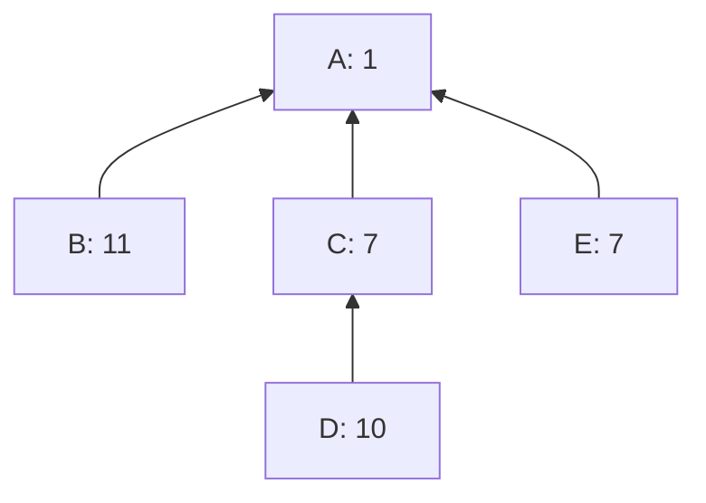

# LIMO: combining the best parts of linearization search and merging

sipa | 2024-04-23 20:43:32 UTC | #1

# LIMO: Linearization through Incremental Merging of Optimizations

 

## 1. Introduction

Consider the linearization algorithm as suggested in [How To Linearize Your Cluster](https://delvingbitcoin.org/t/how-to-linearize-your-cluster/303), excluding the approach from Section 1.2 (Bottleneck Splitting). In broad lines:
* While unlinearized transactions remain in the cluster:
  * Use a computationally-bounded search algorithm which pre-splits on the best remaining ancestor set to find a good topologically valid set of transactions in what remains of the cluster.
  * Output the transactions of that topologically valid set as the next linearized transactions.
  * Remove the set from the cluster and repeat.

One might expect that this algorithm will always produce a linearization which is (by the convex-hull [feerate diagram](https://delvingbitcoin.org/t/cluster-mempool-definitions-theory/202#linearizations-and-chunks-3) metric) at least as good as straight up picking the best ancestor sets of what remains, as this is just additionally doing search on top. It turns out this is **not the case**. In fact, it may (rarely) be strictly worse.

Consider the following example cluster:

**Ancestor-set based linearization.** The consecutive remaining best ancestor sets are AB (6), CD (8.5), and E (7), and the resulting [A,B,C,D,E] linearization is in fact optimal, chunked as [ABCD (7.25), E (7)].

**Computationally-bounded search.** However, ACDE (6.25) has higher feerate than AB (but worse than ABCD), and thus a (very) bounded search might end up with ACDE as first set to include. The resulting [A,C,D,E,B] linearization, chunked as [ACDEB (7.2)], is not optimal, and strictly worse than [A,B,C,D,E].

It is not a very satisfactory situation that an algorithm that performs a strict superset of the work can end up with a worse solution.

## 2. Incremental merging

Of course, we have a good algorithm for combining the best parts of two linearizations: [merging](https://delvingbitcoin.org/t/merging-incomparable-linearizations/209).

A possibility involving this is to compute two linearizations, one using just ancestor sets, and one using bounded search, and then merging the two. But that has downsides too; either:
* We only do the optimal ancestor set finding once, as part of the ancestor linearization, but then the bounded search cannot take "advantage" of this information, as it's only available during the merge at the very end.
* We perform the search for optimal ancestor sets twice (once inside the ancestor linearization, and once inside the pre-splitting during search), meaning duplicate work.

Overall, it feels like using merging to address this comes "too late". Ideally, we incorporate the findings of ancestor sort as input into the search. This can be accomplished by turning the overall linearization algorithm into a improvement algorithm:
* Start with an initial linearization $L$, e.g. the ancestor-based linearization.
* While transactions remain in $L$:
  * Use bounded search to find a high-feerate topologically valid subset $S$ of what remains of $L$.
  * Perform an optimization step that reorders $L$ without worsening it, and such that the initial part of its diagram is at least as good as the diagram of $L[S]$.
  * Output the highest-feerate prefix of $L$ and continue with what remains.

The optimization step can be implemented as $\operatorname{merge}(L, L[S] + L[G \setminus S])$, i.e., a merge of $L$ with a version of itself that has $S$ moved to its front.

This is a strict improvement over the existing linearization algorithm: in addition to guaranteeing a result that is as good as the combinations of prefixes of found subsets, it also guarantees a result that is as good as the initial linearization. And contrary to the merge-at-the-end strategy, the subset searches get to take advantage of the quality of the initial linearization too, as it affects what remains in $L$ (and more, see below).

## 3. Single-set improvement steps

The approach above requires performing a $\operatorname{merge}$ operation for every search step, which can be up to cubic in complexity, as $\operatorname{merge}$ runs in $\mathcal{O}(n^2)$ time, and we may need to run it up to $n$ times. This would make the overall operation potentially significantly slower than just merging once at the end.

To address that, observe that the merging algorithm itself works by incrementally moving high-feerate subsets to the front. If instead of performing a full merge in every step, we just determine what the first to-be-moved subset would be for the resulting merge, and output that before continuing with what remains of the linearization, we are back to quadratic complexity. The effective resulting LIMO algorithm is:

* Given an initial linearization $L$:
  * While there are transactions left in $L$:
    * Let $l$ be the highest-feerate prefix of $L$.
    * Find a high-feerate topologically-valid subset $S$ of the transactions in $L$ (search).
    * Let $s$ be the highest-feerate prefix of $L[S]$.
    * Let $b$ be the highest-feerate set among all prefixes of $L[l \cap s] + L[l \setminus s]$, and $s$.
    * Output $L[b]$
    * Remove $b$ from $L$ and repeat.

As long as the consecutive $S$ sets do not degrade in quality, the resulting linearization will be as good as all its combined prefixes.

For every search step an initial guess $l_1$ is known, the highest-feerate prefix of what remains of the initial linearization. This $l_1$ can be used as the initial $\operatorname{best}$ inside the [search algorithm](https://delvingbitcoin.org/t/how-to-linearize-your-cluster/303) (instead of $\varnothing$), which allows earlier pruning of work queue items whose $\operatorname{pot}$ isn't better, and can reduce the initial size of $\operatorname{imp}$.

## 4. Improving existing linearizations

So far, we have considered LIMO as a replacement for a "cold-start" linearizations, for clusters which do not have a linearization already, or for merging as a linearization retry with an existing one. It could however also be used to improve existing linearizations, by passing in that existing linearization as initial $L$, rather than an ancestor-based linearization.

In that setting, it would be useful if the algorithm could merge in two distinct $S$ sets in every iteration, e.g. one found through ancestor-set linearization and one through search, effectively moving the ancestor-set logic into the algorithm itself rather than using it as an input.

It gets significantly more complicated to have two sets if we want to guarantee a result that's as good as both, and as good as the initial linearization, but this appears to work (no proof, just a lot of fuzzing...). Let's call it Double LIMO:

* Given an initial linearization $L$
  * While there are transactions left in $L$:
    * Let $b$ be the highest-feerate prefix of $L$.
    * Find a high-feerate topologically-valid subsets $S_1$ and $S_2$ of the transactions in $L$.
    * For $S \in \{S_1, S_2, S_1 \cap S_2\}$:
      * Let $s$ be the highest-feerate prefix of $L[S \cap b] + L[S \setminus b]$.
      * Let $t$ be the highest-feerate prefix of $L[b \cap s] + L[b \setminus s]$.
      * Update $b$ to be the higher-feerate set in $\{s, t\}$.
    * Output $L[b]$
    * Remove $b$ from $L$ and repeat.

This can now be used in cluster update situations:
* Start with an existing linearzation $L$ for a cluster.
* With a new transaction/package coming it, remove from $L$ the conflicts and append (at the end) the replacements, leaving the order otherwise the same.
* [Post-process](https://delvingbitcoin.org/t/linearization-post-processing-o-n-2-fancy-chunking/201) $L$.
* Perform Double LIMO on $L$.
* Maybe post-process again?

The result will be at least as good as ancestor sort, at least as good as the combination of prefixes found by bounded search, and at least as good as the result of post-processing the remainder of the original linearization after replacements, all while letting the ancestor sort and bounded search operate on the best state so far.

-------------------------

