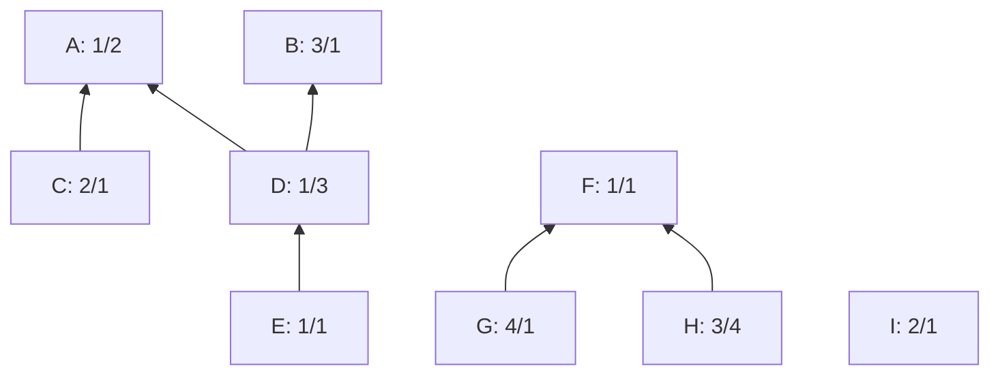
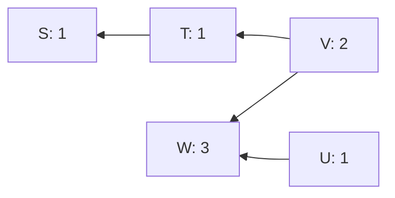
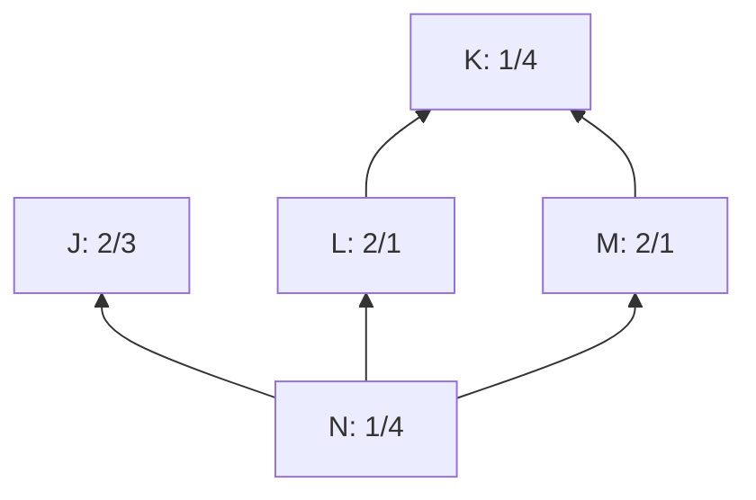

# Introduction to cluster linearization

sipa | 2024-07-09 20:23:11 UTC | #1

# Introduction to cluster linearization

<div data-theme-toc="true"> </div>

## 1. Abstract

This document attempts to explain the background, reasoning, and complexities behind cluster linearization. I started writing this as reading material for those who want to review Bitcoin Core PRs [#30126](https://github.com/bitcoin/bitcoin/pull/30126) (the basic linearization/improvement algorithm) and [#30285](https://github.com/bitcoin/bitcoin/pull/30285) (post-processing and merging of linearizations), but it is probably a useful explanation in general.

Things that are *not* covered here:
* The reasons for wanting a cluster mempool based approach in the first place. See [this topic](https://delvingbitcoin.org/t/an-overview-of-the-cluster-mempool-proposal/393) for that.
* More rigorous theory and proofs. See [this topic](https://delvingbitcoin.org/t/cluster-mempool-definitions-theory/202) for that.
* A detailed walk-through of the code in the PRs. This document just discusses abstract algorithms, but there are many implementation details needed to make them efficient. I believe those are best documented as comments in the code itself.
* Timeline, organization, or status of the involved PRs. See the [Tracking Issue](https://github.com/bitcoin/bitcoin/issues/30289) for that.
* As will become clear further, the most computationally expensive part of linearization is finding high-feerate subsets of a cluster to move to the front. That aspect is treated as black box here, but is largely covered in [this topic](https://delvingbitcoin.org/t/how-to-linearize-your-cluster/303).

## 2. Basics

Briefly summarized, the cluster mempool proposal consists of:
* New data structures:
  * **Clusters**: The set of mempool transactions is partitioned into groups known as *clusters* based on their connectivity. In order to bound the computational cost of operations on these clusters (see further), a *cluster count limit* is introduced, replacing the ancestor and descendant count limits.
  * **Linearizations**: For every cluster, a *linearization* is precomputed and maintained at all times. This is the order in which the transactions of that cluster would be mined, which is independent of other clusters. The goal of this document is explaining how we can find and maintain these linearizations.
  * **Chunks**: When higher-feerate transactions follow lower-feerate transactions in a linearization, they will naturally be included in blocks together, as a generalization of child-pays-for-parent (as the higher ones help pay for the lower ones). These groupings are known as the *chunks* of the linearization, and can be precomputed along with the linearizations themselves.

* Affected node operations:
  * **Transaction relay**: When new transactions are relayed, they will become new clusters, attach to existing clusters, or even merge multiple existing clusters. When this happens, the linearizations for those clusters need to be updated and/or recomputed.
  * **Block validation**: When new blocks are relayed and accepted, the mempool needs to be updated to account for the resulting changes (removing mined and conflicted transactions, and in the case of reorganizations, moving transactions back to the mempool). This will generally involve a bulk update to the mempool's linearizations.
  * **Block building**: Having precomputed linearizations and chunks for all mempool clusters, the construction of a block template for mining consists of repeatedly including the highest-feerate remaining first chunk across all clusters, until the block is (close to) full.
  * **Eviction**: Eviction (removal of mempool transactions when the mempool grows too large) becomes the exact opposite of block building: removing the chunk which would be included in a block last, which is simply the lowest-feerate last chunk across all clusters.
  * **Replace-by-fee evaluation**: In order to determine whether accepting an RBF transaction is an improvement to the mempool, we can directly compare the quality of the linearization of the affected clusters before and after, by comparing the cumulative-size-vs-cumulative-fee diagram of both (called the *feerate diagram*). See [this topic](https://delvingbitcoin.org/t/post-clustermempool-package-rbf-per-chunk-processing/190) for more information about (package) RBF and cluster mempool.
  * **Fee estimation**: fee estimation can benefit from having access to chunk feerates of the transactions involved, which act as effective mining scores. See [this topic](https://delvingbitcoin.org/t/package-aware-fee-estimator-post-cluster-mempool/312).

Below we expand on some of these concepts.

### 2.1. Clusters and linearizations

Consider the following example mempool, with 9 transactions, each labeled "name: fee/size". The arrows point up from children to their parents (so, e.g. transaction D spends an output of A and an output of B):


Clusters are defined as groups of transactions that are reachable from one another using any combination of is-parent-of and is-child-of relations. In the mempool above there are three clusters: ABCDE, FGH, and I. Here, and in what follows, names like FGH are a short notation for "the set of transactions containing F, G, and H".

For these clusters, at all times, a *linearization* (the order those transactions are to be mined in w.r.t. each other) is maintained. A valid linearization requires that all parents appear before their children. Still, there can be significant differences in quality between linearizations for the same cluster (see below). The idea is that whenever transactions are added or removed from clusters, the linearization for it is updated and/or recomputed. For the ABCDE cluster above, valid linearizations include (A,B,C,D,E), (B,A,D,C,E), and (A,C,B,D,E), but not (B,D,A,C,E) (D before A).

The *prefixes* of a linearization are all sets consisting of consecutive elements of the linearization from the start up to every point. For the (A,C,B,D,E) linearization, the prefixes are {A, AC, ACB, ACBD, ACBDE}.

To make sure some reasonable quality of linearization is always achievable within acceptable transaction relay latency, the cluster mempool proposal involves introducing a *cluster count limit* (in number of transactions), replacing the ancestor set and descendant set count limits.

It turns out that knowing the linearization of every cluster is sufficient to quickly construct good block templates for a given mempool. Furthermore, it lets us quickly determine what effective feerate a transaction will be mined at, even without actually constructing a block.

### 2.2. Feerate diagrams and chunking

To analyze linearizations, we make use of the *feerate diagram*, here demonstrated for the (A,B,C,D,E) linearization for the cluster shown above:


In a diagram where the X-axis represents the cumulative transaction size (which in practice could mean vsize or weight), and the Y-axis represents the cumulative transaction fee, place points for each prefix of the linearization (black dots). Then draw the [convex hull](https://en.wikipedia.org/wiki/Convex_hull) line of those points (purple line). The resulting line is the feerate diagram, which gives an approximation of how much fee can be collected within any given size. Each of its segments will correspond to one or more transactions; we call those groups of transactions the *chunks* of the linearization. The slope of the line segment corresponds to the *chunk feerate* (total fee divided by total size) of that chunk. Collectively, the chunks of a linearization are its *chunking*.

The example has two chunks, with chunking [ABC,DE]. Note the use of square brackets for chunkings, and parentheses for linearizations.

The *prefixes* of a chunking are, similar to the prefixes of a linearization, the sets formed as the unions of all chunks from the beginning of the chunking up to every point. The prefixes of [ABC,DE] are {ABC, ABCDE}. These prefixes correspond to the diagram points that form the chunk boundaries.

It turns out that the chunking can be computed using the following algorithm:
* $\operatorname{Chunking}(C, L)$, for a cluster $C$ with linearization $L$:
  * Set $R = []$, a list of sets of transactions.
  * For $tx \in L$:
    * Append the singleton $\{tx\}$ to $R$.
    * While $R$ has two or more elements, and the feerate of the last one is higher than that of the penultimate one:
      * Replace the last two elements of $R$ with their union.
  * Return $R$.

Working out our example, we get the following steps:
* Add A: [A]
* Add B: [A,B]
  * B's feerate is higher than A's, combine them: [AB]
* Add C: [AB,C]
  * C's feerate is higher than AB's, combine them: [ABC]
* Add D: [ABC,D]
  * D's feerate is *not* higher than ABC's, stop the while loop: [ABC,D]
* Add E: [ABC,D,E]
  * E's feerate is higher than D's, combine them: [ABC,DE]
  * DE's feerate is *not* higher than ABC's, stop the while loop: [ABC,DE]

Next we analyze the complexity of this algorithm. Note that here and in what follows, the complexities assume that set operations (including intersections, unions, subtractions, ...) are $\mathcal{O}(1)$. This is not true in an asymptotic sense (operations on larger sets are necessarily $\mathcal{O}(n)$, just due to reading the set), but is largely true in practice as the implementation uses bitsets (of bounded size) to represent sets.

The $\operatorname{Chunking}$ algorithm consists of two nested loops, but the inner loop can run at most once per element of $L$, making it have only $\mathcal{O}(n)$ iterations. If we additionally cache the combined fee and size of the sets in $R$, the cost per iteration is $\mathcal{O}(1)$, and the result is an $\mathcal{O}(n)$ algorithm, which is so fast that we can generally ignore the distinction between linearizations and their chunkings. For some operations the linearization is more convenient, and for others the chunking is; we will proceed as if both are always available, even though it may mean recomputing the chunking from time to time.

An important property is that the first chunk of a linearization has the highest feerate/slope of any prefix of the linearization, and further chunks have non-increasing feerates/slope. This must be the case: if not, a higher-slope line would follow a lower-slope line, which would be in contradiction with the convex hull shape of the feerate diagram.

In a way, chunks can be seen as a generalization of [child-pays-for-parent](https://bitcoinops.org/en/topics/cpfp/): whenever children pay a higher feerate than their ancestors, they may get chunked together with them, effectively pooling their fees to pay for their joint size. The effective feerate, or mining score, of a transaction is the feerate of the chunk it is part of. This effective feerate can be higher or lower than a transaction's individual feerate: it is lower when it is paying for lower-feerate transaction in the same chunk, and it is higher when another higher-feerate transaction in the same chunk is paying for it.

### 2.3. Comparing linearizations

Our goal is constructing and maintaining good linearizations for our clusters, but we need a metric to know what to optimize for. To do so, we compare their feerate diagrams for every X-axis (size) coordinate. Depending on how the diagram lines compare, two linearizations can be **equivalent** (coinciding), **better** (above), **worse** (below), or **incomparable** (both above and below).

For example, (A,B,C,D,E) and (B,A,D,C,E) are incomparable, because both are above the other one for some sizes:


While the convex-hull aspect of the feerate diagram results in diagrams only being an approximation for the quality of a linearization (by smoothing out fees over chunks), it is one with a very important property: **every cluster has an *optimal* linearization which is equivalent to or better than every valid linearization of the same cluster**. There can be multiple optimal linearizations that are all equivalent, but they will all be strictly better than all non-optimal linearizations. This implies that when faced with two incomparable linearizations, a third one always exists that is strictly better than both.

For our ABCDE example, that optimal linearization is (B,A,C,D,E), with chunking [B,AC,DE]. It is clearly better than both of our earlier linearizations (A,B,C,D,E) and (B,A,D,C,E):


Note that since the names of the points in the feerate diagram simply represent sets of transactions without implying an order, BAC is the same as ABC, and BACDE is the same as ABCDE. They are rendered here in linearization order for readability.

Furthermore, it can be shown that an optimal linearization can be constructed using the following algorithm:
* $\operatorname{OptLin}(C)$, for a transaction cluster $C$:
  * Set $R = []$, an empty list of transactions.
  * While there are transactions left in $C$:
    * Find the highest-feerate topological (=including all its own not yet included ancestors) subset $s \subset C$, using $\operatorname{OptSubset}$ (see further).
    * Append the elements of $s$ to $R$ in any valid order, and remove them from $C$.
  * Return $R$.

The $\operatorname{OptSubset}$ algorithm is not described in this post, but the approach in Section 2 of [How to linearize your cluster](https://delvingbitcoin.org/t/how-to-linearize-your-cluster/303#h-2-finding-high-feerate-subsets-5) can be used to implement it with $\mathcal{O}(n \cdot 2^{n/2})$ complexity. Due to the exponential nature, this approach is not computationally feasible for every cluster size we want to support. Still, it is a good starting point for the algorithms that follow.

Besides acting as a criterion to define better and worse linearizations for a given cluster, feerate diagram comparison can also be used to determine which of two *clusters* is better, or even two whole mempools. This is relevant in RBF (replace by fee) settings, where we want to determine whether a transaction replacement is [incentive compatble](https://delvingbitcoin.org/t/mempool-incentive-compatibility/553). Specific ideas on how to leverage cluster mempool based feerate diagram comparisons in a (package) RBF setting are explored in [this topic](https://delvingbitcoin.org/t/post-clustermempool-package-rbf-per-chunk-processing/190).

### 2.4. Block building and eviction

When building block templates from a mempool, or when evicting from a mempool, we need to look at all clusters, rather than just one. To reason about that, notice that nothing prevents us from defining a linearization or its chunking for the entire mempool. We do not need to actually compute this full-mempool chunking, but we can still reason about its properties.

One important property is that given optimal linearizations' chunkings for all clusters in the mempool, the optimal chunking of the entire mempool consists of a "merge sort" of the chunks of the individual clusters. That is, include the chunks one by one from all clusters, from high to low feerate. Since chunks within a cluster are already in decreasing feerate order, the result will respect the individual cluster linearization orders. When there are multiple chunks of equal feerate within one linearization, their order has to be maintained of course. This merge-sort property is what makes cluster mempool "work": the fact that transactions do not affect the linearizations beyond their own clusters.


For our example mempool, the optimal chunkings are [B,AC,DE], [FG,H], and [I]. The optimal linearization of the entire mempool is (B,I,F,G,A,C,H,D,E) with chunking [B,I,FG,AC,H,DE], which is just the chunks from all clusters combined and sorted.

Even though we cannot guarantee that our linearizations are optimal, the approach is still usable for building blocks: we pick however many of the first chunks of the whole-mempool chunking fit. This can be done by consecutively picking the next highest-feerate remaining first chunk among all cluster linearizations, until the next one is too large to fit.

Even if the cluster linearizations are optimal, this approach does not guarantee that the resulting block is optimal (in terms of maximizing total fees), due to bin packing effects near the end of the block. However, a weaker property does hold: **if the cluster linearizations are optimal, then the prefixes of their merged chunkings have the maximum possible fee for their own size**. Concretely, in our example here, that means for all sets of size 1 (B), 2 (BI), 4 (BIFG), 7 (BIFGAC), 10 (BIFGACH), and 14 (BIFGACHDE), no sets exist with a higher fee at the same or smaller size than these. In other words, *if* the block vsize limit happens to be exactly equal to the size of one of those prefixes, and the cluster linearizations are optimal, the block fee will be maximal.

If the block vsize limit does not match the size of a prefix of chunks, the total fee may be lower than the highest possible one. Still, the feerate diagram of an optimal linearizations does provide an upper bound on how many fees are achievable in each size.

In our example, if the block vsize limit were (for presentation purposes) just 3, then based on the diagram (knowing it is optimal) we can tell that no more than 6+½ fee is possible (the fee of the point where the BI-BIFG line crosses size 3) with any topological set of transactions. The approach of picking chunks as long as they fit would yield 5 fee (the BI point), but the actual optimal has 6 fee (BFG or BFI). This difference is limited by the unfilled size of the block multiplied by the chunk feerate of the first chunk that does not fit. Because of this, we want a limit on the size (in vbytes) of clusters (in addition to the cluster count limit), as it limits the fee loss caused by this. Some of the loss of block template fees due to this effect can still be mitigated by e.g. skipping chunks too large and trying further ones, or searching different combinations at block building time, but it is hard to guarantee much this way.

Note that all of the above is about block template fees that are lost just due to end-of-block size effects, which exist even when all cluster linearizations are optimal. If the linearizations are suboptimal, the losses due to that will compound.

Given the insight that the (implicit) chunking for the entire mempool is the sorted combination of all individual cluster chunkings, and block building is (roughly) picking the beginning of that chunking, it is easy to reverse the process for eviction. When the mempool grows too large, we find the lowest-feerate *last* chunk among all cluster chunkings, and evict that, as it would be the last thing we would include in a block template.

## 3. Maintaining linearizations

With some of the basics covered, we dive into how cluster linearizations are constructed and maintained.

### 3.1. Dealing with suboptimality

Due to the exponential nature of the $\operatorname{OptSubset}$ algorithm, we have to accept that for some clusters we may not always know an optimal linearization. Let us turn $\operatorname{OptLin}$ into a $\operatorname{Lin}$ algorithm that replaces $\operatorname{OptSubset}$ with an arbitrary $f$ function that finds a high-feerate non-empty topological subset of what it is passed:
* $\operatorname{Lin}_f(C)$, for a transaction cluster $C$, and a function $f$ that returns a non-empty topological subset, preferably with a high feerate:
  * Set $R = []$, an empty list of transactions.
  * While there are transactions left in $C$:
    * Let $s = f(C)$.
    * Append the elements of $s$ to $R$ in any topological order, and remove them from $C$.
  * Return $R$.

While suboptimality does mean a degradation of block template quality, this is a minor effect only, as long as the result is close. There are more serious complications however. For example, in the RBF setting it makes it possible that we conclude an objectively worse replacement is an improvement and accept it, or vice versa. [Imagine](https://delvingbitcoin.org/t/post-clustermempool-package-rbf-per-chunk-processing/190/14) a complicated cluster for which network nodes are generally unable to find the optimal linearization. An attacker-constructed replacement may objectively be a degradation then, but if it simplifies the cluster enough that the optimal linearization does get discovered, network nodes may still treat it as an improvement.

This highlights the need for not just cluster linearization quality in an absolute sense, but also in a relative one: ideally, if cluster A is better than cluster B when linearized optimally, we still recognize A as better than B even without optimal linearizations. This is not a fully addressable problem, but there are algorithms that can help improve the situation.

Specifically, we can instead of only using algorithms that compute (hopefully, good) linearizations from scratch, also use algorithms that take as input one or more existing linearizations, and produce a new linearization that is equivalent or better than each input linearization. Three algorithms will be described:
* $\operatorname{Merge}(C, L_1, L_2)$: given a cluster $C$ and two linearizations for it, produce a new linearization that is equivalent to or better than both. In particular, if the two input linearizations are incomparable, this implies their merging will be strictly better than both. See [this topic](https://delvingbitcoin.org/t/merging-incomparable-linearizations/209) for history. Complexity: $\mathcal{O}(n^2)$.
* $\operatorname{LIMO}_f(C, L)$: given a cluster $C$ and linearization for it, improve it by finding high-feerate subsets to move closer to the front using $f$. It is a variant of the $\operatorname{Lin}_f$ algorithm above, but crucially guarantees that the resulting linearization is equivalent to or better than the input linearization. See [this topic](https://delvingbitcoin.org/t/limo-combining-the-best-parts-of-linearization-search-and-merging/825) for history. Complexity: depends on how much time is spent in $f$, but at least $\mathcal{O}(n^2)$.
* $\operatorname{PostLin}(C, L)$: given a cluster $C$ and a linearization for it, possibly make some "obvious" improvements to the linearization which are not guaranteed by merging or LIMO. See [this topic](https://delvingbitcoin.org/t/linearization-post-processing-o-n-2-fancy-chunking/201) for history. Complexity: $\mathcal{O}(n^2)$.

The actual possible approaches using these algorithms are countless, but here are some example of how these algorithms can be employed when evaluating RBF replacements. Imagine a new transaction $a$ ("add") arrives that would attach to an existing cluster $C$, which has an existing linearization, and where it conflicts with an old transaction $d$ ("delete").
* We can compute an updated cluster $C'$ (with $a$ added, and $d$ deleted), compute a linearization for $C'$ from scratch using $\operatorname{Lin}$, and compare the feerate diagrams of the old and new linearizations to determine if the result is an improvement.
* However, it is possible that significant effort had already been spent coming up with a good linearization for $C$ before $a$ arrived. In order to not throw that away, it is possible to first construct a "naive" relinearization by taking the old one, removing $d$ from it, and appending $a$ at the end, and then using $\operatorname{LIMO}$ on that instead. Applying $\operatorname{PostLin}$ on that naive relinearization first can make the process better still.
* Even with this, it is possible that $\operatorname{LIMO}$ discovers an improvement in the new linearization that was actually already possible in the old one, but just was not known. In this case, it would be useful to "backport" that knowledge to the old linearization before comparing. To do so, we can take the resulting new cluster's linearization, remove $a$ and reinsert $d$ again, and then use $\operatorname{Merge}$ to combine it with the original old linearization, possibly after another $\operatorname{PostLin}$.

Even in a non-replacement setting, $\operatorname{LIMO}$ and $\operatorname{PostLin}$ are useful for updating linearizations after a transaction is accepted.

### 3.2. Improving linearizations

Before digging into the actual algorithms, it is useful to gain some insight into what exactly it is that determines whether changes to a linearization constitute an improvement.

#### 3.2.1 Naively moving higher-feerate sets

One might think that moving any topological subset with a feerate higher than the first chunk of a linearization to the front would necessarily be an improvement to its feerate diagram.

Consider this simpler example, where transactions are labelled "name: fee" (they all have size 1):



The linearization (S,T,W,V,U) has chunking [STWV,U], whose first chunk STWV has feerate 7/4=1.75:


Now consider the topological subset WU, with feerate 4/2=2. Despite having a higher feerate than the first chunk STWV of (S,T,W,V,U), moving it to the front is *not* a strict improvement:


By moving WU to the front, W becomes a new chunk on its own, and U merges with what follows. The resulting USTV chunk is actually worse in some places than the old linearization.

Thus, when moving a topological subset to the front of a linearization, it clearly does not suffice that the moved set has a higher feerate than the first chunk. Another condition is needed to prevent the moved subset from splitting up and worsening further parts.

#### 3.2.2 Guaranteed non-worsening

Imagine a very simple linearization $L$ whose chunking consists of just two chunks, $u$ and $(C \setminus u)$, which necessarily implies that the feerate of $u$ is not below that of $(C \setminus u)$. Now consider a topological subset $s$ of the cluster. We want to know under what conditions moving $s$ to the front of the linearization will be an improvement.

It turns out that sufficient conditions for non-worsening are:
* 1. The feerate of $s$ needs to be at least as high as that of $u$.
* 2. The intersection $s \cap u$ needs to not exceed the feerate of $s$, or this intersection must be empty.

If additionally $s$ has a strictly higher feerate than $u$, moving it will be a strict improvement.

These are not necessary conditions (moving $s$ may be a non-worsening/improvement even if both do not hold), but they are sufficient, and moreover they will turn out to be easy to satisfy. A proof for a more general statement can be found [here](https://delvingbitcoin.org/t/limo-combining-the-best-parts-of-linearization-search-and-merging/825/8#h-13-the-set-gathering-theorem-4).

And this gives a hint for the solution already: if we ever consider moving a higher-feerate set to the front of a linearization, but that set has an even-higher-feerate intersection with a prefix of what we already have, then we should move that intersection to the front instead. In our example there is indeed such an intersection (W), and if we were to move that intersection instead to the front, we do get a strictly improved chunking [W,STV,U]:


#### 3.2.3. Composing topological sets

Whenever we are improving things, we will be building a new linearization while simultaneously guaranteeing that certain points on the feerate diagram which we know how to hit, are actually hit. In our original example, when considering these two linearizations:


Any linearization whose feerate diagram goes through or above all the labeled points (corresponding to the prefixes of both linearizations) in the diagram will necessarily be as good or better as both the (A,B,C,D,E) and (B,A,D,C,E) linearizations. It turns out that a strategy exists to do this generically: given any number of topologically valid sets $u_1, u_2, \ldots, u_k$ which together include each cluster transaction at least once (in our example, the $u_i$ sets would be A, B, AB, ABC, ABD, ABCD, and ABCDE), we can construct a linearization whose diagram goes through or above all of their (size, fee) points as follows:

* $\operatorname{Compose}(C, \{u_1, u_2, \ldots, u_k\})$, for cluster $C$ and topological subsets $u_i$ which together cover all of $C$:
  * Let $R = []$, the returned linearization.
  * While $C$ is not empty:
    * Find a topological subset $s$ whose feerate is at least the maximum of all $u_i$'s feerates, and such that no $s \cap u_i$ has an even higher feerate.
    * Append $s$ to $R$ in any valid order, and remove it from $C$, and from all $u_i$.
  * Return $R$.

Ways to find $s$ such that the necessary properties are fulfilled will follow later, we can already give an intuition for why this strategy works.

Consider an equivalent algorithm that instead operates on linearizations $L_i$ that each consist of just two chunks $[u_i, C \setminus u_i]$. In each iteration it finds a subset $s$ satisfying the conditions above, and constructs $k$ new linearizations by moving $s$ to the front of all old $L_i$ ones. Since the two conditions for non-worsening are satisfied, each new linearization is at least as good as its corresponding old linearization. The algorithm then continues doing the same on the non-$s$ part of the new linearizations. Ultimately, all the same sets $s$ have been moved to the front, so the final linearizations are all the same, and thus this common output linearization is at least as good as every input linearization. Since for each $u_i$ there was an input linearization whose feerate diagram goes through its (size, fee) point, the diagram of the resulting linearization goes through or above all those points too.

This explanation is not exact, because there may be sets $u_i$ for which it is impossible to construct a linearization $L_i$ that has $u_i$ as its first chunk (and everything else as one other chunk). Still, a [somewhat more rigorous](https://delvingbitcoin.org/t/cluster-mempool-definitions-theory/202/14) treatment shows that this $\operatorname{Compose}$ approach works for any set of topological $u_i$ sets.

To find each $s$ set, we make use of what was hinted at already. Start with the highest-feerate $u_i$, but when that set has a non-empty higher-feerate intersection with any of the other $u_i$ sets, switch to considering that intersection. Then try intersecting that with all other $u_i$ sets again (even ones tried already), as another intersection may make it better yet, and keep doing that until no improvement is made anymore:

* $\operatorname{Compose}(C, \{u_1, u_2, \ldots, u_k\})$, for cluster $C$ and topological subsets $u_i$ which together cover all of $C$:
  * Let $R = []$, the returned linearization.
  * While $C$ is not empty:
    * Set $s$ to be the highest-feerate $u_i$.
    * While $s$ is being improved:
      * For every $u_i$, if $s \cap u_i$ is non-empty and has a higher feerate than $s$, update $s = s \cap u_i$, and restart the while loop.
    * Append $s$ to $R$ in any valid order, and remove it from $C$, and from all $u_i$.
  * Return $R$.

To determine the complexity of this, note that:
* The other "While $C$ is not empty" loop may run up to $n$ times.
* The "While $s$ is being improved" loop may run up to $\operatorname{min}(n, k)$ times.
* The "For every $u_i$" loop will run $k$ times.
* By caching the feerates of intersections between $s$ and every $u_i$, the number of feerate operations done in the inner loop is limited to $nk$ per iteration of the "While $C$ is not empty" loop.

This means the overall algorithm complexity is $\mathcal{O}(n^2k)$. The practical specializations of it that follow will do better, though.

### 3.3. Practical algorithms

#### 3.3.1. Merge

The goal when merging two linearizations is constructing a linearization whose feerate diagram is for every size on or above both input linearization diagrams. As shown in the previous section, this can be accomplished by running the generic $\operatorname{Compose}$ algorithm with all prefixes of both input linearizations as $u_i$ sets. Doing so would have $\mathcal{O}(n^3)$ complexity, and we can do better.

Instead of using the general approach from the previous section for finding each $s$ set, we can use a more specialized variant with better efficiency. The culprit is the need to restart the search for better intersections with the $u_i$ sets every time $s$ improves, which turns out, can be avoided. All we need is a way to find an $s$ each time that satisfies the two conditions:
* 1. The feerate of $s$ is at least as high as every prefix of the remainder of the two linearizations.
* 2. The feerate of the intersection between $s$ and any linearization remainder prefix.


One key insight is that many of the linearization prefixes are redundant. Any feerate diagram that hits or exceeds the convex hull vertices of the input linearization (B and ABCDE for the first; ABC and ABCDE for the second) will also hit or exceed every other point. In other words, it suffices to include in the $u_i$ sets only the *chunk* prefixes rather than the linearization prefixes.

This is not a full solution: we have reduced the problem to searching prefixes of what remains of the *original* chunks rather than all prefixes of what remains, but the restarting remains necessary. However, no harm is done by switching to the *actual* chunking of what remains of the linearization in the specific iteration of $\operatorname{Compose}$ we are in instead, as that will be at least as good as the remainder of the $u_i$ sets after removing $s$. And with that, the loop is no longer needed:

* $\operatorname{Merge}(C, L_1, L_2)$:
  * Let $R = []$
  * While $C$ has transactions left:
    * Compute the chunkings of what remains of both linearizations (using $\operatorname{Chunking}$).
    * Let $h$ be the highest-feerate first chunk of the two (remember that the first chunk of a linearization is its highest-feerate prefix).
    * For every prefix $p$ of the *chunking* of the *other* linearization (the one which $h$ is not the first chunk of), from short to long:
      * If the intersection $h \cap p$ is non-empty and has higher-feerate than $h$ itself, set $s = h \cap p$ and stop.
    * If the loop above did not find any better intersection, set $s = h$.
    * Append $s$ in any valid order to $R$, remove its transactions from $C$ and $L_1$ and $L_2$.
  * Return $R$.

This works, because $h$ in each iteration starts off being already the shortest possible prefix of the chunkings of what remains of one of the two linearizations, so whatever happens with intersections with the other linearization, there is never a need to go back to trying intersections with the chunks of the first one. And there is no point continuing either with intersections with the other one either: $s$ is already a subset of all of the longer (later) ones, and the shorter (earlier) ones have been tried before, so cannot be an improvement (if one were better, it would already have been picked instead).

Regarding complexity, the while loop can run at most $\mathcal{O}(n)$ times, and each iteration performs a $\operatorname{Chunking}$ which is also $\mathcal{O}(n)$, as is the cost of iterating over the prefixes $p$. Together, this means an overall complexity of $\mathcal{O}(n^2)$.

**The existence of the merging algorithm proves that every cluster has an optimal linearization.** Take every valid linearization, and merge them one by one together to obtain a merging of all them. The result is necessarily as good as every linearization, and thus optimal.

#### 3.3.2. LIMO

Going back to the naive linearization algorithm from earlier:
* $\operatorname{Lin}_f(C)$, for a transaction cluster $C$, and a function $f$ for finding high-feerate topological subsets:
  * Set $R = []$, an empty list of transactions.
  * While there are transactions left in $C$:
    * Let $s = f(C)$.
    * Append the elements of $s$ to $R$ in any valid order, and remove them from $C$.
  * Return $R$.

Our goal is constructing an (efficient) variant of this that also takes in an existing linearization, while also invoking $f$ to find good subsets to move to the front. Naively, this can be accomplished by instead of building an $R$ from scratch, starting from the existing linearization $L$ and then for every set $s$ found invoke $\operatorname{Merge}$ to merge $L$ with a version of itself that has $s$ moved to the front. This is where the name LIMO comes from: "Linearization through Incremental Merging of Optimizations".

The same behavior can be achieved more efficiently however:

* $\operatorname{LIMO}_f(C, L)$, for a transaction cluster $C$, an existing linearization $L$, and a function $f$ that returns a non-empty topological subset, preferably with a high feerate:
  * Set $R = []$, an empty list of transactions.
  * While there are transactions left in $C$:
    * Let $s$ be the highest-feerate prefix of what remains of $L$.
    * If $f(C)$ has a higher feerate than $s$:
      * Set $s = f(C)$.
      * For every prefix $p$ of what remains of $L$ from short to long:
        * If the intersection $s \cap p$ has an even higher feerate: set $s$ to that and stop.
    * Append the elements of $s$ to $R$ in any valid order, and remove them from $C$ and $L$.
  * Return $R$.

This is effectively a variant of $\operatorname{Compose}$ again where the $u_i$ sets are chosen to be the prefixes of the original linearization $L$, and with a specialized $s$-finding step that additionally guarantees a feerate not below that of whatever $f(C)$ is at that point. It satisfies the improvement properties for similar reasons as the $\operatorname{Merge}$ algorithm: (1) $s$ starts off with a feerate not below the highest-feerate prefix, and (2) no further intersections with prefixes can improve it (shorter ones have been tried already, longer ones it is already a subset of). Therefore $R$ will be at least as good as $L$.

It is possible to restrict each initial $s$ as well as the intersections to prefixes at the chunk boundaries of $L$. Unlike for $\operatorname{Merge}$, there is no second linearization whose intersections may trigger a restart with intersections of the first linearization, so it suffices to only consider the *original* chunk boundaries (from before any $s$ was removed from $L$). It would not hurt to re-chunk, but it is also not necessary here.

* $\operatorname{LIMO}_f(C, L)$, for a transaction cluster $C$, an existing linearization $L$, and a function $f$ that returns a non-empty topological subset, preferably with a high feerate:
  * Set $R = []$, an empty list of transactions.
  * Compute the chunking of $L$.
  * While there are transactions left in $C$:
    * Let $s$ be the highest-feerate prefix of what remains of $L$, at the (original) chunk boundaries.
    * If $f(C)$ has a higher feerate than $s$:
      * Set $s = f(C)$.
      * For every prefix $p$ of what remains of $L$, at the (original) chunk boundaries, from short to long:
        * If the intersection $s \cap p$ has an even higher feerate: set $s$ to that and stop.
    * Append the elements of $s$ to $R$ in any valid order, and remove them from $C$ and $L$ (and optionally recompute chunking of what remains of $L$).
  * Return $R$.

If $f(C)$ is cheap, the algorithm's complexity is dominated by the inner $p$ loop, which may run up to $\mathcal{O}(n^2)$ times. If $f(C)$ is expensive, its complexity will dominate.

#### 3.3.3 Post-linearization

Consider the following example, with transactions labelled "name: fee/size":



The highest-feerate ancestor set in this graph is J (2/3=0.666), better than KL or KM (3/5=0.6), and better than JKLMN (8/13=0.615). Thus, in case the $f$ function for $\operatorname{LIMO}_f$ is sufficiently restricted in search iterations, it is not unreasonable that it finds J as first $s$. In this case the resulting linearization is (J,K,L,M,N), with chunking [JKLM,N].


There is something silly about this result: JKLM is not even connected. It consists of two disconnected components J and KLM. Disconnected components can obviously be swapped without breaking topology. And in this case, doing so improves the feerate diagram, as shown above, but $\operatorname{LIMO}$ does not necessarily discover this.

To address this, recall the $\operatorname{Chunking}$ algorithm:

* $\operatorname{Chunking}(C, L)$, for a cluster $C$ with linearization $L$:
  * Set $R = []$, a list of sets of transactions.
  * For $tx \in L$:
    * Append the singleton $\{tx\}$ to $R$.
    * While $R$ has two or more elements, and the feerate of the last one is higher than that of the penultimate one:
      * Replace the last two elements of $R$ with their union.
  * Return $R$.

It only considers two options:
1. Merging two sets (if the latter has a higher feerate).
2. Deciding to leave two sets separate (if not).

If we add a third option, namely swapping the two sets (if the latter has higher feerate, but does not depend on the first one), while also swapping the corresponding transactions in the linearization, all resulting chunks will necessarily be connected (because no two sets get merged that have no dependency). The result is the $\operatorname{PostLin}$ algorithm.

* $\operatorname{PostLin}(C, L)$, for a cluster $C$ with linearization $L$:
  * Set $R = []$, a list of *lists* of transactions.
  * For $tx \in L$:
    * Append the single-element list $[tx]$ to $R$.
    * Let $cur$ be this new single-element list.
    * While $cur$ is not the first list of $R$, and $cur$ has a higher feerate than the list before it:
      * If $cur$ includes a transaction that depends on one in the list before it:
        * Prepend this previous list to $cur$, and continue with it.
      * Otherwise, swap $cur$ with this previous list, and continue with $cur$.
  * Return the concatenation of all $R$ lists.

There may be up to $\frac{n(n-1)}{2}$ swap operations in the above algorithm, which makes it in the worst case $\mathcal{O}(n^2)$ (unlike $\operatorname{Chunking}$ which is $\mathcal{O}(n)$). For this reason we do not use it for chunking itself, but leave it as a separate post-processing step that can improve linearizations (note that it returns a list of transactions, not a chunking).

The algorithm is described here in a front-to-back manner, but it can also be done back-to-front. Both guarantee connected chunks, but provide other properties in addition to it. For example, the back-to-front variant has the following property. If we start from an existing linearization $L$, and move a leaf transaction (one with no children) of its cluster to the end of a linearization (and possibly increase its fee), then postlinearization in a back-to-front order guarantees an output linearization that is at least as good as $L$. This makes it particularly interesting before comparisons/mergings in RBF settings like the ones described in the "Dealing with suboptimality" section above.

## 4. Implementations

The $\operatorname{Merge}$ algorithm is implemented as `MergeLinearizations()` in [PR #30285](https://github.com/bitcoin/bitcoin/pull/30285). The cluster $C$ and linearizations $L_1$ and $L_2$ are not actually modified during the loop, but instead a set `todo` is kept with $C$ transactions that are left to do. Another optimization is that it avoids recomputing the chunking of linearizations when the $s$ exactly matches either first chunk; instead, that chunk can just be cut off.

The $\operatorname{LIMO}_f$ algorithm is implemented in the `Linearize()` function in [PR #30126](https://github.com/bitcoin/bitcoin/pull/30126), where the $f$ function is instantiated as returning the highest-feerate subset among:
1. The highest-feerate remaining ancestor set: this closely matches what the current Bitcoin Core block building algorithm uses (since version 0.13.0 with [PR #7600](https://github.com/bitcoin/bitcoin/pull/7600) in 2016), and is just an efficient good first start.
2. The highest-feerate prefix of what remains of $L$ (at original chunk boundaries), as $\operatorname{LIMO}$ needs to compute that anyway.
3. The highest-feerate topological subset found through [search](https://delvingbitcoin.org/t/how-to-linearize-your-cluster/303#h-2-finding-high-feerate-subsets-5) with an iteration limit to bound its cost (an efficient implementation of this search algorithm is in [PR #30286](https://github.com/bitcoin/bitcoin/pull/30286)). The best among (1) and (2) above is used as initial best in this algorithm, allowing it to avoid parts of the search tree which can be proven not to be able to produce better results than that.

The existing linearization is passed to the `Linearize()` function as `old_linearization`, which is allowed to be empty. If it is, `Linearize` simply implements the $\operatorname{Lin}_f$ algorithm, with the same $f$ function (dropping option (2) above, as it does not apply). This way, `Linearize()` can be used both to construct an initial linearization or improve one.

The `PostLinearize()` function implemented in [PR #30285](https://github.com/bitcoin/bitcoin/pull/30285) performs the $\operatorname{PostLin}$ operation twice: first in back-to-front order, and once again in front-to-back order.

## Acknowledgements

Many of the results presented here are the result of discussions with various people, and this writeup received many comments and suggestions from them, including Suhas Daftuar (@sdaftuar), Anthony Towns (@ajtowns), Greg Sanders (@instagibbs), Mark Erhardt (@murch), Gloria Zhao (@glozow), and others.

## Code for diagram generation

[details="Code to generate feerate diagrams"]
```python
import subprocess

def plot(filename, transactions, linearizations):
    """Generate PNG filename with fee-size diagrams for linearizations using transactions."""
    maxsize = 0
    maxfee = 0
    for line in linearizations:
        if len(line) == 4:
            maxsize = max(maxsize, sum(sum(transactions[txn][0] for txn in txnam) for txnam in line[1]))
            maxfee = max(maxfee, sum(sum(transactions[txn][1] for txn in txnam) for txnam in line[1]))
    width = (maxsize + 1) * 48 + 135
    height = (maxfee + 1) * 48 + 103
    labcount = 1

    # Start gnuplot, and define function to send lines of code to it.
    plot_process = subprocess.Popen("gnuplot", stdin=subprocess.PIPE)
    def send(code):
        print(code)
        plot_process.stdin.write((code + "\n").encode())

    # Common preamble
    send(f"set terminal pngcairo enhanced size {width},{height} font \"Verdana,15\"")
    send(f"set output \"{filename}\"")
    send("set key bottom right")
    send("set size ratio -1")
    send("set grid x y")
    send(f"set xtics 0, 1, {maxsize}")
    send(f"set ytics 0, 1, {maxfee}")
    send(f"set xrange [0:{maxsize + 1}]")
    send(f"set yrange [0:{maxfee + 1}]")
    send("set xlabel \"cumulative size\"")
    send("set ylabel \"cumulative fee\"")
    send(f"set label 1 \"\" at 0,0 point ps 2 pt 7 offset 0.4,-0.4")

    # Strings with arguments to plot command.
    graphs = []
    # At which positions dots have been placed already.
    dots = set()
    # Iterate over all linearizations
    linnum = 0
    for line in linearizations:
        if len(line) == 4:
            col, lin, ondots, offdots = line
            # Compute the (size,fee,names) pairs of all chunks of the linearization.
            chunks = [(0, 0, "")]
            for txnam in lin:
                nchunk = (sum(transactions[txn][0] for txn in txnam), sum(transactions[txn][1] for txn in txnam), txnam)
                while len(chunks) > 1 and nchunk[1] * chunks[-1][0] > nchunk[0] * chunks[-1][1]:
                    nchunk = (nchunk[0] + chunks[-1][0], nchunk[1] + chunks[-1][1], chunks[-1][2] + nchunk[2])
                    chunks.pop()
                chunks.append(nchunk)
            # Compute the set of (size,fee) pairs of chunk prefixes.
            diadots = set()
            csize = 0
            cfee = 0
            for size, fee, txnams in chunks:
                csize += size
                cfee += fee
                diadots.add((csize, cfee))
            # Determine which dots to output.
            cat = ""
            accsize = 0
            accfee = 0
            for txnam in lin:
                labcount += 1
                cat += txnam
                accsize += sum(transactions[txn][0] for txn in txnam)
                accfee += sum(transactions[txn][1] for txn in txnam)
                if (ondots and ((accsize, accfee) in diadots)) or (offdots and ((accsize, accfee) not in diadots)):
                    if (accsize, accfee) not in dots:
                        if accsize == maxsize:
                            send(f"set label {labcount} \"{cat}\" at {accsize},{accfee} right point ps 2 pt 7 offset -1.2,0.2")
                        else:
                            send(f"set label {labcount} \"{cat}\" at {accsize},{accfee} left point ps 2 pt 7 offset 0.4,-0.4")
                        dots.add((accsize, accfee))
            # Create a data variable(s) for the diagram itself.
            if isinstance(col, str):
                send(f"$data{linnum} << EOD")
                acsize = 0
                acfee = 0
                chunknames = []
                for csize, cfee, cnams in chunks:
                    acsize += csize
                    acfee += cfee
                    chunknames.append(cnams)
                    send(f"{acsize} {acfee}")
                send(f"EOD")
                # Add a graph line.
                if isinstance(lin, list):
                    graphs.append(f"$data{linnum} with line lw 2 lc rgb \"{col}\" title \"({','.join(lin)})\"")
                else:
                    graphs.append(f"$data{linnum} with line lw 2 lc rgb \"{col}\" title \"[{','.join(chunknames[1:])}]\"")
            elif isinstance(col, list):
                cnum = 0
                acsize = 0
                acfee = 0
                for csize, cfee, cnams in chunks[1:]:
                    send(f"$data{linnum}_{cnum} << EOD")
                    send(f"{acsize} {acfee}")
                    acsize += csize
                    acfee += cfee
                    send(f"{acsize} {acfee}")
                    send("EOD")
                    graphs.append(f"$data{linnum}_{cnum} with line lw 2 lc rgb \"{col[cnum]}\" notitle")
                    cnum += 1
            linnum += 1
        elif len(line) == 2:
            tsize = sum(transactions[txnam][0] for txnam in line[1])
            tfee = sum(transactions[txnam][1] for txnam in line[1])
            labcount += 1
            send(f"set label {labcount} \"{line[1]}\" at {tsize},{tfee} right point ps 2 pt 7 lc rgb \"{line[0]}\" offset -1.2,0.2 tc rgb \"{line[0]}\"")
    # Send a combined plot command with all graph lines.
    send(("plot " + ", ".join(graphs)))
    # Let gnuplot do its job.
    plot_process.communicate()

def plots(diag):
    """Generate a number of feerate diagram PNGs described by diag."""
    for filename, linearizations in diag["diagrams"].items():
        plot(filename, diag["transactions"], linearizations)
        subprocess.run(["pngcrush", filename])

DIAG1 = {
    "transactions": {
        "A": (2, 1),
        "B": (1, 3),
        "C": (1, 2),
        "D": (3, 1),
        "E": (1, 1),
        "F": (1, 1),
        "G": (1, 2),
        "H": (3, 2),
        "I": (1, 2),
    },
    "diagrams": {
        "diagram.png": [
            ("dark-violet", "ABCDE", True, True),
        ],
        "incomparable.png": [
            ("dark-violet", "ABCDE", True, False),
            ("sea-green", "BADCE", True, False),
        ],
        "optimal.png": [
            ("dark-grey", "ABCDE", False, False),
            ("dark-grey", "BADCE", False, False),
            ("red", "BACDE", True, False)
        ],
        "prefixes.png": [
            ("dark-violet", "ABCDE", True, True),
            ("sea-green", "BADCE", True, True),
        ],
        "full.png": [
            ("red", "BACDE", True, False),
            ("dark-yellow", "FGH", True, False),
            ("purple", "I", True, False),
            (["red", "purple", "dark-yellow", "red", "dark-yellow", "red"], "BIFGACHDE", True, False),
            ("blue", "BFG"),
        ],
        "partial.png": [
            ("red", "BACDE", True, False),
            ("dark-violet", ["BAC", "DE"], True, True),
            ("cyan", ["BA", "CD", "E"], True, True),
            ("sea-green", ["BACDE"], True, True),
        ],
    },
}

DIAG2 = {
    "transactions": {
        "S": (4, 3),
        "T": (5, 1),
        "U": (1, 3),
        "V": (1, 3),
        "W": (4, 1)
    },
    "diagrams": {
        "improve_pre.png": [
            ("dark-violet", "STWVU", True, True),
            ("blue", "WU"),
        ],
        "improve_post.png": [
            ("dark-violet", "STWVU", False, False),
            ("sea-green", "WUSTV", True, True),
        ],
        "improve_opt.png": [
            ("dark-grey", "STWVU", False, False),
            ("dark-grey", "WUSTV", False, False),
            ("red", "WSTVU", True, True),
        ],
    },
}

DIAG3 = {
    "transactions": {
        "J": (3, 2),
        "K": (4, 1),
        "L": (1, 2),
        "M": (1, 2),
        "N": (4, 1),
    },
    "diagrams": {
        "postproc.png": [
            ("dark-violet", "JKLMN", True, False),
            ("sea-green", "KLMJN", True, False),
        ],
    },
}

plots(DIAG1)
plots(DIAG2)
plots(DIAG3)
```
[/details]

-------------------------

