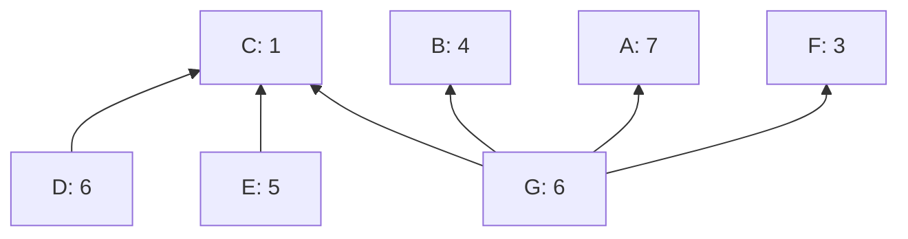

# Cluster mempool: block building with sub-chunk granularity

sipa | 2024-07-24 18:40:20 UTC | #1

#### Introduction

In cluster mempool, we maintain a (hopefully close to optimal) linearization and chunking for all clusters at all times. The obvious [strategy](https://delvingbitcoin.org/t/introduction-to-cluster-linearization/1032#h-24-block-building-and-eviction-7) for building block templates with those is to include the chunks from high feerate to low feerate, from all clusters, until one no longer fits.

To do so, we can precompute, along with the linearizations and chunkings themselves, a sorted set of all chunks, so that block template building can consider them easily in order of decreasing feerate.

If the linearizations are optimal, and the chunks thus represent the consecutive highest-feerate remaining topological subsets of each cluster, then this strategy has the property that it constructs a block whose total fee is close to optimal too: the loss is bounded by **the number of unfilled vsize times the feerate of the first chunk that does not fit**. The unfilled vsize itself is limited by the vsize of chunks, and thus this suggests a vsize limit on clusters in addition to a limit on their count, just to make sure the unfilled block size cannot grow too large. Can we do better?

Of course, once the next-best chunk no longer fits in a block, it's possible to instead just start skipping chunks that don't fit, and include ones that do fit (excluding ones that follow skipped chunks within the same cluster), similar to what the current ancestor-based mining algorithm does. Or it is possible to use a branch-and-bound search algorithm over these chunks to maximize fee by combining chunks.

All of this however is restricted to *chunks*. If all chunks happen to consist of multiple large transactions, we will want to include groups of transactions that are smaller than a chunk.

#### Breaking down chunks further

If for some reason a chunk is not included, but we still want to consider prefixes of that chunk, it is possible to reconsider the remainder of the chunk by removing the last transaction and re-inserting the highest-feerate prefix of what remains into our sorted set of "chunks" to consider, similar to how the current (Bitcoin Core 15.x-27.x) block building algorithm re-inserts the remainder of ancestor sets into a heap. It does come with the runtime overhead of maintaining that heap, however, and is nontrivial to generalize to a branch-and-bound search variant that does more than a single eager selection loop.

However, it is possible to precompute how chunks will break apart.

As an example, consider the following cluster (all transactions have the same size):

with (optimal) linearization (A,B,C,D,E,F,G), chunked as [A,BCDEFG].

If transaction G is removed, the BCDEFG chunk splits up into B, CDE, and F. Removing E from CDE leaves CD, and removing D leaves C.

Thus, the set of chunks and subchunks to consider becomes A, B, C, CD, CDE, F, BCDEFG, or sorted by decreasing feerate:
* A: 7/1=7
* BCDEFG: 25/6=4.166
* B: 4/1=4
* CDE: 12/3=4
* CD: 7/2=3.5
* F: 3/1=3
* C: 1/1=1

Note that there is exactly one such chunk/subchunk set per transaction: it is the chunk the transaction is in if the linearization were cut off after it. I will refer to these as the *absorption set* of each transaction. For the last transaction in a chunk, its absorption set equals the chunk itself. For other transactions, it will be a strictly lower-fee subset of its chunk.

Given a precomputed ordered set with all these absorption sets (across all clusters), a block building algorithm can consider these sets in order from high-to-low feerate, skipping ones that are inapplicable due to non-continuation. In the example above, if A were included, but BCDEFG then skipped (e.g. because it does not fit), then B could still be included, followed by CDE, CD, or C. F would only be applicable if CDE was chosen.

The advantage of this approach so far is just that no mutable data structure is needed to collect the broken-down chunks; instead, all possibly necessary breakdowns are computed ahead of time. The only required state at runtime is for each cluster, how long a prefix has been included already. The downside is that the sorted set will contain inapplicable sets which need to be skipped at block bulding time.

For example, when A and BCDEFG have been included already, all further absorption sets (B, CDE, F, CD, C) are uninteresting and need to be skipped. If A, B, CDE, and F are included, CD and C need to be skipped. This may or may not be a worthwhile trade-off, but will depend on the actual clusters involved.

#### Repurposing the Chunking algorithm

Recall the [chunking algorithm](https://delvingbitcoin.org/t/introduction-to-cluster-linearization/1032#h-22-feerate-diagrams-and-chunking-5):

* $\operatorname{Chunking}(C, L)$, for a cluster $C$ with linearization $L$:
  * Set $R = []$, a list of sets of transactions.
  * For $tx \in L$:
    * Append the singleton $\{tx\}$ to $R$.
    * While $R$ has two or more elements, and the feerate of the last one is higher than that of the penultimate one:
      * Replace the last two elements of $R$ with their union.
  * Return $R$.

The state of the $R$ list after every iteration of the for loop is exactly the chunking of the linearization when cut off after $tx$. In other words, the absorption sets are exactly the collection of sets that appear as the last element of $R$ throughout the algorithm. In other words, the collection of all mempool absorption sets can be computed in $\mathcal{O}(n)$ time like chunking itself. Inserting them into a sorted set would take $\mathcal{O}(n \log m)$ time, with $m$ the total number of mempool transactions.

#### Sub-chunk quality

With this approach, the ordering of transactions *within* a chunk becomes relevant. The [post-linearization algorithm](https://delvingbitcoin.org/t/introduction-to-cluster-linearization/1032#h-333-post-linearization-17) informally does improve things in this regard, which makes it more relevant if absorption-set based block building is in use.

That said, I am not sure whether a quality metric exists which is compatible with the existing feerate diagram metric (which only cares about super-chunk quality), distinguishes sub-chunk quality in a way that measurably contributes to block building quality, and retains the "optimal linearization exists for every cluster" property. Without such a metric it is hard to say what better sub-chunk quality really means, but the steps taken by post-linearization (swapping higher-feerate groups of transactions that follow lower-feerate groups) feels like an unambiguous improvement.

#### Branch-and-bound search

Instead of just picking all applicable absorption sets that fit and skipping other ones, it is also possible to backtrack when the block is (nearly) full to an earlier point, and change a chosen set into a non-chosen set. This yields a search algorithm that can try many combinations, and can be combined with branch-and-bound (whenever the feerate necessary to exceed the best seen fee so far with the remaining space available is less than the feerate of the next available absorption set, jump back to before the last non-chosen set).

If this approach is done with just chunks, the result will (eventually, with no guarantees on runtime) find the maximal possible fee in a block consisting of a combination of prefixes of chunks. If it is performed with all absorption sets, the result will be the maximal possible fee in a block consisting of a combination of prefixes of linearizations (not necessarily restricted to chunk boundaries). This is because every prefix of a linearization can be written as a single sequence of applicable absorption sets.

I believe it is when combined with such a search algorithm that the benefit of choosing precomputed absorption sets over the dynamic computation of applicable ones at runtime becomes really apparent. When backtracking, the state of the selection needs to be reset to the values it had at point jumped back to. In the case of precomputed absorption sets, that state is just the included prefix length for every cluster (e.g. as a dense hashmap), which is easy to reset. In the case of dynamically computed broken-up chunks, the obvious data structure to keep those broken-up chunks in is a [binary heap](https://en.wikipedia.org/wiki/Binary_heap), but that does not permit cheap restoring of an earlier state.

-------------------------

