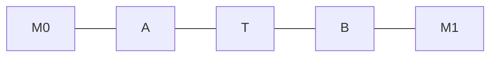
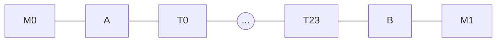
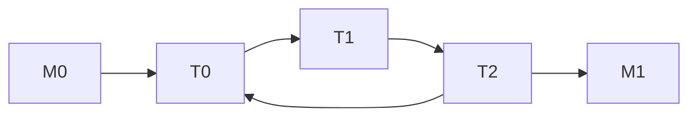

# Hybrid Jamming Mitigation: Results and Updates

carla | 2024-09-17 14:21:56 UTC | #1

Writing with an update on the work that Clara and I have been doing to investigate the effectiveness of our hybrid mitigation for channel jamming attacks against lightning. This post assumes familiarity with the proposal, so please check out the high level write up [here](https://gist.github.com/carlaKC/02251cd061260bbb149f361c65fc9f2f) if you need to catch up. 

tl;dr:

* The mitigation performs as expected against slow and fast jamming attacks, appropriately compensating nodes that are attacked.  
* It is resilient against most reputation-spoiling attacks, but needs to be updated to protect against a downstream attacker that opportunistically holds HTLCs to ruin reputation along the route.

<details>  
 <summary>PSA: Sections with in-depth details are in collapsable summaries.</summary>  
🫶 Please click on them for more detail 🫶
</details>

## Introduction

Our reputation algorithm is designed to ensure that the cost of acquiring reputation is comparable to the damage that can be done by abusing that reputation. If there is no revenue loss under attack, we can ensure that nodes are not economically damaged by attacks \[0\].

**Note that we do not guarantee that jamming attacks cannot occur, only that nodes targeted will be compensated by at least the amount that they would have earned with regular operation.**

While we can’t possibly enumerate every possible attack, one of the best ways to understand how this mitigation performs is to try to break it and see what happens. So we got a group of lightning developers together earlier in the year for an “[attackathon](https://github.com/carlaKC/attackathon)” where they experimented with various approaches to breaking our mitigation. 

This post reports on the performance of our mitigation under the various attacks, and outlines improvements made to the proposal based on insights gained from the attackathon.

## Attacks

As is the case with any jamming mitigation, there is a risk that the mitigation itself is abused to restrict the resources of the network. In our case, this would be achieved by targeting a node’s reputation to restrict its ability to operate. We therefore need to think about two different approaches to jamming attacks in the context of this solution:

**Resource jamming**: aims to consume all channel resources, as we think of jamming attacks today. Successfully executed when:

* All general resources have been exhausted by the attacker.  
* All protected resources have been exhausted by the attacker

**Reputation jamming**: aims to render protected resources unusable by sabotaging the reputation of a node’s peers, effectively jamming the channel because the mitigation does not assign these resources to honest peers. (h/t: Thomas for first flagging this one\!) Successfully executed when:

* All general resources have been exhausted by the attacker on the targeted channel.  
* All of the target node’s peers have low reputation with it. 

### Resource attacks

Two teams at the attackathon wrote resource jamming attacks, where they aimed to build up reputation with a target node then leverage it to occupy all of its protected resources. We’ve since built out these attacks and run them against a 50 node test [warnet](https://github.com/bitcoin-dev-project/warnet) to get an understanding of their impact.

<details>
 <summary>Full details about our test network are available here.</summary>
We used real lightning nodes in our resource jamming experiment so that we could capture all the nuance of pathfinding, dust limits and force closures that you need to be conscious of when thinking about channel jamming. We also wanted to create an approachable network that anyone could try to break, rather than a specialist simulator that would likely lack the APIs required to explore different attack approaches. 

To create a large network, we used [warnet](https://github.com/bitcoin-dev-project/warnet) to create a test network of [LND](https://github.com/carlaKC/lnd/tree/attackathon) nodes running our [reputation mitigation](https://github.com/carlaKC/lrc) \[1\]. We reduced the mainnet graph to 50 nodes using a random sample of the neighborhood around the Acinq node, which was our target node for attacks (sorry Acinq\!). Using warcli’s [import\_json](https://github.com/bitcoin-dev-project/warnet/blob/7f0a082da2a9b0405743c62da3dadfc7b8752f1b/src/cli/graph.py#L43) command, we could then spin up a lightning network with the channels and policies of the reduced mainnet graph. None of this would have happened without Zip and the warnet team, I am many beers indebted\!

Running with realistic payment history and traffic was important to testing our mitigation in a dynamic environment. We used [sim-ln](https://github.com/bitcoin-dev-project/sim-ln), which can run against real lightning nodes or as a sped up payment simulator to create activity for a given graph, in several places:

* **Reputation bootstrap**: running in simulation mode for the chosen graph, we generated payment histories for honest nodes which were imported to our reputation system to provide historical data without having to execute months of payments on the actual nodes.  
* **Honest payments**: running connected to every honest node in the network, we generated honest payment activity in the network during the attack.    
* **Projected revenue**: running in simulation mode with the same fixed seed as the honest payments, we generated a projection of the payments that nodes in the network would have processed in the absence of a jamming attack. We generated these projections 50 times for the network, and used the mean to represent the network in peace times.

This payment traffic is, of course, an imperfect representation of mainnet traffic. It does however provide a baseline for comparison across attacks and peacetime for the simulations.

Some of the time-based parameters in our proposal were reduced to shorten our runtime:

* Revenue window \= 1 hour  
* Reputation window \= 24 hours  
* HTLC opportunity cost \= 12 blocks  
* Block time \= 5 minutes
</details>

#### Slow Slot Jamming

We ran a slow slot jamming attack against a single channel on our targeted node, aiming to consume \> 480 slots on the target channel for a period of 10 minutes.

<details>
 <summary>An in depth description of the attack strategy is available here.</summary>
The approach taken to orchestrate a slow jamming attack against the target channel A-B by malicious nodes M0/1/2 works as follows:

1. M0 “pre-pays” good reputation with A on M0-A by sending fast-resolving, successful payments over M0-A-M1.  
- These payments do not need to be endorsed, because fast-resolving successful unendorsed payments will bootstrap their reputation.  
- Note that we don’t want to build a reputation on a path that utilizes A-B, because this would inflate the value of AB for M0 to later attack.  
- M0 will occasionally send an endorsed payment probe over M0-A-B-M2 to determine whether they’ve built sufficient reputation to use A-B’s protected resources.  
2. Once M0 has built up sufficient reputation, M1 sends a set unendorsed payments over M1-A-B-M2 to occupy all of the general resources on A-B and holds them for the duration of the attack.   
3. Finally, M0 will send a series of endorsed payments over M0-A-B-M2 to occupy all of the protected resources on A-B and hold them for the duration of the attack.  
- This can be fine-tuned to distinguish between reputation-based and liquidity based failures by iteratively probing and “pre-paying” for more reputation (as described in (1) to ensure that M0 does not overpay for access to the protected slots.  
- It’s likely that A doesn’t have sufficient reputation with B to occupy all of its protected resources on its channels with M2, so two channels are opened so that all jamming payments can be accommodated in the general buckets of the channels between B and M2.

****

</details>

In our experiment, the mitigation strategy worked as expected \- the targeted node did not lose revenue when targeted, and the majority of attacker costs were for reputation building. 

**Attacker paid**: ​​1,370,485 msat in off-chain fees:

* Success case (94% of total): 1,286,744 msat  
* Unconditional (6% of total): 83,740 msat

**Target earned**: 1,875,080 msat in off-chain fees:

* Success case (97% of total): 1,815,280 msat  
* Unconditional (3% of total): 59,799 msat

The target was paid 1,446,343 msat in off-chain fees by the attacker, so their revenue breakdown is:

* 93% of revenue paid by attacker traffic  
* 7% of revenue was paid by honest traffic

To compare revenue under attack to the target node’s expected revenue in times of peace, we ran our payment simulator 50 times to get an average expected revenue of **15,030 msat over 10 minutes** and **1,205,876 msat over a 2 week period**.

Since the HTLCs for the slow jamming attack can be held for up to two weeks, we compare our attacker costs to projected revenue over a two week period. T**here is a 19.94% increase in revenue for the targeted node under attack**. This is not surprising, because our per–htlc “opportunity cost” charges quite a steep fee for each slot in our protected bucket of resources \[2\]. 

<details>
 <summary>Raw data for the experiments is available here.</summary>

| ID | Success case fees paid by attacker | Unconditional fees paid by attacker | Success case fees earned by target (all senders) | Unconditional fees earned by sender (all senders) | Fees paid from attacker to target | Time Slot Jammed (\>440) |
| ----- | ----- | ----- | ----- | ----- | ----- | ----- |
| 0 | 1,286,350.00 | 82,463.50 | 1,291,127.00 | 53,511.27 | 1,339,813.50 | 10.09 |
| 1 | 1,296,305.00 | 88,347.05 | 1,308,725.00 | 57,131.25 | 1,353,242.05 | 10.18 |
| 2 | 1,292,105.00 | 88,305.05 | 2,144,659.00 | 65,470.97 | 1,349,000.05 | 10.38 |
| 3 | 1,296,305.00 | 88,347.05 | 1,308,658.00 | 57,080.58 | 1,353,242.05 | 10.45 |
| 4 | 1,274,705.00 | 88,107.05 | 1,290,544.00 | 56,895.44 | 1,331,412.05 | 10.38 |
| 5 | 1,292,105.00 | 88,305.05 | 1,301,111.00 | 57,015.11 | 1,349,000.05 | 10.12 |
| 6 | 1,293,505.00 | 76,751.05 | 1,307,637.00 | 50,363.27 | 1,343,666.05 | 10.03 |
| 7 | 1,272,837.00 | 76,520.37 | 1,283,632.00 | 50,108.96 | 1,322,777.37 | 10.13 |
| 8 | 1,272,837.00 | 76,520.37 | 1,283,365.00 | 50,055.65 | 1,322,777.37 | 10.06 |
| 9 | 1,290,394.00 | 82,503.94 | 1,296,973.00 | 53,619.73 | 1,343,897.94 | 11.02 |
| MEAN | 1,286,744.80 | 83,740.73 | 1,391,050.89 | 55,292.50 | 1,340,547.84 | 10.20 |
| STDDEV | 10,102.26 | 5,678.04 | 282,789.65 | 4,968.40 | 12,198.72 | 0.1582123597 |
| MEAN/STDDEV | 127.37 | 14.75 | 4.92 | 11.13 | 109.89 | 64.47496481 |

</details>

#### Fast Slot Jamming

This attack is a variation on the slow jamming attack described above, where the targeted node’s protected resources are occupied by a continuous stream of fast-failing payments. This was particularly interesting to us, because it manages to exhaust protected resources without the attacker losing their reputation. In this attack, the targeted node is protected only by unconditional fees, and the eventual decay of the reputation that the attacker built up to gain access to the protected bucket in the first place.

When unconditional fees will be a major cost to the attacker, it’s worth examining whether slot or liquidity jamming will be more economical to fully occupy the channel’s resources. The costs that we need to consider are:

* **Reputation cost**: the amount paid to gain access to protected resources, generally expected to be higher for liquidity jamming because this cost depends on the fee for the HTLC.  
* **Unconditional fee cost**: the unconditional fee paid to continuously occupy protected resources with many slot jamming payments or fewer larger liquidity jams; dependent on the fee policy of the targeted channel.

We ran [this comparison](https://gist.github.com/carlaKC/9763ef8df9790713f542dc553aff8a03) against a snapshot of the mainnet graph and found that it’s more economical to fast slot jam 59% of the channel policies on the network.

As was the case with our slow jamming attack, the mitigation performs as expected and the targeted node is compensated for the revenue that it would lose in the window that it is jammed. But unlike a slow jamming attack, the attacker does not lose their “prepaid” reputation so they will be able to continue the fast jamming attack until their reputation decays. 

To keep the channel jammed, the attacker will need to continuously dispatch fast-failing payments to occupy the protected resource on a channel. For an attack time t (expressed in seconds) the total unconditional fees that they will have to pay for a fast-slot attack is: `t / 90 * 242 * base_fee * 0.01`. 

This produces 32,524,833 msat in unconditional fees for our targeted channel to continue the attack for 2 weeks (given a base fee of 1000 msat). This represents a 25% increase in revenue when targeted by a fast slot jamming attack. We also sanity checked this result against a liquidity jamming attack, which requires fewer HTLCs with higher reputation “costs”, and saw similar revenue numbers.

<details>
 <summary>Raw data for the experiments is available here.</summary>

| ID | Success case fees paid by attacker | Unconditional fees paid by attacker | Success case fees earned by target (all senders) | Unconditional fees earned by sender (all senders) | Fees paid from attacker to target | Time Under Attack (\>440) |
| ----- | ----- | ----- | ----- | ----- | ----- | ----- |
| 0 | 1,288,839.00 | 157,248.39 | 1,300,920.00 | 97,249.20 | 1,385,937.39 | 7.96 |
| 1 | 1,263,505.00 | 156,923.05 | 1,282,525.00 | 97,043.49 | 1,360,308.05 | 7.03 |
| 2 | 1,288,839.00 | 152,016.39 | 1,295,841.00 | 94,136.41 | 1,382,885.39 | 6.00 |
| 4 | 1,221,960.00 | 141,243.60 | 1,245,060.00 | 87,764.60 | 1,309,443.60 | 8.74 |
| 5 | 1,293,505.00 | 172,247.05 | 1,302,040.00 | 106,002.41 | 1,399,372.05 | 7.86 |
| 7 | 1,293,505.00 | 124,055.05 | 1,304,477.00 | 77,934.87 | 1,371,260.05 | 9.97  |
| 9 | 1,293,505.00 | 125,351.05 | 1,297,040.00 | 78,586.47 | 1,372,016.05 | 10.44 |
| 10 | 1,274,392.00 | 136,631.92 | 1,278,920.00 | 85,067.23 | 1,359,403.92 | 10.42 |
| 11 | 1,204,851.00 | 183,504.51 | 1,215,927.00 | 112,195.27 | 1,316,915.51 | 6.01 |
| 12 | 1,292,060.00 | 182,582.60 | 1,300,087.00 | 112,032.87 | 1,403,962.60 | 9.35 |
| MEAN | 1,271,496.10 | 153,180.36 | 1,282,283.70 | 94,801.28 | 1,366,150.46 | 8.38 |
| STDDEV | 32,395.54 | 21,650.22 | 29,342.54 | 12,596.60 | 31,596.28 | 1.68 |
| MEAN/STDDEV | 39.25 | 7.08 | 43.70 | 7.53 | 43.24 | 4.97 |

</details>

h/t: Jules/Sachin/Kevin for this one!

### Reputation attacks

We also saw a variety of approaches to trying to abuse the reputation system. Two themes emerged across the various attacks: 

* **Optimization**: attacks that attempt to decrease the cost of acquiring good reputation with a target node.  
* **Manipulation**: strategies for using the reputation system itself to cut off honest nodes from access to protected resources.

#### Optimization \- Laddering Attack

A laddering attack exploits a chain of nodes with increasing reputation to gain endorsement with a higher-value node downstream. Since reputation is related to fee revenue, an attacker can identify a chain of gradually increasing channel sizes (assuming that size is a proxy for activity) and build reputation with the cheapest rung of the ladder.


<details>
 <summary>A detailed walkthrough of this concept is available here.
</summary>

Starting with an honest network of A, B, C, D, we’ll assume that we have the following “laddered” (increasing) traffic pattern:

* Payments sent over A \-\> B represent 100% of A’s outgoing traffic.  
* Payments sent over A \-\> B represent 10% of B’s forwards on BC  
* Payments sent over B \-\> C represent 25% of C’s forwards on CD  
* Payments sent over C \-\> D represent 50% of D’s forwards onwards.

To keep things simple for the sake of an example, we’ll walk through revenue flows between the nodes without thinking about fee calculations \- so when you see 120k of reputation/revenue, think “120k of traffic’s fees of reputation/revenue”. We’ll also assume that traffic is constant over time, so that we can easily move between 2 week and 6 month horizons.

Over a period of 6 months, A forwards 120k of payments to B that will use the BC outgoing link:

****

This means that A will have accrued 120k of reputation with B over a period of 6 months. We can then calculate the reputation threshold for B’s outgoing link as follows:

* A is 10% of B’s traffic, so the total traffic over 6 months is 120k \* 10 \= 1.2m  
* The revenue threshold for the outgoing link BC is 1.2m/12 \= 100k because we consider our outgoing revenue over a 2 week period.

****

This means that B will have accrued 1.2m of reputation with C over a period of 6 months. Likewise we’ll calculate the reputation threshold of C’s outgoing link as follows:

* B is 25% of C’s traffic, so the total revenue over 6 months is 1.2m \* 4 \= 4.8m  
* The revenue threshold for the outgoing link CD is 4.8m/12 \= 400k because we consider our outgoing revenue over a 2 week period.

****

An attacker looking to perform a laddering attack would aim to build good reputation with A, so that they can get HTLCs endorsed on the more valuable downstream C \-\> D link. An attacker would need to pay 10k to obtain good reputation with A (120k/ 12 \= 10k), and additionally pay for the opportunity cost of any HTLC that they’d like A to endorse.

To get an idea of the damage that an attacker can do with this laddering attack, we look at the difference in A’s current reputation and B’s revenue threshold: 100k \- 120k \= 20k. This represents the total “budget” that is available for in-flight HTLCs before A’s reputation drops below B’s revenue threshold.

Using our HTLC opportunity cost function, we can calculate the largest HTLC that A can get endorsed based on this budget: `budget = htlc_amt * blocks_till_expiry * 10 * 60 / 90`. Assuming that a HTLC forwarded on A will expire after 160 blocks, the largest HTLC that an attacker can get endorsed by A (and thus downstream on CD)  in 17 msat, which is insufficient to jam the protected resources along the route.

This example deals with toy numbers, but it should give you a general idea of how this type of attack would work. We’ve created a spreadsheet [here](https://docs.google.com/spreadsheets/d/1AmuRE7-XAZzfy-Ku6MyK1AVfE-aj5j66fb6c5_Zbr7c/edit?usp=sharing) which allows you to plug in different values to get a grasp on how these numbers work out (make a copy to change the values\!).

</details>

We wrote a [basic fuzzing test](https://github.com/carlaKC/reputation-fuzz/blob/fda5a8823a26fd6b6dc243f3035288523a5e50b6/fuzz_test.go#L13) for this attack with the following conditions:

* Create a ladder of nodes with 1-8 hops between the attacker and the laddering target  
* Traffic must increase with each hop in the ladder  
* The target node must have sufficient reputation to get a $1 HTLC endorsed with its peer \[3\].  
* The attack is successful both of the following hold:  
  * Acquiring reputation via the ladder is less expensive than doing so directly with the target node.  
  * Using the ladder to slow jam the target node results in it losing reputation with its downstream peer.

We ran the fuzzer for \~24H (\~ 23 billion execs) and did not produce any effective ladder attacks. While this of course doesn’t mean that there are no cases where this attack could work, our manual efforts and the fuzzer couldn’t find one\!

#### Manipulation - Surge Attack

In this attack, the attacker inflates the value of the outgoing channel instead of trying to build a direct reputation with the node. By sending many successful payments over the channel, the attacker can drive up the threshold for good reputation, and potentially price out the node’s peers so that they lose access to its protected resources. A key insight here is that the attacker does not need to pay up to the reputation threshold of the channel, just the difference between its peers' incoming reputation and the outgoing channel’s revenue.

We also [fuzzed this attack](https://github.com/carlaKC/reputation-fuzz/blob/fda5a8823a26fd6b6dc243f3035288523a5e50b6/fuzz_test.go#L116) for ~24H (~22 billion execs) with the following conditions, and did not find any attacks where the targeted node loses revenue to the attack:

* Create a set of 2-255 peers for the targeted node.
* Generate 6 month revenue values for each peer, restricted to < 1 BTC.
* Choose a cutoff point for the attack:
  * Sort peers by ascending fee revenue order.
  * Choose an index that represents the highest value peer that will be cut off.
  * The cutoff peer must have sufficient reputation to get a $1 HTLC endorsed.
* The attack is successful if the sum of the total paid by the attacker to inflate the link and its remaining revenue (not targeted in the surge attack) is less than its revenue when not under attack.

#### Manipulation \- Sink Attack

A sink attack aims to decrease the reputation of a targeted node’s peers by creating shorter/cheaper paths in the network, and sabotaging payments forwarded through its channels to decrease the reputation of all the nodes preceding it in the route. 

We ran this attack against our test network of 50 nodes with the following strategy (massive  thanks to Moorehouse for the code\!):

* Attacking node opens zero-fee channels with the 10 largest nodes that are not directly connected to the target node, and a single channel with the target.   
* Endorsed HTLCs are held by the attacking node for 5 hours, then released to reach their eventual destination.  
* General jam the target node’s channels once its peers have lost their reputation.

This attack successfully reduced the target node’s revenue to 15% of its peacetime revenue, with the only cost to the attacker being 11x channel opens and some minor unconditional fees for the payments used to jam the target’s general slots. **This is possible because our mitigation only accounts for the risk of a jamming attack by our *incoming* link, but does not account for the damage that our *outgoing* link can do by holding HTLCs.** 

It’s tempting to think about [attributable errors](https://github.com/lightning/bolts/pull/1044) and latency aware routing to fight against an attack that depends on attracting traffic along a route to be successful, because nodes would route around the attacker after one delayed payment \[4\]. However this attack will still be successful if the attacker can lure in [sufficient distinct senders](https://github.com/lightning/bolts/pull/1071#pullrequestreview-2219558063) to ruin the target node’s reputation. We could also consider pathfinding that avoids newer links, but we think that’s an unacceptable centralization tradeoff (and a patient attacker can just prepare in advance). 

So we’re proceeding with the assumption that an attacker will be able to draw in a reasonable amount of traffic with a well placed, cheap set of channels \- **please let us know if you think we’re wrong about this \[5\]\!** We’re also primarily concerned with slow jamming in this case, because it’s unlikely that an attacker will be able to draw in the volume of payments required to fast-jam a channel entirely.

### Bidirectional Reputation

To update our solution to account for the risk that our outgoing link will jam us, we consider reputation bidirectionally [7]. This means that when a payment is forwarded over A - B - C, the forwarding node will consider both A’s [reputation as an incoming node](https://github.com/lightning/bolts/pull/1071/files#diff-cacdd96a68db515fcae910df93d77abd001eb3e6641d06fb490c46218e3dc6b2R119) and C’s reputation as an outgoing node when it makes forwarding decisions.

A’s incoming reputation is calculated as outlined in our original proposal, and we additionally consider the following values for C’s reputation as an outgoing node:

* `outgoing_channel_reputation`: the total fees that C has earned as an outgoing link over 6 months (the [reputation_window](https://github.com/lightning/bolts/pull/1071/files#diff-cacdd96a68db515fcae910df93d77abd001eb3e6641d06fb490c46218e3dc6b2R218-R219) in our proposal).
* `in_flight_risk`: the [outstanding risk](https://github.com/lightning/bolts/pull/1071/files#diff-cacdd96a68db515fcae910df93d77abd001eb3e6641d06fb490c46218e3dc6b2R240-R241) of all outgoing HTLCs currently held by C.
* `incoming_channel_revenue`: the bidirectional revenue that A has earned us over 2 weeks (the [revenue_window](https://github.com/lightning/bolts/pull/1071/files#diff-cacdd96a68db515fcae910df93d77abd001eb3e6641d06fb490c46218e3dc6b2R187) in our proposal).

Similar to the incoming direction, C will be considered to have good reputation in the outgoing direction if: `outgoing_channel_reputation - in_flight_risk >= incoming_channel_revenue`

Here we compare the value that C has offered us as an outgoing link to the value that we may lose if C uses this HTLC in an attempt to jam A. By enforcing this inequality in both directions, we ensure that we have been compensated for any damage an attacker in either direction may inflict.

#### Forwarding Decisions

In the original proposal, we consider risk to both our resources and reputation when we receive a HTLC from an incoming peer and make our forwarding decision. When a HTLC is not endorsed by a high reputation peer:

* **Resources**: we limit resource usage to the general bucket of the outgoing channel, so that it cannot be saturated.  
* **Reputation**: we drop the endorsement signal to protect our reputation with the downstream peer.

Likewise, we should consider the risk to our resources and reputation when we forward HTLCs on to an outgoing peer:

* **Resources**: we have a HTLC locked in on the incoming link, possibly using protected resources, which the outgoing peer may use for slow-jamming.  
* **Reputation**: if the HTLC was endorsed by our incoming peer, the outgoing peer may use it to trash our peer’s reputation by delaying resolution.

When considering the risk that an outgoing peer poses to us, we don’t have the option to drop the endorsement signal and minimize resource utilization to protect ourselves against attack; we’ve already committed to an incoming HTLCs. To fully protect against malicious outgoing peers, **forwarding nodes will need to drop endorsed HTLCs if the outgoing peer has low reputation.**

Rather than endorse all HTLCs, we suggest that HTLCs are unendorsed by default and only endorsed if the sending node experiences payment failures \[7\]. We tested endorse-on-failure payments against a test network of 50 nodes and saw no significant decrease in forwarding node revenue, and observed that less than 0.5% of payments were dropped due to this new mechanism.

The importance of dropping endorsed payments becomes apparent when we look at how this mitigation defends against a sink attack. The figure below shows the forwarding decisions made by the target node for HTLCs sent to the attacker when we ran the sink attack on our test network with bidirectional reputation implemented.

<p align="center">
  
</p>

When the attacker starts to hold HTLCs, its outgoing reputation will drop because in-flight HTLCs reduce reputation. The target node then starts to drop endorsed payments to the attacker, because the attacker no longer has a good reputation. It will still forward unendorsed payments to the attacker, as they represent no risk to its reputation or resources. In our experiment, the target node did not suffer revenue loss - the revenue from the attacker-created cheap paths offsets any loss from the jamming attack, and the attacker is cut off from any endorsed HTLCs thereafter.

Please note that we ran out of time to more rigorously test this out before the summit, so take this all with the “we ran it twice” grain of salt it deserves!

#### Change Summary

The introduction of bidirectional reputation adds a new component to our original proposal. It’s not much more code, and a POC implementation is available [here](https://github.com/carlaKC/lrc/tree/bidirectional-reputation). The decision tree for the reputation system is outlined below:

```
if incoming htlc endorsed:
	if good incoming reputation and good outgoing reputation:
		forward endorsed
	elif bad outgoing reputation:
		drop payment
	else:
		forward unendorsed (as below)
else:
	if general resources available:
		forward unendorsed
	else:
		drop payment, no resources
```

### Up Next

Our next steps will be to run a more complete set of experiments to test bidirectional reputation as a mitigation against sink attacks, and to re-run our jamming experiments above to ensure that there are no regressions [8]. We’re interested in hearing thoughts on this approach from other protocol developers [9], so please let us know what you think!

This is a difficult problem to solve, and it will require hard tradeoffs, but we’re happy with the mitigation’s performance against resource jamming attacks and optimistic about bidirectional reputation’s ability to mitigate downstream sink attacks.

We’d also like to express our heartfelt gratitude to all that made the trip to attend the attackathon. This work immensely benefited from a wider range of perspectives looking at this problem, and is far better for it!

<details>
 <summary>Footnotes</summary>

\[0\] We only consider economic value that is observable within the protocol (forwarding fees) when we consider the impact of an attack. Users that value their ability to forward payments beyond fees, such as the value of doing business as a lightning service, should be able to specify this exogenous value as an input to the reputation algorithm.   
\[1\] Reputation was implemented via [circuitbreaker](https://github.com/carlaKC/circuitbreaker/tree/attackathon), which allowed us to quickly implement and iterate on a library with the full reputation algorithm rather than making it LND-specific. Unconditional fees were not implemented in LND, but they are accounted for in our analysis scripts.   
\[2\] This is something we’d potentially look into decreasing (relating this cost to the actual traffic on the channel) if we get some real world numbers indicating that this amount is too steep for honest actors. In that case, we’d expect to come closer to breaking even.  
\[3\] If we remove the requirement that the targeted node can get at least a $1 HTLC endorsed, then we see some cases where an attacker can save around 5% of their costs by performing a laddering attack against a target node that’s barely crossed the reputation threshold.  
\[4\] [Attributable errors](https://github.com/lightning/bolts/pull/1044) allow sending nodes to attribute time delays to nodes along the route, which opens the door to latency-sensitive routing algorithms that could route around these malicious sinks.  
\[5\] It’s again tempting to think about [monetary solutions](https://lists.linuxfoundation.org/pipermail/lightning-dev/2021-February/002958.html) here, but these will become prohibitively expensive for honest users to account for the worst-case hold time.  
\[6\] While we assume the attacker can attract some traffic, we do not expect the consistent thundering herd of payments required for a fast jamming attack.   
\[7\]  Previously our algorithm only accounted for the risk that an attacker A is targeting outgoing channel BC. By examining reputation in both directions, we can also account for the risk that an attacker B is targeting incoming channel AB.  
\[7\] It’s likely that nodes would not endorse by default anyway, because the upside of successful endorsed/unendorsed payments is the same and endorsed payments pose a risk to their reputation. By only endorsing on failure, sending nodes only take advantage of protected resources when they need to.  
\[8\] We don’t expect any, if anything it’ll make these attacks harder as well, but will repeat for completeness. We wanted to get this post out before the summit, and ran out of time to repeat them\!  
\[9\] As is the case with all bitcoin problems, this has already been discussed on the [mailing list](https://lists.linuxfoundation.org/pipermail/lightning-dev/2018-May/001232.html) before our time, so we’re particularly interested in hearing about any conversations that happened off-mailing-list back then\!

</details>

-------------------------

ProofOfKeags | 2024-09-17 17:37:58 UTC | #2

One of the things I find odd about the approach to reputation described in the [original doc](https://gist.github.com/carlaKC/02251cd061260bbb149f361c65fc9f2f) is that it is the downstream that is fundamentally responsible for preimage release, and, by extension, the delayed resolution. This occurred to me after reading your description of the Sink Attack.

Consider the sub-route `... <-> B <-> C <-> D <-> ...`found on some route with unknown extensions on both sides. C is trying to make a forwarding decision based on B's endorsement of the HTLC. Let's assume for the sake of simplicity that B believes it has a heuristic that genuinely warrants an endorsement. C is faced with the decision of forwarding given the raw set of data that is on some level comprised of the following raw information:
1. B is the upstream
2. D is the downstream
3. The HTLC size
4. the full lifecycle history of every htlc originating from B
5. the full lifecycle history of every htlc traveling to D
6. the endorsement signal from B

Note that despite the fact that B has made the endorsement, B -- in general -- lacks any ability to *control* the prompt resolution of the HTLC. Any control it has is coincidental such as the case of a circular route. The downstream nodes each have the opportunity to delay resolution. Further, if B is a forwarding hop it is unaware of D's identity entirely and thus cannot use the identity of D in its own judgement as to whether or not to make the endorsement in the first place.

It occurs to me that the primary risk that C is trying to avoid is that D or any node downstream of D holds the HTLC for a long period of time. I am not sure how B is supposed to make even a slightly educated guess about this which impacts its ability to accurately endorse an HTLC. The only thing I can see here is that if we exclude route blinding, then the source knows the whole route and can therefore endorse it based off of all of its payment lifecycle data and that endorsement of the HTLC by the upstream implies that it should be endorsed downstream unless there is a sufficiently good reason not to. In this case if C knows something that B didn't about the route it may choose to drop the endorsement.

Still, while I think reputation is a fine way to try and deal with jamming mitigations, I'm now skeptical that endorsement can be successfully correlated with any sort of probability of prompt resolution. B would have to be able to build up an accurate model for when it believes an HTLC will resolve quickly, and this mirrors the exact problem C is trying to solve. B and C are effectively equally underequipped to solve this.

I have always imagined endorsement as a statement that approximates the following: "I am personally staking my own reputation on the outcome of this risk I am asking you to take". In order for this to make sense, the endorser must know something that the forwarder does not. However, in *most* cases, the endorser knows *less*.

Please tell me I'm wrong. I would love to be.

-------------------------

carla | 2024-09-18 15:39:02 UTC | #3

Adding in A to the above example: `.. --> A --> B --> C -- D --> ...`

It's certainly correct that `C` will always have more
information than `B` about `D`; as our history with our peers gives us
information to base our forwarding decisions on. Likewise, `B` will 
always have more information than `C` about its incoming edge `A`.

I see this as happening in two parts, with each node responsible for the
direction that they are most informed about:
1. `B` decides to forward the HTLC as endorsed to `C` because they have
   local information about `A`, and have decided that it has sufficient
   incoming reputation to take the risk.
2. `C` decides to forward the HTLC to `D` only if they have sufficient
   outgoing reputation for an endorsed payment (dropping it otherwise).

This happens transitively down the route: 
- Incoming nodes only endorse, tracing all the way back to the sender
  if outgoing reputation holds.
- Forwarding nodes only proceed with outgoing endorsed HTLCs, all the 
  way to the eventual recipient, if outgoing reputation holds.

Of course, none of this applied to unendorsed HTLCs where there's no risk of channels being fully jammed!

> I am not sure how B is supposed to make even a slightly educated 
  guess about this which impacts its ability to accurately endorse an 
  HTLC.

You're absolutely correct that B can only provide input about the 
incoming direction. This is still very valuable information, as it 
provides C with information about the direction that they otherwise are
totally in the dark about. 

Without this signal, any node can show up and saturate a channel with 
failing payments. This is more efficient with the collaboration of a
downstream peer, but also possible without it by just spraying payments
to any node in the network. 

The key insight from running through this attack is that we need to
account for *both* directions to close any gaps that an attacker may
abuse. Endorsement + reputation does this for the incoming direction,
and forwarding nodes are individually responsible for doing so in the
outgoing direction based on reputation.

> I am personally staking my own reputation on the outcome of this 
  risk I am asking you to take.

I agree with this, perhaps only adding:

I am staking my own reputation on the outcome of this risk I am asking
you to take, informed by your locally available information.

-------------------------

morehouse | 2024-09-26 22:09:59 UTC | #4

[quote="carla, post:1, topic:1147"]
#### Manipulation - Surge Attack

We also [fuzzed this attack](https://github.com/carlaKC/reputation-fuzz/blob/fda5a8823a26fd6b6dc243f3035288523a5e50b6/fuzz_test.go#L116) for ~24H (~22 billion execs) with the following conditions, and did not find any attacks where the targeted node loses revenue to the attack:
[/quote]

I made an [optimization](https://github.com/carlaKC/reputation-fuzz/pull/1) to the fuzz test and was able to find many surge attacks.  For example, here's one where the victim loses 50% of their revenue:

```shell
$ go test -run=FuzzSurgeAttack/e8e56d18133e
27e4                                                                        
--- FAIL: FuzzSurgeAttack (0.00s)                                           
    --- FAIL: FuzzSurgeAttack/e8e56d18133e27e4 (0.00s)                      
        fuzz_test.go:171: Successful attack: Peer count: 18, cutoff: 17:    
              - 808464432 reputation (6m) contributes 67372036 revenue (2w) 
              - 808464432 reputation (6m) contributes 67372036 revenue (2w) 
              - 808464432 reputation (6m) contributes 67372036 revenue (2w) 
              - 808464432 reputation (6m) contributes 67372036 revenue (2w) 
              - 808464432 reputation (6m) contributes 67372036 revenue (2w) 
              - 808464432 reputation (6m) contributes 67372036 revenue (2w) 
              - 808464432 reputation (6m) contributes 67372036 revenue (2w) 
              - 808464432 reputation (6m) contributes 67372036 revenue (2w) 
              - 48053104688 reputation (6m) contributes 4004425390 revenue (2w)                                                                         
              - 52348071984 reputation (6m) contributes 4362339332 revenue (2w)                                                                         
              - 52348071984 reputation (6m) contributes 4362339332 revenue (2w)                                                                         
              - 69527941168 reputation (6m) contributes 5793995097 revenue (2w)                                                                         
              - 69527941168 reputation (6m) contributes 5793995097 revenue (2w)                                                                         
              - 69527941168 reputation (6m) contributes 5793995097 revenue (2w)                                                                         
              - 69527941168 reputation (6m) contributes 5793995097 revenue (2w)                                                                         
              - 86707810352 reputation (6m) contributes 7225650862 revenue (2w)                                                                         
              - 86707810352 reputation (6m) contributes 7225650862 revenue (2w)                                                                         
              - 86707810352 reputation (6m) contributes 7225650862 revenue (2w)                                                                         
             with outcome: Node lost: 50 % of revenue  - attacker paid: 28586797036 to meet threshold: 58121013316, node still earned: 28586797036 (0 honest + 28586797036 attacker), <nil>                                                                                     
```

I think this highlights a case where the current reputation algorithm performs poorly in general: fan-in topologies (and also fan-out if we're using bidirectional reputation).  

With the recommended parameters, incoming reputation is calculated over a 24-week period while outgoing revenue is calculated over a 2-week period.  So, each incoming node will generally have a reputation score 12x higher than their contribution to the outgoing revenue.  It follows that if there's more than 12 incoming nodes contributing equally to outgoing revenue, none of them can *ever* build enough reputation to access endorsed slots.

A surge attack is essentially just putting a finger on the scale to tip it towards this crossover point where no incoming nodes can build enough reputation.  The closer the topology and traffic flows are to the crossover point already, the less the cost of a surge attack.

## Mitigation Thoughts

### Custodial Lightning

For custodial wallets, fan-in and fan-out topologies are likely rare and the current reputation algorithm might be "good enough".

### LSP-Specific Reputation Algorithms

LSPs generally have very high fan-in/out -- many small user channels fan-in to the LSP, while just a few large channels route out from the LSP.  It seems reasonable that LSPs would use their own reputation algorithms to handle their specific topology (AFAIU eclair/phoenix are already working on their own algorithm).  But how exactly those algorithms should work is an open question.

Trampoline routing may also help.  LSPs may be able to endorse trampoline payments regardless of the previous node's reputation, since they get to choose the remainder of the path.  But if the destination of such payments is also an LSP user, the opposite problem (fan-out) will exist at the destination, and endorsed payments are likely to be failed back under the new bidirectional algorithm.

-------------------------

morehouse | 2024-09-26 23:03:58 UTC | #5

[quote="ProofOfKeags, post:2, topic:1147"]
One of the things I find odd about the approach to reputation described in the [original doc](https://gist.github.com/carlaKC/02251cd061260bbb149f361c65fc9f2f) is that it is the downstream that is fundamentally responsible for preimage release, and, by extension, the delayed resolution. This occurred to me after reading your description of the Sink Attack.
[/quote]

Echoing this thought  -- with the new bidirectional algorithm we would start failing endorsed payments if any node on the payment path has insufficient outgoing reputation.  So what benefit do we get from tracking incoming reputation?  Could we drop it altogether without losing anything?

[quote="carla, post:3, topic:1147"]
Without this signal, any node can show up and saturate a channel with failing payments. This is more efficient with the collaboration of a downstream peer, but also possible without it by just spraying payments to any node in the network.
[/quote]

But if the sprayed payments fail quickly, does it really matter?  This is what unconditional fees are for.

If you're a node on an endorsed payment path, you only care about the remainder of the payment path resolving quickly.  Previous nodes on the path are irrelevant to this goal, so why track incoming reputation at all?  Local outgoing reputation seems sufficient -- each node on the path makes the best decision they can about forwarding the endorsed HTLC or failing it back immediately.

### Implications of Outgoing-Only Reputation
- Endorsing an HTLC no longer stakes your reputation on it resolving quickly, but rather communicates that you would like to try using endorsed slots along the *entire* payment path.
- If any node along the payment path has insufficient reputation as decided by the node before it, the entire payment gets failed.  To save on unconditional fees, a node would prefer to send unendorsed payments during peacetime.
- New nodes can immediately pay using endorsed slots if the destination and all intermediate hops have good reputation. (Much better UX during wartime).
- New nodes cannot receive using endorsed slots until they have built enough reputation.

-------------------------

Purpletimez | 2025-02-09 20:25:01 UTC | #6

*Re-posting the questions on original delving thread on request + idea on how to price-in worst-case sink attack in the opportunity cost.*

Browsed the "Hybrid Jamming Mitigation: Results and Updates", with some interrogations, which are echoing the open questions in this issue.

### The "Resource Jamming" / "Reputation Jamming" Distinction

I got the distinction between ressource jamming, which is the classic loop attack / channel jamming attack characterization where in a simple topology (A <-> B <-> C <-> D and E <-> B), a HTLC sender (e.g E) and receiver (e.g D) are holding the resolution to jam an intermediate link (e.g B <-> C) to provoke a blocking or stealing of routing fees. And on the other hand, reputation jamming, where the protected resources are rendered unusable by downgrading all the peers's reputation with the target node.

I think there can be attacks which are blurring the frontier between "resource jamming" and "reputation jamming". E.g, let's say you have the topology Alice <-> Bob <-> Caroll <-> Dave, with the additional topology segments { Alice <-> Eve <-> Caroll ; Fanny <-> Alice }.

Here, the jamming attackers are Dave, Eve and Fanny and they do a slow jamming on the Alice <-> Bob link to occupy all the protected_slot_count of this channel link with cheap htlc_minimum_msat HTLCs. Indeed, they will burn all the built reputation for the link, however if Alice is a low reputation peer and she receives a consequential influx of inbound HTLC traffic from honest links to send to Caroll, this traffic will be "hijacked" to Eve.

In the described experiment on slow slot jamming, the attack has paid 1,370,485 msat in off-chain fees and the target has earned 1,875,080 msat in off-chain fees. As far as I can tell, there is no indication if hijacked traffic is included in the slow jamming experiment evaluation.

Especially, as in lightning off-chain fees are paid proportionally to the routed amount (bolt7 fee_proportional_millionths) so the occupying traffic for the protected_slot_count might be very cheap while the hijacked traffic to the attacker (here Eve) can be very high, more near htlc_maximum_msat. As fact as I can tell, there is no decaying penalty to occupy high-value slots encumbered by at max low return off-chain fees HTLC.

This would deserve more experiments of course, but I believe a reputation jamming can be leveraged to get a "classic" jamming attack, so I think the two different approach to jamming attacks should be thought in a composable fashion, rather than dissociatively.

### The Laddering Attack

If I'm understanding correctly, the idea with the laddering attack is to pipeline routing nodes to acquire reputation on the targeted link to gain the endorsed flag at a lower cost than direct neighboring with the targeted link.

This is interesting that the fuzzing experiment didn't yield a positive attacking result, which is a hint there might some link transitivity already assured by the local resource conservation algorithms.

From browsing the spreadsheet, if I'm understanding correctly the ladder is only built-in on ascending inter-peer traffic denominated in absolute satoshi denominated revenue (10,000 ; 100,000 ; 400,000 ; 800,000). I think an obvious variation could be to layout channels of varying capacity along the ladder, with some asymmetry e.g A <-> B: 0.5 BTC, B <-> C: 0.2 BTC, C -> D: 0.7 BTC and C <-> D 0.6 BTC, contrary to the assumption that size is a proxy for activity.

A well-placed routing node in the lightning topology could get highest absolute routing fee revenue for the same period with smaller capacity due to the topological location.

So let's assume the same scenario than in the paragraph above, where the attack goal is to hijack honest traffic from the target link to a substitution link owned by the attacker. If you have Fanny <-> Alice <-> Bob the correct question to ask about laddering is if Fanny <-> Alice is 0.2 BTC and Alice <-> Bob is 0.5 BTC and Bob <-> Caroll is 0.5 BTC the reputation building cost to acquire a 1 sat of protected_slot_liquidity on the Bob <-> Caroll link proportional to the channel capacity ?

Otherwise, I think any differential in the reputation building cost gives an advantage to the attacker in deploying a substitution link on the Alice <-> Bob <-> Caroll link. I.e now, Eve can put 0.3 BTC to capture slow jammed traffic on the ABC links, stealing routing fees income from Bob.

### Sink Attack and Footnote 5

There is no walkthrough available for the Sink Attack, so it's hard to get the topology, though if I'm understanding correctly you have a circular topology where Alice <-> Bob * 10 <-> Caroll <-> Alice.

Alice is the attacker and self-forward HTLC to itself, while holding the resolution to downgrade the reputation on the Bob * 10 <-> Caroll links, until Bob * 10 do not send any honest traffic on their links with Caroll. Yes, I think this attack holds, and in fact it's similar to what is described on the local resource conservation 1071 pull request as a resolution_period drift attack (with more details and explanation on how to make the attack stealth).

I think too it can be tempting to think again about monetary solutions here, where the fees is scaled on the max hold time (i.e the HTLC-timeout's nLocktime). Honest peers could get a discount for the fees based on their reputation building cost, after they have proven they're really honest.

### HTLC Resolution in Single Time Referential

So if I'm understanding correctly the sink attack, the main issue is arising from the fact that the `resolution_period` to compute a HTLC contribution to a channel reputation is only done on the incoming link and not the outgoing link.

While still not going more into monetary solutions, I wonder if the "effective HTLC fees" algorithm could not be modified to encompass in a single time referential the resolution of the HTLC on both the incoming link and the outgoing link.

There would be still a single `resolution_period`, however there would be now `incoming_resolution_time` and `outgoing_resolution_time` while of course the `fees` stay the same. The `opportunity_cost` is correspondingly duplicated in `incoming_opportunity_cost` and the `outgoing_opportunity_cost`, so for the outgoing channel the idea is introduced of the best alternative channel that could have been picked up (i.e the second-one with the average fastest HTLC resolution time).

The `outgoing_resolution_time` should be deduced from the `incoming_resolution_time`, to minimize coupling between the incoming and outgoing channels. In Lightning routing, the `scid` is selected by the payee, not the intermediary nodes.

If I remember correctly the equations of the local resource conservation framework, the `incoming_opportunity_cost` is factored in the `incoming_channel_revenue` and the `outgoing_opportunity_cost` is factored in the `outgoing_channel_revenue`.

Apart of timing issues, I believe it would already reduce some damage of the sink attacks.

-------------------------

carla | 2025-02-10 18:50:00 UTC | #7

We have run a few simulations to get a better understanding of how outgoing reputation defends nodes from a “sink” attack. Apologies for the delayed response!

<details>
  <summary>See here for a full outline of how we ran the attack. </summary>
  <ul>
    <li>Create a graph centered on the target node by:
      <ul>
        <li>Randomly selecting 5 neighbors with the target</li>
        <li>Randomly selecting 10 neighbors for each of the 5 target’s neighbors</li>
      </ul>
    </li>
    <li>Add the attacking node to the graph:
      <ul>
        <li>Connect the target to the attacker</li>
        <li>Connect the attacker to the 15 largest nodes in the network not already connected to the target</li>
      </ul>
    </li>
    <li>Generate traffic in the network to bootstrap reputation:
      <ul>
        <li>Honest nodes are bootstrapped for 6 months</li>
        <li>The attacking node is bootstrapped for the period defined by the simulation</li>
      </ul>
    </li>
    <li>Start the attack:
      <ul>
        <li>General jam all of the target's peers</li>
        <li>Attacking node slow-jams any endorsed payments it receives from the target</li>
      </ul>
    </li>
    <li>Stop the simulation when:
      <ul>
        <li>The attacker has lost all of its reputation with the target (won’t get any endorsed HTLCs to slow-jam anymore)</li>
        <li>The target’s revenue has dropped below what its revenue would be during times of peace</li>
      </ul>
    </li>
  </ul>
</details>


Our results were pretty consistent across simulation runs. As the attacker holds endorsed payments, their reputation drops and the target node will stop forwarding them endorsed payments. In all simulations the attacker loses its reputation with the target quickly, and the target’s reputation does not drop below peacetime projections

The graph below shows the attacker’s reputation with the target node in a sink attack against a graph centered on the acinq node where the attacker bootstraps their reputation for 90 days before starting an attack. The target will forward endorsed payments to the attacker when the reputation delta is > 0 and drop them otherwise.


<details>
 <summary>There are of course some shortcomings in these simulations.</summary>

* They depend on the traffic patterns produced by sim-ln.
* The strategy taken to bootstrap by the attacker is relatively simple. This could undoubtedly be enhanced with smarter channel placement and/or more strategic channel jamming.
* This is a topology-dependent attack, so our graph selection strategy will impact the results.

</details>

Open to suggestions here if there’s any particular scenario that you’d like to see! Our current plan is to come up with some manufactured “worst case” topologies where the attacker is at a great advantage, with the reasoning that if the solution works there then it’ll work in less ideal scenarios as well.

## Bi-Directional Reputation?

(terminology recap available [here](https://gist.github.com/carlaKC/6762d88903d1cc27339859816ed80d43)).

We began to look at outgoing reputation after the observation from @ProofOfKeags and @morehouse that a slow jamming attack requires a malicious downstream node, but not necessarily a malicious upstream node. Fast jamming attacks are perpetrated by upstream nodes, but we have unconditional fees to protect against this type of spam so perhaps we don’t need to worry about incoming reputation.

Our aim has been to design a reputation system where the cost of acquiring reputation is comparable to the damage that can be done by abusing it. When we look at reputation in only one direction, we’re only able to enforce this compensation promise in one direction. This is okay when we’re only thinking on an individual channel basis, but when we holistically consider all of a node’s channels we run into some issues.

Take the example of a network implementing outgoing reputation only, with malicious nodes `M0` and `M1` aiming to channel jam target node `T`:

* We assume that `A`, `B` and `C` have good outgoing reputation with `T`.
* M0 does not need to build any reputation to send endorsed payments to `T`.
* M1 will need to build good reputation with `A`, `B` and `C` for endorsed payments to be sent to it as an outgoing link.

To build good reputation, `M1` will send payments over `M1 -> {A / B / C} -> M1` to build outgoing reputation for endorsed payments forwarded over `{A / B / C} -> M1`. The malicious nodes can then go ahead and send and hold endorsed payments from `M0 -> .. -> M1` to channel jam `T -> A`, `T -> B` and `T -> C` without making any payments to `T` itself.


In the outgoing reputation case, we compensate the node receiving the HLTCs that are used for jamming, but not the node offering them. 

The same applies for incoming reputation, just in reverse. We compensate the node offering the HTLCs that are used for jamming but not the node receiving them.

<details>
 <summary>A walkthrough of the incoming case is available here, minimized for brevity.
</summary>

The same single-sided issue can happen with incoming reputation only. Flipping the network around:

* We assume that `A`, `B` and `C` have good incoming reputation with `T`.
* `M0` will have to build reputation with `A`, `B` and `C` to send endorsed payments with `T`.
* `M1` does not have to build good reputation with `T` to receive endorsed payments from `T`.


To build good reputation, `M0` will send payments over `M0 -> {A / B / C} -> M0` to build incoming reputation for for endorsed payments sent over `{A / B / C} -> T`. As before, the malicious nodes can send and endorse payments from `M0 -> … -> M1` to channel jam `A -> T`, `B -> T`, `C -> T` without making any payments to `T` itself.

</details>

In a system with bi-directional reputation, we’re able to enforce that both ends of the channel are compensated (either directly through the attacker’s payments or transitively because they’ll have to build up reputation on both ends). In the original example, `M0` will need to build incoming reputation with `T` in addition to `M1` building outgoing reputation with `T`’s peers to achieve the same attack. We’ve got some thoughts on how to address the UX drawbacks that come along with bidirectional reputation, but will share those in another post!

-------------------------

morehouse | 2025-02-14 22:07:12 UTC | #8

[quote="carla, post:7, topic:1147"]
The graph below shows the attacker’s reputation with the target node in a sink attack against a graph centered on the acinq node where the attacker bootstraps their reputation for 90 days before starting an attack.
[/quote]

It's interesting that the reputation delta fluctuates so much.  Once the hodling begins, the attacker's reputation should be strictly decreasing.  So I presume the delta variance is entirely from fluctuations in the target node's incoming revenue?

Or perhaps some variance is from the randomness of endorsed payments being sent to the attacker.  It would be interesting to see at which points on the graph did new endorsed payments arrive at the attacker.  We could also reduce that variance by having the attacker take a more direct approach to jamming -- after building reputation, they would send themselves a payment of the maximum amount they can get endorsed and hodl.

I'm also curious how you chose to exclude outliers and how the graph looks with them included.

[quote="carla, post:7, topic:1147"]
In a system with bi-directional reputation, we’re able to enforce that both ends of the channel are compensated (either directly through the attacker’s payments or transitively because they’ll have to build up reputation on both ends). In the original example, `M0` will need to build incoming reputation with `T` in addition to `M1` building outgoing reputation with `T`’s peers to achieve the same attack.
[/quote]

So with outgoing reputation the final nodes in the jamming path get compensated.  And with incoming reputation the initial nodes in the jamming path get compensated.  What about all the intermediate nodes in the jamming path?

Consider a simple example:



`M0` builds reputation with `A`, `M1` builds reputation with `B`, and then the malicious nodes jam the `A-T` and `T-B` channels.  `T` gets nothing in this case.

If the goal is to compensate *all* victims of a jamming attack, I don't think the current reputation algorithm can do that, bidirectional or not.

### Path-Length Attack Multiplier

In general, the problem gets worse the more intermediate nodes there are.  Not only do those intermediate nodes not get compensated, but also the attacker's cost remains fixed while the damage multiplies.

The worst case involves a maximum route of 27 hops, with the attacker able to route endorsed payment(s) across all of them while only paying to build reputation with the edge nodes (`A` and `B`):



Equivalently (and more realistically), the attacker can use circular routing to multiply the damage across a smaller core of target nodes:



Thus once the attacker has enough reputation to route a single endorsed HTLC, they can actually do ~24x as much jamming and reputation damage (8 HTLC cycles * 3 target channels).

-------------------------

Purpletimez | 2025-02-20 21:18:23 UTC | #9

Topological Graphic of "Sink" attack, afaiu.

```
                                                                 ------------------------
                                                                  |                      |
                                                        ----------|  direct neighbor #1  |---------
                                                        |         |______________________|        |
                                                        |                                         |
                                                        |         ------------------------        |
                                                        |         |                      |        |
                                                        |---------|  direct neighbor #2  |--------|
                                                        |         |______________________|        |
                                                        |                                         |
                                ---------------         |         ------------------------        |
                                |             |         |         |                      |        |
                ----------------| target node |---------|---------|  direct neighbor #3  |--------|
                |               |_____________|         |         |______________________|        |
                |                                       |                                         |
                |                                       |         ------------------------        |
                |                                       |         |                      |        |
                |                                       |---------|  direct neighbor #4  |--------|
                |                                       |         |______________________|        |
                |                                       |                                         |
                |                                       |         ------------------------        |
                |                                       |         |                      |        |
                |                                       |---------|  direct nighbor #5   |--------|
                |                                                 |______________________|        |
                |                                                                                 |
        -----------------                                                                         |
        |               |                                                                         |
        | attacker node |                                                                         |
        |_______________|                                                                         |
                |                                                                                 | 
                |                                                                                 |
                |                                                                                 |
                |                                                                                 |
                |               ----------------------------                                      |
                |               |                          |                                      |
                |---------------| indirect neighbor * #15  |--------------------------------------|
                                |__________________________|


```

[quote="carla, post:7, topic:1147"]
Our results were pretty consistent across simulation runs. As the attacker holds endorsed payments, their reputation drops and the target node will stop forwarding them endorsed payments. In all simulations the attacker loses its reputation with the target quickly, and the target’s reputation does not drop below peacetime projections
[/quote]

Afaiu, a "sink" attack in the absence of outgoing reputation exploiting the lack of outgpoing reputation works in the following way, there is a target node A connected to a number of direct neighbor, which are themselves connected to a large indirect neighbor. A HTLC from a target node's direct neighbor at destination of an indirect neighbor is withheld for few hours during which there is no resolution.

The attacker node might already general jam the channel links between the target node's direct neighbor and the indirect neighbor to provoke the traffic re-direction from the target node's peers links to the "destination" large node to the attacker carried links.

In that simulation outline, still afaiu, the attacker should get a drop of the incoming reputation of the target node's peers links and hypothetically the target revenue has dropped below its revenue as time of no jam.

What is not said in presenting the simulation results is if it is encompassing in the attack cost computation, the subsidiary cost of jamming the links between the direct neighbor and indirect neighbor to provoke the traffic re-direction.

[quote="carla, post:7, topic:1147"]
The graph below shows the attacker’s reputation with the target node in a sink attack against a graph centered on the acinq node where the attacker bootstraps their reputation for 90 days before starting an attack. The target will forward endorsed payments to the attacker when the reputation delta is > 0 and drop them otherwise.
[/quote]

While for simulation reproducibility, one can go to collect `channel_announcement` signed by the acinq node pubkey, this is only for pub channel and it doesn't display the private chan, which by design are not announced on the gossip network.

I think it's an interesting research question if there is bootstrapping asymmetries in the design of
local ressource conservation that an attacker could exploit by spawning of a lot of spikes nodes to a high-"pub-chan"-density routing node to downgrade the incoming or outgoing reputation of a node.

[quote="carla, post:7, topic:1147"]
Open to suggestions here if there’s any particular scenario that you’d like to see! Our current plan is to come up with some manufactured “worst case” topologies where the attacker is at a great advantage, with the reasoning that if the solution works there then it’ll work in less ideal scenarios as well.
[/quote]

If there is a repository somewhere for the traffic patterns samples that have been already run, that it's interesting for reproducibility. Alternatively the fuzz targets should be good enough as it's verbose to indicate what should be the traffic patterns yield.

Apart of the pub-chan vs private-chan as pointed above, another "worst case" topologies scenario, where the attacker could have a great advantage, if its the attacker is "allowed" to open links during the simulation or if the simulation is only considering a static chan graph.

> We began to look at outgoing reputation after the observation from @ProofOfKeags and > @morehouse that a slow jamming attack requires a malicious downstream node, but not > necessarily a malicious upstream node. Fast jamming attacks are perpetrated by upstream > nodes, but we have unconditional fees to protect against this type of spam so perhaps we > don’t need to worry about incoming reputation.

I think this is a correct observation that you do not necessarily need a malicious upstream node. Going even further in the world of lightning today, one could use invoice `r` routing hints to inject jamming in the graph, with neither upstream or downstream node at all (-- i believe there is an astucious trick here). Leveraging peerswap style flow both as traffic entries and exists can be an interesting point to study.

[quote="carla, post:7, topic:1147"]
In a system with bi-directional reputation, we’re able to enforce that both ends of the channel are compensated (either directly through the attacker’s payments or transitively because they’ll have to build up reputation on both ends). In the original example, `M0` will need to build incoming reputation with `T` in addition to `M1` building outgoing reputation with `T`’s peers to achieve the same attack. We’ve got some thoughts on how to address the UX drawbacks that come along with bidirectional reputation, but will share those in another post!
[/quote]

I believe this is mostly correct, that you have to doubly compensate reputation-wise both incoming and outgoing links (or negatively downward their reputation) though I believe there might be a thorny case where both incoming and outgoing links are malicious and holding the resolution (i.e not signing commitment_signed on time) to break the transitivity. Somehow, I think the bi-directional reputation might have to be ticked by the same clock for a same HTLC transit, though still treaded in isolation for the viewpoint of the target node. I have not given more thoughts to it.

-------------------------

Purpletimez | 2025-02-20 21:21:42 UTC | #10

[quote="morehouse, post:8, topic:1147"]
It’s interesting that the reputation delta fluctuates so much. Once the hodling begins, the attacker’s reputation should be strictly decreasing. So I presume the delta variance is entirely from fluctuations in the target node’s incoming revenue?

Or perhaps some variance is from the randomness of endorsed payments being sent to the attacker. It would be interesting to see at which points on the graph did new endorsed payments arrive at the attacker. We could also reduce that variance by having the attacker take a more direct approach to jamming – after building reputation, they would send themselves a payment of the maximum amount they can get endorsed and hodl.
[/quote]


That's a good question. One should not exclude that an attacker might alternate between "failing" jamming traffic and "succeeding" jamming traffic, even just to navigate around a static threshold if more than %80 traffic is jamming and can the remaining traffic being flagged as jamming.

As a reminder, the decaying algorithm is currently the following:

```
Track the following values for each rolling window: 
* `last_update`: stores the timestamp of the last update to the decaying 
    average, expressed in seconds.
* `decaying_average`: stores the value of the decaying average.
* `decay_rate`: a constant rate of decay based on the rolling window chosen, 
  calculated as: `((1/2)^(2/window_length_seconds))`.
```

As an enhancement of the graphic, it could be interesting to add the HTLC traffic success in a discrete fashion, not continuous. Just to observe if the current decaying algorithm displayed any smoothing statistical bias, in the sense of discounting the marginal jamming HTLC temporally ordered.

[quote="morehouse, post:8, topic:1147"]
So with outgoing reputation the final nodes in the jamming path get compensated. And with incoming reputation the initial nodes in the jamming path get compensated. What about all the intermediate nodes in the jamming path?
[/quote]

This is unclear in this simple example, if it assumes that A, T and B are running local resource conservation algorithms themselves. If they're and assuming the bi-reputation algorithm satisfies
its transitivity property, they should be compensated by HTLC traffic on their local links, i.e M0-A and B-M1, afaiu.

Of course, that would also assume that local resource conversation algorithms are tuned with the same settings as downside, otherwise I believe it might generate exploitable jamming surface.

[quote="morehouse, post:8, topic:1147"]
In general, the problem gets worse the more intermediate nodes there are. Not only do those intermediate nodes not get compensated, but also the attacker’s cost remains fixed while the damage multiplies.
[/quote]

If local resource conservation algorithms are deployed in a recursive fashion over the graph, both for entries and exit edges, this is more or less what is done today for internet DDoS ingress / outgress filtering. Now, of course, a routing node can deviate at the price of the higher jamming DoS, they might offer lower `fee_base_msat` and `fee_proportional_millionths`.

In a world where onion-routing is native for payments, this is an interesting question if the payer could over-compensate routing nodes for forwarding payments along a low-reputation path. Somehow, `amt_to_forward` is part of the per-hop onion payload, I believe.

-------------------------

ClaraShk | 2025-02-22 03:08:42 UTC | #11

[quote="morehouse, post:8, topic:1147, full:true"]
So I presume the delta variance is entirely from fluctuations in the target node's incoming revenue?
[/quote]

Yes, we’re looking at forwards over a series of incoming channels, so so reputation will fluctuate with the incoming channel and the HTLC amount.

[quote="morehouse, post:8, topic:1147, full:true"]
I’m also curious how you chose to exclude outliers and how the graph looks with them included.
[/quote]

<details>  
 <summary>Script we used for outliers and a graph with no outlier removal here. </summary>  

```python
import sys
import os
import pandas as pd
import matplotlib.pyplot as plt
import numpy as np
from datetime import datetime, timedelta

if len(sys.argv) != 3:
    print("Usage: python reputation_graph.py <file> <channel_id>")
    sys.exit(1)

file_path = sys.argv[1]
channel_id = int(sys.argv[2])

# Load CSV data
df = pd.read_csv(file_path)

# Ensure ts_offset_ns column exists and convert to datetime
df['ts_offset_ns'] = pd.to_numeric(df['ts_offset_ns'])

# Normalize ts_offset_ns to start from zero
df['normalized_ts_ns'] = df['ts_offset_ns'] - df['ts_offset_ns'].min()

# Filter for the specified outgoing channel ID
df_filtered = df[df['outgoing_channel_id'] == channel_id].copy()

# Check if the filtered DataFrame is empty
if df_filtered.empty:
    print(f"No data found for outgoing_channel_id {channel_id}.")
    sys.exit(1)

# Sort by normalized timestamp
df_filtered = df_filtered.sort_values(by='normalized_ts_ns')

# Calculate reputation delta
df_filtered['reputation_delta'] = (
    df_filtered['outgoing_reputation'] - df_filtered['in_flight_risk'] 
    - df_filtered['htlc_risk'] - df_filtered['incoming_revenue']
)

# Remove outliers
outlier_threshold = 1
if len(df_filtered['reputation_delta']) > 0:
    lower_percentile = np.percentile(df_filtered['reputation_delta'], outlier_threshold)
    upper_percentile = np.percentile(df_filtered['reputation_delta'], 100 - outlier_threshold)
    df_smooth = df_filtered[(df_filtered['reputation_delta'] >= lower_percentile) & (df_filtered['reputation_delta'] <= upper_percentile)]
else:
    df_smooth = df_filtered

# Calculate Exponential Moving Average (EMA)
alpha = 0.01  # Adjust for decay rate
if not df_smooth.empty:
    df_smooth['ema'] = df_smooth['reputation_delta'].ewm(alpha=alpha).mean()

    # Plot
    plt.figure(figsize=(10, 6))
    plt.plot(df_smooth['normalized_ts_ns'], df_smooth['reputation_delta'], 'o', label='Reputation Delta No Outliers', alpha=0.7)
    plt.plot(df_smooth['normalized_ts_ns'], df_smooth['ema'], label='Exponential Moving Average', linewidth=2)
    plt.axhline(0, color='red', linewidth=2, linestyle='--', label='Zero Line')

    plt.title('Reputation Delta with Moving Decaying Average')
    plt.xlabel('Timestamp Offset (ns) from Start')
    plt.ylabel('Reputation Delta')
    plt.xticks(rotation=45)
    plt.legend()
    plt.tight_layout()

    # Save graph
    output_dir = os.path.dirname(file_path)
    file_name = os.path.basename(file_path).rsplit('.', 1)[0]
    output_path = os.path.join(output_dir, f"{file_name}_reputation.png")
    plt.savefig(output_path)

    print(f"Graph saved to {output_path}")
else:
    print(f"No data available to plot after outlier removal for channel_id {channel_id}.")
```

</details>

Turns out there isn’t much of a difference for this experiment - in some of the others there was one large negative point which made it difficult to see the gradient of the exponential moving average.
****

[quote="morehouse, post:8, topic:1147, full:true"]
So with outgoing reputation the final nodes in the jamming path get compensated. And with incoming reputation the initial nodes in the jamming path get compensated.
[/quote]

Correct.


[quote="morehouse, post:8, topic:1147, full:true"]
Consider a simple example:


`M0` builds reputation with `A`, `M1` builds reputation with `B`, and then the malicious nodes jam the `A-T` and `T-B` channels.  `T` gets nothing in this case.
[/quote]

For honest node A to be able to send endorsed payments to `T`, they need to have paid `T` enough in the last 6 months over `A-T` to compensate them for their revenue from `T-B`. So while `T` hasn’t been paid by the attacker, they’ve still been compensated for the damage that abusing that reputation can do. 

Where bi-directional reputation helps is that it forces the attacker to pay to attach to this chain of existing reputation; without it, `M0` can take advantage of `A`’s reputation with `T` without compensating `A` at all.


[quote="morehouse, post:8, topic:1147, full:true"]
 In general, the problem gets worse the more intermediate nodes there are.
[/quote]

The issue here doesn’t seem to be compensation under attack, but rather how this chain of nodes will recover after an attack. If we think about this in multiple “rounds” of two weeks (the period our reputation algorithm looks at):

* Round 1: attacker builds reputation and jams, nodes are compensated
* Round 2: attacker has lost reputation from attack, but chain has lost reputation

Since we’re aiming to protect revenue, not reputation itself, the chain of honest nodes runs into issues if they’re general jammed in round 2 because some nodes' reputation will have been knocked out and they’re not able to re-build it using general resources.

This is because:

1. Reputation is only focused on a 2 week horizon, so it is only compensating for that period exactly.
2. General jamming is trivial for an extended period of time.

We’re going to look into some options for both of these!

[quote="morehouse, post:8, topic:1147, full:true"]
Thus once the attacker has enough reputation to route a single endorsed HTLC, they can actually do ~24x as much jamming and reputation damage (8 HTLC cycles * 3 target channels).
[/quote]

I don’t think that this can easily be translated to a loop. If `T0` has enough reputation with `T1` to get 8 HTLCs in flight, the `T0-T1` channel will be quite valuable to `T0`. Transitively, `M0` will need to meet quite a high threshold to get to that one endorsed HTLC, and will have to compensate `T0` accordingly. My intuition is that it wouldn’t work out so advantageously for the attacker here, but we can take a look at some numbers.


Cheers,

Clara (posting on Carla’s behalf while she’s OOO)

-------------------------

