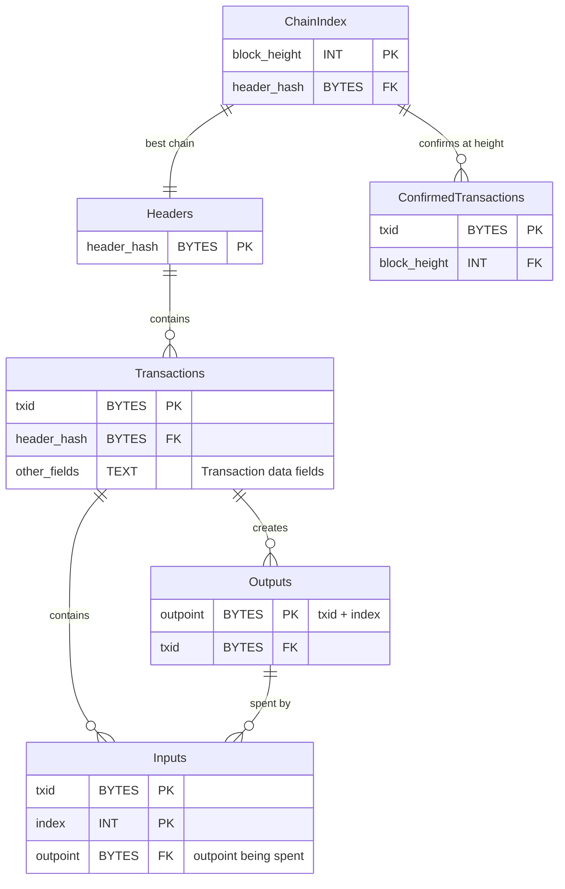

# Libbitcoin for Core people

AntoineP | 2024-11-05 18:23:21 UTC | #1

Recently Eric Voskuil [shared](https://x.com/evoskuil/status/1847684550966599894) a benchmark of doing IBD with Libbitcoin versus Bitcoin Core, showing that [Libbitcoin could perform IBD 15x faster than Core](https://x.com/evoskuil/status/1848015101233672628) with `-assumevalid`.

Libbitcoin's approach is very different from Bitcoin Core. This writeup intends to summarize how Libbitcoin functions for someone familiar with Bitcoin Core's approach. This discusses the behaviour of upcoming, not yet released, version 4 of Libbitcoin.

Libbitcoin is event-based. It will kick-off multiple asynchronous tasks (it uses [Boost ASIO](https://www.boost.org/doc/libs/1_86_0/doc/html/boost_asio/overview/core/async.html)). As you'll see later it's important as it enables it to take full advantage of its approach of splitting the various validation steps into checks which require strict, partial or no ordering.

Libbitcoin's database is *conceptually* relational but the storage is abstracted out so different backends can be implemented. Conceptually the Libbitcoin node's database has a table for headers, transactions, transaction inputs and transaction outputs. It maintains an index from confirmation height to header, header to transactions, transaction to header (only transactions confirmed in the best chain) and transaction output to its spending transaction.

To sync, Libbitcoin will spin up a hundred (by default) connections (more on how it handles connections later) and will redundantly request headers from all its peers. Once it gets a chain of headers which is "current", as defined by being less than 1h older than the system time (by default), it will start querying blocks from its peers. Blocks queries are spread across all peers.

Libbitcoin breaks down block validation into steps which need partial ordering and those that require strict ordering. Some checks (for instance block size, or transaction `nLockTime`) don't require any ordering. Checking scripts only require that you have seen the transactions that are being spent (partial ordering). Validating that the inputs actually exist requires that you went through all the blocks in order and checked the corresponding outputs were created and never spent (strict ordering). Libbitcoin will perform these checks, as well as the actual block downloading, concurrently.

When a block is downloaded, checks which don't require ordering are performed and then the transactions are stored. Of course this is fine to do DoS-wise because it only considers transactions which are part of the chain with the most PoW. Concurrently the validation (see below for terminology) thread will perform for all new transactions the check which only require partial ordering. That is, all checks (including script) but whether inputs exist (and also relative timelocks, interestingly). The confirmability (see terminology below) thread will, still in parallel, check for a range of validated blocks whether all inputs spent by these transactions exist and are yet unspent. If they are it will for each transaction insert an entry in the transaction -> header index, which conceptually "marks the block as confirmed". So the steps are 1) download 2) validation 3) confirmability but those happen concurrently for different ranges of blocks.

Note that for blocks below the milestone (see below for terminology), Libbitcoin will skip validation and confirmability (see below for terminology) checks. Of course it will still check transactions were properly committed, i.e. no malleation of either transactions or witnesses. This is in my opinion a similar threat model to Bitcoin Core's `-assumevalid`.

Reorg'ing is straightforward. To unconfirm a block the node just wipes the blocks' transactions from the transaction -> header index.

This means that pruning can technically be implemented by removing input and output data for historical spent outputs. In this case the node wouldn't be able to reorg past the pruning point without requesting peers for missing transactions. However the store is at the moment append-only and supporting this is not a priority for the project as Eric does not consider pruning an important feature.

The transaction table is also used to persist unconfirmed transactions. They can occur by being announced by a peer or through a reorg. This is not implemented yet. When announced by a peer, the node would require a transaction has at a minimum feerate. For conflicts the node would require the transaction pays at least the minimum feerate for itself plus for the whole graph it conflicts with (i.e. all past conflicts and their descendants). In effect this requires the absolute fee paid to increase, pretty much like Core does.

Now peers/connections management. Libbitcoin will by default connect to a hundred outbound peers. They intend to make this number dynamic in the future (so it throttles back after IBD). When establishing a connection to a peer they try to establish 5 concurrently and only keep the one which finishes handshake first. For syncing headers they will redundantly request headers across all their connections. They do not monitor them for speed. Block requests are spread out across peers. The speed of responses to the block requests is monitored. Libbitcoin will compute a standard deviation across the set of download rate for each connection. Slow peers, as defined by a configurable negative deviation from the SD (default: 1.5x the SD), are dropped. Stalled peers are also dropped. DoS protection for requests made to the Libbitcoin node isn't implemented yet, but Eric expects it'll mainly consist of rate limiting requests.

Another important point when considering benchmarks between Core and Libbitcoin: it currently uses a 3 years old libsecp and does not have native SHA256 acceleration.

## Terminology

Libbitcoin uses similar words for similar but different things as Bitcoin Core does. This intends to clarify the similarities and differences.

- **Milestone**: equivalent to `-assumevalid` (but skips all checks, not only the script checks)
- **Checkpoint**: equivalent to Core's checkpoints
- **Validation**: all verification (transactions scripts, amounts, timelocks, ..) except whether prevouts exist and are unspent
- **Confirmability**: verification that transactions' prevouts exist and are unspent
- **Candidate**: most work chain which is not yet validated + confirmed
- **Transaction pool**: equivalent to Core's mempool but without the "mem" (it's stored on disk)

## Credits

Thanks to Eric Voskuil for patiently answering my questions and walking me through the inner working of Libbitcoin in more details. Obviously, all remaining mistakes are mine.

-------------------------

instagibbs | 2024-10-29 13:06:58 UTC | #2

[quote="AntoineP, post:1, topic:1222"]
It maintains an index from confirmation to header
[/quote]

what does confirmation mean here

-------------------------

AntoineP | 2024-10-29 13:53:22 UTC | #3

[quote="AntoineP, post:1, topic:1222"]
from confirm
[/quote]

Missed a word, it's supposed to be "confirmation **height** to header". Thanks.

-------------------------

andrewtoth | 2024-11-03 16:56:25 UTC | #4

Thanks for this writeup! Sharing some thoughts below from private conversation.

For one, since there is no utxo set, prevouts are verified unspent by looking up the outpoint's spending transaction and verifying that it does not exist. This to me would seem slower than looking up the prevout from a utxo set.

[quote="AntoineP, post:1, topic:1222"]
Note that for blocks below the milestone (see below for terminology), Libbitcoin will skip transaction validation (besides checking they were properly committed, i.e. no malleation of either transactions or witnesses). This is in my opinion a similar threat model to Bitcoin Core’s `-assumevalid`.
[/quote]

Based on insights from a private conversation, Libbitcoin will also skip checking confirmability if below the milestone. This means that transactions are written in order in the confirmability thread, but their inputs are assumed to exist and be yet unspent. Skipping this check is where the real speedup lies I believe, and was not clear to me on first read.

With that in mind, this approach seems more like a combination of assumevalid and assumeutxo, since the signature checks are skipped and the utxo set is assumed to be valid based on the block height.

-------------------------

josibake | 2024-11-04 10:57:58 UTC | #5

Thanks for writing this! I found the bridging of the terminology particularly helpful. I was finding it difficult to conceptualise the Libbitcoin data model from your description, so I made an attempt at diagraming it, let me know if this is an accurate representation [^1].

## My understanding of Libbitcoin

(also been awhile since I've written an ER diagram so likely contains mistakes :sweat_smile: ). To check my understanding against this data model (under the `-assumevalid` / milestone model):

1. Non-overlapping ranges of blocks (e.g., 1000 blocks at a time) are downloaded and and unordered checks are done in parallel across multiple ranges
2. The first range can also start confirmability checks (genesis to block 999), after which transactions from this range are committed to the `Transactions` table and the `ConfirmationIndex` is updated
3. Now that the first range has finished with it's confirmability checks, the second range of blocks can start its confirmability checks, and so on

Conceptually, this seems close to a MapReduce algorithm, where unordered checks are mapped on to each range, and then the Reduce step requires sequential ordering of each range of blocks for the confirmability checks [^2]. Clear separation between un-ordered and fully ordered checks is what makes this possible, from what I can tell. The partially ordered checks are not done under the `-assumevalid` / milestone model.

Before commenting on how this compares to Bitcoin Core, I want to say hats off to the Libbitcoin engineering team! If my understanding is correct, this is an elegantly designed event driven system, using MapReduce for data processing. My intuition is that the speedups are coming from the more aggressive peer utilisation during download, and the clear separation of unordered vs ordered checks to take advantage of parallelism.

## Comparing to Bitcoin Core

While attempting to write the ER diagrams, it occurred to me Libbitcoin is using a _Transaction_ based data model, as opposed to Core's _Block_ based data model. I know in other places this has been called a "UTXO set" data model, but it's more helpful for me to think of it as _Block_ based for this comparison. A few differences that jump out to me:

1. When a Libbitcoin node serves a block to a peer, it must reconstruct the block into its serialised representation, which will require some compute for each block request. Bitcoin Core, however, stores the blocks on disk in their serialised format and will simply read the block from disk and send it to the peer
2. When updating the chaintip, it seems Bitcoin Core will be faster at fully validating the new block (unordered, partially ordered, and fully ordered checks) and updating the chaintip, whereas Libbitcoin will be slower as most of its speed-ups rely on processing ranges of blocks under the milestone model

These are very high-level handwavey claims, and as its been mentioned already, Libbitcoin might be able to close this gap on fully validating new blocks after implementing libsecp / SHANI optimisations that are currently in Core. But I wanted to highlight the differences in data model because my intuition is a perfectly optimised _Transaction_ based data model will _always_ perform faster during IBD than a perfectly optimised _Block_ based data model, and a perfectly optimised _Block_ based data model will always perform faster than the _Transaction_ model when it comes to processing new blocks and serving them to peers.

## Closing thoughts

I don't want to make claims (and hope I haven't implied) in this post that one is better than the other. My personal view on the role of a Bitcoin node is that its primary purpose is to validate and propagate new blocks as quickly as possible, such that all nodes and miners on the network can quickly come to agreement on what the longest/heaviest PoW chain is. This is why I favour the _Block_ based data model. However, it's also clear that many other services / use cases need fast IBD and have more of a transaction based use case for bitcoin, namely any block explorer, wallet backend, payment processing, etc. It feels like there is likely some middleground between the _Transaction_ based model and the _Block_ based model that could serve both use cases.

[^1]: I realise I'm mostly just rephrasing the original post in my own language. My hope is this is seen as useful and not a critique of the original post, which I found extremely helpful in understanding the differences between Core and Libbitcoin
[^2]: This is not quite MapReduce in that I don't think classic MapReduce requires a strict sequential ordering, which the confirmability checks do. Still, I found it to be a helpful mental model for trying to better understand the Libbitcoin approach

-------------------------

josibake | 2024-11-04 15:14:10 UTC | #6

[quote="andrewtoth, post:4, topic:1222"]
Libbitcoin will also skip checking confirmability if below the milestone. This means that transactions are written in order in the confirmability thread, but their inputs are assumed to exist and be yet unspent. Skipping this check is where the real speedup lies I believe, and was not clear to me on first read.
[/quote]

This also is not clear to me at all from this write up. Would be good to confirm this and perhaps amend the OP to reflect what Libbitcoin is actually doing.

-------------------------

AntoineP | 2024-11-04 18:49:27 UTC | #7

[quote="andrewtoth, post:4, topic:1222"]
Based on insights from a private conversation, Libbitcoin will also skip checking confirmability if below the milestone. This means that transactions are written in order in the confirmability thread, but their inputs are assumed to exist and be yet unspent. Skipping this check is where the real speedup lies I believe, and was not clear to me on first read.
[/quote]

Thanks for pointing out it's worth underlining this in the writeup. Will edit OP.

I do also think this is what drives most of the IBD speedup there. And it is directly related to their architecture, doing it for Bitcoin Core wouldn't bring much benefit since you still have to update the UTxO set (see also [this #bitcoin-core-dev discussion](https://gnusha.org/bitcoin-core-dev/2024-10-24.log) discussion about this).

[quote="josibake, post:5, topic:1222"]
My intuition is that the speedups are coming from the more aggressive peer utilisation during download, and the clear separation of unordered vs ordered checks to take advantage of parallelism.
[/quote]

Yes although in the context of this specific benchmark it's more about being able to skip a whole class of checks than parallelizing them, i think.

[quote="josibake, post:5, topic:1222"]
These are very high-level handwavey claims, and as its been mentioned already, Libbitcoin might be able to close this gap on fully validating new blocks after implementing libsecp / SHANI optimisations that are currently in Core.
[/quote]

Even if they do, we can expect there still being an edge in using a UTxO set (as long as it doesn't get enormous) as you check inputs against a much smaller index.

[quote="josibake, post:5, topic:1222"]
My personal view on the role of a Bitcoin node is that its primary purpose is to validate and propagate new blocks as quickly as possible, such that all nodes and miners on the network can quickly come to agreement on what the longest/heaviest PoW chain is. This is why I favour the *Block* based data model.
[/quote]

This isn't so much block storage which makes a difference but how their content is indexed. In this case it would be clearer to make a distinction between a historical transactions index vs an unspent outputs index.

-------------------------

evoskuil | 2024-11-04 22:24:25 UTC | #8

There are a few good observations here, but also several reasonable but incorrect assumptions. If anyone is interested in detailed discussion on libbitcoin's node progress we invite you to join the [libbitcoin Slack channel](https://libbitcoin.slack.com/join/shared_invite/enQtNDgxMjQxODg0NTM1LTFhYzNhYjYxYTg1OTc0NGQ0OWQxY2ZiYWI5ODc1ZmFjZjEyNGZkNWQwM2JiMzk0YjhkMDc0MjkxOTgwMzQ0ZDM#/shared-invite/email) and/or attend our weekly dev meetings.

-------------------------

josibake | 2024-11-05 08:41:22 UTC | #9

Awesome, thanks for the invite; just joined! In addition, if you're able to respond here to which parts of my summary are incorrect, I think that would be of tremendous value. My intent in writing down my (likely incomplete) understanding was to give an opportunity for people to correct it here in the hopes of making this a more complete document on the differences between Libbitcoin and Core's architectures. I'm also happy to try and translate my learnings from the slack channel back to this post, but it would be more efficient and correct to get it straight from the horses mouth.

-------------------------

josibake | 2024-11-05 10:23:56 UTC | #10

[quote="AntoineP, post:1, topic:1222"]
Libbitcoin will skip transaction validation besides checking they were properly committed, i.e. no malleation of either transactions or witnesses (note this means in particular inputs existence isn’t checked). This is in my opinion a similar threat model to Bitcoin Core’s `-assumevalid`.
[/quote]

I think this edit helps, but is still a bit confusing in that the term "transaction validation" is overloaded. Later in the post, you define "Validation" and "Confirmability" as two separate things, i.e., "Validation" is all verification checks _except_ "Confirmability" and "Confirmability" is only verifying prevouts exist and are unspent. I think the OP would be more clear if it explicitly mentions that for blocks under the milestone, both "Validation" and "Confirmability" checks are skipped. I think this also makes it more clear where the differences with Core's architecture are: while this is conceptually a similar threat model, Core _does_ need to check that inputs exist and are unspent because this is necessary for maintaining a "UTXO set" (in that we must know what inputs are being spent so that they can be deleted from the UTXO set before continuing).

-------------------------

AntoineP | 2024-11-05 18:24:04 UTC | #11

Fair. Made another edit. Thanks.

-------------------------

sjors | 2024-11-28 12:13:10 UTC | #12

Has anyone (else) done this benchmark? A 15x performance difference, despite a native sha256 handicap, sounds too good to be true.

It's also useful to investigate which machine properties (and settings) determine the difference. For example I have two machines than can do IBD in about 5 hours, in part thanks to a high `-dbcache` value and gigabit internet. Will libbitcoin do it in 20 minutes? (presumably not, if just because of disk speed limits)

But even a 3x difference on typical consumer hardware with typical internet bandwidth and only a few GB of RAM would be worth thoroughly investigating. 

IIUC there's only two things that Bitcoin Core does in parallel during IBD:
1. Block download
2. Script validation (I recently tried dropping the `-par=16` limit, but `-par=32` made no noticeable difference)

There certainly room to do more things in parallel, and it's probably fine to spend a bit more CPU and I/O validating a chain that turns out to be invalid (but had the most PoW). Bitcoin Core currently tries to abort such validation as early as possible.

-------------------------

AntoineP | 2024-11-29 14:08:23 UTC | #13

[quote="sjors, post:12, topic:1222"]
IIUC there’s only two things that Bitcoin Core does in parallel during IBD:

1. Block download
[/quote]

Bitcoin Core may parallelize requests but block processing is still sequential.

-------------------------

evoskuil | 2024-11-30 06:49:18 UTC | #14

[quote="sjors, post:12, topic:1222"]
Will libbitcoin do it in 20 minutes?
[/quote]

The benchmarks we've published are based on a 2.3Gbps (down, 40Mbps up, measured speed) Internet connection. It would not be possible to download to block 850k in 20 minutes in this case. The theoretical limit is around 40 minutes and we hit closer to 60. However with a 5 Gbps connection I suspect it would be close to 30 mins.

-------------------------

evoskuil | 2024-11-30 06:53:30 UTC | #15

[quote="sjors, post:12, topic:1222"]
presumably not, if just because of disk speed limits
[/quote]

Disk speed isn't the limiting factor, at least in these benchmarks. The store is append-only memory maps, so the only disk activity during IBD is periodic flushing to disk to free up more RAM. With sufficient RAM the disk is barely touched.

-------------------------

evoskuil | 2024-11-30 07:02:50 UTC | #16

[quote="AntoineP, post:13, topic:1222"]
Bitcoin Core may parallelize requests but block processing is still sequential.
[/quote]

The Core parallel download is very limited, and really operates as just a read-ahead cache. Libbitcoin downloads, checks, stores, and indexes concurrently on all available (or configured) threads. The full chain can be concurrently downloading, though we generally narrow the window to 50k blocks or less to improve data locality and prevent extended gaps while validating. The store is fully write-concurrent and the overall design is lock-free (proactor pattern).

When fully validating, Libbitcoin also validates blocks concurrently on all available (or configured) threads - not just scripts, all accept/connect checks, and not limited to one block. A concurrent download window of about 50k blocks generally ensures that the validator threads are rarely starved.

-------------------------

evoskuil | 2024-11-30 07:33:40 UTC | #17

[quote="sjors, post:12, topic:1222"]
despite a native sha256 handicap
[/quote]

On a low thread count machine this would be noticeable, but since CPU is not maxed out it is not a factor. We have noticed that this significantly affects Core, even though CPU is never close to max. This is an indication of how sequential is the operation.

FWIW we do have sse4 (4), avx2 (8), and avx512 (16 channel) Merkle tree and single/multiple block message scheduling vectorizations [though the benchmark hardware does not have avx512], are presently adding SHANI, and take advantage of several other SHA optimizations (e.g. cached whole block padding, function rewrites, vectorization-friendly array copies).

-------------------------

evoskuil | 2024-11-30 07:54:13 UTC | #18

I'll just add that Libbitcoin is doing a lot more useful work in this much shorter timeframe. We always index all transactions. Our Core benchmarks are with txindex disabled. We also always index all spenders - which input(s) spend a given output - which is a huge amount of information. All chain objects are stored relationally with full constant time bidirectional indexation.

We optionally can add the full Electrum style address index (e.g. ElectrumX) for an additional 30 minutes of sync time. It can take ElectrumX days to pull this same information out of a local Core node and index it in the same manner. Additionally the query response is orders of magnitude faster.

We've also noticed Core shutdown times of 10 minutes or more. BN shutdown time is generally less than a minute even after a full sync. We haven't included that factor in our comparisons.

-------------------------

