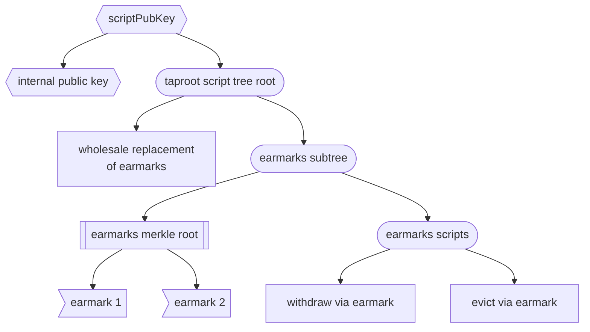

# Flexible Coin Earmarks

ajtowns | 2024-11-25 06:56:45 UTC | #1

I'd like to share a concept that I'm working on implementing in [bllsh](https://delvingbitcoin.org/t/debuggable-lisp-scripts/1224), that I'm calling "Flexible Coin Earmarks", along with how it relates to ideas like lightning commitments, vaults, and payment pools. This post does go into some implementation details, but not to the level of specifying any code, so should apply equally to a realisation in bll or simplicity or something else.

### Concept

The idea is relatively simple:

  * a flexible coin earmark allows you to split the value of a single coin (aka utxo) across separate purposes -- each of these is an "earmark".
  * earmarks can be "exercised" independently by updating the coin; that is to say, by publishing a transaction that:
    * spends the coin
    * satisfies whatever conditions were placed on the earmark
    * creates a new output that is also a flexible coin earmark[^1], which contains all the unexercised earmarks and their corresponding value
  * all earmarks can be replaced wholesale under some circumstances
    * the circumstances under which this makes sense depends heavily on the use case, so see below
    * in implementation terms, eg, this might correspond to a key path spend signed by a musig2 key that combines the pubkeys of all the recipients of the earmarks

### Comparisons

#### Lightning commitment transactions

This is a fairly nice match for lightning commitments: when you do a unilateral channel close, the channel funds are naturally earmarked for different purposes; there's your balance, there's your counterparty's balance, and also each unresolved HTLC. Likewise the conditions for ignoring all the earmarks are pretty clear: you published an outdated state, and your counterparty has a newer state. Exactly what happens when you ignore the earmarks depends on whether you're doing ln-penalty (all the funds go to your counterparty), or eltoo (you just update to the new state's earmarks).

One aspect that is different in the flexible coin earmark model is dealing with layered commitments. Layered commitments in the current ln-penalty model means that when you close a channel with a pending HTLC, you create a distinct output for that HTLC, that can be updated either by providing the HTLC preimage or when the HTLC timeout occurs, so that the HTLC's recipient is locked in. This means that if there is an overlap between the HTLC timeout and the channel's state finalisation timeout (ie, the point at which you can no longer present a newer state to dispute the channel close), there isn't a race between which channel member gets to claim the funds.

In the flexible coin earmark model, this can occur within a single coin, without creating additional outputs: you exercise the earmark by either providing the preimage or demonstrating the timeout has passed, and when generating the new output, you remove the HTLC's earmark, and update the appropriate balance of whoever received the funds. This has two benefits. One, admittedly fairly minor, is that it means you don't ever need a dedicated output for the individual HTLC, so the dust limit doesn't constrain what the value of HTLCs you can satisfy on-chain. The more important is that the channel's overall value remains in a single utxo even as layered commitments are updated, which makes it cheaper for the cheated party to recover the channel funds, as they haven't been split across multiple small utxos, that would all need to be claimed separately.

In the context of eltoo, layered commitments have either been ignored entirely, or result in [very complex constructions](https://lists.linuxfoundation.org/pipermail/lightning-dev/2020-January/002448.html). With flexible coin earmarks, this becomes much simpler: layered commitments are just updating the earmarks, and state updates are just wholesale replacement of the earmarks. Neither of these change the coin's balance, and nor do they split the coin.

#### Vaults

The concept of "vault" that I'm using here is that when your funds are in a vault you can spend them by:
  1. authorising with your "hot key"
  2. publishing a commitment to where you want the funds to end up
  3. wait some fixed delay during which the vault can be "locked" via a "recovery key"
  4. publishing a transaction to actually send funds to the place you committed to

If the recovery key is used, then that should at least invalidate the commitment (preventing the attempted theft), but in most cases all the funds in the vault should be locked down (since the attempted theft was only possible in the first place if the hot key had been compromised).

In the flexible coin earmark model, you would implement this concept by creating a new earmark any time you wanted to spend funds, with the earmark's execution conditions being that a particular delay has been reached and that the correct output is created. The recovery path is then simply replacing all the pending earmarks, and moving the funds into a cold wallet. (If you want to allow multiple concurrent pending spends, then tracking the delay becomes somewhat more complicated, as each new commitment should not reset the delay) 

The [BIP345](https://github.com/bitcoin/bips/blob/f269890255400d3119a3341c124902d98519fa3a/bip-0345.mediawiki) approach differs from this in that the spend is separated into its own utxo immediately upon publishing the commitment, which makes the final spend somewhat easier, at the cost of making the recovery somewhat more complicated. (BIP345 also introduces the concept of deferred balance checks to consensus, which are not contemplated here)

#### Payment pools

The concept of a payment pool here is an on-chain mechanism for gathering funds, that can be spent jointly, but, until they have been spent remain recoverable by whoever originally contributed the funds. An example design was given in the [TLUV proposal](https://gnusha.org/pi/bitcoindev/20210909064138.GA22496@erisian.com.au/).

Mapping this to a flexible coin earmark model is straightforward: the value of the coin is split into an earmark for each contributor who can extract that value just by signing for it, and making the pooled payment can be done via a key path spend authorised by a musig2 key combining the keys of all the funders.

However, generating the updated coin when an earmark is executed is more complex, as not only do the earmarks have to be updated (removing the earmark for the funds that were removed), but so does the internal public key, which needs to have a key removed from the musig2 collection. This was where the process fell apart in the TLUV design -- removal requires either adding or subtracting the key, depending on where the internal public key had previously been negated, but because taproot uses a 32-byte internal public key, there is no natural way to track whether it was negated. This could have been worked around, but not in any particularly satisfying way. (BIP 345's OP_VAULT opcode avoids this issue by not providing a way to modify the internal public key) With flexible coin earmarks, we can finesse this nicely however: we need a somewhat generic way of storing all the earmarks anyway, so can simply store whether the internal public key was negated in the same place.

### Flexibility

Implicit in the descriptions above is a couple of different ideas of what "flexible" means in the phrase "flexible coin earmarks".

 1. Earmark execution is flexible: there's no fixed order in which the earmarks have to be executed, some earmarks may never be executed, and the earmarks themselves may have conditions in their execution (eg, HTLC earmarks behave differently depending on if they're executed with a preimage reveal, vs a timeout)
 2. Earmark specification is flexible: there are substantial differences in the behaviour of earmarks between lightning, vaults, and payment pools: in lightning we want execution of one earmark (an HTLC) to update the value of another earmark (the recipient's channel balance); in vaults we want to enforce a delay before an earmark can be executed; in payment pools we want to update the internal public key.

The latter point raises a question: can that flexibility in specification be provided via specialist opcodes (such as TLUV), or can it only really be achieved via a more general purpose language (like bll or simplicity)? Of course, even if the latter were the case, it would be possible to introduce independent opcodes for each distinct class of earmark with a use case that gains traction, so this may be more a question of philosophy and development process.

### Implementation

So, assuming a general purpose language for expressing coin spending conditions, and one built on taproot at that, I think the following implementation approach is feasible.

First, deal with the "replace earmarks wholesale" step -- in many cases this can be dealt with via setting the internal public key and simply using the key path, perhaps producing a multisig key with musig2 first. In some cases, such as lightning, some additional conditions may be required, in which case these are specified in taproot scripts. Because this path is for replacing the earmarks wholesale, any scripts here can remain independent of any logic investigating whatever the current earmarks were.

This leaves the question of how to execute an earmark. There are many ways you could do this, but I think one of the simpler approaches is to leverage the taproot script tree for data storage (commitment) -- that is, have one "branch" of the taproot tree be a merkle root committing to a tree of earmarks, and its neighbour in the taproot script tree be the script that's authorising/validating earmark execution. This has two nice properties: it's fairly easy to access the earmark merkle root as it is simply the first item in the merkle path section of the control block; and it also means that when updating the earmarks, the script itself is unchanged, somewhat simplifying calculation of the new scriptPubKey.

This approach can be generalised if there are different methods of executing an earmark. For example, in the payment pool case, we've already considered the case of where a member of the pool wants to remove themselves from it; but it's also possible that the rest of the pool may wish to evict a particular member: after all, in this design, the cooperative path can only be executed if everyone agrees. Evicting a single member would involve revealing that member's earmark, creating an output paying the member's balance to their pubkey, and signing the spend with the result of subtracting the member's key from the internal public key. In this case you might want to provide separate scripts for both these behaviours, in which case the earmarks merkle root would become the second entry in the control block path, rather than the first. Updating the earmarks would still require constructing a new scriptPubKey with only the earmarks merkle root being replaced when recalculating the taproot script tree's merkle root.

Here's a diagram of how that generalised example might look, where there are three scripts: one for bypassing/replacing the earmarks, one for a member withdrawing their own funds, and one for everyone else evicting a member from the pool.

When spending using the "withdraw via earmark" script, the taproot merkle path will consist of "evict via earmark", "earmarks merkle root", and "wholesale replacement of earmarks". (The entries in the earmarks merkle (sub)tree are marked up differently to imply they should be hashed in a way distinct from the TapLeaf/TapBranch tagged hashes defined in BIP341, to ensure they can't be misinterpreted as taproot scripts, possibly enabling theft of funds).

This leaves us with what an earmark execution script actually needs to do. The basic witness data the script will need to be provided with include:

 * a reveal of the earmark, as well as the merkle path from the earmark to the earmarks merkle root
 * any data necessary to satisfy the earmark conditions (eg, a preimage reveal or a signature)
 * the index of the output that will contain the remaining/updated earmarks

And the things the script will need to check/calculate include:

 * check that the earmark reveal and merkle path resolve to the merkle root extracted from the control block
 * check that the earmark's execution conditions are correctly satisfied
 * calculate the amount of funds that should remain in the coin (ie, the input value minus the value of any spent earmarks)
 * check that the new output's value is at least the amount of funds that should remain
 * calculate the new internal public key, if necessary (eg, in the case of payment pools, the internal public key will change)
 * calculate the updated earmarks merkle root (eg, the executed earmark should be removed, and perhaps other earmarks should be updated if this was an internal transfer)
 * calculate the new scriptPubKey by combining the new internal public key, the updated earmarks merkle root, and the taproot script merkle path from the control block
 * check that the new output's scriptPubKey matches the new scriptPubKey

I believe both bll and simplicity have a sufficient feature set to be able to express the above. My hope is that it's possible to express it in a modular way, so you can spend most of your time defining what the earmark execution and wholesale replacement conditions are, rather than manually tweaking the checks/calculations above for your particular use case.

[^1]: If you're wondering why the word "covenant" doesn't appear in this post other than in this footnote, I've [written previously](https://gnusha.org/pi/bitcoindev/20220719044458.GA26986@erisian.com.au/) about why I think it is not an accurate or useful term.

-------------------------

instagibbs | 2024-11-25 19:06:50 UTC | #2

[quote="ajtowns, post:1, topic:1275"]
With flexible coin earmarks, this becomes much simpler: layered commitments are just updating the earmarks, and state updates are just wholesale replacement of the earmarks. Neither of these change the coin’s balance, and nor do they split the coin.
[/quote]

I think years ago we called this "magical eltoo" :slight_smile:

-------------------------

