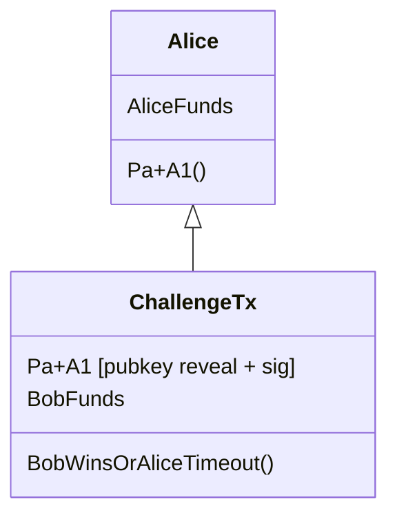

# Emulating OP_RAND

olkurbatov | 2025-01-29 11:17:08 UTC | #1

We propose a method of emulation of OP_RAND opcode on Bitcoin through a trustless interactive game between transaction counterparties. The game result is probabilistic and doesn't allow any party to cheat and increase their chance to win on any protocol step. The protocol can be organized in a way unrecognizable to any external party and doesn't require some specific scripts or Bitcoin protocol updates. We will show how the protocol works on the simple **Thimbles Game** and provide some initial thoughts about approaches and applications that can use the mentioned approach. 

# Intro
Bitcoin script doesn't directly allow putting randomness and constructing the spending flow based on that. So, realizing the flow "*Alice and Bob put for 5 BTC each, and Bob takes everything if the coin comes up tails*" wasn't possible upon the following assumptions:
1. The transaction can't derive or take randomness from somewhere at the moment of confirmation
2. Bitcoin Script can't inspect the block, past or future transactions
3. Each party can receive the same stack's state after each opcode processing
4. We can't control the ECDSA or Schnorr signature determinism
5. Bitcoin doesn't support OP_RAND opcode =)

All the limitations mentioned led to the situation where we couldn't find trustless solutions that allow scrambling randomness and use it for a trustless protocol operating with bitcoins. We propose a way to organize it via a 2-party interactive protocol and show how these properties can be applied in the example of a thimbles game that takes bids in BTC.

# Preliminaries
$\mathbb{G}$ a cyclic group of prime order $p$ written additively, $G \in \mathbb{G}$ is the group generator. $a \in \mathbb{F}_p$ is a scalar value and $A \in \mathbb{G}$ is a group element. $\mathsf{hash}_p(m) \rightarrow h\in \mathbb{F}_p$ is the cryptographic hash function that takes as an input an arbitrary message $m$ and returns the field element $h$. $\mathsf{hash}_{160}(P) \rightarrow \mathsf{addr}\in \mathcal{A}$ is the function of hashing the public key with sha-256 and ripemd160 functions and receiving a valid bitcoin address as an output.

We define the relation for the proof $\pi$ as $\mathcal{R} = \{(w;x) \in \mathcal{W} \times \mathcal{X}: \phi_1(w,x), \phi_2(w,x) , \dots, \phi_m(w,x)\}$, where $w$ is a witness data, $x$ is a public data and $\phi_1(w,x), \phi_2(w,x) , \dots, \phi_m(w,x)$ the set of relations must be proven simultaneously.

We define a bitcoin transaction as $\mathsf{TX}\{(\mathsf{id, i, proof})^{(n)};(\mathsf{a BTC, cond})^{(m)}\}$ with $n$ inputs and $m$ outputs, where $\mathsf{id}$ is the hash of the previous transaction, $i$ - output's index, $\mathsf{proof}$ - the list of data which is needed to transaction spending, $a$ - the number of coins in the output, $\mathsf{cond}$ - scriptPubKey conditions. For example, the P2PKH method requires $\mathsf{proof} \leftarrow \langle  \mathsf{PK}, \sigma\rangle$ and $\mathsf{cond}\leftarrow \langle$ OP_DUP, OP_HASH160, $\mathsf{addr},$ OP_EQUALVERIFY, OP_CHECKSIG $\rangle$. We are going to simplify the condition notation above to $\mathsf{addr}$ when referring to the P2PKH approach.

# EC Point covenant
First of all, let's see how we can implement the transaction with two counterparties and the following conditions: "It's possible to spend the second transaction output only in the case the first is spent". Traditionally, it could be organized using a hash lock contract, but 1 -- it's recognizable; 2 -- it won't help us to implement the final game.

If Alice wants to spend her output, she needs to create a transaction and reveal a public key $P_a$ and the signature value.
$$
    \mathsf{TX}_2\{(\mathsf{TX_1, 1, \color{red}{\langle P_a, \sigma_{P_a}}(\mathsf{TX_2})\rangle});(\mathsf{1 BTC, \color{red}{addr_{a'}}})\}
$$

After the transaction is published, Bob can extract $P_a$ and recover the $\mathsf{hash}_p(P_a)$ value. Then the secret key for the second output is calculated as $sk = \mathsf{hash}_p(P_a) + sk_b$ (only Bob controls $sk_b$), and Bob can construct the signature related to $P_b+C$ public key and corresponding address.
$$
    \mathsf{TX}_3\{(\mathsf{TX_1, 2, \color{blue}{\langle P_b + C, \sigma_{P_b + C}}(\mathsf{TX_3})\rangle});(\mathsf{1 BTC, \color{blue}{addr_{b'}}})\}
$$

So, we have built the first part needed for emulating the randomness and our thimbles game. We need to note that in the previous example, if Alice doesn't spend her output and doesn't publish $P_a$ anywhere, Bob can't recover the key and spend his output as well. If we need to provide an ability to spend these outputs after some time (if the game hasn't started), we can do it similarly to the payment channel construction --- lock coins to the multisignature and create a tx that can spend them after a defined period.

# OP_RAND emulation protocol
We propose to emulate the OP_RAND opcode with an interactive protocol between parties involved in the transaction. Introducing the Challenger $\mathcal{C}$ and Accepter $\mathcal{A}$ roles we can define the OP_RAND emulation protocol as follows:

1. $\mathcal{C}$ and $\mathcal{A}$ have their cryptographic keypairs $\langle sk_{\mathcal{C}}, P_{\mathcal{C}}\rangle$ and $\langle sk_{\mathcal{A}}, P_{\mathcal{A}}\rangle$. Only $P_{\mathcal{C}}$ value is public
2. $\mathcal{C}$ generates the set of random values $a_1, a_2,\dots, a_n$ and creates a first rank commitments for them as $A_i = a_iG, i\in[1, n]$
3. $\mathcal{C}$ selects one commitment $A_x$, assembles it with own public key as $R_{\mathcal{C}} = P_{\mathcal{C}}+A_x$ and publishes only the hash value of the result $\mathsf{hash}(R_{\mathcal{C}})$
4. $\mathcal{C}$ creates second rank commitments as $h_i = \mathsf{hash}(A_i), i \in[1,n]$ and third rank commitments as $H_i = h_iG, i \in[1,n]$
5. $\mathcal{C}$ creates a proof $\pi_a$ that all third rank commitments were derived correctly, and one of the first rank commitments is used for assembling with $P_{\mathcal{C}}$
6. $\mathcal{C}$ proposes the set of third rank commitments to the $\mathcal{A}$ and provides $\pi_a$
7. $\mathcal{A}$ verifies the proof $\pi_a$ and selects one of the third-rank commitments $H_y$ to assemble it with $P_{\mathcal{A}}$. The result $R_{\mathcal{A}}=P_{\mathcal{A}}+H_y$ is hashed $\mathsf{hash}(R_{\mathcal{A}})$ and published
8. $\mathcal{A}$ creates a proof $\pi_r$ that one of the third rank commitments was used for assembling with $P_{\mathcal{A}}$ and sends it to $\mathcal{C}$. Additionally the proof covers the knowledge of the discrete log of $P_{\mathcal{A}}$
9. $\mathcal{C}$ verifies the proof $\pi_r$ and if it's valid publishes the $R_{\mathcal{C}}$
10. $\mathcal{A}$ calculates $A_x = R_{\mathcal{C}}-P_{\mathcal{C}}$
11. If $\mathsf{hash}(A_x)\cdot G = H_y$, $\mathcal{A}$ won. Otherwise lost 

# An example of Thimbles Game
Finally, we can show how the interactive protocol we introduced allows the organization of a trustless thimbles game between two counterparties. So, having Alice and Bob, the game could be described as follows:
1. Alice and Bob lock their coins.
2. Alice generates two values and selects one of them (don't reveal the selected value to Bob). In other words, Alice chooses a thimble with a ball under it.
3. Bob selects the thimble: takes value from proposed by Alice (and also doesn't reveal it).
4. Alice reveals the value she selected initially.
5. If Bob selected the same value --- he can take all deposited coins. If not, Alice can spend coins after locktime.

So Bob doesn't know which value was selected by Alice, Alice doesn't know what Bob selected. And we can go to the final stage when Alice takes her coins. For that Alice spends the first output, so publishes $P_a + A_1$ value. Bob knows $P_a$ so he can easily receive $A_1$ value and corresponding $h_1 = \mathsf{hash}_p(A_1)$. 

If the secret key $h_1 + sk_b$ satisfies the address $\mathsf{addr}_b$, Bob can take 10 BTC , locked on the second output. If not --- Alice can spend them after the timelock.

-------------------------

harding | 2025-02-07 03:00:21 UTC | #2

Thank you for publishing this exciting work!  I was wondering if you think your protocol could also work for probabilistic HTLCs in the Lightning Network (LN).

[Prior research][dryja pp] into probabilistic payments by @adiabat has looked at using them for sending payments that would be impossible or [uneconomical][topic uneconomical outputs] to spend onchain.  In the current LN, uneconomical payments are sent using [trimmed HTLCs][topic trimmed htlc], where the upstream party allocates the payment amount to the transaction fee of the offchain commitment transaction.  If the channel remains offchain until the trimmed HTLC is resolved, the fee is reduced and the money is allocated to the downstream party.  If the channel is force closed, the fee is paid to miners and one of the parties loses funds (which party loses depends on whether the trimmed HTLC eventually gets resolved further downstream).

I think it would be nice to replace trimmed HTLCs with probabilistic HTLCs.  For example, Alice wants to relay 1 sat to Bob.  This is uneconomical, so instead Alice's creates an output paying Bob 10,000 sats (~$10) with a 1-in-10,000 probability.  If the channel stays offchain until the HTLC is resolved, Alice and Bob sign a mutual channel update transferring 1 sat from her to him.  Only if the channel is forced closed does the probabilistic payment happen.  Is that possible with your scheme?

If so, is it further possible to condition resolution based on an HTLC?  For example, Alice can take back the money after 1,000 blocks; Bob can receive the money with 0.01% probability if he discloses the preimage for a known hash digest.  (Stretch goal: is the scheme compatible with PTLC resolution where [signature adaptors][topic adaptor signatures] are used?).  Bob must not be able to learn whether he can claim the money until after he has accepted the probabilistic HTLC, otherwise he'll refuse to forward any HTLCs that he can't fully claim.

If probabilistic HTLCs are possible, is it also possible to add [LN-Penalty][topic ln-penalty] revocation paths?  For example, if Alice publishes the HTLC onchain, she has to wait a certain number of blocks before taking an action but Bob can immediately claim the funds by providing a signature that Alice gave him when the HTLC was revoked or by providing the preimage.  If Bob publishes the HTLC onchain, he has to similarly wait to give Alice a chance to provide his signature or to reclaim the funds after the 1,000 block timeout.  The determination of who published onchain is made based on who published the commitment transaction, of which there are two different versions (one for Alice and one for Bob).  (Stretch or alternative goal: is the scheme also/instead compatible with alternative LN protocols, like [LN-Symmetry][topic ln-symmetry]?)

If it can accomplish all of the above, then would it be possible to perform most or all of the interactive steps in advance before a specific probability was known?  For example, during channel setup or during a long period between forwarding HTLCs, Alice and Bob pre-share the known public key and a large number of commitments for the next payment.  Then, when Alice knows that she wants to forward x sats with x/10_000 probability, she selects the appropriate number of commitments for each rank to obtain that probability.  She concisely tells Bob what she did and provides a signature for the new version of the commitment transaction that funds the probabilistic payment; he validates and accepts, ideally with no additional interaction required.  If additional interaction is required, it would be convenient if it did not exceed the [interactivity requirements][sanders ptlc] for using MuSig2 signature adaptors.

I realize I'm basically asking you to do my homework, but I'm not a cryptographer and it would otherwise take me a long time to understand your proposal well enough to answer the questions myself.  Any help will be appreciated.

[sanders ptlc]: https://gist.github.com/instagibbs/1d02d0251640c250ceea1c66665ec163
[dryja pp]: https://docs.google.com/presentation/d/1G4xchDGcO37DJ2lPC_XYyZIUkJc2khnLrCaZXgvDN0U/mobilepresent?pli=1#slide=id.g85f425098_0_219
[topic uneconomical outputs]: https://bitcoinops.org/en/topics/uneconomical-outputs/
[topic trimmed htlc]: https://bitcoinops.org/en/topics/trimmed-htlc/
[topic adaptor signatures]: https://bitcoinops.org/en/topics/adaptor-signatures/
[topic ln-penalty]: https://bitcoinops.org/en/topics/ln-penalty/
[topic ln-symmetry]: https://bitcoinops.org/en/topics/eltoo/

-------------------------

ajtowns | 2025-02-07 04:36:44 UTC | #3

[quote="olkurbatov, post:1, topic:1409"]
And we can go to the final stage when Alice takes her coins. For that Alice spends the first output, so publishes $P_a + A_1$ value.

If the secret key $h_1 + sk_b$ satisfies the address $\mathsf{addr}_b$, Bob can take 10 BTC , locked on the second output. If not — Alice can spend them after the timelock.
[/quote]

Why wouldn't Alice sit on the $P_a+A_1$ output until the $\mathsf{addr}_b$ timelock expires, even if Bob guessed correctly? I would have expected an extra setup tx, like:

where Alice can only complete the challenge tx to publish it by revealing $P_a+A_1$.

[quote="harding, post:2, topic:1409"]
Only if the channel is forced closed does the probabilistic payment happen. Is that possible with your scheme?
[/quote]

I don't think this quite works -- you'd need the force-closer to take the challenger role (because they're publishing the tx), but you also need the recipient of the HTLC to take the acceptor role (because they're the one that gets the 1-in-1000 chance of a win, with the challenger getting the remaining 999-in-1000 chance), so if the force-closer is the recipient of the probabilistic payment, you've got a problem. Might be recoverable with tweaks to the protocol though?

Having to transmit 1000 hashed pubkeys and a zkp for every dusty-HTLC for every update is also probably prohibitive.

-------------------------

olkurbatov | 2025-02-07 16:20:30 UTC | #4

Yeah, you are totally right, we do need such a setup

-------------------------

AdamISZ | 2025-02-08 16:10:51 UTC | #5

Very interesting set of ideas! I particularly like the hiddenness property. I believe it works, modulo @ajtowns 's correction on tx-structure.

One thing that strikes me: it could be that the most expensive part of this operation is putting hash160 into an arithmetic circuit (well, assuming you used something for which the EC operations are native, like bulletproofs, which of course may not actually be the best option, depending ...). Did you consider rewriting this in Schnorr/taproot form? Because that part would be removed.

The obvious objection is that taproot does not natively come with a hashed pubkey type scriptPubKey and so it's not meaningful/useful, if you had to insert that into the tapscript anyway, in order to maintain the property that the final pay-in addresses addr_a and addr_b actually function to hide the choices made.

I spent some time thinking about ways around that. The obvious starting point might be blinding addr_a,b with a third point, so e.g. $P_a + A_1 + T$. But on reflection it's not surprising that there's no easy way to make that work, since you're blinding with a point, not a scalar. You can always add other relations to the ZKP to prove this extra structure, but it doesn't help if what is atomically revealed in broadcast (i.e. the schnorr signature) only reveals the overall key. I looked briefly at adding in adaptors via MuSig between the parties but it didn't seem to work because of the aforementioned thing that the "secret" here is a point, not a scalar.

Anyway, perhaps just a sidetrack - I think the core concept is very nice.

-------------------------

ajtowns | 2025-02-09 13:18:54 UTC | #6

[quote="AdamISZ, post:5, topic:1409"]
I spent some time thinking about ways around that. The obvious starting point might be blinding addr_a,b with a third point, so e.g. $P_a + A_1 + T$.
[/quote]

Would $t \cdot (P_a + A_1)$ work for this? ie provide $X, T$ and prove you have a $t$ where $T = t\cdot G$ and $X = t\cdot(P_a + A_1)$. Then you could reveal $t$ via an adaptor signature.

-------------------------

AdamISZ | 2025-02-09 16:20:45 UTC | #7

Yes, I believe that works. So the process would be:

(The following is modifications to Algorithm 2 per the doc): Alice provides:

* the unsigned transaction template for TX1, with the output address now being (taproot) key $X$
* $T$
* $\pi_a$ which now is modified to prove that $X = (a_1 + x_a)T$ OR $=(a_2 + x_a)T$ and additionally proves knowledge of the DL of $T$ (or just sign on it, same thing). Using formal notation it becomes $R_a =   \{a_1, a_2, t, x_a: H_1, H_2, T, P_a, X, G: \\ a_1 G = A_1 \land a_2G = A_2 \land  T = tG \land \textrm{hash}_p(A_1) = h_1 \land \textrm{hash}_p(A_2) = h_2 \\
\land H_1 = h_1 G \land H_2 = h_2G \\
\land (X = t(P_a + A_1) \lor X = t(P_a + A_2)) \}$

To explain the next steps, though, we need a slight sidetrack: $X$ is now not the output address $\textrm{addr}_a$! The reason I say that is, we need to use an adaptor secret atomic revelation in signing (which plays the role analogous to the fact that in a hashlock output signing, you reveal the hash preimage, i.e. the pubkey), and to make that enforced, you need fixed $R$, which can only be accomplished by a collaborative signing.

So we define $\textrm{addr}_a$ as MuSig($X$, $P_b$). Using the simpler MuSig1 model the process would be:

* $X$ and $P_b$ are the input pubkeys. Hashes of the two participant nonces $H(R_a)$, $H(R_b)$ are shared as usual then $R_a, R_b$ are shared. $P_{agg}$ is calculated as normal from each key.
* Bob gives his partial sig on the TX1 message $m$, so $\sigma_b = k_b + H(R_{agg} + T, P_{agg}, m)x_b$
* Alice gives adaptor on her partial: $\sigma_a' = k_a + H(R_{agg} + T, P_{agg}, m)x$ where $x = t(x_a + a_1)$ (if $a_1$ was chosen).
* Bob verifies the adaptor to ensure that $t$ will be revealed, by doing $\sigma_a' G \stackrel{?}{=} R_a + H(R_{agg} + T, P_{agg}, m)X$ 

(To be clear, I am not asserting that this is secure, because it does have at least one feature that is very non-standard: the private key for the signature adaptor depends on the adaptor secret $x = t(x_a + a_1)$. I actually really doubt that that is a security problem, since all of the RHS there is secret, but I'm certainly not claiming to *know* it's secure.)

At this point Bob is convinced that Alice's behaviour is correct, and proceeds to do the other side: choosing say $H_1$ he'll construct $\textrm{addr}_b$ as $t_b(P_b + H_1)$. The situation is not entirely symmetrical: he *does* need to convince Alice that the address has the given structure, so the ZKP is needed (basically proving that it is $H_1 \lor H_2$). And it still needs to be hidden from Alice, so we still need some blinding factor, hence $t_b$. But we do *not* need any adaptor secret business here; Alice doesn't need to extract the key, only wait for a timeout.
So just for completeness, Bob's ZKP will now be (not much changed):
$R_b =   \{P_b, \sigma, t_b: H_1, H_2, X_b, G:
\textrm{sigVer}(\sigma, P_b, X_b) = \textrm{true} \\
\land (X_b = t_b(P_b + H_1) \lor X_b = t_b(P_b + H_2)) \}$

with of course $X_b = \textrm{addr}_b$ and $\sigma$ being as described in Algo. 2.

With this structure, when Alice broadcasts, with her signature $\sigma_a$ she will reveal $t = \sigma_a - \sigma_a'$. Bob can then extract the $A_{1,2}$ value by calculating $t^{-1}X = P_a + A_{1,2}$ and subtracting $P_a$, from there getting the necessary tweak value $h_{1,2}$ to spend the coin if he won the bet.

Obviously this (a) makes it more complicated, at least somewhat, but it was already interactive so at least that part is not a stretch and (b) this is a rough draft and it might need modifying. The reason it interests me is I think you could make "native" ZKPs work with good performance here (i.e. not slow proving) using bulletproofs, the circuits would be very small, heck, you could even just use generalised schnorr proofs.

-------------------------

harding | 2025-02-10 14:36:42 UTC | #8

[quote="ajtowns, post:3, topic:1409"]
Having to transmit 1000 hashed pubkeys and a zkp for every dusty-HTLC for every update is also probably prohibitive.
[/quote]

Prohibitive for who?  If the data can be mostly computed, transmitted, and verified in advance, then it might be possible to use CPU and bandwidth that would otherwise sit idle.  That said, I can easily believe it's not worth LN developer time to study and implement a sub-protocol solely for moving tiny values.

However, I'm not sure probabilistic HTLCs would only be useful for tiny values.  Imagine Alice and Bob are channel partners deep within a channel factory.  They want to relay a $100 HTLC, but the cost of fanning out their part of the factory onchain would be $1,000 in transaction fees.  Should they use a trimmed HTLC, where one of them risks losing $100?  Or maybe [OPR](https://delvingbitcoin.org/t/a-fast-scalable-protocol-for-resolving-lightning-payments/1233) where they each risk losing $100?  I think a probabilistic HTLC might be better where the risk of loss is, on average, 0.  Admittedly, there's still problems with probabilistic HTLCs: for a $100 payment and $1,000 expected transaction fee to resolve onchain, one party might need to put up $10,000 in capital for the duration of the HTLC in order to make onchain settlement economic; I think that might be solvable in >2-party channels where one of the parties is a speculator, but I haven't really thought that through.

-------------------------

ajtowns | 2025-02-10 16:12:31 UTC | #9

[quote="harding, post:8, topic:1409"]
Prohibitive for who? If the data can be mostly computed, transmitted, and verified in advance, then it might be possible to use CPU and bandwidth that would otherwise sit idle.
[/quote]

My default assumption is that you'd need to rerun the protocol for every randomized-HTLC every time you update your commitment tx, which I think would start eating up significant cpu/bandwidth pretty quickly (ie, every channel performs like it's running over tor). It also seems like it'd be kind-of "hot path" in that you need to perform it everytime you forward a payment, before you can forward a payment. But, I mean, I could be completely wrong -- super early to be trying to thinking about things like that!

[quote="harding, post:8, topic:1409"]
However, I’m not sure probabilistic HTLCs would only be useful for tiny values. Imagine Alice and Bob are channel partners deep within a channel factory. They want to relay a $100 HTLC, but the cost of fanning out their part of the factory onchain would be $1,000 in transaction fees.
[/quote]

$1000 in tx fees at 100sat/vb at $100k/BTC means 10k vbytes, or about 40kB of witness data, which seems large -- if you can walk through a merkle tree of 2**n entries with 50 witness bytes a step, then a factory with a billion participants would still be only 1.5kB of witness data, for maybe about 530k vbytes or $53 at 100sat/vb at $100k/BTC. So for me, I think it makes more sense to work on [improving the fan out technology](https://delvingbitcoin.org/t/flexible-coin-earmarks/1275), and to continue thinking of the probabilistic stuff as only relevant for dusty outputs (where they don't pay enough to justify their own appearance on-chain).

-------------------------

