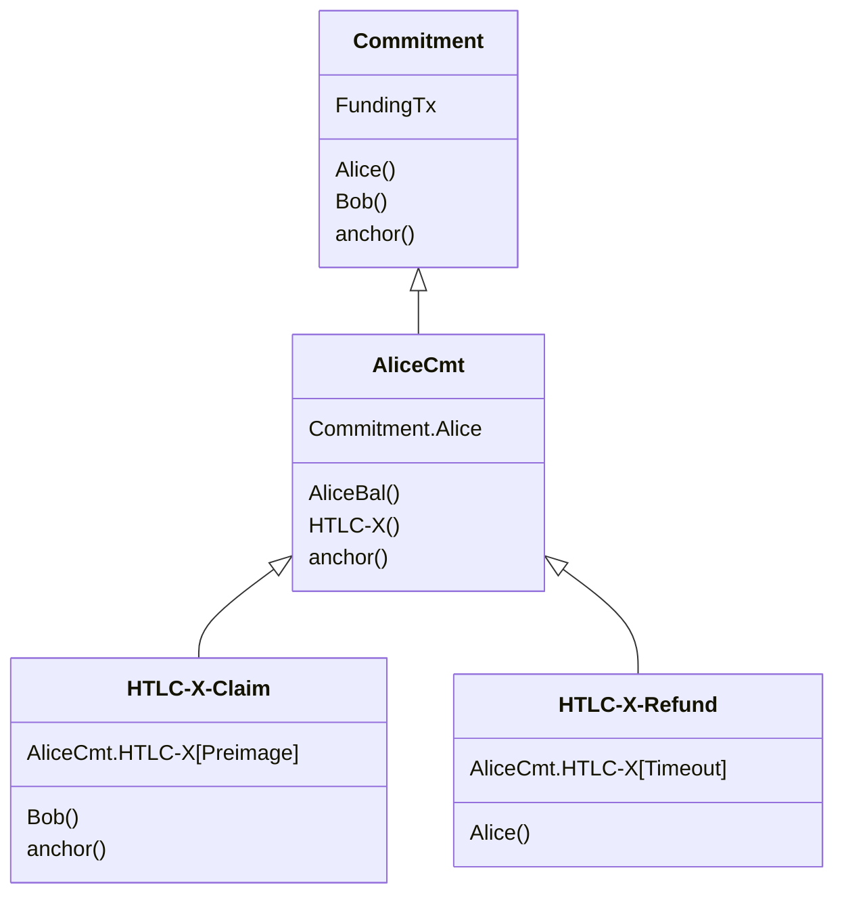

# Minimal signing flow changes for TRUC channels

morehouse | 2025-01-31 19:19:09 UTC | #1

To truly mitigate pinning against lightning channels, we need to force all commitment transactions and all preimage-claim transactions to use TRUC (see discussions [here](https://github.com/lightning/bolts/issues/1221#issuecomment-2621162542) and [here](https://delvingbitcoin.org/t/lightning-transactions-with-v3-and-ephemeral-anchors/418/12)).  @t-bast has outlined how we can do this for [commitment transactions](https://delvingbitcoin.org/t/lightning-transactions-with-v3-and-ephemeral-anchors/418), but some extra work is needed for preimage claims.

# Local commitment preimage claims

We already use presigned HTLC-Success transactions for this case.  The only change needed is to presign these transactions as v3.

# Remote commitment preimage claims

Currently these claims are not presigned, which means we currently can't force them to use TRUC.  We need to start presigning these claims as v3.

In order to presign these transactions, we need to exchange signatures for them during the commitment update flow.

## Adding a half round-trip

@t-bast has [suggested](https://github.com/lightning/bolts/issues/1221#issuecomment-2626983064) that we need to add half a round-trip to the protocol for this, similar to his draft protocol for [PTLCs](https://github.com/t-bast/lightning-docs/blob/398a1b78250f564f7c86a414810f7e87e5af23ba/taproot-updates.md#point-time-locked-contracts).  That would look something like this:

```
 Alice                      Bob
   |   commitment_proposed   |
   |------------------------>|
   |    commitment_signed    |
   |<------------------------|
   |     revoke_and_ack      |
   |------------------------>|
```

1. When Alice is ready to update her commitment transaction, she sends `commitment_proposed` with signatures for the HTLC-Remote-Success transactions Bob needs to claim HTLCs via preimage from Alice's new commitment transaction.
2. Bob sends the usual `commitment_signed` message with the HTLC-Success, HTLC-Timeout, and commitment signatures Alice needs to spend from her new commitment transaction.
3. Alice sends `revoke_and_ack` to revoke her previous commitment.

### Signing flow race

This change increases complexity due to a new race in the signing flow:

- Alice must now initiate the signing flow for her own commitment transaction by sending `commitment_proposed` with whatever HTLCs she has pending on her commitment.
- Bob may still be sending updates when he receives Alice's `commitment_proposed`.
- Thus when Bob receives Alice's `commitment_proposed` he doesn't immediately know which HTLCs need to be included in Alice's new commitment. Bob must check Alice's HTLC-Remote-Success signatures against every possible intermediate commitment transaction to figure out which one he should use for his `commitment_signed` message.

## Minimal alternative

AFAICT, we don't need to add a half round-trip or introduce a new message at all.  We can simply attach HTLC-Remote-Success signatures to the `revoke_and_ack` message:

```
 Alice                      Bob
   |    commitment_signed    |
   |<------------------------|
   |     revoke_and_ack      |
   |------------------------>|
```

1. When Bob is ready to update Alice's commitment transaction, he sends `commitment_signed` as usual.
2. Alice sends `revoke_and_ack` to revoke her previous commitment, while also sending signatures for Bob's HTLC-Remote-Success transactions.

At no point during this exchange are either Alice's nor Bob's funds at risk.

- **Before `commitment_signed`**: Alice and Bob both hold a single valid commitment transaction and all necessary HTLC transactions.
- **After `commitment_signed` but before `revoke_and_ack`**: Alice now holds a second valid commitment transaction, from which Bob cannot claim any HTLCs via preimage.  This is fine because the funds locked up in that HTLC are *Alice's*, not Bob's, and Alice can still recover those funds via HTLC-Timeout once the CLTV expires.  Since Bob wouldn't forward the HTLC anyway until he receives Alice's `revoke_and_ack` and subsequent `commitment_signed`, he has no risk of losing funds.
- **After `revoke_and_ack`**: Alice and Bob both hold a single valid commitment transaction and all necessary HTLC transactions.  Note that if Alice sends invalid HTLC-Remote-Success signatures, Bob can simply send an error and close the channel.

-------------------------

instagibbs | 2025-01-31 20:25:38 UTC | #2

So let's assume this new pattern is used, and now Bob confidently forwards that added HTLC.

After the next `commitment_signed` message from Bob to Alice, if Alice withholds the subsequent `revoke_and_ack`, cannot Alice just take that just-signed commitment transaction to chain and "take back" the committed HTLC Bob has forwarded once it times out?

I get turned around quite a bit in asymmetric channel states, but I feel like this is the same reasoning I wrote about PTLCs like two years ago? https://gist.github.com/instagibbs/1d02d0251640c250ceea1c66665ec163#rationale

-------------------------

morehouse | 2025-01-31 20:49:25 UTC | #3

Dang, you're right... Thanks for the sanity-check and sorry for the spam.

-------------------------

instagibbs | 2025-01-31 21:04:27 UTC | #4

Reminds me why I wasn't able to figure out a simple way to do what you're trying to do 2 years ago!

-------------------------

ajtowns | 2025-02-02 04:36:56 UTC | #5

I think you could solve this by hanging a HTLC commitment off of a balance output. ie, if you have a commitment `(Alice: 10k, Bob: 20k, HTLCs: X: 1k, Y: 4k)`, and want to add a new HTLC from Alice to Bob for 2k, then you do two things:

  * sign a new commitment `(Alice: 8k, Bob: 20k, HTLCs: X: 1k, Y: 4k, Z: 2k)`
  * sign a spend of Alice's balance from Alice's version of the old commitment tx to `(Alice: 8k, Z: 2k)`

After sending the above, if Alice closes the channel with the old commitment, Bob can claim HTLC Z via Alice's balance; or Bob can close the channel with the new commitment. If Bob closes the channel with the old commitment, that just automatically refunds HTLC Z to Alice with no action needed on Alice's behalf.

(That probably only works with something like [option-simplified-update](https://github.com/lightning/bolts/pull/867), as otherwise Bob may have had an update in flight when Alice sends the sigs for Z through, and if Alice closed the channel with that commitment, Z would not be claimable by Bob)

(Similar stuff discussed in [Oct 2021](https://web.archive.org/web/20231114193842/https://lists.linuxfoundation.org/pipermail/lightning-dev/2021-October/003278.html))

-------------------------

instagibbs | 2025-02-03 14:33:13 UTC | #6

Again may be turned around here, but I'm unclear how this helps with the specific problem.

Going back to the running scenario posed by @morehouse , Bob has already forwarded an incoming HTLC that is yet un-resolved. So what we're concerned about here is Alice's commitment transaction having a valid signature from Bob, but no way for Bob to claim the second stage HTLC-Success transaction (which would now have to be pre-signed for anti-pin reasons). How would adding a signature on an old commitment transaction resolve this? Alice can still immediately go to chain with the new commitment transaction that doesn't have a signed second-stage HTLC transaction, and now Bob has no way of resolving it in the success path.

-------------------------

ajtowns | 2025-02-04 05:58:35 UTC | #7

I think the approach in the Oct 2021 thread addressed this by having two parts to the commitment tx: an output containing Alice's balance and the HTLCs from Alice to Bob, and another with the same but for Bob. That way you have 0.5 RTT updates to either output, with signatures from just one party, without invalidating the signatures from the other party on the latest spend of the other output.

Note: when you want to update the underlying commitment (to reshuffle the balances once payments have succeeded), that still requires 1.5 round trips, but can be done in a quiet period, or just less frequently.

So the txs look like:



at which point you can have the preimage path for HTLC-X-Claim require both Alice's and Bob's signature and commit to being v3, but the refund path requires just Alice's signature and a timeout, and does not commit to being v3. If Bob updates BobCmt, that doesn't affect the signatures here, so that's fine.

(If these are for PTLCs instead of HTLCs, the claim tx needs to be signed by both Alice and Bob in order to force Bob to reveal the PTLC preimage, which was the original motivation for this setup)

-------------------------

instagibbs | 2025-02-04 13:01:14 UTC | #8

right I find it plausible that some version of what I recall being "fast forward" for PTLCs would also work for this purpose. Thanks for digging up the citations.

-------------------------

