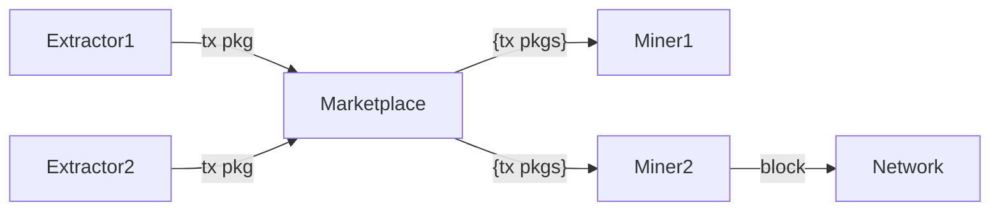

# Best-(Worst-)Case MEVil Response

MattCorallo | 2025-02-20 16:08:54 UTC | #1

Hi all,

@7d5x9 and I spent some time thinking about what the best we can do in response to a future where MEVil on Bitcoin proliferates and recently posted our results at [1]. Basically, we propose an extension of the PBS direction ethereum went down where instead of proposers proposing full block templates they only bid for individual (or group) transaction inclusion with constraints (like "I want to be the first transaction included which interacts with the DEX identifiable by transactions which include the string X"). This ensures that the public mempool continues to be a reliable way to get a transaction included (as miners would fill the their block from both the public mempool and any private orders), providing censorship resistance similar to today, while still allowing MEVil-extraction experts to pay miners for specific transaction inclusion.

We also propose that the marketplaces offer private transaction inclusion by either having miners trust the marketplaces or by using TEEs to "encrypt" transactions such that they can only be read after a valid block meeting the constraints has been found. Interestingly, this also allows users of MEV-exposed systems to submit their transactions directly to miners for inclusion, reducing their exposure to frontrunning and other MEV issues.

Obviously this design is highly centralizing compared to today's bitcoin, and a reasonable response might be "we should strive for a world where we don't need this garbage", but IMO we should be clear-eyed about what a bitcoin looks like if MEVil becomes a major part of the mining process, and build for that outcome just in case it comes to pass.

Let us know what you think.

[1] https://github.com/mevpool/mevpool/blob/0550f5d85e4023ff8ac7da5193973355b855bcc8/mevpool-marketplace.md

-------------------------

ajtowns | 2025-02-20 17:57:10 UTC | #2

> For example, a Marketplace would allow for bids in the form of “I’ll pay X to include transaction Y as long as it comes before any other transactions which interact with the smart contract identified by Z”.

I think a "bid" of that form would be unpleasant if passed all the way through to miners -- accepting the bid but still including transaction W that interacts with smart contract Z means (in general) modifying transaction W to spend an output of Y (or perhaps some child of Y), and potentially updating the witness data of W to deal with the difference in value of Y's output vs Z's output. To me, those seem like things that the "proposer" should be doing, rather than the "relay" or the "builder".

Would it be plausible to make the "mevpool marketplace" operate solely on packages of transactions, that is:

So that extractors who want their tx Y to be first monitor the mempool for other txs that interact with smart contract Z, setup a tx pkg that does that and submits it to the marketplace. Other extractors might submit competing packages, bidding fees up, and the marketplace sends the proposed packages to miners who build block templates, etc.

For sealed bids, I think you could reveal with utxos the package spends, the txids and wtids, and the total sigops, weight, and fee, and then either rely on trusting the marketplace to reveal the tx contents or a trusted execution environment in a similar way.

This assumes miners can do package RBF in a fairly optimal manner, and that we can add "sealed txs" to the mempool, but otherwise seems to keep things fairly simple on the miner/marketplace side.

Revealing the utxos that sealed txs are spending might be something of a give away to competitors, but seems unavoidable if you want miners to be building the block templates.

-------------------------

ariard | 2025-02-20 18:09:09 UTC | #3

Sorry, what is a MEVil exactly ?

"*Specifically, MEV which results in a financial incentive for miners to employ sophisticated technology in order to ensure the transactions they include in the next block have the maximal value is MEVil*”.

This is neither a definition in terms of structural aspects (e.g exploiting a base-layer policy mechanism against the interest of L2 counterparties), neither a quantitative premium in terms of block template efficiency construction and neither said what is "sophisticated technology" exactly. Is applying rigorously high school integral calculus to build your block template considered as “sophisticated technology” ?

"*We believe that these two issues can be addressed through the construction of a "mevpool marketplace" standard that takes the place of accelerator/private mempool services, applying PBS only for a narrow subset of transactions in a block. This enables the miner to remain the block "builder" while still allowing for end users or third-parties specialized in MEV extraction to directly bid for individual transaction inclusion. The Marketplaces will host order books containing bids with varying properties, including position within blocks, restrictions in relation to individual smart contracts, etc.*”

How can you be sure that you're receiving the block template in real-time from the marketplace operators, not even saying how do you verify builder's block templates have not been selectively marginally downgraded in terms of feerate by weight unit ?

No proposed seal-based solutions are realistic, for the 1st one the only dry escrow mechanism is (1) old school bank's letter of credits... and for cypherpunk trust-minized escrow (2) anything which is bitcoin-script based though any 2-phases commit protocol would have to fit in 2 transactions included in 2 blocks at least, so in 20 min in average to settle a dispute on the correctness of a data structure (i.e block-template) that can happen every 10 min in average in the worst-case.

For the 2nd one, running templating infrastructure in a thing like a TEE is the last thing I would do as in block templating it's a latency-race as anyone who has worked on BIP152 knows it. That's just so many more kernel context-switch due to enclave transisition that you're better off to re-design your own commitment attestation scheme to fit bitcoin block entropy structure and get native support on enclave HW...Good luck with that.

I do not disagree on the problem, and I do think it's an important problem.

However, I don't think the proposed solutions are improving the problem at all, or even worsen it.

-------------------------

MattCorallo | 2025-02-20 19:23:29 UTC | #4

[quote="ajtowns, post:2, topic:1465"]
I think a “bid” of that form would be unpleasant if passed all the way through to miners – accepting the bid but still including transaction W that interacts with smart contract Z means (in general) modifying transaction W to spend an output of Y (or perhaps some child of Y), and potentially updating the witness data of W to deal with the difference in value of Y’s output vs Z’s output.
[/quote]

Mmm, this is a good point, and I had mostly been thinking of this in the context of things like CSV (and CSV-based rollup) protocols, where this likely doesn't apply (at least if they're EVM-like). However,

[quote="ajtowns, post:2, topic:1465"]
Would it be plausible to make the “mevpool marketplace” operate solely on packages of transactions, that is:
[/quote]

Yea, sorry, somewhat shorthand here this is indeed how I've been thinking about bids. A proposer would be able to submit one or more transactions in a single bid, and indeed would be able to do what you describe here.

[quote="ajtowns, post:2, topic:1465"]
For sealed bids, I think you could reveal with utxos the package spends, the txids and wtids, and the total sigops, weight, and fee, and then either rely on trusting the marketplace to reveal the tx contents or a trusted execution environment in a similar way.
[/quote]

Yep, though you can pass this all the way through to miners just as well. Basically you'd move bids to always be "the full set of transactions which interact with a contract" rather than ever being a subset of them (for contracts that rely on state passed via UTXOs) and then you can send the whole tx bundle through to the miner's TEE (or, indeed, just reveal the metadata if you're using a trusted marketplace).

[quote="ajtowns, post:2, topic:1465"]
This assumes miners can do package RBF in a fairly optimal manner
[/quote]

Indeed, though luckily this is somewhat simplified in that the miner is required to only either include or not-include the whole package, they cant split it into parts. They just have to be able to compare that to their existing mempool, which is hard but if we're talking about a server-class processor with SGX you can throw some CPU at it and get close enough to optimal that I'm not worried :).

[quote="ajtowns, post:2, topic:1465"]
Revealing the utxos that sealed txs are spending might be something of a give away to competitors, but seems unavoidable if you want miners to be building the block templates.
[/quote]

This is part of the reason for the TEE - if we can take the whole block building logic and shove it in SGX, we can run it locally at the miner but also send it Sealed transaction (packages) which can be considered for the block template but won't be extractable (at least for reasonable cost).

-------------------------

7d5x9 | 2025-02-20 19:44:44 UTC | #5

Hello ariard, thank you for your comments.

> Sorry, what is a MEVil exactly ?

For some further specificity, please refer to the mevpool writeup linked in the OP:

> Instead of consensus-computable variables (fees, weight, sigops) being the sole data required for block templating, they become a subset. Miners would require in-house financial engineers capable of analyzing on-chain contracts and designing and deploying value extraction schemes.

You might also find further understanding by studying the MEV vectors available across the Ethereum ecosystem which are fairly well documented. But more generally you can think of MEVil, distinct from pure MEV (e.g. RBF), as transaction sequencing that relies on generalized financial sophistication (i.e. what you might find at a HFT firm with quants), domain-specific understandings of smart contracts on the Bitcoin blockchain, as well as access to significant liquidity to take advantage of MEVil opportunities.

> For the 2nd one, running templating infrastructure in a thing like a TEE is the last thing I would do as in block templating it’s a latency-race as anyone who has worked on BIP152 knows it.

Unlike Intel SGX, modern TEEs (e.g. TDX) are near-native guest performance so the latency issue described is negligible. There is some research available on this, an example of which you might find here: https://arxiv.org/html/2408.00443v1

> How can you be sure that you’re receiving the block template in real-time from the marketplace operators

Yes this is a significant hurdle to Proposal One, and thus in our opinion it is sub-optimal. That said, if the Marketplace's payout depend on the block being accepted by the network, you might assume the incentives are aligned to ensure quick delivery.

-------------------------

