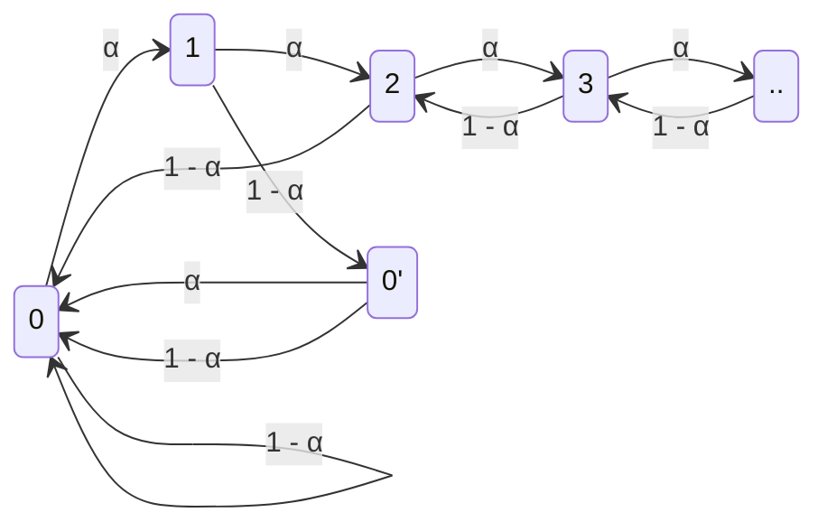

# Where does the 33.33% threshold for selfish mining come from?

AntoineP | 2025-06-05 20:26:39 UTC | #1

Clara Shikhelman and i went through the maths of the 2013 [research paper](https://arxiv.org/pdf/1311.0243) "Majority is not enough". Selfish mining is often ill-understood, and the paper goes quickly over some of the calculations. So i figured it would be helpful to post an explanation of the math so others (as well as my future self!) don't have to figure it out from scratch again.

## The Selfish Mining strategy

A selfish miner aims to contribute more blocks to the main chain than would be expected based on its share of the network’s total hashrate. To achieve this it will attempt to cause more stale blocks to its competition than to itself, by only opportunistically revealing the blocks it mines. Past a certain threshold of network hashrate controlled, this strategy will bring more revenue to a miner than always publishing its blocks as soon as they are found.

How low this threshold is depends on another parameter than its share of the network hashrate. This is the ability of the selfish miner to learn about a block found by another miner before all other miners, and to reach them before the other miner's block does. This ability allows a selfish miner to get some portion of the rest of miners to mine on its own block rather than a competing one in the event of a 1-block race. The higher this ability, the lower the hashrate threshold at which selfish mining becomes profitable.

However this ability is *not a requirement* for selfish mining to be profitable. Without it selfish mining becomes profitable for a miner controlling more than 1/3 of the network hashrate. In this post, we will only analyse this "worst case" scenario, that is all other miners will mine on top of the competing block and not the selfish miner's in the event of a 1-block race.

The selfish mining strategy (section 3.2 of the paper) is the following:
- Upon finding a block:
    - If we are in a 1-block race with the public chain, publish the conflicting block along with the newfound block;
    - Else do not publish the block, start mining on top of it.
- Upon another miner finding a block:
    - If we do not have any unpublished block, switch to mining on top of it;
    - Else if we have a single conflicting unpublished block, publish it and keep mining on top of our own block;
    - Else if we have two conflicting unpublished blocks, publish them both and keep mining on top of them;
    - Else (we have a conflicting chain of more than two blocks), publish our oldest block and keep mining on top of our private chain.

## Selfish Mining analysis

### State probabilities

To compute the expected revenue of this strategy, we need to first compute the probability associated with each of its states. We will analyze the state machine for a selfish miner with a proportion $\alpha$ of the network hashrate, as introduced in Fig. 1 in section 4 of the paper. Our version will be slightly simplified since here we always assume the worst case scenario for the selfish miner (i.e. it can never propagate its own block first in the event of a 1-block race, in the paper $\gamma = 0$).



Each state represents the lead of the selfish miner compared to the rest of the network. At state 0, the selfish miner mines on top of the same block as everyone else. At state 1, the selfish miner mines on top of a single unpublished block. At state 2, the selfish miner mines on top of two unpublished blocks. And so on. The selfish miner moves from State $n$ to state $n+1$ with probability $\alpha$. It may stay on State 0 upon the rest of the network finding a block (probability $1 - \alpha$). State 0' represents a 1-block race between the selfish miner and the rest of the network. It happens when the selfish miner had a one block lead and the rest of the network found a block. The race is resolved by either the selfish miner finding another block on top of its own (probability $\alpha$) or the rest of the network finding another block on top of the other one (probability $1 - \alpha$). In both cases the selfish miner then moves on to mining on top of the same block as the rest of the network.

The above state machine is a [Markov Chain](https://en.wikipedia.org/wiki/Markov_chain) with the following state transition matrix:
$$
P =
\begin{array}{c@{\hspace{2pt}}l}
   & \begin{array}{cccccc}
&&&&& \text{to:} &&& \\
    & \text{0'} && 0 && 1 && 2 && 3 & \cdots
   \end{array} \\
\begin{array}{cc}
  &\text{0'} \\
  &0 \\
  \text{from:}&1 \\
  &2 \\
  &3 \\
  &\vdots
\end{array}
&
\left(
\begin{array}{cccccc}
  0          & 1          & 0      & 0          & 0      & \cdots \\
  0          & 1 - \alpha & \alpha & 0          & 0      & \cdots \\
  1 - \alpha & 0          & 0      & \alpha     & 0      & \cdots \\
  0          & 1 - \alpha & 0      & 0          & \alpha & \cdots \\
  0          & 0          & 0      & 1 - \alpha & 0      & \cdots \\
  \vdots     & \vdots     & \vdots & \vdots     & \vdots & \ddots \\
\end{array}
\right)
\end{array}
$$

Because the above Markov Chain is aperiodic and irreducible we have that it has [stationary distribution](https://en.wikipedia.org/wiki/Discrete-time_Markov_chain#Stationary_distributions) $\begin{pmatrix} P_{0'} & P_{0} & P_{1} & P_{2} & P_{3} & \cdots \end{pmatrix}$ with:
$$
\begin{pmatrix} P_{0'} & P_{0} & P_{1} & P_{2} & P_{3} & \cdots \end{pmatrix}
*
\begin{pmatrix}
0          & 1          & 0      & 0          & 0      & 0      & \cdots \\
0          & 1 - \alpha & \alpha & 0          & 0      & 0      & \cdots \\
1 - \alpha & 0          & 0      & \alpha     & 0      & 0      & \cdots \\
0          & 1 - \alpha & 0      & 0          & \alpha & 0      & \cdots \\
0          & 0          & 0      & 1 - \alpha & 0      & \alpha & \cdots \\
\vdots     & \vdots     & \vdots & \vdots     & \vdots & \vdots & \ddots \\
\end{pmatrix}
=
\begin{pmatrix} P_{0'} & P_{0} & P_{1} & P_{2} & P_{3} & \cdots \end{pmatrix}
$$

From which we derive the following system of equations:
$$
\left\{
\begin{array}{ll}
P_{0'} = (1 - \alpha) P_{1} \\
P_0 = (1 - \alpha) P_0 + (1 - \alpha) P_2 + 1 P_{0'} \\
P_1 = \alpha P_0 \\
P_2 = \alpha P_1 + (1 - \alpha) P_3 \\
\end{array}
\right.
$$

From this system of equations we start by re-arranging the second equation: 
$$
\begin{align*}
P_0 &= P_0 - \alpha P_0 + (1 - \alpha) P_2 + P_{0'} \\
\implies 0 &= - \alpha P_0 + (1 - \alpha) P_2 + P_{0'}
\end{align*}
$$

This gives us $(0)$:
$$
P_{0'} = \alpha P_0 - (1 - \alpha) P_2
$$

And $(1)$:
$$
\alpha P_0 = P_{0'} + (1 - \alpha) P_2
$$

Re-arranging the first equation from the system above and substituting per $(0)$ and the third equation from the system we have:
$$
\begin{align*}
P_{0'} &= (1 - \alpha) P_1 \\ \implies
\alpha P_1 &= P_1 - P_{0'} \\ \implies
\alpha P_1 &= \alpha P_0 - \alpha P_0 + (1 - \alpha) P_2 \\ \implies
\alpha P_1 &= (1 - \alpha) P_2
\end{align*}
$$

Now starting from $(1)$ and substituting per the first equation we have:
$$
\alpha P_0 = P_{0'} + (1 - \alpha) P_2 \\ \implies
\alpha P_0 = (1 - \alpha) P_{1} + (1 - \alpha) P_2
$$

Therefore we have:
$$
\left\{
\begin{array}{ll}
\alpha P_0 = (1 - \alpha) P_{1} + (1 - \alpha) P_2 \\
P_{0'} = (1 - \alpha) P_{1} \\
\alpha P_1 = (1 - \alpha) P_2
\end{array}
\right.
$$

We have effectively derived the first three equations from the system of equations presented in section 4.1 of the paper.

The next two equations used in the calculation of state probabilities in the paper are $P_{0'} + \sum_{k=0}^\infty P_k = 1$ and $\forall k \ge 2: \alpha P_k = (1 - \alpha) P_{k+1}$. The former comes by definition as these are all the possible states and the latter can be proven by induction for $k \ge 1$:
- We have shown above that $\alpha P_1 = (1 - \alpha) P_2$. Therefore $P_k = (1 - \alpha) P_{k+1}$ is true for $k=1$ (base case).
- Now per the transition matrix $P$ above and stationary distribution property, $P_k = \alpha P_{k-1} + (1 - \alpha) P_{k+1}$. Assuming $\alpha P_{k-1} = (1 - \alpha) P_{k}$ (our induction hypothesis) we have $P_k = (1 - \alpha) P_{k} + (1 - \alpha) P_{k+1} \implies \alpha P_k = (1 - \alpha) P_{k+1}.$
- Therefore it holds that $\forall k \ge 1: \alpha P_k = (1 - \alpha) P_{k+1}$ (and of course $\forall k \ge 2: \alpha P_k = (1 - \alpha) P_{k+1}$ which we'll use below).

We have derived the five equations used in Appendix A of the paper to calculate the state probabilities $P_0$, $P_{0'}$, $P_1$, $\forall k \ge 2: P_k$.  Let's now go through the calculation in Appendix A step by step. The goal here is to express all state probabilities in terms of $\alpha$. This is achieved by first expressing $P_0$, $P_{0'}$, and $\forall k \ge 2: P_k$ in terms of $P_1$.

We start with the probability of $\forall k \ge 2: P_k$. We have that $\alpha P_k = (1 - \alpha) P_{k+1}$. Therefore $P_{k+1} = \frac{\alpha}{1-\alpha}P_k = \frac{\alpha}{1-\alpha}\frac{\alpha}{1-\alpha}P_{k-1} = (\prod_{i=2}^{k+1} \frac{\alpha}{1 - \alpha}) P_{1} = \frac{\alpha}{1 - \alpha}^{k} P_1$. Therefore we have:
$$
\forall k \ge 2: P_k = \frac{\alpha}{1 - \alpha}^{k-1} P_1
$$

Then (in an alternative manner to the one used in the paper) we can simply substitute the third equation in our system above in the first equation: $\alpha P_0 = (1 - \alpha) P_{1} + (1 - \alpha) P_2 \implies \alpha P_0 = (1 - \alpha) P_{1} + \alpha P_1 \implies \alpha P_0 = P_1$.

The next step is to express $P_{0'} + \sum_{k=0}^\infty P_k = 1$ in terms of $P_1$. We start by stripping the $k = 0$ case from the sum and using the property we just derived above for $k \ge 2$ (which is trivially true for $k = 1$) to get $P_{0'} + P_0 + \sum_{k=1}^\infty P_k = 1 \implies P_{0'} + P_0 + \sum_{k=1}^\infty (\frac{\alpha}{1 - \alpha}^{k-1} P_1) = 1$. From there we can substitute $P_{0'}$ from the first equation in the system above and $P_0$ using the property derived in the previous step. Therefore we have:
$$
(1 - \alpha) P_{1} + \frac{1}{\alpha} P_1 + \sum_{k=1}^\infty (\frac{\alpha}{1 - \alpha}^{k-1} P_1) = 1
$$

From this we can deduce the probability for every state. Let's start with $P_1$. Using the formula for geometric series and re-arranging:
$$
\begin{align*}
&(1 - \alpha) P_1 + \frac{P_1}{\alpha} + \frac{P_1}{1 - \frac{\alpha}{1 - \alpha}} &= 1 \\
\implies &P_1 (1 - \alpha + \frac{1}{\alpha} + \frac{1}{1 - \frac{\alpha}{1 - \alpha}}) &= 1 \\
\implies &P_1 (\frac{\alpha (1 - \alpha) + 1}{\alpha} + \frac{1}{1 - \frac{\alpha}{1 - \alpha}}) &= 1 \\
\implies &P_1 \frac{(\alpha (1 - \alpha) + 1) (1 - \frac{\alpha}{1 - \alpha}) + \alpha}{\alpha (1 - \frac{\alpha}{1 - \alpha})} &= 1 \\
\implies &P_1 \frac{\alpha (1 - \alpha) - \frac{\alpha^2 (1 - \alpha)}{1 - \alpha} + 1 - \frac{\alpha}{1 - \alpha} + \alpha}{\frac{-2 \alpha^2 + \alpha}{1 - \alpha}} &= 1 \\
\implies &P_1 \frac{-2 \alpha^2 + \frac{\alpha - 2 \alpha^2}{1 - \alpha} + 1}{\frac{-2 \alpha^2 + \alpha}{1 - \alpha}} &= 1 \\
\implies &P_1 \frac{-2 \alpha^2 + 2 \alpha^3 + \alpha - 2 \alpha^2 + 1}{-2 \alpha^2 + \alpha} &= 1 \\
\implies &P_1 = \frac{-2 \alpha^2 + \alpha}{2 \alpha^3 -4 \alpha^2 + 1}
\end{align*}
$$

Now for $P_0$ we can simply substitute:
$$
\begin{align*}
P_0 &= \frac{P_1}{\alpha} \\
\implies P_0 &= \frac{-2 \alpha^2 + \alpha}{2 \alpha^4 -4 \alpha^3 + \alpha}
\end{align*}
$$

Similarly for $P_{0'}$:
$$
\begin{align*}
P_{0'} &= (1 - \alpha) P_1 \\
\implies P_{0'} &= \frac{2 \alpha^3 - 3 \alpha^2 + \alpha}{2 \alpha^3 -4 \alpha^2 + 1}
\end{align*}
$$

This concludes our analysis of the state probabilities. We have:
$$
\left\{
\begin{array}{ll}
P_{0'} &= \frac{2 \alpha^3 - 3 \alpha^2 + \alpha}{2 \alpha^3 -4 \alpha^2 + 1} \\
P_0 &= \frac{-2 \alpha^2 + \alpha}{2 \alpha^4 -4 \alpha^3 + \alpha} \\
P_1 &= \frac{-2 \alpha^2 + \alpha}{2 \alpha^3 -4 \alpha^2 + 1} \\
\forall k \ge 2: P_k &= \frac{\alpha}{1 - \alpha}^{k-1} \frac{-2 \alpha^2 + \alpha}{2 \alpha^3 -4 \alpha^2 + 1} \\
\end{array}
\right.
$$

### Expected revenue

Let's now move on to section 4.2 of the paper, which analyzes the revenue of a selfish miner. This can be analyzed by looking at the proportion of blocks included in the best chain found by the selfish miner. To this end the paper defines $r_{pool}$, the proportion of blocks found by the selfish miner, and $r_{others}$, the proportion of blocks found by the rest of the network. Note that because of the high rate of stale blocks, $r_{pool} + r_{others}$ is well below $1$. Due to the difficulty adjustment (which disregards stale blocks), the revenue of the selfish miner are therefore $R = \frac{r_{pool}}{r_{pool} + r_{others}}$.

Let's express $r_{pool}$ and $r_{others}$ in terms of the state probabilities we derived in the previous section. Note we are still using the $\gamma = 0$ simplification compared to section 4.2 of the paper, i.e. in state $0'$ no other miner mine on top of the selfish miner's block.

In our model the states in which a selfish miner gets one (or more) block(s) in the best chain are:
- In state $0'$ when it wins the race, both the block that is being raced for and the block found on top of it will be included in the best chain (i.e. reward of 2 blocks);
- In state $2$ when the rest of the network finds a block, the selfish miner will get both its block included in the best chain (i.e. reward of 2 blocks);
- In state $i \ge 3$ when the rest of the network finds a block (i.e. is catching up to the selfish miner's longer private chain), the selfish miner broadcast one of its block that is guaranteed to be included in the best chain (i.e. reward of 1 block) eventually when the last two blocks are broadcast in state $2$.

Therefore we have:
$$
r_{pool} = 2 P_{0'} \alpha + 2 P_{2} (1 - \alpha) + 1 P_{i \gt 2} (1 - \alpha) 
$$

Similarly the rest of the miners get one (or more) block(s) in the best chain in the following scenarii:
- In state $0'$ when they win the race, both the block that is being raced for and the block found on top of it are included in the best chain (i.e. reward of 2 blocks);
- In state $0$ when they find a block it will be included in the best chain as the selfish miner switches to mining on top of it (i.e. reward of 1 block).

Therefore we have:
$$
r_{others} = 2 P_{0'} (1 - \alpha) + P_0 (1 - \alpha)
$$

### Profitability

It becomes (eventually) profitable for a miner to follow the selfish mining strategy when the proportion of blocks it finds $R$ is greater than the proportion of network hashrate it controls $\alpha$. We can verify the findings discussed in section 4.4 of the paper by solving this inequality using the equations from the previous section:
$$
R > \alpha \\
\implies \frac{r_{pool}}{r_{pool} + r_{others}} > \alpha \\
$$

We can express $r_{pool}$ and $r_{others}$ in terms of $\alpha$ using the state probabilities we derived previously.

$$
\begin{align*}
r_{others} &= 2 P_{0'} (1 - \alpha) + P_0 (1 - \alpha) \\
&= 2 P_1 (1 - \alpha)^2 + \frac{P_1}{\alpha} (1 - \alpha) \\
&= P_1 (1 - \alpha) (2 (1 - \alpha) + \frac{1}{\alpha})
\end{align*}
$$

$$
\begin{align*}
r_{pool} &= 2 P_{0'} \alpha + 2 P_{2} (1 - \alpha) + 1 P_{i \gt 2} (1 - \alpha) \\
&= 2 P_1 (1 - \alpha) \alpha + 2 \frac{\alpha}{1 - \alpha} P_1 (1 - \alpha) + \sum_{i = 3}^\infty \frac{\alpha}{1 - \alpha}^{i-1} P_1 (1 - \alpha) \\
&= 2 P_1 (1 - \alpha) \alpha + 2 P_1 \alpha + (\frac{1}{1 - \frac{\alpha}{1 - \alpha}} - \frac{\alpha}{1 - \alpha}^{0} - \frac{\alpha}{1 - \alpha}^1) P_1 (1 - \alpha) \\
&= 2 P_1 (1 - \alpha) \alpha + 2 P_1 \alpha + (\frac{1}{1 - \frac{\alpha}{1 - \alpha}} - 1 - \frac{\alpha}{1 - \alpha}) P_1 (1 - \alpha) \\
&= 2 P_1 (1 - \alpha) \alpha + 2 P_1 \alpha + \frac{\alpha^2}{(1 - \alpha) (1 - 2 \alpha)} P_1 (1 - \alpha) \\
&= P_1 \alpha (2 (1 - \alpha) + \frac{\alpha}{(1 - 2 \alpha)} + 2)
\end{align*}
$$

Substituting in the equation we get:
$$
\begin{align*}
&\frac{P_1 \alpha (2 (1 - \alpha) + \frac{\alpha}{(1 - 2 \alpha)} + 2)
}{P_1 \alpha (2 (1 - \alpha) + \frac{\alpha}{(1 - 2 \alpha)} + 2)
 + P_1 (1 - \alpha) (2 (1 - \alpha) + \frac{1}{\alpha})} &> \alpha \\
\implies &\frac{\alpha (2 (1 - \alpha) + \frac{\alpha}{(1 - 2 \alpha)} + 2)}{\alpha (2 (1 - \alpha) + \frac{\alpha}{(1 - 2 \alpha)} + 2) + (1 - \alpha) (2 (1 - \alpha) + \frac{1}{\alpha})} &> \alpha
\end{align*}
$$

Plugging it [into WolframAlpha](https://www.wolframalpha.com/input?i2d=true&i=+Divide%5Bx%5C%2840%292%5C%2840%291-x%5C%2841%29%2B+Divide%5Bx%2C%5C%2840%291-2x%5C%2841%29%5D%2B2%5C%2841%29%2Cx%5C%2840%292%5C%2840%291-x%5C%2841%29%2B+Divide%5Bx%2C%5C%2840%291-2x%5C%2841%29%5D%2B2%5C%2841%29%2B+%5C%2840%291-x%5C%2841%29%5C%2840%292%5C%2840%291-x%5C%2841%29+%2B+Divide%5B1%2Cx%5D%5C%2841%29%5D++%3E+x) gives us:
$$
\alpha > \frac{1}{3}
$$

The proportion of controlled network hashrate above which adopting the selfish mining strategy becomes profitable is $1/3$. That is the worst case scenario for a selfish miner, i.e. the selfish miner can never get any portion of the rest of the network to mine on top of its own block in the event of a 1-block race.

## Selfish mining simulation

Besides, i have implemented a simple-yet-realistic simulation of the Bitcoin mining process. The simulation advances time by steps of 1ms, samples the next block interval from an exponential distribution and picks which miner found it depending on its share of network hashrate controlled. The simulation takes into account (simplified) block propagation: each miner has a setting for how long it takes before all the other miners see a block it broadcast.

I have implemented the worst-case Selfish Mining strategy ($\gamma = 0$) in this simulation. The result from running the simulation with various sets of miners with different hashrates confirms the finding of the paper that past a certain hashrate threshold it is more profitable for a miner to adopt the Selfish Mining strategy regardless of the $\gamma$ parameter. However in my simulation i have this parameter between 36% and 37%. It should also not be overlooked that adopting this strategy would incur significant cost to the selfish miner in the short run which it would only make up for after the difficulty adjusts, which the simulation does not model.

You can try for yourself here:
https://github.com/darosior/miningsimulation

Here is an example result with 5 miners after 100 days:
```
After 8640000s (100d) and 9806 blocks found:
  - Miner 0 (10% of network hashrate) found 872 blocks i.e. 8.89251% of blocks. Stale rate: 64.6789%.
  - Miner 1 (15% of network hashrate) found 1333 blocks i.e. 13.5937% of blocks. Stale rate: 67.2918%.
  - Miner 2 (15% of network hashrate) found 1281 blocks i.e. 13.0634% of blocks. Stale rate: 64.5589%.
  - Miner 3 (20% of network hashrate) found 1725 blocks i.e. 17.5913% of blocks. Stale rate: 72.058%.
  - Miner 4 (40% of network hashrate) found 4595 blocks i.e. 46.8591% of blocks. Stale rate: 25.3972%. ('selfish mining' strategy)
```

## Credits

Thanks to @ClaraShk for going over the math in the paper with me, explaining me some of the calculations in more details, and for giving me feedback on this post. (Any remaining mistake mine, of course.)

-------------------------

zawy | 2025-06-28 12:01:51 UTC | #2

I have a simpler way of explaining the 33.33% (it can be even less under certain circumstances). The reason is that you can't get a secure consensus with 51% hashrate (a simple majority) and instead have to rely on the more common 66.67% majority if the following conditions aren't met:

1. Honest clocks are synchronized to a fraction of the consensus round.
2. Timestamps from 1) are on all consensus messages.
3. All messages are digitally-signed.

Most consensus schemes don't have digitally-signed messages (Bitcoin's costly hashes serve that function) so they have to rely on 67%.  Bitcoin fails 1 and 2 by allowing timestamps far in the past and far into the future, much further than a consensus round which is 1 block time. If timestamps were required to be within a reasonable +/- 5 seconds plus a 2 second propagation delay (or else the block gets put in "timeout" for 1 block time to enable PoW to override the timeout if a network partition occurs) then there can't be a profitable selfish mine because selfish miners have to assign a timestamp before they know when they will need to release the block(s) to the public. 

\> 33.33% can thwart consensus when they can either lie / err about the message a peer sent or lie / err about when it sent a message.

-------------------------

ajtowns | 2025-07-02 16:16:16 UTC | #3

[quote="zawy, post:2, topic:1757"]
If timestamps were required to be within a reasonable +/- 5 seconds plus a 2 second propagation delay (or else the block gets put in “timeout” for 1 block time to enable PoW to override the timeout if a network partition occurs) then there can’t be a profitable selfish mine
[/quote]

Rather than putting blocks in a ten minute timeout, would it be effective to treat "reasonable" timestamps with higher priority -- so that anytime we see a block with a "reasonable" timestamp, we request its full data and re-announce it, even if it's only equal-work to our current tip, and if it's equal-work and reasonable but our current tip had an "unreasonable" timestamp, we switch our tip to the other block, even though we heard about the other block slightly later?

"Reasonable" could mean `abs(now() - header.nTime) < 10s && (more_work_than_tip || abs(tiptime - header.nTime) < 10s)` where now is our current system time, and tiptime is our system time when we received the header for our current tip, that this new block would potentially replace.

-------------------------

zawy | 2025-07-02 17:18:14 UTC | #4

A timestamp that is too far into the future (compared to arrival time) is provably not an honest (correctly-functioning) node and needs to be rejected more strongly, possibly permanently unless the receiving node discovers his clock was wrong.  Unreasonably long in the past is assuming there's not large propagation delay so it must go into a timeout in case there was a real delay. PoW eventually discover which partition has the highest hashrate.  If applying your idea in the case of old timestamps, then a new block with a good timestamp that comes in will be working on top of the bad timestamp just like you unless there is a real network delay.  This allows the normal selfish mining if there's not a real network delay because the miner could be withholding the block to get a "head start" on it.  And if there's a real partition, it's not clear to me that you should switch.

-------------------------

zawy | 2025-07-06 22:40:48 UTC | #5

Large pools using Fibre for better connectivity is a weak form of selfish mining.  Fibre miners aren't withholding blocks intentionally to get an extra second of mining, but that's the net effect.  They get of 1/600 excess profit from the remaining 20% of the network (0.2 * 1/600 = 0.03% excess profit)

I'm curious if they're "accidentally" increasing the delay, or if Fibre miners are delaying their release of blocks to each other. This has no net effect relative to each other, but extracts rewards and fees from the non-Fibre miners. If a Fibre miner finds a block, then it's ~1 second before the hashrate-weighted non-Fibre miner sees it. Conversely, if a non-Fibre miner finds a blocks then it might be ~1 second before the Fibre network sees it.  So Fibre miners have 2 seconds before they need to release a block (even to to each other) to give them a head start on the non-Fibre miners.  And there's another second before the non-Fibre miners can mine on top of that cheat, a total of 3 seconds , so if non-Fibre is 20% of the hashrate, they could lose 0.2 * 3 / 600 = 0.1% of the rewards to Fibre miners.

I can look at the stale block rate to determine if someone's cheating:

stale_rate =~ 1 - e^(-Delay/600) 

Sale blocks are occurring [1 per 1784 blocks](https://fork.observer/) (22 in past 39,240 blocks, 9 months). This is a minimum due to some not getting relayed enough to get seen. I found 3 more in the 1st half of that timespan [here](https://github.com/bitcoin-data/stale-blocks/blob/abee96d45926707e77aeb03929125b519cad83a6/stale-blocks.csv) and it indicates my timespan needs to increase to 39,832. So let's guess the 2nd server would have found 3 more in the 2nd half and that those 2 servers are missing 10%, so there were about 31 stale blocks in 40,000 (0.0775%) or 1 per 1,290 blocks.

Rearranging my equation above and using e^(-x) =~ 1-x for small x, the delay is about 600 * 31 / 40,000  = 465 ms. From an old paper, this value is between the median and mean, and not far from them.

Grok tells me 80% of the hashrate is on Fibre and that Fibre's hashrate-weighted delay is 50 ms. It says the hashrate-weighted delay for the non-Fibre part is ~ 1 second.  To see if this matches with the observed delay from the stale rate.

0.8 * 50 + 0.2 * 1,000 = 240 ms  

stale_rate = 0.240 / 600 = 1 per 2,500 blocks

So from the data I have, we're seeing almost 2x the stale blocks we should be. Fibre miners could be delaying release of their block 200 ms to get a very minor profit ontop of the 0.03%.  If they were doing a real attack and delaying 2 seconds (when the parent block came from a Fibre miner), stale blocks would occur once every 333 blocks.

But instead of claiming they are delaying 200 ms, I'll be generous to Fibre and assume it has a 100 ms delay and that the non-Fibre delay is 1.5 s (this latter delay being the main thing). At these extremes, we should have seen 1 stale block in 1,580.  Also, let's say there were only the 25 stale blocks we directly observed (instead of my "statistical" estimate of 31) in the past 39,832 blocks. This give close agreement of 1 in 1,593.

-------------------------

sipa | 2025-07-07 03:03:18 UTC | #6

FIBRE shut down somewhere in 2020-2021, I believe.

-------------------------

zawy | 2025-07-07 09:10:26 UTC | #7

Grok really had me going. Now it says I can replace "Fibre" with "Fibre-like" and not change a thing.

-------------------------

