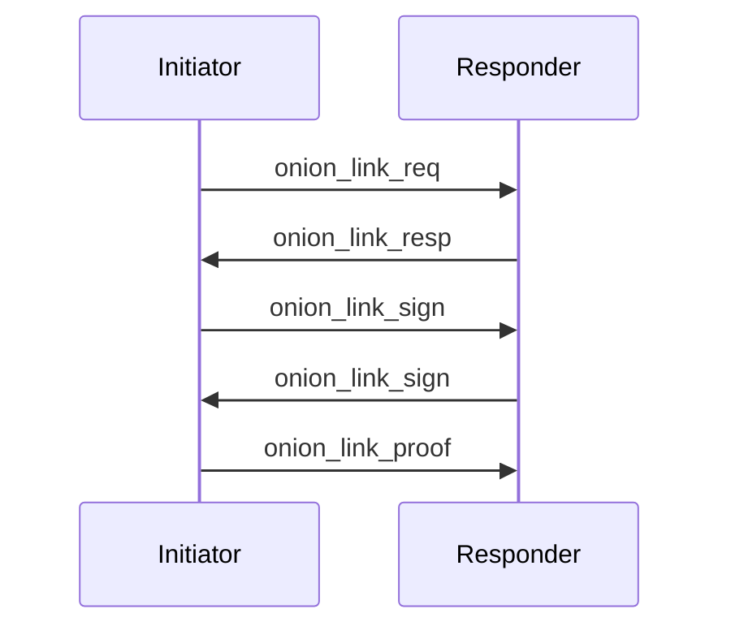

# Reimagining Onion Messages as an Overlay Layer

roasbeef | 2025-06-28 01:56:34 UTC | #1

# Reimagining Onion Messages as an Overlay Layer

## Introduction

Onion messaging as currently specified and deployed _embeds_ the onion
messaging graph into the channel graph. This tight
coupling between the onion messaging graph and the channel graph is a poor
design choice as it: necessitates a slow and brittle all-or-nothing adoption
path, forces an unnecessarily large onion messaging graph diameter,
intermingles distinct networking quality of service concerns, and misses an
opportunity to support native key management.

In this post we explore a deployment that addresses all of the drawbacks
mentioned above, we propose an alternative development path that instead
instantiates onion messaging as an _overlay layer_, bootstrapped using the
LN gossip layer. Compared to the embedded onion message networking of today,
the onion messaging overlay layer promotes rapid incremental deployment,
separates concerns, and may increase reliability and reach ability due to the
dynamic nature of the overlay topology.

## Motivation

The current onion messaging deployment path takes an all or nothing approach:
onion messaging links can only be created via established channels links. Any
sent onion messages therefore must flow over the exact same graph topology as
the channel graph. This tight coupling is fragile, as if a single node across a
prospective onion messaging path opts to not support the protocol, then
messages can't be transmitted. For presentation layer use cases like BOLT 12,
this forces clients to frequently fall back to directly connecting to the
message recipient (or penultimate node). This inevitable fall back sacrifices
privacy, and also damages the UX, as retries and re connections can significantly
delay the time to even first _payment attempt_.

Additionally, the all-or-nothing approach has slowed down deployment timelines,
as until nearly 100% of the nodes on the network support, clients must be
prepared to fall back direct connecting to the receiver. As new onion messaging
links can only be created by piggybacking on existing channels, the evolution
of the onion messaging ground is hampered, as its bound to the block creation
rate, and confirmation periods.

As a decentralized payment network, in ideal conditions, payment latency on the
Lightning Network is a function of the network diameter. A longer path length
requires more cumulative iterative round trips between successive peers, which
increase payment latency. By bolting the onion messaging graph onto the channel
graph, we force the onion messaging graph to operate a graph of larger diameter
than the solution necessitates. If onion messaging were instead an overlay
layer, a more compact messaging graph would emerge. Reducing the amount of
nodes that a BOLT 12 payment request must travel over, serves to reduce the
aggregate latency of the payment experience. Compared to the existing BOLT 11
flow, which permits a user to immediately carry out a payment, BOLT 12 incurs a
cumulative round trip latency over an unreliable messaging system over the
entire path (stalled message delivery attempts may also further hamper UX).
Enabling such invoice requests to travel over a smaller graph diameter can help
to reduce the UX penalty BOLT 12 adoption.

Current deployments of onion messaging re-use the node identified key of a
given peer typically intended for onion payments, in the onion messaging
domain. The lack of domain separation couples concerns, and overloads the onion
payment key. Additionally, as the BOLT protocol doesn't yet support a global
node identity rotation protocol, all onion messages effectively utilize a
static key. This lack of a key rotation mechanism serves to degrade the privacy
of onion messages overtime, due to lack of forward secrecy.

Due to the embedded nature of the current deployment, onion messages travel
over the same TCP connection between peers as gossip messages and channel
updates. By maintaining this tight coupling, the current deployment path isn't
able to independently address quality of service concerns. Due to head-of-line
blocking in TCP, any active gossip or channel update messages that remain
unacked in the TCP window (or even an outbound application queue) will
necessarily _block_ the processing of onion messages. This unnecessarily
blocking once again hurts the payment experience, as it leads to increase
latency of the time-to-payment-attempt.

As we'll see below, A deployment of onion messaging that instead utilizes an
overlay addresses all of the shortcomings described above. The onion overlay
layer separates concerns, promotes rapid deployment and experimentation, paves
a way to key rotation, and results in a smaller diameter graph. Importantly the
creation and processing of onion messages remains unchanged.

## Proposal

Instead of the current embedded approach, we instead propose an alternative
(can even be concurrent!) onion messaging overlay. The overlay utilizes the
existing LN gossip network and long-term node identity keys to boostrap a
distinct onion messaging overlay.

Onion messaging on the network won't require all 12k+ public nodes to function,
instead we'd be able to get by with even just 1% of the amount of nodes.

Beyond the immediate deployment advantages, the overlay architecture enables
rapid experimentation with onion messaging primitives beyond
BOLT 12. Examples of such proposals include: the addition of a payment level ACK to give immediate feedback to path finding iterations, and also safe retryable (stuckless) payments that rely on transmitting an extra preimage from sender to receiver.  These experiments can proceed in parallel w/o affecting the broader payment network, as early adopters can iterate on protocol designs, taking advantage of the swifter deployment path of the overlay network. 

### Connection Establishment

An existing active BOLT 9 connection is used to establish a new onion messaging
link. As we'll see below, link establishment produces a 3rd verifiable musig2
signature to prevent connection spoofing (claiming an onion messaging
connection exists when one doesn't).

#### `onion_link_req`

The `onion_link_req` message is a pure TLV message that's sent from one peer to
another to request the establishment of a new onion messaging link. It carries
the sender's current `onion_key`, and an `onion_nonce` to use in the `musig2`
signature.

**Message Type**: `???`

##### TLV Fields

| Field | Type | Length | Description |
|-------|------|--------|-------------|
| `onion_key` | 1 | 33 | The sender's onion public key used for establishing the onion messaging link |
| `onion_nonce` | 3 | 66 | The sender's MuSig2 nonce for the link establishment signature |

#### `onion_link_resp`

This message is sent in response to an `onion_link_req` message. It includes
identical field, but this time instead for the responded.

**Message Type**: `???`

##### TLV Fields

| Field | Type | Length | Description |
|-------|------|--------|-------------|
| `onion_key` | 1 | 33 | The responder's onion public key used for establishing the onion messaging link |
| `onion_nonce` | 3 | 66 | The responder's MuSig2 nonce for the link establishment signature |

#### `onion_link_sign`

With the `onion_key` of both initiator and responded known, the initiator can
now generate the `musig2` partial signature that comprises of half the
`onion_link_proof`.

At this point, we assume that both initiator and responded already know the
long-term `node_identity` of each other. The generated signature will be
created using an aggregated public key of the set of `onion_key` and
`node_identity` key for both parties.

`aggregate_onion_proof_key = musig2_key_agg(onion_key_1, onion_key_2, node_key_1, node_key_2)`

**Message Type**: `???`

##### TLV Fields

| Field | Type | Length | Description |
|-------|------|--------|-------------|
| `onion_proof_partial_sig` | 5 | 32 | The initiator's MuSig2 partial signature for the onion link establishment |

Upon receipt, the responder:
  * Re derives the `aggregate_onion_proof_key`
  * Verifies the `onion_proof_partial_sig` from the sender
  * Generates its own `onion_proof_partial_sig`
  * Proceeds to construct the `onion_link_proof` message`

#### `onion_link_proof`

A proof of mutual agreement to establish an onion messaging link between two
nodes. This serves to allow 3rd party nodes to verify that an advertised
connection actually exists.

The initiator constructs this message, and sends to the responded.

##### TLV Fields

| Field | Type | Length | Description |
|-------|------|--------|-------------|
| `onion_key_1` | 7 | 33 | The initiator's onion public key |
| `onion_key_2` | 9 | 33 | The responder's onion public key |
| `node_key_1` | 11 | 33 | The initiator's node identity public key |
| `node_key_2` | 13 | 33 | The responder's node identity public key |
| `onion_link_sig` | 15 | 64 | The complete MuSig2 signature proving mutual agreement to establish the link |

Once the both parties have the `onion_link_proof` message, they'll create a new
TCP connection that uses a distinct port, using their the new `onion_key` pair
to establish the encrypted p2p connection.

### Onion Link Discovery

Now onto onion link discovery. As mentioned, node the existing LN gossip
network is used to bootstrap the new onion overlay network.

#### `node_announcement` Extension

A new TLV field is added to the existing `node_announcement` message. This
field contains a series of repeated `onion_link_proof` messages. In aggregate
his new field can be seen as an authenticated agency list, that can be used to
build up the latest view of the onion overlay network.

#### New TLV Field

| Field | Type | Length | Description |
|-------|------|--------|-------------|
| `onion_link_proofs` | 17 | variable | A list of onion link proofs for this node |

#### Nested `onion_link_proofs` 

The value of this TLV field contains:

| Field | Length | Description |
|-------|--------|-------------|
| `num_proofs` | 2 | The number of onion link proofs that follow |
| `proofs` | variable | `num_proofs` encoded `onion_link_proof` structures |

### Onion Graph Assembly

To construct the onion graph, a node syncs the LN graph as normal. They then
filter through all the nodes that advertise the onion messaging feature bit
(likely a new one is used for the overlay variant), verify all the
`onion_link_proofs`, then reconstruct the current onion message graph from the
authenticated adjacency list.

### Routine Operation

After boostrap, onion messaging functions pretty much as normal. Each member of
the overlay network has an authenticated mapping between a node's long term
identity key, and their latest ephemeral onion key. Using either, they can
perform path finding as normal to send and receive messages (blinded paths is
utilized as normal).

To rotate an onion public key, nodes can simply restart the flow to obtain a
new `onion_link_proof`, then advertise that once again in the network. Rotating
`node_key` pairs also necessitates reconnecting with a fresh BOLT 8 brontide
handshake.

## Interoperability with Existing Infrastructure

The proposal as described above doesn't disrupt the existing embedded onion message deployment. Instead, the embedded and overlay messagign networks can actually _co exist_. Nodes can simultaneously maintain connections to both the embedded messaging network and the overlay network, treating them as complementary transport mechanisms. 

The onion packet construction remains identical regardless of the underlying transport. As a result, any existing deployed applications that use onion messaging can seamless utilize both the overlay and embedded network. The overlay network can be more rapidly deployed and utilized, while also avoiding fragmentation which may hamper the primary use cases. 

## Conclusion 

In this post, we've proposed an alternative (and even parallel!) deployment of onion messaging. As an overlay, the onion messaging network can be decoupled from the existing channel graph. With as few as 100 nodes using this overlay, higher level applications using onion messaging can immediately begin to seamlessly utilize this new overlay, which allows application developers to hone in on the last 20% of work to truly polish user experience. The overlay approach supports loosely synchronized deployment, which embraces permissionless innovation and rapid experimentation.

-------------------------

shocknet_justin | 2025-06-28 18:12:18 UTC | #2

I'm disheartened to see mental cycles as valuable as yours Mr. Beef being used on something like this, onion messages are a terrible thing and beyond saving. 

[As I have long warned and been vindicated](https://stacker.news/items/730371/r/justin_shocknet?commentId=731289), each hop inherently increases latency and failure probability. This makes OM's unfit for communication in areas where high reliability and performance are paramount, like payments. Bolt12 has no future because of this. 

Anyone who has used Tor can attest to the fact there is no production value to OM's. To the extent OM's work on Lightning even conceptually is due only to the nature of the network being a defacto bonding apparatus, any further decoupling from that can only make reliability worse. 

Now, Lightning would absolutely benefit from a better overlay network for communication, but that is almost unanimously Nostr. Concerns are properly separated, web comportability allows deprecation of things like LNURL, and identity can be either leveraged trivially or entirely de-coupled based on the use-case. 

Better protocols like we're developing with [CLINK](https://clinkme.dev) solve the node-to-app coordination problem without the unreliable p2p topology. The preceding link demonstrates Nostr static payment offers that retrieve bolt11 invoices from a simple static web page without wasm, and there are also specs for the reverse flow (debits) and a draft for remote management of static offers (app manages offers on a remote node).

-------------------------

MattCorallo | 2025-06-30 12:41:34 UTC | #3

The reason the onion messages go over channel links is there's an inherint anti-DoS protection to using your existing channel partners to accept onion messages for forwarding. What your proposal appears to be missing is a way to handle DoS/onion message peer selection in a useful way.

[quote="roasbeef, post:1, topic:1799"]
Due to the embedded nature of the current deployment, onion messages travel over the same TCP connection between peers as gossip messages and channel updates. By maintaining this tight coupling, the current deployment path isn’t able to independently address quality of service concerns. Due to head-of-line blocking in TCP, any active gossip or channel update messages that remain unacked in the TCP window (or even an outbound application queue) will necessarily *block* the processing of onion messages. This unnecessarily blocking once again hurts the payment experience, as it leads to increase latency of the time-to-payment-attempt.
[/quote]

There's nothing in the spec that mandates this. It is how its implemented in most clients, today, indeed, but AFAIK all such clients have active queue management to address the QoS concerns. Future implementations that have issues here can, of course, establish parallel TCP connections to forward onion messages over, as you noted in your QUIC exploration.

-------------------------

