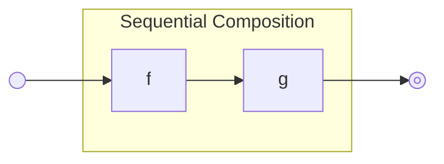
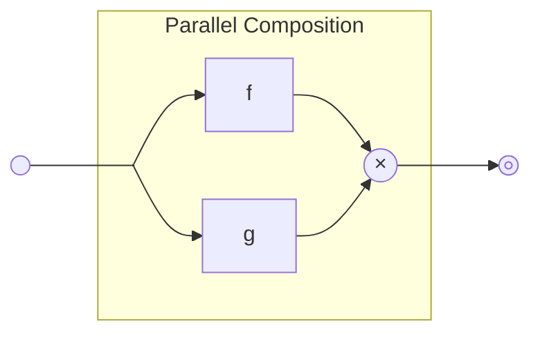
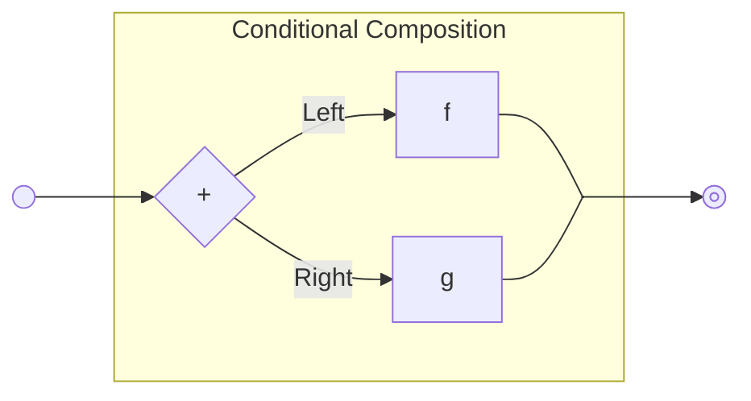

# Delving Simplicity Part Ⅰ: Three Fundamental Ways of Combining Computations

roconnor-blockstream | 2025-08-05 14:41:08 UTC | #1

# Series Introduction

Now that Simplicity has been activated on the Liquid Network, I’d like to do an in-depth dive into the philosophy and design of the Simplicity language.

Bitcoin’s transaction validation is a significantly different application from regular programming language design. Block space cost is at a premium so programs need to be compact. The programs in Bitcoin transactions are only ever executed on a single input and everyone executes the program on the same input. Also, the agent authorizing the transaction already knows the outcome of the computation in advance: that the transaction is valid.

Typically the authorizing agent will run much more expensive computations to derive witness data attesting to the transaction’s validity, whereas programs run on the blockchain need to check the witness data for validity. Checking validity is often much cheaper than proving validity.

We’ve designed Simplicity with these sorts of unique language design challenges in mind. For example, Simplicity requires unexecuted branches be pruned so they do not appear on the blockchain. Preprocessing steps are carefully designed to exhibit (quasi-)linear time complexity in the size of the Simplicity program. Static analysis is used instead of “gas”, which cannot be computed without executing code in a prescribed manner, so that the details of the execution model do not become consensus critical. No dynamic memory allocation during execution. And so on.

Before delving into the design details of Simplicity, I want to begin this series with some programming philosophy about the general ways of combining basic building blocks to create new functionality.

# Composition

Suppose one is designing a language for programmable transactions for a blockchain like Bitcoin. In particular, programs only have access to the transaction data and the UTXO data of the inputs, and execution only determines transaction validity (which lets the result of execution be cached). Let’s say one starts with some set of basic operations that can perform various tasks such as basic computations, reading and/or processing data from the transaction, and signature verification. Each operation consumes some type of input (possibly empty) and returns some type of output. What are the ways we can combine these basic operations into more complex operations?

## Sequential Composition

The most fundamental composition method is sequential composition. If we have two basic operations, one whose output data type matches the input data type of the other, then we can combine these two operations into a new composite operation. This new operation runs these two basic operations in sequence, taking as input the input of the first operation, passing the output of that first operation into the input of the second operation, and ultimately returning the output of that second operation.

Of course, we don’t need to restrict ourselves to just combining basic operations. Now that we have some composite operations, we can combine those using functional composition as well.

In mathematics, this sequential composition is often just called “composition”, and one might think that this is the only way of composing things. However, we have other ways of composing operations.

## Parallel Composition

Suppose that we have two operations, they could be basic or complex operations, and they both take the same type of input. A second fundamental way of composing these two operations is to execute them both on the same input. This is called parallel composition, and the type of output is the “product” of the types of the outputs of the original operations and contains the pair of the two outputs.

While this is called “parallel” composition, and the two operations could in principle be executed in parallel, parallel execution isn’t an operational requirement. We can implement parallel composition “sequentially” by executing one operation first and then the second operation. We don’t care about the details of how parallel composition is implemented as long as the output is the same. 

## Conditional Composition

Conditional composition is the dual of parallel composition. In this case we have two operations that produce the same output, and we compose them by choosing one of them to execute. The input to this composite operation is the “sum” or “tagged union” of the types of the inputs of the original operation. In this instance the tag, “Left” or “Right”, is a single bit in the input’s data which determines which type of data is being carried, and hence which of the two operations can be executed.

Conditional composition operates in the same way even when the input is the sum of two identical types. The sum type still contains a tag, and the value of that tag determines which of the two operations is to be executed.

# Composition in Bitcoin Script

There are many ways of realizing these three kinds of composition in various programming languages. In Bitcoin Script, sequential composition is realized (approximately) by the concatenation of two routines (this is why Bitcoin Script is called a concatenative programming language) since the output of one routine is left on the stack to be consumed by the subsequent routine. Parallel composition is achieved by use of duplicate and swap operations to manipulate the stack so that two routines can be run on the same input. Things are not entirely straightforward since what we are calling the “product” of types is typically realized by utilizing multiple stack items. Hopefully you can see the general idea.

Conditional composition is, of course, realized by `OP_IF` which branches based on the value on the stack. In this case the top stack item plays the role of a tag, and usually the next item or items on the stack are of different “types” that depend on the value of the tag. For each case the stack item types may only be suitable for processing by one of the branches in the `OP_IF`. However after we reach `OP_ENDIF` the stack items must be of consistent “type” such that the remaining script is capable of proceeding independent of which branch was previously taken.

# Composition in Simplicity

We designed Simplicity with combinators that directly implement these three forms of composition. Along with a few more combinators to support other basic operations related to the product and sum types, the core Simplicity language ends up consisting of nine combinators that are adequate to express any finite computation. We will discuss this in more detail in the next installment.

# A Fourth Kind of Composition

Before ending we should mention that there is at least one more kind of composition found in Computer Science, which is “recursive composition”. In recursive composition one operation is iterated multiple times.

Note that Bitcoin Script does not support recursive composition, and similarly, we have explicitly excluded unbounded recursion from Simplicity’s design. Our thesis is that unbounded iterative computation is better implemented using recursive covenants which compute over multiple transactions. This allows users to avoid block space and standardness constraints and better predict transaction costs.

That being said, there are ways of abusing Simplicity’s delegation feature to provide something resembling unbounded recursive composition, which we may discuss later in this series.

# Conclusion

We reviewed the three major forms of composition for transforming basic operations into complex operations:

* sequential composition
* parallel composition
* conditional composition

We discussed how these forms of composition are realized in Bitcoin Script, and hinted at how they have influenced the design of the Simplicity language. We noted that the fourth kind of composition, recursive composition, is specifically excluded from both Simplicity and Bitcoin Script.

In the next installment we will describe the nine combinators that make up the core of the Simplicity language, how they serve to directly realize these three forms of composition, and how this forms a complete language for describing any finite computation.

-------------------------

