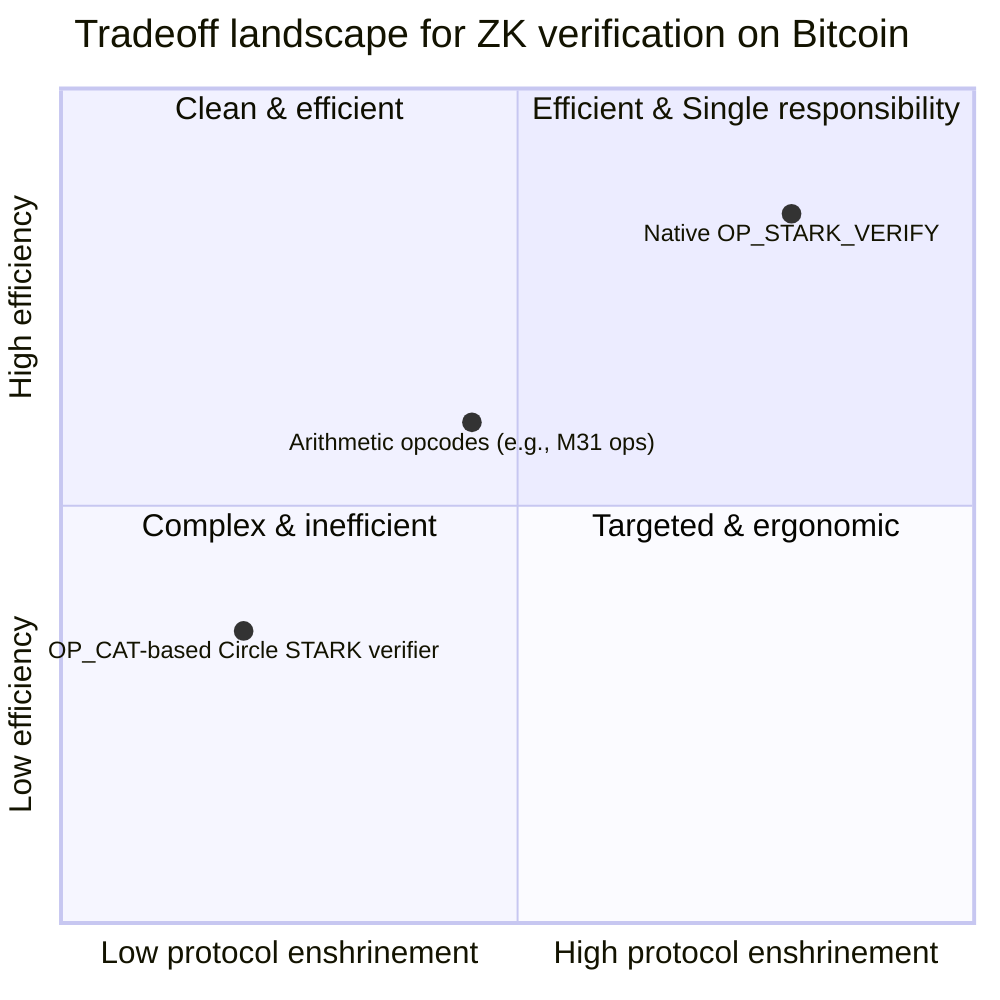

# Proposal: OP_STARK_VERIFY - Native STARK Proof Verification in Bitcoin Script

Abdel | 2025-10-14 10:55:51 UTC | #1

# Proposal: OP_STARK_VERIFY - Native STARK Proof Verification in Bitcoin Script

## TL;DR

This post proposes adding an opcode, `OP_STARK_VERIFY`, to Tapscript that verifies a bounded-size STARK proof. The goal is to enable on-chain verification of a Zero Knowledge Proof with transparent, post-quantum-secure assumptions, without resorting to ad-hoc Script encodings (e.g., `OP_CAT`) or enshrining a large family of arithmetic opcodes. We outline the motivation, threat model, bounding/pricing approach, initial opcode semantics, and open questions. Feedback welcome on scope,
parameter bounding, pricing, alternatives, and challenges.

It is clear that this proposal is far from being fully fleshed, and presents already multiple significant challenges, the main one being about credible neutrality with respect to the need of choosing a specific flavor of STARK protocol.

The main goal is to gauge the interest about enshrining native ZK verification (i.e OP_STARK_VERIFY, OP_GROTH16_VERIFY) into Bitcoin at some point.

It’s also an interesting thought experiment to start thinking about the challenges that this would imply.

## Introduction

There is increasing interest in enabling zero-knowledge proof verification within Bitcoin to support applications such as Validity rollups, post-quantum signatures, and privacy-preserving transactions. Current approaches, like BitVM-style optimistic fraud proofs with ZK verification, rely on off-chain computation and on-chain challenge mechanisms, introducing complexities such as delayed finality, capital lockup, and additional trust assumptions.

This post proposes a native opcode, OP_STARK_VERIFY, to directly verify [STARK (Scalable Transparent ARgument of Knowledge) proofs](https://eprint.iacr.org/2018/046.pdf) in Bitcoin Script. This aims to provide efficient, on-chain verification without the drawbacks of indirect methods.

The proposal focuses on vanilla STARKs, as implemented in [Stone](https://github.com/starkware-libs/stone-prover), due to their established understanding, production use, and formal properties. Newer variants like Circle STARKs (used in the successor Stwo prover) offer substantial improvements in terms of speed and overall efficiency but are less mature and understood. The choice of Stone is driven by its battle-tested nature, formal verification, and suitability for integration into Bitcoin Core. Validity proof is what is popularly referred to as ZK even if the formal aspect of zero knowledge is not always there.

> Note: I mention in the proposal multiple times ZK verification / ZK proof, sometimes it should be called validity proofs instead, as the ZK (Zero Knowledge) aspect is not necessarily true depending on the implementation of the prover and verifier. Validity proof is what is popularly referred to as ZK.

## Motivation

STARKs provide post-quantum secure, transparent proofs with poly-logarithmic verification complexity and sublinear proof sizes relative to computation size. Verification scales logarithmically with computation size, allowing to set an upper bound that is sufficient for all use cases (i.e. at least support recursive proof verification), and hence that enables static pricing in Bitcoin’s weight unit system (pricing the worse case).

Integration of the Stone verifier would add a single opcode that consumes a serialized and compressed STARK proof, from the stack, succeeding if the proof verifies and failing otherwise. Proof sizes are typically in the range of hundreds of KB to 1 MB uncompressed, but compression (e.g., bzip2) could reduce them below 100 KB in many cases. On-chain verification time would be in the order of 10s of milliseconds on standard hardware, depending on proof parameters.

Potential use cases include that could help Bitcoin improve as money:

* Validity rollups for scaling Bitcoin L1: verify state transition given the onchain state commitments.
* Post-quantum signature aggregation: replace a large number of PQ signatures with a single succinct proof of their correctness.
* Privacy features like shielded transactions: spend UTXOs by providing a ZK proof of funds.

And some other stuff:

* Proof or reserves / liabilities schemes for Cashu: use STARK proofs to prove the Mint is acting correctly, or users prove that the Mint is cheating. Avoid fractional reserves by having a large portion on Bitcoin onchain, and use it to penalize the Mint if cheating.
* Account abstraction: enable various ways of authentication on the L2 (i.e Oauth, Face ID, Nostr, etc)
* P2P exchange between BTC and fiat by providing proofs of transfer via Wise, Revolut, Venmo, etc, using ZK-TLS.

Some limitations / challenges include:

* Large proof sizes compared to pairing-based SNARKs, increasing transaction weight and potentially fees.
* Enshrining a specific proof system (vanilla STARKs), which may limit flexibility if better systems emerge.
* Consensus change requiring a soft fork, with risks of implementation bugs or unforeseen interactions.
* Verification is not constant-time; while bounded, it varies with size of the computation.
* Enshrining a specific STARK variant may raise concerns about credible neutrality.
* Pricing and resource usage need careful consideration to avoid DoS vectors.

## Alternatives & design space

* **`OP_CAT`-based verifier in Script**

  * Feasible and demonstrated for Circle STARKs, but extremely inefficient and intricate; pushes complexity into Script.

* **Arithmetic opcodes (e.g., M31 field ops) to “build” a verifier**

  * A smaller set of carefully chosen ops could make in-Script verifiers tractable and reusable, but still enshrines a particular arithmetic model and requires a larger opcode surface.

* **Native verifier opcode (this proposal)**

  * Enshrines exactly one verification algorithm with strict bounds. Cleanest runtime and policy, but requires choosing and pinning a concrete proof system and proof format.

### Visual spectrum of tradeoffs

### Quick comparison table

| Approach | Efficiency (runtime/bytes) | Complexity (review surface) | Flexibility | Protocol enshrinement | Notes |
|----|----|---:|---:|---:|----|
| `OP_CAT`-based verifier | **Low** | **High** (long scripts, gadgets) | High | Low | Proven possible for Circle STARKs; not elegant for production. |
| Arithmetic opcodes (e.g., M31) | Medium–High | Medium | Medium | Medium | Encodes arithmetic; still requires building a verifier in Script. |
| **Native `OP_STARK_VERIFY`** | **High** | **Low–Medium** (one well-bounded opcode) | Low–Medium | **High** | Single, pinned verifier with clear bounds; simplest runtime path. |

## Proposed high-level semantics (v0)

The exploratory implementation could integrate the Stone verifier, a univariate STARK verifier implemented in C++, that is used in production by Starkware, with minimal dependencies, into Bitcoin Core.

* **Opcode**: `OP_STARK_VERIFY` (Tapscript-only)

* **Stack inputs (from top)**:

  1. `proof` — byte string (bounded length), proof in Stone format (version-tagged)
  2. `verifier_id` — 2 bytes, selects a fixed verifier parameter set (e.g., `0x0001` = Stone v1, pinned)

* **Success condition**:

  * Node runs the **Stone** verifier corresponding to `verifier_id` on `proof`.
  * The opcode succeeds if the verifier accepts the proof as valid.

* **Consensus bounds** (for DoS safety):

  * `len(proof) ≤ PROOF_MAX_BYTES` (concrete value discussion below).
  * Proof must declare parameters within a fixed, tightly bounded set.

* **Witness/phasing**:

  * No changes to transaction digesting; the opcode accesses no additional tx fields beyond normal Script evaluation (keeps it orthogonal to sighash machinery).
  * Binding to the spend *is left to Script authors* (e.g., require a Schnorr signature over a message that includes a commitment to the proof in the locking script when the UTXO is created).

## Pricing and bounds

* **Proof size bound**: The opcode enforces a strict `PROOF_MAX_BYTES`. An initial target under discussion is on the order of \~100 KB, informed by typical CPU-AIR proofs under practical soundness parameters; the exact constant must be backed by benchmarks and security analysis. (open question: should  compression be considered *transport-layer* and *non-consensus*; adding a specific decompressor like bzip2 into consensus is maybe undesirable.)
* **Runtime bound**: Fix the verifier parameter set(s) (`verifier_id`) to ensure runtime is a predictable function of proof size and declared parameters.
* **Policy** (mempool/miner): further conservative limits (e.g., at most 1 `OP_STARK_VERIFY` per input; tighter size caps; disallow in bare scripts) can be separate from consensus and iterated based on measurement.

**Open question:** Whether to add an explicit “cost unit” like sigops for ZK verification, or rely purely on the byte bound + parameter pinning. Input welcome.

## Risks and drawbacks

* **Enshrining a proof system**: Pins one verification algorithm/format into consensus. Mitigations: small `verifier_id` namespace to allow *additional* pinned sets if ever needed.
* **Complexity & audit surface**: A verifier is non-trivial C++ code; we need a crisp, specification-first definition plus a minimal, auditable implementation bound to a precise commit and compiler settings. Stone is already formally verified, which helps. It also has been used in production for many years at scale and has been audited by multiple parties.
* **DoS and worst-case behavior**: Must bound proof parameters and sizes conservatively; policy can be stricter.
* **Credible neutrality**: Avoid favoring one particular protocol. This seems to be the biggest challenge with the approach of enshrining directly ZK verification to Bitcoin. It’s probably best to stick to a well understood, generic, documented vanilla STARK protocol (extremely close to the original STARK paper) and parameter set, not any app-specific semantics.

## References

* STARK paper: https://eprint.iacr.org/2018/046
* Circle STARKs paper: https://eprint.iacr.org/2024/278
* Stone prover/verifier: https://github.com/starkware-libs/stone-prover
* Stwo prover/verifier: https://github.com/starkware-libs/stwo
* OP_CAT Circle STARK verifier: https://github.com/Bitcoin-Wildlife-Sanctuary/bitcoin-circle-stark
* M31 opcodes proposal: https://hackmd.io/@AbdelStark/m31-opcodes-bitcoin-stark

-------------------------

instagibbs | 2025-10-14 16:09:26 UTC | #2

Thanks for the writeup! I appreciate the level of detail and caveats that help me understand some of the tradeoffs existing in this space. FWIW my interests currently are very high level, thinking about practical resource usage.

[quote="Abdel, post:1, topic:2056"]
Proof sizes are typically in the range of hundreds of KB to 1 MB uncompressed, but compression (e.g., bzip2) could reduce them below 100 KB in many cases.

[/quote]

These sized may end up being problematic as enshrining a proof system with >400kB proof sizes would make decentralized block building, and make decentralized relay difficult due to inability to predict when things will be mined. 

[quote="Abdel, post:1, topic:2056"]
On-chain verification time would be in the order of 10s of milliseconds on standard hardware

[/quote]

A single proof seems to eat up on the order(or two) of the verification “budget” of an entire block if we’re targeting something like 100ms per block in the average case. Granted, this threshold is “made up”, but it would be important to talk about what the underlying target would be for an “average” block using these consistently.

What would the Circle STARK look like as far as resources both in proof sizes and verification time? 

[quote="Abdel, post:1, topic:2056"]
Feasible and demonstrated for Circle STARKs, but extremely inefficient and intricate; pushes complexity into Script.

[/quote]

Same question but Circle STARKs within Bitcoin Script using CAT? What about with Simplicity with currently defined JETs?

Would be nice to have a high level understanding of how much is bought by making a “JET” of exactly the specific STARK prover beyond “low/medium-high/high” labels in the table.

-------------------------

Abdel | 2025-10-16 16:45:25 UTC | #3

Thanks for the very spot on questions / comments.

For the context, as it applies to all potential STARK on Bitcoin avenues we explore.

We can tune proving system params to either improve proving speed (at the cost of larger proof/slower verification) or reducing proof size (at the cost of slower proving/higher machine specs, specifically RAM).

Typically we use a multistage pipeline where:
- Fast proving is used for payload jobs (e.g. rollup blocks)
- Fast proving is used for recursive proof folding (to get a single proof for multiple jobs)
- Last several steps are used to compress the proof as much as possible and make it verifier friendly (depending on particular settlement layer)
    - Typically we switch hash function here
    - Adjust parameters to slow proving/fast verification mode
    - Use different proving systems if necessary

When we measure proof size and verification time, we are talking about the very last stage of the pipeline.

Here are the variants of proof compression pipelines (we are using Stwo for leaf jobs and recursive folding for all schemes so will omit it here):
1. Stwo — single step compression (the fastest option, suitable for offchain verification), ~500KB proof size (bzip2), ~25ms verification time
2. Stwo -> Stone -> Stone — multi-step compression (the one we plan for production), ~50KB proof size (bzip2), ~30ms verification time
3. Stwo -> ... -> Stwo — multi-layer compression optimized for Bitcoin script, ~100KB proof size

Regarding the onchain costs:
- Proof settlement via OP_CAT verifier looks like 175 transactions of total size ~7.3MB
- Current Simplicity implementation is ~2.5 MB script; it is not yet compatible with the proving pipeline (3) output + there will be an overhead from splitting it into multiple transactions, so the total cost should be comparable to OP_CAT

-------------------------

ftw2100 | 2025-10-17 14:38:17 UTC | #4

Thank you for the detailed proposal. This is a fascinating exploration of native ZK verification on Bitcoin.

An alternative approach worth considering is to build this functionality as a layer on top of Bitcoin first, rather than modifying the base protocol.

Instead of introducing a new opcode, one could leverage existing witness space to embed STARK proofs. Open-source indexers can then parse this on-chain data, verify the proofs, and maintain the state of the system off-chain. This metaprotocol approach offers several advantages:

1. **Risk Mitigation**: It avoids introducing a complex, specific cryptographic primitive into the consensus-critical base layer, sidestepping the risks of implementation bugs or unforeseen economic incentives.
2. **Market-Driven Adoption**: It allows the concept to be tested and validated in a real-world environment. We can gauge actual market demand and allow social consensus to form organically around a specific STARK implementation without a contentious soft fork.
3. **Flexibility**: This model allows different proof systems to compete and evolve. If a superior technology emerges, the ecosystem can adapt without being locked into a single, enshrined protocol.

If a metaprotocol for STARK verification gains significant traction and proves its utility and safety, the community would then have a much stronger, data-driven basis for considering its native integration into Bitcoin Script.

For a deeper look into the possibilities of building on Bitcoin without script changes, you might find the vision outlined at `wtf.rich/w.pdf` insightful. It provides a good overview of what can be achieved with current protocol rules.

-------------------------

