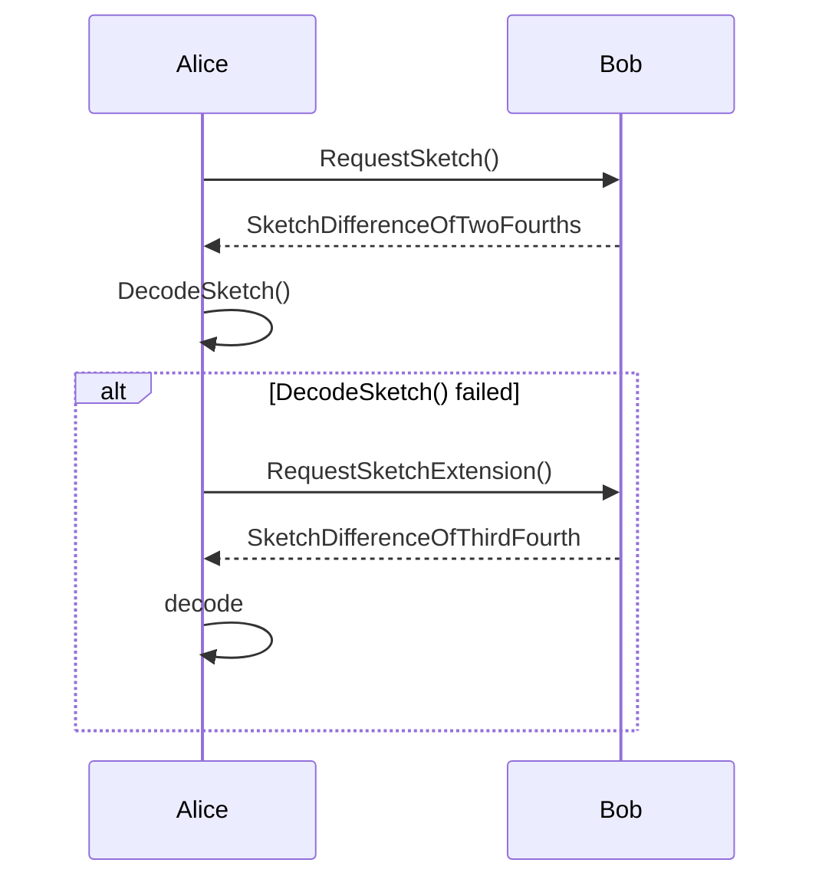

# Gossip Observer: New project to monitor the Lightning P2P network

jonhbit | 2025-11-14 20:48:38 UTC | #1

For the past few months (since plebfi miami), I've been working on a project to monitor the Lightning gossip network by collecting gossip messages from numerous nodes. The repo with the code used, the raw data collected before lightning++, and the slides from my talk is here:

<https://github.com/jharveyb/gossip_observer>

## Observations:

- Convergence delay (time for a message to propagate around the network) has dropped a significant amount since similar measurements in 2022, from ~500 to ~200 seconds for 75% propagation. I suspect this is due to LN implementations defaulting to making more P2P connections.

- A significant subset of all messages received were sent to my node by less than 1/4th of its peers. This could be due to a poorly connected graph of P2P connections, or some filtering policy in the LN implementations.

- For channel_update messages, which were 60% of total messages, 20% of channels had more than 144 messages. This is relevant when compared to the proposed gossip rate limit for Taproot gossip / gossip 1.5(?):

<https://github.com/lightning/bolts/pull/1059>

- For node_announcement messages, which were 30% of total messages, 2.5% of nodes were announced more than 144 times. This seems like a unintended behavior of some implementation or node automation tool.

- The total size of all unique messages collected over that day was 103.2 MB, which is greater than I expected. This does not account for the bandwidth overhead of receiving the same message from multiple peers, so node bandwidth usage is likely much higher.

## Future Work

So far, I only collected data over a 24 hour period and analyzed that. In the near term I'll be setting up permanent infrastructure to receive gossip from multiple geographic regions and neighborhoods in the P2P graph. I'll also be adding functionality to broadcast gossip messages from these nodes, and observe their propagation. Work will continue in the gossip-observer repo linked above.

## Getting Involved

If you have feedback on interesting metrics to compute, a request to track gossip propagation from your node, or anything else, feel free to message me here!

I'm also investigating how this raw data could be published so others can perform their own analysis. I'm particularly interested in options for unsupervised anomaly detection, but I'm also definitely not a data scientist.

-------------------------

jonhbit | 2025-11-19 21:31:53 UTC | #2

A related subject is how we could switch the LN P2P network from message flooding to something closer to the design outlined in the Erlay paper and BIP. Some observations:

- Latency / propagation delay is much less important for LN gossip; implementations will allow slightly outdated fees to apply to their channel, for example.

- Gossip messages are signed by the sender, and are intended to be public. So the propagation method does not need to conceal information about the sender's position nor connections in the LN P2P graph.

There has been some existing work on this subject:

<https://endothermic.dev/p/magical-minisketch>

### Adapting Minisketch to LN Gossip

A key detail is how to map gossip messages to Minisketch set elements. This mapping should be collision-resistant, and ideally the elements are short, since reconciliation time is quadratic wrt. element length.

In the Erlay design, collisions are avoided by generating a salt for each peer connection, and using that and the TXID as input to a fast non-cryptographic collision-resistant hash like SipHash. This means that the total amount of hashing operations needed scales with the number of peer connections, but having a shorter (32-bit) set element greatly reduces the compute needed for set construction and reconciliation.

Alternatively, set elements could be computed from a channel's short channel ID (64 bits), plus the block height included in the gossip message. However, there are some issues with this approach.

One is that the components of a short channel ID (channel open block height, transaction index, and output index) don't have a lot of entropy. For example, in a full block, one could have ~36000 1-in 1-out P2TR TXs of 111 vB, or 1 TX with 1 input and 93020 outputs with weight ~3999900 vB. In either case, the entropy of the TX + output index is only ~17 bits. Mixing in block heights does not add much to the total entropy, since a message can only use a block height from the last two weeks (~2016 possible values, 11 bits of entropy).

[Edit 19.11.25: I forgot about the max standard TX weight of 400k WU; so a full block could have 10 TXs with ~3600 outputs each. That doesn't really change the total entropy of (TX index + output index) I think.]

In addition, we would need a different mapping for node_announcement messages.

Given that LN nodes already store some per-peer state on connection (re)establishment, I'm in favor of borrowing the Erlay approach and using a per-peer salt + a hash like SipHash to generate short Minisketch set elements for each gossip message.

### Gossip v1.5 message format

Another detail is that the gossip 1.5 proposal allows for optional fields in gossip messages, which is not possible with current gossip messages:

<https://github.com/lightning/bolts/pull/1059>

However, I think peers can decide which fields to send to their peer based on their announced feature bits.

### Other considerations

Compared to the Erlay design, I don't think LN implementations would need to perform any message flooding at all. Combining limited flooding and set reconciliation is useful for reducing total propagation delay, but the LN gossip propagation delay is so large that it could be maintained through set reconciliation alone. This should greatly simplify implementation complexity as well.

With respect to implementation, one problem would be different nodes filtering messages with different policies. This would lead to persistent set differences, which would waste bandwidth and, in the worst case, cause reconciliations to fail. I suspect that these filtering policies are either legacy behavior, or adaptions to quirks in existing gossip behavior, and could largely be removed if we move to set reconciliation.

### Future Work

In parallel to the gossip monitoring work, I'd like to get feedback from LN implementers on which designs could work for them. Is the per-peer state a significant drawback or source of complexity? Would there be an issue with more frequent (every 30 seconds?) set reconciliation and gossip message handling? Are there other issues that haven't been considered?

I'll update this thread if/when I have a more concrete proposal or draft BIP.

-------------------------

gmaxwell | 2025-11-17 21:51:45 UTC | #3

[quote="jonhbit, post:2, topic:2105"]
Compared to the Erlay design, I don’t think LN implementations would need to perform any message flooding at all. Combining limited flooding and set reconciliation is useful for reducing total propagation delay,

[/quote]

Minisketch has superlinear decoding costs, so decoding huge sketches will burn up a lot of CPU.   One could reconcile more often to try to fight this, but every reconcile will imply some communication overheads since you’ll overshoot the unknown needed amount for a reconstruction.

The flooding in the erlay has the advantage that takes the bulk of the load off the sketch and lets the sketch fill in the small omissions which it’s good at doing.

If you were to use reconciliation only you might be better off using iblt instead of minisketch (maybe plus a very small minisketch to unjam stuck IBLT decodes).   The overheads of iblt are much worse but that may be less significant if you’re running all the traffic through it.

-------------------------

jonhbit | 2025-11-19 22:36:32 UTC | #4

[quote="gmaxwell, post:3, topic:2105, full:true"]
Minisketch has superlinear decoding costs, so decoding huge sketches will burn up a lot of CPU.   One could reconcile more often to try to fight this, but every reconcile will imply some communication overheads since you’ll overshoot the unknown needed amount for a reconstruction.

The flooding in the erlay has the advantage that takes the bulk of the load off the sketch and lets the sketch fill in the small omissions which it’s good at doing.
[/quote]

I missed that benefit of the flooding in Erlay on my previous reads of the paper; that makes sense.

[quote="gmaxwell, post:3, topic:2105, full:true"]
If you were to use reconciliation only you might be better off using iblt instead of minisketch (maybe plus a very small minisketch to unjam stuck IBLT decodes).   The overheads of iblt are much worse but that may be less significant if you’re running all the traffic through it.
[/quote]

This opened a rabbit hole that actually led me to a very recent paper proposing an IBLT-based set reconciliation protocol, that may be well-suited for this use case.

Firstly, the CPISync implementation used for benchmarks in the Minisketch repo has moved and expanded to include some new protocols:

https://github.com/nislab/gensync

There is a related paper that explores some of the tradeoffs of sync with Cuckoo filters vs. CPI vs. IBLT:

https://arxiv.org/abs/2303.17530

Cuckoo filters looked interesting, but IIUC don't fit our use case well since a participant learns which elements their counterparty is missing, not the opposite (which elements they should request). The bandwidth used also seems to have a high floor. Outside of that, the benchmarks focus on much larger sets than what's relevant in the LN Gossip (or Erlay) setting.

I never looked at the MET-IBLT paper; it seems like a better IBLT sync scheme, but with no benefits compared to RIBLT.

Looking into cuckoo filters eventually led me to this paper, Rateless IBLT (RIBLT):

https://arxiv.org/abs/2402.02668

Which seems very promising. They even used the Minisketch library in their benchmarks! _And_ there is a public implementation in Golang (+ impls in C++ and Rust linked in the README):

https://github.com/yangl1996/riblt

The main math & explanation is in Section 4, with comparison to alternatives in Section 7.

As a tl;dr:

- To make an IBLT rateless / an infinite stream of coded symbols, we can extend a mostly-normal IBLT s.t. later coded symbols map to fewer and fewer inputs. If we have an efficient function to compute the indices of coded symbols an input must contribute to, we can encode our table efficiently even as the set size grows.
- - We can also extend the table incrementally, and send extensions until decoding succeeds, so we don't need to estimate the set difference nor regenerate the IBLT if decode fails (similar to extending a Minisketch) (the paper doesn't comment much on partial recovery, but Figure 6 has some simulation results related to this).

- The bandwidth overhead seems to have a ceiling of ~1.75, even for sets with very few differences; it converges to ~1.35 as differences increase past 100, which seems significantly better than standard IBLT? (Figure 5).

- For both large and small set differences (1-1000), encoding cost grows linearly (Figure 8) This also holds for total set size (FIgure 10). Worth noting that the ratio (set_differences)/(set_size) is quite small in most of their benchmarks.

- Most of their benchmarks use an element size of 64 bits. IIUC the bandwidth overhead could be significantly reduced if an implementation was optimized for small sets and smaller elements; there are some relevant notes in Sections 7.1 and 7.2.

If these performance properties hold up, I agree that mixing frequent IBLT-based syncs + infrequent Minisketch usage is appealing. It may also be worth skipping Minisketch entirely and trade bandwidth overhead for the CPU savings; I'm not sure how LN implementations feel about that tradeoff tbh. 

Another consideration is that the elements we want to exchange are very small (average message size <275 bytes), so there isn't much room to add bandwidth overhead. These messages will still be small with gossip v2.

Being able to have larger (64+ bit) elements with only a small increased CPU cost (FIgure 11) may be a very significant benefit; I'll take a look at these implementations soon and report back.

-------------------------

gmaxwell | 2025-11-19 23:43:49 UTC | #5

Just be careful with figures from papers they tend to be rather asymptotic.  IBLT like schemes usually start with \~32-bits per difference in overhead for a checksum which is pretty bad when otherwise 30-bit members are fine >100% overhead before you even get to the overheads needed to achieve correct reconstruction.  :smiley:  Some papers simply leave this overhead out of their figures, though I don’t recall if the rateless paper did that.

(FWIW, you can use minisketch in a kind of quasi rateless way by just dynamically sending more until the other side could recover– almost all the computation from a partial one can be conserved, as you don’t get to the expensive and non-reusable root finding step until you’re almost certain to have a correct decode, so long as you’re willing to take one or two extra elements overhead)

-------------------------

jonhbit | 2025-11-20 16:18:51 UTC | #6

[quote="gmaxwell, post:5, topic:2105, full:true"]
Just be careful with figures from papers they tend to be rather asymptotic.  IBLT like schemes usually start with \~32-bits per difference in overhead for a checksum which is pretty bad when otherwise 30-bit members are fine
[/quote]

Fair; their main benchmarks are using 32-byte members and 8-byte checksums. I think the claimed overhead depends on the ratio between these two? Which would be worse for this application.

They do mention that you can shorten the checksum for small sets, but it definitely isn't benchmarked. I _think_ that is acceptable if the set members are already sufficiently collision resistant.

[quote="gmaxwell, post:5, topic:2105, full:true"]
(FWIW, you can use minisketch in a kind of quasi rateless way by just dynamically sending more until the other side could recover– almost all the computation from a partial one can be conserved, as you don’t get to the expensive and non-reusable root finding step until you’re almost certain to have a correct decode, so long as you’re willing to take one or two extra elements overhead)
[/quote]

Ah, I didn't fully realize that this was the tradeoff for bisection / sketch reuse from the original paper nor notes on the repo :sweat_smile: But I see it listed as a TODO. That seems like the best option then; having more than one communication round for bisection is also more acceptable for LN than Bitcoin TX broadcast.

I don't have a real estimate nor intuition for how many differences to expect; I may be able to estimate that by looking at real-world traffic, but it seems like this also depends on the flooding timer skew across all of your peers? Perhaps that is another option for reducing differences. Eventually I'll replay real-world traffic in simulation for a proper estimate.

Related, one simple adjustment to reduce differences would be to flood messages your node generates to your direct peers, instead of waiting for the reconciliation timer.

-------------------------

rustyrussell | 2025-11-22 22:48:46 UTC | #7

Sorry to join the conversation late, and I haven’t worked on this for years so my memory could be stale, but here’s a brain dump of our conclusions.

1. Short channel ids have a lot of bits to squeeze. Ultimate would be to refer to outputs by their index in the blockchain (i.e. the 123456th output), but you can easily use fewer than 64 bits for blocknum/txnum/outnum.
2. You maintain three minisketches. We tried a single, but it costs encoding bits, complexity and hits the O(N^2) harder.
3. Channel minisketch is just the scids. Importantly, you send your blockheight with the sketch, because that informs the failure case.
4. Channel update minisketch is compacted scid + direction bit + height. Note that height takes 10 or 11 bits, IIRC, since you don’t send expired ones. You can only reliably decode this once you have reconciled the channels sketch.
5. Node announce sketch is uses the same encoding, using the oldest channel attached to the node as its key. Again this assumes you reconciled the channels sketch first.

If you cannot encode an scid compactly, just send it as a series of  “raw" entries. IIRC creating such an scid requires an exceptional number of txs in a block or exceptional output count.

With this scheme, you simply send the sketches every 60 seconds (like now), and your peer sends you what you’re missing.

Note that you can truncate the set you send if you want to save bandwidth, but really the cost is in the set maintenance, so maybe this is silly. My memory is that minisketch is *fast* in practice though, even if you keep a 64k (8k element) set which is our max message size anyway.

If reconstruction fails, there are several things you can do:

1. If block height differs, ignore. Time will sort it. Maybe include block hash here?
2. Enlarge your own set (or, send more of your set). If this allows your peer to reconstruct, it will learn that you cannot reconstruct, and it knows to send its largest set if it wasn’t already.
3. Wait for other peers. You might close the gap.
4. Existing gossip queries for recent changes (assuming a pile of old changes haven’t suddenly appeared).  You know if you need announcements, updates or node anns.
5. Query for everything.

Oh, we added a “total entries" counter to each message, which gives a clue as well: if your peer has far fewer entries, it’s a cry for help :slight_smile:

-------------------------

rustyrussell | 2025-11-23 00:35:19 UTC | #9

[quote="jonhbit, post:6, topic:2105"]
I don’t have a real estimate nor intuition for how many differences to expect; I may be able to estimate that by looking at real-world traffic

[/quote]

50,000 public channels means 100,000 updates per block maximum, so roughly 10,000 a minute.

In an ideal situation with two peers and you space out the updates so that they are 30 seconds apart, you can just handle that with a 64kb set (8k entries). 

Of course not every channel updates at the maximum rate, and behaviour will definitely be bursty, but this was the back of envelope calculation that convinced me that this approach can work.

-------------------------

jonhbit | 2025-11-26 00:46:27 UTC | #10

[quote="rustyrussell, post:7, topic:2105, full:true"]
Sorry to join the conversation late, and I haven’t worked on this for years so my memory could be stale, but here’s a brain dump of our conclusions.
[/quote]

Thanks for reposting it here! Useful to have more context on this, and any snippets of earlier discussions.

[quote="rustyrussell, post:7, topic:2105, full:true"]
1. Short channel ids have a lot of bits to squeeze. Ultimate would be to refer to outputs by their index in the blockchain (i.e. the 123456th output), but you can easily use fewer than 64 bits for blocknum/txnum/outnum.
[/quote]

Agreed; I think we could cut at least 6 bits off of txindex? And then use creative XORing to mix in missing bits that don't have their own spot.

[quote="rustyrussell, post:7, topic:2105, full:true"]
3. You maintain three minisketches. We tried a single, but it costs encoding bits, complexity and hits the O(N^2) harder.
4. Channel minisketch is just the scids. Importantly, you send your blockheight with the sketch, because that informs the failure case.
5. Channel update minisketch is compacted scid + direction bit + height. Note that height takes 10 or 11 bits, IIRC, since you don’t send expired ones. You can only reliably decode this once you have reconciled the channels sketch.
6. Node announce sketch is uses the same encoding, using the oldest channel attached to the node as its key. Again this assumes you reconciled the channels sketch first.

If you cannot encode an scid compactly, just send it as a series of  “raw" entries. IIRC creating such an scid requires an exceptional number of txs in a block or exceptional output count.
[/quote]

Not sure what you mean with the "raw entries" part? Do you mean, send the underlying gossip message outside of the set reconciliation messaging flow?

[quote="rustyrussell, post:7, topic:2105, full:true"]
With this scheme, you simply send the sketches every 60 seconds (like now), and your peer sends you what you’re missing.

Note that you can truncate the set you send if you want to save bandwidth, but really the cost is in the set maintenance, so maybe this is silly. My memory is that minisketch is *fast* in practice though, even if you keep a 64k (8k element) set which is our max message size anyway.
[/quote]

IIUC the cost is mostly in the final parts of decode; I think if you wanted to save bandwidth, you could create a sketch with an overestimate of the true set difference, and then send some portion of that. If your peer signals that decode would fail, you can send the rest / another chunk of the oversized set.

I didn't consider the max message size at all; that sounds like an argument for using shorter (32-bit) set elements and using a per-peer salt :upside_down_face: 

[quote="rustyrussell, post:7, topic:2105, full:true"]
If reconstruction fails, there are several things you can do:

1. If block height differs, ignore. Time will sort it. Maybe include block hash here?
[/quote]

Not sure I understand this bit; I figure you mean the block height you suggested sending alongside the channel announcement sketch. Is this the blockheight of the newest channel announcement you've received, or something else?

[quote="rustyrussell, post:7, topic:2105, full:true"]
3. Enlarge your own set (or, send more of your set). If this allows your peer to reconstruct, it will learn that you cannot reconstruct, and it knows to send its largest set if it wasn’t already.
4. Wait for other peers. You might close the gap.
5. Existing gossip queries for recent changes (assuming a pile of old changes haven’t suddenly appeared).  You know if you need announcements, updates or node anns.
6. Query for everything.

Oh, we added a “total entries" counter to each message, which gives a clue as well: if your peer has far fewer entries, it’s a cry for help :slight_smile:
[/quote]

Mm, I wonder if there are other values that would be useful to add in here.

Re: your follow-up post - I agree on the napkin math working out, and it's even better if we're doing one set per message type. And having more peers should also help.

Will think over the message ordering dependencies you mentioned in having three sketches vs. one. Fallback behavior #4 could be promising, where you rebuild a sketch from the messages you received over the last n minutes vs. just 1 minute, reattempt a reconciliation, and hopefully catch up to that peer. I think I'd like to avoid leaning too much on gossip queries if possible :sweat_smile:

-------------------------

rustyrussell | 2025-11-27 21:01:18 UTC | #11

[quote="jonhbit, post:10, topic:2105"]
[quote="rustyrussell, post:7, topic:2105"]
If you cannot encode an scid compactly, just send it as a series of “raw" entries. IIRC creating such an scid requires an exceptional number of txs in a block or exceptional output count.

[/quote]

Not sure what you mean with the “raw entries” part? Do you mean, send the underlying gossip message outside of the set reconciliation messaging flow?

[/quote]

No, I meant, say you use 24 bits for blknum, 14 for txindex, 12 for output number, 1 for direction and 12 for blocknumber, that uniquely identifies each update in 64 bits.  But it someone uses the 4096th output of a tx for a channel, you can’t encode it in the set.  For that, you simply encode it raw, outside the minisketch.

[quote="jonhbit, post:10, topic:2105"]
[quote="rustyrussell, post:7, topic:2105"]
With this scheme, you simply send the sketches every 60 seconds (like now), and your peer sends you what you’re missing.

Note that you can truncate the set you send if you want to save bandwidth, but really the cost is in the set maintenance, so maybe this is silly. My memory is that minisketch is *fast* in practice though, even if you keep a 64k (8k element) set which is our max message size anyway.

[/quote]

IIUC the cost is mostly in the final parts of decode; I think if you wanted to save bandwidth, you could create a sketch with an overestimate of the true set difference, and then send some portion of that. If your peer signals that decode would fail, you can send the rest / another chunk of the oversized set.

I didn’t consider the max message size at all; that sounds like an argument for using shorter (32-bit) set elements and using a per-peer salt :upside_down_face:

[/quote]

You don’t need to signal.  When you get their sketch, it fails for you.  So you go larger, if you can.

Per-peer salt penalizes scaling.  Now each peer costs you more than bandwidth.  If we can avoid this, we should, and I think we can.

[quote="jonhbit, post:10, topic:2105"]

[quote="rustyrussell, post:7, topic:2105"]
If reconstruction fails, there are several things you can do:

1. If block height differs, ignore. Time will sort it. Maybe include block hash here?

[/quote]

Not sure I understand this bit; I figure you mean the block height you suggested sending alongside the channel announcement sketch. Is this the blockheight of the newest channel announcement you’ve received, or something else?

[/quote]

The current blockheight you are aware of.  This is important, because channel updates must be refreshed every 2048 blocks (IIRC in the new spec proposal), and you will accept new channel announcements on each block.  So you expect non-zero differences in this case.

The block hash would allow you to see forks, if that happened.

[quote="jonhbit, post:10, topic:2105"]
[quote="rustyrussell, post:7, topic:2105"]
3. Enlarge your own set (or, send more of your set). If this allows your peer to reconstruct, it will learn that you cannot reconstruct, and it knows to send its largest set if it wasn’t already.
4. Wait for other peers. You might close the gap.
5. Existing gossip queries for recent changes (assuming a pile of old changes haven’t suddenly appeared). You know if you need announcements, updates or node anns.
6. Query for everything.

Oh, we added a “total entries" counter to each message, which gives a clue as well: if your peer has far fewer entries, it’s a cry for help :slight_smile:

[/quote]

Mm, I wonder if there are other values that would be useful to add in here.

Re: your follow-up post - I agree on the napkin math working out, and it’s even better if we’re doing one set per message type. And having more peers should also help.

[/quote]

Note that the long pole in the scaling tent is channel updates.  Node announcements only change when you change IP address or something, and there are far fewer nodes than channels x 2.  Channel announcements only happen once per channel.

[quote="jonhbit, post:10, topic:2105"]

Will think over the message ordering dependencies you mentioned in having three sketches vs. one. Fallback behavior #4 could be promising, where you rebuild a sketch from the messages you received over the last n minutes vs. just 1 minute, reattempt a reconciliation, and hopefully catch up to that peer. I think I’d like to avoid leaning too much on gossip queries if possible :sweat_smile:

[/quote]

I think in practice, implementations will fall back to asking for everything if reconciliation fails. It has the benefit of being simple, both to implement and test.

-------------------------

rustyrussell | 2025-11-29 00:01:44 UTC | #12

[quote="jonhbit, post:10, topic:2105"]
IIUC the cost is mostly in the final parts of decode

[/quote]

Yes, there’s a whole load of fun avoiding griefing here.  Some rando connects and sends you 8k elements of junk, you don’t want to spend 1 second of CPU (based roughly on the graphs on the minisketch page).  Fortunately you can limit it to some ceiling simply by trimming first.  The ideal BOLT spec would give exact numbers here, but thorough benchmarks required (like, how long does it take the build the set for all the gossip in the first place?  How long to maintain it on each block? etc).

-------------------------

jonhbit | 2025-12-01 20:19:43 UTC | #13

[quote="rustyrussell, post:11, topic:2105"]
No, I meant, say you use 24 bits for blknum, 14 for txindex, 12 for output number, 1 for direction and 12 for blocknumber, that uniquely identifies each update in 64 bits.  But it someone uses the 4096th output of a tx for a channel, you can’t encode it in the set.  For that, you simply encode it raw, outside the minisketch.

[/quote]

Ah ok, makes sense now. I think another option is to use more bits per field, and then ‘overlap’ fields by XORing between the low-entropy bits of one field with the high-entropy bits of another.

As an example, a 24 bit blknum field supports another ~300 years of blockheights (we could probably shrink it?). blknum could be encoded little-endian (LE) / with the LSBs starting from index 0. txindex is expanded to 18 bits, also encoded as LE, but starts from index 20. So the two fields overlap on 4 bits:

`Key[0:19] = LE(blknum)[0:19]`

`Key[20:23] = LE(blknum)[20:23] ⊕ LE(txindex)[0:3]`

`Key[24:37] = LE(txindex)[4:17]`

IMO we can adjust the size of these fields based on current constraints like min. tx size, etc. such that the amount of overlap is minimal, but we wouldn't need this fallback path.

[quote="rustyrussell, post:11, topic:2105"]
You don’t need to signal.  When you get their sketch, it fails for you.  So you go larger, if you can.
[/quote]

This is the message flow I was thinking of in my response:

I'm unclear on what you meant by "go larger", but I think you meant that Alice should build a sketch from a larger set locally and retry reconciliation?. IIUC, if the number of differences exceeds the capacity of the sketch Bob sent Alice, Alice retrying reconciliation in this way would only succeed if the number of differences decreased between her first and second sets. Which may happen if she has reconciled with other peers in the meantime.

I think we'd probably want to do both? So if initial reconciliation fails, wait for timer_interval / 3 seconds, expand our local set, build a larger sketch, and try reconciliation again. If the 2nd reconciliation fails, ask Bob for a sketch extension and retry reconciliation a 3rd time. If it still fails, either:

- Query Bob for all set elements and reconcile locally (lots of bandwidth, minimal CPU)
- Give up on reconciliation with Bob for this interval, retry the normal reconciliation protocol in (timer_interval) * 2/3 seconds. Hope that our reconciliation with other peers reduces our difference with Bob.

Another option is to ask Bob for a fresh sketch of the same capacity, instead of an extension of the 1st sketch we received.

IIUC we mostly agree on the options for handling initial reconciliation failure; I think having evidence to decide will require simulation and tweaking parameters there.

[quote="rustyrussell, post:11, topic:2105"]
Per-peer salt penalizes scaling.  Now each peer costs you more than bandwidth.  If we can avoid this, we should, and I think we can.
[/quote]

My response earlier may have been missing a `/s` tag, sorry; I think we may just have a different mental model for which parts of this process consume more or less resources. From the benchmarks in the minisketch repo, and comments upthread, we know that:

- Encoding a sketch is very fast; most of the compute for reconciliation is part of sketch merging & decoding.
- Decode time is quadratic with # of differences.
- Given current optimizations, decode time is 2x as long for 64-bit keys vs. 32-bit keys.

My argument re: salting and 32-bit set keys, is that the additional complexity of per-connection salts, and the extra work of computing more set keys (1 per connection vs. 1 global set key), is _worth the expected ~2x savings_ in compute for sketch decoding.

As a supporting point, non-cryptographic hash functions like [xxhash](https://xxhash.com/) are extremely fast for small inputs. As a detracting point, I suspect that a per-peer salt would require using a bit more memory to keep track of per-peer sketch state.

I'm not married to a requirement that we use 32-bit keys, but I think it's worth exploring / keeping in mind. Perhaps we can tweak other knobs, keep the # of differences down, and then not lose much by having longer 64-bit keys.

[quote="rustyrussell, post:11, topic:2105"]
The current blockheight you are aware of.  This is important, because channel updates must be refreshed every 2048 blocks (IIRC in the new spec proposal), and you will accept new channel announcements on each block.  So you expect non-zero differences in this case.

The block hash would allow you to see forks, if that happened.
[/quote]

Makes sense, I agree :+1: 

[quote="rustyrussell, post:11, topic:2105"]
Note that the long pole in the scaling tent is channel updates.  Node announcements only change when you change IP address or something, and there are far fewer nodes than channels x 2.  Channel announcements only happen once per channel.
[/quote]

:+1: 

[quote="rustyrussell, post:11, topic:2105"]
I think in practice, implementations will fall back to asking for everything if reconciliation fails. It has the benefit of being simple, both to implement and test.
[/quote]

Fair; though I suspect maintaining a larger set / allowing messages to remain in the set for longer will help a lot with reconciliation reliability. Another question for simulation!

[quote="rustyrussell, post:12, topic:2105"]
Yes, there’s a whole load of fun avoiding griefing here. Some rando connects and sends you 8k elements of junk, you don’t want to spend 1 second of CPU (based roughly on the graphs on the minisketch page). Fortunately you can limit it to some ceiling simply by trimming first. The ideal BOLT spec would give exact numbers here, but thorough benchmarks required (like, how long does it take the build the set for all the gossip in the first place? How long to maintain it on each block? etc).
[/quote]

IIUC, the sketch decode has multiple steps, and most of the compute is in the final step. Before that final step, a decoder would know if decode is expected to yield a successful reconciliation with very high probability, before executing that final step. So an early exit should make the cost for that much smaller; I think this isn't yet implemented in the minisketch library though.

I imagine you'd only want to accept sketches after explicitly requesting them, and you'd disconnect peers that repeatedly send malformed sketches.

I agree a lot of this will depend on some more benchmarking, especially since I think our set and difference sizes may be larger than what is covered on the minisketch repo right now. More varied benchmarking should be a straightforward first step before network-level simulation, I'll look into it.

-------------------------

rustyrussell | 2025-12-04 04:36:13 UTC | #14

[quote="jonhbit, post:13, topic:2105"]
IMO we can adjust the size of these fields based on current constraints like min. tx size, etc. such that the amount of overlap is minimal, but we wouldn’t need this fallback path.

[/quote]

But now you need to detect clashes and decide who wins.  Easier to up-front fail to decode, in practice.

[quote="jonhbit, post:13, topic:2105"]
This is the message flow I was thinking of in my response:

BobAliceBobAlice#mermaid-diagram-2{font-family:“trebuchet ms”,verdana,arial,sans-serif;font-size:16px;fill:#333;}#mermaid-diagram-2 .error-icon{fill:#552222;}#mermaid-diagram-2 .error-text{fill:#552222;stroke:#552222;}#mermaid-diagram-2 .edge-thickness-normal{stroke-width:1px;}#mermaid-diagram-2 .edge-thickness-thick{stroke-width:3.5px;}#mermaid-diagram-2 .edge-pattern-solid{stroke-dasharray:0;}#mermaid-diagram-2 .edge-thickness-invisible{stroke-width:0;fill:none;}#mermaid-diagram-2 .edge-pattern-dashed{stroke-dasharray:3;}#mermaid-diagram-2 .edge-pattern-dotted{stroke-dasharray:2;}#mermaid-diagram-2 .marker{fill:#333333;stroke:#333333;}#mermaid-diagram-2 .marker.cross{stroke:#333333;}#mermaid-diagram-2 svg{font-family:“trebuchet ms”,verdana,arial,sans-serif;font-size:16px;}#mermaid-diagram-2 p{margin:0;}#mermaid-diagram-2 .actor{stroke:hsl(259.6261682243, 59.7765363128%, 87.9019607843%);fill:#ECECFF;}#mermaid-diagram-2 text.actor>tspan{fill:black;stroke:none;}#mermaid-diagram-2 .actor-line{stroke:hsl(259.6261682243, 59.7765363128%, 87.9019607843%);}#mermaid-diagram-2 .messageLine0{stroke-width:1.5;stroke-dasharray:none;stroke:#333;}#mermaid-diagram-2 .messageLine1{stroke-width:1.5;stroke-dasharray:2,2;stroke:#333;}#mermaid-diagram-2 #arrowhead path{fill:#333;stroke:#333;}#mermaid-diagram-2 .sequenceNumber{fill:white;}#mermaid-diagram-2 #sequencenumber{fill:#333;}#mermaid-diagram-2 #crosshead path{fill:#333;stroke:#333;}#mermaid-diagram-2 .messageText{fill:#333;stroke:none;}#mermaid-diagram-2 .labelBox{stroke:hsl(259.6261682243, 59.7765363128%, 87.9019607843%);fill:#ECECFF;}#mermaid-diagram-2 .labelText,#mermaid-diagram-2 .labelText>tspan{fill:black;stroke:none;}#mermaid-diagram-2 .loopText,#mermaid-diagram-2 .loopText>tspan{fill:black;stroke:none;}#mermaid-diagram-2 .loopLine{stroke-width:2px;stroke-dasharray:2,2;stroke:hsl(259.6261682243, 59.7765363128%, 87.9019607843%);fill:hsl(259.6261682243, 59.7765363128%, 87.9019607843%);}#mermaid-diagram-2 .note{stroke:#aaaa33;fill:#fff5ad;}#mermaid-diagram-2 .noteText,#mermaid-diagram-2 .noteText>tspan{fill:black;stroke:none;}#mermaid-diagram-2 .activation0{fill:#f4f4f4;stroke:#666;}#mermaid-diagram-2 .activation1{fill:#f4f4f4;stroke:#666;}#mermaid-diagram-2 .activation2{fill:#f4f4f4;stroke:#666;}#mermaid-diagram-2 .actorPopupMenu{position:absolute;}#mermaid-diagram-2 .actorPopupMenuPanel{position:absolute;fill:#ECECFF;box-shadow:0px 8px 16px 0px rgba(0,0,0,0.2);filter:drop-shadow(3px 5px 2px rgb(0 0 0 / 0.4));}#mermaid-diagram-2 .actor-man line{stroke:hsl(259.6261682243, 59.7765363128%, 87.9019607843%);fill:#ECECFF;}#mermaid-diagram-2 .actor-man circle,#mermaid-diagram-2 line{stroke:hsl(259.6261682243, 59.7765363128%, 87.9019607843%);fill:#ECECFF;stroke-width:2px;}#mermaid-diagram-2 :root{–mermaid-font-family:“trebuchet ms”,verdana,arial,sans-serif;}alt\[DecodeSketch() failed\]RequestSketch()SketchDifferenceOfTwoFourthsDecodeSketch()RequestSketchExtension()SketchDifferenceOfThirdFourthdecode

I’m unclear on what you meant by “go larger”, but I think you meant that Alice should build a sketch from a larger set locally and retry reconciliation?. IIUC, if the number of differences exceeds the capacity of the sketch Bob sent Alice, Alice retrying reconciliation in this way would only succeed if the number of differences decreased between her first and second sets. Which may happen if she has reconciled with other peers in the meantime.

I think we’d probably want to do both? So if initial reconciliation fails, wait for timer_interval / 3 seconds, expand our local set, build a larger sketch, and try reconciliation again. If the 2nd reconciliation fails, ask Bob for a sketch extension and retry reconciliation a 3rd time. If it still fails, either:

* Query Bob for all set elements and reconcile locally (lots of bandwidth, minimal CPU)
* Give up on reconciliation with Bob for this interval, retry the normal reconciliation protocol in (timer_interval) \* 2/3 seconds. Hope that our reconciliation with other peers reduces our difference with Bob.

Another option is to ask Bob for a fresh sketch of the same capacity, instead of an extension of the 1st sketch we received.

IIUC we mostly agree on the options for handling initial reconciliation failure; I think having evidence to decide will require simulation and tweaking parameters there.

[/quote]

How about:

1. Send a sketch every 60 seconds.  You may reduce the set before sending.
2. If you receive a sketch you can decode, simply reply with any messages the sender is missing.
3. If you can’t decode:
   1. If they are on a different blockheight, ignore.
   2. If you can send a larger set, do so next time.
   3. If you have other peers, wait until you get more failures.
   4. If they have much less gossip than you, start streaming gossip.
   5. Otherwise, something is wrong, query them for everything (or if you don’t have a channel with them, ignore?).

I don’t really think a query protocol is needed.

-------------------------

rustyrussell | 2025-12-04 04:38:51 UTC | #15

[quote="jonhbit, post:13, topic:2105"]
IIUC, the sketch decode has multiple steps, and most of the compute is in the final step. Before that final step, a decoder would know if decode is expected to yield a successful reconciliation with very high probability, before executing that final step. So an early exit should make the cost for that much smaller; I think this isn’t yet implemented in the minisketch library though.

[/quote]

That API would be great, but meanwhile I think you just trim untrusted sources to use a small sketch, which bounds the time.  If a failure to decode simply (eventually) results in you streaming all gossip, it’s no worse than the current case where a peer explicitly asks you for all gossip?

-------------------------

jonhbit | 2025-12-15 18:58:58 UTC | #16

[quote="rustyrussell, post:14, topic:2105, full:true"]
[quote="jonhbit, post:13, topic:2105"]
IMO we can adjust the size of these fields based on current constraints like min. tx size, etc. such that the amount of overlap is minimal, but we wouldn’t need this fallback path.
[/quote]

But now you need to detect clashes and decide who wins.  Easier to up-front fail to decode, in practice.
[/quote]

I agree that we'll need some logic to handle outpoints that we can't encode. Given that the top block of a 24-bit blocknum will flip ~142 years from now, IMO it's fine to XOR that with the bottom bit of txindex.

[quote="rustyrussell, post:14, topic:2105, full:true"]
How about:

1. Send a sketch every 60 seconds.  You may reduce the set before sending.
2. If you receive a sketch you can decode, simply reply with any messages the sender is missing.
3. If you can’t decode:
   1. If they are on a different blockheight, ignore.
   2. If you can send a larger set, do so next time.
   3. If you have other peers, wait until you get more failures.
   4. If they have much less gossip than you, start streaming gossip.
   5. Otherwise, something is wrong, query them for everything (or if you don’t have a channel with them, ignore?).

I don’t really think a query protocol is needed.
[/quote]

I got to talk to someone from the LDK team last week, and they presented some convincing arguments of why a query protocol doesn't really add value. But the consequences of the ordering you're describing seem a bit 'flipped' to me, specifically point 3.2.

Since sketch decode is most of the work, in order for Alice to increase her odds of a successful sketch decode for the next received sketch, she will send her peer Bob a larger sketch, and he'll perform (much) more work, and possibly end up sending Alice more messages she's missing? The extra work is done by Bob, for Alice's benefit.

A simplified version of my diagram above is that Alice never explicitly requests initial sketches (so your step 1). But she MAY request an extension, and attempt decode again. The decode work is still done by Alice, not Bob. However, I *think* that would require new P2P messages so Alice could query Bob for missing set elements.

Another point that came out of discussions last week was that, instead of tracking the 'freshness' of sketches per peer (I make a new sketch for each peer right before sending a sketch to them), a node can have one 'internal' timer of when they will recompute their sketch, and separate peer-per timers of when they will send whichever sketch they have. So there would be no tracking of which elements were included in the last sketch sent to a particular peer, and the cost of serving a sketch extension is just bandwidth vs. more compute.

[quote="rustyrussell, post:15, topic:2105, full:true"]
That API would be great, but meanwhile I think you just trim untrusted sources to use a small sketch, which bounds the time.
[/quote]

That would definitely work. FWIW, I think the odds of getting that feature added to libminisketch are high, if the use case can be clearly demonstrated.

[quote="rustyrussell, post:15, topic:2105, full:true"]
If a failure to decode simply (eventually) results in you streaming all gossip, it’s no worse than the current case where a peer explicitly asks you for all gossip?
[/quote]

I'm not sure how often the 'stream all gossip' fallback is used now, so...maybe? If a node is offline for long enough, I definitely agree that reconciliation won't work for catching up on gossip. But that feels separate from handling a decode failure during normal operation. It's interesting that decode failure/success gives some signal on how much information a node is missing, compared to the situation now / with flooding.

-------------------------

jpjuni0r | 2025-12-16 15:18:32 UTC | #17

Without derailing your discussion about the protocol specifics, I would like to understand exactly which problem the messaging based on sketches solves, and which will persist compared to the gossip approach.

[quote="jonhbit, post:2, topic:2105"]
A related subject is how we could switch the LN P2P network from message flooding to something closer to the design outlined in the Erlay paper and BIP.
[/quote]

Based on my understanding, the approach based on minisketch (only) reduces the bandwidth required to synchronize channel graphs. Is that correct? If so, what would be an “acceptable” amount of bandwidth?

Bandwidth usage certainly is certainly one point worth looking at. Others could be:

* **Reducing message delays**: Based on measurements from @jonhbit, about 95% of nodes receive a message after 600 sec.

  Note that this measurement includes only those nodes that *do* forward a given gossip message to the observer node. Furthermore, the observer node had 900 concurrent connections at peak time. However, there are around 1,250 nodes in the channel graph with known IP socket addresses. This raises the question why 28% of IP nodes were not reachable.

* **Increasing reliability of sending messages**: Based on the results from the [gossip_observer repo](https://github.com/jharveyb/gossip_observer/blob/54320cca572afbf78873749e0f5d2f3c997d379a/README.md#how-many-peers-sent-us-the-same-message), there are only very few messages that >500 nodes forward to the observer node. In the graph, there are various peaks in the ranges of 0, 100, 700 and 900 nodes. Importantly, most messages are only received by <500 of nodes whereas in a perfect network, each of the 900 nodes receives every message.

My goal is to understand the practical side, how much optimizations in the latter two points are warranted and what would be considered “good enough” for the network.

-------------------------

jonhbit | 2025-12-16 16:26:15 UTC | #18

[quote="jpjuni0r, post:17, topic:2105, full:true"]
Without derailing your discussion about the protocol specifics, I would like to understand exactly which problem the messaging based on sketches solves, and which will persist compared to the gossip approach.
[/quote]

No problem, happy to have more feedback! There are some other problems I've heard of across multiple anecdotes talking to implementers, that aren't really covered in prior literature (that I'm aware of):

- For a well-connected node, like an lightning service provider (LSP) that sells channels, or a routing node trying to earn a profit, adding more P2P connections and accepting gossip messages from all peers increases CPU usage significantly without improving their view of the network. As a result, bigger nodes take on extra complexity in filtering/rejecting gossip from peers, and maintaining their network view with some secondary system.
- Even with how well-connected I expect the P2P network to be now, given the default number of connections implementations make (5+), there are reports of nodes missing messages related to entire subgraphs / neighborhoods of the payment network. So propagation of some messages may not be working reliably. This could also be caused by implementation-specific message filtering, that could be removed when moving to a sketch-based protocol.
- A _lot_ of implementation complexity, across all implementations, concerning when to use gossip query messages to stay in sync with peers. As well as policies around when to forward gossip messages.

[quote="jpjuni0r, post:17, topic:2105, full:true"]
[quote="jonhbit, post:2, topic:2105"]
A related subject is how we could switch the LN P2P network from message flooding to something closer to the design outlined in the Erlay paper and BIP.
[/quote]

Based on my understanding, the approach based on minisketch (only) reduces the bandwidth required to synchronize channel graphs. Is that correct? If so, what would be an “acceptable” amount of bandwidth?
[/quote]

There should also be some savings of 'CPU usage per P2P connection', depending on the specifics of the sketch-based protocol.

I don't have a concrete number for a maximum amount of bandwidth implementations would tolerate to be honest. Though the minimum amount of bandwidth needed (total volume of unique messages) will grow as the network continues to grow. And we know that flooding is already 'bad' enough with the current number of P2P connections, and that we've accrued many workarounds so far.

[quote="jpjuni0r, post:17, topic:2105, full:true"]
Bandwidth usage certainly is certainly one point worth looking at. Others could be:

* **Reducing message delays**: Based on measurements from @jonhbit, about 95% of nodes receive a message after 600 sec.

  Note that this measurement includes only those nodes that *do* forward a given gossip message to the observer node. Furthermore, the observer node had 900 concurrent connections at peak time. However, there are around 1,250 nodes in the channel graph with known IP socket addresses. This raises the question why 28% of IP nodes were not reachable.
[/quote]

True - that value of 900 initial connections was just an arbitrary starting point tbh. I'm planning to have something more thought-out for the upcoming version of the observer :slight_smile: 

Re: reachability - one theory I heard recently is that many of the nodes that have both Tor and clearnet address in their node_announcment have misconfigured routers / firewalls, such that they broadcast an IPv4 address in their node_announcement but can't accept inbound IPv4 connections. I know Bitcoin Core has spent a lot of effort on this, with the (deprecated) UPnP support, and now NAT-PMP / PCP support. I suspect that implementations may broadcast IPv4 IPs without verifying that they can accept such connections.

This may not affect normal operations like channel opens or broadcasting channel updates, since they can make an outbound connection to their counterparty and use keep-alives to work around NAT / router constraints. Or they just connect to their counterparty over Tor.

The upcoming version of the observer should have Tor support, which would also help reach a better percentage of the network.

[quote="jpjuni0r, post:17, topic:2105, full:true"]
* **Increasing reliability of sending messages**: Based on the results from the [gossip_observer repo](https://github.com/jharveyb/gossip_observer/blob/54320cca572afbf78873749e0f5d2f3c997d379a/README.md#how-many-peers-sent-us-the-same-message), there are only very few messages that >500 nodes forward to the observer node. In the graph, there are various peaks in the ranges of 0, 100, 700 and 900 nodes. Importantly, most messages are only received by <500 of nodes whereas in a perfect network, each of the 900 nodes receives every message.
[/quote]

Some of that may be that my connection count was changing (decreasing) over time, to a final count of ~700 peers IIRC. So that peak at 700 likely still represents reliable propagation.

For the peak of 100, I think that may be related to different propagation behavior for certain message types; I'll try to follow up on that.

[quote="jpjuni0r, post:17, topic:2105, full:true"]
My goal is to understand the practical side, how much optimizations in the latter two points are warranted and what would be considered “good enough” for the network.
[/quote]

Based on offline feedback from implementers (and my own opinion), reliability in converging to a full network view / being in sync, is much more important than the convergence delay. Followed by resource usage and implementation complexity.

I should be able to better observe the difference in network views over time once I start collecting data from multiple 'observers' at different positions in the P2P network.

Achieving higher reliability via even more flooding connections is not a trade people want to make, and I think the gossip query behavior is the current substitute for that, where a node may periodically query a peer for all messages from a certain timespan (e.x. send all messages from the last hour) to make sure it didn't miss messages from only flooding.

-------------------------

jonhbit | 2025-12-16 16:52:48 UTC | #19

[quote="rustyrussell, post:14, topic:2105, full:true"]
How about:

1. Send a sketch every 60 seconds.  You may reduce the set before sending.
2. If you receive a sketch you can decode, simply reply with any messages the sender is missing.
3. If you can’t decode:
   1. If they are on a different blockheight, ignore.
   2. If you can send a larger set, do so next time.
   3. If you have other peers, wait until you get more failures.
   4. If they have much less gossip than you, start streaming gossip.
   5. Otherwise, something is wrong, query them for everything (or if you don’t have a channel with them, ignore?).

I don’t really think a query protocol is needed.
[/quote]

Another argument against point 2 / not having some message like GETDATA for requesting message contents, is that you may end up receiving the same message multiple times from multiple peers. I still agree that querying for sketches is not needed; I'm referring to how the full message is sent.

For example, if 2 of my 5 peers have a message that I'm missing, and I send both peers a sketch built from a set missing that message, they would both end up sending me the missing message, and we've wasted some bandwidth. If I have to request the message data, I can choose the peer to request from, and request exactly once.

Turns out this was proposed a while ago :sweat_smile: https://github.com/lightning/bolts/pull/584 I'm not sure why it got dropped / deprioritized back then in 2020.

To be fair, I think the bandwidth overhead of the 'push' version where you send missing messages to your peer should decrease as the reconciliation interval decreases. Which we may want to do for other reasons like keeping the expected set difference small.

-------------------------

endothermicdev | 2025-12-16 18:33:26 UTC | #20

> For example, if 2 of my 5 peers have a message that I’m missing, and I send both peers a sketch built from a set missing that message, they would both end up sending me the missing message, and we’ve wasted some bandwidth. If I have to request the message data, I can choose the peer to request from, and request exactly once.

I’m assuming if you have 5 peers, you’ll send your sketch to them at roughly even intervals - in this case, 12s.  That keeps the diff of each set smaller, which means a smaller sketch capacity needs to be encoded and the decoding time is faster. In this case, you should have your sketch updated with your previous peer’s responses before the next round starts.  With a sufficient number of gossip peers, that may not hold true, but than would require a large number of peers and it’s still a vast improvement over naive flood propagation.

If I did have to add another round of communication to retrieve the missing messages, I might want to update my sketch so that the next peer’s reconciliation round wouldn’t return the same missing message - that becomes wasted sketch capacity.  If you can encode the gossip message into the sketch element (without hashing it) this becomes easier because you can update your sketch with the message you’re already in the process of retrieving.  If the message is encoded into the sketch with SCID + blockheight, this becomes easy.

As a side note, there are a bunch of tradeoffs in any design here, and we have implicit assumptions about number of gossip peers, and the relative availability of sketch encoding compute vs bandwidth. It might be worthwhile to state some design goals and hardware limitations.  As a starting point, I would assume a similar number of channels and updates as are broadcast today, and that the sketch encoding/decoding could be accomplished by a Raspberry Pi 5 with 10 peers (CLN current gossiper default) each getting a single round per minute.

-------------------------

jpjuni0r | 2025-12-18 08:07:24 UTC | #21

You raise some quite interesting points!

[quote="jonhbit, post:18, topic:2105"]
Even with how well-connected I expect the P2P network to be now, given the default number of connections implementations make (5+), there are reports of nodes missing messages related to entire subgraphs / neighborhoods of the payment network.

[/quote]

Since you are talking about neighborhoods, do you think that the gossip graph is partitioned? I think that three random gossip syncers should be enough that there is only a single partition, though that assumes that every node works reliably.

[quote="jonhbit, post:18, topic:2105"]
[quote="jpjuni0r, post:17, topic:2105"]
Bandwidth usage certainly is certainly one point worth looking at. Others could be:

* **Reducing message delays**: Based on measurements from @jonhbit, about 95% of nodes receive a message after 600 sec.Note that this measurement includes only those nodes that *do* forward a given gossip message to the observer node. Furthermore, the observer node had 900 concurrent connections at peak time. However, there are around 1,250 nodes in the channel graph with known IP socket addresses. This raises the question why 28% of IP nodes were not reachable.

[/quote]

True - that value of 900 initial connections was just an arbitrary starting point tbh. I’m planning to have something more thought-out for the upcoming version of the observer :slight_smile:

Re: reachability - one theory I heard recently is that many of the nodes that have both Tor and clearnet address in their node_announcment have misconfigured routers / firewalls, such that they broadcast an IPv4 address in their node_announcement but can’t accept inbound IPv4 connections. I know Bitcoin Core has spent a lot of effort on this, with the (deprecated) UPnP support, and now NAT-PMP / PCP support. I suspect that implementations may broadcast IPv4 IPs without verifying that they can accept such connections.

[/quote]

Concerning the topic of “node liveness”, I can provide some additional numbers from a similar measurement, compared to yours, that I did a few months ago. While the results generally align with yours, my gossip observer also connected to Tor nodes and we let it run for longer (10 days continuously).

Overall, the gossip observer had an average of 4,195 peers out of 16,626 peers in the channel graph (Aug. 16, 2025). Also, we find that 4,859 nodes created at least one new gossip message during that time.

Looking at a larger timeframe of 55 days, we find that 7,579 were reachable at least once, and we made connection attempts to 13,165 nodes. The latter number is smaller than the number of nodes in the channel graph, since 5,607 nodes are private nodes in the channel graph with no socket addresses advertised.

Still, even when ignoring the private nodes, I find that it is not ideal that there are nodes in the network that are not reachable, and it raises the question, whether they are able to process payments. That number of 4,859 nodes that recently created a new gossip message also was unexpected for me. For a typical channel, I find that they typically create a new channel update at least every 24 hours.

Another related point to your goal minimizing bandwidth: I found that there is a small minority of nodes that are very “chatty”. Those frequently create redundant channel updates or node announcements, that differ only in their timestamp and signature fields. In once case, there is a node creating a new node announcement every 30 sec.

[quote="jonhbit, post:18, topic:2105"]
[quote="jpjuni0r, post:17, topic:2105"]
My goal is to understand the practical side, how much optimizations in the latter two points are warranted and what would be considered “good enough” for the network.

[/quote]

Based on offline feedback from implementers (and my own opinion), reliability in converging to a full network view / being in sync, is much more important than the convergence delay. Followed by resource usage and implementation complexity.

I should be able to better observe the difference in network views over time once I start collecting data from multiple ‘observers’ at different positions in the P2P network.

[/quote]

What exactly do you mean by “different positions” in the P2P network? Is that just a different selection of gossip syncers?

To give you another idea of experimentation: By using a special `gossip_timestamp_filter` message, you could request the entire channel graph from each node and then check, which information is missing.

[quote="jonhbit, post:18, topic:2105"]
[quote="jpjuni0r, post:17, topic:2105"]
* **Increasing reliability of sending messages**: Based on the results from the [gossip_observer repo](https://github.com/jharveyb/gossip_observer/blob/54320cca572afbf78873749e0f5d2f3c997d379a/README.md#how-many-peers-sent-us-the-same-message), there are only very few messages that >500 nodes forward to the observer node. In the graph, there are various peaks in the ranges of 0, 100, 700 and 900 nodes. Importantly, most messages are only received by <500 of nodes whereas in a perfect network, each of the 900 nodes receives every message.

[/quote]

Some of that may be that my connection count was changing (decreasing) over time, to a final count of \~700 peers IIRC. So that peak at 700 likely still represents reliable propagation.

For the peak of 100, I think that may be related to different propagation behavior for certain message types; I’ll try to follow up on that.

[/quote]

Looking forward to your investigation! I can also share that analysis based on my dataset (below), where there are only two peaks: One around 0 and the other one around the number of average peers that the node had. Though I did not include all messages received in the results, but made two methodological adjustments:

In the first plot labeled “Messages”, I already excluded messages that were historical. That is, when before starting the measurement, I first let the monitor synchronize its channel graph with the other nodes. When starting the actual measurement, I only include those messages that the node has not seen before. Since there are [some nodes](https://github.com/lightningdevkit/rust-lightning/blob/2efb0098793ce2632006c5573f9f0dae7fb6a22a/lightning/src/routing/gossip.rs#L780-L839), sending their entire channel graph for new connection, it skews the results.

Another influence I looked at (plotted as “with deduplication”) is the staggered broadcast mechanism, where a node shall only forward a gossip message with the greatest known timestamp field. As this is one mechanism, where messages could be dropped, I changed the methodology to consider a node “receiving” a message when forwarding message *m*, or any of its successors m’ (where timestamp field of *m’* is greater than that of *m*) to the gossip observer node. That further changes the results to what would be expected from the network: That every one of the \~4,500 connected nodes received each message. Though I cannot explain why there are so many messages in the 0–500 node range on the left that, apparently, starve.

-------------------------

fabian.kraus | 2026-02-09 12:49:11 UTC | #22

Hello everyone,

I have been following the discussions on improving the gossip protocol and wanted to contribute some empirical data. I participated at [Summer-of-Bitcoin 2025](https://www.summerofbitcoin.org/)  and worked together with [René Pickhardt](https://www.rene-pickhardt.de/) to build the tool: [https://ln-history.info](https://ln-history.info) to monitor, analyse and persist the gossip messages of the Lightning Network. 

I run two Core Lightning nodes (*Alice* and *Bob*) in *default* *configuration*, meaning \~10 peers to receive gossip from. Every gossip messages that is appended to the `gossip_store file` gets timestamped and saved in a database. 

Here are some observations for the period: `2026-01-14` to `2026-02-08`

1. Delay between the message’s internal timestamp and the time it reached the collector node.

   

2. Comparison of the unique message sets of the two nodes: Do both nodes see the same network?

   

3. I tracked the session duration for every peer the collector node has received gossip messages from. Core Lightning chooses the peers. 

   

The platform is running quite stable now. If you’re working on gossip-v2 or sync improvements and have a specific question or a query you would like me to run against this data, please let me know → I am happy to help analyse it!

-------------------------

jonhbit | 2026-02-28 00:38:04 UTC | #23

Thanks all for the interest on this subject! Since December, I have my new version of gossip-observer running and collecting data, so I can reply with some insights informed by preliminary results from that system.

Replying in order:

[quote="endothermicdev, post:20, topic:2105"]
I’m assuming if you have 5 peers, you’ll send your sketch to them at roughly even intervals - in this case, 12s. That keeps the diff of each set smaller, which means a smaller sketch capacity needs to be encoded and the decoding time is faster. In this case, you should have your sketch updated with your previous peer’s responses before the next round starts. With a sufficient number of gossip peers, that may not hold true, but than would require a large number of peers and it’s still a vast improvement over naive flood propagation.
[/quote]

Makes sense to me :+1: I agree just keeping the sketch up to date is likely best.

Related, since we have the blocknumber suffix for the set key of a message, we could indeed skip the GETDATA round trip, since both peers can compute which peer has the newer message for a specific channel (all fields would match, but blocknumber would differ). I think this matches what Rusty suggested upthread.

[quote="endothermicdev, post:20, topic:2105"]
If you can encode the gossip message into the sketch element (without hashing it) this becomes easier because you can update your sketch with the message you’re already in the process of retrieving. If the message is encoded into the sketch with SCID + blockheight, this becomes easy.
[/quote]

IIUC basically all of the messages are too big to be used as a sketch element directly? Just due to sigs and keys basically. And I think the use of TLV will make the new messages slightly bigger. Maybe I'm misunderstanding the suggestion here?

[quote="endothermicdev, post:20, topic:2105"]
As a side note, there are a bunch of tradeoffs in any design here, and we have implicit assumptions about number of gossip peers, and the relative availability of sketch encoding compute vs bandwidth. It might be worthwhile to state some design goals and hardware limitations. As a starting point, I would assume a similar number of channels and updates as are broadcast today, and that the sketch encoding/decoding could be accomplished by a Raspberry Pi 5 with 10 peers (CLN current gossiper default) each getting a single round per minute.
[/quote]

Agreed - I'll start to work in this direction of initial benchmarking. I have an ARM SBC similar to a Pi 4 that I can use for benchmarking Minisketch operations for the set and difference sizes we're thinking about here.

[quote="jpjuni0r, post:21, topic:2105"]
Since you are talking about neighborhoods, do you think that the gossip graph is partitioned? I think that three random gossip syncers should be enough that there is only a single partition, though that assumes that every node works reliably.
[/quote]

Mm, not exactly - moreso that some groups of nodes may either have issues propagating their messages, or that they receive new messages with a large delay compared to the average across the network.

After reviewing some implementation code further, I'm _more_ convinced that the P2P network is unlikely to be partitioned. In the worst case, nodes may miss messages via normal gossip flooding, but they can receive messages via 'catchup' behavior like the requesting data via timestampfilter messages, or just requesting the full graph. Combined with random rotation of peers, I think that should be sufficient. We should be able to test this hypothesis with gossip graph snapshots, similar to Fabian's 2nd figure below.

[quote="jpjuni0r, post:21, topic:2105"]
Still, even when ignoring the private nodes, I find that it is not ideal that there are nodes in the network that are not reachable, and it raises the question, whether they are able to process payments. That number of 4,859 nodes that recently created a new gossip message also was unexpected for me. For a typical channel, I find that they typically create a new channel update at least every 24 hours.
[/quote]

I agree, and I found something similar - for a channel, if one peer is offline, (IIUC) the second peer would still rebroadcast the channel_announcement, and the channel_update for their side of the channel. So this channel would still be known to the network. However, if the channel_update for the other direction of the channel is stale or missing, then a payment (in either direction) would likely fail. In practice, I think implementations 'prune' channels missing fee info for one side of the channel from their graph view when performing pathfinding.

I found that many channels are in this state, but I need to refine my methodology there.

[quote="jpjuni0r, post:21, topic:2105"]
Another related point to your goal minimizing bandwidth: I found that there is a small minority of nodes that are very “chatty”. Those frequently create redundant channel updates or node announcements, that differ only in their timestamp and signature fields. In once case, there is a node creating a new node announcement every 30 sec.
[/quote]

I see the same behavior, at least for channel updates (02/05-02/12):

This is only comparing the 'outer' message with its signature and timestamp; I haven't yet compared the same data for the 'inner' fields as you suggested, to see how many messages are just 'refreshes' of the same content.

[quote="jpjuni0r, post:21, topic:2105"]
What exactly do you mean by “different positions” in the P2P network? Is that just a different selection of gossip syncers?
[/quote]

I meant positions in the sense of [detected communities](https://en.wikipedia.org/wiki/Community_structure). Rephrased: "Does a node's position in the payment channel network affect its view of the network state, which is constructed from the gossip messages it receives over time?"

I used [stochastic block modelling](https://skewed.de/lab/posts/modularity-harmful/) with the edge capacities as an extra parameter to perform community detection, and got this result:

I'll dive into this more on a deep-dive post on the BNOC forum later this week, but the tl;dr is that I found 21 communities, and 9 communities-of-communities.

A massive portion of the node count is attributable to this entity, [Lightning Network Token](btclnt.com/). They sell preconfigured nodes that seem to open a very small public channel to their hub node. This is the 4 communities on the far left; a total of ~2000 nodes.

The grey community is mostly Tor-only nodes that only have 1-3 channels to the network 'core', specifically nodes that accept low-capacity channels such as 1ML or CoinGate. That's ~5600 nodes.

For these communities, since they have very few payment channels, _and_ with the assumption that massive hub nodes like 1ML aren't actually forwarding all gossip traffic to all channel peers (since it's a lot of traffic and system load), those nodes may lag behind in their network view. With random gossip peer selection, the odds of the selected peer having very few payment channels is high.

Gossip-observer has one LDK node connected to each community shown here, and I'm collecting snapshots of the gossip graph of each node every few hours. So from that I should be able to validate this hypothesis.

[quote="jpjuni0r, post:21, topic:2105"]
Looking forward to your investigation! I can also share that analysis based on my dataset (below), where there are only two peaks: One around 0 and the other one around the number of average peers that the node had. Though I did not include all messages received in the results, but made two methodological adjustments:
[/quote]

The notes on your methodology were very useful, thanks again for that! I should be able to perform similar deduplication for my collected data and cross-check with your results. I also don't have an explanation for why there is a peak around 0 / some messages not being widely received. But we may be able to get some hints from the message contents.

[quote="fabian.kraus, post:22, topic:2105"]
run two Core Lightning nodes (*Alice* and *Bob*) in *default* *configuration*, meaning ~10 peers to receive gossip from. Every gossip messages that is appended to the `gossip_store file` gets timestamped and saved in a database.
[/quote]

Good to see you on this thread! My results for propagation delay are quite similar, so that's good :slight_smile: 

This was for `2026-02-05` to `2026-02-12`. I haven't re-run this on the data collected since the 12th.

The box plots are for P05, P25, P50, P75, P95. I was puzzled by the large difference in P50 across message types, but I think LND actually processes announcements before updates, so they may be forwarded with different delays as well.

The rightmost plot, 'Observer', is for messages sent from the gossip-observer nodes. I opened 7 channels, and I'm sending random channel updates on an interval for each to generate new messages. I think the lower P50 is just due to knowing the time of message creation, vs. the expected one-hop propagation delay of a gossip message of 30 seconds (from the 60 second batching timer).

[quote="fabian.kraus, post:22, topic:2105"]
Comparison of the unique message sets of the two nodes: Do both nodes see the same network?
[/quote]

Good to see high overlap here! I think a good next question is to dig into that overlap and see if it's always for the same parts of the graph, message types, etc. I'll try to do the same.

It would be interesting to see your stats on messages I'm generating / that we have a known origin location and time for - as I'm running a custom version of LDK node, I'm not sure how other implementations, with stock settings, may be seeing my channels.

I'll think more about interesting queries as well - I'm still refining that myself tbh.

-------------------------

