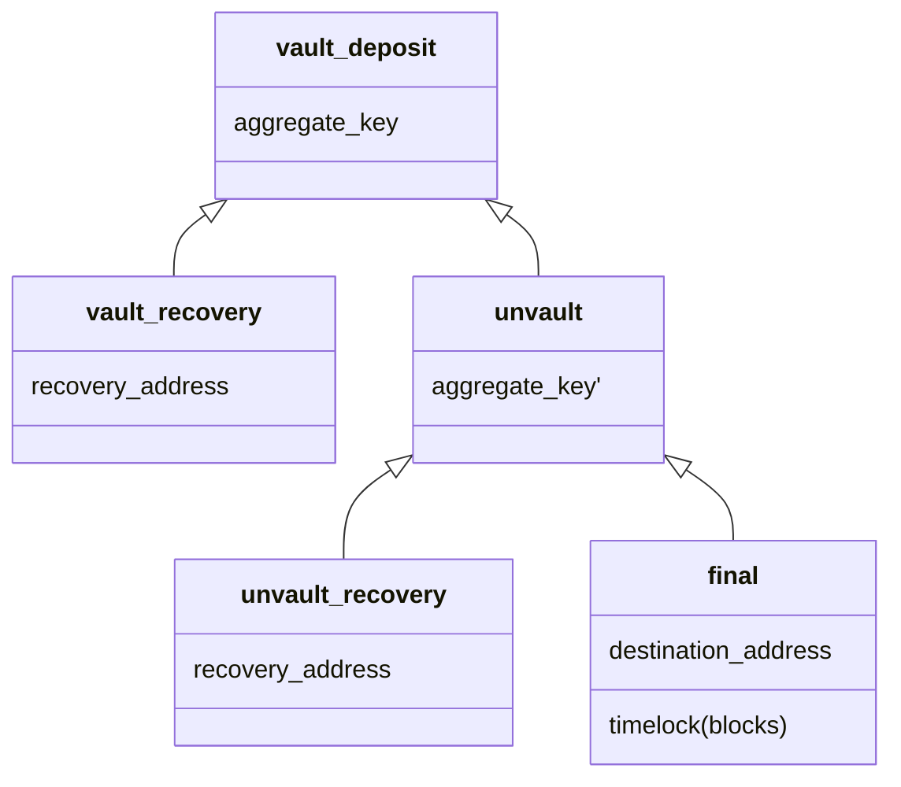
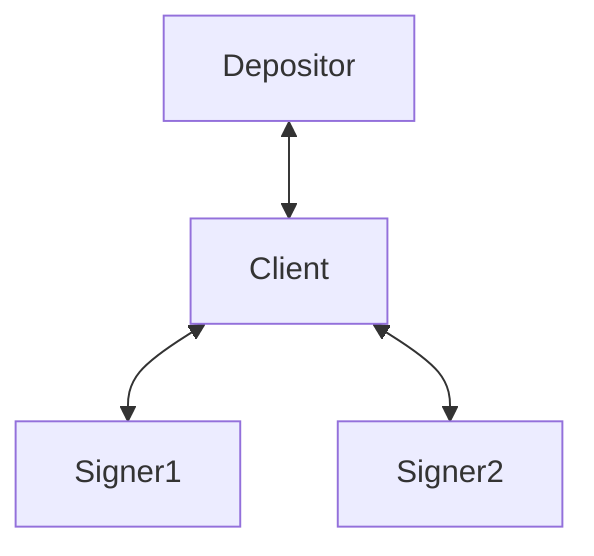

# Building a vault using blinded co-signers

halseth | 2025-12-03 12:38:19 UTC | #1

I want to announce a prototype for a design and implementation of a vault-like scheme that can be used on Bitcoin today, achieved by outsourcing the signing quorum to a set of blinded co-signers.

Unlike traditional setups involving co-signers, this scheme uses a blinded version of Musig2 to ensure the signers learn as little as possible about the on-chain movements of the funds they are involved in co-signing. 

In order to have the co-signers add to the security of the funds (and not just blindly sign whatever is thrown at them), we attach a ZK proof to the signing requests, proving that the transaction is valid according to a pre-determined policy. In this case that is the timelock of the final tx.

Looking at the graph above, the four transactions *vault_deposit, vault_recovery, unvault and unvault_recovery* will be pre-signed before funds are deposited into the vault. At the time of unvaulting, the co-signers will be asked to sign the final tx, at which point they will also require a proof that the blinded transaction they are signing has the relative timelock set correctly.  

This gives the owner of the funds an assurance that he (or a watchtower) has time to sweep the funds back into the recovery address in case of an unauthorized unvault. The scheme is safe as long as at least one of the signer's key only signs according to the protocol.

More details about the protocol and blinded signature scheme can be found here: https://github.com/halseth/blind-vault/blob/d98ad46d43c757dbf79409f5663daebd07164689/doc/vault.md

### Prototype
There's a prototype implementation of the scheme available for regtest and signet at https://github.com/halseth/blind-vault. Keep in mind that this is very much a proof-of-concept and should not be used with real funds.

Refer to https://github.com/halseth/blind-vault/blob/d98ad46d43c757dbf79409f5663daebd07164689/VAULT_TOOL.md for details of how you can test the flow using a simplified bash script.

### Proving time
Since the signers should learn nothing about the the messages they sign, the other signers or any of the parameters used during the signing session, it is all blinded by the client. This creates a challenge for the signers to verify that key and nonce aggregation is performed correctly, since this in regular Musig2 is performed by every signer. To mitigate this the client will attaches a ZK proof that shows the signers that aggregation and blinding is done according to protocol.

Proving proper Musig2 aggregation is by far the most time consuming part of the protocol, and takes around 4 minutes per tx per signer on an Apple M1 Max. I suspect this can be reduced significantly by using a more optimized ZK prover and/or a signing scheme that involves fewer EC operations. 

### Future work
The goal is to generalize this framework to be available for other policies than the vault transaction graph. I hope to also improve on the proving time to make it practically usable on less powerful devices.

Feedback is greatly appreciated!

-------------------------

Nuh | 2025-12-04 14:08:06 UTC | #2

Congratulations on the announcement, and the prototype. I loved your work on Elf trace as well.

I strongly believe in blind co-signers to emulate functionalities like these on bitcoin.

My only criticism, is that bootstrapping trust of co-signers is a tough work regardless of what they are signing, so maybe we should try to get as much leverage from them as possible, and I suggest that the most leverage would be to emulate the few Bitcoin script’s op_codes that are necessary to enable Elf-trace and other fraud proof application.

My reasoning is that doing so allow us to:

1. Build a protocol that doesn’t necessarily depend on Risc0, maybe a TEE is sufficient, if not maybe TEE + a slashable bond on another chain is good enough (if you keep the logic simple, reimplementation in Solidity/Cairo can be verifiable).
2. Make the execution of these opcodes visible on-chain, proving (or disproving) the demand for these features, as well as hopefully defeating arguments along the line of MEV.
3. Track record of honesty and liveness of co-signers

That being said, I very much want to see this project getting a lot of adoption and usage, because adoption is really the hard part for these systems, not the details of the protocol, but that is also why I hope that bootstrapping work would also help the ecosystem have good data about what opcodes deserve to be in a soft fork next.

-------------------------

halseth | 2025-12-10 14:15:51 UTC | #3

Thanks for the thoughtful reply! 

I believe the current setup can be generalized to achieve what you have in mind, by enabling more sophisticated ZK proofs to be used with the protocol.

Imagine that you can can create a taproot address that commits to a zk-verifier, and have the co-signers control this address. When spending from this address, you can prove to the co-signers that the spend is valid according to the committed policy (for instance emulating a covenant).

You can choose whatever proof system you want for this (even a TEE), as the commitment uniquely identifies it.

If the co-signers have a well-known public key, I think building some sort of reputation will be important.  When you can combine multiple highly reputable co-signers (without the co-signers knowing about each other!) you can achieve very robust quorums.

-------------------------

