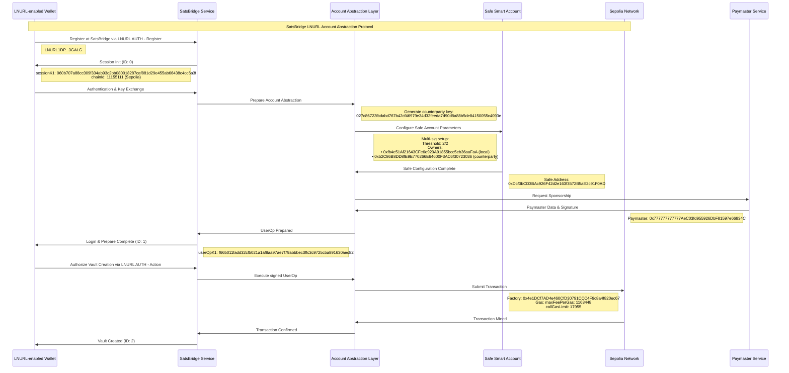

# Bitcoin Lightning Wallets as Abstracted Accounts in EVM Protocols

evd0kim | 2025-12-09 12:26:19 UTC | #1

*Disclaimer: We propose a new protocol flavor that must undergo a strict security audit before release into production.* [The early alpha version](https://vault.satsbridge.com/) *currently works on the Ethereum Sepolia testnet, Ethereum and Arbitrum and can’t work with custodial Lightning wallets. Please join our [Telegram group](https://t.me/SatsBridge) for updates and discussions.*

Bitcoin’s Lightning Network has proven that authentication can be secure, user-friendly, and easy through LNURL AUTH. It should be acknowledged that LNURL AUTH also enables air-gapping and second-factor authentication. Meanwhile, Ethereum’s account abstraction has demonstrated how smart contracts can enable sophisticated multi-signature security models and modular external signers. The convergence of these technologies presents an opportunity to create a unified cross-chain wallet architecture where Lightning Network wallets become remote signers for Ethereum accounts, enabling experienced Bitcoin users to seamlessly access the DeFi ecosystem while maintaining their preferred security model using familiar tools.

**When Lightning meets Ethereum**

The proposed protocol extends [LNURL AUTH (LUD-04)](https://github.com/lnurl/luds/blob/luds/04.md) to manage Ethereum abstracted accounts and requires no changes to Lightning wallets because it flexibly adopts programmable components provided by various Ethereum projects. Let’s consider [Safe Protocol](https://medium.com/u/d37a03e62785?source=post_page---user_mention--d2159018f7d5---------------------------------------) vaults, for instance, although during the Unite DeFi [1inch](https://medium.com/u/2c9a654f35d?source=post_page---user_mention--d2159018f7d5---------------------------------------) hackathon, SatsBridge’s team also demonstrated a way to integrate LNURL with specific implementations of account abstraction working with [1inch](https://medium.com/u/2c9a654f35d?source=post_page---user_mention--d2159018f7d5---------------------------------------) libraries. With Safe, SatsBridge backen creates a configurable vault that relies on Bitcoin’s Lightning Network QR-code-driven user experience and Ethereum’s programmable smart contract capabilities. This integration leverages the cryptographic compatibility between Bitcoin’s secp256k1 signatures and Ethereum’s signing schemes while maintaining the privacy and security properties that make LNURL AUTH effective.

The system operates through a three-layer architecture (Bitcoin L1, L2, and LNURL on top) where Lightning wallets generate domain-specific authentication keys using existing LNURL AUTH derivation mechanisms (BIP32-based or SignMessage-based). However, instead of simple web authentication, these keys become owners in Safe multi-signature vaults. The “three-layer architecture” refers to the fact that all keys are derived from the main seed phrase backing the onchain wallet, Lightning Network client, and LNURL AUTH keys.

When a user initiates the account creation process, the system generates a new Safe vault configuration as shown in the figure above. The sequence protocol diagram provides a high-level representation of interactions between the Lightning wallet as a remote signer (1), SatsBridge Frontend as a fully functional Web3 app that can provide important information for the user (2), the Account Abstraction provider (3), and Safe as a convenient platform that enables access to multisignature-based smart contracts (4). Safe’s modular architecture supports this through its signature verification system ([EIP-1271](https://eip.tools/eip/1271)), enabling the vault to validate signatures from Lightning wallets that have never directly interacted with Ethereum. This choice is dictated by the resilience of Safe and the intention to provide SatsBridge users an option to change providers after extending the vault configuration with additional signers compatible with the Safe frontend.

To begin authorization and remote signing, the Safe vault generates a UserOperation (according to the ERC-4337 standard) containing the transaction details. This UserOperation is hashed and provided to the user as an LNURL AUTH k1 challenge that commits to both the traditional 32-byte challenge as a nonce and all remaining UserOperation data.

For people not familiar with relevant Ethereum standards, the UserOperation k1 commits to:

* A nonce

* Safe Account Parameters (owners, threshold, modules, etc.)

* Transaction Details (calls, gas limits, fees)

* Chain ID (11155111 for Sepolia)

* Account Abstraction Data (factory, paymaster)

As a result, the signing process is fully deterministic in the sense that the same UserOp parameters always produce the same hash. It is chain-specific because it includes the chainId to prevent cross-chain replay attacks and covers all aspects of the transaction. The signature proves authorization for a specific UserOperation, and the signed UserOp can be submitted to the EntryPoint contract. The UserOpK1 essentially represents a cryptographic commitment to the exact transaction parameters, ensuring that users can only authorize the specific operation they intend to execute.

Authorisation (left) of the Abstracted Account creation and domain-linked authorisation key (right) in the [Valet](https://f-droid.org/packages/finance.valet/) app.

The table below provides a brief overview of the differences between a normal LNURL challenge and UserOperation’s k1 that allows integration with Account Abstraction.

Key Differences between LUD-04 k1 and UserOperation’s k1

Lightning wallets receive this enhanced LNURL challenge with k1 that commits to the UserOperation through their existing QR code scanning or deep-linking mechanisms. The wallet derives the appropriate signing key using the same domain-specific derivation that ensures each Safe vault has a unique identity relationship with the Lightning wallet and a provider on the Lightning side, for example, SatsBridge.

Safe vaults accessed via SatsBridge and managed by Lightning wallets enable comprehensive Ethereum ecosystem access while maintaining the security properties Lightning users expect. Gas abstraction through ERC-4337 eliminates the need for users to hold ETH for transaction fees, as paymasters can sponsor transactions or accept ERC-20 token payments. This architectural choice removes a significant barrier to DeFi adoption for Bitcoin-native users and allows more flexibility when their peers demand payments in non-Bitcoin tokens. At the same time, additional features may increase security when interacting with DeFi.

**Perils of the blind signing**

Despite major UX and UI conveniences and a sophisticated security stack including battle-tested standards, the LNURL-AA specification faces the same fundamental vulnerability that enabled the $1.5 billion Bybit hack. Lightning Network wallets cannot reliably display the actual state of vaults because they cannot deserialize and display Ethereum transaction data and AA UserOperation structure by default.

Lightning wallets like Phoenix, [Valet](https://f-droid.org/packages/finance.valet/), and BlueWallet display LNURL AUTH challenges as simple signing requests without a detailed transaction context. When extended to Ethereum transactions, these wallets would show users cryptographic hashes and request signatures for operations they cannot fully understand. The wallet displays might show “Sign Ethereum transaction: 0x4f2ac7…” without revealing that the transaction transfers all vault assets to an attacker’s address. Our solution here is to propose an actual open-source Web3 paired app served by SatsBridge that will allow users to have the highest possible level of protection when it comes to situational awareness and LNURL-AA protocol interactions. Going further, we could consider a self-hosted open-source application stack that could work alongside widely adopted personal nodes such as Umbrel or StartOS. In the best-case scenario, the client doesn’t blindly trust the server’s UserOpK1 anymore, and any manipulation by the server would be caught during validation. The client essentially performs a “trust but verify” approach.

The AA-aware application design, for smartphones. Bitcoin Wallet scans QR codes on the left, and the SatsBridge Vault application shows account balances and UserOperation k1 payload, so the user does not sign blindly anymore.

Another workaround could involve adding Metamask as another co-signer wallet. For obvious reasons, Metamask better supports the set of required standards that have allowed Ethereum wallets to become relatively safe options for interacting with sophisticated smart contracts. ERC-4337 UserOperations are actually complex structures. They contain multiple fields (callData, signature, paymasterAndData) that are encoded as opaque byte strings. Furthermore, Ethereum smart contract interactions often involve complex nested function calls with parameters that determine the actual operation outcome. For instance, a Uniswap swap contains a “to” parameter specifying the recipient address. If this parameter is changed from the user’s address to an attacker’s address, Lightning wallets cannot detect this manipulation because they cannot parse the transaction’s internal structure, though this may be sufficient for the basic functionality of receiving and sending tokens non-custodially and without a native asset.

Sending USDCs via LNURL-Account Abstraction. Similar [demo on Nostr](https://njump.to/nevent1qqsfmxdfrl2fgf6vvjljm6xepdzw4pseqxxxsr9klxapta5uexjyhpspr4mhxue69uhkummnw3ezucnfw33k76twv4ezuum0vd5kzmp0qgsfxrt9p8s99z4qct8z9krrnwgxrxvgwaz5g69u4sflnfp5xkqy75qrqsqqqqqpecnwm3)

Advanced implementations could use multiple independent verification channels where Lightning users confirm transaction details through separate networks before signing. The first obvious candidate here would be Etherscan as a source of information about the current Ethereum state, but even experienced users may have difficulty understanding what actually happened in the chain of contract calls. Another approach would be to choose the Safe platform as the main platform for creating vaults and leverage its features for delivering more situational awareness to SatsBridge users for better security. Future research aims to find a reliable way to enable secure operations with vaults from any Lightning wallets available on the market.

The Bitcoin space would benefit from experience accumulated in Ethereum when it comes to user-smart-contract interactions, although Bitcoin smart contracts are likely to be very different from what we know in Ethereum. In Ethereum, standards like EIP-712 enable structured message signing that could include both transaction data and human-readable descriptions in a single cryptographically verifiable package. Lightning wallets could verify these signatures using their existing cryptographic capabilities while displaying verified transaction descriptions to users. Fortunately, the entirely off-chain nature of the Lightning Network allows lots of experimentation to be done in the short term and new protocols to be built overnight. The development there is less problematic, and Bitcoin Core gives a clear example of how even a small feature such as message signing, which is not related to consensus, could easily[ get stuck](https://github.com/bitcoin/bitcoin/pull/24058) and remain unfinished for years.

To conclude the post, we evaluate the LNURL-AA protocol as one of the interesting opportunities to connect very different networks for the benefit of users who wish to stay close to their favorite wallets. SatsBridge’s early experiments included research related to embedding non-custodial Lightning wallets into Metamask, and we believe that going in a different direction with LNURL-AA has more flexibility and therefore more chances for success. We thank Pimlico and personally Sergey Potekhin for consultations and continuing support when we needed validation and endorsement.

*Please join our [Telegram group](https://t.me/SatsBridge) for further updates and discussions.*

Authors: Ilya Evdokimov, Sergey Sherkunov

-------------------------

