# Ciphera - a Bitcoin ZK Appchain Implementation

evd0kim | 2026-02-24 14:54:52 UTC | #1

### Summary 
In the previous piece, ["ZK-Statechains Without States,](https://delvingbitcoin.org/t/zk-statechains-without-states/2166)" we outlined the idea of combining statechain peg-in/out mechanisms for ZK-rollups. This post further expands into a specific protocol implementation that leverages a zerocash transaction architecture for private transfers using Aztec Barretenberg circuits. The network may consist of validators, provers, regular nodes, and [blind signers](https://delvingbitcoin.org/t/building-a-vault-using-blinded-co-signers/2141/3), which can operate independently of each other. The existing prototype implements a simplified blind vault setup and employs RISC Zero circuits for pre-signing transactions and withdrawals. Additionally, we deploy a federation for our bridge model versus other rollup-style bridges (i.e. BitVM2). With further modifications, we believe we can see the user have a signing key in the blind vault as well as see the user be able to transfer ownership of the vault making it similar to a Mercury Layer-style transfer.  In this model, the user becomes a co-signer in the vault with relative timelock verification either via RISC Zero circuits or during private note transfer. The ZK-rollup design may be extended with additional circuits to support specific smart-contracting functions. It may be for example, collateral management. The project is built on top of the Bitcoin Development Kit library and reuses code and components from the [blind vault project](https://delvingbitcoin.org/t/building-a-vault-using-blinded-co-signers/2141) by @Halseth. 

[GitHub Ciphera Chain](https://github.com/zerosats/ciphera-appchain).

### Network Entities

The minimal configuration of our network consists of two entities: one validator and one prover.

Validators are the core participants in the consensus process. Their responsibilities include block approval, leader rotation, and consensus participation. In the original design (which is a rollup on top of Polygon PoS), each validator must accumulate approvals from a majority (>2/3) of validators for a block to be finalized. We maintained this requirement for our  Bitcoin implementation. Validators, along with provers, represent signing entities in the BDK-based multisignature wallet. They facilitate finalization of PSBT transactions and post state root hashes on-chain using OP_RETURN outputs.

Provers are responsible for generating aggregated validity proofs using the Aztec Barretenberg backend. They create cryptographic proofs that aggregate multiple UTXO transaction zero-knowledge proofs into a single proof. Due to our use of a federated bridge model, we do not post state differentials to a separate data availability solution, simply because our network may be open to new listening nodes that can collect proofs and maintain a common mempool.

The prover can run in full proving mode or mock prover mode (for testing). A non-validator, full node entity handles block storage, propagation, and transaction processing. In some configurations, signers who authorize vault creation, pre-signed backup transactions, and burns may use a node configuration for listening to the network and verifying state update commitments in Bitcoin blocks.
Network Liveness and Safety
The original ZK-rollup design treats the rollup as an isolated BFT system that happens to post proofs to its underlying L1 (Polygon PoS). It leverages Doomslug/Solid-style consensus, which works well when the network is well-connected. But, this creates brittle failure modes during partitions. In our new design, these consensus engines were removed, and a directed acyclic graph (DAG)-like structure is used for resolving potential competing proofs and avoiding network failures inside bitcoin’s long, expected 10 minute block interval. The proposed tail-based design reframes the rollup as a Bitcoin-anchored system in which the rollup produces candidate state transitions while Bitcoin provides the global ordering and fork-choice rule.
Nodes maintain flexibility until Bitcoin "confirms" which branch is canonical. There is no global mempool state; each node has its own mempool for both Bitcoin and the rollup network. Moreover, these state transactions may not only be unconfirmed, but potentially not even signed. This means they exist solely in the validator's local memory and not in any mempool.
This is why the node doesn't wait for signatures when processing rollup blocks. It forms the next state and immediately returns control to the higher-level code that invoked block processing. That same code can then invoke processing of the next block, and it will similarly form the next state and return control without waiting for signatures on the previous state. Signing blocks is a purely asynchronous operation.
This is philosophically similar to how optimistic rollups work on Ethereum (fraud proofs with challenge periods), but adapted for proof-of-work's probabilistic model. The result is a system that inherits Bitcoin's liveness properties while maintaining the safety guarantees of ZK proofs.
In the current implementation, the DAG serves the purpose of algorithmically resolving conflicting state updates. It guarantees minimal liveness but cannot ensure safety in the broad consensus sense because the network currently lacks a proper consensus implementation. It remains to be shown whether the ZK-rollup network could benefit from a DAG for soft-settlement guarantees and implementation of prover coordination algorithms for decentralized UTXO aggregation.

### Mints and Burns

Due to the expressiveness of rollup smart contracts on Ethereum, they can successfully manage various tasks and provide interfaces to verifier contracts (e.g., AggregateVerifier) to validate submitted proofs. Other tasks include tracking the current root hash of the rollup's Merkle tree, deposits/mints, and withdrawals/burns. The contract also stored a validator set, which helped with network coordination.

In the Bitcoin-based design, the rollup module implicitly tracks the validator set via a dedicated multisignature wallet. Bitcoin transactions also help track the true root hash of the rollup's Merkle tree. Beyond that, the Bitcoin rollup smart contract does not allow any extra features in its current design. While deposited funds could be stored in a single UTXO of the rollup contract, we chose a different approach for privacy reasons and for technical feasibility.

We also enabled future upgrades to designs that include depositors as co-signers in a covenant "simulated" by a blind vault and a selection of pre-signed transactions. The recently proposed [BLISK](https://delvingbitcoin.org/t/blisk-boolean-circuit-logic-integrated-into-the-single-key/2217/3) appears to be a promising approach for constructing sophisticated policies, including threshold schemes involving fewer validator keys than needed for securing consensus and a transitory key in the vault ownership transfer scheme. [Sigbash](https://github.com/arbedout/sigbash_v2) deserves to be mentioned too and it appears to be very close to the Blind vault proposal we have used in the present work. 

The figure below illustrates the existing flow for blind signers. The "Statecoin TX" transaction has not been implemented to date for the sake of simplicity and due to the federated on/off ramp model. When depositing into a vault, the user also receives a backup transaction that allows them to spend from this vault after one block-year. This feature was introduced for experimentation and illustrates the flexibility of blind vaults and pre-signed transactions when it comes to potential contingency scenarios. If the user hasn't moved funds on the rollup, on-chain coins can be recovered. This scheme could work when the rollup employs a market-based approach for on/off-ramping (similar to Signet on Ethereum). When a deposit (on-ramping user) after an undetermined amount of time finds a corresponding burn request (off-ramping user) and funds can be directly withdrawn during an atomic swap.

```mermaid
stateDiagram-v2
direction LR
[*] --> UserUTXO: User has funds

state "👤 User UTXO" as UserUTXO {
[*] --> Spendable
Spendable: P2TR (single sig)
Spendable: Amount 1.0 BTC
}

state "🏦 Statecoin Vault" as VaultUTXO {
[*] --> Locked
Locked: P2TR (MuSig2 2-of-2)
Locked: Amount 0.999 BTC
Locked: Spending requires blind signatures
}

state "⏳ Pre-signed Backup" as UnvaultUTXO {
[*] --> Timelocked
Timelocked: P2TR (MuSig2 2-of-2)
Timelocked: Amount 0.998 BTC nSequence 144 blocks
}

state "✅ User" as Destination {
[*] --> Received
Received: User controlled
Received: Amount 0.997 BTC
}

state "♻️ Mint Recovery" as Recovery {
[*] --> Safe
Safe: Cold storage
Safe: nSequence 52560 blocks
}

UserUTXO --> VaultUTXO: Deposit TX
VaultUTXO --> Recovery: Vault Recovery TX (rollup network stops)
VaultUTXO --> Destination: Burn TX (valid SNARK)

VaultUTXO --> UnvaultUTXO: Statecoin TX (blind signed)
```




The transaction flow described above may be initiated using a special "ciphera-cli" tool that allows simple Bitcoin key management and Ciphera chain note management, and implements a simple client for the Ciphera network. The tool contains some parts of the blind vault project by Halseth, namely the "wallet" and "depositor" components. It interacts with the Ciphera node API, which provides coordination for blind signing.


The original ZK-rollup mechanisms for preventing double-spends during minting and burning were preserved for the Bitcoin version. The UTXO circuit contains conditional blocks that separate rules by note kind and allow verification of specific transactions related to the creation and destruction of private notes.

```
   if (kind == 1) {
        //SEND
        assert(input_value == output_value, "Input and output totals do not match");
    } else if (kind == 2) {
        // MINT
        // Assert mint utxo is balanced:
        //   - `output_value` is checked above
        //   - `input_value` is checked as it must have previously been an output value
        //   - `msg_value` is checked above (but also using that to overflow would be detrimental to the
        //      attacker)
        assert(output_value == input_value + msg_value, "Mint output must match value message");
        // Assert mint hash
        assert(mint_hash == msg_hash, "Mint hash must match message");
        // Assert note kind
        assert(output_notes[0].kind == msg_note_kind, "Mint note kind must match message")
    } else if (kind == 3) {
        // BURN
        // Prevent frontrunning the txn and changing the evm address
        assert(pmessage4 == burn_addr, "messages[4] must match private input");
        // Assert burn hash
        assert(burn_hash == msg_hash, "Burn hash must match message");
        // Assert burn utxo is balanced:
        //   - `output_value` is checked above
        //   - `input_value` is checked as it must have previously been an output value
        //   - `msg_value` is checked above
        assert(input_value == output_value + msg_value, "Burn output must match value message");
        // Assert burn kind
        assert(input_notes[0].note.kind == msg_note_kind, "Burn note kind must match message")
    } else {
        assert(false, "Invalid kind");
    }
```

For EVM transactions, note burns include commitments to the withdrawal address, while mints are simply received via regular token transfer. For Bitcoin, due to Barretenberg's use of the BN254 curve, Schnorr public keys cannot be directly committed to because of curve limitations. We have a prototype library for handling Bitcoin-specific cryptographic primitives but it is not tested yet and to be released soon. The key corresponding to the user's address may exceed the BN254 field modulus, overflowing public input messages in circuit arguments. It is possible to commit to pre-Taproot script pubkeys, but this option was rejected due to the associated privacy implications.

```
pub struct Note {
    pub kind: Field,
    pub value: Field,
    pub address: Field,
    pub psi: Field,
}
```

For Taproot public keys, the solution was to split keys into two 16-byte parts and place them in two note fields, which are 254-bit elements. In this way, we reused the "Kind" (“Contract address”) and "Psi" fields.

```
   pub fn new_mint(output_notes: [Note; 2], mint_address: Option<Element>) -> Self {
        Self {
            kind: UtxoKind::Mint,
            input_notes: [InputNote::padding_note(), InputNote::padding_note()],
            output_notes,
            address: mint_address,
        }
    }
```

For burns, the situation demanded a different approach due to the circuit design. The "Psi" field outputs of burn transactions were used to place burn addresses. According to the circuit, burn output "Kind" fields must be checked against the inputs, meaning that minting and burning are tied to the creation and destruction of the corresponding vault.

```
   pub fn new_burn(
        input_notes: [InputNote; 2],
        burn_address: Element,
        vault_elem1: Element,
        vault_elem2: Element,
    ) -> Self {
        let output1 = Note {
            kind: Element::ZERO,
            contract: Element::ZERO,
            address: Element::ZERO,
            psi: vault_elem1,
            value: Element::ZERO,
        };
        let output2 = Note {
            kind: Element::ZERO,
            contract: Element::ZERO,
            address: Element::ZERO,
            psi: vault_elem2,
            value: Element::ZERO,
        };
        Self {
            kind: UtxoKind::Burn,
            input_notes,
            output_notes: [output1, output2],
            address: Some(burn_address),
        }
    }
```

Since it is possible to commit an entire public key into a mint note, note creation is more straightforward than burns on the backend side. This is closer to the original Polygon PoS implementation. Upon receipt of the Ciphera note proofs, the validator extracts the public key and converts it into a script pubkey for requesting the confirmed balance from the indexer. If the UTXO amount is equal to the mint note value, validators approve the transaction in the new block, and the new note becomes included in the state; otherwise, it is rejected. Using "ciphera-cli," the flow for mints is a three-step process: 1) the user creates a new blind vault and checks the vault backup transaction; 2) coins must be sent to this address, and the amount must match—otherwise nothing will be minted on the Ciphera; 3) new mint note proofs must be created client-side and submitted to the Ciphera validator. Unless rollup operators are malicious, the user always receives funds back. If we assume a spending policy where the user's key blocks spending (as in statechains), rollup operators cannot spend from the blind vault.

The simplest naive implementation of burns requires the node to know two Taproot addresses during verification of the burn note proof. The first is the blind vault address and the second is the recipient address; together, they require four 254-bit element variables to represent. A more advanced approach (from a privacy standpoint) could rely on a shorter vault creation session identifier represented via a single element variable. This must be stored by all signers and requires persistent state, which has not been implemented to date. For convenience, "ciphera-cli" uses "vault-state.json" for loading the current session and submits a request for spending from the vault along with the prepared burn proof. The node checks whether the burn proof is valid, coordinates signing of the vault exit, broadcasts the transaction, and then submits the burn proof to the network.

Mint and burn note kinds are implicitly connected via the UTXO circuit because they share the same first 16 bytes of the vault's public key. Changes made:

```
input_notes[i].note.kind == msg_note_kind
```

Such linkage is convenient for prototyping a Bitcoin ZK-rollup, albeit it makes private notes non-fungible. The NFT model appears disadvantageous from a privacy standpoint; however, it may be a more convenient way to think about potential applications within the ZK-rollup, such as exchanges or lending protocols. Users ultimately have a validation mechanism at their disposal for all data they receive peer-to-peer.
Conclusion
The current implementation of the Ciphera chain is closer to a sidechain model with federated custody with a novel vault implementation that ensures users have a pre-signed exit transaction in the event of liveness failures. The upgrade to a statechain-like model, where users have a signing key in the vault set up, requires more research iterations and deeper security analysis. The Ciphera chain serves as a working prototype for an eventual zero-knowledge rollup on top of Bitcoin that supports zerocash-style payments. Aztec's Barretenberg backend, which provides proof generation and verification, may be ported to RISC-V, meaning that RISC Zero could serve as a wrapper for generating Groth16 proofs for BitVM-type bridges. At present, we feel this approach appears to have no technical advantages over the blind vault model, which is simpler, more flexible, and cheaper than any known BitVM versions. As more Musig-based solutions like BLISK or Sigbash are getting introduced, we believe that building dedicated vaults with sophisticated policies and tracking UTXO subsets or implementing SPV clients off-chain could improve trust assumptions of sidesystems.

-------------------------

