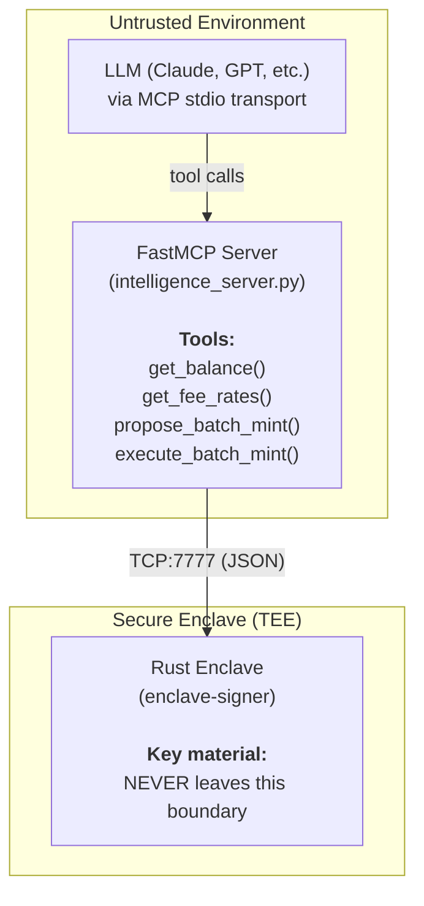
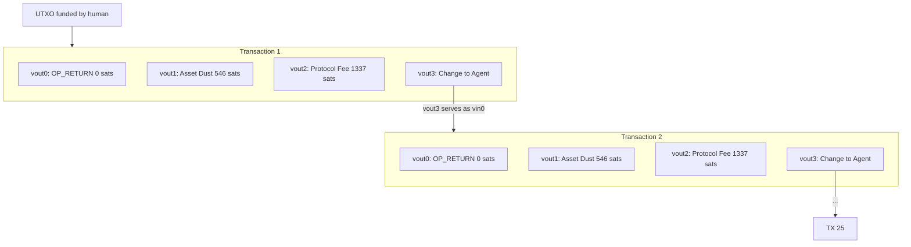

# Letting Untrusted LLMs Sign Bitcoin Batches: MCP Bridge + TEE-Enforced 25-Tx Daisy Chains

Laz1m0v | 2026-04-11 11:11:20 UTC | #1

# Agentic Asset Execution Layer for PRECOP: Multi-Asset MCP Bridge, Daisy-Chain Batching, and On-Chain Identity Rotation
## Abstract

This is a companion post to [TEE-Hardened Autonomous Agent Wallet with Simplicity Pre-Execution](https://delvingbitcoin.org/t/tee-hardened-autonomous-agent-wallet-with-simplicity-pre-execution/2377), where we presented the PRECOP architecture: a TEE Guardian that embeds the Simplicity Bit Machine (`simplicity-unchained` v1.9.2) to enforce covenant logic locally before generating BIP-341 Schnorr signatures.

That post focused on the cryptographic substrate - the 5-Leaf MAST, the Astrolabe state encoding, the division-free ratio enforcement via 128-bit cross-multiplication, and the Soft→Hard Covenant upgrade path.

This post addresses the layer above: **how does an untrusted AI agent actually drive the Enclave in production?** We present the concrete implementation of the Intelligence Layer - a Model Context Protocol (MCP) bridge that allows an LLM to construct, validate, and broadcast complex transaction sequences across multiple asset classes (Runes, BRC-20, or even cross-chain ERC-20 distributions) without ever touching key material. We demonstrate this under real adversarial conditions: 25-transaction daisy-chained batch operations on Bitcoin, where the agent must manage UTXO graphs, mempool timing, protocol fee enforcement, and on-chain identity rotation autonomously.

The complete codebase is published at: [GitHub - L1-AGENT-WALLET](https://github.com/Laz1mov/L1-AGENT-WALLET)

---
## 1. Motivation: The Execution Gap
The PRECOP post established that the Guardian architecture - `Untrusted Intent → TEE → Simplicity Bit Machine → BIP-341 Signature` - can enforce arbitrary spending constraints on an autonomous agent. But this leaves a practical question unanswered: what does the "Untrusted Intent" look like in practice?
Consider the concrete problem of automated asset operations. Whether minting 25 Runes, dropping a BRC-20 collection, or distributing ERC-20 tokens via a cross-chain bridge, a single operation requires:
1. Querying a mempool or blockchain API for current fee rates and the agent's account state.
2. Selecting the optimal funding source (e.g., largest confirmed UTXO).
3. Constructing the asset payload: serializing a Runestone, a BRC-20 JSON envelope, or an RLP-encoded EVM transaction.
4. Building a transaction with strict compliance: fee distribution, change calculation, and output ordering.
5. Submitting the unsigned payload/PSBT to the Enclave for policy validation and signing.
6. Broadcasting and waiting for confirmation before constructing the next dependency in the chain.
Now multiply this by the complexity of adversarial mempool conditions. A single arithmetic error in change calculation or a single output ordering mistake breaks the entire sequence. This is a graph construction problem that is technically predictable but operationally unsuitable for manual execution - exactly the domain where an AI agent excels and where a TEE-hardened policy engine is mandatory.
The question is not whether the agent *can* construct this graph (it can, reliably). The question is: **how do we ensure the Enclave validates every output of every transaction before signing, and how do we give the human a meaningful authorization checkpoint before the chain fires?**
---
## 2. The MCP Bridge: Zero-Trust Agent-to-Enclave Communication
### 2.1 Architecture
The MCP (Model Context Protocol) bridge is a Python FastMCP server that exposes the Enclave's capabilities as tool calls for any MCP-compatible LLM. The bridge communicates with the Rust Enclave over TCP (port 7777) using a simple JSON wire protocol:

The critical design constraint: **every tool that modifies state (signing, broadcasting) requires an out-of-band human authorization.** The MCP server cannot autonomously sign and broadcast. The human must sign the `BatchManifest` with their own wallet (ECDSA via Unisat/Xverse/Ledger), and the Enclave verifies this signature before proceeding.
### 2.2 The Tool Surface
The MCP server exposes two categories of tools:
**Intelligence tools (read-only, no human approval needed):**
```python
@mcp.tool()
def get_balance() -> str:
    """Queries the mempool API for the agent's UTXO set."""
    addr = _agent_address()
    utxos = _get(f"/address/{addr}/utxo")
    confirmed = [u for u in utxos if u.get("status", {}).get("confirmed")]
    total = sum(u["value"] for u in utxos)
    # ... format response
@mcp.tool()
def get_fee_rates() -> str:
    """Returns current network fee rates for various priorities."""
    fees = _get("/v1/fees/recommended")
    # Returns: Next Block, ~30min, ~1h, Economy, Min Relay
```
**Operations tools (require Master Mandate signature):**
```python
@mcp.tool()
def propose_batch_mint(asset_id: str, count: int,
                       asset_type: str, # "runes", "brc20", or "cross-chain"
                       destination_address: str,
                       fee_rate: Optional[int] = None) -> str:
    """
    Generates the Master Mandate JSON for human signature.
    Supports Runes by name and BRC-20 by ticker.
    Does NOT sign or broadcast anything.
    """
    # 1. Fetch agent address from enclave
    addr = _agent_address()
    
    # 2. Budget estimation (Asset dependent)
    cost_per_tx = 546 + 1337 + int(160 * fee_rate)
    total_required = cost_per_tx * count
    
    # 3. UTXO sufficiency check
    utxos = sorted(_get(f"/address/{addr}/utxo"),
                   key=lambda x: x["value"], reverse=True)
    if utxos[0]["value"] < total_required:
        return f"Error: Insufficient budget."
    
    # 4. Forge deterministic manifest
    manifest = OrderedDict([
        ("batch_id",            hashlib.sha256(...).hexdigest()[:12]),
        ("count",               count),
        ("total_fee_sats",      total_required),
        ("fee_rate",            int(fee_rate)),
        ("asset_type",          asset_type),
        ("asset_id",            asset_id),
        ("protocol_address",    addr),
        ("destination_address", destination_address)
    ])
    
    # 5. Write to MANDATE.json (avoids terminal wrapping corruption)
    manifest_json = json.dumps(manifest, separators=(',', ':'))
    with open(os.path.join(ROOT_DIR, "MANDATE.json"), "w") as f:
        f.write(manifest_json)
    
    return "📜 MASTER MANDATE GENERATED. Sign MANDATE.json with your wallet."
```
The `MANDATE.json` file is written to disk specifically to avoid a subtle failure mode: terminal display often introduces visual line-breaks in long JSON strings, which corrupts the signature when copied. The human always copies from the file, not the terminal.
### 2.3 Wire Protocol
The Agent-to-Enclave communication uses a minimal JSON-over-TCP protocol. Each request is a single JSON object sent as raw UTF-8; each response is a single JSON object received on the same connection. For cross-chain assets like ERC-20, the Enclave accepts RLP-encoded transaction blobs instead of PSBTs.
**Request types:**
| Type | Required Fields | Auth | Description |
|------|----------------|------|-------------|
| `GetPolicy` | - | None | Returns address, scriptPubKey, policy state |
| `SignTransaction` | `psbt_base64`, `amount_sats` | Allowance | Single-tx, policy-gated |
| `SignBatchChain` | `psbt_base64`, `batch_manifest`, `mandate_signature` | Mandate | 25-tx daisy-chain |
| `SignLegacySweep` | `psbt_base64` | None (BIP-86) | Legacy sweep, no MAST tweak |
| `UpdatePolicy` | `new_*_policy`, `upgrade_proof` | Governance | Policy mutation |
**Response types:**
| Type | Key Fields |
|------|-----------|
| `Policy` | `address`, `script_pubkey_hex`, `policy` |
| `Signature` | `signature_hex`, `signed_psbt_base64`, `txid`, `raw_hex` |
| `BatchSignature` | `signed_batch_psbts` (array of finalized raw hex) |
| `Error` | `error` (human-readable, includes PolicyViolation details) |

The bridge (`bridge.py`) implements VSOCK support (AF_VSOCK, CID-based addressing) with TCP fallback, enabling deployment inside AWS Nitro Enclaves where the Enclave process runs in a separate VM with no network access - communication happens exclusively over the VSOCK channel:
```python
def _make_socket(host: str, port: int, vsock_cid: Optional[int] = None):
    if vsock_cid is not None:
        try:
            sock = socket.socket(AF_VSOCK, socket.SOCK_STREAM)
            sock.connect((vsock_cid, port))
            return sock
        except OSError:
            pass  # Fallback to TCP
    sock = socket.socket(socket.AF_INET, socket.SOCK_STREAM)
    sock.connect((host, port))
    return sock
```
---
## 3. The Daisy-Chain Engine: 25-Transaction Batch Signing for Any Asset
### 3.1 Transaction Graph Structure
The batch mint (whether Runes, BRC-20, or other asset standard) constructs a linear UTXO graph where each transaction's sole input is the previous transaction's change output (`vout[3]`):

### 3.2 The Signing Loop
The entire chain is signed atomically inside the Enclave in a single `sign_batch_chain` call. This is critical - the agent never sees intermediate signed transactions. The Enclave constructs, validates, and signs all 25 transactions internally, ensuring that every output script conforms to the requested asset standard:
```rust
// signer.rs - sign_batch_chain (core loop)
for i in 0..manifest.count {
    // 1. Build Asset Payload (Runestone, BRC-20 JSON, or EVM RLP)
    // Example for Runes, but abstracts to any OP_RETURN or witness payload
    let mint_request = MintRequest {
        mint_id: Some(manifest.asset_id.clone()),
        amount: 0,  // "all unallocated" per asset spec
        recipient_output: Some(1), // Asset dust at vout[1]
        ..
    };
    let payload_script = payload_forge::build_payload_script(manifest.asset_type, &mint_request)?;
    // 2. Construct outputs - ordering is consensus-critical
    let outputs = vec![
        TxOut { value: Amount::ZERO,          script_pubkey: payload_script },
        TxOut { value: Amount::from_sat(546), script_pubkey: destination_spk },
        TxOut { value: Amount::from_sat(1337),script_pubkey: protocol_fee_spk },
        TxOut { value: Amount::from_sat(0),   script_pubkey: self_spk }, // placeholder
    ];
    // 3. Calculate change exactly
    let spent = 546 + 1337 + (160 * manifest.fee_rate as u64);
    if input_value < spent {
        anyhow::bail!("Insufficient funds at step {}", i);
    }
    tx.output[3].value = Amount::from_sat(input_value - spent);
    // 4. Compute sighash with MAST merkle root tweak
    let spend_info = self.get_taproot_info(policy);
    let sighash = cache.taproot_signature_hash(
        0, &Prevouts::All(&prevouts),
        None, None, TapSighashType::All
    )?;
    let sig = self.sign_schnorr(msg_hash, spend_info.merkle_root());
    // 5. Chain to next transaction
    current_outpoint = OutPoint { txid: tx.compute_txid(), vout: 3 };
    current_input_utxo = tx.output[3].clone();
}
```
**Key invariants enforced by the Enclave:**
- **Payload hygiene**: The `OP_RETURN` or witness script carrying the asset data is carefully constructed to prevent accidental burns. Any non-zero value on an metadata output triggers a `PolicyViolation` trap.
- **Protocol fee governance**: The `protocol_fee_spk` is hardcoded in the Rust binary - not provided by the agent. The agent cannot redirect protocol fees.
- **Asset delivery destination**: The `destination_address` comes from the `BatchManifest`, which was signed by the human via the Master Mandate. The Enclave verifies the mandate signature before signing any transaction.
- **Change address integrity**: The change output's `script_pubkey` is derived from `self.get_script_pubkey(policy)` - the Enclave's own MAST-tweaked P2TR address. The agent cannot substitute a different change address.
### 3.3 The Asset Payload Forge (Runes, BRC-20, etc.)
Asset encoding (like Runestones or BRC-20 JSONs) is forged directly inside the Enclave, with no external binary dependency. This ensures that the agent cannot inject malicious payloads that would drain funds or violate protocol rules.
```rust
// payload_forge.rs
pub fn build_payload_script(asset_type: &str, request: &MintRequest) -> anyhow::Result<ScriptBuf> {
    match asset_type {
        "runes" => {
            let mut runestone = Runestone { etching: None, pointer: None, edicts: vec![], mint: None };
            // ... configure Runestone mint
            Ok(runestone.encipher()) 
        },
        "brc20" => {
            // Forge BRC-20 Transfer JSON: {"p":"brc-20","op":"transfer","tick":"...","amt":"..."}
            let json_payload = format!(r#"{{"p":"brc-20","op":"transfer","tick":"{}","amt":"0"}}"#, request.tick);
            Ok(bitcoin::script::Builder::new()
                .push_opcode(opcodes::all::OP_RETURN)
                .push_slice(json_payload.as_bytes())
                .into_script())
        },
        _ => anyhow::bail!("Unsupported asset type"),
    }
}
```
The forge also enforces protocol-specific guards, such as the **mainnet name unlock schedule** for new Runes:
```
unlock_height = 840,000 + (13 - letter_count) × 17,500
```
Names with fewer than 13 letters (excluding bullet spacers `•`) are rejected if `current_height < unlock_height`. This is network-aware: the guard is active only when `BITCOIN_NETWORK=mainnet`. For BRC-20, the forge validates JSON schema and ticker length before allowing the manifest to proceed.
The `amount: 0` idiom (used in the Runes implementation) deserves emphasis: it means "send all unallocated Runes from this mint to the specified output." This eliminates the need to know the exact mint amount at transaction construction time—the protocol handles the allocation internally.
### 3.4 The Master Mandate: Human Authorization Checkpoint
Before the Enclave signs any batch, it verifies a Master Mandate - an ECDSA signature over the deterministic JSON manifest, produced by the human's wallet. This manifest specifies the batch size, the destination address, the fee rate, and the asset type (Runes, BRC-20, or a cross-chain contract).
```rust
pub fn verify_master_mandate(
    &self, manifest: &BatchManifest,
    signature_str: &str, master_pubkey_hex: &str
) -> anyhow::Result<()> {
    let serialized = serde_json::to_string(manifest)?;
    
    // Bitcoin Signed Message format (Unisat/Xverse/Ledger compatible)
    if let Ok(sig_bytes) = base64::decode(signature_str) {
        if sig_bytes.len() == 65 {
            let msg_hash = self.hash_bitcoin_message(&serialized);
            let recovered = self.secp.recover_ecdsa(&msg, &recoverable_sig)?;
            let (recovered_xonly, _) = recovered.x_only_public_key();
            
            if recovered_xonly != expected_xonly {
                anyhow::bail!("Mandate Mismatch");
            }
            return Ok(());
        }
    }
    // Fallback: raw BIP-340 Schnorr (hex)
    // ...
}
```
The manifest is hashed using `\x18Bitcoin Signed Message:\n` prefix (the standard Bitcoin `signmessage` format), ensuring compatibility with existing wallet UIs. The Enclave recovers the signer's public key from the signature and verifies it matches the `MASTER_HUMAN_PUBKEY` stored in the sealed policy.
This is the "Sovereign Handshake": the AI proposes a batch (manifest), the human reviews and signs it, the Enclave verifies and executes. The human does not need to construct or inspect individual PSBTs - they authorize the *intent* (asset, batch size, destination, fee rate), and the Enclave handles the *execution* under its own policy constraints.

---
## 4. On-Chain Identity Rotation
### 4.1 The Problem: Script Path Reveal
Under normal operation, the agent spends via the Taproot key path - a single Schnorr signature that is indistinguishable from any P2TR spend. The MAST tree (recovery, allowance, governance leaves) is never revealed.
However, if the human uses the recovery path (Leaf 0: `<master_pubkey> OP_CHECKSIG`) to sweep funds - for example, during an emergency - the script path spend reveals the leaf script and control block in the witness:
```
Key path spend:    witness = [schnorr_signature]                     (1 element)
Script path spend: witness = [signature, leaf_script, control_block]  (>1 element)
```
Once a script leaf is revealed, the MAST structure is partially exposed. This is not a security failure (the remaining leaves are still hidden behind hash preimages), but it degrades privacy. An observer can now distinguish this address from a standard single-key P2TR.
### 4.2 Automated Rotation
The batch orchestrator (`sovereign_batch_mint.py`) performs an on-chain identity audit before every batch:
```python
def audit_on_chain_exposure(address: str) -> bool:
    """
    Scans the address's transaction history.
    Rule: len(witness) > 1 in any confirmed input spending from
    this address means a script path was used - identity is BURNED.
    """
    txs = requests.get(f"{API_URL}/address/{address}/txs").json()
    for tx in txs:
        if not tx.get("status", {}).get("confirmed"):
            continue  # Skip unconfirmed for deterministic audit
        for vin in tx.get('vin', []):
            if vin.get('prevout', {}).get('scriptpubkey_address') == address:
                if len(vin.get('witness', [])) > 1:
                    return True  # BURNED
    return False
```
If a reveal is detected, the orchestrator:
1. **Increments** `ENCLAVE_DERIVATION_INDEX` in `.env` (e.g., `0 → 1`).
2. **Restarts** the Enclave binary (`pkill -f enclave-signer` → spawn new process).
3. **Verifies** the new identity by querying `GetPolicy` from the restarted Enclave.
The Enclave derives keys using BIP-86: `m/86'/0'/0'/0/index`. Incrementing the index produces a completely new keypair and therefore a new P2TR address with a fresh, unrevealed MAST tree:
```rust
// hd_wallet.rs
pub fn derive_enclave_key(seed: &[u8], index: u32, network: Network)
    -> anyhow::Result<SecretKey>
{
    let root = Xpriv::new_master(network, seed)?;
    let path = DerivationPath::from_str(&format!("m/86h/0h/0h/0/{}", index))?;
    let derived = root.derive_priv(&secp, &path)?;
    Ok(derived.private_key)
}
```
### 4.3 Funding Heartbeat
After rotation, the new address has zero balance. Rather than failing, the orchestrator enters a polling loop:
```python
while True:
    utxos = fetch_utxo(agent_address)
    balance = sum(u['value'] for u in utxos)
    if balance > 0:
        break
    print("⏳ WAITING FOR FUNDS...")
    print(f"Please send sats to: {agent_address}")
    time.sleep(20)
```
This "heartbeat" pattern ensures the agent is always in a consistent state: either it has funds and can execute, or it is waiting and will resume the moment funding arrives. No manual restart is required.

---
## 5. Policy Engine Introspection: What the Enclave Validates
For each transaction in the batch, the Simplicity Engine performs a full output introspection pass. Every output is classified into one of four categories, and only uncategorized external spend counts against the allowance. This classification is asset-agnostic:
```rust
// simplicity_engine.rs - classification pipeline
for (i, output) in psbt.unsigned_tx.output.iter().enumerate() {
    let spk_hex = hex::encode(&output.script_pubkey);
    // Category 1: Sovereign Metadata (OP_RETURN / Inscription)
    if output.script_pubkey.is_op_return() || output.script_pubkey.is_inscription() {
        if output.value.to_sat() > 0 {
            return Err("TRAP: Metadata must be 0 sats");  // Hard reject
        }
        // Classification logic for asset types
        if spk_bytes[1] == 0x0d { has_rune_stone = true; }
        if is_brc20_json(&output.script_pubkey) { has_brc20_payload = true; }
        continue;  // Excluded from allowance
    }
    // Category 2: Change (same scriptPubKey as input)
    if Some(&output.script_pubkey) == input_spk {
        continue;  // Excluded from allowance
    }
    // Category 3: Whitelisted Protocol Fee
    if spk_hex == MUTINY_FEE_SPK || spk_hex == MAINNET_FEE_SPK {
        if amount > 50_000 {
            return Err("TRAP: PROTOCOL FEE SAFETY CAP exceeded");
        }
        has_protocol_fee = true;
        continue;  // Excluded from allowance
    }
    // Category 4: External Spend (counts against allowance)
    total_spend_sats += output.value.to_sat();
}
// Cross-category enforcement
if (has_rune_stone || has_brc20_payload) && !has_protocol_fee {
    return Err("TRAP: Asset tx MUST include protocol fee");
}
if total_spend_sats > allowance_limit {
    return Err("TRAP: Amount exceeds TEE allowance");
}
```
The `MUTINY_FEE_SPK` and `MAINNET_FEE_SPK` constants are the hex-encoded `scriptPubKey` values of the protocol treasury addresses, hardcoded in the Rust binary. The safety cap (50,000 sats) prevents a compromised manifest from draining funds through inflated fees.
### 5.1 Current State and Simplicity Integration Path
To be precise about the implementation status: the policy engine described above is implemented as **Rust-native output introspection**, not compiled Simplicity bytecode executed on the Bit Machine. The behavioral contract is identical to what the Simplicity contracts would enforce - the same outputs are classified, the same limits are checked, the same violations are trapped - but the formal verification guarantee that comes from Simplicity's type system is not yet present in this specific module.
The `Cargo.toml` includes `simplicity = "0.1"`, and the `simplicity_engine.rs` module contains the Simplicity-style pseudocode as internal constants:
```rust
const ALLOWANCE_CONTRACT_INTERNAL: &str = r#"
fn main() {
    let total_spend: u64 = jet::total_output_amount();
    let limit: u64       = witness::ALLOWANCE_LIMIT;
    let is_authorized = jet::le_64(total_spend, limit);
    jet::verify(is_authorized);
}
"#;
```
The PRECOP architecture (described in the parent post) uses the full `simplicity-unchained` evaluator with compiled `.simf` contracts and jet introspection (`jet::output_script_pubkey_hash`, `jet::output_amount`). The agentic execution layer presented here is designed to integrate with that evaluator - the `execute_contract()` function dispatches to Rust-native logic today but has a clear swap surface for Bit Machine execution.

---
## 6. The MAST Governance Stack
The Enclave constructs a 3-leaf Taproot tree for the agent's operational address:
```rust
// signer.rs
let builder = TaprootBuilder::new()
    .add_leaf(1, recovery_script)     // Depth 1: Human recovery
    .add_leaf(2, allowance_script)    // Depth 2: Allowance anchor
    .add_leaf(2, governance_script);  // Depth 2: Governance anchor
builder.finalize(&secp, internal_key)
```
**Key Path (internal key)**: Normal agent operations. The agent signs via `sign_schnorr(sighash, merkle_root)`, where the `merkle_root` is the MAST root. On-chain, this is indistinguishable from any P2TR key-path spend.
**Leaf 0 - Recovery** (`<master_human_pubkey> OP_CHECKSIG`): The human can unilaterally sweep funds. The `master_human_pubkey` is read from `MASTER_HUMAN_PUBKEY` in the sealed environment. This is the escape hatch if the Enclave is compromised or unreachable.
**Leaf 1 - Allowance anchor** (`simplicity_allowance_v1`): Script commitment for the spending limit contract. Currently a tagged placeholder; in the PRECOP integration path, this becomes the compiled Simplicity program's CMR.
**Leaf 2 - Governance anchor** (`simplicity_governance_v1`): Script commitment for policy upgrade authorization.
The governance policy is serialized and sealed to disk (`policy.json`), and its SHA-256 hash is committed into the `current_script_hash` field. Any policy mutation (allowance change, key rotation, governance upgrade) increments the version counter and recomputes the hash.

---
## 7. Relationship to the PRECOP TUSM Architecture
The agentic execution layer described here operates as a specialization of the PRECOP Guardian architecture for a specific use case (Asset batch minting: Runes, BRC-20, etc.). The mapping to PRECOP concepts:
| PRECOP Concept | Agentic Layer Implementation |
|---|---|
| Untrusted Agent Intent | `BatchManifest` JSON from MCP tool |
| TEE Guardian | Rust Enclave on TCP :7777 (VSOCK in production) |
| Simplicity Bit Machine | Rust-native policy engine (swap target for `simplicity-unchained`) |
| BIP-341 Signature | `sign_schnorr(sighash, merkle_root)` with MAST tweak |
| Master Mandate | ECDSA signature over manifest (Bitcoin Signed Message format) |
| Astrolabe State | Not used (stateless batch minting; no continuous state machine) |
| 5-Leaf MAST | 3-Leaf MAST (Recovery, Allowance, Governance) |
| CSV Fallback | Recovery leaf (Leaf 0) - human sweep |

The PRECOP architecture's 5-leaf MAST (CDP, Universal DEX, Bid DEX, Sentinel, Slasher) is designed for the full DeFi state machine. The agentic layer uses a simplified 3-leaf tree because batch minting does not require DEX or CDP leaves. The integration point is the Simplicity evaluator: the same `execute_contract()` surface that validates batch minting policy can evaluate the full PRECOP contract suite.

---
## 8. Extension: The Enclave as a Multi-Chain Policy Engine
The architecture presented so far is Bitcoin-specific, but a structural observation suggests a broader applicability. Because the Enclave holds a raw `secp256k1` master secret, it can act as a sovereign signer for any network sharing that elliptic curve.
### 8.1 The secp256k1 Convergence
Bitcoin, Ethereum, and several other major networks (Dogecoin, Litecoin, various L2s) share the same elliptic curve for transaction signing: secp256k1. This means a single keypair held inside the Enclave can produce valid ECDSA or Schnorr signatures for any of these networks. The Enclave holds the raw `secp256k1::Keypair` - producing an Ethereum-compatible `keccak256`-based ECDSA signature is a matter of hashing the RLP-encoded transaction data, not key generation.
This is the bridge to autonomous ERC-20 distribution. The Enclave can evaluate formally verified spending rules against Bitcoin state (via SPV proofs) before injecting a signature onto a target chain like Ethereum. Simplicity runs locally as a pre-signing oracle, and the target chain sees only a standard ECDSA signature.
### 8.2 Concrete Multi-Chain Extensions
We outline four extensions that this architecture enables, emphasizing the shift from Bitcoin-only to Multi-Asset sovereignty:
**Cross-chain conditional signing.** The Enclave signs an Ethereum transaction (e.g., an ERC-20 transfer) only if the agent provides a valid SPV proof that a corresponding Bitcoin UTXO has been locked. The Simplicity contract verifies the SPV proof locally - block header chain, Merkle inclusion, output script match - before authorizing the EVM signature. This requires the Enclave to handle RLP (Recursive Length Prefix) encoding for Ethereum transaction construction internally, preventing the agent from tampering with the gas limit or destination contract after policy validation.
**Autonomous collateral management.** The Enclave monitors a Bitcoin collateral ratio using price data from an oracle. If the ratio approaches a liquidation threshold, the Enclave pre-authorizes a debt repayment transaction on the lending chain (e.g., distributing ERC-20 stablecoins). The human receives a mandate notification and signs. The critical property: the Enclave will **not** sign a collateral withdrawal that would push the ratio below the safety threshold, regardless of what chain the collateral lives on.
**Multi-chain fee arbitrage.** The agent monitors fee conditions across multiple networks and proposes transactions on whichever chain offers the best execution cost. The Enclave enforces a maximum slippage parameter and a whitelist of destination addresses per chain. This generalizes the multi-asset batching pattern - the agent optimizes execution, the Enclave constrains it.
**Sequential cross-chain execution with state gates.** The Enclave maintains a state machine where each step must be confirmed before the next step is authorized. For example: Step 1 (lock BTC in Taproot) must be confirmed at depth N before Step 2 (mint or distribute ERC-20 on target chain) is signed. The Simplicity contract for Step 2 includes the Step 1 confirmation proof as a witness. This prevents the agent from executing Step 2 before Step 1 is irreversible, eliminating a class of cross-chain race conditions.
**Privacy-oriented UTXO management.** An agent that can execute sequential multi-chain transactions with state gates can also construct sophisticated privacy paths. Consider: BTC -> Taproot lock -> Lightning submarine swap -> shielded pool on a privacy-preserving chain -> return to fresh Taproot addresses via atomic swap. Each step is gated by the previous step's confirmation proof; the Enclave enforces the full path integrity. This is not a bug - it is an inherent property of any system that can conditionally sign across chains. The same state-gate mechanism that makes atomic swaps trustless also makes multi-hop privacy routes automatable. We note this explicitly because the privacy implications of autonomous cross-chain agents deserve careful analysis by the community. The Enclave's policy engine can enforce constraints on such paths (e.g., minimum confirmation depth between hops, maximum total value, mandatory return to a whitelisted address set), but the fundamental capability exists. Privacy is a spectrum, and a locally-verified policy engine shifts control over that spectrum from third-party intermediaries to the individual operator.
### 8.3 Trust Assumptions and Limitations
These extensions introduce additional trust assumptions beyond the Bitcoin-only architecture:
- **Oracle trust**: Cross-chain state verification requires either SPV proofs (trust-minimized but requires access to block headers) or oracle attestations (requires trust in the oracle). The Enclave can validate SPV proofs locally for PoW chains, but proof-of-stake chains require a different verification model.
- **Reorg risk**: An SPV proof that is valid at depth 3 may become invalid after a reorg. The policy contract must specify a minimum confirmation depth, and this depth varies by chain. For Bitcoin, 6 blocks is conventional; for Ethereum post-merge, finality is ~13 minutes but economic finality is faster.
- **Key reuse across chains**: Using the same secp256k1 keypair on multiple chains creates a correlation vector. An observer who identifies the Enclave's public key on one chain can link activity across all chains. This is mitigated by deriving chain-specific keys from the HD seed (e.g., using different BIP-44 purpose fields per chain), but it requires careful derivation path design.
- **EVM execution model**: Ethereum transactions can have side effects that are not visible from the transaction data alone (contract calls, delegate calls, internal transfers). The Enclave cannot fully introspect an EVM transaction the way it introspects a Bitcoin PSBT. The policy must operate at a coarser granularity on EVM chains - e.g., whitelisting destination contracts and enforcing value caps, rather than inspecting individual output scripts.
We present these extensions as architectural possibilities, not as implemented features. The Bitcoin-specific agentic layer described in Sections 1-7 is the working system. The cross-chain extensions are the natural next step, and we are interested in community feedback on which of these extensions would be most valuable to prototype first.
---
## 9. Questions for the Community
1. **Agent-to-Enclave API standardization**: The wire protocol (Section 2.3) is minimal by design - JSON over TCP/VSOCK with typed request/response pairs. Could this be generalized into a specification for autonomous agent wallets? We envision a BIP-like document where any MCP-compatible agent can communicate with any policy-enforcing signer, regardless of the specific covenant logic or target chain.
2. **Pre-signing validation edge cases**: The Enclave validates a transaction before signing, but the transaction is not yet mined. Are there attack vectors where a policy-compliant transaction behaves differently once confirmed? Specific concern: in a 25-tx daisy chain, if a competing transaction spends the same initial UTXO between signing and broadcast, the entire chain is invalidated. The agent re-checks UTXO status before broadcast, but there is a race window.
3. **Identity rotation and address reuse**: The rotation mechanism (Section 4) increments a BIP-86 derivation index. This produces a fresh key but reuses the same MAST structure (same recovery pubkey, same allowance/governance scripts). Should the rotation also mutate the MAST to prevent structural fingerprinting across identity rotations?
4. **MCP security model**: The MCP bridge runs as a userspace Python process. A compromised bridge could present false UTXO data or manipulate the manifest before signing. The Enclave mitigates this by (a) requiring the Master Mandate signature over the manifest and (b) hardcoding protocol fee destinations. Are there additional vectors we should address?
5. **Batch size limits**: The current cap is 25 transactions per batch - matching Bitcoin Core's `MAX_UNCONFIRMED_CHAIN_LENGTH` default. Is there empirical data on propagation reliability at or near this limit?
6. **Cross-chain SPV verification in Simplicity**: For the cross-chain conditional signing extension (Section 8.2), what is the current state of SPV proof verification primitives in the Simplicity jet set? Specifically: is `sha256d` available as a jet, and can a Merkle inclusion proof be verified within the Bit Machine's resource bounds for a typical Bitcoin block (~3000 transactions)?
7. **Chain-specific key derivation**: If the Enclave signs for multiple secp256k1 chains, what derivation path scheme best balances correlation resistance with recovery simplicity? BIP-44 purpose fields (44'/60' for Ethereum, 44'/3' for Dogecoin) are one approach, but they were not designed for a single-enclave multi-chain model.
8. **Privacy implications of autonomous cross-chain agents**: Section 8.2 notes that state-gated sequential execution inherently enables sophisticated UTXO obfuscation paths. What policy constraints should the community consider as defaults for responsible deployment? We believe the right approach is transparent architecture with configurable policy, rather than capability restriction - but we recognize this is a value judgment that warrants community input.
---
## 10. References
- [PRECOP: TEE-Hardened Autonomous Agent Wallet with Simplicity Pre-Execution](https://delvingbitcoin.org/t/tee-hardened-autonomous-agent-wallet-with-simplicity-pre-execution/2377) - Parent post
- [L1-AGENT-WALLET Source Code](https://github.com/Laz1mov/L1-AGENT-WALLET) - Full implementation
- [BRC-20 Protocol Experiment](https://domo-2.gitbook.io/brc-20-experiment/) - Bitcoin ordinals fungible standard
- [EIP-20: Token Standard](https://eips.ethereum.org/EIPS/eip-20) - Ethereum ERC-20 specification
- [Blockstream Simplicity](https://github.com/BlockstreamResearch/simplicity) / [simplicity-unchained](https://simplicity-unchained.blockstream.com) - Language and evaluator
- [BIP-341](https://github.com/bitcoin/bips/blob/eb497966e4a9eb03030a2d3308fab557311185bc/bip-0341.mediawiki) - Taproot spending rules
- [BIP-86](https://github.com/bitcoin/bips/blob/eb497966e4a9eb03030a2d3308fab557311185bc/bip-0086.mediawiki) - Key derivation for P2TR
- [Runes Protocol](https://docs.ordinals.com/runes.html) - Fungible tokens on Bitcoin
- [Model Context Protocol](https://modelcontextprotocol.io/) - Open standard for AI agent tool integration
- [ordinals Runes](https://docs.ordinals.com/runes.html) Runestone encoding
- Bitcoin Core policy: `MAX_UNCONFIRMED_CHAIN_LENGTH` (default: 25)

-------------------------

ftw2100 | 2026-04-12 15:01:09 UTC | #2

Interesting work, but I think this is a bit **too long** for most Delving readers 🙂

For anyone who wants the practical takeaway, the repo is a **Bitcoin-native** agent execution layer with a very clear trust boundary:

- a Python MCP / orchestration layer for the untrusted agent
- a Rust enclave signer holding the key material
- a Taproot BIP-86 identity derived from ENCLAVE_SEED + ENCLAVE_DERIVATION_INDEX
- policy-driven signing, where the enclave validates before it signs

What is actually implemented in the code:

- GetPolicy returns the active Taproot address, scriptPubKey, and policy state
- SignTransaction is a legacy PSBT path with allowance checks
- SignBatchChain is the main feature: it signs a daisy-chained batch of up to 25 transactions
- batch signing requires a Master Mandate: a deterministic JSON manifest signed by the human operator
- the batch output pattern is enforced in Rust:
   - vout[0] = OP_RETURN / runestone payload
   - vout[1] = 546 sats to the destination
   - vout[2] = 1337 sats to the protocol fee address
   - vout[3] = change back to the enclave-controlled Taproot script
- the orchestrator also supports on-chain identity rotation if the recovery/script path has been revealed

A useful clarification: the multi-chain / ERC-20 / BRC-20 parts read more like **architectural extension** work than something shipped in the current code. The working implementation is primarily Bitcoin-focused: Taproot, PSBTs, Runes-style batching, policy checks, and identity
rotation.

For review or testing, the most relevant files are:

- agent-gateway/sovereign_onboarding.py
- scripts/sovereign_batch_mint.py
- scripts/sovereign_withdrawal.py
- mcp-bridge/bridge.py
- enclave-signer/src/main.rs
- enclave-signer/src/signer.rs
- enclave-signer/src/policy.rs
- enclave-signer/src/simplicity_engine.rs

If you want to test the real flow, the clean path is:
1. onboard the enclave
2. fund the derived address
3. generate and sign a batch manifest
4. inspect the transaction preview
5. broadcast only after explicit human confirmation
6. trigger a recovery spend and verify the next batch rotates to a fresh identity

From a code-review perspective, the interesting parts are the deterministic manifest flow, the batch signing path, the transaction preview before broadcast, and the identity-rotation behavior. That’s where the implementation is doing real work.

-------------------------

