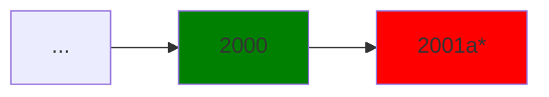
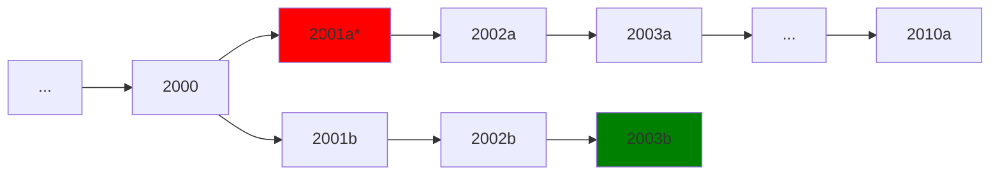
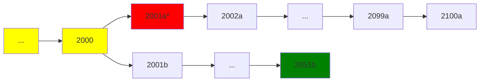
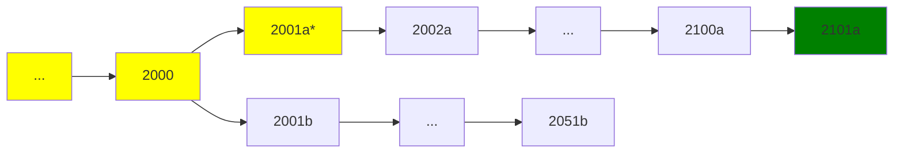

# [BIP Draft] Segregated Data: a prunable, script-isolated block region for data carriage

MrHash | 2026-06-24 08:34:51 UTC | #1

Dear all,

I've drafted companion BIPs for **Segregated Data (SegData)**, a soft-fork block region for arbitrary data (data without an intent to transfer value). SegData *entries* are committed in-block through a separate Merkle root and validated at the tip by every node. Beyond the standard retention window a node may prune them individually or in bulk, so the storage cost falls on the operators who choose to keep the data rather than on everyone.

This is not an effort to promote data carriage, rather to give it a designed structural home. OP_RETURN mitigated UTXO bloat by drawing data out of fake outputs, but its bytes are still synced in full and stored permanently by every node. SegData offers to carry the same data in a prunable region at the witness discount, so a carrier has sensible reasons to migrate. The OP_RETURN precedent shows the approach works in principle. Altering the existing vectors is deliberately out of scope.

**Design.** It follows BIP-141 patterns. The commitment is a coinbase output over a separate Merkle root, blocks gain a base and an extended serialisation, the weight formula is extended, and *reference* outputs are witness v2, value-zero, unspendable, and excluded from the UTXO set. No new sighash is needed.

Two specific properties carry most of the weight:

* **Script isolation.** No opcode may read an entry's contents, now or in any future opcode. That is what keeps entries prunable, since consensus never needs to read them again, and what stops an entry gating a spend.

* **Depth-scoped validation.** Within the retention window every node enforces all rules. Beyond it a node may validate from the base serialisation and skip the region, so sync never depends on voluntary retention. The region's byte length is committed, so even a node that skips it still checks the block weight.

**Who migrates:**

* **Can.** Data no script needs to read, interpreted off-chain by indexers, such as application-layer assets, blobs, and content carried for timestamping or attestation. SegData carries the bytes, and a reference output binds them to the transaction. Current carriage is overwhelmingly in this category.

* **Cannot.** Data a script must evaluate at spend time, such as covenant-style constructs. Script isolation forbids opcode access, and the price is the same, so nothing pulls it across.

* **Unknown until measured.** Whatever stays on the existing vectors once an affordable consensual alternative exists. Its size is not knowable in advance, and making it observable is part of what SegData offers.

**Open questions I would value feedback on:**

* **Witness version and length slot.** v2 with a 36-byte program, marker- and length-disjoint from BIP-360 P2MR. Share v2 or take a dedicated version? This is allocation and coordination, not correctness.

* **Per-reference entry length.** Committing it would make per-transaction weight and feerate computable without holding the entries. The block-level region length is already committed. Is the larger reference worth it?

* **Scope boundary.** Restriction of existing vectors is left to future BIPs. Is that the right line?

* **Coverage-tier granularity** (peer services). Finer tiers help a node find a peer that retained a range, but shrink the anonymity set that protects retention depth from fingerprinting.

Consensus BIP: https://github.com/MrHash/bips/blob/4eeeb0afbb9d256d264225801e635d2df1cc875f/bip-segdata.md

Peer-services BIP: https://github.com/MrHash/bips/blob/4eeeb0afbb9d256d264225801e635d2df1cc875f/bip-segdata-peer-services.md

Also announced on bitcoin-dev ML, but not passed moderation yet.

Happy to take detailed discussion here. I'm sure there will be many more questions, i hope the rationale section covers most of the obvious questions.

Hash

X: @hashamadeus

Nostr: npub1tjfwajj3cfy25ujx02c7q3e7pzc27jasxakk9v0lsrkrewahpkesee5a0v

-------------------------

AntoineP | 2026-06-23 17:29:08 UTC | #2

[quote="MrHash, post:1, topic:2641"]
Beyond the standard retention window a node may prune them individually or in bulk, so the storage cost falls on the operators who choose to keep the data rather than on everyone.
[/quote]

I don't understand the goal here. Since you give it consensus meaning, any full node would have to process the new data structure and use up resources. After processing the data, the node would not have to keep it around, but this saves storage (the least expensive resource) at the expense of other more expensive resources.

Alternatively, you could simply have the commitment but not give it consensus meaning through a soft fork. Essentially commit a Merkle root in an `OP_RETURN`. This is already possible, and [done](https://opentimestamps.org/), today.

-------------------------

MrHash | 2026-06-23 18:14:32 UTC | #3

Hi Antoine,

Addressing the point about resources, SegData is designed to move data that would otherwise be in OP_RETURN, witness stuffed, etc. With the segregation, aside from the absolutely necessary tip validation, the segdata is not required either by IBD or storage, and validation is skipped, so node resources are potentially saved in multiple dimensions.

Addressing the other point, as you say anyone can timestamp, so this doesn't change that in principle. However we can't force people keep their data off-chain so this covers the case where people insist on putting it on chain, which is what is happening in the wild, but instead of OP_RETURN, creating a structural semantically deliberate region with intent which supports consensual retention.

I hope that answers the initial question. Please continue to press if there's something i'm missing.

-------------------------

cguida | 2026-06-23 19:31:06 UTC | #4

Why would bitcoin noderunners want to store nonmonetary data for free?

-------------------------

MrHash | 2026-06-23 22:09:06 UTC | #5

I'm not sure I understand your question. SegData gives node operators the choice not to store data. Existing vectors offer no such choice.

-------------------------

AntoineP | 2026-06-24 20:56:16 UTC | #6

[quote="MrHash, post:3, topic:2641"]
the segdata is not required either by IBD or storage, and validation is skipped
[/quote]

[quote="MrHash, post:3, topic:2641"]
I hope that answers the initial question. Please continue to press if there’s something i’m missing.
[/quote]

I believe there is. Either the data structure is part of consensus rules, and all full nodes need to process it, or it's not, and it's already possible today without a soft fork.

-------------------------

MrHash | 2026-06-24 22:42:09 UTC | #7

All full nodes need to process at the tip (288 blocks). That cost is CPU cycles (essentially validating the hash of each entry) offset by whatever the cost of the existing vector cost is.

SegData adds no additional network or storage as the data is moved not added.

Smaller nodes (or otherwise) which validate beyond the retention window can opt out of bandwidth/cpu/storage. This is a forward reduction in network/storage requirement.

I understand the concern is resources, my argument is that segdata is net resource cost negative for those opting out.

-------------------------

AntoineP | 2026-06-25 14:55:47 UTC | #8

[quote="MrHash, post:7, topic:2641"]
All full nodes need to process at the tip (288 blocks).
[/quote]

I don't understand what you mean. Every full node always processes all blocks content, whether it is right after the block was created (what i believe you call "at tip", am i correct?), when it catches up after some downtime, or when it performs IBD.

Adding a new data structure to consensus rules means every single full node will have to download and validate this data. (In this case as i understand it, download the SegData and verify the Merkle root commitment.)

Furthermore, this additional data needs to be served by some nodes. If most reachable nodes do not serve it, this would impose significant load and reliance on the few that do.

[quote="MrHash, post:7, topic:2641"]
SegData adds no additional network or storage as the data is moved not added.
[/quote]

I am unconvinced that you can simply assume so, but let's take it for granted. This is still a block size limit increase, and because there is unlimited demand for free replicated storage, i think we can expect that space to be filled if it's made available.

[quote="MrHash, post:7, topic:2641"]
Smaller nodes (or otherwise) which validate beyond the retention window can opt out of bandwidth/cpu/storage.
[/quote]

That comes back to my previous point, but no: every node that wants to fully validate the state of the system will have to process any additional data structure introduced.

-------------------------

murch | 2026-06-25 19:18:12 UTC | #9

Since the SegData would cost the same as witness stuffing, but would result in reduced data availability, why would it be attractive to users that want to embed data?
Given that most people aren't interested in improving support for data embedding, I doubt anyone else would consider this worth the effort of a softfork, but if it's not even attractive for the would-be users, what's the point?

-------------------------

MrHash | 2026-06-25 20:02:53 UTC | #10

Hi Murch

The rationale does explain this in the BIP but I'll reiterate. 

1. Availability is not guaranteed in Bitcoin anyway (pruning). 
2. The default mode is archival, retention is effectively guaranteed, just not forced to everyone.
3. Witness is now used because its cheaper than op_return. This is a side effect of pricing discount which segdata equals. There's no reason not to use it.
4. Historical precedent, op_return was successful in mitigating fake address usage. SegData can draw data out of op_return and witness.
5. There is no way for anyone putting data on the chain to not impose it on all nodes, this intent is not served at all at the moment. SegData allows proper structural treatment of data vs money.
6. Not moving to SegData reveals intent.
7. Having a dedicated data channel allows deprecation of existing vectors as happened with bare multisig.

So I think there are lots of reasons to take this proposal seriously.

-------------------------

MrHash | 2026-06-25 20:12:27 UTC | #11

Antoine, the node does NOT require the SegData extended serialization of the block to perform sync validation beyond the tip (new blocks), it is done on the base serialization (no data paylaod) and validation is complete and BC. This is explained in detail in the peer services bip as well as the construction of blocks. The segdata portion can be reconstructed/requested by syncing segdata peers and validated in addition, which rehashes the entries to validate the reference hashes.

It is NOT a block size limit increase, it conforms to existing block size and tx weight.

There is no IBD/validation requirement of the segdata portion, similar to assumevalid but only for the data portion.

-------------------------

MrHash | 2026-06-25 20:32:36 UTC | #12

Just to clarify a full node validates the whole chain, it's not a block or tx size increase, the extra cost is a few hashes. If that is too much then we have some bigger problems to address with script exec in bitcoin. An opting out node can skip IBD and storage of the segdata part, while validating the tip (again just a few hashes). The default mode is full validation and retention, there is no likely concern with availability pressure, whereas the benefit to a opting out node would be huge in this case.

-------------------------

sipa | 2026-06-25 21:06:46 UTC | #13

How does this differ from the existing witness? It's equally discounted, and like all the rest of the block data not accessed anymore after validation (except for its effect on the UTXO set, which persists).

-------------------------

MrHash | 2026-06-25 22:05:58 UTC | #14

Hi sipa, segdata differs from segwit in that segdata is unspendable, not required to be download at all during sync or to be retained if opted out of, without affecting block validity. Witness still imposes the IBD and unpruned storage burden. To quote the BIP:

> Where SegWit separated signatures (validation data not needed once the containing block is buried) from transaction identity, SegData separates application payloads (arbitrary data not needed once the containing block is buried) from both transaction and witness regions.

-------------------------

cguida | 2026-06-25 23:23:44 UTC | #15

What's the point if there's no requirement to store it? What bitcoin noderunner is going to store nonmonetary data having nothing to do with bitcoin, for free? Would you do that? I wouldn't. No one will store this data.

If all you want is to force nodes to store a *commitment* to some data, then that's already been possible for a long time and requires no changes. Just stick a hash into a tweaked taproot key, or in an opreturn. Done.

-------------------------

MrHash | 2026-06-26 00:05:10 UTC | #16

I don't think the broad assumption you're making is well considered, because we all store the data for free now, so yes lots of people will store the data, and it's also the default in this proposal. It gives the option to consent to sync/storage to those who can't or don't want it, in part or in full. That's a benefit to both decentralization as well as consent, two very good dimensions to consider the proposal on. Offchain data hashes don't change, all other arbitrary data can move out of block and scripting vectors.

-------------------------

cguida | 2026-06-26 00:15:20 UTC | #17

Humans tend not to do things there is no incentive for them to do. This is a very basic economic principle.

Communism is what results from thinking like yours, where everyone is expected to provide unlimited free services with nothing in return. Either the system falls apart because no one wants to provide services, or everyone is forced to provide them at the point of a gun (and then it falls apart anyway).

Bitcoin does not operate on such thinking. Bitcoin operates on sound economic ideas, like paying people if you want them to do something.

-------------------------

MrHash | 2026-06-26 09:08:19 UTC | #18

Guida, you seem to have misunderstood. Let me spell it out for you agian, SegData doesn't require you to download or store data for free, the existing vectors do. As for me having communist ideas, you are mistaken, but if you would like to discuss that on social media, happy to do so there.

-------------------------

MrHash | 2026-06-26 17:29:03 UTC | #21

Apologies Pieter, I explained the conclusion without answering the exact question. The difference reduces to two properties.

1. SegData entries are script-isolated, so they provably gate no spend

2. they sit outside the tx structure, so data is identifiable

Both together are the precondition for selective retention. SegData literally segregates data.

-------------------------

sipa | 2026-06-26 17:41:08 UTC | #22

If full nodes do not require seeing the data to consider a block valid, then the data simply doesn't exist as far as Bitcoin is concerned. It is exactly equivalent to a marker "increase this transaction's data by X weight", for no purpose except wasting fees. The system cannot even prevent someone from committing to SegData that literally does not exist, so there is not even a possibility of reliability, even if all nodes were perfectly altruistic about it (a very dubious assumption). With that, I don't see why anyone would be interested in using it, and even less why the Bitcoin ecosystem would bother with its complexity.

Never thought I'd end up agreeing with @cguida on matters of blockchain data storage, but here we are.

-------------------------

MrHash | 2026-06-26 18:29:01 UTC | #23

Thank you for the reply. I think there are a few points I'd like to address before the proposal is overlooked.

Within the retention window (288 blocks) full nodes require the data. Absent data cannot be accepted. Existence is enforced network-wide at inclusion, exactly as for witness. The optional part is re-validation after burial, the same trust model as assumevalid, except a SegData node can drop the entries rather than have to keep and skip them. They gate no spend, so are never needed for validation again. Consensus not needing the data is the point, and what makes the download-skip safe.

Therefore you're right that there's no guarantee of perpetual retrievability, though under default archival that is a question of redundancy rather than availability. What is enforced in full is proof of publication at inclusion, which is exactly what witness gives you. SegData keeps that while removing only the obligation to retain.

Carriage is already happening under the witness discount and will continue. The weight you call purposeless is weight a small node on a metered link must download during IBD and keep on a constrained disk today. This proposal (which i believe is less complex than segwit and follows in its design lineage) offers an alternative which lets this or any other node skip historical entries during sync and retain only the window, while still fully validating the chain and serving the monetary history. Pruning doesn't offer this. So a question arises, is whether requiring every node, including the smallest, to retain abritrary data forever is better than letting it drop it?

I appreciate your time.

-------------------------

MrHash | 2026-06-27 22:48:59 UTC | #25

For the record, some erroneous assumptions about the SegData design have been made. The inferrence from these errors has lead to a strange logical conclusion about free carriage. Perhaps it is my mistake for not making it clearer although i don't know how it can be clearer than "Within the retention window every node enforces all rules" and "it conforms to existing block size and tx weight". In any case, this proposal stands for the time being awaiting further discussion.

-------------------------

murch | 2026-06-29 17:15:13 UTC | #26

[quote="MrHash, post:23, topic:2641"]
Within the retention window (288 blocks) full nodes require the data. Absent data cannot be accepted. Existence is enforced network-wide at inclusion, exactly as for witness. The optional part is re-validation after burial, the same trust model as assumevalid, except a SegData node can drop the entries rather than have to keep and skip them. They gate no spend, so are never needed for validation again. Consensus not needing the data is the point, and what makes the download-skip safe.

[/quote]

The question that is unclear is, if the SegData is not consensus relevant, how would the retention window be enforced?

-------------------------

MrHash | 2026-06-29 20:14:34 UTC | #28

Apologies for being unclear earlier, let me state it more accurately.

*Entry content* (the payload) is not consensus relevant since no opcode can read it, it gates no spend, and the UTXO set never depends on it. This is what allows entries to be discardable by design.

*Entry presence* is subject to consensus within the retention window. A block is invalid unless its committed entries are present and match the commitment. This guarantees the committed data was correct at inclusion. No incorrect payloads are possible. Beyond the retention window that presence check is no longer required, so it's trusted to burial.

The design is borrowing heavily from the witness+assumevalid pattern.

One more clarification. When referring to prunability, i've been overloading the term. SegData extends pruning from whole blocks to any segdata part of blocks. The default is to not prune, it just offers a granular choice to the operator.

-------------------------

ajtowns | 2026-06-30 16:24:05 UTC | #29

Suppose that you did this soft fork and it was successful, but some people decided they didn't like it and refuse to run it, instead either disabling the new rules or just running a fork of 31.x or 29.x or whatever. In that case, I think you're risking ~1000 block reorgs if miners don't really care about the rule. 

Consider the case where a miner mines a block with missing segdata (red). Then the most-work block will be rejected by enforcing nodes, who'll keep their tip (green) pointing at the parent:

If miners mess around, they may spend more work building on this rejected block, despite most nodes following the less work chain that's not missing data:

However, what happens once the retention window passes? Consider a 100 block retention window, with 2x the work being applied to the missing-data branch. At block 2100a/2051b, as an enforcing node you're still following the less-work chain, because the missing-data block is still in the retention window (non-yellow):

But a block later, the missing data no longer matters, and the block is now completely valid, so to stay in consensus with new nodes just coming online, you'll do a big reorg, backing out 51 blocks on the shorter chain and filling in 101 blocks on the more work chain:

That will cost the miners on the reorged-out chain all their rewards, which goes back to justifying why more hashrate would build on the "invalid" chain; bitcoin's model is eventual consensus, so if the most work chain will eventually be valid, extending that chain is the thing to do. As far as I can see that devolves to miners don't enforce the retention rules at all, so missing data blocks (eg from buggy or malicious low hashrate miners) aren't necessarily rare, and because they don't want to see rare but large reorgs or stalls as a result of such blocks, nodes don't enforce availability either, and the soft fork can't be maintained.

You can add extra rules/assumptions to try to avoid this -- eg, "but as long as a majority of hashrate enforces availability, it's fine: the data-available chain will have more work". But the idea behind node enforcement is that it works even if a majority of hashrate violates the rules: their work just gets judged as invalid and ignored, with the most-work valid chain winning.

-------------------------

MrHash | 2026-06-30 20:36:41 UTC | #31

Thanks for the reply and explanation. I understand the problem.

Consensus rules need to be deterministic, and the entry presence rules i defined aren't since their predicate can flip once a block buries. The pivot is the one Adam Back suggested (on X), reduce the consensus rule to the commitment weight check only. That predicate can't flip, so there's no reorg risk.

That moves entry validation out of consensus and into node policy. The coinbase commits the entry hash and length L, so every node knows both and will accept at most L bytes and reject anything that doesn't match the committed root. Byte quantity is still bounded by weight, bandwidth, and storage, even against a hostile majority since the commitment is authoritative and the weight check is still consensus.

The only gap is availability, whether the committed data is ever provided. A miner could withhold data, but not even a majority can corrupt it, since all nodes can verify and integrity is replayable and preserved. Witholding data would simply be a pointless expense. Anyway nothing relies on the data so witholding it is not a risk, and that's also the point of the whole thing and what makes it prunable.

Can you see a problem with this? Appreciate your time.

-------------------------

murch | 2026-06-30 22:36:14 UTC | #32

A miner including the transactions but withholding the data would 1) collect the fees, 2) see the block propagate fine among unupgraded nodes, 3) use less bandwidth.
Other nodes might propagate the data for their transaction seeing the block, but the block itself would not propagate with SegData, since nobody has the entire SegData. This would probably lead to reduced visibility of the SegData and reduced data availability. So, data embedders would be be incentivized to use witness data instead of SegData for the same cost which guarantees data availability.

I just don't see how this proposal solves any problem for any party.

-------------------------

MrHash | 2026-06-30 23:39:12 UTC | #33

I see you are challenging the incentives and that's fair but I'd like to counter the initial premise.

Miners could only withhold their own out of band entries. All other entries are relayed between peers as part of transaction serialization and so are available for validation and reconstruction from compact blocks. In withholding their own data (or any other attack) block propagation would be slowed and so they lose any race. It's a pointless and expensive attack with no upside.

Where segdata nodes are pruned in full, let's say 20% of the network doesn't serve, availability is still guaranteed, it's redundancy of the entries only that is reduced. Since pruning already exists, redundancy of blocks is already reduced.

Coming to incentives, making SegData cheaper is an option but I don't think it's right. I'm also leaning on the op_return precedent as a carriage vector that drew data out of fake addresses. I don't think there was any real incentive to use it but people moved because its designated.

-------------------------

murch | 2026-07-01 17:41:36 UTC | #34

> In withholding their own data (or any other attack) block propagation would be slowed and so they lose any race.

For someone to lose a race, there has to be have to be competing chaintips in the first place, and the effect of propagation delay is often overestimated.

> I don't think there was any real incentive to use \[OP_RETURN\] but people moved because its designated.

OP_RETURN was cheaper than embedding data into payment outputs. E.g., a P2PKH output takes 34 bytes of which the 20-byte hash could be used for data embedding. For a payload of `n` an OP_RETURN output takes `11+n` bytes with the original policy limiting `n` to 80 bytes. OP_RETURN has less overhead for any payload length.

-------------------------

