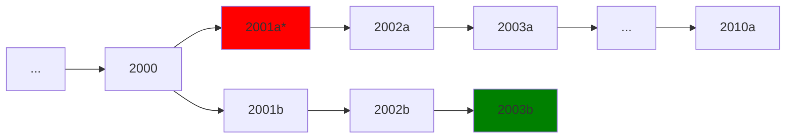
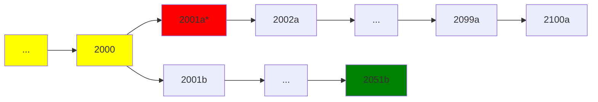
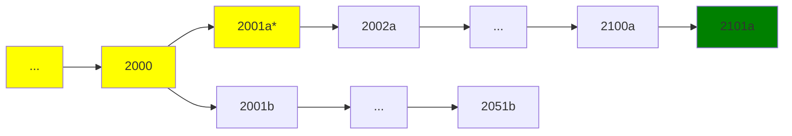

# [BIP Draft] Segregated Data: a prunable, script-isolated block region for data carriage

MrHash | 2026-06-24 08:34:51 UTC | #1

Dear all,

I've drafted companion BIPs for **Segregated Data (SegData)**, a soft-fork block region for arbitrary data (data without an intent to transfer value). SegData *entries* are committed in-block through a separate Merkle root and validated at the tip by every node. Beyond the standard retention window a node may prune them individually or in bulk, so the storage cost falls on the operators who choose to keep the data rather than on everyone.

This is not an effort to promote data carriage, rather to give it a designed structural home. OP_RETURN mitigated UTXO bloat by drawing data out of fake outputs, but its bytes are still synced in full and stored permanently by every node. SegData offers to carry the same data in a prunable region at the witness discount, so a carrier has sensible reasons to migrate. The OP_RETURN precedent shows the approach works in principle. Altering the existing vectors is deliberately out of scope.

**Design.** It follows BIP-141 patterns. The commitment is a coinbase output over a separate Merkle root, blocks gain a base and an extended serialisation, the weight formula is extended, and *reference* outputs are witness v2, value-zero, unspendable, and excluded from the UTXO set. No new sighash is needed.

Two specific properties carry most of the weight:

* **Script isolation.** No opcode may read an entry's contents, now or in any future opcode. That is what keeps entries prunable, since consensus never needs to read them again, and what stops an entry gating a spend.

* **Depth-scoped validation.** Within the retention window every node enforces all rules. Beyond it a node may validate from the base serialisation and skip the region, so sync never depends on voluntary retention. The region's byte length is committed, so even a node that skips it still checks the block weight.

**Who migrates:**

* **Can.** Data no script needs to read, interpreted off-chain by indexers, such as application-layer assets, blobs, and content carried for timestamping or attestation. SegData carries the bytes, and a reference output binds them to the transaction. Current carriage is overwhelmingly in this category.

* **Cannot.** Data a script must evaluate at spend time, such as covenant-style constructs. Script isolation forbids opcode access, and the price is the same, so nothing pulls it across.

* **Unknown until measured.** Whatever stays on the existing vectors once an affordable consensual alternative exists. Its size is not knowable in advance, and making it observable is part of what SegData offers.

**Open questions I would value feedback on:**

* **Witness version and length slot.** v2 with a 36-byte program, marker- and length-disjoint from BIP-360 P2MR. Share v2 or take a dedicated version? This is allocation and coordination, not correctness.

* **Per-reference entry length.** Committing it would make per-transaction weight and feerate computable without holding the entries. The block-level region length is already committed. Is the larger reference worth it?

* **Scope boundary.** Restriction of existing vectors is left to future BIPs. Is that the right line?

* **Coverage-tier granularity** (peer services). Finer tiers help a node find a peer that retained a range, but shrink the anonymity set that protects retention depth from fingerprinting.

Consensus BIP: https://github.com/MrHash/bips/blob/4eeeb0afbb9d256d264225801e635d2df1cc875f/bip-segdata.md

Peer-services BIP: https://github.com/MrHash/bips/blob/4eeeb0afbb9d256d264225801e635d2df1cc875f/bip-segdata-peer-services.md

Also announced on bitcoin-dev ML, but not passed moderation yet.

Happy to take detailed discussion here. I'm sure there will be many more questions, i hope the rationale section covers most of the obvious questions.

Hash

X: @hashamadeus

Nostr: npub1tjfwajj3cfy25ujx02c7q3e7pzc27jasxakk9v0lsrkrewahpkesee5a0v

-------------------------

AntoineP | 2026-06-23 17:29:08 UTC | #2

[quote="MrHash, post:1, topic:2641"]
Beyond the standard retention window a node may prune them individually or in bulk, so the storage cost falls on the operators who choose to keep the data rather than on everyone.
[/quote]

I don't understand the goal here. Since you give it consensus meaning, any full node would have to process the new data structure and use up resources. After processing the data, the node would not have to keep it around, but this saves storage (the least expensive resource) at the expense of other more expensive resources.

Alternatively, you could simply have the commitment but not give it consensus meaning through a soft fork. Essentially commit a Merkle root in an `OP_RETURN`. This is already possible, and [done](https://opentimestamps.org/), today.

-------------------------

MrHash | 2026-06-23 18:14:32 UTC | #3

Hi Antoine,

Addressing the point about resources, SegData is designed to move data that would otherwise be in OP_RETURN, witness stuffed, etc. With the segregation, aside from the absolutely necessary tip validation, the segdata is not required either by IBD or storage, and validation is skipped, so node resources are potentially saved in multiple dimensions.

Addressing the other point, as you say anyone can timestamp, so this doesn't change that in principle. However we can't force people keep their data off-chain so this covers the case where people insist on putting it on chain, which is what is happening in the wild, but instead of OP_RETURN, creating a structural semantically deliberate region with intent which supports consensual retention.

I hope that answers the initial question. Please continue to press if there's something i'm missing.

-------------------------

cguida | 2026-06-23 19:31:06 UTC | #4

Why would bitcoin noderunners want to store nonmonetary data for free?

-------------------------

MrHash | 2026-06-23 22:09:06 UTC | #5

I'm not sure I understand your question. SegData gives node operators the choice not to store data. Existing vectors offer no such choice.

-------------------------

AntoineP | 2026-06-24 20:56:16 UTC | #6

[quote="MrHash, post:3, topic:2641"]
the segdata is not required either by IBD or storage, and validation is skipped
[/quote]

[quote="MrHash, post:3, topic:2641"]
I hope that answers the initial question. Please continue to press if there’s something i’m missing.
[/quote]

I believe there is. Either the data structure is part of consensus rules, and all full nodes need to process it, or it's not, and it's already possible today without a soft fork.

-------------------------

MrHash | 2026-06-24 22:42:09 UTC | #7

All full nodes need to process at the tip (288 blocks). That cost is CPU cycles (essentially validating the hash of each entry) offset by whatever the cost of the existing vector cost is.

SegData adds no additional network or storage as the data is moved not added.

Smaller nodes (or otherwise) which validate beyond the retention window can opt out of bandwidth/cpu/storage. This is a forward reduction in network/storage requirement.

I understand the concern is resources, my argument is that segdata is net resource cost negative for those opting out.

-------------------------

AntoineP | 2026-06-25 14:55:47 UTC | #8

[quote="MrHash, post:7, topic:2641"]
All full nodes need to process at the tip (288 blocks).
[/quote]

I don't understand what you mean. Every full node always processes all blocks content, whether it is right after the block was created (what i believe you call "at tip", am i correct?), when it catches up after some downtime, or when it performs IBD.

Adding a new data structure to consensus rules means every single full node will have to download and validate this data. (In this case as i understand it, download the SegData and verify the Merkle root commitment.)

Furthermore, this additional data needs to be served by some nodes. If most reachable nodes do not serve it, this would impose significant load and reliance on the few that do.

[quote="MrHash, post:7, topic:2641"]
SegData adds no additional network or storage as the data is moved not added.
[/quote]

I am unconvinced that you can simply assume so, but let's take it for granted. This is still a block size limit increase, and because there is unlimited demand for free replicated storage, i think we can expect that space to be filled if it's made available.

[quote="MrHash, post:7, topic:2641"]
Smaller nodes (or otherwise) which validate beyond the retention window can opt out of bandwidth/cpu/storage.
[/quote]

That comes back to my previous point, but no: every node that wants to fully validate the state of the system will have to process any additional data structure introduced.

-------------------------

murch | 2026-06-25 19:18:12 UTC | #9

Since the SegData would cost the same as witness stuffing, but would result in reduced data availability, why would it be attractive to users that want to embed data?
Given that most people aren't interested in improving support for data embedding, I doubt anyone else would consider this worth the effort of a softfork, but if it's not even attractive for the would-be users, what's the point?

-------------------------

MrHash | 2026-06-25 20:02:53 UTC | #10

Hi Murch

The rationale does explain this in the BIP but I'll reiterate. 

1. Availability is not guaranteed in Bitcoin anyway (pruning). 
2. The default mode is archival, retention is effectively guaranteed, just not forced to everyone.
3. Witness is now used because its cheaper than op_return. This is a side effect of pricing discount which segdata equals. There's no reason not to use it.
4. Historical precedent, op_return was successful in mitigating fake address usage. SegData can draw data out of op_return and witness.
5. There is no way for anyone putting data on the chain to not impose it on all nodes, this intent is not served at all at the moment. SegData allows proper structural treatment of data vs money.
6. Not moving to SegData reveals intent.
7. Having a dedicated data channel allows deprecation of existing vectors as happened with bare multisig.

So I think there are lots of reasons to take this proposal seriously.

-------------------------

MrHash | 2026-06-25 20:12:27 UTC | #11

Antoine, the node does NOT require the SegData extended serialization of the block to perform sync validation beyond the tip (new blocks), it is done on the base serialization (no data paylaod) and validation is complete and BC. This is explained in detail in the peer services bip as well as the construction of blocks. The segdata portion can be reconstructed/requested by syncing segdata peers and validated in addition, which rehashes the entries to validate the reference hashes.

It is NOT a block size limit increase, it conforms to existing block size and tx weight.

There is no IBD/validation requirement of the segdata portion, similar to assumevalid but only for the data portion.

-------------------------

MrHash | 2026-06-25 20:32:36 UTC | #12

Just to clarify a full node validates the whole chain, it's not a block or tx size increase, the extra cost is a few hashes. If that is too much then we have some bigger problems to address with script exec in bitcoin. An opting out node can skip IBD and storage of the segdata part, while validating the tip (again just a few hashes). The default mode is full validation and retention, there is no likely concern with availability pressure, whereas the benefit to a opting out node would be huge in this case.

-------------------------

sipa | 2026-06-25 21:06:46 UTC | #13

How does this differ from the existing witness? It's equally discounted, and like all the rest of the block data not accessed anymore after validation (except for its effect on the UTXO set, which persists).

-------------------------

MrHash | 2026-06-25 22:05:58 UTC | #14

Hi sipa, segdata differs from segwit in that segdata is unspendable, not required to be download at all during sync or to be retained if opted out of, without affecting block validity. Witness still imposes the IBD and unpruned storage burden. To quote the BIP:

> Where SegWit separated signatures (validation data not needed once the containing block is buried) from transaction identity, SegData separates application payloads (arbitrary data not needed once the containing block is buried) from both transaction and witness regions.

-------------------------

cguida | 2026-06-25 23:23:44 UTC | #15

What's the point if there's no requirement to store it? What bitcoin noderunner is going to store nonmonetary data having nothing to do with bitcoin, for free? Would you do that? I wouldn't. No one will store this data.

If all you want is to force nodes to store a *commitment* to some data, then that's already been possible for a long time and requires no changes. Just stick a hash into a tweaked taproot key, or in an opreturn. Done.

-------------------------

MrHash | 2026-06-26 00:05:10 UTC | #16

I don't think the broad assumption you're making is well considered, because we all store the data for free now, so yes lots of people will store the data, and it's also the default in this proposal. It gives the option to consent to sync/storage to those who can't or don't want it, in part or in full. That's a benefit to both decentralization as well as consent, two very good dimensions to consider the proposal on. Offchain data hashes don't change, all other arbitrary data can move out of block and scripting vectors.

-------------------------

cguida | 2026-06-26 00:15:20 UTC | #17

Humans tend not to do things there is no incentive for them to do. This is a very basic economic principle.

Communism is what results from thinking like yours, where everyone is expected to provide unlimited free services with nothing in return. Either the system falls apart because no one wants to provide services, or everyone is forced to provide them at the point of a gun (and then it falls apart anyway).

Bitcoin does not operate on such thinking. Bitcoin operates on sound economic ideas, like paying people if you want them to do something.

-------------------------

MrHash | 2026-06-26 09:08:19 UTC | #18

Guida, you seem to have misunderstood. Let me spell it out for you agian, SegData doesn't require you to download or store data for free, the existing vectors do. As for me having communist ideas, you are mistaken, but if you would like to discuss that on social media, happy to do so there.

-------------------------

MrHash | 2026-06-26 17:29:03 UTC | #21

Apologies Pieter, I explained the conclusion without answering the exact question. The difference reduces to two properties.

1. SegData entries are script-isolated, so they provably gate no spend

2. they sit outside the tx structure, so data is identifiable

Both together are the precondition for selective retention. SegData literally segregates data.

-------------------------

sipa | 2026-06-26 17:41:08 UTC | #22

If full nodes do not require seeing the data to consider a block valid, then the data simply doesn't exist as far as Bitcoin is concerned. It is exactly equivalent to a marker "increase this transaction's data by X weight", for no purpose except wasting fees. The system cannot even prevent someone from committing to SegData that literally does not exist, so there is not even a possibility of reliability, even if all nodes were perfectly altruistic about it (a very dubious assumption). With that, I don't see why anyone would be interested in using it, and even less why the Bitcoin ecosystem would bother with its complexity.

Never thought I'd end up agreeing with @cguida on matters of blockchain data storage, but here we are.

-------------------------

MrHash | 2026-06-26 18:29:01 UTC | #23

Thank you for the reply. I think there are a few points I'd like to address before the proposal is overlooked.

Within the retention window (288 blocks) full nodes require the data. Absent data cannot be accepted. Existence is enforced network-wide at inclusion, exactly as for witness. The optional part is re-validation after burial, the same trust model as assumevalid, except a SegData node can drop the entries rather than have to keep and skip them. They gate no spend, so are never needed for validation again. Consensus not needing the data is the point, and what makes the download-skip safe.

Therefore you're right that there's no guarantee of perpetual retrievability, though under default archival that is a question of redundancy rather than availability. What is enforced in full is proof of publication at inclusion, which is exactly what witness gives you. SegData keeps that while removing only the obligation to retain.

Carriage is already happening under the witness discount and will continue. The weight you call purposeless is weight a small node on a metered link must download during IBD and keep on a constrained disk today. This proposal (which i believe is less complex than segwit and follows in its design lineage) offers an alternative which lets this or any other node skip historical entries during sync and retain only the window, while still fully validating the chain and serving the monetary history. Pruning doesn't offer this. So a question arises, is whether requiring every node, including the smallest, to retain abritrary data forever is better than letting it drop it?

I appreciate your time.

-------------------------

MrHash | 2026-06-27 22:48:59 UTC | #25

For the record, some erroneous assumptions about the SegData design have been made. The inferrence from these errors has lead to a strange logical conclusion about free carriage. Perhaps it is my mistake for not making it clearer although i don't know how it can be clearer than "Within the retention window every node enforces all rules" and "it conforms to existing block size and tx weight". In any case, this proposal stands for the time being awaiting further discussion.

-------------------------

murch | 2026-06-29 17:15:13 UTC | #26

[quote="MrHash, post:23, topic:2641"]
Within the retention window (288 blocks) full nodes require the data. Absent data cannot be accepted. Existence is enforced network-wide at inclusion, exactly as for witness. The optional part is re-validation after burial, the same trust model as assumevalid, except a SegData node can drop the entries rather than have to keep and skip them. They gate no spend, so are never needed for validation again. Consensus not needing the data is the point, and what makes the download-skip safe.

[/quote]

The question that is unclear is, if the SegData is not consensus relevant, how would the retention window be enforced?

-------------------------

MrHash | 2026-06-29 20:14:34 UTC | #28

Apologies for being unclear earlier, let me state it more accurately.

*Entry content* (the payload) is not consensus relevant since no opcode can read it, it gates no spend, and the UTXO set never depends on it. This is what allows entries to be discardable by design.

*Entry presence* is subject to consensus within the retention window. A block is invalid unless its committed entries are present and match the commitment. This guarantees the committed data was correct at inclusion. No incorrect payloads are possible. Beyond the retention window that presence check is no longer required, so it's trusted to burial.

The design is borrowing heavily from the witness+assumevalid pattern.

One more clarification. When referring to prunability, i've been overloading the term. SegData extends pruning from whole blocks to any segdata part of blocks. The default is to not prune, it just offers a granular choice to the operator.

-------------------------

ajtowns | 2026-06-30 16:24:05 UTC | #29

Suppose that you did this soft fork and it was successful, but some people decided they didn't like it and refuse to run it, instead either disabling the new rules or just running a fork of 31.x or 29.x or whatever. In that case, I think you're risking ~1000 block reorgs if miners don't really care about the rule. 

Consider the case where a miner mines a block with missing segdata (red). Then the most-work block will be rejected by enforcing nodes, who'll keep their tip (green) pointing at the parent:

```mermaid
graph LR;

x[...] --> 2000 --> 2001a*;

classDef miss fill:red;
class 2001a* miss;

classDef tip fill:green;
class 2000 tip;
``` 

If miners mess around, they may spend more work building on this rejected block, despite most nodes following the less work chain that's not missing data:

```mermaid
graph LR;

x[...] --> 2000 --> 2001a* --> 2002a --> 2003a --> y[...] --> 2010a;

2000 --> 2001b --> 2002b --> 2003b;

classDef miss fill:red;
class 2001a* miss;

classDef tip fill:green;
class 2003b tip;
``` 

However, what happens once the retention window passes? Consider a 100 block retention window, with 2x the work being applied to the missing-data branch. At block 2100a/2051b, as an enforcing node you're still following the less-work chain, because the missing-data block is still in the retention window (non-yellow):

```mermaid
graph LR;

x[...] --> 2000 --> 2001a* --> 2002a --> y[...] --> 2099a --> 2100a;
2000 --> 2001b --> z[...] --> 2051b;

classDef oow fill:yellow;
class x,2000 oow;

classDef miss fill:red;
class 2001a* miss;

classDef tip fill:green;
class 2051b tip;
```  

But a block later, the missing data no longer matters, and the block is now completely valid, so to stay in consensus with new nodes just coming online, you'll do a big reorg, backing out 51 blocks on the shorter chain and filling in 101 blocks on the more work chain:

```mermaid
graph LR;

x[...] --> 2000 --> 2001a* --> 2002a --> y[...] --> 2100a --> 2101a;
2000 --> 2001b --> z[...] --> 2051b;

classDef oow fill:yellow;
class x,2000,2001a* oow;

classDef tip fill:green;
class 2101a tip;
```  

That will cost the miners on the reorged-out chain all their rewards, which goes back to justifying why more hashrate would build on the "invalid" chain; bitcoin's model is eventual consensus, so if the most work chain will eventually be valid, extending that chain is the thing to do. As far as I can see that devolves to miners don't enforce the retention rules at all, so missing data blocks (eg from buggy or malicious low hashrate miners) aren't necessarily rare, and because they don't want to see rare but large reorgs or stalls as a result of such blocks, nodes don't enforce availability either, and the soft fork can't be maintained.

You can add extra rules/assumptions to try to avoid this -- eg, "but as long as a majority of hashrate enforces availability, it's fine: the data-available chain will have more work". But the idea behind node enforcement is that it works even if a majority of hashrate violates the rules: their work just gets judged as invalid and ignored, with the most-work valid chain winning.

-------------------------

MrHash | 2026-06-30 20:36:41 UTC | #31

Thanks for the reply and explanation. I understand the problem.

Consensus rules need to be deterministic, and the entry presence rules i defined aren't since their predicate can flip once a block buries. The pivot is the one Adam Back suggested (on X), reduce the consensus rule to the commitment weight check only. That predicate can't flip, so there's no reorg risk.

That moves entry validation out of consensus and into node policy. The coinbase commits the entry hash and length L, so every node knows both and will accept at most L bytes and reject anything that doesn't match the committed root. Byte quantity is still bounded by weight, bandwidth, and storage, even against a hostile majority since the commitment is authoritative and the weight check is still consensus.

The only gap is availability, whether the committed data is ever provided. A miner could withhold data, but not even a majority can corrupt it, since all nodes can verify and integrity is replayable and preserved. Witholding data would simply be a pointless expense. Anyway nothing relies on the data so witholding it is not a risk, and that's also the point of the whole thing and what makes it prunable.

Can you see a problem with this? Appreciate your time.

-------------------------

murch | 2026-06-30 22:36:14 UTC | #32

A miner including the transactions but withholding the data would 1) collect the fees, 2) see the block propagate fine among unupgraded nodes, 3) use less bandwidth.
Other nodes might propagate the data for their transaction seeing the block, but the block itself would not propagate with SegData, since nobody has the entire SegData. This would probably lead to reduced visibility of the SegData and reduced data availability. So, data embedders would be be incentivized to use witness data instead of SegData for the same cost which guarantees data availability.

I just don't see how this proposal solves any problem for any party.

-------------------------

MrHash | 2026-06-30 23:39:12 UTC | #33

I see you are challenging the incentives and that's fair but I'd like to counter the initial premise.

Miners could only withhold their own out of band entries. All other entries are relayed between peers as part of transaction serialization and so are available for validation and reconstruction from compact blocks. In withholding their own data (or any other attack) block propagation would be slowed and so they lose any race. It's a pointless and expensive attack with no upside.

Where segdata nodes are pruned in full, let's say 20% of the network doesn't serve, availability is still guaranteed, it's redundancy of the entries only that is reduced. Since pruning already exists, redundancy of blocks is already reduced.

Coming to incentives, making SegData cheaper is an option but I don't think it's right. I'm also leaning on the op_return precedent as a carriage vector that drew data out of fake addresses. I don't think there was any real incentive to use it but people moved because its designated.

-------------------------

murch | 2026-07-01 17:41:36 UTC | #34

> In withholding their own data (or any other attack) block propagation would be slowed and so they lose any race.

For someone to lose a race, there has to be have to be competing chaintips in the first place, and the effect of propagation delay is often overestimated.

> I don't think there was any real incentive to use \[OP_RETURN\] but people moved because its designated.

OP_RETURN was cheaper than embedding data into payment outputs. E.g., a P2PKH output takes 34 bytes of which the 20-byte hash could be used for data embedding. For a payload of `n` an OP_RETURN output takes `11+n` bytes with the original policy limiting `n` to 80 bytes. OP_RETURN has less overhead for any payload length.

-------------------------

MrHash | 2026-07-02 09:04:02 UTC | #35

I should point out after AJ's scenario i'm proposing the reduced consensus rule version of the proposal, although i have to update the BIP, assuming there's no deal breakers.

[quote="murch, post:34, topic:2641"]
For someone to lose a race, there has to be have to be competing chaintips in the first place, and the effect of propagation delay is often overestimated.

[/quote]

Right, racing is just one scenario. However the key point holds which is that withholding data isn't an attack, it's more of a miner footgun.

> OP_RETURN was cheaper than embedding data into payment outputs

Thanks for the correction. If it's purely economic incentivisation that is required then it is possible to discount deeper, it can be an open question. I discuss the scenarios somewhat in the bip.

This is an honest attempt to propose a structural solution to reduce node/operator burden and decollectivse bytes discrimination, without being coercive. I admit that through my own analysis, i'm making the assumption that it is beneficial to draw data out of op_return and witness into something like SegData which offers data prunability. Are there any other proposals i should look at which are addressing this at the moment, or am i completely off track?

-------------------------

MrHash | 2026-07-02 12:41:03 UTC | #36

Important follow up regarding the economic incentive, i ran the numbers and this is what i get:

| Payload | SegData | Witness Commit+Reveal | Saving | Saving % |
|----|----|----|----|----|
| 256 B | \~865 WU (216 vB) | \~1,210 WU (303 vB) | \~345 WU (86 vB) | \~28% |
| 1 KB | \~1,633 WU (408 vB) | \~1,996 WU (499 vB) | \~363 WU (91 vB) | \~18% |
| 10 KB | \~10,849 WU (2,712 vB) | \~11,266 WU (2,817 vB) | \~417 WU (104 vB) | \~4% |

-------------------------

murch | 2026-07-02 16:49:37 UTC | #37

Thanks for the reminder that the inscription envelope requires a commit-reveal output-input pair, and your proposal would be smaller because an output directly commits to the data.

There is still something I don't understand. If the output only commits to the data amount and its hash, but the data is not consensus relevant and it's optional for nodes to keep, why should it count toward the block weight at all?
I am much more pessimistic than you regarding the number of node operators that would participate in relay of this data. In that case, why change consensus at all?
Instead, you could have the data be shared on an overlay network of participating nodes: the client would be a wrapper on Bitcoin Core that interprets OP_RETURN outputs with a specific prefix as data transaction announcements that the overlay nodes would retrieve, store, and share. You could cost it by requiring those OP_RETURN outputs to burn some amount of sats per byte (e.g., tied to the feerate of the transaction that created it?). How is your system an improvement over such an overlay network?

-------------------------

MrHash | 2026-07-03 17:03:03 UTC | #38

The SegData proposal is intended to decollectivise resource control on the declared intent of the carrier. It has to have a weight check otherwise people would be able to carry data for free, which is unacceptable. An overlay design is a different proposal, and such things exist already (OP_RETURN+IPFS, RGB, OpenTimestamps), and maybe they draw some traffic off-chain. Burns aren't adopted well in the market because they destroy coins and compensate no one, whereas fees are transfers and reusable. Even at zero participation SegData yields a priced, bounded, committed record, and an overlay would cost a similar OP_RETURN but yield limited availability.

At low participation SegData might seem like an overlay but the question about participation isn't settled. SegData retention is the default, the majority of Bitcoin node operators are not pruning so it's not right to expect they would prune data in bulk either. The resource constrained or ideological can opt-out, but mostly the ideological grievance is based on values not resources. SegData just allows the protocol to treat data as a specific type which brings the pruning decision to the node, the only legitimate place for it. The other argument is, if everyone pruned blocks because of resource limits then block availability dies with much worse consequences, blocks are needed to sync, where SegData isn't, so the accepted case is actually the more dangerous one.

If pruning is permissable then it is possible that pruning policies centralize, which could lead to redundancy attrition. Therefore prunability has to be priced appropriately and the risk of crowding out money uses addressed. SegData would probably need to be cheaper and so a region size cap may be required. I'd need to derive some numbers here, but the upside to that is it would be an effective block size reduction for opting-out nodes :face_with_raised_eyebrow:

-------------------------

murch | 2026-07-09 18:39:00 UTC | #39

[quote="MrHash, post:38, topic:2641"]
At low participation SegData might seem like an overlay but the question about participation isn’t settled. SegData retention is the default, the majority of Bitcoin node operators are not pruning so it’s not right to expect they would prune data in bulk either.

[/quote]

Having the whole blockchain enables bootstrapping other nodes and is useful for privately servicing your own light client’s needs. If node runners could selectively prune just data embedding without falling out of consensus, I firmly believe that the vast majority of node runners would do so, and that this may even be the default node behavior for implementations. Just because people realize that you can’t prevent data embedding in Bitcoin shouldn’t be misconstrued as people supporting or condoning it. In the end, just the people using SegData would keep it available, if those.

Anyway, I don’t see this proposal having any runway.

-------------------------

MrHash | 2026-07-10 14:16:21 UTC | #40

Thanks Murch appreciate the feedback

The goal here isn't to condone or support data carriage in Bitcoin, although OP_RETURN does that despite being undercut by witness, but to simply acknowledge data exists and treat it accordingly as a structurally addressable region which transfers resource control to node operators as we have discussed. I understand your doubts that this will take off, and that's fine. If the debate continues, which i presume it will, this is available for further discussion until it is superceded by a better proposal, or the whole issue disappears forever.

As for next steps, i will update the BIP with the changes as discussed here, and then make a PR to the bips repo? or widen the conversation to the mailing list?

-------------------------

murch | 2026-07-10 18:32:40 UTC | #41

This discussion satisfies the "present and discuss your idea" criteria, so you could open a PR to the BIPs repository next, but I think it might be interesting to post the BIP draft also to the mailing list as the audience is somewhat different even if it has big overlaps.

I feel like I haven’t been able to fully get my point across, but I’ll try again on the repository, if nobody else manages to state it more comprehensibly.

-------------------------

MrHash | 2026-07-27 21:41:16 UTC | #42

I've updated the BIPs to take into consideration as much of the feedback from here as I can. They are significantly updated. With that I've made the GitHub PR.

-------------------------

MrHash | 2026-07-28 08:40:46 UTC | #43

I have been rejected from [opening a PR](https://github.com/bitcoin/bips/pull/2222) to the BIPs repository. The links below are updated with the latest versions of the BIPs which resolve the earlier raised consensus rule issue as well as address various other improvements and hopefully more clarity on the design.

To reiterate, there is no free data carriage, each node decides what data it want to receive and store while validation existing block rules are unchanged.

Consensus BIP: https://github.com/MrHash/bips/blob/bip-segdata/bip-segdata.md

Peer Services BIP: <https://github.com/MrHash/bips/blob/bip-segdata/bip-segdata-peer-services.md>

-------------------------

MrHash | 2026-07-28 08:53:07 UTC | #44

Responding to the following on GitHub where the conversation is locked:

> The newer proposal would make data optional at every depth and keep consensus validation identical, fixing the reorg risk AJ Towns described. Nodes would only check a commitment plus the declared size against the weight limit; everything else would be policy.

This is exactly how the updated BIP is written. There is also a section as follows:

**Uniform Validation**
Consensus validation is identical at every depth. Every node applies the rules above from the base serialisation, the transactions and the coinbase commitment, for a block at the tip and for one buried under the deepest reorg alike, whether or not it holds the segdata region. There are no depth-scoped validation modes and no burial trust. A block's validity is fixed by its base serialisation when it is first seen and never changes, so two nodes cannot reach different verdicts on the same block by having encountered it at different depths.

Consensus never depends on data, all validation is relay policy aside from commitment check. SegData is designed to relocate data out of witness. An economic incentive is now encoded in the proposal suggesting the following:

| Payload | SegData | Witness Commit+Reveal | Saving | Saving % |
|----|----|----|----|----|
| 256 B | \~737 WU (184 vB) | \~1,210 WU (303 vB) | \~473 WU (118 vB) | \~39% |
| 1 KB | \~1,121 WU (280 vB) | \~1,996 WU (499 vB) | \~875 WU (219 vB) | \~44% |
| 10 KB | \~5,729 WU (1,432 vB) | \~11,266 WU (2,817 vB) | \~5,537 WU (1,384 vB) | \~49% |
| 100 KB | \~51,809 WU (12,952 vB) | \~103,960 WU (25,990 vB) | \~52,151 WU (13,038 vB) | \~50% |

> Use cases that care about permanence would stick to normal witness or OP_RETURN data.

OP_RETURN is suitable under a small size threshold but above that it is not economically rational and hence why data is being carried in vectors otherwise not intended for it.

-------------------------

garlonicon | 2026-07-28 12:50:32 UTC | #45

If we would live in a perfect world, where every user respect gentlemen's agreement, then proposals like that could work. But the whole point of pushing data on-chain is about forcing nodes to store it. Which is why your BIP wouldn't change anything in practice.

If you really want to solve the spam problem, then you can focus more on making something better than an SPV node, and worse than a full node, where users could decide, what kind of data they want to store, and what level of trust they accept. But even then, it would be hard to convince many users to stop using SPV, and switch to something better.

The idea of pushing spammers to a separate area is good, but unfortunately, it wouldn't work in practice. Users will stop storing data on-chain, only when they will have to store their own transactions on their own devices, and when losing transaction data would lead to a lose of coins. But that kind of security model is different from the current one, where you can create millions of UTXOs, and rely on P2P peers to store it forever. And reaching consensus for changing it would be hard, as long as we don't have terabytes of data, produced for many decades or centuries.

So, to sum up: technically, your BIP could work, but practically, there will be no incentive to use it. And today's users won't respect gentlemen's agreement, because if they would, then for example testnet coins wouldn't be traded. Here, it is similar: lack of incentive makes it impractical, even if technically you can implement it, deploy it without asking Bitcoin Core about anything, and try to convince users to switch to it. I guess most users just wouldn't use it, even if you would make a working client, and try to promote it.

-------------------------

MrHash | 2026-07-28 13:29:23 UTC | #46

Thank you for joining the conversation and feedback. I do understand the point being made by yourself and Murch, which is that data carriers are exploiting permanance. However, i don't believe this is necessarily the case and have tried to make this clear in the BIP.

Firstly, the incentive to use it is now established economically, as i posted the rationale above. The economic incentive is what has drawn data into witness, undercutting op_return. This is a side effect of the discount. On this basis it can be asserted that carriers are economically rational and respond to economic incentives.

Secondly, Bitcoin gives no guarantees of redundancy, whereas it does in theory (re: pruning) promise availability. SegData gives a degree less redundancy, that is conceded, but availability is also in theory promised. This nuance presents an opportunity to data carriers to declare their data prunable for a discoutn, which they are not able to do at the moment. The upside of this is that data continues to compete within the weight budget, and reduces burden on smaller resources constrained nodes, relocating data and contributing to decentralization e.g. a full SegData block would be \~1KB for an opt-out node.

I'm not pushing the proposal as a must-have, i'm just simply trying to establish it as a technical option which follows clearly in the design lineage of witness. No consensus requirement on data + script isolation enables pruning at the node by entry or type.

-------------------------

jonatack | 2026-07-30 19:53:19 UTC | #47

Posting the relevant parts of my mini-review in the BIPs repo:

---

The newer proposal would make data optional at every depth and keep consensus validation identical, fixing the reorg risk AJ Towns described. Nodes would only check a commitment plus the declared size against the weight limit; everything else would be policy.

It would be a soft fork for something that doesn’t need consensus rules. One can already commit to arbitrary data hashes today. The data still consumes block weight even though no one is required to keep or serve it. Most nodes would ignore it, making availability unreliable. Use cases that care about permanence would stick to normal witness or OP_RETURN data.

It would be adding protocol complexity for a feature most nodes will turn off and that has weak incentives to be used at all.

---

I agree with @garlonicon above. It would be nice if it could work, but incentives.

> OP_RETURN is suitable under a small size threshold but above that it is not economically rational and hence why data is being carried in vectors otherwise not intended for it.

Yes, IIUC large arbitrary blobs would be that data that makes the most sense to use SegData for, with the caveats of (a soft fork, increased protocol complexity, and) whether enough nodes are willing to host and serve the data.

-------------------------

MrHash | 2026-07-30 21:52:23 UTC | #48

hey, i did respond earlier in brief to your review but i'll repeat here ICYMI.

> The newer proposal would make data optional at every depth and keep consensus validation identical, fixing the reorg risk AJ Towns described. Nodes would only check a commitment plus the declared size against the weight limit; everything else would be policy.

This is done, it's in the PR bip pages and in the later links here. Maybe you saw the peer services BIP which has a 288 block best effort policy. I also added the following section:

**Uniform Validation** Consensus validation is identical at every depth. Every node applies the rules above from the base serialisation, the transactions and the coinbase commitment, for a block at the tip and for one buried under the deepest reorg alike, whether or not it holds the segdata region. There are no depth-scoped validation modes and no burial trust. A block’s validity is fixed by its base serialisation when it is first seen and never changes, so two nodes cannot reach different verdicts on the same block by having encountered it at different depths.

> I agree with @garlonicon above. It would be nice if it could work, but incentives.

I think this is the common criticism aside from any initial weirdness or technical peculiarities with the whole concept (although it is basically a simplified SegWit design + script-isolation -> prunability). I've tried to address the incentives questions but i'll try again. There are two sides and we are maybe conflating the two.

1. Carriers.
   1. Economic incentive: done, cheaper than witness (side effects a separate question)
   2. Permanancy incentive: addressed via the redundancy vs availability argument. Bitcoin guarantees both although existing `prune` degrades both. SegData is in the same pattern but no doubt deeper, less redundancy -> higher availability risk offset by economic incentive. A single copy of data provides availability, full archival nodes are highly likely to exist because they are explicitly the full node position, that's the definition. In any case, if data "expires" then it served its purpose and is forgotten.
   3. Exploit incentive: unaddressable by any mechanism, out of scope.
2. Operators.
   1. Economic incentive: none, exactly the same as existing carriage. Everybody carries the full history unless they prune. However, coverage tiers and prunability allow an operator to reduce their data burden without compromising their money burden. This is better than the existing.
   2. Decentralization incentive: offering something unique here. Resource contrained nodes do not receive or carry data payloads. This is a net win for decentralization and an inversion of the data burden into a benefit.

Am i missing any specific incentive question? It's easy to wave it away as idealistic or not probable, but we should be able to rationalise about outcomes given the design, and if there is a flaw it should be revealed specifically.

thanks

-------------------------

murch | 2026-08-03 19:38:49 UTC | #49

Full nodes carry the entire *consensus-relevant* history: they can fully validate that the entire history is consensus valid and arrive at the current UTXO set by themselves. As proposed, a full node does not require the proposed segregated data, and therefore I cannot imagine full node implementations defaulting to retaining SegData, simply because it uses additional resources to facilitate an optional feature.

I don’t see the case for this manifesting as an opt-out feature, it seems obvious that it would be an opt-in feature like txindex or client-side block filters. I assume this is why almost everyone here thinks that a vanishing portion of nodes would retain the data.

-------------------------

MrHash | 2026-08-05 14:23:27 UTC | #50

I'll respond with bullets so specific points can be addressed and referenced, as with the incentives points earlier.

1. Although SegData entries are not, block weight is consensus relevant so there is an argument for validation by policy.
2. The status quo is that data would be carried forever for free in existing vectors with no choice at all. This new idea exists to offer that choice and dissolve the argument.
3. Opt-in mode would of course be less compelling to carriers than the default, but now we are discussing the default relay mode, the effective setting for the whole concept, so arguing its weak form is like arguing `prune`'s weak form.
4. Coverage tiers give operators a choice in retention size, it's not just all or nothing.
5. This proposal is default SegData enabled. Arguing against the default off is a different proposal which i have not proposed.

-------------------------

