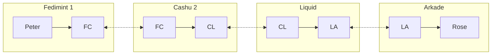

# Cassis, a new simple scheme for generic multi-layer multi-hop HTLC routing

andunie | 2026-10-08 18:09:24 UTC | #1

Bitcoin payments are now spread across many so-called "layers", and there isn't a sufficiently generic way to make payments between them. In most cases, each layer has to run a Lightning node, and its users are more or less dependent on that node's operator being online and liquid in order to make payments (note that each Fedimint counts as a separate "layer" in this scheme, as does each Cashu mint). Arkade takes a different approach with its [Intents](https://docs.arkadeos.com/intents/overview) protocol, which allows different "solvers" to route payments on behalf of users. Likewise, [Kaleidoswap](https://kaleidoswap.com/) appears to be building a generic HTLC-based swap network for sending Bitcoin across layers.

The idea behind [Cassis](https://cassis.cash/) is simple, almost obvious: if a layer can express an HTLC, it can be a hop. It has been voiced before, most recently by Giacomo Zucco, but perhaps precisely because it is so obvious, it has lacked an actual implementation. Cassis is an effort to build one. A payment is a chain of HTLCs across different layers, all locked to the same SHA-256 hash, with timeouts decreasing toward the receiver. The receiver reveals the preimage to claim the last hop, and settlement unwinds backwards.

This approach has several advantages. Depending on the layers chosen for a route, payments can settle instantly, and they can also be almost unfairly cheap. Receiving while offline may be workable as well. Above all, each user is free to pick their own tradeoffs between privacy, security and custody, simply by choosing which layer to hold funds in, without losing the ability to pay or be paid by anyone else.

A routing node can be any node that has funds in at least two layers. If a node **FC** has funds in **Fedimint 1** and in **Cashu 2**, it can route a payment from a payer on **Fedimint 1** to a payee on **Cashu 2**, or the other way around.

Routing can also be multi-hop, since any node in a given layer can pay any other node in that same layer directly. Given a node **CL** with funds in **Cashu 2** and **Liquid**, and a node **LA** with funds in **Liquid** and **Arkade**, a payment can go from **Peter**, who only has a Fedimint 1 wallet, to **Rose**, who only has an Arkade wallet, passing through **FC**, **CL** and **LA**:

A Rust implementation is available at https://github.com/cassiscash/cassis , with adapters for Lightning, Liquid, Cashu, Fedimint, Arkade, Rootstock and on-chain Bitcoin. Both the implementation and the website are experimental and unfinished.

The hardest open problems are:

* **Communication between nodes:** currently handled with barely standardized JSON messages sent over Iroh connections.
* **Router announcements:** currently each node simply advertises itself on public Nostr relays.
* **Reputation of routing nodes and senders:** needed so that payments don't fail and routers don't lose money by locking funds in HTLCs they later have to reclaim. The current approach gives payers and routers stable identities, but the code doesn't yet distinguish between them.
* **Invoice format:** the original invoice was a plain JSON object containing the receiving parameters. Work is now underway on making a separate, richer payment protocol based on Iroh communication.
* **Offline receive:** this could potentially be solved by delegating the preimage release to a trusted third party or a federation, as Fedimint does, but it hasn't been investigated yet.

-------------------------

